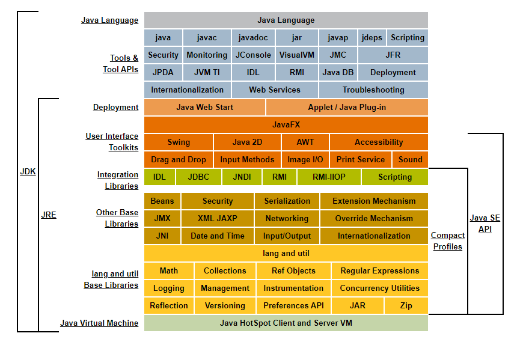
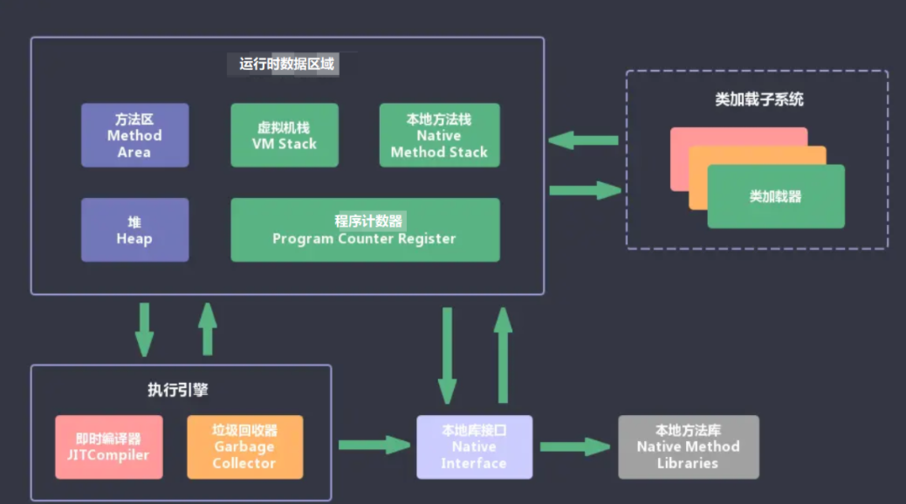
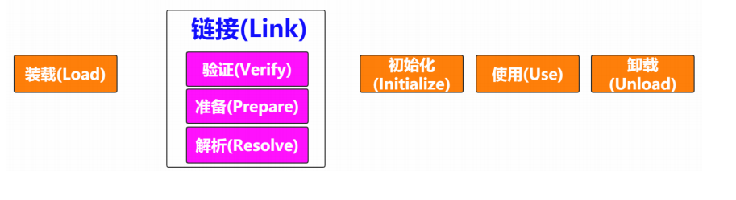
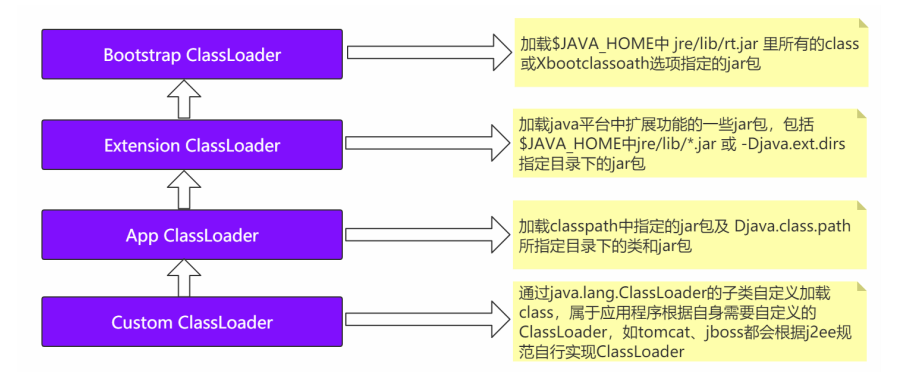
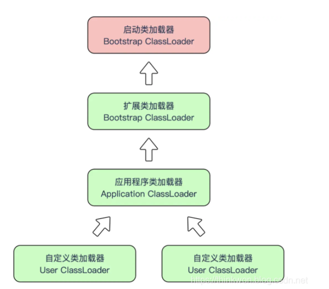
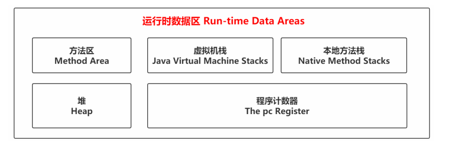
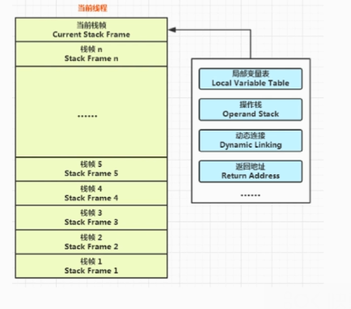
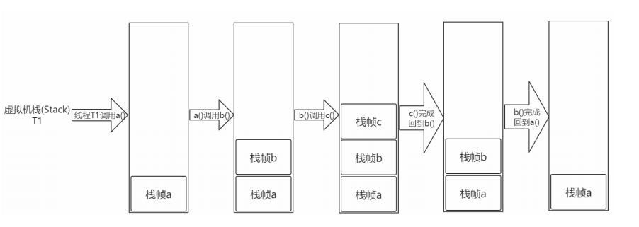

# 【JVM篇】一、初识JVM-Java内存区域详解

## 01 JDK JRE JVM

- JDK（Java Development Kit）: 是针对Java开发程序员的产品，包含了**Java运行环境JRE**，**Java工具**和**Java基础类库**。
- JRE（Java Runtime Environment）：运行Java程序所必须的环境的集合，包含**JVM标准实现**以及**Java核心类**库。
- JVM（Java Virtual Machine）：是整个Java实现跨平台的最核心的部分。所有的Java程序首先会被编译成.class的类文件，这种类文件可以在虚拟机上运行。**但解释class文件的时候JVM需要解释所需要的类库lib**。

> **谈谈反射**
>
> Java反射机制是在运行状态中，**对于任意一个类，都能够知道这个类的所有属性和方法**；对于任意一个对象，**都能够调用它的任意方法和属性**；这种动态获取信息以及动态调用对象的方法的功能称之为Java语言的反射机制。

## 02 JVM的主要组成部分以及作用？

JVM包含两个子系统和两个组件。两个子系统为**Class loader(类加载**)、**Execution engine(执行引擎)**；两个组件为**Runtime data  area(运行时数据区)**、**Native Interface(本地接口)**

- Class loader（类加载）：根据给定的全限定名类名(如：java.lang.Object)来装载class文件到Runtime data area中的method area。
- Execution engine（执行引擎）：执行classes中的指令。
- Native Interface(本地接口)：与native libraries交互，是其它编程语言交互的接口。
- Runtime data area(运行时数据区域)：这就是我们常说的JVM的内存。

**作用** ：**首先通过编译器把 Java 代码转换成字节码，类加载器（ClassLoader）再把字节码加载到内存中，将其放在运行时数据区（Runtime data area）的方法区内，而字节码文件只是 JVM 的一套指令集规范，并不能直接交给底层操作系统去执行，因此需要特定的命令解析器执行引擎（Execution Engine），将字节码翻译成底层系统指令，再交由 CPU 去执行，而这个过程中需要调用其他语言的本地库接口（Native Interface）来实现整个程序的功能。**

## 03 Java源文件到JVM的过程

IDEA集成开发工具编写的Java源代码，通过编译器(javac)命令编译成字节码文件(.class文件)，之后类加载器将这些.class文件加载到JVM中。

其中类的加载指的是将类的.class文件中的二进制数据读入到内存中, 将其放在运行时数据区的方法区内，然后在堆区创建一个java.lang.Class对象，用来封装在方法区内的数据结构。

### 2.1 源码编译到class类文件

**源码**

**编译过程**

对上述的Person.java文件进行编译到class类文件。

> javac Person.java ---> Person.class

**class字节码文件**

> 魔数与class文件版本
>
> 常量池
>
> 访问标志
>
> 类索引、父类索引、接口索引
>
> 字段表集合
>
> 方法表集合
>
> 属性表集合

### 2.2 class类文件加载到JVM虚拟机中

- **装载**（Load）：**查找和导入class文件**
  - 通过**一个类的全限定名获取定义此类的二进制字节流**
  - 将这个字节流所代表的的**静态存储结构**转换为**方法区的运行时数据结构**
  - 在**Java堆中生成一个代表这个类的java.lang.Class对象**，作为**对方法区中这些数据的访问入口**。
- **链接**（Link）
  - **验证**（Verify）：**保证被加载类的正确性**
  - **准备**（Prepare）：为**类的静态变量分配内**存，并将其初始化为默认值
  - **解析**（Resolve）：将**类中的常量池中的符号引用转换为直接引用**
- **初始化**（Initialize）：如果**有父类的初始化，初始化父类，否则调用自身的初始化方式。**

## 04 JVM内存区域-类装载器

虚拟机把描述类的数据从Class文件加载到内存，并对数据进行校验，解析和初始化，最终形成可以被虚拟机直接使用的Java类型。

> 在装载（Load）阶段，其中第（1）步：通过一个类的全限定名获取定义此类的二进制字节流，需要借助类装载器来完成。

### 4.1 描述一下JVM加载Class文件的原理机制

Java中的所有类，都需要由类加载器装载到JVM中才能运行。类加载器本身也是一个类，而它的工作就是把class文件从硬盘读取到内存中。在写程序的时候，我们几乎不需要关心类的加载，因为这些都是**隐式装载**的，除非我们有特殊的用法，像是反**射，就需要显式的加载所需要的类。**

类加载的方式，有两种：

- **隐式装载**，程序在运行过程中当碰到通过**new等方式生成对象时，隐式调用类装载器加载对应的类到JVM中**
- **显式装载**，通过**class.forName()等方法**，显式加载需要的类

**Java类的加载是动态的，它并不会一次性将所有类全部加载后再运行**，而是保证程序运行的基础类(像是基类)完全加载到JVM中，至于其它类，则在需要的时候才加载，而这是为了节省内存开销。

### 4.2 什么是类加载器，类加载器有哪些?

类加载器：实现通过类的权限定名获取该类的二进制字节流的代码块叫做类加载器。

主要有以下四种类加载器：

- **启动类加载器(Bootstrap ClassLoader)：** 用来加**载Java核心类库**，无法被Java程序直接引用
- **扩展类加载器(extensions ClassLoader)：**用来**加载Java的扩展库**。Java虚拟机的实现会提供一个扩展库目录。该类加载器在此目录里面查找并加载Java类。
- **系统类加载器(system ClassLoader):** 它**根据Java应用的类路径(CLASSPATH)来加载Java类**。一般来说，Java应用的类都是由它来完成加载的。可以通过CLASSLoader.getSystemClassLoader()来获取它
- **用户自定义类加载器**，通过继承java.lang.ClassLoader类的方式实现

### 4.3 说一下类加载的执行过程

类加载分为以下5个步骤：

- **加载：**根据查找路径找到相应的class文件然后导入，即通过类的全限定名获取此类的二进制字节流，并将这个字节流所代表的静态存储结构转换为方法区的运行时数据结构，并在Java堆中生成一个代表此类的java.lang.Class对象，作为对方法区中这些数据的访问 
- **验证： **  **检查加载的class文件的正确性；**
- **准备：**    **给类中的静态变量分配内存空间；**
- **解析： **  **虚拟机将常量池中的符号引用替换成直接引用的过程。**符号引用就理解为一个标识，而在直接引用直接指向内存中的地址；
- **初始化：**     **对静态变量和静态代码块执行初始化工作；**

> 

> 对于任意一个类，都需要由加载它的类加载器和这个类本身一同确立在JVM中的唯一性，每一个类加载器，都有一个独立的类名称空间。类加载器就是根据指定全限定名称将class文件加载到JVM内存，然后再转换为class对象。
>
> **类从编译到执行的过程：**
>
> - 编译器将Robot.java源文件编译为Robot.class字节码文件
> - ClassLoader将字节码转换为JVM中的CLass<Robot>对象；
> - JVM利用Class<Robot>对象实例化为Robot对象；

**面试题目：类加载过程**

- **加载**
  - 通过一个类的全限定名来获取此类的二进制字节流；
  - 将这个字节流所代表的的静态存储结构转换为方法区的运行时数据结构；
  - 在内存中生成一个代表这个类的java.lang.Class对象，作为方法区这个类的各种数据的访问入口；
- **验证：**确保class文件的字节流是否符合当前虚拟机的要求，并且不会危害虚拟机自身的安全；
- **准备：**为类变量分配内存并设置初始值；
- **解析：**虚拟机将常量池中的符号引用替换为直接应用；
- **初始化：**开始执行java程序代码  

**面试题目：类加载器**

通过类加载器来实现类加载机制。

任意一个类在Java虚拟机中的唯一性由这个类本身和加载它的类加载器确定。

> 两个类是否相等，即使这个类同一个class文件，被同一个虚拟机加载，但只有加载它们的类加载器不同，这两个类就不相等。

**面试题目：类加载器的双亲委派机制**

Java自带的类加载器：

- 启动类加载器（Boostrap ClassLoader）
- 扩展类加载器（Extension ClassLoader）
- 应用程序类加载器（Application ClassLoader）

如图所示，这种层次关系，成为类加载的双亲委派机制。

双亲委派模型是指：如果一个类收到了类加载的请求，不会自己先尝试加载。而是先找父类加载器去完成。当顶层启动类加载器表示无法加载这个类的时候，子类才会尝试自己去加载。 当回到最初的发起者加载器还无法加载时，并不会向下找，而是抛出classnotfoundexception。

**为什么要使用双亲委派机制去加载类？**

- 避免多份同样字节码的加载；

### 4.4 类的加载方式

- 隐式加载：new；
- 显式加载：loadClass，forName等；

**loadClass和forName的区别**

- Class.forName得到的class是已经初始化完成的；
- Classloader.loadClass得到的class是还没有链接的；

> 可去JMM内存模型

## 05 JVM内存区域-运行时数据区（Run-Time Data Areas）

**Java虚拟机在执行Java程序的过程中会把它所管理的内存区域划分为若干个不同的数据区域。**这些区域都有各自的用途，以及创建和销毁的时间，有些区域随着虚拟机进程的启动而存在，有些区域则是依赖线程的启动和结束而建立和销毁的。

> 在装载(Load)阶段的(2)(3)步可以发现时运行数据、堆、方法区等名词。
>
> （2）**将这个字节流所代表的静态存储结构转换为方法区的运行时数据结**构
>
> （3）**在Java堆中生成一个代表这个类的java.lang.Class对象，作为对方法区中这些数据的访问入口**、
>
> 即类文件被类装载器装载进来之后，类中的内容(比如变量、常量、方法、对象等这些数据要有个去处，需存储起来，存储的位置在JVM中有对应的空间)

不同虚拟机的运行时数据区可能略微有所不同，但都会遵从Java虚拟机规范，其将规定的区域分为以下5个部分：

- **程序计数器(Program counter register):当前线程所执行的字节码的行号指示器**，字节码解析器的工作是通过改变这个计数器的值，来选取下一条需要执行的字节码指令，分支、循环、跳转、异常处理、线程恢复等基础宫那个，都需要依赖这个计数器来完成；

- Java虚拟机栈(Java virtual machine stacks): 用于**存储局部变量表、操作数栈、动态链接、方法出口等信息；**

  

- 本地方法栈(Native Method stack)：与虚拟机栈的作用是一样的，只不过**虚拟机栈是服务Java方法的，而本地方法栈是为虚拟机调用Native方法服务的**。

- Java堆(Java Heap)：**Java虚拟机中内存最大的一块，是被所有线程共享的，几乎所有的对象实例都在这里分配内存**。

- 方法区(Method Area)：用于**存储已被虚拟机加载的类信息、常量、静态变量、即时编译后的代码等数据**。

### 5.1 方法区（Method Area）

方法区是各个线程共享的内存区域，用于存储已被虚拟机加载的**类信息、常量、静态变量、即时编译器编译后的代码等数据**。

**注意：**

- 方法区是JVM的一个概念定义，并不是具体的实现。在JDK1.8之后用的**元空间**来实现的方法区；在JDK1,8之前用的**永久代**实现的方法区。（此外元空间是使用**本地内存**Native Memory实现的，也就是它的内存不是在虚拟机内的，不受限与**JVM本身分配的内存**。此外**JDK1.8中JVM把字符串常量池移到了堆内存中**。）
- 运行时常量池：方法区还包含了一个运行时常量池用于存放编译时期生成的字面量和符号引用。

> 当方法区无法满足内存分配需求时，将抛出OutOfMemoryError异常。

> **MetaSpace相比PermGen的优势：**
>
> - 字符串常量池存在永久代中，容易出现性能问题和内存溢出；
> - 类和方法的信息大小难易确定，给永久代的大小指定带来困难；
> - 永久代会给GC带来不必要的复杂性；

### 5.2 堆（Heap）

Java堆是Java虚拟机所管理的内存中最大的一块。Java堆是被所有线程共享的一块内存区域。**所有的对象实例以及数组都在堆上分配空间。**

> 如果在堆中没有内存完成实例分配，并且堆也无法再扩展时，将会抛出OutOfMemoryError异常。

### 5.3 虚拟机栈（Java Virtual Machine Stacks）

**虚拟机栈是Java方法执行的内存模型。**每个方法在执行的时候都会创建一个**栈帧**用于存储**局部变量表**、**操作数栈**、**动态链接**、**方法出口**等信息。

> 虚拟机栈是一个线程执行的区域，保存着一个线程中方法的调用状态。换句话说，一个Java线程的运行 状态，由一个虚拟机栈来保存，所以虚拟机栈肯定是线程私有的，独有的，随着线程的创建而创建。 每一个被线程执行的方法，为该栈中的栈帧，即每个方法对应一个栈帧。 调用一个方法，就会向栈中压入一个栈帧；一个方法调用完成，就会把该栈帧从栈中弹出。
>
> 

> **注意：**

> 在Java虚拟机规范中，对这个区域规定了两种异常状况：
>
> - 如果线程请求的栈深度大于虚拟机所允许的深度，将抛出StackOverflowError异常；
>
> - 如果虚拟机栈可以动态扩展，如果扩展时无法申请到足够的内存，就会抛出OutOfMemoryError异常。

### 5.4 本地方法栈（Native Method Stack）

本地方法栈与虚拟机栈所发挥的作用是非常相似的，只不过**本地方法栈为虚拟机使用到的Native方法服务。**

> 与虚拟机栈一样，本地方法栈区域也会抛出StackOverflowError和OutOfMemoryError异常。

### 5.5 程序计数器（Program Computer Register）

**程序计数器可以看成当前线程所执行的字节码的行号指令器。**

> 由于Java虚拟机的多线程是通过线程轮流切换并分配处理器执行时间的方式来实现的，在任何一个确定的适合，一个处理器都只会执行一条线程中的指令。因此，为了线程切换后能恢复到正确的执行位置，每条线程都需要有一个独立的程序计数器，各条线程之间计数器互不影响，独立存储。

如果线程正在执行Java方法，则计数器记录的是正在执行的虚拟机字节码指令的地址；

如果线程正在执行Native方法，则这个计数器会空。

> 此内存区域是唯一一个在Java虚拟机规范中没有规定任何OutOfMemoryError情况的区域。

## 06 题目

### 6.1 深拷贝和浅拷贝的区别是什么?

**浅拷贝(shallowCopy)只是增加了一个指针指向已存在的内存地址**；

**深拷贝(deepCopy)是增加了一个指针并且申请了一个新的内存，使这个增加的指针指向这个新的内存；**

使用深拷贝的情况下，释放内存的时候不会因为出现浅拷贝时释放同一个内存的错误。

浅复制：仅仅是指向被复制的内存地址，如果原地址发生改变，那么浅复制出来的对象也会相应的改变。

深复制：在计算机中开辟一块新的内存地址用于存放复制的对象。

### 6.2 JVM中堆栈的区别是什么？

**1.物理地址：**

**堆**的物理地址分配对象是不连续的，性能上稍慢。在GC的时候也要考虑到不连续的分配，所以有各种算法。比如：标记-清除、复制、标记-压缩、分代(即新生代使用复制算法，老年代使用标记-压缩)

**栈**使用的数据结构中的栈，先进后出的原则，物理地址分配是连续的，性能快。

**2.内存分配：**

**堆**因为是不连读的，所以分配的内存是在**运行期**确认的，因此大小不固定，一般堆大小远远大于栈。

**栈**是连续的，所以分配的内存大小要在**编辑期**就确认，大小是固定的。

**3.存放的内容：**

**堆**存放的是对象的实例和数组，因此该区更关注的是数据的存储。

**栈**存放的是局部变量，操作数栈，返回结果。该区更关注是程序方法的执行。

> 补充：
>
> 静态变量放在方法区；
>
> 静态的对象放在堆中；

**4.程序的可见性**

**堆**对于整个应用程序都是共享、可见的。

**栈**只对于线程是可见的，所以也是线程私有，其生命周期和线程相同。

### 6.3 队列和栈是什么？有什么区别？

队列和栈都是被用来预存储数据的。

- **操作的名称不同**。队列的插入称为入队，队列的删除称为出队。栈的插入称为进栈，栈的删除称为出栈。
- **可操作的方式不同**。队列是在队尾入队，队头出队，即两边都可操作。而栈的进栈和出栈都是在栈顶进行的，无法对栈底直接进行操作。
- **操作的方法不同**。队列是先进先出（FIFO），即队列的修改是依先进先出的原则进行的。新来的成员总是加入队尾（不能从中间插入），每次离开的成员总是队列头上（不允许中途离队）。而栈为后进先出（LIFO）,即每次删除（出栈）的总是当前栈中最新的元素，即最后插入（进栈）的元素，而最先插入的被放在栈的底部，要到最后才能删除。