# 【JVM篇】二、JVM进行篇-虚拟机对象详解

## 01 结合字节码指令深入理解Java虚拟机栈和栈帧

**Java虚拟机栈描述的是Java方法执行的内存模型**。每个Java方法执行的时候都会创建一个栈帧。

每个**栈帧**中包括**局部变量表(Local Variables)**、**操作数栈（Operand Stack）**、**指向运行时常量池的引用**（A reference to the run-time constant pool）、**方法返回地址（**Return Address）和附加信息。

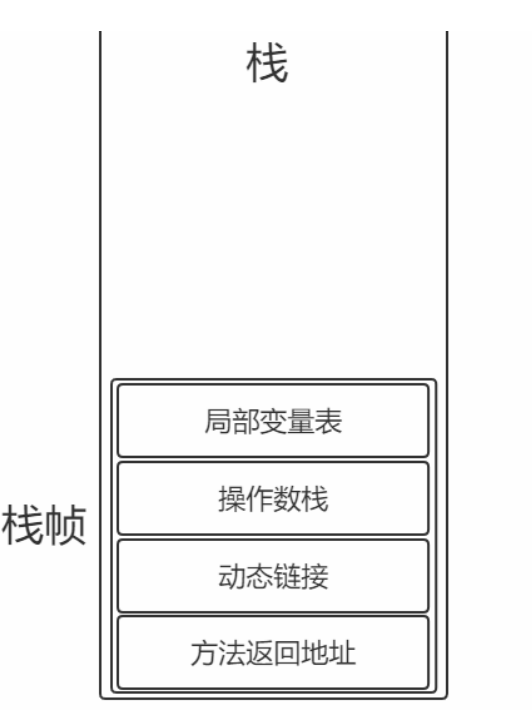

> 局部变量表**：方法中定义的局部变量以及方法参数存储在这张表中**
>
> 局部变量中的变量不可直接使用，如需要使用的话，必须通过相关指令将其加载至操作数栈中作为操作数使用。


> 操作数栈：**以压栈和出栈 的方式存储操作数**


> 动态链接：每个栈帧都包含**一个指向运行时常量池中该栈帧所属方法的引用**，持有这个引用是为了支持方法调用过程中的动态连接。


> 方法返回地址：当一个方法开始执行后，只有两种方式可以退出，一种是**遇到方法返回的字节码指令**；另一种是**遇见异常**，并且这个异常没有在方法体内得到处理。

```java
class Person{
    private String name="Jack";
    private int age;
    private final double salary=100;
    private static String address;
    private final static String hobby="Programming";
    public void say(){
        System.out.println("person say...");
    }
    public static int calc(int op1,int op2){
        op1=3;
        int result=op1+op2;
        return result;
    }
    public static void order(){
        
    }
    public static void main(String[] args){
        calc(1,2);
        order();
        }
}
```


```java
Compiled from "Person.java"
class Person {
	...
	public static int calc(int, int);
        Code:
    0: iconst_3 //将int类型常量3压入[操作数栈]
    1: istore_0 //将int类型值存入[局部变量0]
    2: iload_0 //从[局部变量0]中装载int类型值入栈
    3: iload_1 //从[局部变量1]中装载int类型值入栈
    4: iadd //将栈顶元素弹出栈，执行int类型的加法，结果入栈
        【For example, the iadd instruction (§iadd) adds two int values together. It
        requires that the int values to be added be the top two values of the operand stack, pushed
        there by previous instructions. Both of the int values are popped from the operand stack.
        They are added, and their sum is pushed back onto the operand stack. Subcomputations may be
        nested on the operand stack, resulting in values that can be used by the encompassing
        computation.】
    5: istore_2 //将栈顶int类型值保存到[局部变量2]中
    6: iload_2 //从[局部变量2]中装载int类型值入栈
    7: ireturn //从方法中返回int类型的数据
	...
}
```

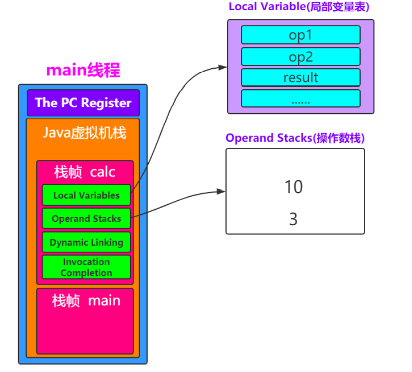

### 1.1 例子1-栈指向堆

如果在栈帧中有一个变量，变量为引用类型，比如Object obj = new Object()。这就是典型中的栈中元素指向堆中的对象。

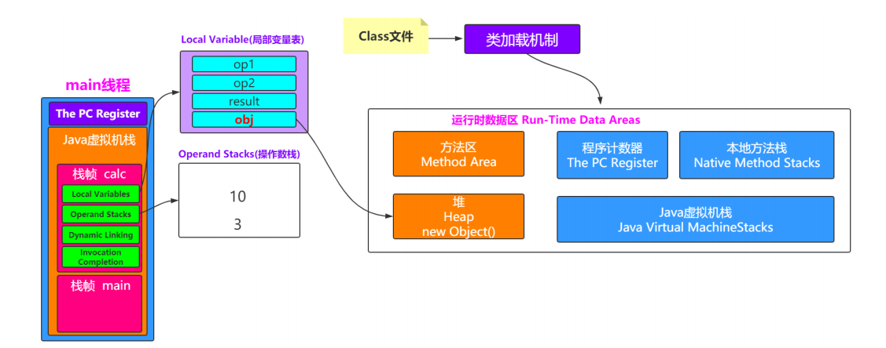

### 1.2 例子2-方法区指向堆

方法中存放了类的信息、常量、静态变量、JTT编译后的代码数据。类似private static Object obj = new Object();

类在刚加载的时候，会把class字节码文件的静态存储结构加载到方法区内；并在堆中创建一个class对象，以便调用方法区的数据结构；

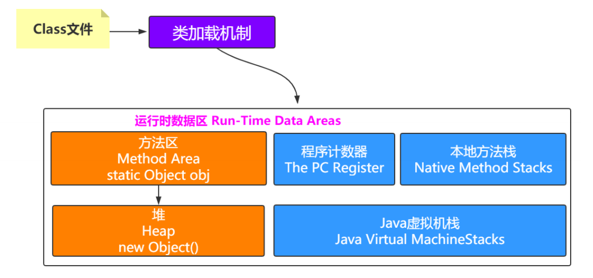

### 1.3 堆指向方法区

方法区中会包含类的信息，堆中会有对象，那么怎么知道对象是哪个类创建的呢？

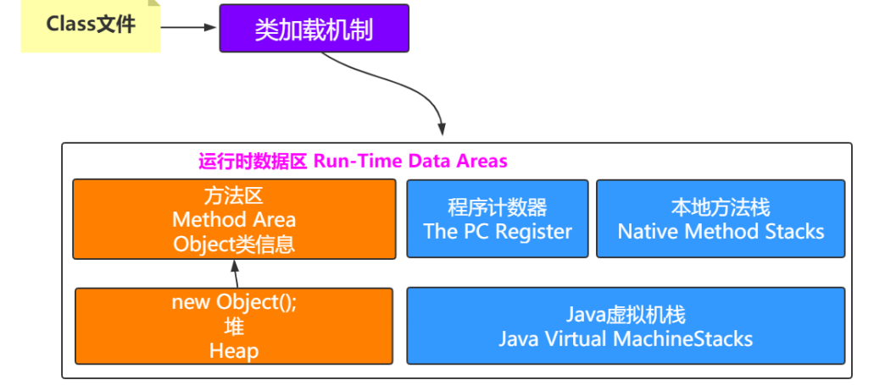


## 02 虚拟机对象探秘

### 2.1 对象的创建

说到对象的创建，首先先来看看Java中提供的几种对象创建方式：

| Header                             | 解释             |
| ---------------------------------- | ---------------- |
| 使用new关键字                      | 调用了构造函数   |
| 使用Class的newInstance方法         | 调用了构造函数   |
| 使用Constructor类的newInstance方法 | 调用了构造函数   |
| 使用clone方法                      | 没有调用构造函数 |
| 使用反序列化                       | 没有调用构造函数 |

对象创建的主要流程:

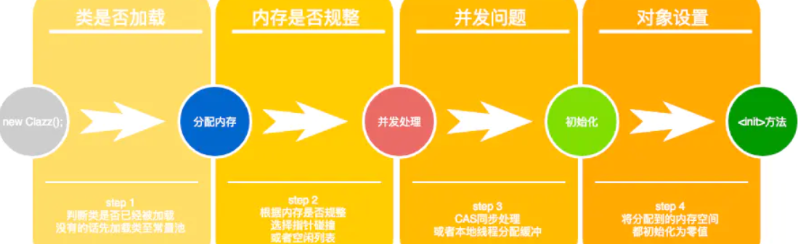

### 2.2 为对象分配对象

类加载完成后，接着会在Java堆中划分一块内存分配给对象。内存分配根据Java堆是否规整，有两种方式：

- 指针碰撞：如果Java堆的内存是规整，即所有用过的内存放在一边，而空闲的放在另外一边。分配内存时将位于中间的指针指示器向空闲的内存移动一段与对象大小相等的距离，这样便完成分配内存工作。
- 空闲列表：如果Java堆的内存不是规整的，则需要由一个虚拟机维护一个列表来记录那些内存是可用的，这样在分配的是可以从列表中查询到足够大的内存分配给对象，并在分配后更新列表记录。

选择哪种分配方式是由 Java 堆是否规整来决定的，而 Java 堆是否规整又由所采用的垃圾收集器是否带有压缩整理功能决定。

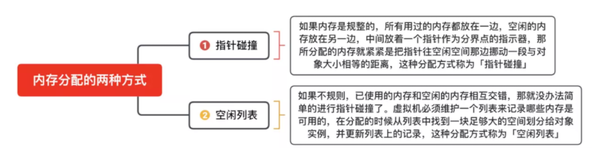

### 2.3 处理并发安全问题

对象的创建在虚拟机中是一个非常频繁的行为，哪怕只是修改一个指针所指向的位置，在并发情况下也是不安全的，可能出现正在给对象A分配内存，指针还没来得及修改，对象B又同时使用了原来的指针来分配内存的情况。解决这个问题有两种方案：

- 对分配内存空间的动作进行同步出来（采用CAS+失败重试来保障更新操作的原子性）；
- 把内存分配的动作按照线程划分在不同的空间之中进行，即每个线程在 Java 堆中预先分配一小块内存，称为本地线程分配缓冲（Thread Local Allocation Buffer, TLAB）。哪个线程要分配内存，就在哪个线程的 TLAB 上分配。只有 TLAB 用完并分配新的 TLAB 时，才需要同步锁。通过-XX:+/-UserTLAB参数来设定虚拟机是否使用TLAB。

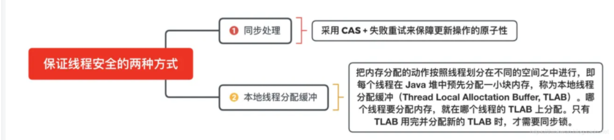

### 2.4 对象的访问定位

Java程序需要通过JVM栈上的引用访问堆中的具体对象。对象的访问方式取决于JVM虚拟机的实现。目前主流的访问方式有**句柄**和**直接指针**两种方式。

> 指针：指向对象，代表一个对象在内存中的起始地址；
>
> 句柄：可以理解为指向指针的指针，维护着对象的指针。句柄不直接指向对象，而是指向镀锡的指针（句柄不发生变化，指向固定内存地址），再由对象的指针指向对象的真实内存地址。

#### 1.句柄访问

Java堆中划分出一块内存来作为句柄池，引用中存储对象的句柄地址，而句柄中包含了对象实例数据与对象类型数据各自的具体地址信息，具体构造如下图所示：

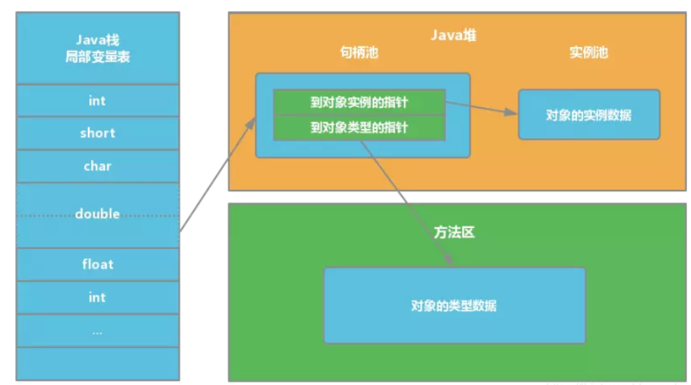

**优势**：引用中存储的是**稳定**的句柄地址，在对象被移动（垃圾收集时移动对象是非常普遍的行为）时只会改变**句柄中**的**实例数据指针**，而**引用**本身不需要修改。

#### 2.直接指针

如果使用直接指针访问，引用中存储的直接就是对象地址，那么Java堆对象内部的布局中就必须考虑如何放置访问类型数据的相关信息。

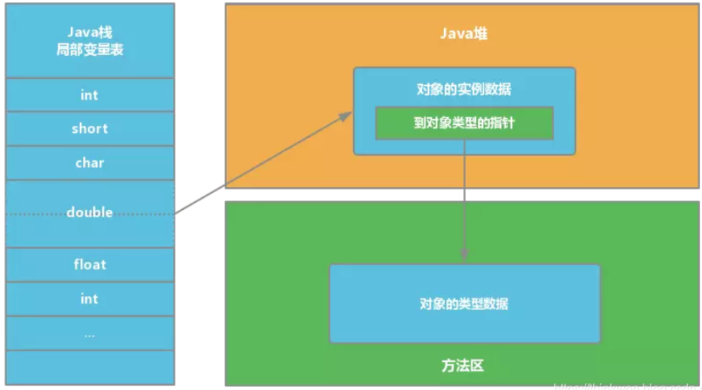

**优势**：速度更**快**，节省了**一次指针定位**的时间开销。由于对象的访问在`Java`中非常频繁，因此这类开销积少成多后也是非常可观的执行成本。HotSpot 中采用的就是这种方式。


> 补充：
>
> **对象实例数据**就是有关这个对象的数据，即**对象实例化后在堆中保存的数据**；
>
> **对象类型数据**在方法区，方法区里面主要存**一些类的信息（静态变量、被虚拟机加载的类信息）**
>
> ```txt
> 对象实例数据（堆）:对象中各个实例字段的数据`
> `对象类型数据（方法区）：对象的类型、父类、实现的接口、方法等`
> `静态区（也在方法区中）用来存放静态变量，静态块
> ```

##  03 深入理解Java的堆内存模型

> 思考 ：一个对象怎么知道它是由哪个类创建出来的？怎么记录？这就需要了解一个Java对象的具体信息。

### 3.0 Java内存分配策略

**总结：**

Java内存管理，最终要解决两个问题：内存分配与内存回收。

针对内存分配，一般来说，新创建的对象都在新生代中的Eden区，而特殊的大对象是直接创建在老年代中。

当新生代中的Eden区内内存不足时，会发生一次Minor GC的操作，Minor GC会清理掉一部分垃圾对象，当然也有一部分存活对象。存活对象会被送往新生代的Survior区内。在Survior区内有两个分区，一个是From Survior，另外一个是To Survior。同一个时间点内，s0和s1只有一个分区内有数据。eden区内存活的对象会直接送入to survior分区，而对于from survior分区中的对象有两个去处，会对其年龄+1，如果到达默认值15，会送往old老年代分区内，不够的话，会到达to分区，之后翻转。如果to分区到达临界值，会触发一次major gc。将其送往老年代。


#### 问题1：简述Java内存分配与回收策略以及Minor GC和Major GC

所谓内存管理，最终要解决就是两个**内存分配**与**内存回收**这两个问题。在下一节将会介绍内存回收，这里先来聊聊内存分配。

**对象的内存分配**通常是在**Java堆上分配**(随着虚拟机优化技术的诞生，某些场景下也会在栈上分配)，对象主要分配在**新生代的Eden区**，如果启动了本地线程缓冲，将按照线程优先在TLAB上分配。少数情况下也会直接在老年代上分配。总的来说分配规则不是百分百固定的，其细节取决于哪一种垃圾收集器以及虚拟机相关参数有关，但是虚拟机对于内存的分配还是会遵循以下几种【普遍规则】：

**对象优先在Eden区分配**

多数情况，**对象都在新生代Eden区分配**。当Eden区分配没有足够的空间进行分配时，**虚拟机将会发起一次Minor GC**。如果本次GC后还是没有足够的空间，则将启用分配担保机制在老年代中分配内存。

> 补充，这里提到的Minor GC，如果我们仔细观察GC日常，通常还能从日志中发现Major GC/Full GC.
>
> - **Minor GC**是指发生在**新生代的GC**，因为Java对象大多都是朝生夕死，所以Minor GC非常频繁，一般回收速度也非常快。
> - **Major GC/Full GC**是指发生在**老年代的GC**，出现了Major GC通常会伴随至少一次Minor GC。Major GC的速度通常会比Minor GC慢10倍以上。


**大对象直接进入老年代**

所谓大对象是指需要大量连续内存空间的对象，频繁出现大对象是致命的，会导致在内存还有不少空间的情况下提前触发GC以获取足够的连续空间来安置新对象。

后文介绍过新生代使用的是标记-清除算法来处理垃圾回收的，如果大对象直接在新生代分配就会导致 Eden 区和两个 Survivor 区之间发生大量的内存复制。因此对于**大对象都会直接在老年代进行分配**。

**长期存活对象将进入老年代**

虚拟机采用分代收集的思想来管理内存，那么内存回收时就必须判断哪些对象应该放在新生代，哪些对象应该放在老年代。因此虚拟机给每个对象定义了一个对象年龄的计数器，如果对象在Eden区出生，并且能够被Survivor容纳，将被移动到Survivor空间中，这是设置对象年龄为1。**对象在Survivor区中每熬过一次Minor GC年龄就加1，当年龄达到一定程度(默认为15)就会被晋升到老年代**。


### 3.1 Java对象内存布局

一个Java对象在内存中包括3个部分：对象头、实例数据和对齐填充。

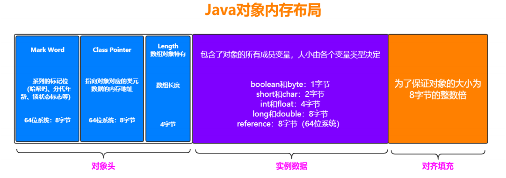

### 3.2 堆的内存模型

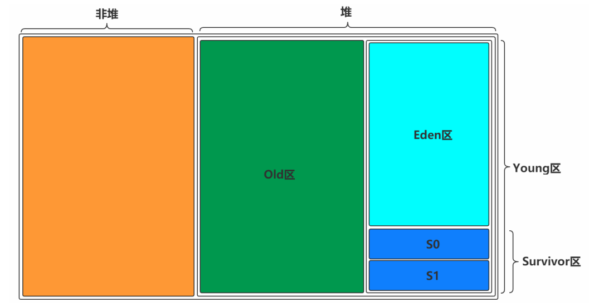

内存模型分为两块：一块是非堆区，一块是堆区。

堆区分为两大块：一块是**Young区（新生代）**，一块是**Old区（老年代）**。

Young区分为两大块：一个是**Survivor区(s0+s1)**，一个**是Eden区**。其中s0和s1一样大，也被称为From Survivor空间和To Survivor空间。 Eden:s0:s1=8:1:1。

#### 3.2.1 对象创建的区域

一般情况下，新创建的对象都会被分配到Eden区，一些特殊大的对象会被直接分配到Old区。

> 比如有对象A，B，C等创建在Eden区，但是Eden区的内存空间非常有限，比如有100M，假如已经使用了100M或者达到了一个设定的临界值，这时候就需要对Eden内存空间进行清理，即垃圾收集(Garbage Collect)，这样的GC称之为**Minor GC**，Minor GC指的是Young区的GC.
>
> 经过GC之后，有些对象就会被清理掉，有些对象可以还存活，对于存活着的对象需要将其**复制到Survior区**，然后**再清空Eden区中的这些对象**。

#### 3.2.2 Survior区详解

Survivor区分为两块S0和S1,也可以叫做From Survior空间和To Survior空间。

**在同一个时间点上，S0和S1只能有一个区有数据，另外一个区是空的。**

> 接着上面的Minor GC来说，比如现在只有Eden区和From中有对象，To是空的。
>
> 此时再进行一次GC操作，From区中对象的年龄会+1，Eden区中的所有存活对象会被复制到To区，From区中还能存活的对象会有两个去处。
>
> 若对象年龄达到之前设置好的年龄阈值后，那么From区中的对象会被移动到Old区。如果Eden区和From区没有达到阈值的对象会被赋值到To区。此时Eden区和From区已经被清空了。（被GC的对象肯定没了，没有被GC的对象都有了各自的去处。）
>
> 这时候From和To互换角色，之前的From变成了To，之前的To变成了From。
>
> 从而保证了名为To的Survior的区域是空的。

Minor GC会一直重复这样的过程，直到To区被填满，然后会将所有对象复制到老年代中。

#### 3.2.3 Old区详解

从上面的分析可以看出，一般Old区都是年龄比较大的对象，或者相对超过了某个阈值的对象。 在Old区也会有GC的操作，Old区的GC我们称作为Major GC。


#### 3.2.4 常见问题

##### 问题1：堆为什么要分区？

堆之所以要分区是因为：**Java程序中不同对象的生命周期不同**，70%-99%的对象都是临时对象，这类对象在新生区“朝生夕死”。**如果没有分区，GC搜集垃圾需要对整个堆内存进行扫描**；**分区后，回收这些“朝生夕死”的对象，只需要在小范围的区域中（新生区）搜集垃圾**。所以，分区的唯一理由就是为了**优化GC性能**。

##### 问题2：为什么需要Survior区？只有Eden区不行吗？

**Survior的存在意义，就是减少被送到老年代的对象，进而减少Fll GC的发生**，Survivor的预筛选保证，只有经历16次Minor GC还能在新生代中存活的对象，才会被送到老年代当中。

**设置Survivor区的目的便是为了减少送到老年代的对象。**

##### 问题3：为什么需要两个Survior区？

最大的好处就是**解决了碎片化**。也就是说为什么一个Survivor区不行?第一部分中,我们知道了必须设置Survivor区。**假设 现在只有一个Survivor区**,我们来模拟一下流程: 刚刚新建的对象在Eden中,一旦Eden满了,触发一次Minor GC,Eden中的存活对象就会被移动到Survivor区。这样继续循 环下去,下一次Eden满了的时候,问题来了,此时进行Minor GC,Eden和Survivor各有一些存活对象,如果此时把Eden区的 存活对象硬放到Survivor区,很明显这两部分对象所占有的内存是不连续的,也就导致了内存碎片化。 永远有一个Survivor space是空的,另一个非空的Survivor space无碎片。

##### 问题4：新生代的内存比例为什么是8:1:1？

> GC是统计学测算出来当内存使用超过98%以上时，内存就应该被minor GC回收一次。但是在实际应用中，我们不能较真的给它们留下2%。即当内存使用达到98%时才GC就有点晚了，而是应该多预留10%的内存空间，而这预留下来的空间称之为S区。**S区是用来存储新生代GC存活下来的对象，而新生代GC算法使用的是复制回收算法。**

实际上GC发生在，新生代内存使用达到90%的时候开始进行的，复制存活的对象到S0区，GC结束后在S0区存活下来的对象，再下次GC的范围是eden和S0区，把这两部分存活的放入S1区，再进行交换。循环往复。**而这里的eden区和其中的s区合起来就是90%，GC就是清理它们，而始终保持其中一个S区是空留的。**

这样做的保证了GC算法的高效，只存在少量存活的对象，只需复制少量存活的对象，远远比标记和标记整理高效的多。

> **补充知识点：如何判断对象存活可用？**
>
> 如何判断对象存活可用，用**可达性分析法**来判断：通过一系列称为**GCRoot对象做起点**，从这些节点往下搜索，搜索所走过的路称为**引用链**，如果一个对象在引用链上，那么就是**可达的**，这种对象就需要**存活下来**。
>
> 而其中作为GC Roots的对象通常包括以下几种：
>
> - 当前**虚拟机栈中局部变量中的引用对象**；
> - 当前**本地方法栈中局部变量表中的引用对象**；
> - 方法区中类**静态属性引用**的对象；
> - 方法区中**常量引用**的对象；

##### 问题5：如何理解Minor/Major/Full GC?

- **Minor GC：新生代**
- **Major GC：老年代**
- **Full GC：新生代+ 老年代**

#### 3.2.5 对象在内存中的漂流记

> 我是一个普通的Java对象,我出生在Eden区,在Eden区我还看到和我长的很像的小兄弟,我们在Eden区中玩了挺长时间。有 一天Eden区中的人实在是太多了,我就被迫去了Survivor区的“From”区,自从去了Survivor区,我就开始漂了,有时候在 Survivor的“From”区,有时候在Survivor的“To”区,居无定所。直到我18岁的时候,爸爸说我成人了,该去社会上闯闯 了。 于是我就去了年老代那边,年老代里,人很多,并且年龄都挺大的,我在这里也认识了很多人。在年老代里,我生活了20年(每次 GC加一岁),然后被回收。	

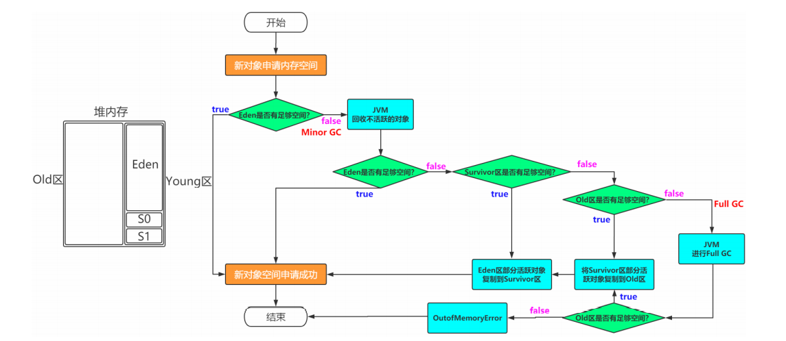

## 04 常见题目

### 问题一、Java会存在内存泄露吗？

内存泄露是指不再被使用的对象或者变量一直被占据在内存中。理论上来说**，Java是有GC垃圾回收机制的，也就是说，不再被使用的对象，会被GC自动回收掉，自动从内存中清除。**

但是，即使这样，Java也还是存在着内存泄露的情况，Java导致内存泄露的原因很明确：**长生命周期的对象持有短生命周期对象的引用就很可能发生内存泄露**，尽管短生命周期对象已经不再需要，但是因为长生命周期对象持有它的引用而导致不能被回收，这就是Java中内存泄露的发生场景。

### 问题二、JVM三大性能调优参数-Xms -Xmx -Xss的含义

`java -Xms128m -Xmx128m -Xss256k -jar xxxx.jar`

- -Xss：**规定了每个线程虚拟机栈(堆栈)的大小**；
- -Xms：**堆的初始值**
- -Xmx：**堆能达到的最大值**

### 问题三、Java内存模型中堆和栈的区别

**java内存模型中堆和栈的区别-内存分配策略**

- **静态存储**：编译时确定每个数据目标在运行时的存储空间需求；
- **栈式存储**：数据区需求在编译时未知，运行时模块入口前确定；
- **堆式存储**：编译时或运行时模块入口都无法确定，**动态分配**

**Java内存模型中堆和栈的区别：**

- 管理方式：栈自动释放，堆需要GC;
- 空间大小：栈比堆小；
- 碎片相关：栈产生的碎片远小于堆 
- 分配方式：栈支持静态和动态分配，而堆仅支持动态分配
- 效率：栈的效率比堆高

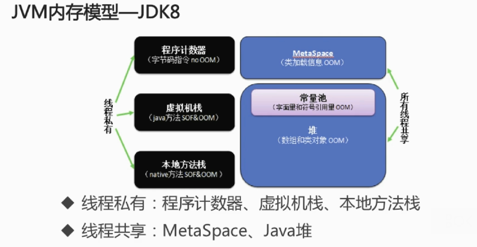