# 【JVM篇】三、JVM进阶篇-垃圾收集器GC

> 上一篇中提到了垃圾回收GC,本次将对其详细展开。

## 00 垃圾收集器

### 0.1 简述垃圾回收机制

在Java中，程序员是不需要显示的去释放一个对象的内存，而是由虚拟机自动执行。在JVM中，有一个垃圾回收线程，它是低优先级的，在正常情况下是不会执行的，只有在虚拟机空闲时或者当前堆内存不足时，才会触发执行，打扫那些没用被任何引用的对象，并将它们添加到要回收的集合中，进行回收。

### 0.2 GC是什么？为什么要GC？垃圾回收的优点

**GC(Gabage Collection)是垃圾收集的意思,** 内存处理是编程人员容易出现问题的地方，忘记或者错误的内存回收会导致程序或系统的不稳定甚至崩溃，Java提供的GC功能可以自动监测对象是否超过作用域从而达到自动回收内存的目的。

**垃圾回收机制的存在，使得Java中的对象不再有“作用域”的概念，只有引用的对象采用“作用域”。其有效的防止了内存泄露，可以有效的使用可使用的内存。**

### 0.3 垃圾回收器的基本原理是什么？垃圾回收器可以马上回收内存吗？有什么办法主动通知虚拟机进行垃圾回收？

对于GC来说，当程序员创建对象时，GC就开始监控这个对象的地址、大小以及使用情况。

通常，GC采用**有向图的方式记录和管理**堆(heap)中的所有对象。通过这种方式确定哪些对象是“可达的”，哪些对象是“不可达的”。当GC确定一些对象为不可达时，GC就有责任回收这些内存空间。

可以。程序员可以手动执行System.gc(),通知GC运行，但是Java语言规范并不保证GC一定会执行。

### 0.4 Java中都有哪些引用类型

- 强引用：发生 gc 的时候不会被回收。
- 软引用：**有用但不是必须的对象，在发生内存溢出之前会被回收。**
- 弱引用：**有用但不是必须的对象，在下一次GC时会被回收。**
- 虚引用（幽灵引用/幻影引用）：无法通过虚引用获得对象，用 PhantomReference 实现虚引用，虚引用的用途是在 gc 时返回一个通知。

## 01 如何确定一个对象是垃圾？

首先要进行垃圾回收，首先要确定什么样的对象是垃圾。

### 1.1 引用计数法

对于某个对象而言，只要应用程序中持有该对象的引用，就 说明该对象不是垃圾，如果一个对象没有任何指针对其引用，那么该对象就是垃圾。

弊端：如果AB两个对象相互持有引用，那么就导致永远不能被回收。

### 1.2 可达性分析

**通过GC Root的对象，开始向下寻找，看某个对象是否可达。**

> 能作为GC Root的对象：
>
> 类加载器、Thread、虚拟机栈的局部变量表中的引用对象、本地方法栈中局部变量表中的引用对象、方法区中的静态属性引用的对象、方法区中常量引用的对象等。

### 1.3 怎么判断对象是否可以被回收？

垃圾收集器在做垃圾回收的时候，首先需要判定的就是哪些内存是需要被回收的，哪些对象是「存活」的，是不可以被回收的；哪些对象已经「死掉」了，需要被回收。

一般有两种方法来判断：

- **引用计数器法：**为每个对象创建一个引用计数，有对象引用时计数器 +1，引用被释放时计数 -1，当计数器为 0 时就可以被回收。它有一个缺点不能解决循环引用的问题；

  - 优点：执行效率高，程序执行受影响较小；
  - 缺点：无法检测出循环引用的情况，导致内存泄露；

- **可达性分析算法：**从 GC Roots 开始向下搜索，搜索所走过的路径称为引用链。当一个对象到 GC Roots 没有任何引用链相连时，则证明此对象是可以被回收的。

  **可作为GC Root的对象**

  - Java虚拟机栈中局部变量表中的引用对象；
  - 本地方法栈中局部变量表中的引用对象；
  - 类中的静态变量持有的引用对象；
  - 类中的常量持有的引用对象；

## 02 垃圾收集算法

当能够确定一个对象为垃圾之后，接下来就是要考虑的就是回收。

### 2.1 标记-清除算法(MarK-Sweep)

标记无用对象，然后进行清除回收。

- 标记阶段：标记出可以回收的对象。（从根集合进行扫描，对存活的对象进行标记）
- 清除阶段：回收被标记的对象所占用的空间（对堆内存从头到尾进行线性遍历，回收不可达对象内存）

**标记**

找出内存中需要回收的对象，并且把它们标记出来。（此时堆中所有对象都会被扫描一遍，从而才能确定需要回收的对象，比较耗时。）

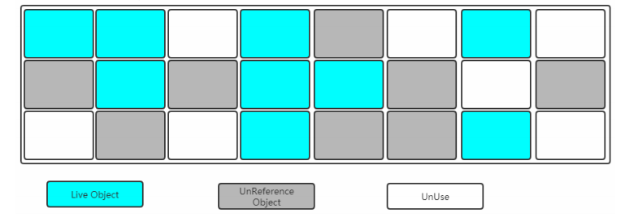

**清除**

清除掉被标记需要回收的对象，释放出对应的内存空间。

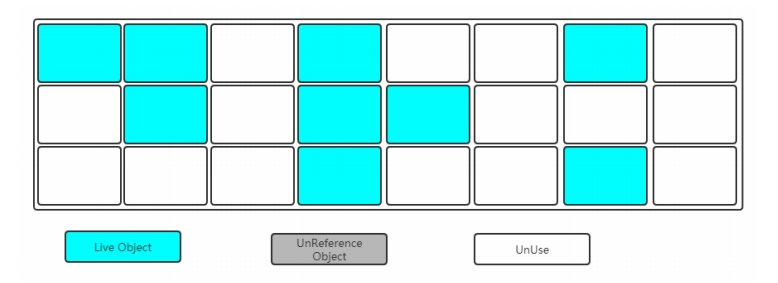

> 缺点：
>
> - 标记和清除这两个过程都比较耗时，效率不高。
> - 会产生大量不连续的内存碎片，空间碎片太多可能会导致以后在程序运行过程中需要分配较大对象时，无 法找到足够的连续内存而不得不提前触发另一次垃圾收集动作

### 2.2 复制-回收算法

为了解决标记-清除算法的效率不高的问题，产生了复制算法。它把内存空间划为两个相等的区域，每次只使用其中一个区域。垃圾收集时，遍历当前使用的区域，把存活对象复制到另外一个区域中，最后将当前使用的区域的可回收的对象进行回收。

**复制算法(Copying)**

- 分为对象面和空闲面；
- 对象在对象面上创建；
- 存活的对象被从对象面复制到空闲面；
- 将对象面所有对象内存清除；

将内存划分为两块相等的区域，每次只使用其中一块，如下图所示

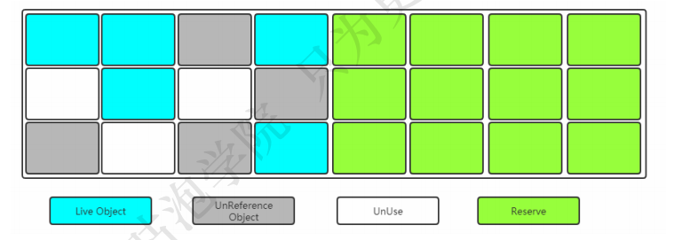

当其中一块内存使用完了，就将还存活的对象复制到另外一块上面，然后把已经使用过的内存空间一次 清除掉。上

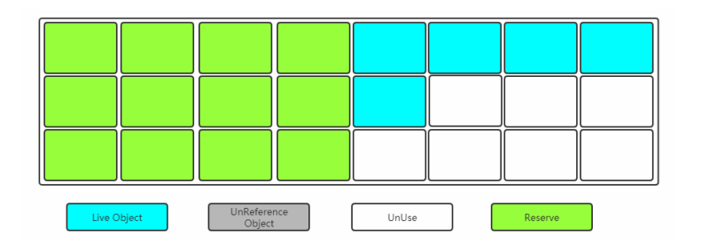

> 缺点：空间利用率降低。

### 2.3 标记-整理算法

在新生代中可以使用复制算法，但是在老年代就不能选择复制算法了，因为老年代的对象存活率会较高，这样会有较多的复制操作，导致效率变低。标记-清除算法可以应用在老年代中，但是它效率不高，在内存回收后容易产生大量内存碎片。因此就出现了一种标记-整理算法（Mark-Compact）算法，与标记-整理算法不同的是，在标记可回收的对象后将所有存活的对象压缩到内存的一端，使他们紧凑的排列在一起，然后对端边界以外的内存进行回收。回收后，已用和未用的内存都各自一边。

**标记-整理算法(Compacting)**

- 标记：从根集合进行扫描，对存活的对象进行标记；
- 清除：移动所有存活的对象，且按照内存地址次序依次排列，然后将末端内存地址以后的内存全部回收。

标记过程仍然与“标记-清除”算法一样，但是后续步骤不是直接对可回收对象进行清理，而是让所有存活的对象都向一端移动，然后直接清理掉端边界以外的内存。

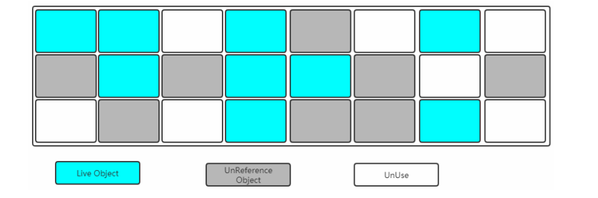

让所有存活的对象都向一端移动，清理掉边界的内存。

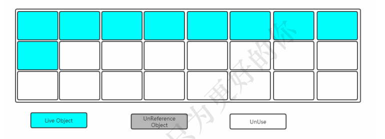

### 2.4 堆内存中的垃圾收集算法（分代收集算法）

堆内存分为新生代Young区和老年代Old区。

- Young区：复制算法（对象在分配之后，可能生命周期比较短，Young区复制效率比较高）；
- Old区：    标记清除或标记整理（Old区对象存活时间比较长，复制来复制去没必要，不如做个标记在整理）。

**GC的分类：**

- Minor GC；
- Full GC；

**年轻代：(尽可能快速地收集掉那些生命周期短的对象)**

- Eden区；
- 两个Survivor区；

**老年代：存放生命周期较长的对象**

- 标记-清理算法；
- 标记-整理算法；

**对象如何晋升到老年代**

- 经历一定Minor次数依然存活的对象；
- Survivor区中存放不下的对象；

**常用的调优参数**

- -XX:SurvivorRatio: Eden和Survivor的比值，默认为8:1
- -XX:NewRatio：老年代和年轻代内存大小的比例
- -XX:MaxTenuringThreshold：对象从年轻代晋升到老年代经过GC次数的最大阈值

**触发Full GC的条件**

- 老年代空间不足；
- 永久代空间不足；
- CMS GC时出现promotion failed，concurrent mode failture
- Minor  GC晋升到老年代的平均的大小大于老年代的剩余空间；
- 调用System.gc();
- 使用RMI来进行RPC或管理的JDK应用，每小时执行1次Full GC。

## 03 垃圾收集器

如果说垃圾收集算法是内存回收的方法论，那么垃圾收集器就是内存回收的具体实现。下图展示了7种作用于不同分代的收集器，其中用于回收新生代的收集器包括Serial、PraNew、Parallel Scavenge，回收老年代的收集器包括Serial Old、Parallel Old、CMS，还有用于回收整个Java堆的G1收集器。不同收集器之间的连线表示它们可以搭配使用。

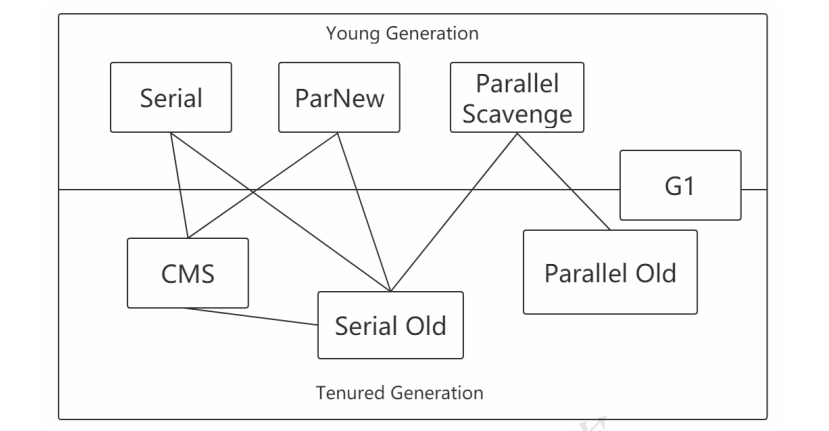

- **Serial收集器（复制算法)**: **新生代单线程收集器**，标记和清理都是单线程，优点是简单高效；
- **ParNew收集器 (复制算法)**: 新生代收并行集器，实际上是**Serial收集器的多线程版本**，在多核CPU环境下有着比Serial更好的表现；
- **Parallel Scavenge收集器 (复制算法)**: 新生代并行收集器，追求高吞吐量，高效利用 CPU。吞吐量 = 用户线程时间/(用户线程时间+GC线程时间)，高吞吐量可以高效率的利用CPU时间，尽快完成程序的运算任务，适合后台应用等对交互相应要求不高的场景；
- **Serial Old收集器 (标记-整理算法)**: 老年代单线程收集器，Serial收集器的老年代版本；
- **Parallel Old收集器 (标记-整理算法)**： 老年代并行收集器，吞吐量优先，Parallel Scavenge收集器的老年代版本；
- **CMS(Concurrent Mark Sweep)收集器（标记-清除算法）**： 老年代并行收集器，以获取最短回收停顿时间为目标的收集器，具有高并发、低停顿的特点，追求最短GC回收停顿时间。
- **G1(Garbage First)收集器 (标记-整理算法)**： Java堆并行收集器，G1收集器是JDK1.7提供的一个新收集器，G1收集器基于“标记-整理”算法实现，也就是说不会产生内存碎片。此外，G1收集器不同于之前的收集器的一个重要特点是：G1回收的范围是整个Java堆(包括新生代，老年代)，而前六种收集器回收的范围仅限于新生代或老年代。

### 3.1 年轻代-Serial收集器 (-XX:+UseSerialGC,复制算法)

- 单线程收集，进行垃圾收集时，必须暂停所有工作线程；
- 简单高效，Client模式下默认的年轻代收集器

Serial收集器是最基本、发展历史最悠久的收集器，曾经是虚拟机新生代收集的唯一选择。

它是一种单线程收集器，不仅仅意味着它只会使用一个CPU或者一条收集线程去完成线程收集工作，更重要的是其**在进行垃圾收集的时候需要暂停其它线程。**

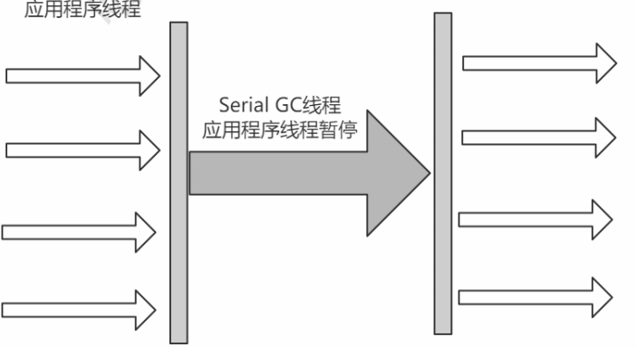

> 优点：简单高效，拥有很高的单线程收集效率；
>
> 缺陷：收集过程需要暂停所有线程
>
> 算法：复制算法
>
> 使用范围：新生代
>
> 应用：client模式下的默认新生代收集器。

### 3.2 年轻代-ParNew收集器（-XX:+UseParNewGC,复制算法）

- 多线程收集，其余的行为、特点和Serial收集器一样；
- 单核执行效率不如Serial，在多核下执行才有优势；

可以把这个收集器理解为Serial收集器的多线程版本。

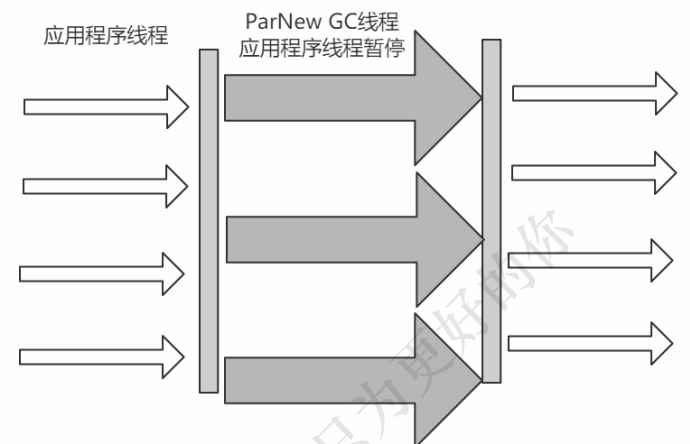

> 优点：在多CPU时，比Serial效率高；
>
> 缺点：收集过程暂停所有应用程序线程，单CPU时比Serial效率差。
>
> 算法：复制算法
>
> 适用范围：新生代
>
> 应用：运行在Server模式下的虚拟机中首选的新生代收集器。

### 3.3  年轻代-Parallel Scavenge收集器（-XX:+UseParallelGC,复制算法）

- 吞吐量=运行用户代码时间/(运行用户代码时间+垃圾收集时间)
- 比起关注用户线程停顿时间，更关注系统的吞吐量；
- 在多核下执行才有优势，Server模式下默认的年轻代收集器；

Parallel Scavenge收集器是一个新生代收集器，它也是使用复制算法的收集器，又是并行的多线程收集器，看上去和ParNew一样，但是Parallel Scanvenge更关注 系统的吞吐量 。

> 吞吐量=运行用户代码的时间/(运行用户代码的时间+垃圾收集时间)
>
> 比如虚拟机总共运行了100分钟，垃圾收集时间用了1分钟，吞吐量=(100-1)/100=99%。 
>
> 若吞吐量越大，意味着垃圾收集的时间越短，则用户代码可以充分利用CPU资源，尽快完成程序 的运算任务。 

-XX:MaxGCPauseMillis控制最大的垃圾收集停顿时间，

 -XX:GCTimeRatio直接设置吞吐量的大小。

### 3.4 老年代-Seril Old收集器（-XX:+UseSerialOldGC,标记-整理算法）

- 单线程收集，进行垃圾收集时，必须暂停所有工作线程；
- 简单高效，Client模式下默认的老年代收集器；

Serial Old收集器是Serial收集器的老年代版本，也是一个单线程收集器，不同的是采用"标记-整理算 法"，运行过程和Serial收集器一样。

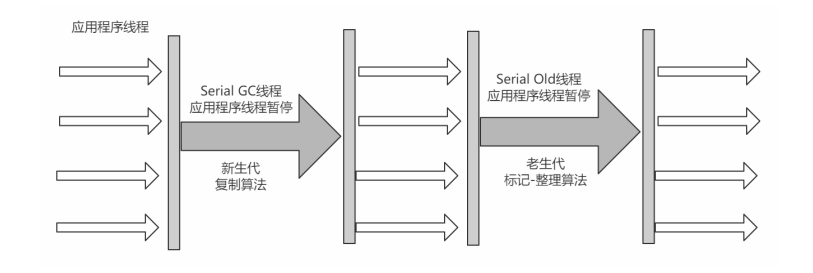

### 3.5 老年代-Parallel Old收集器(-XX:+UseParallelOldGC,标记-整理算法) 

Parallel Old收集器是Parallel Scavenge收集器的老年代版本，使用多线程和"标记-整理算法"进行垃圾回收。 吞吐量优先

- 多线程，吞吐量优先；

### 3.6 老年代-CMS收集器(重要)(-XX:+UseConcMarkSweepGC,标记-清除算法)

- 初始标记：stop-the-world；
- 并发标记：并发追溯标记，程序不会停顿；
- 并发预处理：查找执行并发标记阶段从年轻代晋升到老年代的对象；
- 重新标记：暂停虚拟机，扫描CMS堆中的剩余对象；
- 并发清理：清理垃圾对象，程序不会停顿；
- 并发重置：重置CMS收集器的数据结构

CMS(Concurrent Mark Sweep)收集器是一种以获取`最短回收停顿时间`为目标的收集器。

采用的是"标记-清除算法",整个过程分为4步：

> (1)初始标记 CMS initial mark 标记   GC Roots能关联到的对象 Stop The World-- ->速度很快 
>
> (2)并发标记 CMS concurrent mark 进行GC Roots Tracing 
>
> (3)重新标记 CMS remark 修改并发标记因用户程序变动的内容 Stop The World 
>
> (4)并发清除

由于整个过程中，并发标记和并发清除，收集器线程可以与用户线程一起工作，所以总体上来说，**CMS收集器的内存回收过程是与用户线程一起并发执行的。**

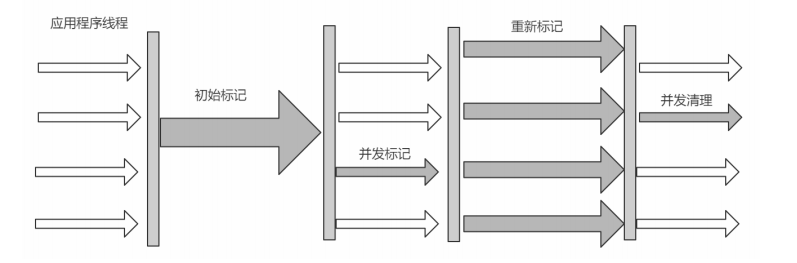

> 优点：并发收集、低停顿
>
> 缺点：产生大量空间碎片，并发阶段会降低吞吐量。

CMS 是英文 Concurrent Mark-Sweep 的简称，是以牺牲吞吐量为代价来获得最短回收停顿时间的垃圾回收器。对于要求服务器响应速度的应用上，这种垃圾回收器非常适合。在启动 JVM 的参数加上“-XX:+UseConcMarkSweepGC”来指定使用 CMS 垃圾回收器。

CMS 使用的是标记-清除的算法实现的，所以在 gc 的时候回产生大量的内存碎片，当剩余内存不能满足程序运行要求时，系统将会出现 Concurrent Mode Failure，临时 CMS 会采用 Serial Old 回收器进行垃圾清除，此时的性能将会被降低。

### 3.7 老年代-G1收集器（-XX:+UseG1GC,复制+标记-整理算法）

G1特点：

- **并行与并发**
- **分代收集（**仍然保留了分代的概念）
- **空间整合**（整体上属于“标记-整理”算法，不会导致空间碎片）
- **可预测的停顿（**比CMS更先进的地方在于能让使用者明确指定一个长度为M毫秒的时间片段内，消耗在垃圾收集上的时间不得超过N毫秒）

> 使用G1收集器时，Java堆的内存布局就与其它收集器有很大差别，它将整个Java堆划分成多个大小相等的独立区域(Region)，虽然还保留有新生代和老年代的概念，但新生代和老年代不再是物理隔离的了，它们都是一部分Region(不需要连读)的集合。

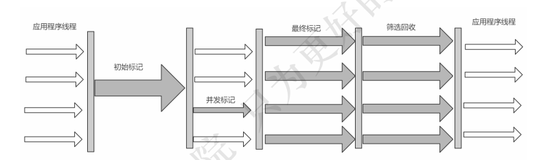

工作过程分为如下几步：

> (1)初始标记 (Initial Marking)  标记一下GC Roots能够关联的对象，并且修改TAMS的值，需要暂停用户线程
>
> (2)并发标记(Concurrent Marking) 从GC Roots进行可达性分析，找出存活的对象，与用户线程并发执行 
>
> (3)最终标记(Final Marking) 修正在并发标记阶段因为用户程序的并发执行导致变动的数据，需要暂停用户线程 
>
> (4)筛选回收(Live Data Counting and Evacuation)对各个Region的回收价值和成本进行排序，根据用户所期望的GC停顿时间制定回收计划。

## 04 垃圾收集器分类

- 串行收集器 -> Serial和Serial Old

只能有一个垃圾回收线程执行，用户线程暂停。`适用于内存比较小点的嵌入式设备。`

- 并行收集器【吞吐量优先】-> Parallel Scanvenge、Parallel Old

多条垃圾收集线程并行工作，但此时用户线程仍然处于等待状态。`适用于科学计算、后台处理等若干交互场景。`

- 并发收集器【停顿时间优先】-> CMS、G1

用户线程和垃圾收集线程同时执行（但不一定是并行的，可能是交替执行的），垃圾收集线程在执行的时候不会停顿用户线程的运行。`适用于相对时间有要要求的场景，比如Web。`

> 相关知识点：吞吐量和停顿时间。
>
> - 停顿时间：垃圾收集器进行垃圾回收终端应用执行响应的时间
> - 吞吐量：运行用户代码时间/（运行用户代码时间+垃圾收集时间）
>
> 停顿时间越短就越适合需要和用户交互的程序，良好的响应速度能提升用户体验；
>
> 高吞吐量则可以高效地利用CPU时间，尽快完成程序的运算任务，主要适合在后台运算而不需要太多交互的任务。

> 相关知识点：如何开启需要的垃圾收集器
>
> - （1）**串行** 
>
>   -XX：+UseSerialGC 
>
>   -XX：+UseSerialOldGC 
>
> - （2）**并行(吞吐量优先)**
>
>   -XX：+UseParallelGC 
>
>   -XX：+UseParallelOldGC
>
> - （3）**并发收集器(响应时间优先)** 
>
>   -XX：+UseConcMarkSweepGC 
>
>   -XX：+UseG1Gc

## 05 垃圾收集器如何选择？

- 优先调整堆的大小让服务器自己来选择
- 如果内存小于100M，使用串行收集器
- 如果是单核，并且没有停顿时间要求，使用串行或JVM自己选
- 如果允许停顿时间超过1秒，选择并行或JVM自己选
- 如果响应时间最重要，并且不能超过1秒，使用并发收集器
- 对于G1收集：
  - 50%以上的堆被存活对象占用
  - 对象分配和晋升的速度变化非常大
  - 垃圾回收时间比较长

## 06 分代垃圾收集器有哪些？有什么区别?是如何工作的？

**分代垃圾收集器**

- **新生代收集器：Serial,ParNew，ParNew，Parallel Scanvenge**
- **老年代收集器：Serial Old，Parallel Old,CMS**
- **整堆回收器：G1**

**区别**

新生代垃圾回收器一般采用的是**复制算法，**复制算法的优点是效率高，缺点是内存利用率低；

老年代垃圾回收器一般采用的是**标记-整理算法**进行垃圾回收。

**工作**

分代收集器有两个分区：新生代和老年代，新生代默认的空间占比为1/3; 老年代默认的空间占比为2/3.

新生代使用的是复制算法，新生代里有 3 个分区：Eden、To Survivor、From Survivor，它们的默认占比是 8:1:1，它的执行流程如下：

- 把 Eden + From Survivor 存活的对象放入 To Survivor 区；
- 清空 Eden 和 From Survivor 分区；
- From Survivor 和 To Survivor 分区交换，From Survivor 变 To Survivor，To Survivor 变 From Survivor。

每次在 From Survivor 到 To Survivor 移动时都存活的对象，年龄就 +1，当年龄到达 15（默认配置是 15）时，升级为老生代。大对象也会直接进入老生代。

老生代当空间占用到达某个值之后就会触发全局垃圾收回，一般使用标记整理的执行算法。以上这些循环往复就构成了整个分代垃圾回收的整体执行流程。

## 07 面试题

### 7.1 Object的finalize()方法的作用是否与C++的析构函数相同

- 与C++的析构函数不同，析构函数调用确定，而它是不确定的；
- 将未被引用的对象放置于F-Queue队列；
- 方法执行随时可能会被终止；
- 给予对象最后一次重生的机会；

### 7.2 Java中的强引用，软引用，弱引用，虚引用有什么用？

**强引用（Strong  Reference）**

- 最普遍的引用：Object obj=new Object();
- 抛出OutOfMemoryError终止程序也不会回收具有强引用的对象；
- 通过将对象设置为null来弱化引用，使其被回收；

**软引用（Soft Reference）**

- **对象处在有用但非必须的状态；**
- **只有当内存空间不足时，GC会回收该引用对象的内存；**
- 可以用来实现高速缓存；

**弱引用（Weak Reference）**

- **非必须的对象，比软引用更弱一些；**
- GC时会被回收；
- 被回收的概率也不大，因为GC线程优先级比较低；
- **适用于引用偶尔被使用且不影响垃圾收集的对象；**

**虚引用(Phantom Reference)**

- 不会决定对象的生命周期；
- 任何时候都可能被垃圾收集器回收；
- 跟踪对象被垃圾收集器回收的活动，起哨兵作用；
- 必须和引用队列ReferenceQueue联合使用；

强引用>软引用>弱引用>虚引用

| 引用类型 | 被垃圾回收时间 | 用途           | 生存时间           |
| -------- | -------------- | -------------- | ------------------ |
| 强引用   | 从来不会       | 对象的一般用途 | JVM停止运行时终止  |
| 软引用   | 在内存不足时   | 对象缓存       | **内存不足时终止** |
| 弱引用   | 在垃圾回收时   | 对象缓存       | **gc运行后终止**   |
| 虚引用   | Unknown        | 标记、哨兵     | **Unknown**        |

