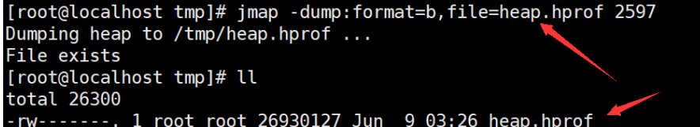

# 【JVM篇】四、JVM实战篇

## 01 JVM参数

### 1.1 标准参数

> -version
>
> -help 
>
> -server 
>
> -cp


### 1.2 -X参数

> -Xint 解释执行
>
> -Xcomp 第一次使用就编译成本地代码 
>
> -Xmixed 混合模式，JVM自己来决定


### 1.3 -XX参数

> 使用最多的参数类型
>
> 非标准化参数，相对不稳定，主要用于JVM调优和Debug

> a.Boolean类型 
>
> 格式：-XX:[+-] +或<name>					+或-表示启用或者禁用name属性 
>
> 比如：-XX:+UseConcMarkSweepGC  表示启用CMS类型的垃圾回收器 
>
> ​	   	-XX:+UseG1GC 						   表示启用G1类型的垃圾回收器 
>
> b.非Boolean类型 
>
> 格式：-XX<name>=<value> 			  表示name属性的值是value 
>
> 比如：-XX:MaxGCPauseMillis=500


### 1.4 其它参数

> -**Xms**1000等价于-XX:InitialHeapSize=1000
>
> -**Xmx**1000等价于-XX:MaxHeapSize=1000 
>
> -**Xss100**等价于-XX:ThreadStackSize=100


### 1.5 查看参数

> java -XX:+PrintFlagsFinal -version > flags.txt


> 值得注意的是"="表示默认值，":="表示被用户或JVM修改后的值 
>
> 要想查看某个进程具体参数的值，可以使用jinfo.
>
> 一般要设置参数，可以先查看一下当前参数是什么，然后进行修改

### 1.6 设置参数的方式

- 开发工具中设置比如IDEA，eclipse 
- 运行jar包的时候:java -XX:+UseG1GC xxx.jar 
- web容器比如tomcat，可以在脚本中的进行设置 
- 通过jinfo实时调整某个java进程的参数(参数只有被标记为manageable的flags可以被实时修改)

### 1.7 实践和单位换算

> 1Byte(字节)=8bit(位) 
>
> 1KB=1024Byte(字节) 
>
> 1MB=1024KB 
>
> 1GB=1024MB 
>
> 1TB=1024GB


> (1)设置堆内存大小和参数打印 
>
> ​		-Xmx100M -Xms100M -XX:+PrintFlagsFinal 
>
> (2)查询+PrintFlagsFinal的值 
>
> ​		:=true 
>
> (3)查询堆内存大小MaxHeapSize 
>
> ​		:= 104857600 
>
> (4)换算 
>
> ​		104857600(Byte)/1024=102400(KB) 
>
> ​		102400(KB)/1024=100(MB) 
>
> (5)结论 
>
> ​		104857600是字节单位

### 1.8常用参数含义


## 02 常用命令

### 2.1 jps

> 查看java进程


### 2.2 jinfo

- a.实时查看和调整JVM配置参数

> The jinfo command prints Java configuration information for a specified Java process or core file or a remote debug server. The configuration information includes Java system properties and Java Virtual Machine (JVM) command-line flags.

- b.查看 jinfo -flag name PID 查看某个java进程的name属性的值

> jinfo -flag MaxHeapSize PID 
>
> jinfo -flag UseG1GC PID


- c.修改

  > 参数只有被标记为manageable的flags可以被实时修改 
  >
  > jinfo -flag [+|-] PID 
  >
  > jinfo -flag 

- d.查看曾经赋过值的一些参数

```java
jinfo -flags PID
```


### 2.3 jstat

- a.查看虚拟机性能统计信息

> The jstat command displays performance statistics for an instrumented Java HotSpot VM. The target JVM is identified by its virtual machine identifier, or vmid option.

- b.查看类装载信息

```c
jstat -class PID 1000 10 查看某个java进程的类装载信息，每1000毫秒输出一次，共输出10次
```


- c.查看垃圾收集信息

```java
jstat -gc PID 1000 10
```


### 2.4 jstack

- a.查看线程堆栈信息

> The jstack command prints Java stack traces of Java threads for a specified Java process, core file, or remote debug server

- b.用法

```
jstack PID
```


### 2.5 jmap

- a.生成堆转储快照

> The jmap command prints shared object memory maps or heap memory details of a specified process, core file, or remote debug server

- b.打印出堆内存相关信息

```java
-XX:+PrintFlagsFinal -Xms300M -Xmx300M
jmap -heap PID
```


- c.dump出堆内存相关信息

```java
jmap -dump:format=b,file=heap.hprof 44808
```



- d.要是在发生堆内存溢出的时候，能自动dump出该文件就好了

一般在开发中，JVM参数可以加上下面两句，这样内存溢出时，会自动dump出该文件

 -XX:+HeapDumpOnOutOfMemoryError 

-XX:HeapDumpPath=heap.hprof

> 设置堆内存大小: -Xms20M -Xmx20M 启动，然后访问localhost:9090/heap，使得堆内存溢出


## 03 常用工具

### 3.1 jconsole

JConsole工具是JDK自带的可视化监控工具。查看java应用程序的运行概况、监控堆信息、永久区使用 情况、类加载情况等

命令行中输入：jconsole


### 3.2 jvisualvm

**a.监控本地Java进程**

可以监控本地的java进程的CPU，类，线程等

**b.监控远端Java进程**

比如监控远端tomcat，演示部署在阿里云服务器上的tomcat

### 3.3 Arthas

> github ：https://github.com/alibaba/arthas
>
> Arthas 是Alibaba开源的Java诊断工具，采用命令行交互模式，是排查jvm相关问题的利器。

### 3.4 MAT

> Java堆分析器，用于查找内存泄漏 
> Heap Dump，称为堆转储文件，是Java进程在某个时间内的快照 
>
> 下载地址 ：https://www.eclipse.org/mat/downloads.php

### 3.5 GC日志分析工具

> 要想分析日志的信息，得先拿到GC日志文件才行，所以得先配置一下 
>
> 根据前面参数的学习，下面的配置很容易看懂 
>
> - 在线 http://gceasy.io 
> - GCViewer