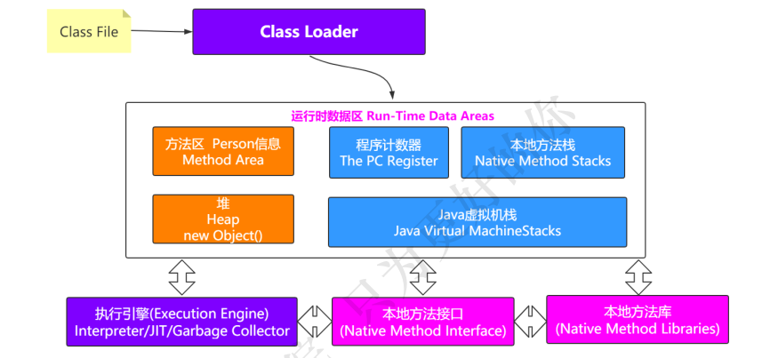
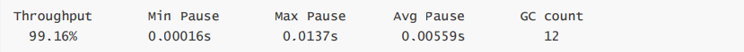
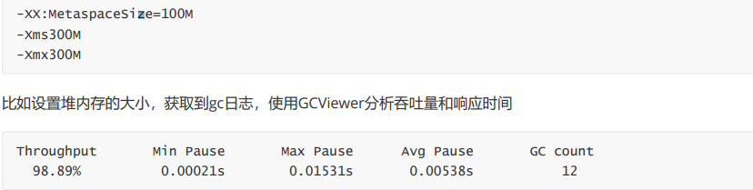
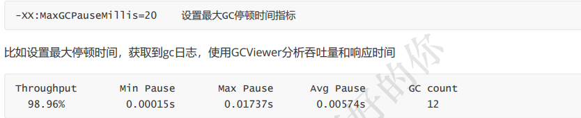
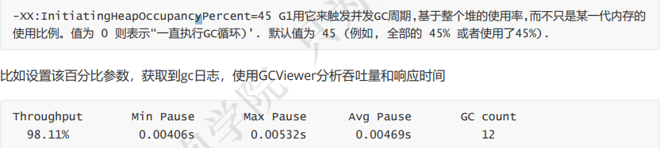
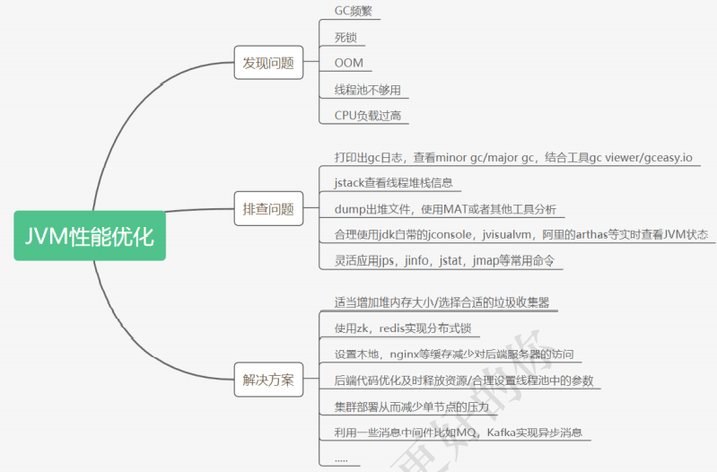

# 【JVM篇】五、JVM终结篇-JVM调优

## 01 JVM物理结构图

## 02 GC优化

> 内存被使用了之后，难免会有不够用或者达到设定值的时候，就需要对内存空间进行垃圾回收。

### 2.1 垃圾收集发生的时机

> GC是由JVM自动完成的，根据JVM系统环境而定的，所以时机是不确定的。当然，也可以手动进行垃圾回收，比如调用System.gc()通知JVM进行一次垃圾回收，但是具体什么时刻运行也无法控制。即System.gc()只是通知要回收，什么时候由JVM决定。

一般以下情况会发生垃圾回收：

- **当Eden区或者S区不够用了；**
- **老年代空间不够用了**
- **方法区空间不够用了**
- System.gc()

### 2.2 G1调优与最佳指南

#### 1.G1调优

是否选用G1垃圾收集器的判断依据

> （1）**50%以上的堆被存活对象占用** 
>
> **（2）对象分配和晋升的速度变化非常大** 
>
> （3）**垃圾回收时间比较长**

(1)使用G1GC垃圾收集器: -XX:+UseG1GC

修改配置参数，获取到gc日志，使用GCViewer分析吞吐量和响应时间

(2)调整内存大小再获取gc日志分析

(3)调整最大停顿时间

(4)启动并发GC时堆内存占用百分比

#### 2.最佳指南

(1)不要手动设置新生代和老年代的大小，只要设置整个堆的大小

> G1收集器在运行过程中，会自己调整新生代和老年代的大小 其实是通过adapt代的大小来调整对象晋升的速度和年龄，从而达到为收集器设置的暂停时间目标 如果手动设置了大小就意味着放弃了G1的自动调优

(2)不断调优暂停时间目标

> 一般情况下这个值设置到100ms或者200ms都是可以的(不同情况下会不一样)，但如果设置成50ms就不太合理。暂停 时间设置的太短，就会导致出现G1跟不上垃圾产生的速度。最终退化成Full GC。所以对这个参数的调优是一个持续 的过程，逐步调整到最佳状态。暂停时间只是一个目标，并不能总是得到满足

(3)使用-XX:ConcGCThreads=n来增加标记线程的数量

> IHOP如果阀值设置过高，可能会遇到转移失败的风险，比如对象进行转移时空间不足。如果阀值设置过低，就会使标 记周期运行过于频繁，并且有可能混合收集期回收不到空间。 IHOP值如果设置合理，但是在并发周期时间过长时，可以尝试增加并发线程数，调高ConcGCThreads。

(4)MixedGC调优

> -XX:InitiatingHeapOccupancyPercent
>
> -XX:G1MixedGCLiveThresholdPercent 
>
> -XX:G1MixedGCCountTarger 
>
> -XX:G1OldCSetRegionThresholdPercent

(5)适当增加堆内存大小

#### 3. JVM调优的工具

JDK自带了很多的监控工具，都位于JDK的bin目录下，其中最常用的是jconsole和jvisualvm这两款视图监控工具。

- jconsole：用于对JVM中的内存、线程和类等进行监控；
- jvisualvm：JDK自带的全能分析工具，可以分析：内存快照、线程快照、程序死锁、监控内存的变化、GC变化等。

#### 4.常用的JVM调优的参数有哪些

- -Xms2g：初始化推大小为 2g；
- -Xmx2g：堆最大内存为 2g；
- -XX:NewRatio=4：设置年轻的和老年代的内存比例为 1:4；
- -XX:SurvivorRatio=8：设置新生代 Eden 和 Survivor 比例为 8:2；
- –XX:+UseParNewGC：指定使用 ParNew + Serial Old 垃圾回收器组合；
- -XX:+UseParallelOldGC：指定使用 ParNew + ParNew Old 垃圾回收器组合；
- -XX:+UseConcMarkSweepGC：指定使用 CMS + Serial Old 垃圾回收器组合；
- -XX:+PrintGC：开启打印 gc 信息；
- -XX:+PrintGCDetails：打印 gc 详细信息。

## 03 常见问题

### 问题一、内存泄露与内存溢出的区别？

内存泄漏：对象无法得到及时的回收，持续占用内存空间，从而造成内存空间的浪费。

内存溢出：内存泄漏到一定的程度就会导致内存溢出，但是内存溢出也有可能是大对象导致的。

### 问题二、young gc会有stw吗？

 **不管什么 GC，都会有 stop-the-world，只是发生时间的长短。**

> 当垃圾回收器在进行回收操作的时候,整个**应用的执行是被暂时中止(*stop-the-world*)**

### 问题三、major gc和full gc的区别？

major gc指的是老年代的gc，而full gc等于young+old+metaspace的gc。

### 问题四、G1与CMS的区别是什么

**CMS 用于老年代的回收**，而 **G1 用于新生代和老年代的回收。**

**G1 使用了 Region 方式对堆内存进行了划分，且基于标记整理算法实现，整体减少了垃圾碎片的产生**

### 问题五、什么是直接内存？

直接内存是在java堆外的、直接向系统申请的内存空间。通常访问直接内存的速度会优于Java堆。因此出于性能的考 虑，读写频繁的场合可能会考虑使用直接内存

### 问题六、不可达的对象一定要被回收吗？

即使在可达性分析法中不可达的对象，也并非是“非死不可”的，这时候它们暂时处于“缓刑阶段”，要真正宣告一个对 象死亡，至少要经历**两次标记过程**；可达性分析法中不可达的对象被第一次标记并且进行一次筛选，筛选的条件是**此 对象是否有必要执行 finalize 方**法。当对象没有覆盖 finalize 方法，或 finalize 方法已经被虚拟机调用过时，虚拟机 将这两种情况视为没有必要执行。

被判定为需要执行的对象将会被放在一个队列中进行第二次标记，除非这个对象与引用链上的任何一个对象建立关联，否则就会被真的回收。

### 问题七、方法区中的无用类回收

方法区主要回收的是无用的类，那么如何判断一个类是无用的类的呢？ 

判定一个常量是否是“废弃常量”比较简单，而要判定一个类是否是“无用的类”的条件则相对苛刻许多。类需要同时满 足下面 3 个条件才能算是 “无用的类” ：

- 该类所有的实例都已经被回收，也就是 Java 堆中不存在该类的任何实例。 
- 加载该类的 ClassLoader 已经被回收。 
- 该类对应的 java.lang.Class 对象没有在任何地方被引用，无法在任何地方通过反射访问该类的方法

虚拟机可以对满足上述 3 个条件的无用类进行回收，这里说的仅仅是“可以”，而并不是和对象一样不使用了就会必然 被回收。

### 问题八、不同的引用

JDK1.2以后，Java对引用进行了扩充：**强引用**、**软引用**、**弱引用**和**虚引用**。

> 强引用：在程序代码中普遍存在的，类似“Object obj = new Object()”这类的引用，**只要强引用还存在，垃圾收集器永远不会回收掉被引用的对象。**
>
> 软引用：用来描述一些还有用但非必需的对象。在系统将要发生内存溢出异常之前，将会对这些对象列进回收范围之中进行第二次回收。**如果这次回收还没有足够的内存，才会抛出内存溢出异常**。在JDK1.2之后，提供了SoftReference类来实现软引用。
>
> 弱引用：用来描述非必需对象。被弱引用关联的对象只能生存到下一次垃圾收集发生之前。**当垃圾收集器工作时，无论当前内存是否足够，都会回收掉只被弱引用关联的对象**。在JDK1,2之后，提供了WeakReference类来实现弱引用。
>
> 虚引用：是最弱的一种引用关系。一个对象是否有虚引用的存在，完全不会对其生存时间构成影响，也无法通过虚引用取得一个对象实例。为对象设置虚引用的唯一目的就是能在这个对象被收集器回收时收到一个系统通知。在JDK1.2之后，提供了PhantomReference类来实现虚引用。