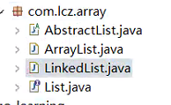
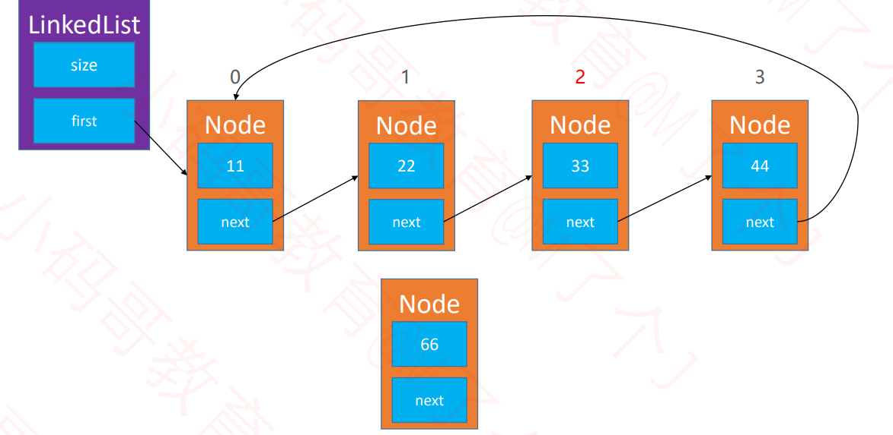

#  数据结构-线性表

- 线性表是具有n个相同类型元素的有限序列(n>=0)


**常见的线性表有：**

- **数组ArrayList**
- **链表LinkedList**
- **栈Stack**
- **队列Queue**
- **哈希表(散列表)(单独摘出来)**

# 一、 动态数组ArrayList

- 数组是一种顺序存储的线性表，所有元素的内存地址是连续的。
- 
- 但在很多编程语言中，数组都有个致命的缺陷，无法动态修改容量
- 实际开发中，我们希望数组的容量是可以动态改变的。

## 1.动态数组接口设计


## 2.动态数组的设计


​	
​	

```java
// 成员变量
int size;
int[] elements;
	
// 常量
private static final int DEFAULT_CAPATICY = 10;

// 有参构造函数
public ArrayList(int capaticy) {
	elements = new int[capaticy];
}

// 无参构造函数
public ArrayList() {
	this(DEFAULT_CAPATICY);
}
```

## 3.重要接口实现

### 3.1 添加元素-add(E element)


```java
/**
	 * 添加元素到最后面
	 * @param element
	 */
	public void add(int element) {
		add(size,element);
	}
```

### 3.2 打印数组

- 重写toString方法
- 在toString方法中将元素拼接成字符串
- 字符串拼接建议使用StringBuilder

```java
/**
	 * 重写toString方法
	 */
	@Override
	public String toString() {
		// TODO Auto-generated method stub
		StringBuilder res = new StringBuilder();
		res.append("size=").append(size).append(", [");
		for(int i=0;i<size;i++) {
			if(i!=0) {
				res.append(", ");
			}
			res.append(elements[i]);
		}
		res.append("]");
		return res.toString();
	}
}
```

### 3.3 删除元素-remove(int index)


```java
   /**
	 * 删除index位置对应的元素
	 * @param index
	 * @return
	 */
	public int remove(int index) {
		// 对index进行判断
		rangeCheck(index);
		int oldElement = elements[index];
		for(int i=index+1;i<size;i++) {
			elements[i-1] = elements[i]; 
		}
		size --;
		
		return oldElement;
	}
```

### 3.4 添加元素-add(int index,int element)


```java
/**
	 * 往index位置添加元素
	 * @param index
	 * @param element
	 */
	public void add(int index,int element) {
		// index判断可以往size位置添加
		rangeForCheck(index);
		// 对其添加元素
		for(int i=size;i>index;i--) {
			elements[i] = elements[i-1]; 
		}
		elements[index] = element;
		size++;
	}
```

### 3.5 扩容

- 在add前进行检查当前数组的size与数组申请的大小比较


```java
/**
	 * 往index位置添加元素
	 * @param index
	 * @param element
	 */
	public void add(int index,int element) {
		// index判断可以往size位置添加
		rangeForCheck(index);
		// 对其进行判断是否需要扩容
		checkForCapaticy(size+1);
		// 对其添加元素
		for(int i=size;i>index;i--) {
			elements[i] = elements[i-1]; 
		}
		elements[index] = element;
		size++;
	}
	
	/**
	 * 检查容量并扩容
	 */
	private void checkForCapaticy(int capaticy) {
		int oldCapaticy = elements.length;
		if(oldCapaticy >= capaticy) {
			return;
		}
		// 扩容
		// 新容量为旧容量的1.5倍
		int newCapaticy = oldCapaticy + oldCapaticy >> 1;
		int newElements[] = new int[newCapaticy];
		for(int i=0;i<size;i++) {
			newElements[i] = elements[i];
		}
		elements = newElements;
					
	}
```

### 3.6 缩容

- 如果内存使用比较紧张，动态数组有比较多的剩余空间，可以考虑进行缩容操作
- 比如剩余空间占总容量的一半时，就进行缩容
- 注意：如果扩容倍数、缩容时机设计不得当，有可能会导致复杂度震荡。

### 3.7 泛型

- **使用泛型技术可以让动态数组更加通用，可以存放任何数据类型**


```java
package com.lcz.array;

@SuppressWarnings("unchecked")
public class ArrayList<E> {
	// 成员变量
	int size;
	E[] elements;
	
	
	// 常量
	private static final int DEFAULT_CAPATICY = 10;
	private static final int DEFAULT_NOT_FOUNT = -1;
	
	// 无参构造函数
	public ArrayList() {
		this(DEFAULT_CAPATICY);
	}
		
	// 有参构造函数
	public ArrayList(int capaticy) {
		capaticy = capaticy > DEFAULT_CAPATICY? capaticy:DEFAULT_CAPATICY;
		elements = (E[])new Object[capaticy];
	}
	
	
	
	/**
	 * 返回元素的数量
	 * @return
	 */
	public int size() {
		return size;
	}
	
	/**
	 * 是否为空
	 * @return
	 */
	public boolean isEmpty() {
		return size==0;
	}
	
	/**
	 * 是否包含某个元素
	 * @param element
	 * @return
	 */
	public boolean contains(E element) {
		return indexOf(element) != DEFAULT_NOT_FOUNT;
	}
	
	/**
	 * 添加元素到最后面
	 * @param element
	 */
	public void add(E element) {
		add(size,element);
	}
	
	private void outOfBounds(int index) {
		throw new IndexOutOfBoundsException("Index:" + index + ",Size:" + size);
	}
	private void rangeCheck(int index) {
		if(index<0 || index>=size) {
			outOfBounds(index);
		}
	}
	private void rangeForCheck(int index) {
		if(index<0 || index>size) {
			outOfBounds(index);
		}
	}
	/**
	 * 返回index位置对应的元素
	 * @param index
	 * @return
	 */
	public E get(int index) {
		// 对其进行index判断
		rangeCheck(index);
		return elements[index];
	}
	
	/**
	 * 设置index位置的元素
	 * @param index
	 * @param element
	 * @return 原来的元素
	 */
	public E set(int index,E element) {
		// 对其进行index判断
		rangeCheck(index);
		E oldElement = elements[index];
		elements[index] = element;
		return oldElement;
	}
	
	/**
	 * 往index位置添加元素
	 * @param index
	 * @param element
	 */
	public void add(int index,E element) {
		// index判断可以往size位置添加
		rangeForCheck(index);
		// 对其进行判断是否需要扩容
		checkForCapaticy(size+1);
		// 对其添加元素
		for(int i=size;i>index;i--) {
			elements[i] = elements[i-1]; 
		}
		elements[index] = element;
		size++;
	}
	
	/**
	 * 检查容量并扩容
	 */
	private void checkForCapaticy(int capaticy) {
		int oldCapaticy = elements.length;
		if(oldCapaticy >= capaticy) {
			return;
		}
		// 扩容
		// 新容量为旧容量的1.5倍
		int newCapaticy = oldCapaticy + oldCapaticy >> 1;
		E newElements[] = (E[])new Object[newCapaticy];
		for(int i=0;i<size;i++) {
			newElements[i] = elements[i];
		}
		elements = newElements;
					
	}
	
	
	/**
	 * 删除index位置对应的元素
	 * @param index
	 * @return
	 */
	public E remove(int index) {
		// 对index进行判断
		rangeCheck(index);
		E oldElement = elements[index];
		for(int i=index+1;i<size;i++) {
			elements[i-1] = elements[i]; 
		}
		size --;
		
		return oldElement;
	}
	
	/**
	 * 查看元素的索引
	 * @param element
	 * @return
	 */
	public int indexOf(E element) {
		if(element == null) {
			for(int i=0;i<size;i++) {
				if(elements[i]==null)
					return i;
			}
		}else {
			for(int i=0;i<size;i++) {
				if(element.equals(elements[i]))
					return i;
			}
		}
		return DEFAULT_NOT_FOUNT;
	}
	/**
	 * 清除所有元素
	 */
	public void clear() {
		size = 0;
	}
	
	/**
	 * 重写toString方法
	 */
	@Override
	public String toString() {
		// TODO Auto-generated method stub
		StringBuilder res = new StringBuilder();
		res.append("size=").append(size).append(", [");
		for(int i=0;i<size;i++) {
			if(i!=0) {
				res.append(", ");
			}
			res.append(elements[i]);
		}
		res.append("]");
		return res.toString();
	}
}

```

### 3.8 对象数组

- 对象数组中存储的是对象的地址，而不是对象的值。


- 若对其改进，需对内存管理进行修改


### 3.9 null的处理


### 3.10 java.util.ArrayList

- JDK中内置了一个动态数组类：java.util.ArrayList

### 3.11  ArrayList是否能进一步优化？


对ArrayList添加一个first记录第一个位置的索引，这样不需要释放内存。（可参考后续的循环双端队列设计）

# 二、 链表LinkedList

## 1.单向链表

- 动态数组有明显的缺点-可能会造成内存空间的大量浪费
- 能否用到多少就申请多少内存？
- 链表就可以办到这一点
- 链表是一种链式存储的线性表，所有元素的内存地址不一定是连续的。


### 1.1 链表的设计

- 一个size，一个first指针


### 1.2 接口设计

- ArrayList和LinkedList方法作用相同，共同引申一个接口List
- 但ArrayList和LinkedList有几个方法实现相同，有几个方法实现不相同，这时候添加一个abstract类
- **最后arraylist和linkedlist继承抽象类**




### 1.3 重要接口实现

#### 1.3.1 清空元素-clear()


```java
@Override
public void clear() {
    // TODO Auto-generated method stub
    size = 0;
    first = null;
}
```

#### 1.3.2 添加元素-add(int index,E element)


- node方法用于获取index位置的节点

```java
/**
	 * node方法用于获取index位置的结点
	 * @param index
	 * @return
	 */
	private Node<E> node(int index){
		rangeCheck(index);
		
		Node<E> node = first;
		for(int i=0;i<index;i++) {
			node = node.next;
		}
		return node;
	}

```

- 添加元素 注意index 0 的位置

```java
@Override
	public void add(int index, E element) {
		rangeForAddCheck(index);
		// TODO Auto-generated method stub
		if(index == 0) {
			first = new Node(element,first);
		}else {
			Node<E> pre = node(index-1);
			pre.next = new Node(element,pre.next);
		}
		
		size ++;
	}

```

#### 1.3.3 删除元素-remove(int index)

```java
@Override
	public E remove(int index) {
		// TODO Auto-generated method stub
		rangeCheck(index);
		
		Node<E> res = first;
		
		if(index == 0  ) {
			res = first;
			first = first.next;
		}else {
			Node<E> pre = node(index-1);
			res = pre.next;
			pre.next = pre.next.next;
		}
        size--;
		return res.element;
	}

```

#### 1.3.4 indexOf & toString方法

```java
@Override
	public int indexOf(E element) {
		// TODO Auto-generated method stub
		if(element==null) {
			Node<E> node = first;
			for(int i=0;i<size;i++) {
				if(node.element==null)
					return i;
				node = node.next;
			}
		}else {
			Node<E> node = first;
			for(int i=0;i<size;i++) {
				if(element.equals(node.element))
					return i;
				node = node.next;
			}
		}
		return ELEMENT_NOT_FOUND;
	}
	
	/**
	 * node方法用于获取index位置的结点
	 * @param index
	 * @return
	 */
	private Node<E> node(int index){
		rangeCheck(index);
		
	
```

## 2.双向链表

- 之前所学的链表，也被称为单向链表
- 使用双向链表可以提升链表的综合性能

### 2.1 双向链表的设计


- 当双向链表只有一个元素时


### 2.2.重要接口的设计

#### 2.2.1 获取index对应位置的节点

```java
**
 * 获取index位置对应的节点对象
 * @param index
 * @return
 */
private Node<E> node(int index) {
   rangeCheck(index);
   
   if (index < (size >> 1)) {
      Node<E> node = first;
      for (int i = 0; i < index; i++) {
         node = node.next;
      }
      return node;
   } else {
      Node<E> node = last;
      for (int i = size - 1; i > index; i--) {
         node = node.prev;
      }
      return node;
   }
}
```

#### 2.2.2 添加元素-add(int index,E element)


- 添加考虑几种情况
- 尾部插入和空加入
- 正常加入
- 头部加入

```java
	@Override
	public void add(int index, E element) {
		rangeCheckForAdd(index);

		// size == 0
		// index == 0
		if (index == size) { // 往最后面添加元素
			Node<E> oldLast = last;
			last = new Node<>(oldLast, element, null);
			if (oldLast == null) { // 这是链表添加的第一个元素
				first = last;
			} else {
				oldLast.next = last;
			}
		} else {
			Node<E> next = node(index); 
			Node<E> prev = next.prev; 
			Node<E> node = new Node<>(prev, element, next);
			next.prev = node;
			
			if (prev == null) { // index == 0
				first = node;
			} else {
				prev.next = node;
			}
		}
		
		size++;
	}
```

#### 2.2.3 删除元素-remove(int index,E element)


- 添加考虑几种情况
- prev为空
- next为空

```java
	@Override
	public E remove(int index) {
		rangeCheck(index);

		Node<E> node = node(index);
		Node<E> prev = node.prev;
		Node<E> next = node.next;
		
		if (prev == null) { // index == 0
			first = next;
		} else {
			prev.next = next;
		}
		
		if (next == null) { // index == size - 1
			last = prev;
		} else {
			next.prev = prev;
		}
		
		size--;
		return node.element;
	}
```

#### 2.2.4 双向链表 vs 动态数组

- 动态数组：开辟、销毁内存空间的次数相对较少，但可能造成内存空间的浪费
- 双向链表：开辟、销毁内存空间的次数相比较多，但不会造成内存空间的浪费


- 如果频繁在尾部进行添加、删除操作，动态数组、双向链表均可选择
- 如果频繁在头部进行添加、删除操作，建议选择使用双向链表
- 如果有频繁的在任意位置添加、删除操作，建议选择使用双向链表
- 如果有频繁的查询操作，建议选择使用动态数组


- 如果有了双向链表，单向链表是否就没有任何用处了？
  - 并非如此，在哈希表的设计中就用到了单链表
  - hashmap使用的是单链表；而在linkedhashmap中使用的双链表

## 3.单向循环链表

### 3.1 单向循环链表的设计


**单向循环链表-只有1个节点**


### 3.2 重要接口设计

#### 3.2.1 单向循环链表-add(int index, E element)




```java
@Override
	public void add(int index, E element) {
		rangeCheckForAdd(index);
		
		if (index == 0) {
			Node<E> newFirst = new Node<>(element, first);
			// 拿到最后一个节点
			Node<E> last = (size == 0) ? newFirst : node(size - 1);
			last.next = newFirst;
			first = newFirst;
		} else {
			Node<E> prev = node(index - 1);
			prev.next = new Node<>(element, prev.next);
		}
		size++;
	}

```

#### 3.2.2 单向循环链表-remove(int index)


```java
@Override
public E remove(int index) {
   rangeCheck(index);
   
   Node<E> node = first;
   if (index == 0) {
      if (size == 1) {
         first = null;
      } else {
         Node<E> last = node(size - 1);
         first = first.next;
         last.next = first;
      }
   } else {
      Node<E> prev = node(index - 1);
      node = prev.next;
      prev.next = node.next;
   }
   size--;
   return node.element;
}
```

> 单向循环链表，主要考虑头结点位置的插入和删除，插入的时候头结点是否有节点

## 4.双向循环链表

### 4.1 双向循环链表的设计


**双向循环链表-只有一个节点**


###  4.2 重要接口设计

#### 4.2.1 双向循环链表-add(int index,E element)


```java
@Override
public void add(int index, E element) {
   rangeCheckForAdd(index);

   // size == 0
   // index == 0
   if (index == size) { // 往最后面添加元素
      Node<E> oldLast = last;
      last = new Node<>(oldLast, element, first);
      if (oldLast == null) { // 这是链表添加的第一个元素
         first = last;
         first.next = first;
         first.prev = first;
      } else {
         oldLast.next = last;
         first.prev = last;
      }
   } else {
      Node<E> next = node(index); 
      Node<E> prev = next.prev; 
      Node<E> node = new Node<>(prev, element, next);
      next.prev = node;
      prev.next = node;
      
      if (next == first) { // index == 0
         first = node;
      }
   }
   
   size++;
}
```

#### 4.2.2 双向循环链表-remove(int index)


```java
@Override
public E remove(int index) {
   rangeCheck(index);
   return remove(node(index));
}

private E remove(Node<E> node) {
   if (size == 1) {
      first = null;
      last = null;
   } else {
      Node<E> prev = node.prev;
      Node<E> next = node.next;
      prev.next = next;
      next.prev = prev;
      
      if (node == first) { // index == 0
         first = next;
      }
      
      if (node == last) { // index == size - 1
         last = prev;
      }
   }
   
   size--;
   return node.element;
}
```

### 4.3 约瑟夫环的问题

由第1个人开始报数，每报数到第3人该人就必须自杀，然后再由下一个重新报数，直到所有人都自杀身亡为止。


> 在单向循环链表中增设一个成员变量，三个成员方法来解决
>
> - current:用于指向某个节点
> - void reset(): 让current指向头结点first
> - E next(): 让current往后走一步，也就是current = current.next
> - E remove():删除current指向的节点，删除成功后让current指向下一个节点
>
> 题目中30个人围成一圈，因而启发我们用一个循环的链来表示，可以使用结构[数组](https://baike.baidu.com/item/数组)来构成一个循环链。结构中有两个成员，其一为指向下一个人的指针，以构成环形的链；其二为该人是否被扔下海的标记，为1表示还在船上。从第一个人开始对还未扔下海的人进行计数，每数到9时，将结构中的标记改为0，表示该人已被扔下海了。这样循环计数直到有15个人被扔下海为止。 [2] 

```java
public void reset() {
   current = first;
}

public E next() {
   if (current == null) return null;
   
   current = current.next;
   return current.element;
}

public E remove() {
   if (current == null) return null;
   
   Node<E> next = current.next; 
   E element = remove(current);
   if (size == 0) {
      current = null;
   } else {
      current = next;
   }
   
   return element;
}
```


# 三、栈(Stack)

- 栈是一种特殊的线性表，只能在一端进行操作
  - 往栈中添加元素的操作，一般叫做push，入栈
  - 从栈中移除元素的操作，一般叫做pop，出栈
  - 后进先出的原则


## 1.栈的接口设计

- int size(); // 元素的数量
- boolean isEmpty(); // 是否为空
- void push(E element); // 入栈
- E pop(); //出栈
- E peek(); //获取栈顶元素
- void clear(); //清空

> 栈的实现本次基本之前的动态数组、链表。不采取继承的方式，而是基于成员变量的方法。

```java
package com.mj;

import com.mj.list.ArrayList;
import com.mj.list.List;

public class Stack<E> {
	private List<E> list = new ArrayList<>();
	
	public void clear() {
		list.clear();
	}
	
	public int size() {
		return list.size();
	}

	public boolean isEmpty() {
		return list.isEmpty();
	}

	public void push(E element) {
		list.add(element);
	}


	public E pop() {
		return list.remove(list.size() - 1);
	}


	public E top() {
		return list.get(list.size() - 1);
	}
}

```

## 2.java.util.Stack

java中的实现是通过继承Vector来实现的。


## 3.栈的应用

- 实现方式：通过两个栈来实现，一个栈来存取，另外一个栈存取前面一个栈出栈的


## 4.栈的练习题

**1.有效括号**


> 解题思路：
>
> - 1.遇见左括号，将左字符入栈
>
> - 2.遇见右括号
>
>   - 如果栈是空的，说明括号无效
>   - 如果栈不为空，将栈顶字符出栈，与右字符匹配
>     - 如果匹配不成功，则括号无效
>     - 如果左右字符匹配，继续扫描下一个字符
>
> - 3.所有字符扫描完毕后
>
>   - 栈为空，说明括号无效
>
>   - 栈不为空，说明括号无效
>
>     

```java
class Solution {
    public boolean isValid(String s) {
        HashMap<Character,Character> hashMap = new HashMap<>();
        hashMap.put('(',')');
        hashMap.put('{','}');
        hashMap.put('[',']');

        Stack<Character> stack = new Stack<>();
        for(int i=0;i<s.length();i++){
            char ch = s.charAt(i);
            if(hashMap.containsKey(ch)){
                stack.push(ch);
            }else{
                if(stack.isEmpty()){
                    return false;
                }else{
                    if(ch!=hashMap.get(stack.pop())){
                        return false;
                    }
                }
            }
        }
        return stack.isEmpty();
    }
}
```


# 四、 队列(Queue)

队列是一种特殊的线性表，只能在头尾两端进行操作。

- 队尾(rear):只能从队尾添加元素，一般叫做enQueue,入队
- 对头(front):只能从对头移除元素，一般叫做deQueue，出队
- 先进先出的原则，First In First Out，FIFO


## 1.队列

### 1.1 队列的端口设计

- int size(): // 元素的数量
- boolean isEmpty(); //是否为空
- void clear(); //清空
- void enQueue(E element)； // 入队
- E deQueue(); //出队
- E front(); //获取队列的头元素

> 队列本次实现使用双向链表来实现，因为队列主要是往头尾操作元素。

### 1.2 队列的接口实现

```java
public class Deque<E> {
	private List<E> list = new LinkedList<E>();
	
	/**
	 * 返回队列的长度
	 * @return
	 */
	public int size() {
		return list.size();
	}
	/**
	 * 返回队列是否为空的判断
	 * @return
	 */
	public boolean isEmpty() {
		return list.isEmpty();
	}
	/**
	 * 清空队列中的元素
	 */
	public void clear() {
		 list.clear();
	}
	/**
	 *入队操作
	 * @param element
	 */
	public void enQueue(E element) {
		list.add(element);
	}
	/**
	 * 出队操作
	 * @return
	 */
	public E deQueue() {
		E element = list.remove(0);
		return element;
	}
	/**
	 * 获取队列的头元素
	 * @return
	 */
	public E front() {
		E element = list.get(0);
		return element;
	}
}

```

### 1.3 队列的练习-用栈实现队列

> 解题思路：
>
> - 准备两个栈：inStack, outStack
> - 入队时，push到inStack中
> - 出队时，
>   - 如果outStack为空，将inStack所有元素逐一弹出，push到outStack，outStack弹出栈顶元素
>   - 如果outStack不为空，outStack弹出栈顶元素

```java
class MyQueue {

    /** Initialize your data structure here. */
	Stack<Integer> stack_first = null;
	Stack<Integer> stack_second = null;
	/**
	 * 初始化队列
	 */
    public MyQueue() {
    	stack_first = new Stack<Integer>();
    	stack_second = new Stack<Integer>();
    }
    
    /**
            * 将元素x推到队列的末尾
     */
    /** Push element x to the back of queue. */
    public void push(int x) {
    	// 直接入栈1
    	stack_first.push(x);    	
    }
    
    /**
            *  从队列的开头移除并返回元素
     */
    /** Removes the element from in front of queue and returns that element. */
    public int pop() {
    	// 判断栈2
    	if(stack_second.isEmpty()) {
    		// 栈2为空的话
    		// 先将栈1都弹出来
    		while(!stack_first.isEmpty()) {
    			stack_second.push(stack_first.pop());
    		}
    		return stack_second.pop();
    		
    	}else {
    		// 栈2不为空的话
    		return stack_second.pop();
    	}
    	
    }
    
    /**
           *  返回队列开头的元素
     */
    /** Get the front element. */
    public int peek() {
    	if(stack_second.isEmpty()) {
    		while(!stack_first.isEmpty()) {
    			stack_second.push(stack_first.pop());
    		}
    		return stack_second.peek();
    	}else {
    		return stack_second.peek();
    	}
    }
    
    /**
           *  判断队列是否为空
     */
    /** Returns whether the queue is empty. */
    public boolean empty() {
    	return stack_first.isEmpty()&&stack_second.isEmpty();
    }
}

```

### 1.4 java.util.Queue的实现

- 入队操作：offer
- 出队操作：poll
- 获取对头：peek


## 2. 双端队列(Deque)

双端队列是能在头尾两端添加、删除的队列。

### 2.1 双端队列重要接口设计

- int size(); //元素的数量
- boolean isEmpty(); //是否为空
- void clear(); //清空
- void enQueueRear(E element); //从队尾入队
- E deQueueFront(); //从队头出队
- void enQueueFront(); //从队头入队
- E deQueueRear(); //从队尾出队
- E front(); //获取队列的头元素
- E rear(); //获取队列的尾元素

### 2.2 双端队列重要接口实现

```java
public class Deque<E> {
	private List<E> list = new LinkedList<E>();
	
	/**
	 * 获取队列的数量
	 * @return
	 */
	public int size() {
		return list.size();
	}
	/**
	 * 判断队列是否为空
	 * @return
	 */
	public boolean isEmpty() {
		return list.isEmpty();
	}
	/**
	 * 清空队列
	 */
	public void clear() {
		list.clear();
	}
	/**
	 * 从队尾入队
	 * @param element
	 */
	public void enQueueRear(E element) {
		list.add(element);
	}
	/**
	 * 从队头入队
	 * @param element
	 */
	public void enQueueFront(E element) {
		list.add(0,element);
	}
	/**
	 * 从队头出队
	 */
	public E deQueueFront() {
		return list.remove(0);
	}
	/**
	 * 从队尾出队
	 */
	public E deQueueRear() {
		return list.remove(list.size()-1);
	}
	/**
	 * 获取队列的头元素
	 * @return
	 */
	public E front() {
		return list.get(0);
	}
	/**
	 * 获取队列的尾元素
	 * @return
	 */
	public E rear() {
		return list.get(list.size()-1);
	}
}

```

## 3. 循环队列(Circle Queue)

队列底层也可以使用动态数组实现，并且各项接口也可以优化到O(1)的时间复杂度。

这个用数组实现并且优化之后的队列也叫作：**循环队列。**


### 3.1 循环队列的端口设计

- int size(); //获取队列的大小
- boolean isEmpty(); //判断队列是否为空
- void clear(); //清空队列
- void enQueue(); //入队
- E deQuque(); //出队
- E front(); //队头元素

### 3.2 循环队列的接口实现

```java
public class CircleQueue<E> {
	int size;
	int front;
	E elements[];
	private static final int DEFAULT_CAPATICY = 10;
	
	/**
	 * 构造函数
	 */
	public CircleQueue() {
		elements = (E[])new Object[DEFAULT_CAPATICY];
	}
	
	/**
	 * 获取循环队列的大小
	 * @return
	 */
	public int size() {
		return size;
	}
	
	/**
	 * 判断队列是否为空
	 * @return
	 */
	public boolean isEmpty() {
		return size==0;
	}
	
	/**
	 * 清空队列
	 */
	public void clear() {
		for(int i=0;i<size;i++) {
			elements[index(i)] = null;
		}
		front = 0;
		size = 0;
	}
	
	/**
	 * 入队
	 */
	public void enQueue(E element) {
		// 先看容量
		ensureCapaticy(size+1);
		elements[index(size)] = element;
		size++;
	}
	/**
	 * 出队
	 */
	public E deQueue() {
		E frontElement = elements[front];
		elements[front] = null;
		front = index(1);
		size--;
		return frontElement;
	}
	/**
	 * 返回队头元素
	 * @return
	 */
	public E front() {
		return elements[front];
	}
	
	/**
	 * 工具类
	 */
	private int index(int index) {
		return (front+index)%elements.length;
	}
	
	/**
	 * 容量扩充
	 */
	private void ensureCapaticy(int capaticy) {
		int oldCapaticy = elements.length;
		if(oldCapaticy>=capaticy)
			return;
		int newCapaticy = oldCapaticy + oldCapaticy >> 1;
		E[] newElements  = (E[])new Object[newCapaticy];
		for(int i=0;i<size;i++) {
			newElements[i] = elements[index(i)];
		}
		elements = newElements;
		// 重置front
		front = 0;
	}
}

```

## 4. 循环双端队列

- 循环双端队列：可以进行两端添加、删除操作的循环队列。

### 4.1 循环双端队列的端口设计

- int size(); //获取队列的大小
- boolean isEmpty(); //判断队列是否为空
- void clear(); //清空队列
- void enQueueRear(); //从队尾入队
- void enQueueFront(); //队头入队
- E deQuqueFront(); /从队头/出队
- E deQuqueRear(); //从队尾出队
- E front(); //队头元素
- E rear(); //队尾元素

### 4.2 循环双端队列的端口实现

```java
public class CircleDeque<E> {
	int size;
	int front;
	E elements[];
	private static final int DEFAULT_CAPATICY = 10;
	
	/**
	 * 构造函数
	 */
	public CircleDeque() {
		elements = (E[])new Object[DEFAULT_CAPATICY];
	}
	
	/**
	 * 获取循环队列的大小
	 * @return
	 */
	public int size() {
		return size;
	}
	
	/**
	 * 判断队列是否为空
	 * @return
	 */
	public boolean isEmpty() {
		return size==0;
	}
	
	/**
	 * 清空队列
	 */
	public void clear() {
		for(int i=0;i<size;i++) {
			elements[index(i)] = null;
		}
		front = 0;
		size = 0;
	}
	
	/**
	 * 从队尾入队
	 */
	public void enQueueRear(E element) {
		// 先看容量
		ensureCapaticy(size+1);
		elements[index(size)] = element;
		size++;
	}
	/**
	 * 从队头入队
	 * @param element
	 */
	public void enQueueFront(E element) {
		// 容量
		ensureCapaticy(size+1);
		front = index(-1);
		elements[front] = element;
		size++;
	}
	/**
	 * 从队头出队
	 */
	public E deQueueFront() {
		E frontElement = elements[front];
		elements[front] = null;
		front = index(1);
		size--;
		return frontElement;
	}
	/**
	 * 从队尾出队
	 * @return
	 */
	public E deQueueRear() {
		E rearElement = elements[index(size-1)];
		elements[index(size-1)] = null;
		size--;
		return rearElement;
	}
	/**
	 * 返回队头元素
	 * @return
	 */
	public E front() {
		return elements[front];
	}
	
	/**
	 * 返回队尾元素
	 */
	public E rear() {
		return elements[index(size-1)];
	}
	/**
	 * 工具类
	 */
	private int index(int index) {
		index = front + index;
		if(index < 0 ) {
			return index + elements.length;
		}
		return index%elements.length;
	}
	
	/**
	 * 容量扩充
	 */
	private void ensureCapaticy(int capaticy) {
		int oldCapaticy = elements.length;
		if(oldCapaticy>=capaticy)
			return;
		int newCapaticy = oldCapaticy + oldCapaticy >> 1;
		E[] newElements  = (E[])new Object[newCapaticy];
		for(int i=0;i<size;i++) {
			newElements[i] = elements[index(i)];
		}
		elements = newElements;
		// 重置front
		front = 0;
	}
}

```

## 5. 队列的应用-用队列实现栈

> 实现思路:
>
> - 准备两个队列用于实现栈 一个queue_in 一个queue_out
>   - 入栈的话 queue_in接收元素 并将queue_out中的元素全部排出并接收 之后queue_in 和queue_out互换
>   - 出栈的话 queue_out出队列即可

```java
class MyStack {
    Queue<Integer> queue_in;
    Queue<Integer> queue_out;
    /** Initialize your data structure here. */
    public MyStack() {
        queue_in = new LinkedList<>();
        queue_out = new LinkedList<>();
    }
    
    /** Push element x onto stack. */
    public void push(int x) {
        queue_in.offer(x);
        while(!queue_out.isEmpty()){
            queue_in.offer(queue_out.poll());
        }
        Queue temp_queue = queue_in;
        queue_in = queue_out;
        queue_out = temp_queue;
    }
    
    /** Removes the element on top of the stack and returns that element. */
    public int pop() {
        return queue_out.poll();
    }
    
    /** Get the top element. */
    public int top() {
        return queue_out.peek();
    }
    
    /** Returns whether the stack is empty. */
    public boolean empty() {
        return queue_out.isEmpty();
    }
}
```

