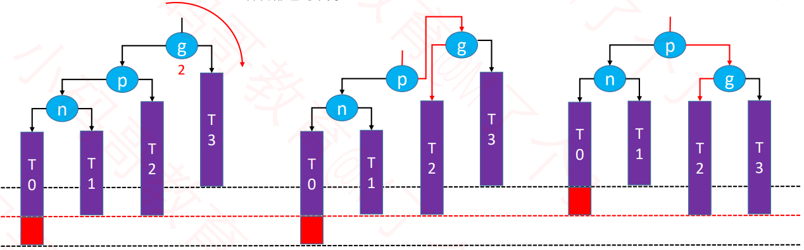
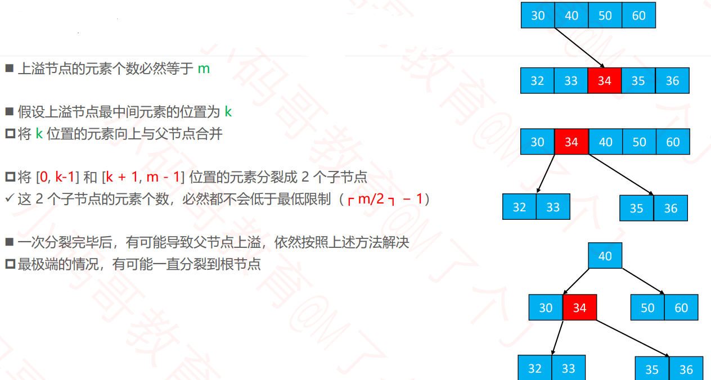
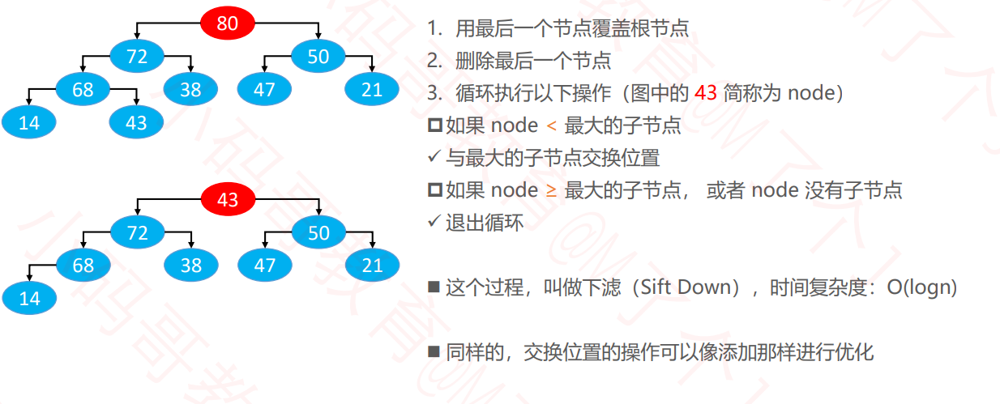

#  数据结构-树形结构

- 树Tree
- 二叉树BinaryTree
- 二叉搜索树BinarySearchTree
- 平衡二叉树BalanceBinarySearchTree
- B树
- AVL树
- 红黑树
- 哈夫曼树
- Trie树

# 一、树形结构


## 1. 树的基本概念


- 一棵树可以没有任何节点，称为空树
- 一棵树可以只有1个节点，也就是只有根节点
- 子树、左子树、右子树


- **节点的度：**子树的个数
- **树的度：**所有节点度中的最大值
- **叶子节点：**度为0的节点
- **非叶子节点：**度不为0的节点


- **层数：**根结点在第1层，根结点的子节点在第2层，以此类推。（有些教程也从第0层开始计算）
- **节点的深度：**从根结点到当前节点的唯一路径上的节点总数
- **节点的高度：**从当前节点到最远节点的路径上的节点总数
- **树的深度：**所有节点深度中的最大值
- **树的高度：**所有节点告诉中的最大值
- **树的深度等于树的高度**


- **有序树：**树中任意节点的子节点之间有顺序关系
- 无序树：树中任意节点的子节点之间没有顺序关系
- **森林：**由m棵互不相交的树组成的集合

# 二、 二叉树

**二叉树的特点：**

- 每个节点的度最大为2(最多拥有2棵子树)
- 左子树和右子树是有顺序的
- 即使某节点只有一颗子树，也要区分左右子树

## 1.二叉树的性质

- 非空二叉树的第i层，最多有2^(i-1)个节点
- 在高度为h的二叉树最多有(2^h)-1个节点
- 对于任何一棵非空二叉树，**如果叶子节点个数为n0, 度为2的节点个数为n2, 则有n0 = n2 + 1;**

## 2.满二叉树

满二叉树：最后一层节点的度都为0，其它节点的度都为2.


## 3.完全二叉树

完全二叉树：对节点从上至下、左至右开始编号，其所有编号都能与相同高度的满二叉树中的编号对应。


- 叶子节点只会出现最后2层，最后一层的叶子节点都靠左对齐
- 完全二叉树从根结点至倒数第2层是一棵满二叉树
- 满二叉树一定是完全二叉树，完全二叉树不一定是满二叉树。


> 面试题：
>
> 如果一棵完全二叉树有768个节点，求叶子节点的个数
>
> - 叶子节点个数为n0 = floor((n+1)/2)
> - 非叶子节点个数为n1+n2=floor(n/2)

## 4. 构建一棵二叉排序树

- 在BinaryTree中主要有以下方法
  - size 树节点个数
  - root 根节点
  - Node<E> 节点类
    - root()
    - left()
    - right()
    - string()

```java
package com.lcz.tree;

import com.lcz.printer.BinaryTreeInfo;

/**
 * 二叉树
 * @author LvChaoZhang
 *
 */
public class BinaryTree<E> implements BinaryTreeInfo{
	/**
	 * 树的两个成员变量
	 */
	protected int size;
	protected Node<E> root;
	
	public int size() {
		return size;
	}
	
	public boolean isEmpty() {
		return size==0;
	}
	
	
	/**
	 * 树的结点类
	 * @author LvChaoZhang
	 *
	 * @param <E>
	 */
	protected static class Node<E>{
		E element;
		Node<E> left;
		Node<E> right;
		Node<E> parent;
		public Node(E element,Node<E> parent) {
			this.element = element;
			this.parent = parent;
		}
		
		public boolean isLeaf() {
			return left==null && right==null;
		}
		public boolean hasTwoChildren() {
			return left!=null&&right!=null;
		}
	}
	
	
	@Override
	public Object root() {
		// TODO Auto-generated method stub
		return root;
	}

	@Override
	public Object left(Object node) {
		// TODO Auto-generated method stub
		return ((Node<E>)node).left;
	}

	@Override
	public Object right(Object node) {
		// TODO Auto-generated method stub
		return ((Node<E>)node).right;
	}

	@Override
	public Object string(Object node) {
		Node<E> myNode = (Node<E>)node;
		String parentString = "null";
		if (myNode.parent != null) {
			parentString = myNode.parent.element.toString();
		}
		return myNode.element + "_p(" + parentString + ")";
	}
}

```

- 在二叉搜索树中中包含创建一棵树的操作

```java
package com.lcz.tree;
/**
 * 二叉搜索树
 * @author LvChaoZhang
 *
 */

import java.util.Comparator;

public class BinarySearchTree<E> extends BinaryTree<E> {
	// 添加一个比较器
	private Comparator<E> comparator;
	
	// 构造函数
	public BinarySearchTree() {
		this(null);
	}
	
	public BinarySearchTree(Comparator<E> comparator) {
		this.comparator = comparator;
	}
	
	// 对树进行添加结点即构建一个二叉搜索树
	public void add(E element) {
		// 添加第一个结点
		if(root==null) {
			root = new Node<>(element,null);
			size++;
			return;
		}
		//添加的不是第一个结点
		Node<E> parent = root;
		Node<E> node = root;
		
		// 找到其父节点
		int cmp = 0;
		do {
			cmp = compare(element,node.element);
			parent = node;
			if(cmp>0) {
				node = node.right;
			}else if(cmp<0) {
				node = node.left;
			}else {
				// 如果要插入的结点跟树中的结点，覆盖其元素
				node.element = element;
				return;
			}
		}while(node!=null);
		
		
		// 添加进去
		Node<E> newNode = new Node<>(element,parent);
		if(cmp>0) {
			parent.right = newNode;
		}else {
			parent.left = newNode;
		}
		size++;
		
	}
	
	// 比较添加的两个元素大小
	private int compare(E e1,E e2) {
		if(comparator!=null) {
			return comparator.compare(e1, e2);
		}
		return ((Comparable<E>)e1).compareTo(e2);
	}
	// 不允许添加null结点
	private void elementNotNullCheck(E element) {
		if(element==null) {
			throw new IllegalArgumentException("element must not be null");
		}
	}
}

```

> 如果二叉树添加一个对象，如何进行比较呢？
>
> - 一是对其类本身使其实现Comparable这个接口，并对compareTo这个方法实现
>
>   ```java
>   public class Person implements Comparable<Person>{
>   @Override
>   	public int compareTo(Person e) {
>   //		if (age > e.age) return 1;
>   //		if (age < e.age) return -1;
>   //		return 0;
>   		return age - e.age;
>   	}
>   }
>   ```
>
>   
>
> - 二是对以匿名内部类的方式传入二叉搜索树的Comparator这个接口方法
>
> ```java
> BinarySearchTree<Person> bst2 = new BinarySearchTree<>(new Comparator<Person>() {
> 			public int compare(Person o1, Person o2) {
> 				return o2.getAge() - o1.getAge();
> 			}
> 		});
> ```
>
> 

## 5. 二叉树的遍历

### 5.1 前序遍历(Preorder Traversal)


**递归方式**

```java
// 递归方式前序遍历
	public void preorder(Visitor<E> visitor) {
		if(visitor==null)return;
		preorder(root,visitor); 
	}
	private void preorder(Node<E> node,Visitor<E> visitor) {
		if(node==null || visitor.stop)return;
		
		visitor.stop = visitor.visit(node.element);
		preorder(node.left,visitor);
		preorder(node.right,visitor);
		
	}
	
	// 对元素的处理
	public static abstract class Visitor<E>{
		boolean stop;
		protected abstract boolean visit(E element);
	}
	
```


**非递归方式**

当前节点不为空,打印，入栈，左节点

当前节点为空，栈弹出，右节点

```java
// 非递归方式前序遍历
		public void preorder() {
			preorder(root);
		 
		private void preorder(Node<E> node) {
			// 用栈
			Stack<Node<E>> stack = new Stack<>();
			while(!stack.isEmpty() || node!=null) {
				if(node!=null) {
					System.out.print( .element + " ");
					stack.push(node);
					node = node.left;
				}else {
					node = stack.pop().right;
				}
			}
		}
		
```

```java
public static void preOder(Node node){
    if(head!=null){
        Stack<Node> stack = new Stack<Node>();
        stack.add(head);
        while(!stack.isEmpty()){
            head = stack.pop();
            System. out.println(head.value + " ");
            if(head.right!=null){
                stack.push(head.right);
            }
            if(head.left!=null){
                stack.push(head.left);
            }
        }
    }
    System.out.println();
}
```


### 5.2 中序遍历(Inorder Traversal)


**递归方式**

```java
// 递归方式中序遍历
	public void inorder(Visitor<E> visitor) {
		if(visitor==null)return;
		inorder(root,visitor); 
	}
	private void inorder(Node<E> node,Visitor<E> visitor) {
		if(node==null || visitor.stop)return;
		inorder(node.left,visitor);
		visitor.stop = visitor.visit(node.element);
		inorder(node.right,visitor);
		
	}
```

**非递归方式**

当前节点不为空, 入栈，左节点

当前节点为空，栈弹出，打印，右节点

```java
// 非递归方式中序遍历
		public void inorder() {
			inorder(root); 
		}
		private void inorder(Node<E> root) {
			Stack<Node<E>> stack = new Stack<>();
			Node<E> cur = root;
			Node<E> node = null;
			while(cur!=null||!stack.isEmpty()) {
				if(cur!=null) {
					stack.push(cur);
					cur = cur.left;
				}else {
					node = stack.pop();
					System.out.print(node.element+" ");
					cur = node.right;
				}
			}
		}
```

```java
public static void inorder(Node head){
	if(head!=null){
        Stack<Node> stack = new Stack<Node>();
        while(!stack.isEmpty()||head!=null){
            if(head!=null){
                stack.push(head);
                head = head.left;
            }else{
                head  = stack.pop();
                System.out.println(head.value + " ");
                head = head.right;
            }
        }
    }
    System.out.println();
}
```


### 5.3 后序遍历(Postorder Traversal)


**递归方式**

```java
// 递归方式后序遍历
		public void postorder(Visitor<E> visitor) {
			if(visitor==null)return;
			postorder(root,visitor); 
		}
		private void postorder(Node<E> node,Visitor<E> visitor) {
			if(node==null || visitor.stop)return;
			postorder(node.left,visitor);
			postorder(node.right,visitor);
			visitor.stop = visitor.visit(node.element);			
		}
```

**非递归方式**

```java
// 递归方式后序遍历
		public void postorder() {
			postorder(root);
		}
		private void postorder(Node<E> root) {
			Stack<Node<E>> stack = new Stack<>();
			// 遍历结点
			Node<E> cur = root;
			Node<E> pre = null;
			while(!stack.isEmpty()||cur!=null) {
				if(cur!=null) {
					stack.push(cur);
					cur = cur.left;
				}else {
					// 若栈顶元素右孩子为空或者当前最后访问过的结点，则出栈，同时pre为栈顶元素
					if(stack.peek().right==null || stack.peek().right==pre) {
						pre  = stack.pop();
						System.out.print(pre.element + " ");
					}else {
						// 栈顶右孩子未访问，遍历其右孩子
						cur = stack.peek().right;
					}
				}
			}
		}
```

```java
public static void postOrder(Node head){
	if(head!=null){
        Stack<Node> s1 = new Stack<>();
        Stack<Node> s2 = new Stack<>();
        s1.push(head);
        while(!s1.isEmpty()){
            head = s1.pop();
            s2.push(head);
            if(head.left!=null){
                s1.push(head.left);
            }
            if(head.right!=null){
                s2.push(head.right);
            }
        }
        while(!s2.isEmpty()){
            System.out.print(s2.pop().value + " ");
        }
    }
    System.out.println();
}
```


### 5.4 层序遍历(Level Order Traversal)


```java
// 层序遍历
		public void levelOrder() {
			levelOrder(root);
		}
		private void levelOrder(Node<E> node) {
			Queue<Node<E>> queue = new LinkedList<>();
			queue.offer(node);
			while(!queue.isEmpty()) {
				node = queue.poll();
				System.out.print(node.element+" ");
				if(node.left!=null) {
					queue.offer(node.left);
				}
				
				if(node.right!=null) {
					queue.offer(node.right);
				}
			}
		}
```

## 6. 遍历的应用

### 6.1 翻转二叉树

```java
/**
 * Definition for a binary tree node.
 * public class TreeNode {
 *     int val;
 *     TreeNode left;
 *     TreeNode right;
 *     TreeNode(int x) { val = x; }
 * }
 */
class Solution {
    public TreeNode invertTree(TreeNode root) {
        // 前序遍历
		if(root==null)
			return root;
		TreeNode temp = root.left;
		root.left = root.right;
		root.right = temp;
		invertTree(root.left);
		invertTree(root.right);
		return root;
    }
}
```

### 6.2判断是否为完全二叉树

```java
// 判断一棵树是否为完全二叉树
		public  boolean isComplete() {
			Queue<Node<E>> queue = new LinkedList<>();
			queue.offer(root);
			
			boolean leaf = false;
			while(!queue.isEmpty()) {
				Node<E> node = queue.poll();
				if(leaf&&!node.isLeaf()) {
					return false;
				}
				
				if(node.left!=null) {
					queue.offer(node.left);
				}else if(node.right!=null) {
					return false;
				}
				
				
				if(node.right!=null) {
					queue.offer(node.right);
				}else {
					leaf = true;
				}
			}
			return true;
		}
```

## 7. 二叉树的前驱和后继

### 7.1 前驱节点 predecessor


- 条件：node.left!=null
- 举例：6,13,8
- predecessor=node.left.right.right.right...
- 终止条件：right为null


- 条件：node.left==null&&node.parent!=null
- 举例：7,11,9,1
- predecessor=node.parent.parent.parent...
- 终止条件：node在parent的右子树


- 条件：node.left==null&&node.parent==null
- 没有前驱节点
- 举例：没有左子树的根结点

```java
// 前驱结点
		protected Node<E> predessor(Node<E> node){
			if(node==null)
				return null;
			// 前驱结点在左子树中
			Node<E> p = node.left;
			if(p!=null) {
				while(p.right!=null) {
					p = p.right;
				}
				return p;
			}
			// 从父节点、祖父节点中寻找前驱结点
			while(node.parent!=null&&node==node.parent.left) {
				node=node.parent;
			}
			
			return node.parent;
		}
```

### 7.2 后继节点 successor

- 条件：node.right!=null
- 举例：1,8,4
- predecessor=node.right.left.left.left...
- 终止条件：left为null


- 条件：node.right==null&&node.parent!=null
- 举例：7,6,3,11
- predecessor=node.parent.parent.parent...
- 终止条件：node在parent的左子树


- 条件：node.left==null&&node.parent==null
- 没有前驱节点
- 举例：没有右子树的根结点

```java
// 后继结点
		protected Node<E> predessor(Node<E> node){
			if(node==null)
				return null;
			// 后继结点在右子树中
			Node<E> p = node.right;
			if(p!=null) {
				while(p.left!=null) {
					p = p.left;
				}
				return p;
			}
			// 从父节点、祖父节点中寻找前驱结点
			while(node.parent!=null&&node==node.parent.right) {
				node=node.parent;
			}
			
			return node.parent;
		}
```


### 7.3 根据遍历重构二叉树

以下结果可以保证重构出唯一的一棵二叉树。

- 前序遍历+中序遍历
- 后序遍历+中序遍历

#### 7.3.1 前序遍历+中序遍历构造二叉树

```java
package com.lcz.leetcode;
/**
 * 从前序和中序遍历序列构造二叉树
 * @author LvChaoZhang
 *
 */
import java.util.*;
public class Leetcode105 {
	class TreeNode{
		int val;
		TreeNode left;
		TreeNode right;
		TreeNode(int x){
			val = x;
		}
	}
	 private HashMap<Integer,Integer> hashMap;
	 private TreeNode myBuildTree(int[] preorder,int[] inorder,int preorder_left,int preorder_right,int inorder_left,int inorder_right) {
		 if(preorder_left>preorder_right) {
			 return null;
		 }
		 // 前序遍历的第一个结点是根节点
		 int preorder_root = preorder_left;
		 // 中序遍历中定位根节点
		 int inorder_root = hashMap.get(preorder[preorder_root]);
		 
		 // 根节点建立
		 TreeNode root = new TreeNode(preorder[preorder_root]);
		 // 得到左节点数量
		 int size_left_subtree = inorder_root-inorder_left;
		 root.left = myBuildTree(preorder, inorder, preorder_left+1, preorder_left+size_left_subtree, inorder_left, inorder_root-1);
		 root.right = myBuildTree(preorder, inorder, preorder_left+size_left_subtree+1, preorder_right, inorder_root+1, inorder_right);
		 return root;		 
	 }
	 public TreeNode buildTree(int[] preorder, int[] inorder) {
		 int n = preorder.length;
		 // 构造哈希映射，快速定位根节点
		 hashMap = new HashMap<Integer, Integer>();
		 for(int i=0;i<n;i++) {
			 hashMap.put(inorder[i],i);
		 }
		 return myBuildTree(preorder,inorder,0,n-1,0,n-1);
	 }
}

```

#### 7.3.2 后序遍历+中序遍历构造二叉树

```java
package com.lcz.leetcode;
/**
 * 从中序与后续遍历序列构造二叉树
 * @author LvChaoZhang
 *
 */
import java.util.*;
public class Leetcode106 {
	class TreeNode{
		int val;
		TreeNode left;
		TreeNode right;
		TreeNode(int x){
			val = x;
		}
	}
	private HashMap<Integer,Integer> hashMap;
	
	private TreeNode myBuildTree(int[] inorder,int[] postorder,int inorder_left,int inorder_right,int postorder_left,int postorder_right) {
		if(inorder_left>inorder_right) {
			return null;
		}
		//  从后序遍历中找到根节点
		int postorder_root = postorder_right;
		// 从中序遍历中找到根节点
		int inorder_root = hashMap.get(postorder[postorder_right]);
		// 构建根节点
		TreeNode root = new TreeNode(postorder[postorder_right]);
		// 计算左节点的数量
		int left_size_subtree = inorder_root-inorder_left;
		
		// 递归构建
		root.left = myBuildTree(inorder, postorder, inorder_left, inorder_root-1, postorder_left, postorder_left+left_size_subtree-1);
		root.right = myBuildTree(inorder, postorder, inorder_root+1, inorder_right, postorder_left+left_size_subtree, postorder_right-1);
		return root;
	}
	
	public TreeNode buildTree(int[] inorder, int[] postorder) {
		int n = inorder.length;
		// 构建哈希映射
		hashMap = new HashMap<>();
		for(int i=0;i<n;i++) {
			hashMap.put(inorder[i],i);
		}
		return myBuildTree(inorder,postorder,0,n-1,0,n-1);
    }
}

```

# 三、 二叉搜索树(Binary Search Tree)

- 二叉搜索树是二叉树的一种，是应用非常广泛的一种二叉树，英文简称为BST
- 又被称为：二叉查找树、二叉排序树
- 任意一个节点的值都大于其左子树所有节点的值
- 任意一个节点的值都小于其右子树所有节点的值
- 它的左右子树也是一棵二叉搜索树


- 二叉搜索树可以大大提高搜索数据的效率


- 二叉搜索树存储的元素必须具备可比较性
- 比如int double等
- 如果是自定义类型，需要指定比较方式
- 不允许为null


## 1. 二叉搜索树的接口设计

- int size();   // 元素的数量
- boolean isEmpty();  //是否为空
- void clear(); //清空所有元素
- void add();  // 添加元素
- void remove();  //删除元素
- boolean contains(E element); //是否包含某元素

> 元素的比较方案设计：
>
> - 允许外界传入一个Comparator 自定义比较方案
> - 如果没有传入Comparator，强制认定元素实现了Comparable接口

## 2. 二叉搜索树重要接口实现

### 2.1 根据元素内容获取接口

```java
// 元素是否包含在其中
	public boolean contains(E element) {
		return node(element)!=null;
	}

	
	// 给定元素返回节点
	private Node<E> node(E element){
		Node<E> node = root;
		while(node!=null) {
			int cmp = compare(element,node.element);
			if(cmp==0)
				return node;
			if(cmp>0) {
				node = node.right;
			}else {
				node = node.left;
			}
		}
		return null;
	}
	
```

### 2.2 删除节点

#### 2.2.1 删除节点-叶子节点

```java
node == node.parent.left
node.parent.left=null

node == node.parent.right
node.parent.right=null

node.parent == null
root = null
```


#### 2.2.2 删除节点-度为1的节点

```java
// 用子节点替代原节点的位置
child是node.left或者child是node.right

// 用child替代node的位置
// 如果node是左子节点
child.parent = node.parent
node.parent.left = child

// 如果node是右子节点
child.parent = node.parent
node.parent.right = child

// 如果node是根结点
root = child
child.parent = null
```


#### 2.2.3 删除节点-度为2的节点

- 先用前驱或者后继节点的值覆盖原节点的值
- 然后删除相应的前驱或者后继节点
- 如果一个节点的度为2，那么它的前驱、后继节点的度只可能是1和0.


```java
// 删除元素
	public void remove(E element) {
		remove(node(element));
	}
	private void remove(Node<E> node) {
		if(node==null)
			return;
		size--;
		
		// 度为2的结点
		if(node.hasTwoChildren()) {
			// 找到后继结点
			Node<E> s = successor(node);
			node.element = s.element;
			node = s;
		}
		
		// 删除node结点，node结点必然是度为0或者度为1
		Node<E> replacement = node.left!=null?node.left:node.right;
		if(replacement!=null) {
			// node的度为1的结点
			replacement.parent = node.parent;
			// 更改指向
			if(node.parent==null) {
				// node是度为1的结点并且是根节点
				root = replacement;
			}else if(node==node.parent.left) {
				node.parent.left = replacement;
			}else {
				node.parent.right = replacement;
			}
		}else if(node.parent==null) {
			// node是叶子结点并且是叶子结点
			root = null;
		}else {
			// node是叶子结点，但不是根节点
			if(node==node.parent.left) {
				node.parent.left = null;
			}else {
				node.parent.right = null;
			}
		}
		
	}
	
	// 后继结点
		protected Node<E> successor(Node<E> node){
			if(node==null)
				return null;
			// 后继结点在右子树
			Node<E> p = node.right;
			if(p!=null) {
				while(p.left!=null) {
					p = p.left;
				}
				return p;
			}
			// 从父节点、祖父结点寻找后继结点
			while(node.parent!=null&&node==node.parent.right) {
				node = node.parent;
			}
			return node.parent;
		}
		
```

#### 2.2.4 二叉搜索树删除某个节点的递归

```java
// 后继
	private int successor(TreeNode root) {
		root = root.right;
		while(root.left!=null) {
			root = root.left;
		}
		return root.val;
	}
	
	// 前驱
	private int predecessor(TreeNode root) {
		root = root.left;
		while(root.left!=null) {
			root = root.right;
		}
		return root.val;
	}
	public TreeNode deleteNode(TreeNode root,int key) {
		// 递归结束条件
		if(root==null)
			return null;
		// 判断条件
		if(key>root.val)
			root.right = deleteNode(root.right, key);
		else if(key<root.val)
			root.left = deleteNode(root.left, key);
		else {
			if(root.left==null&&root.right==null)
				root = null;
			else if(root.right!=null) {
				root.val = successor(root);
				root.right = deleteNode(root.right, root.val);
			}else {
				root.val = predecessor(root);
				root.left = deleteNode(root.left, root.val);
			}
		}
		return root;
	}
```

### 2.3 二叉搜索迭代器

```java
package com.lcz.leetcode;
/**
 * 二叉搜索树
 * @author LvChaoZhang
 *
 */
import java.util.*;
public class Leetcode173 {
	class TreeNode{
		int val;
		TreeNode left;
		TreeNode right;
		TreeNode(int x){
			val = x;
		}
	}
	
	class BSTIterator {
	    int index;
	    ArrayList<Integer> list;

	    public BSTIterator(TreeNode root) {
	        this.list = new ArrayList<>();
	        this.index = -1;
	        this.inorder(root);
	    }
	    // 先进行中序遍历
	    private void inorder(TreeNode root){
	        if(root==null){
	            return;
	        }
	        inorder(root.left);
	        list.add(root.val);
	        inorder(root.right);
	    }
	    
	    /** @return the next smallest number */
	    public int next() {
	        return list.get(++index);
	    }
	    
	    /** @return whether we have a next smallest number */
	    public boolean hasNext() {
	        return this.index+1 < this.list.size();
	    }
	}
```


```java
class BSTIterator {

	    // 栈
	    Stack<TreeNode> stack;
	    public BSTIterator(TreeNode root) {
	        // 初始化
	        stack = new Stack<>();
	        this.pre(root);
	    }
	    // 先存储一部分值
	    private void pre(TreeNode root){
	        while(root!=null){
	            stack.push(root);
	            root = root.left;
	        }
	    }
	    /** @return the next smallest number */
	    public int next() {
	        TreeNode temp = this.stack.pop();

	        if(temp.right!=null){
	            this.pre(temp.right);
	        }

	        return temp.val;
	    }
	    
	    /** @return whether we have a next smallest number */
	    public boolean hasNext() {
	        return this.stack.size()>0;
	    }
	}

	/**
	 * Your BSTIterator object will be instantiated and called as such:
	 * BSTIterator obj = new BSTIterator(root);
	 * int param_1 = obj.next();
	 * boolean param_2 = obj.hasNext();
	 */
}
```

### 2.4 恢复二叉搜索树

```java
// 二叉搜索树的隐式恢复
	public void recoverTree_2(TreeNode root) {
		Stack<TreeNode> stack = new Stack<>();
		TreeNode x = null, y = null, pred= null;
		while(!stack.isEmpty()||root!=null) {
			while(root!=null) {
				stack.push(root);
				root = root.left;
			}
			root = stack.pop();
			if(pred!=null&&root.val<pred.val) {
				y = root;
				if(x==null) {
					x = pred;
				}else {
					break;
				}
			}
			pred = root;
			root = root.right;
		}
		swap(x,y);
	}
	public void swap(TreeNode x,TreeNode y) {
		int temp = x.val;
		x.val = y.val;
		y.val = temp;
	}
```

# 四、平衡二叉树(Balance Binary Search Tree)

## 1. 二叉搜索树的复杂度分析


**退化成链表的一种情况**


## 2. 平衡(Balance)


**理想平衡**


## 3. 如何改进二叉搜索树


## 4. 平衡二叉搜索树（Balanced Binary Search Tree）

- 英文简称为：BBST


- 经典常见的平衡二叉搜索树有
  - AVL树
    - Windows NT内核中广泛使用
  - 红黑树
    - C++ STL（比如map、set）
    - Java的TreeMap、TreeSet、HashMap、HashSet
    - Linux的进程调度
    - Nginx的timer管理


- 一般也称为：自平衡的二叉搜索树(Self-balancing Binary Search Tree)

# 五、AVL树

- AVL树是最早发明的自平衡二叉搜索树之一


- AVL取名于两位发明者的名字
- G.M.**A**delson-**V**elsky和E.M.**L**andis


- 平衡因子（Balanced Factor）:某结点的左右子树的高度差
- AVL树的特点：
  - 每个节点的平衡因子只可能是1,0,-1
  - 每个节点的左右子树高度差不超过1
  - 搜索、添加、删除的时间复杂度是O(logn)


## 1. 简单的继承结构


## 2. 添加导致的失衡

- 示例：往下面这棵子树中添加13
- 最坏情况：可能会导致所有祖先节点都失衡
- 父节点、非祖先节点，都不可能失衡


## 3. 失衡的几种情况以及解决措施

### 3.1 LL-右旋转

- g.left = p.right
- p.right = g
- 让p成为这课子树的根结点
- T2,p,g的parent属性更新
- 先后更新g,p的高度



### 3.2 RR-左旋转

- g.right= p.left
- p.left= g
- 让p成为这课子树的根结点
- T2,p,g的parent属性更新
- 先后更新g,p的高度


### 3.3 LR-RR左旋转，LL右旋转


### 3.4 RL-LL右旋转，RR左旋转


## 4. 添加节点之后的修复代码

### 4.1 AVLNode类节点

- height高度属性
- 更新节点高度功能
- 计算节点的平衡因子
- 查找该节点的左右节点哪个更高

```java
	// AVL结点
	private static class AVLNode<E> extends Node<E>{
		int height = 1;

		public AVLNode(E element, Node<E> parent) {
			super(element, parent);
			// TODO Auto-generated constructor stub
		}
		
		// 计算平衡因子
		public int balanceFacotr() {
			int leftHeight = left==null?0:((AVLNode<E>)left).height;
			int rightHeight = right==null?0:((AVLNode<E>)right).height;
			return leftHeight-rightHeight;
		}
		
		
		// 更新结点的高度
		public void updateHeight() {
			int leftHeight = left==null?0:((AVLNode<E>)left).height;
			int rightHeight = right==null?0:((AVLNode<E>)right).height;
			height = 1+ Math.max(leftHeight,rightHeight);
		}
		
		// 查找该结点的左右结点哪个更高
		public Node<E> tallerChild(){
			int leftHeight = left==null?0:((AVLNode<E>)left).height;
			int rightHeight = right==null?0:((AVLNode<E>)right).height;
			if(leftHeight>rightHeight) return left;
			if(leftHeight<rightHeight) return right;
			return isLeftChild()?left:right;
		}
		
		@Override
		public String toString() {
			String parentString = "null";
			if (parent != null) {
				parentString = parent.element.toString();
			}
			return element + "_p(" + parentString + ")_h(" + height + ")";
		}
		
	}
```

### 4.2 添加节点之后的修复

```java
// 添加结点之后重新平衡
	@Override
	protected void afterAdd(Node<E> node) {
		while((node=node.parent)!=null) {
			if(isBalanced(node)) {
				// 更新高度
				updateHeight(node);
			}else {
				// 恢复平衡
				rebanlce(node);
				break;
			}
		}
	}
```


```java
// 判断结点是否平衡
	private boolean isBalanced(Node<E> node) {
		return Math.abs(((AVLNode<E>)node).balanceFacotr())<=1;
	}
	
	// 更新结点高度
	private void updateHeight(Node<E> node) {
		((AVLNode<E>)node).updateHeight();
	}
	
	// 恢复平衡
	private void rebanlce(Node<E> grand) {
		Node<E> parent = ((AVLNode<E>)grand).tallerChild();
		Node<E> node = ((AVLNode<E>)parent).tallerChild();
		if(parent.isLeftChild()) {
			//L
			if(node.isLeftChild()) {
				//L
				rotateRight(grand); // LL
			}else {
				//LR
				rotateLeft(parent);
				rotateRight(grand);
			}
		}else {
			//R
			if(node.isLeftChild()) {
				//RL
				rotateRight(parent);
				rotateLeft(grand);
			}else {
				// RR
				rotateLeft(grand);
			}
		}
	}
```


```java
// 左旋转
	private void rotateLeft(Node<E> grand) {
		Node<E> parent = grand.right;
		Node<E> child = parent.left;
		grand.right = child;
		parent.left = grand;
		//更新其父节点以及高度
		afterRotate(grand,parent,child);
	}
	
	// 右旋转
	private void rotateRight(Node<E> grand) {
		Node<E> parent = grand.left;
		Node<E> child = parent.right;
		grand.left = child;
		parent.right = grand;
		// 更新其父节点以及高度
		afterRotate(grand, parent, child);
	}
	
	//更新其父节点以及高度
	private void afterRotate(Node<E> grand,Node<E> parent,Node<E> child) {
		// 更新parent结点
		parent.parent = grand.parent;
		if(grand.isLeftChild()) {
			grand.parent.left = parent;
		}else if(grand.isRightChild()) {
			grand.parent.right = parent;
		}else {
			root = parent;
		}
		
		// 更新child
		if(child!=null) {
			child.parent = grand;
		}
		
		// 更新grand
		grand.parent = parent;
		
		// 更新高度
		updateHeight(grand);
		updateHeight(parent);
		
	}
```

> 效果图：


### 4.3 统一所有旋转操作

对所有节点进行标记a-g，然后对其调整。观察a-g。


### 4.4 删除导致的失衡


### 4.5 删除之后的修复代码

```java
// 删除节点之后重新平衡
	protected void afterRemove(Node<E> node) {
		while((node=node.parent)!=null) {
			if(isBalanced(node)) {
				// 更新高度
				updateHeight(node);
			}else {
				// 恢复平衡
				rebanlce(node);
			}
		}
	}
	
```

### 4.6 总结

- 添加
  - 可能会导致所有祖先节点都失衡
  - 只要让高度最低的失衡节点恢复平衡，整棵树就恢复平衡
- 删除
  - 可能导致父节点或祖先节点失衡
  - 恢复平衡后可能会导致更高层的祖先节点失衡
- 平均时间复杂度
  - 搜索 O(logn)
  - 添加 O(logn) 仅需O(1)次旋转操作
  - 删除O(logn) 最多需要O(logn)次的旋转操作

# 六、B树


## 1. m阶B树的性质(m>=2)


## 2 添加节点


## 3. 添加节点-上溢的解决



## 4. 删除节点

### 4.1 删除节点-叶子节点


### 4.2 删除节点-非叶子节点


## 5. 删除-下溢


## 6. 4阶B树

- 4阶B树的性质
  - 所有节点能存储的元素个数x：1<=x<=3
  - 所有非叶子节点的子节点个数y:2<=y<=4

# 七、红黑树(Red Black Tree)


> 红黑树必须满足以下5条性质：
>
> - 1.节点必须是RED或者BLACK
>
> - 2.根结点是BLACK
>
> - 3.叶节点(外部节点、空节点)都是BLACK
>
> - 4.RED节点的子节点都是BLACK
>
>      RED节点的parent都是BLACK
>
>     从根结点到叶子节点的所有路径上不能有2个连续的RED节点
>
> - 5.从任一节点到叶子节点的所有路径都包含相同数目的BLACK节点


## 1. 红黑树的等价替换


- 红黑树和4阶B树具有等价性
- BLACK节点与它的RED子节点融合在一起，形成1个B树节点
- 红黑树的BLACK节点个数与4阶B树的节点总个数 相等

## 2. 添加节点

- **B树中，新元素必定是添加到叶子节点中**
- 4阶B树中所有节点的元素个数x都符合1<=x<=3
- 建议新添加的节点默认为RED,这样能够让红黑树的性质尽快满足(性质1,2,3,5,都满足，性质4不一定满足)

```java
public class RBTree<E> extends BalanceBinarySearchTree<E> {
	public RBTree() {
		this(null);
	}
	public RBTree(Comparator<E> comparator) {
		super(comparator);
	}
	
	// 两个常量
	private static final boolean RED = false;
	private static final boolean BLACK = false;
	
	/**
	 * 一些功能函数
	 */
	// 染色
	private Node<E> color(Node<E> node,boolean color){
		if(node==null)
			return node;
		((RBNode<E>)node).color = color;
		return node;
	}
	// 染成红色
	private  Node<E> red(Node<E> node){
		return color(node,RED);
	}
	// 染成黑色
	private Node<E> black(Node<E> node){
		return color(node,BLACK);
	}
	// 判断其颜色
	private boolean colorOf(Node<E> node) {
		return node==null?BLACK:((RBNode<E>)node).color;
	}
	// 判断是否为黑色
	private boolean isBlack(Node<E> node) {
		return colorOf(node)==BLACK;
	}
	// 判断是否为红色
	private boolean isRed(Node<E> node) {
		return colorOf(node)==RED;
	}
	
	protected Node<E> createNode(E element,Node<E> parent){
		return new RBNode<>(element,parent);
	}
	// 红黑树的结点
	private static class RBNode<E> extends Node<E>{
		boolean color = RED;
		public RBNode(E element,Node<E> parent) {
			super(element,parent);
		}
		@Override
		public String toString() {
			String str = "";
			if(color==RED) {
				str="R_";
			}
			return str+element.toString();
		}
	}
	
}

```

### 2.1添加的所有情况

红黑树的添加共用12种情况。

- 其中有4种情况满足红黑树的性质4：parent为BLACK

  

- 其中有8种情况不满足红黑树的性质4：parent为RED(double red)


### 2.3 添加-修复性质4-LL\RR

- 判定条件：uncle不是RED
  - 1.parent染成BLACK，grand染成RED
  - 2.grand进行单旋操作
    - LL：右旋转
    - RR：左旋转

### 2.4 添加-修复性质4-LR\RL

- 判定条件：uncle不是RED
  - 1.自己染成BLACK，grand染成RED
  - 2.进行双旋操作
    - LR:parent左旋转 grand右旋转
    - RL:parent右旋转，grand左旋转

### 2.5 添加-修复性质4-上溢LL

- 判定条件：uncle是RED
  - 1.parent、uncle染成black
  - 2.grand向上合并
    - 染成RED，当做是新添加的节点进行处理，grand向上合并，可能会继续发生上溢，若上溢到根结点，只需将根结点染成BLACK

### 2.6 添加-修复性质4-上溢RR

- 判定条件：uncle是RED
  - 1.parent、uncle染成black
  - 2.grand向上合并
    - 染成RED，当做是新添加的节点进行处理

### 2.7 添加-修复性质4-上溢LR

- 判定条件：uncle是RED
  - 1.parent、uncle染成black
  - 2.grand向上合并
    - 染成RED，当做是新添加的节点进行处理

### 2.8 添加-修复性质4-上溢RL

- 判定条件：uncle是RED
  - 1.parent、uncle染成black
  - 2.grand向上合并
    - 染成RED，当做是新添加的节点进行处理

## 3. 添加节点-处理代码


```java
// 添加之后的操作
	@Override
	protected void afterAdd(Node<E> node) {
		Node<E> parent = node.parent;
		// 添加的根节点或者上溢到了根节点
		if(parent==null) {
			black(node);
			return;
		}
		
		// 4种情况
		// 父节点为黑色结点 直接添加返回
		if(isBlack(parent))
			return;
		
		// 8种情况
		// 叔父结点
		Node<E> uncle = parent.sibling();
		// 祖父结点
		Node<E> grand = parent.parent;
		// 4种情况
		if(isRed(uncle)) {
			black(parent);
			black(uncle);
			//祖父结点
			red(grand);
			afterAdd(grand);
			return;
		}
		
		//4种情况
		if(parent.isLeftChild()) {//L
			if(node.isLeftChild()) {
				//LL
				red(grand);
				black(parent);
				rotateRight(grand);
			}else {
				//LR
				red(grand);
				black(node);
				rotateLeft(parent);
				rotateRight(grand);
			}
		}else {
			if(node.isLeftChild()) {
				//RL
				red(grand);
				black(node);
				rotateRight(parent);

```

## 4. 删除节点

B树中，最后真正被删除的元素都在叶子节点中。

### 4.1 删除的所有情况

- 删除-RED节点(直接删除，不用作任何调整)
- 删除-BLACK节点
  - 拥有两个RED子节点的BLACK节点
  - 拥有1个RED子节点的BLACK节点
  - BLACK叶子节点

### 4.2 删除的代码

```java
@Override
	protected void afterRemove(Node<E> node) {
		// 如果删除的节点是红色
		// 或者 用以取代删除节点的子节点是红色
		if (isRed(node)) {
			black(node);
			return;
		}
		
		Node<E> parent = node.parent;
		// 删除的是根节点
		if (parent == null) return;
		
		// 删除的是黑色叶子节点【下溢】
		// 判断被删除的node是左还是右
		boolean left = parent.left == null || node.isLeftChild();
		Node<E> sibling = left ? parent.right : parent.left;
		if (left) { // 被删除的节点在左边，兄弟节点在右边
			if (isRed(sibling)) { // 兄弟节点是红色
				black(sibling);
				red(parent);
				rotateLeft(parent);
				// 更换兄弟
				sibling = parent.right;
			}
			
			// 兄弟节点必然是黑色
			if (isBlack(sibling.left) && isBlack(sibling.right)) {
				// 兄弟节点没有1个红色子节点，父节点要向下跟兄弟节点合并
				boolean parentBlack = isBlack(parent);
				black(parent);
				red(sibling);
				if (parentBlack) {
					afterRemove(parent);
				}
			} else { // 兄弟节点至少有1个红色子节点，向兄弟节点借元素
				// 兄弟节点的左边是黑色，兄弟要先旋转
				if (isBlack(sibling.right)) {
					rotateRight(sibling);
					sibling = parent.right;
				}
				
				color(sibling, colorOf(parent));
				black(sibling.right);
				black(parent);
				rotateLeft(parent);
			}
		} else { // 被删除的节点在右边，兄弟节点在左边
			if (isRed(sibling)) { // 兄弟节点是红色
				black(sibling);
				red(parent);
				rotateRight(parent);
				// 更换兄弟
				sibling = parent.left;
			}
			
			// 兄弟节点必然是黑色
			if (isBlack(sibling.left) && isBlack(sibling.right)) {
				// 兄弟节点没有1个红色子节点，父节点要向下跟兄弟节点合并
				boolean parentBlack = isBlack(parent);
				black(parent);
				red(sibling);
				if (parentBlack) {
					afterRemove(parent);
				}
			} else { // 兄弟节点至少有1个红色子节点，向兄弟节点借元素
				// 兄弟节点的左边是黑色，兄弟要先旋转
				if (isBlack(sibling.left)) {
					rotateLeft(sibling);
					sibling = parent.left;
				}
				
				color(sibling, colorOf(parent));
				black(sibling.left);
				black(parent);
				rotateRight(parent);
			}
		}
	}
```

## 5. 红黑树的平衡

- 为什么红黑树那5条性质，就能保证红黑树是平衡的？
- 相比较AVL树，红黑树的平衡标准比较宽松：**没有一条路径会大于其他路径的2倍**
- 是一种弱平衡、黑高度平衡。

## 6. AVL树 VS 红黑树

◼ AVL树 

- 平衡标准比较严格：**每个左右子树的高度差不超过1** 
- 最大高度是 1.44 ∗ log2 n + 2 − 1.328（100W个节点，AVL树最大树高28） 
- 搜索、添加、删除都是 O(logn) 复杂度，其中添加仅需 O(1) 次旋转调整、删除最多需要 O(logn) 次旋转调整


◼ 红黑树 

- 平衡标准比较宽松：**没有一条路径会大于其他路径的2倍** 
- 最大高度是 2 ∗ log2(n + 1)（ 100W个节点，红黑树最大树高40） 
- 搜索、添加、删除都是 O(logn) 复杂度，其中添加、删除都仅需 O(1) 次旋转调整


◼ 搜索的次数远远大于插入和删除，选择AVL树；搜索、插入、删除次数几乎差不多，选择红黑树

 ◼ 相对于AVL树来说，红黑树牺牲了部分平衡性以换取插入/删除操作时少量的旋转操作，整体来说性能要优于AVL树

 ◼ 红黑树的平均统计性能优于AVL树，实际应用中更多选择使用红黑树

# 八、二叉堆

## 1. 二叉堆

> 二叉堆的逻辑结构就是一颗完全二叉树，所以也叫完全二叉堆。


## 2. 重要接口设计

### 2.1 二叉堆-添加操作

在最后面添加元素，并上滤。


### 2.2 二叉堆-删除操作





### 2.3 二叉堆-替换操作

```java
	/**
	 * 删除元素并替换
	 */
	@Override
	public E replace(E element) {
		elementNotNullCheck(element);
		
		E root = null;
		if(size==0) {
			elements[0] = element;
			size++;
		}else {
			root = elements[0];
			elements[0] = element;
			siftDown(0);
		}
		
		return root;
	}
	
```

### 2.4 二叉堆-批量建堆

- 批量建堆，有2种方法
  - 自上而下的上滤
  - 自下而上的下滤

#### 2.4.1 二叉堆-批量建堆-自上而下的上滤


#### 2.4.2 二叉堆-批量建堆-自下而上的下滤


#### 2.4.3 二叉堆-批量建堆-效率比较


## 3. 源码

```java
package com.mj.heap;

import java.util.Comparator;

import com.mj.printer.BinaryTreeInfo;

/**
 * 二叉堆（最大堆）
 * @author MJ Lee
 *
 * @param <E>
 */
@SuppressWarnings("unchecked")
public class BinaryHeap<E> extends AbstractHeap<E> implements BinaryTreeInfo {
	private E[] elements;
	private static final int DEFAULT_CAPACITY = 10;
	
	public BinaryHeap(E[] elements, Comparator<E> comparator)  {
		super(comparator);
		
		if (elements == null || elements.length == 0) {
			this.elements = (E[]) new Object[DEFAULT_CAPACITY];
		} else {
			size = elements.length;
			int capacity = Math.max(elements.length, DEFAULT_CAPACITY);
			this.elements = (E[]) new Object[capacity];
			for (int i = 0; i < elements.length; i++) {
				this.elements[i] = elements[i];
			}
			heapify();
		}
	}
	
	public BinaryHeap(E[] elements)  {
		this(elements, null);
	}
	
	public BinaryHeap(Comparator<E> comparator) {
		this(null, comparator);
	}
	
	public BinaryHeap() {
		this(null, null);
	}

	@Override
	public void clear() {
		for (int i = 0; i < size; i++) {
			elements[i] = null;
		}
		size = 0;
	}

	@Override
	public void add(E element) {
		elementNotNullCheck(element);
		ensureCapacity(size + 1);
		elements[size++] = element;
		siftUp(size - 1);
	}

	@Override
	public E get() {
		emptyCheck();
		return elements[0];
	}

	@Override
	public E remove() {
		emptyCheck();
		
		int lastIndex = --size;
		E root = elements[0];
		elements[0] = elements[lastIndex];
		elements[lastIndex] = null;
		
		siftDown(0);
		return root;
	}

	@Override
	public E replace(E element) {
		elementNotNullCheck(element);
		
		E root = null;
		if (size == 0) {
			elements[0] = element;
			size++;
		} else {
			root = elements[0];
			elements[0] = element;
			siftDown(0);
		}
		return root;
	}
	
	/**
	 * 批量建堆
	 */
	private void heapify() {
		// 自上而下的上滤
//		for (int i = 1; i < size; i++) {
//			siftUp(i);
//		}
		
		// 自下而上的下滤
		for (int i = (size >> 1) - 1; i >= 0; i--) {
			siftDown(i);
		}
	}
	
	/**
	 * 让index位置的元素下滤
	 * @param index
	 */
	private void siftDown(int index) {
		E element = elements[index];
		int half = size >> 1;
		// 第一个叶子节点的索引 == 非叶子节点的数量
		// index < 第一个叶子节点的索引
		// 必须保证index位置是非叶子节点
		while (index < half) { 
			// index的节点有2种情况
			// 1.只有左子节点
			// 2.同时有左右子节点
			
			// 默认为左子节点跟它进行比较
			int childIndex = (index << 1) + 1;
			E child = elements[childIndex];
			
			// 右子节点
			int rightIndex = childIndex + 1;
			
			// 选出左右子节点最大的那个
			if (rightIndex < size && compare(elements[rightIndex], child) > 0) {
				child = elements[childIndex = rightIndex];
			}
			
			if (compare(element, child) >= 0) break;

			// 将子节点存放到index位置
			elements[index] = child;
			// 重新设置index
			index = childIndex;
		}
		elements[index] = element;
	}
	
	/**
	 * 让index位置的元素上滤
	 * @param index
	 */
	private void siftUp(int index) {
//		E e = elements[index];
//		while (index > 0) {
//			int pindex = (index - 1) >> 1;
//			E p = elements[pindex];
//			if (compare(e, p) <= 0) return;
//			
//			// 交换index、pindex位置的内容
//			E tmp = elements[index];
//			elements[index] = elements[pindex];
//			elements[pindex] = tmp;
//			
//			// 重新赋值index
//			index = pindex;
//		}
		E element = elements[index];
		while (index > 0) {
			int parentIndex = (index - 1) >> 1;
			E parent = elements[parentIndex];
			if (compare(element, parent) <= 0) break;
			
			// 将父元素存储在index位置
			elements[index] = parent;
			
			// 重新赋值index
			index = parentIndex;
		}
		elements[index] = element;
	}
	
	private void ensureCapacity(int capacity) {
		int oldCapacity = elements.length;
		if (oldCapacity >= capacity) return;
		
		// 新容量为旧容量的1.5倍
		int newCapacity = oldCapacity + (oldCapacity >> 1);
		E[] newElements = (E[]) new Object[newCapacity];
		for (int i = 0; i < size; i++) {
			newElements[i] = elements[i];
		}
		elements = newElements;
	}
	
	private void emptyCheck() {
		if (size == 0) {
			throw new IndexOutOfBoundsException("Heap is empty");
		}
	}
	
	private void elementNotNullCheck(E element) {
		if (element == null) {
			throw new IllegalArgumentException("element must not be null");
		}
	}

	@Override
	public Object root() {
		return 0;
	}

	@Override
	public Object left(Object node) {
		int index = ((int)node << 1) + 1;
		return index >= size ? null : index;
	}

	@Override
	public Object right(Object node) {
		int index = ((int)node << 1) + 2;
		return index >= size ? null : index;
	}

	@Override
	public Object string(Object node) {
		return elements[(int)node];
	}
}

```

## 4. Top K 问题

- 从n个整数中，找出最大的前K个数(k远远小于n)


- 如果使用排序算法进行全排序，需要O(nlogn)的时间复杂度


- 如果使用二叉堆来解决，可以使用O(nlogk)的时间复杂度来解决
  - 新建一个小顶堆
  - 扫描n个数
    - 先将遍历到的前K个数放入堆中
    - 从第K+1个数开始，如果大于堆顶元素，就使用replace操作(删除栈顶元素，将第k+1个数添加到堆中)
  - 扫描完毕后，堆中剩下的就是最大的前k个最大数


- 如果是找出最小的前k个数呢？
  - 用大顶堆
  - 如果小于堆顶元素，就使用replace操作。


# 九、优先级队列

## 1. 优先级队列(Priority Queue)

- int size(); //元素的数量
- boolean isEmpty(); //是否为空
- void enQueue(E element); //入队
- E deQueue(); //出队
- E front(); //获取队列的头元素
- void clear(); //清空


> 普通的队列是FIFO原则，也就是先进先出
>
> 优先级队列是按照优先级高低进行出队，比如将优先级最高的元素作为对头优先出队。

## 2. 优先级队列接口实现

```java
public class PriorityQueue<E> {
	private BinaryHeap<E> heap;
	
	public PriorityQueue(Comparator<E> comparator) {
		heap = new BinaryHeap<>(comparator);
	}
	
	public PriorityQueue() {
		this(null);
	}
	
	public int size() {
		return heap.size();
	}

	public boolean isEmpty() {
		return heap.isEmpty();
	}
	
	public void clear() {
		heap.clear();
	}

	public void enQueue(E element) {
		heap.add(element);
	}

	public E deQueue() {
		return heap.remove();
	}

	public E front() {
		return heap.get();
	}
}

```

**Java中的PriorityQueue**

```java
		PriorityQueue<Person> queue =  new PriorityQueue<Person>();
		queue.offer(new Person("Jack",2));
		queue.offer(new Person("Rose",10));
		queue.offer(new Person("Jake",1));
		
		while(!queue.isEmpty()) {
			System.out.println(queue.poll());
		}
```

## 3. 优先级队列的应用场景举例

- 医院的夜间门诊
  - 队列元素是病人
  - 优先级是病情的严重情况、挂号时间
- 操作系统的多任务调度
  - 队列元素是任务
  - 优先级是

# 十、哈夫曼树

## 1. 哈夫曼编码(Huffman Coding)

- 哈夫曼编码，又称为霍夫曼编码，它是现代压缩算法的基础
- 

## 2. 哈夫曼树


### 2.1 构建哈夫曼树


### 2.2 构建哈夫曼编码


# 十一、Trie

## 1. 需求

- 如何判断一堆不重复的字符串是否以某个前缀开头？
  - 用Set/Map存储字符串
  - 遍历所有字符串进行判断
  - 时间复杂度
  - O（n）

## 2. Trie

- Trie也叫作字典树、前缀树、单词查找树
- Trie搜索字符串的效率主要跟字符串的长度有关
- 假设使用Trie存储cat、dog、doggy、does、cast、add六个单词


## 3. 接口设计

- int size();
- boolean isEmpty();
- void clear();
- boolean contains(String str);
- V add(String str,V value);
- V remove(String str);
- boolean starsWith(String prefix);

```java
public class Trie<V> {
	private int size;
	private Node<V> root;
	
	public int size() {
		return size;
	}

	public boolean isEmpty() {
		return size == 0;
	}

	public void clear() {
		size = 0;
		root = null;
	}

	public V get(String key) {
		Node<V> node = node(key);
		return node != null && node.word ? node.value : null;
	}

	public boolean contains(String key) {
		Node<V> node = node(key);
		return node != null && node.word;
	}

	public V add(String key, V value) {
		keyCheck(key);
		
		// 创建根节点
		if (root == null) {
			root = new Node<>(null);
		}

		Node<V> node = root;
		int len = key.length();
		for (int i = 0; i < len; i++) {
			char c = key.charAt(i); 
			boolean emptyChildren = node.children == null;
			Node<V> childNode = emptyChildren ? null : node.children.get(c);
			if (childNode == null) {
				childNode = new Node<>(node);
				childNode.character = c;
				node.children = emptyChildren ? new HashMap<>() : node.children;
				node.children.put(c, childNode);
			}
			node = childNode;
		}
		
		if (node.word) { // 已经存在这个单词
			V oldValue = node.value;
			node.value = value;
			return oldValue;
		}
		
		// 新增一个单词
		node.word = true;
		node.value = value;
		size++;
		return null;
	}

	public V remove(String key) {
		// 找到最后一个节点
		Node<V> node = node(key);
		// 如果不是单词结尾，不用作任何处理
		if (node == null || !node.word) return null;
		size--;
		V oldValue = node.value;
		
		// 如果还有子节点
		if (node.children != null && !node.children.isEmpty()) {
			node.word = false;
			node.value = null;
			return oldValue;
		}
		
		// 如果没有子节点
		Node<V> parent = null;
		while ((parent = node.parent) != null) {
			parent.children.remove(node.character);
			if (parent.word || !parent.children.isEmpty()) break;
			node = parent;
		}
		
		return oldValue;
	}

	public boolean startsWith(String prefix) {
		return node(prefix) != null;
	}
	
	private Node<V> node(String key) {
		keyCheck(key);
		
		Node<V> node = root;
		int len = key.length();
		for (int i = 0; i < len; i++) {
			if (node == null || node.children == null || node.children.isEmpty()) return null;
			char c = key.charAt(i); 
			node = node.children.get(c);
		}
		
		return node;
	}
	
	private void keyCheck(String key) {
		if (key == null || key.length() == 0) {
			throw new IllegalArgumentException("key must not be empty");
		}
	}
	
	private static class Node<V> {
		Node<V> parent;
		HashMap<Character, Node<V>> children;
		Character character;
		V value;
		boolean word; // 是否为单词的结尾（是否为一个完整的单词）
		public Node(Node<V> parent) {
			this.parent = parent;
		}
	}
}

```

## 4. 总结

- Trie的优点：搜索前缀的效率主要跟前缀的长度有关
- Trie的缺点：需要耗费大量的内存，因此还有待改进

