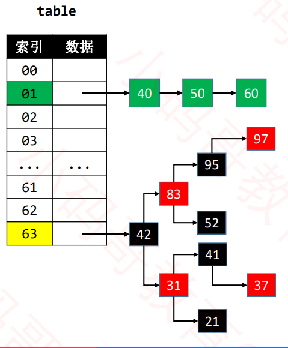

# 数据结构-HashMap

- 集合Set
- 映射Map
- 哈希表HashMap
- 哈希表LinkedHashMap

# 一、集合Set

## 1.集合

> 集合的特点：
>
> - 不存放重复的元素
> - 常用于去重

## 2. 接口

```java
public interface Set<E>{
    int size();
    boolean isEmpty();
    void clear();
    boolean contains(E element);
    void add(E element);
    void remove(E element);
    void traversal(Visitor<E> visitor);
    public static abstract class Visitor<E>{
        boolean stop;
        public abstract boolean visit(E element);
    }
}
```

### 2.1 ListSet

用LinkedList来实现

```java
public class ListSet<E> implements Set<E> {
	private List<E> list = new LinkedList<>();
	
	@Override
	public int size() {
		return list.size();
	}

	@Override
	public boolean isEmpty() {
		return list.isEmpty();
	}

	@Override
	public void clear() {
		list.clear();
	}

	@Override
	public boolean contains(E element) {
		return list.contains(element);
	}

	@Override
	public void add(E element) {
		int index = list.indexOf(element);
		if (index != List.ELEMENT_NOT_FOUND) { // 存在就覆盖
			list.set(index, element);
		} else { // 不存在就添加
			list.add(element);
		}
	}

	@Override
	public void remove(E element) {
		int index = list.indexOf(element);
		if (index != List.ELEMENT_NOT_FOUND) {
			list.remove(index);
		}
	}

	@Override
	public void traversal(Visitor<E> visitor) {
		if (visitor == null) return;
		
		int size = list.size();
		for (int i = 0; i < size; i++) {
			if (visitor.visit(list.get(i))) return;
		}
	}

}

```

### 2.2 TreeSet

用红黑树来实现Set

```java
public class TreeSet<E> implements Set<E> {
	private RBTree<E> tree;
	
	public TreeSet() {
		this(null);
	}
	
	public TreeSet(Comparator<E> comparator) {
		tree = new RBTree<>(comparator);
	}
	
	@Override
	public int size() {
		return tree.size();
	}

	@Override
	public boolean isEmpty() {
		return tree.isEmpty();
	}

	@Override
	public void clear() {
		tree.clear();
	}

	@Override
	public boolean contains(E element) {
		return tree.contains(element);
	}

	@Override
	public void add(E element) {
		tree.add(element);
	}

	@Override
	public void remove(E element) {
		tree.remove(element);
	}

	@Override
	public void traversal(Visitor<E> visitor) {
		tree.inorder(new BinaryTree.Visitor<E>() {
			@Override
			public boolean visit(E element) {
				return visitor.visit(element);
			}
		});
	}

}

```

# 二、映射Map

- Map在有些编程语言也被叫做字典(dictionary)

- Map中的每一个key是唯一的

- > TreeMap、TreeSet的key必须具备可比性

  

## 1.Map的接口设计

```java
public interface Map<K,V>{
	int size();
    boolean isEmpy();
    void clear();
    V put(K key,V value);
    V get(K key);
    V remove(K key);
    boolean containsKey(K key);
    boolean containsValue(V value);
    void traversal(Visitor<K,V> visitor);
    
    public static abstract class Visitor<K,V>{
        boolean stop;
        public abstract boolean visit(K key,V value);
    }
}
```

> 类似Set、Map可以直接利用之前学习的链表、二叉搜索树(AVL树、红黑树)等数据结构来实现。

## 2.Map的接口具体实现

```java
public class TreeMap<K, V> implements Map<K, V> {
	private static final boolean RED = false;
	private static final boolean BLACK = true;
	private int size;
	private Node<K, V> root;
	private Comparator<K> comparator;
	
	public TreeMap() {
		this(null);
	}
	
	public TreeMap(Comparator<K> comparator) {
		this.comparator = comparator;
	}
	
	public int size() {
		return size;
	}

	public boolean isEmpty() {
		return size == 0;
	}

	public void clear() {
		root = null;
		size = 0;
	}

	@Override
	public V put(K key, V value) {
		keyNotNullCheck(key);
		
		// 添加第一个节点
		if (root == null) {
			root = new Node<>(key, value, null);
			size++;

			// 新添加节点之后的处理
			afterPut(root);
			return null;
		}
		
		// 添加的不是第一个节点
		// 找到父节点
		Node<K, V> parent = root;
		Node<K, V> node = root;
		int cmp = 0;
		do {
			cmp = compare(key, node.key);
			parent = node;
			if (cmp > 0) {
				node = node.right;
			} else if (cmp < 0) {
				node = node.left;
			} else { // 相等
				node.key = key;
				V oldValue = node.value;
				node.value = value;
				return oldValue;
			}
		} while (node != null);

		// 看看插入到父节点的哪个位置
		Node<K, V> newNode = new Node<>(key, value, parent);
		if (cmp > 0) {
			parent.right = newNode;
		} else {
			parent.left = newNode;
		}
		size++;
		
		// 新添加节点之后的处理
		afterPut(newNode);
		return null;
	}

	@Override
	public V get(K key) {
		Node<K, V> node = node(key);
		return node != null ? node.value : null;
	}

	@Override
	public V remove(K key) {
		return remove(node(key));
	}

	@Override
	public boolean containsKey(K key) {
		return node(key) != null;
	}

	@Override
	public boolean containsValue(V value) {
		if (root == null) return false;
		
		Queue<Node<K, V>> queue = new LinkedList<>();
		queue.offer(root);
		
		while (!queue.isEmpty()) {
			Node<K, V> node = queue.poll();
			if (valEquals(value, node.value)) return true;
			
			if (node.left != null) {
				queue.offer(node.left);
			}
			
			if (node.right != null) {
				queue.offer(node.right);
			}
		}
		
		return false;
	}

	@Override
	public void traversal(Visitor<K, V> visitor) {
		if (visitor == null) return;
		traversal(root, visitor);
	}
	
	private void traversal(Node<K, V> node, Visitor<K, V> visitor) {
		if (node == null || visitor.stop) return;
		
		traversal(node.left, visitor);
		if (visitor.stop) return;
		visitor.visit(node.key, node.value);
		traversal(node.right, visitor);
	}
	
	private boolean valEquals(V v1, V v2) {
		return v1 == null ? v2 == null : v1.equals(v2);
	}
	
	private V remove(Node<K, V> node) {
		if (node == null) return null;
		
		size--;
		
		V oldValue = node.value;
		
		if (node.hasTwoChildren()) { // 度为2的节点
			// 找到后继节点
			Node<K, V> s = successor(node);
			// 用后继节点的值覆盖度为2的节点的值
			node.key = s.key;
			node.value = s.value;
			// 删除后继节点
			node = s;
		}
		
		// 删除node节点（node的度必然是1或者0）
		Node<K, V> replacement = node.left != null ? node.left : node.right;
		
		if (replacement != null) { // node是度为1的节点
			// 更改parent
			replacement.parent = node.parent;
			// 更改parent的left、right的指向
			if (node.parent == null) { // node是度为1的节点并且是根节点
				root = replacement;
			} else if (node == node.parent.left) {
				node.parent.left = replacement;
			} else { // node == node.parent.right
				node.parent.right = replacement;
			}
			
			// 删除节点之后的处理
			afterRemove(replacement);
		} else if (node.parent == null) { // node是叶子节点并且是根节点
			root = null;
		} else { // node是叶子节点，但不是根节点
			if (node == node.parent.left) {
				node.parent.left = null;
			} else { // node == node.parent.right
				node.parent.right = null;
			}
			
			// 删除节点之后的处理
			afterRemove(node);
		}
		
		return oldValue;
	}
	
	private void afterRemove(Node<K, V> node) {
		// 如果删除的节点是红色
		// 或者 用以取代删除节点的子节点是红色
		if (isRed(node)) {
			black(node);
			return;
		}
		
		Node<K, V> parent = node.parent;
		if (parent == null) return;
		
		// 删除的是黑色叶子节点【下溢】
		// 判断被删除的node是左还是右
		boolean left = parent.left == null || node.isLeftChild();
		Node<K, V> sibling = left ? parent.right : parent.left;
		if (left) { // 被删除的节点在左边，兄弟节点在右边
			if (isRed(sibling)) { // 兄弟节点是红色
				black(sibling);
				red(parent);
				rotateLeft(parent);
				// 更换兄弟
				sibling = parent.right;
			}
			
			// 兄弟节点必然是黑色
			if (isBlack(sibling.left) && isBlack(sibling.right)) {
				// 兄弟节点没有1个红色子节点，父节点要向下跟兄弟节点合并
				boolean parentBlack = isBlack(parent);
				black(parent);
				red(sibling);
				if (parentBlack) {
					afterRemove(parent);
				}
			} else { // 兄弟节点至少有1个红色子节点，向兄弟节点借元素
				// 兄弟节点的左边是黑色，兄弟要先旋转
				if (isBlack(sibling.right)) {
					rotateRight(sibling);
					sibling = parent.right;
				}
				
				color(sibling, colorOf(parent));
				black(sibling.right);
				black(parent);
				rotateLeft(parent);
			}
		} else { // 被删除的节点在右边，兄弟节点在左边
			if (isRed(sibling)) { // 兄弟节点是红色
				black(sibling);
				red(parent);
				rotateRight(parent);
				// 更换兄弟
				sibling = parent.left;
			}
			
			// 兄弟节点必然是黑色
			if (isBlack(sibling.left) && isBlack(sibling.right)) {
				// 兄弟节点没有1个红色子节点，父节点要向下跟兄弟节点合并
				boolean parentBlack = isBlack(parent);
				black(parent);
				red(sibling);
				if (parentBlack) {
					afterRemove(parent);
				}
			} else { // 兄弟节点至少有1个红色子节点，向兄弟节点借元素
				// 兄弟节点的左边是黑色，兄弟要先旋转
				if (isBlack(sibling.left)) {
					rotateLeft(sibling);
					sibling = parent.left;
				}
				
				color(sibling, colorOf(parent));
				black(sibling.left);
				black(parent);
				rotateRight(parent);
			}
		}
	}

	private Node<K, V> predecessor(Node<K, V> node) {
		if (node == null) return null;
		
		// 前驱节点在左子树当中（left.right.right.right....）
		Node<K, V> p = node.left;
		if (p != null) {
			while (p.right != null) {
				p = p.right;
			}
			return p;
		}
		
		// 从父节点、祖父节点中寻找前驱节点
		while (node.parent != null && node == node.parent.left) {
			node = node.parent;
		}

		// node.parent == null
		// node == node.parent.right
		return node.parent;
	}
	
	private Node<K, V> successor(Node<K, V> node) {
		if (node == null) return null;
		
		// 前驱节点在左子树当中（right.left.left.left....）
		Node<K, V> p = node.right;
		if (p != null) {
			while (p.left != null) {
				p = p.left;
			}
			return p;
		}
		
		// 从父节点、祖父节点中寻找前驱节点
		while (node.parent != null && node == node.parent.right) {
			node = node.parent;
		}

		return node.parent;
	}
	
	private Node<K, V> node(K key) {
		Node<K, V> node = root;
		while (node != null) {
			int cmp = compare(key, node.key);
			if (cmp == 0) return node;
			if (cmp > 0) {
				node = node.right;
			} else { // cmp < 0
				node = node.left;
			}
		}
		return null;
	}
	
	private void afterPut(Node<K, V> node) {
		Node<K, V> parent = node.parent;
		
		// 添加的是根节点 或者 上溢到达了根节点
		if (parent == null) {
			black(node);
			return;
		}
		
		// 如果父节点是黑色，直接返回
		if (isBlack(parent)) return;
		
		// 叔父节点
		Node<K, V> uncle = parent.sibling();
		// 祖父节点
		Node<K, V> grand = red(parent.parent);
		if (isRed(uncle)) { // 叔父节点是红色【B树节点上溢】
			black(parent);
			black(uncle);
			// 把祖父节点当做是新添加的节点
			afterPut(grand);
			return;
		}
		
		// 叔父节点不是红色
		if (parent.isLeftChild()) { // L
			if (node.isLeftChild()) { // LL
				black(parent);
			} else { // LR
				black(node);
				rotateLeft(parent);
			}
			rotateRight(grand);
		} else { // R
			if (node.isLeftChild()) { // RL
				black(node);
				rotateRight(parent);
			} else { // RR
				black(parent);
			}
			rotateLeft(grand);
		}
	}
	
	private void rotateLeft(Node<K, V> grand) {
		Node<K, V> parent = grand.right;
		Node<K, V> child = parent.left;
		grand.right = child;
		parent.left = grand;
		afterRotate(grand, parent, child);
	}
	
	private void rotateRight(Node<K, V> grand) {
		Node<K, V> parent = grand.left;
		Node<K, V> child = parent.right;
		grand.left = child;
		parent.right = grand;
		afterRotate(grand, parent, child);
	}
	
	private void afterRotate(Node<K, V> grand, Node<K, V> parent, Node<K, V> child) {
		// 让parent称为子树的根节点
		parent.parent = grand.parent;
		if (grand.isLeftChild()) {
			grand.parent.left = parent;
		} else if (grand.isRightChild()) {
			grand.parent.right = parent;
		} else { // grand是root节点
			root = parent;
		}
		
		// 更新child的parent
		if (child != null) {
			child.parent = grand;
		}
		
		// 更新grand的parent
		grand.parent = parent;
	}

	private Node<K, V> color(Node<K, V> node, boolean color) {
		if (node == null) return node;
		node.color = color;
		return node;
	}
	
	private Node<K, V> red(Node<K, V> node) {
		return color(node, RED);
	}
	
	private Node<K, V> black(Node<K, V> node) {
		return color(node, BLACK);
	}
	
	private boolean colorOf(Node<K, V> node) {
		return node == null ? BLACK : node.color;
	}
	
	private boolean isBlack(Node<K, V> node) {
		return colorOf(node) == BLACK;
	}
	
	private boolean isRed(Node<K, V> node) {
		return colorOf(node) == RED;
	}
	
	private int compare(K e1, K e2) {
		if (comparator != null) {
			return comparator.compare(e1, e2);
		}
		return ((Comparable<K>)e1).compareTo(e2);
	}
	
	private void keyNotNullCheck(K key) {
		if (key == null) {
			throw new IllegalArgumentException("key must not be null");
		}
	}

	private static class Node<K, V> {
		K key;
		V value;
		boolean color = RED;
		Node<K, V> left;
		Node<K, V> right;
		Node<K, V> parent;
		public Node(K key, V value, Node<K, V> parent) {
			this.key = key;
			this.value = value;
			this.parent = parent;
		}
		
		public boolean isLeaf() {
			return left == null && right == null;
		}
		
		public boolean hasTwoChildren() {
			return left != null && right != null;
		}
		
		public boolean isLeftChild() {
			return parent != null && this == parent.left;
		}
		
		public boolean isRightChild() {
			return parent != null && this == parent.right;
		}
		
		public Node<K, V> sibling() {
			if (isLeftChild()) {
				return parent.right;
			}
			
			if (isRightChild()) {
				return parent.left;
			}
			
			return null;
		}
	}
}

```

## 3.Map与Set

- Map的所有key组合在一起就是一个Set
- Set可以间接利用Map来作内部实现。


# 三、哈希表

## 1. TreeMap的分析

- 时间复杂度(平均)
  - 添加、删除、搜索 O(logn)
- 特点
  - Key必须具备可比较性
  - 元素的分布是有顺序的
- 在实际应用中，很多时候的需求
  - Map中存储的元素不需要讲究顺序
  - Map中的Key不需要具备可比较性

## 2. 哈希表（Hash Table）


- 哈希表也叫作散列表


- 它是如何实现高效处理数据的？
  - put("Jack",666);
  - put(“Rose”,777);
  - put("Kate",888);


- 添加、搜索、删除的流程都是类似的。
  - 利用哈希函数生成key对应的index(O(1))
  - 根据index操作定位数组元素(O(1))


- 哈希表是【空间换时间】的典型应用
- 哈希函数，也叫作散列函数
- 哈希表内部的数组元素，很多地方叫Bucket(桶)，整个数组叫Buckets或者Bucket Array。


### 2.1 哈希冲突(Hash Collision)

- 哈希冲突也叫作哈希碰撞
- 2个不同的key，经过哈希函数计算出相同的结果
- key1 ≠  key2, hash(key1)=hash(key2)

> 解决哈希冲突的常见方法：
>
> - 1.开放定址法
>   - 按照一定规则向其他地址探测，直到遇到空桶
> - 2.再哈希法
>   - 设计多个哈希函数
> - 3.链地址法
>   - 比如通过链表将同一个index的元素串起来

### 2.2 JDK1.8的哈希冲突解决方案



- 默认使用单向链表将元素串起来

- 在添加元素时，可能会由单向链表转为红黑树来存储元素
  - 比如当哈希表容量≥64且单向链表的的节点数量大于8

- 当红黑树节点数量少到一定程度时，又会转向单向链表
- JDK1.8 中的单向链表是使用**链表**+**红黑树**来解决哈希冲突

### 2.3 哈希函数


### 2.4 如何生成key的哈希值

- key的常见种类可能又
  - 整数、浮点数、字符串、自定义对象
  - 不同种类的key，哈希值的生成方式不一样，但目标是一致的
    - 尽量让每个key的哈希值是唯一的
    - **尽量让key的所有信息参与运算**

#### a.整数

- 整数值当做哈希值
- 比如10的哈希值就是10

```java
public static int hashCode(int value){
    return value;
}
```

#### b.浮点数

- 将存储的二进制格式转为整数值

```java
public static int hashCode(float value){
    return floatToIntBits(value);
}
```

#### c.Long的哈希值

```java
public static int hashCode(long value){
    return (int)(value^(value>>>32));
}
```

#### d.Double的哈希值

```java
public static int hashCode(int value){
    long bits = doubleToLongBits(value);
    return (int)(bits^(bits>>>32));
}
```

> Long和Double中的>>>和^的作用是？
>
> - 高32bit和低32位混合计算出32bit的哈希值
> - 充分利用所有信息计算出哈希值

#### e. 字符串的哈希值


```java
String string = "jack";
int hashCode = 0;
int len = string.length();
for(int i=0;i<len;i++){
    char c = string.charAt(i);
    hashCode = (hashCode << 5) - hashCode + c;
}
```

> 关于31的探讨？
>
> - **31不仅仅是符合2^n-1，它是个奇素数(既是奇数，又是素数，也就是质数)**
> - **素数和其他数相乘的结果比其他方式更容易产成唯一性，减少哈希冲突**
> - **最终选择31是经过观测分布结果后的选择**

**所有的目标就是为了使得hashcode这个值唯一，分布均匀，从而减少哈希冲突。**

#### f.自定义对象的哈希值


> **hashCode和equals的区别是什么呢？**
>
> hashCode是用来计算哈希表的索引
>
> equals是哈希冲突的时候，计算索引即key值是否相等

### 2.5 哈希值的进一步处理：扰动计算

```java
private int hash(K key){
    if(key==null) return 0;
    int h = key.hashCode();
    return (h^h>>>16)&(table.length-1);
}
```

### 2.6 哈希表扩容

- 装填因子(Load Factor):节点总数量/哈希表桶数组长度，也叫作负载因子。
- 在JDK1.8的HashMap中，如果装填因子超过0.75，就扩容为原来的2倍。

### 2.7 TreeMap vs HashMap

- 何时选择TreeMap？
  - 元素具备可比较性且要求升序遍历(按照元素从小到大)
- 何时选择HashMap？
  - 无序遍历

## 3.LinkedHashMap

> HashMap和双向链表合二为一即是LinkedHashMap。
>
> - HashMap在存储数据元素上是无序的，也就是迭代HashMap所得到的的元素并不是它们最初放置到HashMap上的顺序
>
> - 但在某些场景下，需要一个可以保持插入顺序的Map。LinkedHashMap虽然增加了时间和空间上的开销，但是它通过维护一个额外的双向链表保证了迭代顺序。

> HashMap:数组+链表+红黑树

Map


> LinkedHashMap
>
> 下图很好的还原了LinkedHashMap的原貌：HashMap和双向链表的密切配合和分工合作早就了LinkedHashMap。特别注意的是，next用于位于HashMap各个桶中的Entry链，而before和after用于维护LinkedListHashMap的双向链表。虽然它们的作用对象都是entry，但是各自分离。


 

> 其中该循环双向链表的头部存放的是最久访问的节点或最先插入的节点，尾部为最近访问的或最近插入的节点，迭代器遍历方向是从链表的头部开始到链表尾部结束，在链表尾部有一个空的header节点，该节点不存放key-value内容，为LinkedHashMap类的成员属性，循环双向链表的入口。


根据链表中元素的顺序可以分为：按插入顺序的链表和按访问顺序的链表。

默认是按插入顺序排序，如果指定按访问顺序排序，那么访问之后会将这次访问的元素移至链表尾部。


### 3.1 LinkedHashMap实现LRU

其中LinkedHashMap提供了一个Boolean值可以让用户指定是否实现LRU。

- accessOrder:
  - false:所有的entry按照插入的顺序排列
  - true：所有的entry按照访问的顺序排列

即双向链表最头的那个数据就是要淘汰的数据。

- 访问，这个词有两个意思：	
  - 根据key拿到value，即get方法
  - 修改key对应的value，即put方法

> LRU（即Least Recently Used最近最少使用，也就是当缓存满了之后，会优先淘汰那些最近不常访问的数据）

> LRU缓存机制可以通过哈希表辅以双向链表实现，用一个哈希表和一个双向链表维护所有在缓存中的键值对：
>
> - 双向链表按照被使用的顺序存储了这些键值对，靠近头部的的键值对是最近使用的，而靠近尾部的键值对是最久未使用的。
> - 哈希表即普通的哈希映射(HashMap)，通过缓存数据的键映射到其在双向链表中的位置。

这样一来，在使用哈希表进行定位，找出缓存项在双向链表中的位置，随后将其移动到双向链表的头部，即可在O(1)的时间内完成get和put操作。具体的方法如下：

- 对于get方法，首先判断key是否存在：
  - 如果key不存在，则返回-1；
  - 如果key存在，则key对应的节点是最近使用的节点。通过哈希表定位到该结点在双向链表中的位置，然后将其移动到双向链表的头部，最后返回该节点的值。
- 对于put方法，首先判断key是否存在：
  - 如果key不存在，使用key和value创建一个新的节点，在双向链表的头部添加该节点，并将key和该节点添加到哈希表中，然后判断双向链表的结点数是否超出容量，如果超出容量，则删除双向链表的尾部节点，并删除哈希表中对应的项。
  - 如果key存在，则与get操作类似，先通过哈希表定位，再将对应的节点的值更新为value，并将该节点移动到双向链表的头部。

```java
	class LRUCache extends LinkedHashMap<Integer,Integer> {
		private int capacity;
		
	    public LRUCache(int capacity) {
            // true指的是按照访问顺序
            // false指的是按照插入顺序
	    	super(capacity,0.75F,true);
	    	this.capacity = capacity;
	    }
	    
	    public int get(int key) {
			return super.getOrDefault(key, -1);

	    }
	    
	    public void put(int key, int value) {
	    	super.put(key, value);
	    }
	    
	    @Override
	    	protected boolean removeEldestEntry(Map.Entry<Integer, Integer> eldest) {
	    		// TODO Auto-generated method stub
	    		return size()>capacity;
	    	}
	}

```

### 3.2 双向链表+hashmap实现LRU

```java
package com.lcz.leetcode;

import java.util.HashMap;

public class Leetcode146_2 {
	class LRUCache {
		// 双向链表
		class DLinkedNode{
			int key;
			int value;
			DLinkedNode prev;
			DLinkedNode next;
			public DLinkedNode() {
				
			}
			public DLinkedNode(int key,int value) {
				this.key = key;
				this.value = value;
			}
		}
		// hashmap
		private HashMap<Integer,DLinkedNode> cache = new HashMap<>();
		// 定义一些变量
		private int size;
		private int capacity;
		private DLinkedNode head,tail;
		
	    public LRUCache(int capacity) {
	    	this.size = 0;
	    	this.capacity = capacity;
	    	// 生成伪头部和伪尾部结点
	    	head = new DLinkedNode();
	    	tail = new DLinkedNode();
	    	head.next = tail;
	    	tail.prev = head;
	    }
	    
	    public int get(int key) {
			DLinkedNode node = cache.get(key);
			if(node==null) {
				return -1;
			}else {
				// 如果key存在，则哈希表定位，节点移动到头部
				moveToHead(node);
				return node.value;
			}
	    }
	    
	    public void put(int key, int value) {
	    	DLinkedNode node = cache.get(key);
	    	if(node==null) {
	    		// 如果key不存在，则创建一个新的结点
	    		DLinkedNode newNode = new DLinkedNode(key,value);
	    		// 添加到哈希表中
	    		cache.put(key,newNode);
	    		// 添加到双向链表的头部
	    		addToHead(newNode);
	    		++size;
	    		//判断容量是否足够
	    		if(size>capacity) {
	    			//超出容量，则删除双向链表的尾部结点
	    			DLinkedNode tail = removeTail();
	    			// 删除哈希表中对应的项
	    			cache.remove(tail.key);
	    			--size;
	    		}
	    	}else {
	    		// key存在，哈希表定位，修改key，移动头部
	    		node.value = value;
	    		moveToHead(node);
	    	}
	    }
	    
	    // 添加到头部
	    private void addToHead(DLinkedNode node) {
	    	node.prev = head;
	    	node.next = head.next;
	    	head.next.prev = node;
	    	head.next = node;
	    }
	    // 删结点
	    private void removeNode(DLinkedNode node) {
	    	node.prev.next = node.next;
	    	node.next.prev = node.prev;
	    }
	   // 移动头结点 分两步，删结点，填结点
	    private void moveToHead(DLinkedNode node) {
	    	removeNode(node);
	    	addToHead(node);
	    }
	    
	    // 删除尾部结点
	    private DLinkedNode removeTail() {
	    	DLinkedNode res = tail.prev;
	    	removeNode(res);
	    	return res;
	    }
	    
	}
}


```

