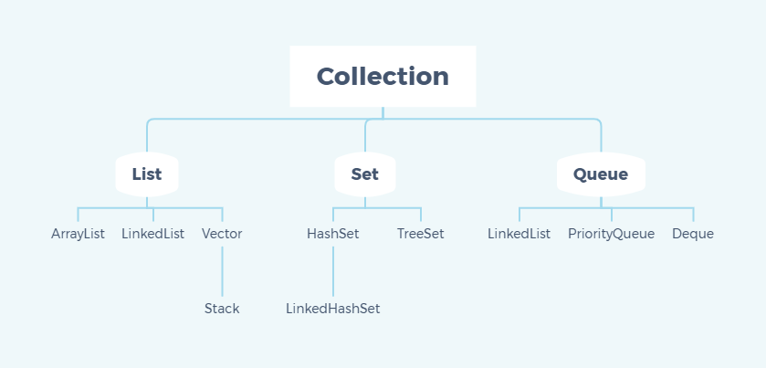
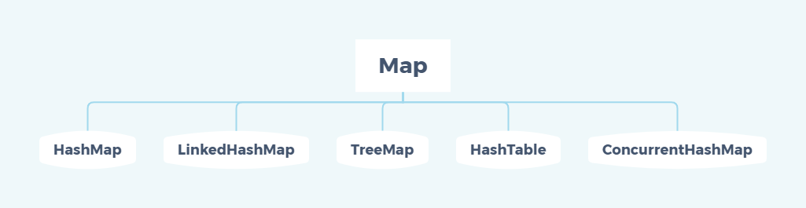
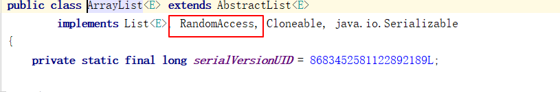
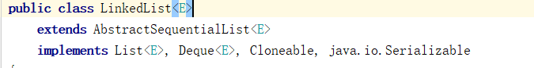
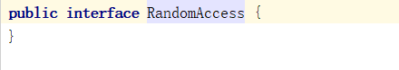
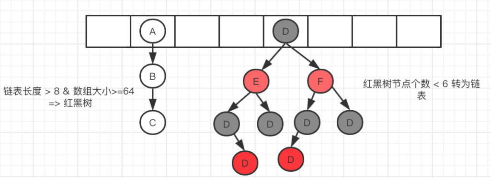
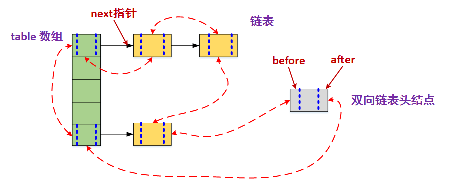

## Java容器题目

### 1.Java容器有哪些？

**Map接口**和**Collection接口**是所有集合框架的父接口：

- Collection接口的子接口包括：**Set接口**和List接口
- Map接口的实现类主要有：HashMap、TreeMap、Hashtable、ConcurrentHashMap
- Set接口的实现类主要有：HashSet、TreeSet、LinkedHashSet
- List接口的实现类主要有：ArrayList、LinkedList、Stack、Vector

Java容器类库定义了两个不同概念的容器：**Collection**和**Map**

#### a.Collection

> **一个独立元素的序列，这些元素都服从一条或多条规则。List必须按照插入的顺序保存元素；Set不能有重复元素；Queue按照排队规则来确定对象产生的顺序。**



#### b.Map

> **一组成对的“键值对”对象，允许使用键来查找值**



**总结：**

**Collection集合主要有List和Set两大接口：**

- List：一个有序(元素存入集合的顺序和取出的顺序一致)容器，元素可以重复，可以插入多个null元素，元素都有索引。常用的实现类有ArrayList、LinkedList和Vector
- Set：一个无序（存入和取出顺序有可能不一致）容器，不可以存储重复元素，只允许存入一个null元素，必须保证元素唯一性。Set接口常用实现类是HashSet、LinkedHashSet和TreeSet。

Map是一个键值对集合，存储键、值之间的映射。Key无序，唯一；value不要求有序，允许重复。常用实现类：HashMap、TreeMap、HashTable、LinkedHashMap和CponcurrentHashMap。

### 2.Collection和Collections有什么区别？

- **Collection是一个集合接口**，它提供了对集合对象进行基本操作的通用接口方法，**所有集合都是它的子类**，比如List、Set；
- **Collections是一个包装类**，**包含了很多静态方法**，不需要被实例化，就是一个工具类，比如提供的排序方法：Collections.sort(list).

> 包装类：Java语言是一个面向对象的编程语言，但是Java中的基本数据类型却不是面向对象的。而包装类就是将基本类型包装起来的类，将基本类型转成对象，将基本类型作为对象来处理。

### 3.List、Set、Map之间的区别

List、Set、Map的区别主要体现在两个方面：**元素是否有序**、**是否允许元素重复**。

三者之间的区别，如下表：


### 4.集合框架底层结构

**Collection**

- (1)List
  - **ArrayList**：Object数组
  - **Vector**：Object数组
  - **LinkedList**：双向循环链表
  - **CopyOnWriteArrayList:** 线程安全的list
- (2)Set
  - **HashSet**(无序，唯一)：基于HashMap实现的，底层采用HashMap来保存元素。
  - **LinkedHashSet**：LinkedHashSet继承与HashSet，并且其内部是通过LinkedHashMap来实现的。
  - **TreeSet**(有序，唯一)：红黑树（自平衡的排序二叉树）

**Map**

- **HashMap**： JDK1.8之前HashMap由数组+链表组成的，数组是HashMap的主体，链表则是主要为了解决哈希冲突而存在的（“拉链法”解决冲突）.JDK1.8以后在解决哈希冲突时有了较大的变化，当链表长度大于阈值（默认为8）时，将链表转化为红黑树，以减少搜索时间
- **LinkedHashMap**：LinkedHashMap 继承自 HashMap，所以它的底层仍然是基于拉链式散列结构即由数组和链表或红黑树组成。另外，LinkedHashMap 在上面结构的基础上，增加了一条双向链表，使得上面的结构可以保持键值对的插入顺序。同时通过对链表进行相应的操作，实现了访问顺序相关逻辑。
- **HashTable**： 数组+链表组成的，数组是 HashMap 的主体，链表则是主要为了解决哈希冲突而存在的
- **TreeMap**： 红黑树（自平衡的排序二叉树）
- **ConcurrentHashMap：**多线程下使用的HashMap。

### 5.Java集合的快速失败机制“fail-fast”？

是Java集合的一种错误检测机制，当多个线程对集合上进行结构上的改变的操作时，有可能会产生fail-fast机制。

例如：**假设存在两个线程（线程1、线程2），线程1通过Iterator在遍历集合A中的元素，在某个时候线程2修改了集合A的结构（是结构上面的修改，而不是简单的修改集合元素的内容），那么这个时候程序就会抛出 ConcurrentModificationException 异常，从而产生fail-fast机制。**

原因：迭代器在遍历时直接访问集合中的内容，并且在遍历过程中使用一个 modCount 变量。集合在被遍历期间如果内容发生变化，就会改变modCount的值。每当迭代器使用hashNext()/next()遍历下一个元素之前，都会检测modCount变量是否为expectedmodCount值，是的话就返回遍历；否则抛出异常，终止遍历。

解决办法：

- 在遍历过程中，所有涉及到改变modCount值得地方全部加上synchronized。

- 使用CopyOnWriteArrayList来替换ArrayList

### 6.哪些集合类是线程安全的？

  **Vector**、**Hashtable**、**Stack** 都是线程安全的，而像 **HashMap** 则是非线程安全的，不过在 JDK 1.5 之后随着 Java. util. concurrent 并发包的出现，它们也有了自己对应的线程安全类，比如 HashMap 对应的线程安全类就是 **ConcurrentHashMap**。

### 7.迭代器Iterator是什么？

  Iterator 接口提供遍历任何 Collection 的接口。我们可以从一个 Collection 中使用迭代器方法来获取迭代器实例。迭代器取代了 Java 集合框架中的 Enumeration，迭代器允许调用者在迭代过程中移除元素。

```java
List<String> list = new ArrayList<>();

Iterator<String> it = list. iterator();

while(it. hasNext()){

String obj = it. next();

System. out. println(obj);

}

```

Iterator的特点是只能单向遍历，但是更加安全。因为它可以确保，在当前遍历的集合元素被更改的时候，就会抛出ConcurrentModificationException异常。

### 8.怎么确保一个集合不能被修改？

可以使用 Collections. unmodifiableCollection(Collection c) 方法来创建一个只读集合，这样改变集合的任何操作都会抛出 Java. lang. UnsupportedOperationException 异常。

示例代码如下：

```java
List<String> list = new ArrayList<>();

list. add("x");

Collection<String> clist = Collections. unmodifiableCollection(list);

clist. add("y"); // 运行时此行报错

System. out. println(list. size());

```

### 9. Iterator 和 ListIterator 有什么区别？

- Iterator 可以遍历 Set 和 List 集合，而 ListIterator 只能遍历 List。
- Iterator 只能单向遍历，而 ListIterator 可以双向遍历（向前/后遍历）。
- ListIterator 从 Iterator 接口继承，然后添加了一些额外的功能，比如添加一个元素、替换一个元素、获取前面或后面元素的索引位置。

### 10.List有关题目

####  10.0 遍历一个List有哪些不同的方式？每种方式的原理是什么？Java中List遍历的最佳实践是什么？

 遍历方式有以下几种：

- **for 循环遍历**，基于计数器。在集合外部维护一个计数器，然后依次读取每一个位置的元素，当读取到最后一个元素后停止。

- **迭代器遍历**，Iterator。Iterator 是面向对象的一个设计模式，目的是屏蔽不同数据集合的特点，统一遍历集合的接口。Java 在 Collections 中支持了 Iterator 模式。

- **foreach 循环遍历**。foreach 内部也是采用了 Iterator 的方式实现，使用时不需要显式声明 Iterator 或计数器。优点是代码简洁，不易出错；缺点是只能做简单的遍历，不能在遍历过程中操作数据集合，例如删除、替换。

**最佳实践：Java Collections 框架中提供了一个 RandomAccess 接口，用来标记 List 实现是否支持 Random Access。**

- 如果一个数据集合实现了该接口，就意味着它支持 Random Access，按**位置读取元素的平均时间复杂度为** O(1)，如ArrayList。
- 如果没有实现该接口，表示不支持 Random Access，如LinkedList。

**推荐的做法就是，支持 Random Access 的列表可用 for 循环遍历，否则建议用 Iterator 或 foreach 遍历。**

#### 10.1 说一下ArrayList的优缺点

优点：

- **ArrayList底层以数组实现，是一种随机访问模式。ArrayList实现了RandomAccess接口，因此查找的时候非常快。**
- **ArrayList在顺序添加一个元素的时候非常方便。**

缺点：

- 删除元素的时候，需要做一次元素复制的操作。如果要复制的元素很多，那么就很比较耗费性能
- 插入元素的时候，也需要做一次元素复制的操作

ArrayList比较适合顺序添加、随机访问的场景。

> 查找快，实现了RandomAccess接口，可以按位置读取元素；
>
> 添加方便。
>
> 删除慢，需要就行复制操作。

#### 10.2 如何实现数组和List之间的转换？（ArrayList和数组之间的转换）

数组转List：使用Arrays.asList(array)进行转换

List转数组：使用List自带的toArray()进行转换

**a.ArrayList转数组**

- 使用其自带的toArray()方法

```java
public static void arrayListToArray() {
		// ArrayList转换数组
		List<String> arraylist = new ArrayList<String>();
		arraylist.add("java");
		arraylist.add("c++");
		arraylist.add("python");
		// 转换
		String[] arr = arraylist.toArray(new String[arraylist.size()]);
		
		// 打印
		for(int i=0;i<arr.length;i++) {
			System.out.println(arr[i]);
		}
	}

```

**数组转ArrayList**

- 使用Arrays.asList()

```java
public static void arrayToArrayList_2() {
		// 数组转arraylist
		String[] arr = new String[]{"java","c++","python"};
		// 转换
		List<String> list = new ArrayList<String>(Arrays.asList(arr));
		System.out.println(list.toString());
	}

```

#### 10.3 ArrayList和LinkedList的区别是什么？（重点）

- **数据结构**实现：ArrayList是**动态数组**的数据结构实现；而LinkedList是**双向链表**的数据结构实现
- **随机访问效率**：ArrayList比LinkedList的随机访问的效率要高，ArrayList实现了RandomAccess接口，可通过索引位置来访问。而 LinkedList 是线性的数据存储方式，所以需要移动指针从前往后依次查找。
- **增加和删除效率**：在非首尾的增加和删除，LinkedList 要比 ArrayList 效率要高，因为 ArrayList 增删操作要影响数组内的其他数据的下标。

  综合来说，在需要频繁读取集合中的元素时，更推荐使用 ArrayList，而在插入和删除操作较多时，更推荐使用 LinkedList。

> 补充：双向链表是链表的一种，它的每个数据结点中都有两个指针，分别指向直接后继和直接前驱。所以，从双向链表中的任意一个节点开始，都可以很方便地访问它的前驱节点和后继节点。


#### 10.4 ArrayList和Vector的区别是什么？

- **线程安全：**  **Vector使用了synchronized来实现线程同步，是线程安全的；而ArrayList是非线程安全的**
- **性能：**ArrayList在性能方面要优于Vector
- **扩容**：ArrayList 和 Vector 都会根据实际的需要动态的调整容量，只不过在 Vector 扩容每次会增加 1 倍，而 ArrayList 只会增加 50%。


Vector类的所有方法都是同步的。可以由两个线程安全地访问一个Vector对象，但是一个线程访问Vector的话要在同步操作上耗费大量的时间。

#### 10.5 插入数据时，ArrayList、LinkedList、Vector谁速度快？阐述ArrayList、Vector、LinkedList的存储性能和特性？

ArrayList、LinkedList、Vector底层实现都是使用数组的方式存储数组。数组元素数大于实际存储的数据以便增加和插入元素，它们都允许按序号索引元素，但是插入元素要涉及数组元素移动等内存操作，所以索引数据快而插入数据慢。

Vector中的方法由于加入了synchronized，因此Vector是线程安全容器，但性能上相比ArrayList差。

LinkedList使用双向链表实现存储，按序号索引数据需要进行向前或后向遍历，但插入数据数据时只需要记录当前项的前后项即可，所以**LinkedList插入速度快。**

#### 10.6 Array和ArrayList有什么区别？

- **Array可以存储基本数据类型和对象**；而**ArrayList只能存储对象**
- **Array是指定固定大小的**，而ArrayList大小是自动扩展的
- Array内置方法没有比ArrayList多，比如 addAll、removeAll、iteration 等方法只有 ArrayList 有。

#### 10.7 多线程场景下如何使用ArrayList？

ArrayList不是线程安全的，如果遇到多线程场景，可以通过**Collections的synchronizedList方法**将其转换成线程安全的容器后在使用。

```java
List<String> synchronizedList = Collections.synchronizedList(list);
synchronizedList.add("aaa");
synchronizedList.add("bbb");

for (int i = 0; i < synchronizedList.size(); i++) {
    System.out.println(synchronizedList.get(i));
}
```

#### 10.8 为什么ArrayList的elementData加上transient修饰？

ArrayList中的数组定义如下：

```java
transient Object[] elementData; // non-private to simplify nested class access
```

而我们先看一下ArrayList的定义：

```java
public class ArrayList<E> extends AbstractList<E>
        implements List<E>, RandomAccess, Cloneable, java.io.Serializable
```

可以看到**ArrayList实现了Serializable接口**，这意味着**ArrayList支持序列化**。而**transient的作用是说不希望elementData数组被序列化**，重写了writeObject实现：

```java
private void writeObject(java.io.ObjectOutputStream s) throws java.io.IOException{
    *// Write out element count, and any hidden stuff*
        int expectedModCount = modCount;
        s.defaultWriteObject();
    *// Write out array length*
        s.writeInt(elementData.length);
    *// Write out all elements in the proper order.*
        for (int i=0; i<size; i++)
            s.writeObject(elementData[i]);
    if (modCount != expectedModCount) {
        throw new ConcurrentModificationException();
}

```

**每次序列化时，先调用 defaultWriteObject() 方法序列化 ArrayList 中的非 transient 元素，然后遍历 elementData，只序列化已存入的元素，这样既加快了序列化的速度，又减小了序列化之后的文件大小。**

> 通俗来讲，就是**先调用java.io.ObjectOutputStream中的defaultWriteObject方法，进行默认的序列化操作，此时transient修饰的字段，没有被序列化。接着，for循环，将数组中的元素写出，序列化。**

#### 10.9 ArrayList中的RandmAccess的作用是什么？

在List集合中，经常会遇到ArrayList以及LinkedList集合，但是通过源码我们会发现ArrayList实现了RandomAccess接口，LinkedList并没有实现RandomAccess接口。但是RandomAccess接口里面是空的。

**ArrayList实现RandomAccess接口的源码：**



**LinkedList接口的源码：**



**RandomAccess接口的源码：**



其实，RandomAccess接口只是一个标记接口。**RandomAccess接口这个空架子的存在，能够更好地判断集合是否ArrayList或者LinkedList，从而能够更好地选择更优的遍历方式，提高性能。**

> 实际中，ArrayList用for循环遍历比Iterator迭代器遍历快，LinkedList用Iterator迭代器遍历比for循环遍历快。因此在**做项目中，应该考虑到List集合的不同子类采用不同的遍历方式，能够提高性能。**
>
> 那么如何判断接收List子类是ArrayList还是LinkedList呢？
>
> 这里就需要用instanceof来判断List集合子类是否实现RandomAccess接口。


> 补充：序列化是处理对象流的一种机制，其可以很方便的保存内存中Java对象的状态，同时也很方便传输操作。很方便存储，不管是存储成文件还是数据库。

#### 10.10 List和Set的区别

**List , Set 都是继承自Collection 接口**

List 特点：一个**有序（**元素存入集合的顺序和取出的顺序一致）容器，**元素可以重复**，可以插入多个null元素，元素都有索引。常用的实现类有 ArrayList、LinkedList 和 Vector。

Set 特点：一个**无序**（存入和取出顺序有可能不一致）容器，**不可以存储重复元素**，只允许存入一个null元素，必须保证元素唯一性。Set 接口常用实现类是 HashSet、LinkedHashSet 以及 TreeSet。

另外 **List 支持for循环，也就是通过下标来遍历，也可以用迭代器**，但是**set只能用迭代，因为它无序，无法用下标来取得想要的**值。

Set和List对比

Set：检索元素效率低下，删除和插入效率高，插入和删除不会引起元素位置改变。
List：和数组类似，List可以动态增长，查找元素效率高，插入删除元素效率低，因为会引起其他元素位置改变

### 11.Set接口有关

#### 11.1 HashSet的实现原理

**HashSet是基于HashMap实现的**，HashSet的值存放于HashMap的key上，HashMap的value统一为**PRSENT(private static final Object PRESENT = new Object();),**因此HashSet的实现比较简单；相关HashSet的操作，基本都是直接调用底层HashMap的相关方法来完成的，HashSet不允许重复的值。

#### 11.2 HashSet如何检查重复？HashSet是如何保证数据不可重复的？

向HashSet中add()元素时，判断元素是否存在的依据。不仅要比较**hash值**，同时还要结合**equals方法**比较。

HashSet中的add()会使用HashMap中的put()方法。

HashMap中的**key是唯一**的，由源码可以看出**HashSet添加进去的值就是作为HashMap的key**，并且在HashMap中如果K/V相同时，会用新的V覆盖旧的V，然后返回旧的V，所以不会重复。(HashMap比较key是否相等是先比较hashcode再比较equals。)

```java
private static final Object PRESENT = new Object();
private transient HashMap<E,Object> map;

public HashSet() {
    map = new HashMap<>();
}

public boolean add(E e) {
    // 调用HashMap的put方法,PRESENT是一个至始至终都相同的虚值
	return map.put(e, PRESENT)==null;
}

```

> 总之：这其中涉及了hashCode()以及equals相关知识
>
> - 如果两个对象相等，那么其hashcode值相等，equals也相等返回true
> - 但如果两个对象的hashcode值相等，不一定是相等的对象。
> - 综上，当equals被覆盖，hashcode也需要被覆盖。

#### 11.3 HashSet与HashMap的区别是什么

| HashMap                                                | HashSet                                                      |
| ------------------------------------------------------ | ------------------------------------------------------------ |
| **实现了Map接口**                                      | **实现Set接口**                                              |
| **存储键值对**                                         | **仅存储对象**                                               |
| 调用**put**（）向map中添加元素                         | 调用**add**（）方法向Set中添加元素                           |
| HashMap使用键（Key）计算Hashcode                       | HashSet使用成员对象来计算hashcode值，对于两个对象来说hashcode可能相同，所以equals()方法用来判断对象的相等性，如果两个对象不同的话，那么返回false |
| HashMap相对于HashSet较快，因为它是使用唯一的键获取对象 | HashSet较HashMap来说比较慢                                   |

### 12.Queue接口有关

#### 12.1 BlockingQueue是什么？

Java.util.concurrent.BlockingQueue是一个队列，**在进行检索或移除一个元素的时候，它会等待队列变为非空；当在添加一个元素时，它会等待队列中的可用空间。**BlockingQueue接口是Java集合框架的一部分，主要用于实现**生产者-消费者模式**。我们不需要担心等待生产者有可用的空间，或消费者有可用的对象，因为它都在BlockingQueue的实现类中被处理了。Java提供了集中BlockingQueue的实现，比如ArrayBlockingQueue、LinkedBlockingQueue、PriorityBlockingQueue,、SynchronousQueue等。

#### 12.2 在Queue中poll()和remove()有什么区别？

- 相同点：都在返回第一个元素，并在队列中删除返回的对象
- 不同点：**如果没有元素poll()会返回null**，而**remove()会直接抛出 NoSuchElementException 异常。**

代码实例

```java
Queue<String> queue = new LinkedList<String>();
queue. offer("string"); // add
System. out. println(queue. poll());
System. out. println(queue. remove());
System. out. println(queue. size());
```


### 13.Map接口相关

#### 13.1 说下HashMap的实现原理？

HashMap概述： HashMap是基于哈希表的Map接口的非同步实现。此实现提供所有可选的映射操作，并允许使用null值和null键。此类不保证映射的顺序，特别是它不保证该顺序恒久不变。

HashMap的数据结构： 在Java编程语言中，最基本的结构就是两种，**一个是数组**，另外一个是**模拟指针（引用）**，所有的数据结构都可以用这两个基本结构来构造的，HashMap也不例外。HashMap实际上是一个“链表散列”的数据结构，即**数组和链表**的结合体。

HashMap 基于 Hash 算法实现的

1. 当我们往Hashmap中put元素时，利用key的hashCode重新hash计算出当前对象的元素在数组中的下标
2. 存储时，如果出现hash值相同的key，此时有两种情况。(1)如果key相同，则覆盖原始值；(2)如果key不同（出现冲突），则将当前的key-value放入链表中
3. 获取时，直接找到hash值对应的下标，在进一步判断key是否相同，从而找到对应值。
4. 理解了以上过程就不难明白HashMap是如何解决hash冲突的问题，核心就是使用了数组的存储方式，然后将冲突的key的对象放入链表中，一旦发现冲突就在链表中做进一步的对比。

**需要注意Jdk 1.8中对HashMap的实现做了优化，当链表中的节点数据超过八个之后，该链表会转为红黑树来提高查询效率，从原来的O(n)到O(logn)**

#### 13.2 HashMap1.7和HashMap1.8有哪些不同？HashMap的底层实现？

详情请看【面试篇】HashMap1.7和HashMap1.8的详细区别对比

#### 13.3 HashMap的常见题目

##### 1.能否使用任何类作为Map的key？

可以使用任何类作为Map的key，但是在使用之前，需要考虑以下几点：

- 如果**类重写了equals()方法，也应该重写hashCode()方法**；
- 类的所有实例需要遵循与equals()与hashCode()相关的规则；
- 如果一个类没有使用equals(), 不应该在hashCode()中使用它；
- 用户自定义key类最佳实践是使之不可变的，这样hashCode值可以被缓存起来，拥有更好的性能。不可变的类也可以确保hashCode()和equals()在未来不会改变，这样就会解决与可变相关的问题。

##### 2.为什么HashMap中的String、Integer这样的包装类适合作为key？

tring、Integer等包装类的特性能够保证Hash值的不可更改性和计算准确性，能够有效的减少Hash碰撞的几率

1. **都是final类型**，即不可变性，保证key的不可更改性，不会存在获取hash值不同的情况
2. 内部已重写了`equals()`、`hashCode()`等方法，遵守了HashMap内部的规范（不清楚可以去上面看看putValue的过程），不容易出现Hash值计算错误的情况；

##### 3.如果使用Object作为HashMap的key，应该怎么办？

重写`hashCode()`和`equals()`方法

- **重写`hashCode()`是因为需要计算存储数据的存储位置**，需要注意不要试图从散列码计算中排除掉一个对象的关键部分来提高性能，这样虽然能更快但可能会导致更多的Hash碰撞；
- **重写`equals()`方法**，需要遵守自反性、对称性、传递性、一致性以及对于任何非null的引用值x，x.equals(null)必须返回false的这几个特性，**目的是为了保证key在哈希表中的唯一性**；

##### 4.HashMap为什么不直接使用hashCode()处理后的哈希值直接作为table的下标？

`hashCode()`方法返回的是int整数类型，其范围为-(2 ^ 31)~(2 ^ 31 - 1)，约有40亿个映射空间，而HashMap的容量范围是在16（初始化默认值）~2 ^ 30，HashMap通常情况下是取不到最大值的，并且设备上也难以提供这么多的存储空间，从而导致**通过`hashCode()`计算出的哈希值可能不在数组大小范围内，进而无法匹配存储位置**；

**那怎么解决呢？**

1. HashMap自己实现了自己的`hash()`方法，通过两次扰动使得它自己的哈希值高低位自行进行异或运算，降低哈希碰撞概率也使得数据分布更平均；
2. 在保证数组长度为2的幂次方的时候，使用`hash()`运算之后的值与运算（&）（数组长度 - 1）来获取数组下标的方式进行存储，这样一来是比取余操作更加有效率，二来也是因为只有当数组长度为2的幂次方时，h&(length-1)才等价于h%length，三来解决了“哈希值与数组大小范围不匹配”的问题；

##### 5.HashMap出现哈希冲突会怎么样？

当2个不同的key，经过哈希函数计算出相同的结果时。

**解决措施：**

- **开放定址法：**按照一定规则向其它地址探测，直到遇到空桶；
- **再哈希法：**设计多个哈希函数
- **链地址法**：通过链表将其串起来

**Java的JDK1.8解决措施：**

HashMap 的做法是用链表和红黑树存储相同 hash 值的 value。当 hash 冲突的个数比较少时，使用链表否则使用红黑树。



##### 6.那hashMap是线程安全的吗？

hashMap是线程不安全的。在java1.7中hashMap会产生**死循环**、**数据丢失**、**数据覆盖**的问题；而在java1.8中会有**数据覆盖**的问题。以1.8为例，当A线程判断index位置为空后正好挂起，B线程开始往index位置的写入节点数据，这时A线程恢复现场，执行赋值操作，就把A线程的数据给覆盖了；还有++size这个地方也会造成多线程同时扩容等问题。

`HashMap`的线程不安全主要体现在下面两个方面：
**1.在JDK1.7中，当并发执行扩容操作时会造成环形链和数据丢失的情况。**
**2.在JDK1.8中，在并发执行put操作时会发生数据覆盖的情况。**

##### 7.如何解决hashMap的线程不安全的问题？

- 使用hashtable来替代hashmap	

  > hashtable是直接在数组上架synchronized关键字，锁住了整个数组。例如：当一个线程使用put方法时，另外一个线程不但不可以使用put方法，连get方法都不可以，效率很低，一般不会使用。

- 使用Collections类的synchronizedMap(Map<K,V>  m)方法可以返回一个线程安全的Map

  > 例如：通过传入Map之后封装出一个SynchronizedMap对象
  >
  > Map<String, Integer> crunchifySynchronizedMapObject = Collections.synchronizedMap(new HashMap<String, Integer>());

- 使用ConcurrentHashMap来定义Map

  > 其使用分段锁，降低了锁粒度，并发度大大提高。例如**package** java.util.concurrent;
  >
  > **public** **class** ConcurrentHashMap<K,V> **extends** AbstractMap<K,V>
  >
  > **implements** ConcurrentMap<K,V>, Serializable {
  >
  > ...
  >
  > }


##### 8.hashMap内部节点是无序的，那么有没有有序的Map？

**LinkedHashMap**和**TreeMap**。

- **TreeMap**：是按照key的自然顺序或者compartor的顺序进行排序，内部是通过红黑树来排序。所以要么key所属的类实现了comparable接口，要么自定义一个实现了comparator接口的比较器，传给treemap用于key的比较。
- **LinkedHashMap**：是在hashmap的基础上，**在内部维护了一个单链表，有头尾节点before和after来标识前置节点和后置节点**，可以用来实现按插入的顺序或访问的顺序排序。



#### 13.4 HashMap和HashTable有什么区别?

- 存储：HashMap允许key和value为null，而HashTable不允许；
- 线程安全：HashTable是线程安全的；而HashMap是非线程安全的；
- 推荐使用：在HashTable注释中可以看到，HashTable是保留类不建议使用，推荐在单线程环境下使用HashMap替代，而需要多线程使用则用ConcurrentHashMap.

#### 13.5 如何决定使用HashMap还是TreeMap？

对于在Map中插入、删除、定位一个元素这类操作，HashMap是最好的选择，因为相对而言HashMap的插入会更快，但如果要对一个key集合进行有序的遍历，那TreeMap是更好的选择。

> 如果HashMap中的key使用的自定义的类对象，那么需要遵守equals()和hashCode(). 默认的hashCode()方法实现对每个不同的对象返回不同的整数。默认的equals()方法只比较两个引用是否指向同一个实际对象。
>
> TreeMap是根据key排序的：因为TreeMap是按key来排序的，那么key对象必须可以和另外一个key对象做比较，因此必须实现Comparable接口。

#### 13.6 HashMap和ConcurrentHashMap的区别是什么？

- **ConcurrentHashMap对整个桶数组进行了分割分段(Segment)**，**然后在每一个分段上都用lock锁进行保护**，相对于HashTable的synchronized锁的粒度更精细了一些，并发性能更好，而HashMap没有锁机制，不是线程安全的。（**JDK1.8之后ConcurrentHashMap启用了一种全新的方式实现,利用CAS算法。**）

- **HashMap的键值对允许有null，但是ConCurrentHashMap都不允许。**

#### 13.7 ConcurrentHashMap 和 Hashtable 的区别？

ConcurrentHashMap 和 Hashtable 的区别主要体现在实现线程安全的方式上不同。

- **底层数据结构**： JDK1.7的 ConcurrentHashMap 底层采用 **分段的数组+链表** 实现，JDK1.8 采用的数据结构跟HashMap1.8的结构一样，数组+链表/红黑二叉树。Hashtable 和 JDK1.8 之前的 HashMap 的底层数据结构类似都是采用 **数组+链表** 的形式，数组是 HashMap 的主体，链表则是主要为了解决哈希冲突而存在的；
- **实现线程安全的方式（重要）**： ① **在JDK1.7的时候，ConcurrentHashMap（分段锁）** 对整个桶数组进行了分割分段(Segment)，每一把锁只锁容器其中一部分数据，多线程访问容器里不同数据段的数据，就不会存在锁竞争，提高并发访问率。（默认分配16个Segment，比Hashtable效率提高16倍。） **到了 JDK1.8 的时候已经摒弃了Segment的概念，而是直接用 Node 数组+链表+红黑树的数据结构来实现，并发控制使用 synchronized 和 CAS 来操作。（JDK1.6以后 对 synchronized锁做了很多优化）** 整个看起来就像是优化过且线程安全的 HashMap，虽然在JDK1.8中还能看到 Segment 的数据结构，但是已经简化了属性，只是为了兼容旧版本；② **Hashtable(同一把锁)** :使用 synchronized 来保证线程安全，效率非常低下。当一个线程访问同步方法时，其他线程也访问同步方法，可能会进入阻塞或轮询状态，如使用 put 添加元素，另一个线程不能使用 put 添加元素，也不能使用 get，竞争会越来越激烈效率越低。

#### 13.8 ConcurrentHashMap1.7和ConcurrentHashMap1.8的区别？实现原理是什么？

可见ConcurrentHashMap1.7和1.8详解对比

#### 13.9 HashMap、Hashtable、ConcurrentHashMap三者的区别？

- HashMap线程不安全，数组+链表+红黑树
- Hashtable线程安全，锁住整个对象，数组+链表；
- ConcurrentHashMap线程安全，CAS+同步锁，数组+链表+红黑树


### 14.辅助工具类

#### 1.Array和ArrayList有何区别？

- Array可以存储基本数据类型和对象，ArrayList只能存储对象；
- Array是指固定大小的，而ArrayList是自动扩展的；
- Array内置方法没有ArrayList多，比如addAll、removeAll、iteration等方法只有ArrayList有。

#### 2.如何实现Array和List之间的转换？

- Array转List：Arrays.asList(array);
- List转Array：List的toArray()方法；

#### 3.comparable和comparator的区别是什么？

- **comparable接口**实际上是出自java.lang包，它有一个 **compareTo**(Object obj)方法用来排序
- comparator接口实际上是出自 java.util 包，它有一个compare(Object obj1, Object obj2)方法用来排序

一般我们需要对一个集合使用自定义排序时，我们就要重写compareTo方法或compare方法，当我们需要对某一个集合实现两种排序方式，比如一个song对象中的歌名和歌手名分别采用一种排序方法的话，我们可以重写compareTo方法和使用自制的Comparator方法或者以两个Comparator来实现歌名排序和歌星名排序，第二种代表我们只能使用两个参数版的Collections.sort().

#### 4.Collection 和 Collections 有什么区别？

- java.util.Collection是一个**集合接口**。它提供了对集合对象进行基本操作的通用接口方法。Collection接口与Java类库中有很多具体的实现。Collection接口的意义是为各种具体的集合提供了最大化的统一操作方式，其直接继承接口有List和Set
- **Collections则是集合类的一个工具类**，其中提供了一系列静态方法，用于对集合元素进行排序、搜索以及线程安全等操作。

#### 5.TreeMap 和 TreeSet 在排序时如何比较元素？Collections 工具类中的 sort()方法如何比较元素？

TreeSet 要求存放的对象所属的类必须实现 Comparable 接口，该接口提供了比较元素的 compareTo()方法，当插入元素时会回调该方法比较元素的大小。TreeMap 要求存放的键值对映射的键必须实现 Comparable 接口从而根据键对元素进 行排 序。

Collections 工具类的 sort 方法有两种重载的形式，

第一种要求传入的待排序容器中存放的对象比较实现 **Comparable 接口以实现元素的比较；**

第二种不强制性的要求容器中的元素必须可比较，但是要求传入第二个参数，参数是**Comparator 接口的子类型（需要重写 compare 方法实现元素的比较**），相当于一个临时定义的排序规则，其实就是通过接口注入比较元素大小的算法，也是对回调模式的应用（Java 中对函数式编程的支持）