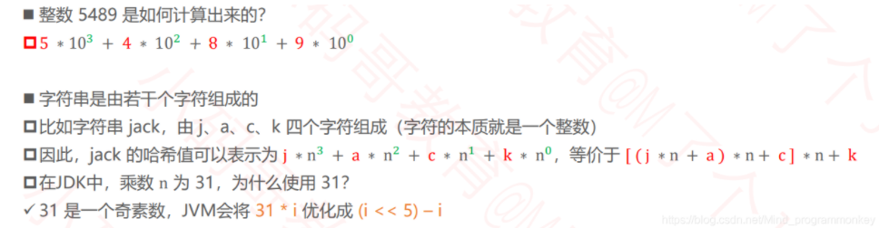
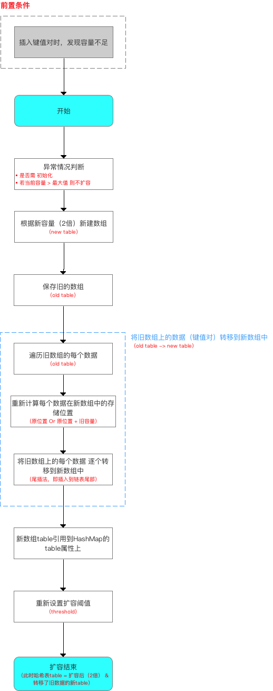

# 【面试篇】HashMap1.7和HashMap1.8的详细区别对比

| 不同之处                 | JDK1.7                                                       | JDK1.8                                                       |
| ------------------------ | ------------------------------------------------------------ | ------------------------------------------------------------ |
| 存储结构                 | **数组+链表**                                                | **数组+链表+红黑树**                                         |
| 初始化方式               | 单独函数：`inflateTable()`                                   | 直接集成到了`resize()`中                                     |
| hash值计算               | 扰动处理=**4次位运算+5次异或运算**                           | 扰动处理=**1次位运算+1次异或运算**                           |
| 存放数据的规则           | **无冲突时，存放数组；冲突时，存放链表**                     | **无冲突时，存放数组**；**冲突&链表长度<8: 存放链表**；**冲突&链表长度>8且数组长度>64转换为红黑树JDK1.7** |
| 插入数据方式             | **头插法**                                                   | **尾插法**                                                   |
| 扩容后存储位置的计算方式 | **按之前索引的计算方式：hashcode->>扰动函数->>(h&length-1)** | **按照扩容后的规律计算(即扩容后的位置=原位置 or 原位置+旧容量)** |

> 结构上；
>
> 初始化->Hash计算->存储方式->链表插入方式->扩容方式

**JDK1.8主要解决了以下问题：**

- resize扩容优化问题
- 引入了红黑树，避免单条链表过长而影响查询效率
- 解决了多线程死循环问题，但仍是非线程安全的，多线程时可能会造成**数据丢失**的问题。

## 一、存储结构方面的变化

> 背景：HashMap通过key的hashCode经过扰动函数处理过后得到hash值，然后通过`(n-1)&hash`判断当前元素存放的位置，如果当前位置存在元素的话，就判断该元素与要存入的元素的hash值以及key是否相同，如果相同的话，直接覆盖，不相同就通过拉链法解决冲突(红黑树).

JDK1.7：数组 + 链表

JDK1.8：数组 + 链表 + 红黑树

引入原因：**解决哈希碰撞后，链表过长从而导致索引效率变化的问题**


### 题目一、为什么选择6和8？

**红黑树的节点占用空间是普通链表节点的2倍**，而且**碰撞节点的分布频率满足泊松分布，链表长度达到8个元素的概率为0.00000006，几乎是不可能事件。**

**中间有差值可以防止链表和红黑树之间的频繁转换。**

假如：如果设计成链表个数超过8就链表转换为红黑树，链表个数小于8就红黑树结构转换成链表，链表个数在8左右徘徊，就会频繁进行链表转红黑树，红黑树转链表的操作。

### 题目二、为什么红黑树转换时还要求数组大小大于64？

这里不仅仅判断链表个数大于等于 8，还判断了数组大小，数组容量小于 64 没有立即转化的原因，猜测主要是因为**红黑树占用的空间比链表大很多**，转化也比较耗时，所以**数组容量小的情况下冲突严重，我们可以先尝试扩容，看看能否通过扩容来解决冲突的问题**。（结点总数/数组容量=负载因子）

## 二、初始化HashMap对象

```java
/**
  * 函数使用原型
  */
  Map<String,Integer> map = new HashMap<String,Integer>();

 /**
   * 源码分析：主要是HashMap的构造函数 = 4个
   * 仅贴出关于HashMap构造函数的源码
   */

public class HashMap<K,V>
    extends AbstractMap<K,V>
    implements Map<K,V>, Cloneable, Serializable{

    // 省略上节阐述的参数
    
  /**
     * 构造函数1：默认构造函数（无参）
     * 加载因子 & 容量 = 默认 = 0.75、16
     */
    public HashMap() {
        this.loadFactor = DEFAULT_LOAD_FACTOR;
    }

    /**
     * 构造函数2：指定“容量大小”的构造函数
     * 加载因子 = 默认 = 0.75 、容量 = 指定大小
     */
    public HashMap(int initialCapacity) {
        // 实际上是调用指定“容量大小”和“加载因子”的构造函数
        // 只是在传入的加载因子参数 = 默认加载因子
        this(initialCapacity, DEFAULT_LOAD_FACTOR);
        
    }

    /**
     * 构造函数3：指定“容量大小”和“加载因子”的构造函数
     * 加载因子 & 容量 = 自己指定
     */
    public HashMap(int initialCapacity, float loadFactor) {

        // 指定初始容量必须非负，否则报错  
            if (initialCapacity < 0)  
           throw new IllegalArgumentException("Illegal initial capacity: " +  
                                           initialCapacity); 

        // HashMap的最大容量只能是MAXIMUM_CAPACITY，哪怕传入的 > 最大容量
        if (initialCapacity > MAXIMUM_CAPACITY)
            initialCapacity = MAXIMUM_CAPACITY;

        // 填充比必须为正  
        if (loadFactor <= 0 || Float.isNaN(loadFactor))  
            throw new IllegalArgumentException("Illegal load factor: " +  
                                           loadFactor);  
        // 设置 加载因子
        this.loadFactor = loadFactor;

        // 设置 扩容阈值
        // 注：此处不是真正的阈值，仅仅只是将传入的容量大小转化为：>传入容量大小的最小的2的幂，该阈值后面会重新计算
        // 下面会详细讲解 ->> 分析1
        this.threshold = tableSizeFor(initialCapacity); 

    }

    /**
     * 构造函数4：包含“子Map”的构造函数
     * 即 构造出来的HashMap包含传入Map的映射关系
     * 加载因子 & 容量 = 默认
     */

    public HashMap(Map<? extends K, ? extends V> m) {

        // 设置容量大小 & 加载因子 = 默认
        this.loadFactor = DEFAULT_LOAD_FACTOR; 

        // 将传入的子Map中的全部元素逐个添加到HashMap中
        putMapEntries(m, false); 
    }
}

   /**
     * 分析1：tableSizeFor(initialCapacity)
     * 作用：将传入的容量大小转化为：>传入容量大小的最小的2的幂
     * 与JDK 1.7对比：类似于JDK 1.7 中 inflateTable()里的 roundUpToPowerOf2(toSize)
     */
    static final int tableSizeFor(int cap) {
     int n = cap - 1;
     n |= n >>> 1;
     n |= n >>> 2;
     n |= n >>> 4;
     n |= n >>> 8;
     n |= n >>> 16;
     return (n < 0) ? 1 : (n >= MAXIMUM_CAPACITY) ? MAXIMUM_CAPACITY : n + 1;
}
```

> 背景：HashMap的对象，包含4个构造函数：
>
> - 默认构造函数(无参);
> - 指定容量大小的构造函数；
> - 指定容量大小和负载因子的构造函数；
> - 包含子Map的构造函数

在构造函数中仅用于**初始化容量大小(capacity)**、**负载因子(load factor)**,但未真正初始化哈希表，即初始化存储数组table。真正初始话哈希表(初始化数组table)是在第一次添加键值对的时候，即**第一次调用put方法时，进行初始化。**

JDK1.7：在put方法添加元素时会判断table是否为空，若空，则**调用单独的初始化函数inflateTable()**;

JDK1.8：在put方法添加元素时会判断table是否为空，若空，则**调用resize()扩容函数；**


> 构建HashMap实例时有两个重要的参数，会影响其性能：**初始大小**和**负载因子**。初始大小用来规定**哈希表数组的长度**，即桶的个数。负载因子用来表示哈希表元素的填满程度，越大则表示允许填满的元素就越多，哈希表的空间利用率就越高，但是冲突的机会也就增加了。反之，越小则冲突的机会就会越少，但是空间很多就浪费了。

### 题目一：为什么负载因子是0.75？

考虑空间和时间的效率。扩容时的临界值由【负载因子】和【当前容器的容量大小】来确定。即**hashMap.size>=Capactity x loadFactory**

> 负载因子选择0.75主要是在提高**空间利用率和减少查询成本**的折中下，节点出现在hash桶中遵循**泊松分布**的情况下，选择0.75。
>
> - **负载因子过高，如1，虽然减少了空间的开销，提高了空间的利用率，但是增加了查询的时间成本**；空间效率上去，时间效率下来了。
> - **负载因子过低，如0.5，虽然可以减少查询的时间成本，但空间利用率很低，提高了rehash操作的次数**。时间效率上去，空间效率下来了。
>
> 总的来说，HashMap在负载因子0.75的时候，空间利用率，满足泊松分布，而且避免了相当多的Hash冲突，提升了时间效率。

### 题目二：为什么数组容量必须是2次幂？

桶的索引计算公式为 **i =  hash&（n-1） **。效果等于与 **hash%n** 的计算效果，但是位运算比取余运算要高效的多。

**如果n为2次幂，那么n-1的低位就全是1,哈希值进行与操作时可以保证低位的值不变，从而保证分布均匀，不会受到与运算对数据的变化影响。**

数组取2次幂的时候：


**数组不取2次幂的话，会出现重复的数据，而且数组元素分布不均匀，且数组上的某些位置，永远也用不到。**


> hashCode尽可能的使其分布均匀了，那么hashcode与数组的size-1进行位运算，我们就应该尽量减少位运算对其的影响，采用2^n-1,低位都为1，从而保证结果的均匀。若不取2次幂，那么会出现重复的数据，会使得分布不均匀，导致数组上的某些位置，永远取不到。


## 三、向HashMap添加数据

### 3.1 判断数组是否为空

- jdk1.7：**若空，则调用单独的初始化函数inflateTable();**
- jdk1.8：**若空，则调用resize()函数。**

不能空，则计算数据在hashMap的索引位置。

### 3.2 计算数据在hashMap的索引值

计算要添加数据在HashMap中的桶索引值，可分为以下两步：**第一步计算Hash值；第二步计算索引值。**

- **第一步计算Hash值**
  - **先计算哈希码**
  - **再进行扰动函数操作**
- **第二步计算索引值**
  - **通过hash&(length-1)**（效果等同于hash%length计算，但位运算比取余运算要高效的多）

#### 1.计算哈希码

> 预备知识：计算哈希码 h=key.hashCode(). **根据对象的内存地址，经过特定算法返回一个哈希码。**
>
> ##### a.整数
>
> - 整数值当做哈希值
> - 比如10的哈希值就是10
>
> ```java
> public static int hashCode(int value){
>     return value;
> }
> ```
>
> ##### b.浮点数
>
> - 将存储的二进制格式转为整数值
>
> ```java
> public static int hashCode(float value){
>     return floatToIntBits(value);
> }
> ```
>
> ##### c.Long的哈希值
>
> ```java
> public static int hashCode(long value){
>     return (int)(value^(value>>>32));
> }
> ```
>
> ##### d.Double的哈希值
>
> ```java
> public static int hashCode(double value){
>     long bits = doubleToLongBits(value);
>     return (int)(bits^(bits>>>32));
> }
> ```
>
> > Long和Double中的>>>和^的作用是？
> >
> > - 高32bit和低32位混合计算出32bit的哈希值
> > - 充分利用所有信息计算出哈希值
>
> ##### e.字符串的哈希值
>
> 
>
> > 关于31的探讨？
> >
> > 1. 奇质数作为哈希运算中的乘法因子，**得到的哈希值效果比较好（分布均匀）**
> > 2. JVM对于位运算的优化，31*i可优化为(i<<5)-i ,**最后选择31是因为速度比较快**


#### 2.扰动函数

JDK1.7: 要进行4次位运算 + 5次异或预算

```java
// JDK 1.7实现：将 键key 转换成 哈希码（hash值）操作  = 使用hashCode() + 4次位运算 + 5次异或运算（9次扰动）
      static final int hash(int h) {
        h ^= k.hashCode(); 
        h ^= (h >>> 20) ^ (h >>> 12);
        return h ^ (h >>> 7) ^ (h >>> 4);
     }
```

JDK1.8：进行1次位运算+1次异或运算

```java
      // JDK 1.8实现：将 键key 转换成 哈希码（hash值）操作 = 使用hashCode() + 1次位运算 + 1次异或运算（2次扰动）
      // 1. 取hashCode值： h = key.hashCode() 
      // 2. 高位参与低位的运算：h ^ (h >>> 16)  
      static final int hash(Object key) {
           int h;
            return (key == null) ? 0 : (h = key.hashCode()) ^ (h >>> 16);
            // a. 当key = null时，hash值 = 0，所以HashMap的key 可为null      
            // 注：对比HashTable，HashTable对key直接hashCode（），若key为null时，会抛出异常，所以HashTable的key不可为null
            // b. 当key ≠ null时，则通过先计算出 key的 hashCode()（记为h），然后 对哈希码进行 扰动处理： 按位 异或（^） 哈希码自身右移16位后的二进制
     }
```

设计原因：

**为了效率考虑，进行了缩减。**

`hash`方法实际是让`key.hashCode()`与`key.hashCode()>>>16`进行异或操作，高16bit补0，一个数和0异或不变，所以 hash 函数大概的作用就是：**高16bit不变，低16bit和高16bit做了一个异或，目的是减少碰撞，使其分布均匀**。按照函数注释，因为bucket数组大小是2的幂，计算下标`index = (table.length - 1) & hash`，如果不做 hash 处理，相当于散列生效的只有几个低 bit 位，为了减少散列的碰撞，设计者综合考虑了速度、作用、质量之后，使用高16bit和低16bit异或来简单处理减少碰撞，而且JDK8中用了复杂度 O（logn）的树结构来提升碰撞下的性能。


#### 题目一、为什么不直接采用hashCode()处理的哈希码作为hashMap的下标位置？

**计算出来的哈希码可能并不在数组大小范围内，从而导致无法匹配位置的情况**。解决方法:哈希码 & (数组长度-1)。

哈希码是32位的，其取值范围为-(2^31) ~ 2^31-1之间。

而哈希表的容量范围最大值为2^30.

#### 题目二、为什么要对哈希码进行二次处理，扰动计算？

**为了进一步提高哈希低位的随机性，使得分布更均匀**，从而**提高对应数组存储下标位置的随机性和均匀性**，从而**减少hash冲突。**

### 3.3 数据具体在哈希表的存放


**JDK1.7 存放数据只需判断数组和链表**

**JDK1.8 存放数据需多次判断：数组、链表和红黑树**

原因：提高查找效率；


**JDK1.7在插入数据方式时用的头插法（将原位置的数据后移1位，然后再插入数据到该位置）**

**JDK1.8在插入数据方式时用的尾插法（直接插入到链表尾部/红黑树）**

原因：在多线程并发情况下，**头插法会出现链表成环**的问题。（当然在多线程情况下，HashMap本就是线程非安全的。）


`HashMap`的线程不安全主要体现在以下两个方面：

- 在JDK1.7下，当**并发执行扩容操作时环形链**和**数据丢失**的情况；
- 在JDK1.8下，当**并发执行put操作时会发生数据覆盖**等情况。


### 3.4 HashMap的扩容机制resize()

resize()函数的使用有2种情况：

- 初始化哈希表；
- 当前数组容量过小，需扩容； （**扩容的容量大小会变成原来的2倍，用位运算来加快计算的运行效率**）。

```java
/**
     * 分析4：resize（）
     * 该函数有2种使用情况：1.初始化哈希表 2.当前数组容量过小，需扩容
     */
   final Node<K,V>[] resize() {
    Node<K,V>[] oldTab = table; // 扩容前的数组（当前数组）
    int oldCap = (oldTab == null) ? 0 : oldTab.length; // 扩容前的数组的容量 = 长度
    int oldThr = threshold;// 扩容前的数组的阈值
    int newCap, newThr = 0;

    // 针对情况2：若扩容前的数组容量超过最大值，则不再扩充
    if (oldCap > 0) {
        if (oldCap >= MAXIMUM_CAPACITY) {
            threshold = Integer.MAX_VALUE;
            return oldTab;
        }

        // 针对情况2：若无超过最大值，就扩充为原来的2倍
        else if ((newCap = oldCap << 1) < MAXIMUM_CAPACITY &&
                 oldCap >= DEFAULT_INITIAL_CAPACITY)
            newThr = oldThr << 1; // 通过右移扩充2倍
    }

    // 针对情况1：初始化哈希表（采用指定 or 默认值）
    else if (oldThr > 0) // initial capacity was placed in threshold
        newCap = oldThr;

    else {               // zero initial threshold signifies using defaults
        newCap = DEFAULT_INITIAL_CAPACITY;
        newThr = (int)(DEFAULT_LOAD_FACTOR * DEFAULT_INITIAL_CAPACITY);
    }

    // 计算新的resize上限
    if (newThr == 0) {
        float ft = (float)newCap * loadFactor;
        newThr = (newCap < MAXIMUM_CAPACITY && ft < (float)MAXIMUM_CAPACITY ?
                  (int)ft : Integer.MAX_VALUE);
    }

    threshold = newThr;
    @SuppressWarnings({"rawtypes","unchecked"})
        Node<K,V>[] newTab = (Node<K,V>[])new Node[newCap];
    table = newTab;

    if (oldTab != null) {
        // 把每个bucket都移动到新的buckets中
        for (int j = 0; j < oldCap; ++j) {
            Node<K,V> e;
            if ((e = oldTab[j]) != null) {
                oldTab[j] = null;

                if (e.next == null)
                    newTab[e.hash & (newCap - 1)] = e;
                else if (e instanceof TreeNode)
                    ((TreeNode<K,V>)e).split(this, newTab, j, oldCap);

                else { // 链表优化重hash的代码块
                    Node<K,V> loHead = null, loTail = null;
                    Node<K,V> hiHead = null, hiTail = null;
                    Node<K,V> next;
                    do {
                        next = e.next;
                        // 原索引
                        if ((e.hash & oldCap) == 0) {
                            if (loTail == null)
                                loHead = e;
                            else
                                loTail.next = e;
                            loTail = e;
                        }
                        // 原索引 + oldCap
                        else {
                            if (hiTail == null)
                                hiHead = e;
                            else
                                hiTail.next = e;
                            hiTail = e;
                        }
                    } while ((e = next) != null);
                    // 原索引放到bucket里
                    if (loTail != null) {
                        loTail.next = null;
                        newTab[j] = loHead;
                    }
                    // 原索引+oldCap放到bucket里
                    if (hiTail != null) {
                        hiTail.next = null;
                        newTab[j + oldCap] = hiHead;
                    }
                }
            }
        }
    }
    return newTab;
}
```




JDK1.7：**插入前，判断是否需扩容**

JDK1.8：**插入结束后，判断是否需扩容**


JDK1.7：扩容后存储位置的计算方式：**全部按照之前的方法进行重新计算索引**

JDK1.8：扩容后存储位置的计算方式：**按照扩容后的规律计算(扩容后的位置=原位置or原位置+旧容量)**

> 扩容后，若hash值新增参与运算的位=0,那么元素在扩容后的位置=原始位置；
>
> 扩容后，若hash值新增参与运算的位=1,那么元素在扩容后的位置 =原始位置+扩容后的旧位置；


### 3.5 从HashMap中获取数据

```java
/**
   * 函数原型
   * 作用：根据键key，向HashMap获取对应的值
   */ 
   map.get(key)；


 /**
   * 源码分析
   */ 
   public V get(Object key) {
    Node<K,V> e;
    // 1. 计算需获取数据的hash值
    // 2. 通过getNode（）获取所查询的数据 ->>分析1
    // 3. 获取后，判断数据是否为空
    return (e = getNode(hash(key), key)) == null ? null : e.value;
}

/**
   * 分析1：getNode(hash(key), key))
   */ 
final Node<K,V> getNode(int hash, Object key) {
    Node<K,V>[] tab; Node<K,V> first, e; int n; K k;

    // 1. 计算存放在数组table中的位置
    if ((tab = table) != null && (n = tab.length) > 0 &&
        (first = tab[(n - 1) & hash]) != null) {

        // 4. 通过该函数，依次在数组、红黑树、链表中查找（通过equals（）判断）
        // a. 先在数组中找，若存在，则直接返回
        if (first.hash == hash && // always check first node
            ((k = first.key) == key || (key != null && key.equals(k))))
            return first;

        // b. 若数组中没有，则到红黑树中寻找
        if ((e = first.next) != null) {
            // 在树中get
            if (first instanceof TreeNode)
                return ((TreeNode<K,V>)first).getTreeNode(hash, key);

            // c. 若红黑树中也没有，则通过遍历，到链表中寻找
            do {
                if (e.hash == hash &&
                    ((k = e.key) == key || (key != null && key.equals(k))))
                    return e;
            } while ((e = e.next) != null);
        }
    }
    return null;
}
```


## 总结

简单总结一下HashMap是使用了哪些方法来有效解决了哈希冲突这个问题的。

- 使用**链地址法(使用散列表)来**链接拥有相同hash值的数据；
- 使用**2次扰动函数(hash函数)来**降低哈希冲突的概率，使得数据分布更平均；
- 引入红黑树进一步降低遍历的时间复杂度，使得遍历更快。


