# ConcurrentHashMap1.8 扩容细节

## 1.什么情况下进行扩容？

一般是下列两种情况会进行扩容：

- 一种是链表冲突达到了8个节点，但是数组长度不满足64会进行扩容，触发`transfer`方法扩容；
- 一种是新增节点之后，判断数组个数是否达到阈值，若达到阈值, 触发`transfer`方法扩容；

而单线程和多线程也是分为两种情况:

- 没有其他线程正在执行扩容，则当前线程自身发起扩容（单线程）；
- 已经有其它线程正字执行扩容，则当前线程会尝试协助“数据迁移”；（多线程并发）；

> 这两种情况，通过传入第二个参数nextTable来区分，nextTable表示扩容后的新table数组，如果为null，则表示发起首次扩容；第二种情况，通过CAS操作和位运算来发起扩容。
>
> 

## 2.扩容的步骤？

- table数组的扩容，一般是新建一个2倍大小的数组，这个过程由一个单线程完成，不允许并发操作；
- 数据迁移，可多线程操作。把旧的table各个槽中的结点重新分配到新table中；

## 3.扩容的原理？

来看下**transfer**方法，这个方法可以被多个线程同时调用，也是**“数据迁移”**的核心操作方法：

```java
/**
 * 数据转移和扩容.
 * 每个调用tranfer的线程会对当前旧table中[transferIndex-stride, transferIndex-1]位置的结点进行迁移
 *
 * @param tab     旧table数组
 * @param nextTab 新table数组
 */
private final void transfer(Node<K, V>[] tab, Node<K, V>[] nextTab) {
    int n = tab.length, stride;

    // stride可理解成“步长”，即数据迁移时，每个线程要负责旧table中的多少个桶
    if ((stride = (NCPU > 1) ? (n >>> 3) / NCPU : n) < MIN_TRANSFER_STRIDE)
        stride = MIN_TRANSFER_STRIDE;

    if (nextTab == null) {           // 首次扩容
        try {
            // 创建新table数组
            Node<K, V>[] nt = (Node<K, V>[]) new Node<?, ?>[n << 1];
            nextTab = nt;
        } catch (Throwable ex) {      // 处理内存溢出（OOME）的情况
            sizeCtl = Integer.MAX_VALUE;
            return;
        }
        nextTable = nextTab;
        transferIndex = n;          // [transferIndex-stride, transferIndex-1]表示当前线程要进行数据迁移的桶区间
    }

    int nextn = nextTab.length;

    // ForwardingNode结点，当旧table的某个桶中的所有结点都迁移完后，用该结点占据这个桶
    ForwardingNode<K, V> fwd = new ForwardingNode<K, V>(nextTab);

    // 标识一个桶的迁移工作是否完成，advance == true 表示可以进行下一个位置的迁移
    boolean advance = true;

    // 最后一个数据迁移的线程将该值置为true，并进行本轮扩容的收尾工作
    boolean finishing = false;

    // i标识桶索引, bound标识边界
    for (int i = 0, bound = 0; ; ) {
        Node<K, V> f;
        int fh;

        // 每一次自旋前的预处理，主要是定位本轮处理的桶区间
        // 正常情况下，预处理完成后：i == transferIndex-1，bound == transferIndex-stride
        while (advance) {
            int nextIndex, nextBound;
            if (--i >= bound || finishing)
                advance = false;
            else if ((nextIndex = transferIndex) <= 0) {
                i = -1;
                advance = false;
            } else if (U.compareAndSwapInt(this, TRANSFERINDEX, nextIndex,
                nextBound = (nextIndex > stride ? nextIndex - stride : 0))) {
                bound = nextBound;
                i = nextIndex - 1;
                advance = false;
            }
        }

        if (i < 0 || i >= n || i + n >= nextn) {    // CASE1：当前是处理最后一个tranfer任务的线程或出现扩容冲突
            int sc;
            if (finishing) {    // 所有桶迁移均已完成
                nextTable = null;
                table = nextTab;
                sizeCtl = (n << 1) - (n >>> 1);
                return;
            }

            // 扩容线程数减1,表示当前线程已完成自己的transfer任务
            if (U.compareAndSwapInt(this, SIZECTL, sc = sizeCtl, sc - 1)) {
                // 判断当前线程是否是本轮扩容中的最后一个线程，如果不是，则直接退出
                if ((sc - 2) != resizeStamp(n) << RESIZE_STAMP_SHIFT)
                    return;
                finishing = advance = true;

                /**
                 * 最后一个数据迁移线程要重新检查一次旧table中的所有桶，看是否都被正确迁移到新table了：
                 * ①正常情况下，重新检查时，旧table的所有桶都应该是ForwardingNode;
                 * ②特殊情况下，比如扩容冲突(多个线程申请到了同一个transfer任务)，此时当前线程领取的任务会作废，那么最后检查时，
                 * 还要处理因为作废而没有被迁移的桶，把它们正确迁移到新table中
                 */
                i = n; // recheck before commit
            }
        } else if ((f = tabAt(tab, i)) == null)     // CASE2：旧桶本身为null，不用迁移，直接尝试放一个ForwardingNode
            advance = casTabAt(tab, i, null, fwd);
        else if ((fh = f.hash) == MOVED)            // CASE3：该旧桶已经迁移完成，直接跳过
            advance = true;
        else {                                      // CASE4：该旧桶未迁移完成，进行数据迁移
            synchronized (f) {
                if (tabAt(tab, i) == f) {
                    Node<K, V> ln, hn;
                    if (fh >= 0) {                  // CASE4.1：桶的hash>0，说明是链表迁移

                        /**
                         * 下面的过程会将旧桶中的链表分成两部分：ln链和hn链
                         * ln链会插入到新table的槽i中，hn链会插入到新table的槽i+n中
                         */
                        int runBit = fh & n;    // 由于n是2的幂次，所以runBit要么是0，要么高位是1
                        Node<K, V> lastRun = f; // lastRun指向最后一个相邻runBit不同的结点
                        for (Node<K, V> p = f.next; p != null; p = p.next) {
                            int b = p.hash & n;
                            if (b != runBit) {
                                runBit = b;
                                lastRun = p;
                            }
                        }
                        if (runBit == 0) {
                            ln = lastRun;
                            hn = null;
                        } else {
                            hn = lastRun;
                            ln = null;
                        }

                        // 以lastRun所指向的结点为分界，将链表拆成2个子链表ln、hn
                        for (Node<K, V> p = f; p != lastRun; p = p.next) {
                            int ph = p.hash;
                            K pk = p.key;
                            V pv = p.val;
                            if ((ph & n) == 0)
                                ln = new Node<K, V>(ph, pk, pv, ln);
                            else
                                hn = new Node<K, V>(ph, pk, pv, hn);
                        }
                        setTabAt(nextTab, i, ln);               // ln链表存入新桶的索引i位置
                        setTabAt(nextTab, i + n, hn);        // hn链表存入新桶的索引i+n位置
                        setTabAt(tab, i, fwd);                  // 设置ForwardingNode占位
                        advance = true;                         // 表示当前旧桶的结点已迁移完毕
                    }
                    else if (f instanceof TreeBin) {    // CASE4.2：红黑树迁移

                        /**
                         * 下面的过程会先以链表方式遍历，复制所有结点，然后根据高低位组装成两个链表；
                         * 然后看下是否需要进行红黑树转换，最后放到新table对应的桶中
                         */
                        TreeBin<K, V> t = (TreeBin<K, V>) f;
                        TreeNode<K, V> lo = null, loTail = null;
                        TreeNode<K, V> hi = null, hiTail = null;
                        int lc = 0, hc = 0;
                        for (Node<K, V> e = t.first; e != null; e = e.next) {
                            int h = e.hash;
                            TreeNode<K, V> p = new TreeNode<K, V>
                                (h, e.key, e.val, null, null);
                            if ((h & n) == 0) {
                                if ((p.prev = loTail) == null)
                                    lo = p;
                                else
                                    loTail.next = p;
                                loTail = p;
                                ++lc;
                            } else {
                                if ((p.prev = hiTail) == null)
                                    hi = p;
                                else
                                    hiTail.next = p;
                                hiTail = p;
                                ++hc;
                            }
                        }

                        // 判断是否需要进行 红黑树 <-> 链表 的转换
                         ln = (lc <= UNTREEIFY_THRESHOLD) ? untreeify(lo) :
                            (hc != 0) ? new TreeBin<K, V>(lo) : t;
                        hn = (hc <= UNTREEIFY_THRESHOLD) ? untreeify(hi) :
                            (lc != 0) ? new TreeBin<K, V>(hi) : t;
                        setTabAt(nextTab, i, ln);
                        setTabAt(nextTab, i + n, hn);
                        setTabAt(tab, i, fwd);  // 设置ForwardingNode占位
                        advance = true;         // 表示当前旧桶的结点已迁移完毕
                    }
                }
            }
        }
    }
}
```

**tranfer**方法的开头，会计算出一个`stride`变量的值，这个stride其实就是每个线程处理的桶区间，也就是步长：

```java
// stride可理解成“步长”，即数据迁移时，每个线程要负责旧table中的多少个桶
if ((stride = (NCPU > 1) ? (n >>> 3) / NCPU : n) < MIN_TRANSFER_STRIDE)
    stride = MIN_TRANSFER_STRIDE;
```

首次扩容时，会将table数组变成原来的2倍：

```java
if (nextTab == null) {           // 首次扩容
    try {
        // 创建新table数组
        Node<K, V>[] nt = (Node<K, V>[]) new Node<?, ?>[n << 1];
        nextTab = nt;
    } catch (Throwable ex) {      // 处理内存溢出（OOME）的情况
        sizeCtl = Integer.MAX_VALUE;
        return;
    }
    nextTable = nextTab;
    transferIndex = n;          // [transferIndex-stride, transferIndex-1]表示当前线程要进行数据迁移的桶区间
}
```

注意上面的`transferIndex`变量，这是一个字段，`table[transferIndex-stride, transferIndex-1]`就是当前线程要进行数据迁移的桶区间：

```java
/**
 * 扩容时需要用到的一个下标变量.
 */
private transient volatile int transferIndex;
```

整个**transfer**方法几乎都在一个自旋操作中完成，从右往左开始进行数据迁移，transfer的退出点是当某个线程处理完最后的table区段——`table[0,stride-1]`。

transfer方法主要包含**4个分支**，即对4种不同情况进行处理，我们按照难易程度来解释下各个分支所做的事情：

### CASE2：桶table[i]为空

当旧table的桶`table[i] == null`，说明原来这个桶就没有数据，那就直接尝试放置一个**ForwardingNode**，表示这个桶已经处理完成。

```java
else if ((f = tabAt(tab, i)) == null)     // CASE2：旧桶本身为null，不用迁移，直接尝试放一个ForwardingNode
    advance = casTabAt(tab, i, null, fwd);
```

> 注：**ForwardingNode**我们在上一篇提到过，主要做占用位，多线程进行数据迁移时，其它线程看到这个桶中是ForwardingNode结点，就知道有线程已经在数据迁移了。
> 另外，当最后一个线程完成迁移任务后，会遍历所有桶，看看是否都是ForwardingNode，如果是，那么说明整个扩容/数据迁移的过程就完成了。

### CASE3：桶table[i]已迁移完成

没什么好说的，就是桶已经用**ForwardingNode**结点占用了，表示该桶的数据都迁移完了。

```java
else if ((fh = f.hash) == MOVED)            // CASE3：该旧桶已经迁移完成，直接跳过
    advance = true;
```

### CASE4：桶table[i]未迁移完成

如果旧桶的数据未迁移完成，就要进行迁移，这里根据桶中结点的类型分为：链表迁移、红黑树迁移。

**①链表迁移**

链表迁移的过程如下，首先会遍历一遍原链表，找到最后一个相邻`runBit`不同的结点。
`runbit`是根据`key.hash`和旧table长度`n`进行与运算得到的值，由于table的长度为2的幂次，所以`runbit`只可能为0或最高位为1

然后，会进行第二次链表遍历，按照第一次遍历找到的结点为界，将原链表分成2个子链表，再链接到新table的槽中。可以看到，新table的索引要么是`i`，要么是`i+n`，这里就利用了上一节说的ConcurrentHashMap的rehash特点。

```java
if (fh >= 0) {                  // CASE4.1：桶的hash>0，说明是链表迁移
    /**
     * 下面的过程会将旧桶中的链表分成两部分：ln链和hn链
     * ln链会插入到新table的槽i中，hn链会插入到新table的槽i+n中
     */
    int runBit = fh & n;    // 由于n是2的幂次，所以runBit要么是0，要么高位是1
    Node<K, V> lastRun = f; // lastRun指向最后一个相邻runBit不同的结点
    for (Node<K, V> p = f.next; p != null; p = p.next) {
        int b = p.hash & n;
        if (b != runBit) {
            runBit = b;
            lastRun = p;
        }
    }
    if (runBit == 0) {
        ln = lastRun;
        hn = null;
    } else {
        hn = lastRun;
        ln = null;
    }

    // 以lastRun所指向的结点为分界，将链表拆成2个子链表ln、hn
    for (Node<K, V> p = f; p != lastRun; p = p.next) {
        int ph = p.hash;
        K pk = p.key;
        V pv = p.val;
        if ((ph & n) == 0)
            ln = new Node<K, V>(ph, pk, pv, ln);
        else
            hn = new Node<K, V>(ph, pk, pv, hn);
    }
    setTabAt(nextTab, i, ln);               // ln链表存入新桶的索引i位置
    setTabAt(nextTab, i + n, hn);        // hn链表存入新桶的索引i+n位置
    setTabAt(tab, i, fwd);                  // 设置ForwardingNode占位
    advance = true;                         // 表示当前旧桶的结点已迁移完毕
}
```

**②红黑树迁移**

红黑树的迁移按照链表遍历的方式进行，当链表结点超过/小于阈值时，涉及`红黑树<->链表`的相互转换：

```java
else if (f instanceof TreeBin) {    // CASE4.2：红黑树迁移
    /**
     * 下面的过程会先以链表方式遍历，复制所有结点，然后根据高低位组装成两个链表；
     * 然后看下是否需要进行红黑树转换，最后放到新table对应的桶中
     */
    TreeBin<K, V> t = (TreeBin<K, V>) f;
    TreeNode<K, V> lo = null, loTail = null;
    TreeNode<K, V> hi = null, hiTail = null;
    int lc = 0, hc = 0;
    for (Node<K, V> e = t.first; e != null; e = e.next) {
        int h = e.hash;
        TreeNode<K, V> p = new TreeNode<K, V>
            (h, e.key, e.val, null, null);
        if ((h & n) == 0) {
            if ((p.prev = loTail) == null)
                lo = p;
            else
                loTail.next = p;
            loTail = p;
            ++lc;
        } else {
            if ((p.prev = hiTail) == null)
                hi = p;
            else
                hiTail.next = p;
            hiTail = p;
            ++hc;
        }
    }

    // 判断是否需要进行 红黑树 <-> 链表 的转换
     ln = (lc <= UNTREEIFY_THRESHOLD) ? untreeify(lo) :
        (hc != 0) ? new TreeBin<K, V>(lo) : t;
    hn = (hc <= UNTREEIFY_THRESHOLD) ? untreeify(hi) :
        (lc != 0) ? new TreeBin<K, V>(hi) : t;
    setTabAt(nextTab, i, ln);
    setTabAt(nextTab, i + n, hn);
    setTabAt(tab, i, fwd);  // 设置ForwardingNode占位
    advance = true;         // 表示当前旧桶的结点已迁移完毕
}
```

### CASE1：当前是最后一个迁移任务或出现扩容冲突

我们刚才说了，调用**transfer**的线程会自动领用某个区段的桶，进行数据迁移操作，当区段的初始索引i变成负数的时候，说明当前线程处理的其实就是最后剩下的桶，并且处理完了。

所以首先会更新`sizeCtl`变量，将扩容线程数减1，然后会做一些收尾工作：
设置table指向扩容后的新数组，遍历一遍旧数组，确保每个桶的数据都迁移完成——被ForwardingNode占用。

另外，可能在扩容过程中，出现扩容冲突的情况，比如多个线程领用了同一区段的桶，这时任何一个线程都不能进行数据迁移。

```java
if (i < 0 || i >= n || i + n >= nextn) {    // CASE1：当前是处理最后一个tranfer任务的线程或出现扩容冲突
    int sc;
    if (finishing) {    // 所有桶迁移均已完成
        nextTable = null;
        table = nextTab;
        sizeCtl = (n << 1) - (n >>> 1);
        return;
    }

    // 扩容线程数减1,表示当前线程已完成自己的transfer任务
    if (U.compareAndSwapInt(this, SIZECTL, sc = sizeCtl, sc - 1)) {
        // 判断当前线程是否是本轮扩容中的最后一个线程，如果不是，则直接退出
        if ((sc - 2) != resizeStamp(n) << RESIZE_STAMP_SHIFT)
            return;
        finishing = advance = true;

        /**
         * 最后一个数据迁移线程要重新检查一次旧table中的所有桶，看是否都被正确迁移到新table了：
         * ①正常情况下，重新检查时，旧table的所有桶都应该是ForwardingNode;
         * ②特殊情况下，比如扩容冲突(多个线程申请到了同一个transfer任务)，此时当前线程领取的任务会作废，那么最后检查时，
         * 还要处理因为作废而没有被迁移的桶，把它们正确迁移到新table中
         */
        i = n; // recheck before commit
    }
}
```

## 4.图解扩容(补充)

### 触发扩容的操作：

假设目前数组长度为8，数组的元素的个数为5。再放入一个元素就会触发扩容操作。

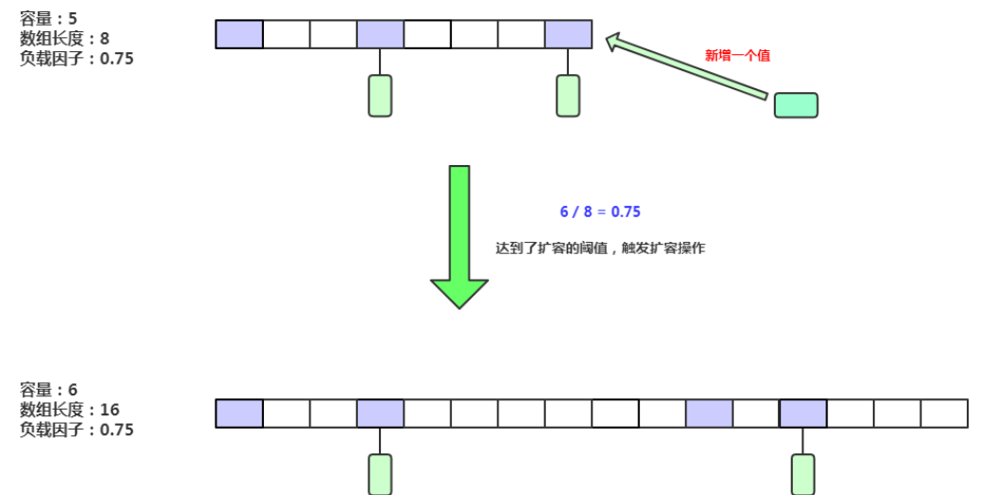

总结一下扩容条件：

(1) 元素个数达到扩容阈值。

(2) 调用 putAll 方法，但目前容量不足以存放所有元素时。

(3) 某条链表长度达到8，但数组长度却小于64时。

### CPU核数与迁移任务hash桶数量分配(步长)的关系

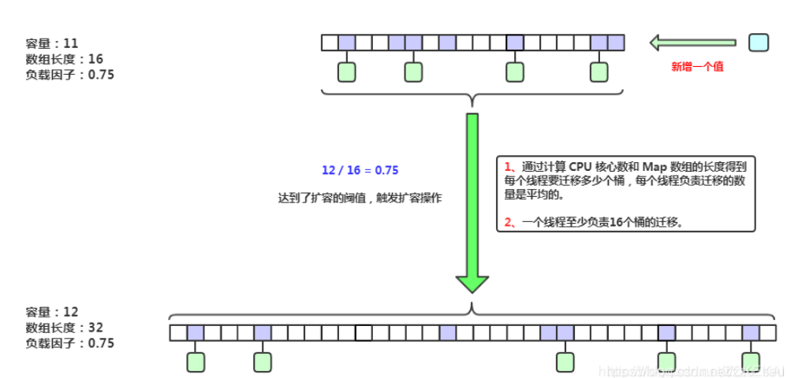

### 单线程下线程的任务分配与迁移操作

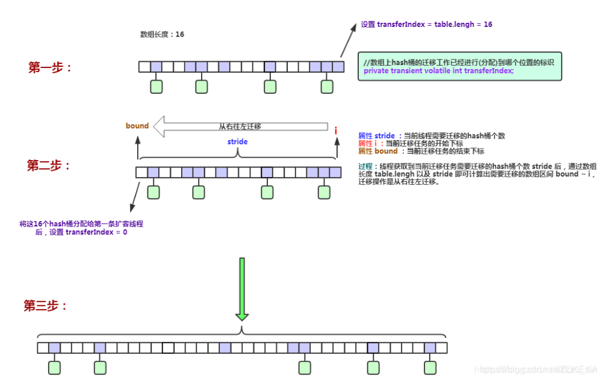

### 多线程如何分配任务？

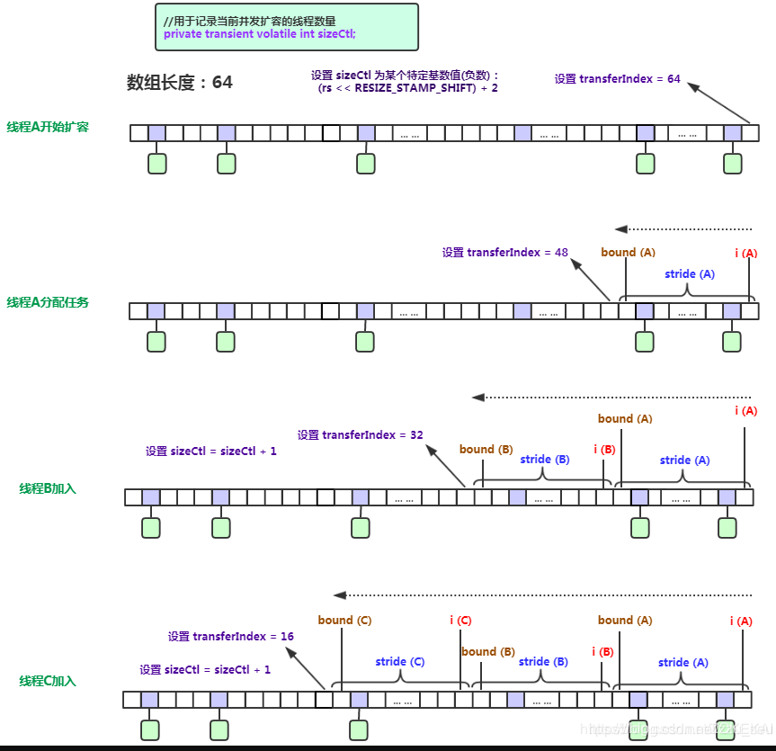

### 普通链表如何迁移？

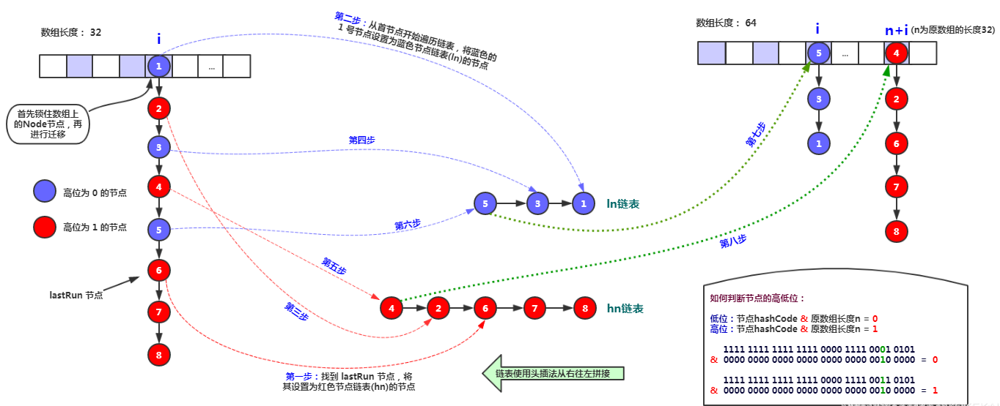


首先锁住数组上的Node节点，然后和HashMap1.8中一样，将链表拆分为高位链表和低位链表两个部分，然后复制到新的数组中。

### 什么是 lastRun 节点？

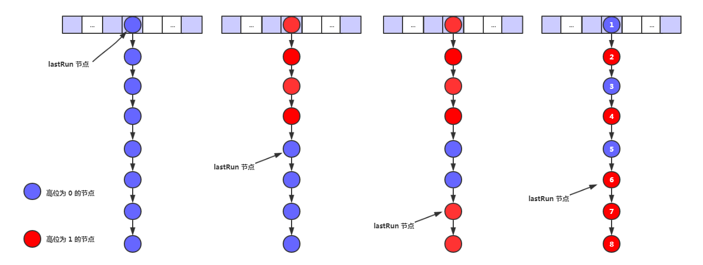

> lastRun节点就是高位链或低位链的开始

### 红黑树如何迁移？

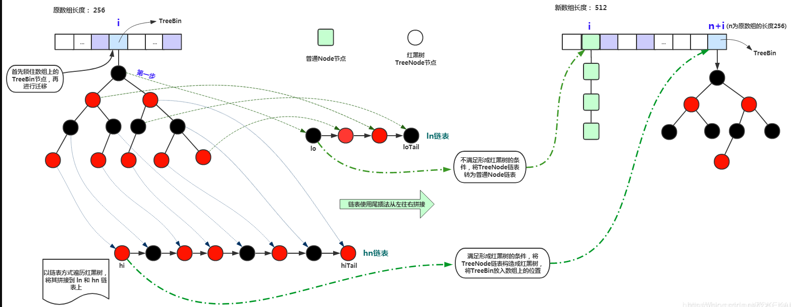

### hash桶迁移中以及迁移后如何处理存取请求？

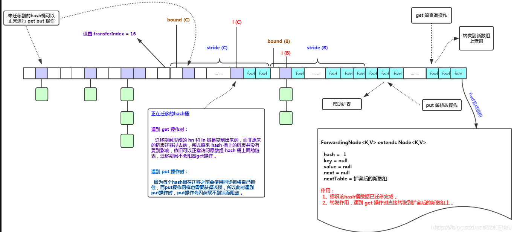

### 多线程迁移任务完成后的操作

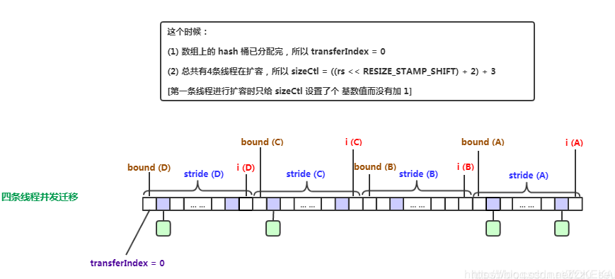


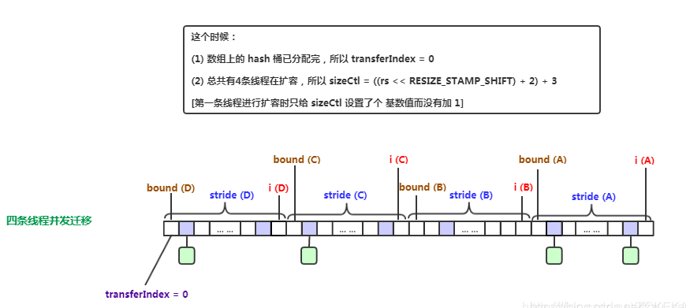


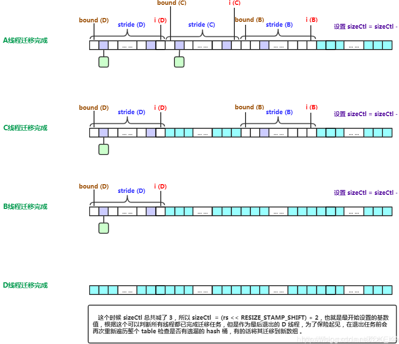


参考：

1.[ConcurrentHashMap 1.7/1.8比较](https://blog.csdn.net/ThreeAspects/article/details/104251334)

2.[ConcurrentHashMap底层详解（JDK1.7）](https://blog.csdn.net/zzu_seu/article/details/106675596)

3.[ConcurrentHashMap底层详解(图解扩容)（JDK1.8）](https://blog.csdn.net/zzu_seu/article/details/106698150)

4.[[Java多线程进阶（二四）—— J.U.C之collections框架：ConcurrentHashMap(2) 扩容](https://segmentfault.com/a/1190000016124883)]