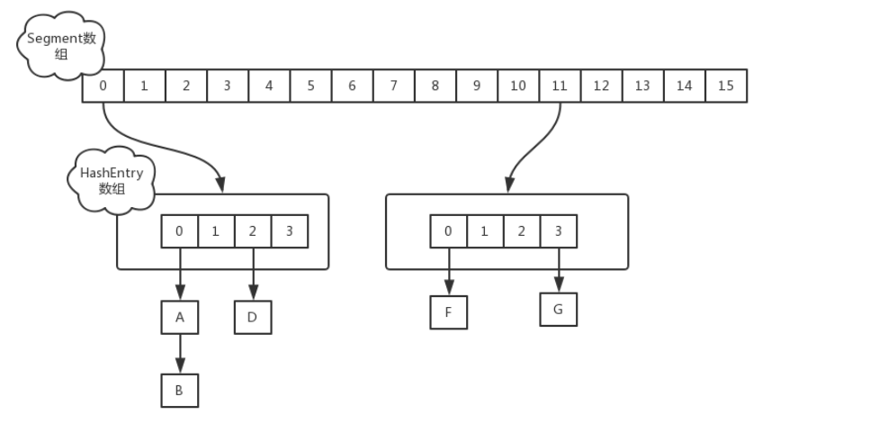

# ConcurrentHashMap1.7和1.8详解对比

HashMap在多线程高并发的情况下，会出现线程不安全的情况。比如说

- 在JDK1.7下，当并发执行扩容操作会出现**环形链表和数据丢失**的情况；
- 在JDK1.8下，当并发执行put操作会出现**数据覆盖**等情况；

而避免HashMap的安全问题有很多方法，比如HashTable或者Collections.synchronizedMap.但是这两者有着共同的问题：性能。无论读还是写操作，它们都会给整个集合加锁，导致同一时间的其它操作阻塞。

在并发情况下，如何能够兼顾线程安全和运行效率呢？这时候ConcurrentHashMap就应运而生了。

> 总之，
>
> 在JDK1.7中:
>
> 首先将数据分为一段一段的存储，然后给每一段数据配一把锁；当一个线程占用锁访问其中一个段数据时，其他段的数据也能被其他线程访问。
>
> 在JDK1.7中，ConcurrentHashMap采用Segment+HashEntry的方式进行实现，结构如下：
>
> 
>
> 一个 ConcurrentHashMap 里包含一个 Segment 数组。Segment 的结构和HashMap类似，是一种数组和链表结构，一个 Segment 包含一个 HashEntry 数组，每个 HashEntry 是一个链表结构的元素，每个 Segment 守护着一个HashEntry数组里的元素，当对 HashEntry 数组的数据进行修改时，必须首先获得对应的 Segment的锁。
>
> 在JDK1.8中
>
> 在**JDK1.8中，放弃了Segment臃肿的设计，取而代之的是采用Node + CAS + Synchronized来保证并发安全进行实现**，synchronized只锁定当前链表或红黑二叉树的首节点，这样只要hash不冲突，就不会产生并发，效率又提升N倍。
>
> 

## 一、 JDK7中ConcurrentHashMap的实现

> 对数据加了volatile关键字使所有数据在内存中都是可见的。
>
> **使用了Segment分段锁来进行 数组+链表。**
>
> **即Segment+HashEntry+ReentrantLock**

ConcurrentHashMap的优势就是采用了`锁分段技术`，每一个Segment就好比一个自治区，读写高度自治，Segment之间互不影响。**类似于一个二级哈希表。**


## 1.1 设计思路

 ConcurrentHashMap采用了分段锁的设计，当需要put元素的时候，并不是对整个hashmap进行加锁，而是先通过hashcode来知道要放在哪一个分段中，然后对这个分段进行加锁，所以当多线程put的时候，只要不是放在一个分段中，就没有锁竞争，实现真正的并行插入。相比于对整个Map加锁的设计，分段锁大大的提高了高并发环境下的处理能力。但同时，由于不是对整个Map加锁，导致一些需要扫描整个Map的方法（如size(), containsValue()）需要使用特殊的实现，另外一些方法（如clear()）甚至放弃了对一致性的要求（ConcurrentHashMap是弱一致性的）。

​	**Segment继承ReentrantLock锁，用于存放数组HashEntry[]。无论是jdk1.7还是jdk1.8，concurrentHashMap底层并不是对HashMap的扩展，而是同样从底层基于数组+链表进行功能实现。**


## 1.2 构造函数

```java
public ConcurrentHashMap(int initialCapacity,
                             float loadFactor, int concurrencyLevel) {
    if (!(loadFactor > 0) || initialCapacity < 0 || concurrencyLevel <= 0)
        throw new IllegalArgumentException();
    if (concurrencyLevel > MAX_SEGMENTS)
        concurrencyLevel = MAX_SEGMENTS;
    // 找的2的整数次幂
    int sshift = 0;  //ssize从1变成大于等于concurrencyLevel的2次幂需要左移的次数
    int ssize = 1;  
    //依据给定的concurrencyLevel并行度，找到最适合的segments数组的长度，
    // 该长度为大于concurrencyLevel的最小的2的n次方
    while (ssize < concurrencyLevel) {
        ++sshift;
        ssize <<= 1;
    }
    this.segmentShift = 32 - sshift;
    this.segmentMask = ssize - 1;
    if (initialCapacity > MAXIMUM_CAPACITY)
        initialCapacity = MAXIMUM_CAPACITY;
        
  
    int c = initialCapacity / ssize;
    //如果使用默认参数，也就是initialCapacity是16，concurrencyLevel是16，那么ssize也就是16，c是1，下面c++这句就不会执行
    if (c * ssize < initialCapacity)
        ++c;
    //最后计算出来的c相当于initialCapacity / ssize向上取整
    
     //cap是每个分段锁中HashEntry数组的长度
    int cap = MIN_SEGMENT_TABLE_CAPACITY
    while (cap < c)
        cap <<= 1;
    // 新建segments 数组，初始化 segments[0]
    Segment<K,V> s0 =
        new Segment<K,V>(loadFactor, (int)(cap * loadFactor),
                         (HashEntry<K,V>[])new HashEntry[cap]);
    Segment<K,V>[] ss = (Segment<K,V>[])new Segment[ssize];
    UNSAFE.putOrderedObject(ss, SBASE, s0); // ordered write of segments[0]
    this.segments = ss;
}


```

**构造方法分析：**

参数：

- **initialCapacity**，代表的是HashEntry[]数组的大小，也就是ConcurrentHashMap的大小。初始化默认为16.
- **loadFactor**，负载因子，在判断扩容的时候用到，默认是0.75
- **concurrencyLevel**，并发级别，代表Segment[]数组的大小，也就是**分段锁的个数，默认是16**

我们举一个例子，假如`new ConcurrentHashMap(32, 0.75, 16)`就是新建了一个ConcurrentHashMap，他的容量是32，分段锁的个数是16，也就是每个Segment里面HashEntry[]数组的长度是2。但是new ConcurrentHashMap()时，每个Segment里面HashEntry[]数组的长度也是2，因为ConcurrentHashMap规定了Segment数组中HashEntry数组的长度是2。

下面这段代码保证了**Segment数组的大小是大于concurrencyLevel的最小2的整数次幂**(每左移一次都相当于乘上2，直到值大于concurrencyLevel才停止左移)，ssize是初始化Segment数组的大小。

```java
	int ssize = 1;
    while (ssize < concurrencyLevel) {
        ssize <<= 1;
    }
    Segment<K,V>[] ss = (Segment<K,V>[])new Segment[ssize];

```

Segment数组的大小为**2的整数次幂**是因为计算hash值的时候**采用与运算(key.hashcode & length-1)，加快了计算速度，减少了哈希碰撞。**

下面这段代码保证了每个HasHashEntry数组的长度也是2的整数次幂。并且数组长度最小为2。如果比2小就取2。

```java
   int cap = MIN_SEGMENT_TABLE_CAPACITY //最小值，常量2
   while (cap < c)
       cap <<= 1;
   new HashEntry[cap];

```

举例：`new ConcurrentHashMap(33, 0.75, 16)` ，那么Segment数组的大小是16，因为最后一个参数是16，16正好是2的整数次方，而HashEntry数组的长度：

```java
  int c = initialCapacity / ssize;   // 33/16=2
    
    if (c * ssize < initialCapacity)// 2*16<33
        ++c;                                    //  c=3
    //最后计算出来的c相当于initialCapacity / ssize向上取整
    
     //cap是每个分段锁中HashEntry数组的长度
    int cap = MIN_SEGMENT_TABLE_CAPACITY
    while (cap < c)  //  2<3
        cap <<= 1;   // cap=4

```

长度为4.

看初始化的这段代码：

```java
Segment<K,V> s0 =
        new Segment<K,V>(loadFactor, (int)(cap * loadFactor),
                         (HashEntry<K,V>[])new HashEntry[cap]);
    Segment<K,V>[] ss = (Segment<K,V>[])new Segment[ssize];
    UNSAFE.putOrderedObject(ss, SBASE, s0);
```

我们看到**在构造方法中仅仅是新建了Segment[0]，而Segment数组的其他元素都默认为null，这属于懒加载。**那么为啥要把Segment[0]创建出来，而不是都不初始化，都进行懒加载呢？这是因为Segment[0]中存储了HashEntry数组的长度，每次添加一个键值对的时候，如果发现Segment为null就要新建Segment对象，那么其中的HashEntry数组的长度就直接看Segment[0]中存储了HashEntry数组的长度就可以了，不用每次都按照公式计算一遍。Segment[0]相当于一个模板。

**UNSAFE类操作：**
直接操作内存中的数据，这样就不会出现同步的问题，也就不会出现并发问题。

### 题目一、为什么默认设置并发度为16？

- **如果并发度设置过小，会带来严重的锁竞争问题**；
- **如果并发度设置过大，原本位于同一个segment内的访问会扩散大不同的segment中，cpu cache命中率会下降，从而引起程序性能下降**。

## 1.3  get操作

```java
public V get(Object key) {
    Segment<K,V> s;
    HashEntry<K,V>[] tab;
    int h = hash(key);//获取key对应hash值
    long u = (((h >>> segmentShift) & segmentMask) << SSHIFT) + SBASE;//获取对应h值存储所在segments数组中内存偏移量
    if ((s = (Segment<K,V>)UNSAFE.getObjectVolatile(segments, u)) != null &&
        (tab = s.table) != null) {
        //通过Unsafe中的getObjectVolatile方法进行volatile语义的读，获取到segments在偏移量为u位置的分段Segment，
        //并且分段Segment中对应table数组不为空
        for (HashEntry<K,V> e = (HashEntry<K,V>) UNSAFE.getObjectVolatile
                 (tab, ((long)(((tab.length - 1) & h)) << TSHIFT) + TBASE);
             e != null; e = e.next) {//获取h对应这个分段中偏移量为xxx下的HashEntry的链表头结点，然后对链表进行 遍历
            //这里第一次初始化通过getObjectVolatile获取HashEntry时，获取到的是主存中最新的数据，但是在后续遍历过程中，有可能数据被其它线程修改
            //从而导致其实这里最终返回的可能是过时的数据，所以这里就是ConcurrentHashMap所谓的弱一致性的体现，containsKey方法也一样！！！！
            K k;
            if ((k = e.key) == key || (e.hash == h && key.equals(k)))
                return e.value;
        }
    }
    return null;
}


```

**get操作并没有加锁，效率较高。**

> get()方法使用了Unsafe对象的getObjectVolatile()方法读取Segment和HashEntry，保证是最新的。
>
> 但由于遍历过程中其他线程可能对链表结构做了调整，因此get和containsKey返回的可能是过时的数据，这一点是ConcurrentHashMap在弱一致性上的体现。如果要求强一致性，那么必须使用Collections.synchronizedMap()方法。

### 题目一、为什么get不加锁可以保证线程安全

- 首先获取value,我们要先定位到segment,使用了UNSAFE的getObjectVolatile具有读的**volatile**语义,也就表示在多线程情况下,我们依旧能获取最新的**segment**.
- 获取hashentry[],由于table是每个segment内部的成员变量,使用**volatile**修饰的,所以我们也能获取最新的table.
- 然后我们获取具体的hashentry,也时使用了UNSAFE的getObjectVolatile具有读的**volatile**语义,然后遍历查找返回.

**总结：我们发现整个get过程中使用了大量的volatile关键字,其实就是保证了可见性(加锁也可以,但是降低了性能),get只是读取操作,所以我们只需要保证读取的是最新的数据即可.**

## 1.4 put操作

- **根据key计算出hashcode；**
- **确定Segment数组的位置：hashcode&segments.length-1;**
- **确定HashEntry数组的位置：hashcode&HashEntry.length-1;**

```java
public V put(K key, V value) {
	Segment<K,V> s;
	//value不能为空,否则空指针异常
	if (value == null)
		throw new NullPointerException();
		
	//计算key的HASH值
	int hash = hash(key);
	
	// 计算存储在segment数组的哪个位置
	//无符号右移segmentShift位(默认16),然后 & segmentMask(默认15)得到segment在内存中的地址，segmentMask=ssize-1
	int j = (hash >>> segmentShift) & segmentMask;
	
	//SSHIFT=31-Integer.numberOfLeadingZeros（ss），也就是转化成二进制后前面0的个数
	//UNSAFE.getObject(segments, (j << SSHIFT) + SBASE)就是取segments数组的第 j 个值
	if ((s = (Segment<K,V>)UNSAFE.getObject          
		 (segments, (j << SSHIFT) + SBASE)) == null) //如果获取到的要存储的segment位置为null
		s = ensureSegment(j);//初始化一个segment
		 
	//调用Segment的put方法
	return s.put(key, hash, value, false);
}

```

当执行put方法插入数据时，根据key的hash值，在Segment数组中找到相应的位置，如果相应位置的Segment还未初始化，则通过CAS进行赋值，接着执行Segment对象的put方法通过加锁机制插入数据。

为什么先把hash值右移segmentShift位之后才和segmentMask(也就是ssize-1)进行与操作呢？经过右移之后保留hash值的高sshift 位，让原来hash值的高位和segmentMask进行与操作。而在后面调用Segment的put方法中，还有再使用hash值计算一次在HashEntry数组中的位置，那个是`int index = (tab.length - 1) & hash`，也就是用的hash值低位。 至于为啥第一次使用hash的高位第二次使用低位目前不太清楚。

sshift 等于把ssize从1变成大于等于concurrencyLevel的2次幂需要左移的次数。segmentShift = 32 - sshift；例如ssize最终是16，那么sshift 就等于4(2的4次方是16)，segmentShift就是28。ssize最终是32，那么sshift 就等于5，segmentShift就是27。
`hash >>> segmentShift` 就是hash右移segmentShift位，也就是取高sshift 位。

```java
int j = (hash >>> segmentShift) & segmentMask;
```

看一下初始化segment的方法`s = ensureSegment(j);`

```java
private Segment<K,V> ensureSegment(int k) {
	//拿到Segments[]数组
	final Segment<K,V>[] ss = this.segments;
	//获取k所在的segment在内存中的偏移量
	long u = (k << SSHIFT) + SBASE; // raw offset
	Segment<K,V> seg;
	
	//第一次获取k所在的segmen,判断segmen是否为null
	if ((seg = (Segment<K,V>)UNSAFE.getObjectVolatile(ss, u)) == null) {
	
		//初始化一个segment，直接使用Segments[0]的属性，这就是为什么在构造方法中初始化Segments[0]的原因
		//Segments[0]在初始化ConcurrentHashMap时，已经初始化了一个segment放到Segments[0],用★标识的地方。
		Segment<K,V> proto = ss[0]; // use segment 0 as prototype
		//然后就是获取Segments[0]中HashEntry数组的数据
		int cap = proto.table.length;
		float lf = proto.loadFactor;
		int threshold = (int)(cap * lf);
		//初始化一个HashEntry数组,大小和Segments[0]中的HashEntry一样。
		HashEntry<K,V>[] tab = (HashEntry<K,V>[])new HashEntry[cap];
		
		//第二次获取k所在的segment(防止其他线程已经初始化好)
		if ((seg = (Segment<K,V>)UNSAFE.getObjectVolatile(ss, u))
		        == null) { // recheck
			//如果还是null，创建一个segment并通过cas设置到对应的位置
			Segment<K,V> s = new Segment<K,V>(lf, threshold, tab);
			
			//第三次获取k所在的segmen,判断segmen是否为null，自旋CAS来创建对应Segment
			while ((seg = (Segment<K,V>)UNSAFE.getObjectVolatile(ss, u))
			        == null) {
			    // CAS
				if (UNSAFE.compareAndSwapObject(ss, u, null, seg = s))
					break;
			}
		}
	}
	return seg;
}

```

这个方法核心思想就是利**用自旋CAS来创建对应Segment，这种思想是之后不加锁保证线程安全的一个十分典型的实现方式。**除了这个方法关于segments数组还有一些其它实现较为简单的例如:segmentAt、segmentForHash等方法，这些方法就是利用Unsafe中的方法去实现从主存中获取最新数据或是直接往主存中写入最新数据。

**Segment的put方法**

```java
final V put(K key, int hash, V value, boolean onlyIfAbsent) {
    //先尝试对segment加锁，如果直接加锁成功，那么node=null；如果加锁失败，则会调用scanAndLockForPut方法去获取锁，
    //在这个方法中，获取锁后会返回对应HashEntry（要么原来就有要么新建一个）
    HashEntry<K,V> node = tryLock() ? null :
        scanAndLockForPut(key, hash, value);
    V oldValue;
    try {
        //这里是一个优化点，由于table自身是被volatile修饰的，然而put这一块代码本身是加锁了的，所以同一时间内只会有一个线程操作这部分内容，
        //所以不再需要对这一块内的变量做任何volatile修饰，因为变量加了volatile修饰后，变量无法进行编译优化等，会对性能有一定的影响
        //故将table赋值给put方法中的一个局部变量，从而使得能够减少volatile带来的不必要消耗。
        
        HashEntry<K,V>[] tab = table;
        int index = (tab.length - 1) & hash;
        
        //这里有一个问题：为什么不直接使用数组下标获取HashEntry，而要用entryAt来获取链表？
        //这里结合网上内容个人理解是：由于Segment继承的是ReentrantLock，所以它是一个可重入锁，那么是否存在某种场景下，
        //会导致同一个线程连续两次进入put方法，而由于put最终使用的putOrderedObject只是禁止了写写重排序无法保证内存可见性，
        //所以这种情况下第二次put在获取链表时必须用entryAt中的volatile语义的get来获取链表，因为这种情况下下标获取的不一定是最新数据。
       
        HashEntry<K,V> first = entryAt(tab, index);//先获取需要put的<k,v>对在当前这个segment中对应的链表的表头结点。

        for (HashEntry<K,V> e = first;;) {//开始遍历first为头结点的链表
            if (e != null) {//<1>
                //e不为空，说明当前键值对需要存储的位置有hash冲突，直接遍历当前链表，如果链表中找到一个节点对应的key相同，
                //依据onlyIfAbsent来判断是否覆盖已有的value值
                K k;
                if ((k = e.key) == key ||
                    (e.hash == hash && key.equals(k))) {  //说明键的Hash值一样，内容也一样
                    //进入这个条件内说明需要put的<k,y>对应的key节点已经存在，直接判断是否更新并最后break退出循环。
                    oldValue = e.value;
                    if (!onlyIfAbsent) {
                        e.value = value;
                        ++modCount;
                    }
                    break;
                }
                e = e.next;//未进入上面的if条件中，说明当前e节点对应的key不是需要的，直接遍历下一个节点。
            }
            else {//<2> 头插法
                //进入到这个else分支，说明e为空，对应有两种情况下e可能会为空，即：
                // 1>. <1>中进行循环遍历，遍历到了链表的表尾仍然没有满足条件的节点。
                // 2>. e=first一开始就是null（可以理解为即一开始就遍历到了尾节点）
                
                if (node != null) //这里有可能获取到锁是通过scanAndLockForPut方法内自旋获取到的，这种情况下依据找好或者说是新建好了对应节点，node不为空
                    node.setNext(first);
                else     // 当然也有可能是这里直接第一次tryLock就获取到了锁，从而node没有分配对应节点，即需要给依据插入的k,v来创建一个新节点
                    node = new HashEntry<K,V>(hash, key, value, first);
                int c = count + 1; //总数+1 在这里依据获取到了锁，即是线程安全的！对应了上述对count变量的使用规范说明。
                if (c > threshold && tab.length < MAXIMUM_CAPACITY)//判断是否需要进行扩容
                
                    //扩容是直接重新new一个新的HashEntry数组，这个数组的容量是老数组的两倍，
                    //新数组创建好后再依次将老的table中的HashEntry插入新数组中，所以这个过程是十分费时的，应尽量避免。
                    //扩容完毕后，还会将这个node插入到新的数组中。
                    
                    rehash(node);
                else
                    //数组无需扩容，那么就直接插入node到指定index位置，这个方法里用的是UNSAFE.putOrderedObject
                    //网上查阅到的资料关于使用这个方法的原因都是说因为它使用的是StoreStore屏障，而不是十分耗时的StoreLoad屏障
                    //给我个人感觉就是putObjectVolatile是对写入对象的写入赋予了volatile语义，但是代价是用了StoreLoad屏障
                    //而putOrderedObject则是使用了StoreStore屏障保证了写入顺序的禁止重排序，但是未实现volatile语义导致更新后的不可见性，
                    //当然这里由于是加锁了，所以在释放锁前会将所有变化从线程自身的工作内存更新到主存中。
                    //这一块对于putOrderedObject和putObjectVolatile的区别有点混乱，不是完全理解，网上也没找到详细解答，查看了C源码也是不大确定。
                    //希望有理解的人看到能指点一下，后续如果弄明白了再更新这一块。
                    setEntryAt(tab, index, node);
                ++modCount;
                count = c;
                oldValue = null;
                break;
            }
        }
    } finally {
        unlock();
    }
    return oldValue;
}


```

总结：**首先是尝试获取segment的锁，获取到向下执行，获取不到就通过自旋操作去获取锁（下面说自旋操作scanAndLockForPut(key, hash, value)）。拿到锁之后，找到k所在的HashEntry数组的下标，然后获取头节点。向下遍历头结点，查找到就更新（默认），没查找到就新建一个HashEntry，通过头插法放入HashEntry数组，最后更新HashEntry。**

put方法首先要获取segment的锁，获取失败就去通过自旋的方式再次尝试获取锁**scanAndLockForPut(key, hash, value)**：

```java
private HashEntry<K,V> scanAndLockForPut(K key, int hash, V value) {
	//获取k所在的segment中的HashEntry的头节点(segment中放得是HashEntry数组,HashEntry又是个链表结构)
	HashEntry<K,V> first = entryForHash(this, hash);
	HashEntry<K,V> e = first;
	HashEntry<K,V> node = null;
	int retries = -1; // negative while locating node
	while (!tryLock()) {//尝试获取k所在segment的锁。成功就直接返回、失败进入while循环进行自旋尝试获取锁
		HashEntry<K,V> f; // to recheck first below
		if (retries < 0) {
			if (e == null) {//所在HashEntry链表不存在，则根据传过来的key-value创建一个HashEntry
				if (node == null) // speculatively create node
					node = new HashEntry<K,V>(hash, key, value, null);
				retries = 0;
			} else if (key.equals(e.key))//找到要放得值,则设置segment重试次数为0
				retries = 0;
			else //从头节点往下寻找key对应的HashEntry
				e = e.next;
		} else if (++retries > MAX_SCAN_RETRIES) {//超过最大重试次数就将当前操作放入到Lock的队列中
			lock();
			break;
		} else if ((retries & 1) == 0 &&
		           (f = entryForHash(this, hash)) != first) {//如果retries为偶数,就重新获取HashEntry链表的头结点
			e = first = f; // re-traverse if entry changed
			retries = -1;
		}
	}
	return node;
}

```

其中的核心思想就是通过MAX_SCAN_RETRIES控制**自旋次数**，防止无限制的重复自旋浪费资源。这个方法很显然见名知意，它的作用就是遍历获取锁然后进行数据插入，Segment中还有一个和这个方法十分类似的scanAndLock方法，它的实现思想和这个方法基本一致，不过这里的scanAndLockForPut主要是用在数据插入中，而scanAndLock则主要用在remove和replace方法中。

**场景：线程A和线程B同时执行相同Segment对象的put方法**

1、线程A执行tryLock()方法成功获取锁，则把HashEntry对象插入到相应的位置；
2、线程B获取锁失败，则执行scanAndLockForPut()方法，在scanAndLockForPut方法中，会通过重复执行tryLock()方法尝试获取锁，在多处理器环境下，重复次数为64，单处理器重复次数为1，当执行tryLock()方法的次数超过上限时，则执行lock()方法挂起线程B；
3、当线程A执行完插入操作时，会通过unlock()方法释放锁，接着唤醒线程B继续执行；

## 1.5 size操作

**先采用不加锁的方式，连续计算元素的个数，最多计算3次：**

- **如果前后两次计算结果相同，则说明计算出来的元素个数是准确的；**
- **如果前后两次计算结果都不同，则给每个Segment进行加锁，再计算一次元素的个数；**

```java
public int size() {
	// Try a few times to get accurate count. On failure due to
	// continuous async changes in table, resort to locking.
	final Segment<K,V>[] segments = this.segments;
	int size;
	boolean overflow; // true if size overflows 32 bits
	long sum;         // sum of modCounts
	long last = 0L;   // previous sum
	int retries = -1; // first iteration isn't retry
	try {
		for (;;) {
			//判断retries是否等于RETRIES_BEFORE_LOCK(值为2)
			//也就是默认有两次的机会，是不加锁来求size的
			if (retries++ == RETRIES_BEFORE_LOCK) {
				for (int j = 0; j < segments.length; ++j)
					ensureSegment(j).lock(); // force creation
			}
			sum = 0L;
			size = 0;
			overflow = false;
			//遍历Segments[]数组获取里面的每一个segment，然后对modCount进行求和
			//这个for嵌套在for(;;)中，默认会执行两次，如果两次值相同，就返回
			//如果两次值不同，就进入到上面的if中，进行加锁。之后在进行求和
			for (int j = 0; j < segments.length; ++j) {
				Segment<K,V> seg = segmentAt(segments, j);
				if (seg != null) {
					sum += seg.modCount;
					int c = seg.count;
					if (c < 0 || (size += c) < 0)
						overflow = true;
				}
			}
			if (sum == last)
				break;
			last = sum;
		}
	}
	finally {
		if (retries > RETRIES_BEFORE_LOCK) {
			for (int j = 0; j < segments.length; ++j)
				segmentAt(segments, j).unlock();
		}
	}
	return overflow ? Integer.MAX_VALUE : size;
}

```

## 1.6 rehash操作

> ConcurrentHashMap的扩容仅仅是和每个Segment中的HashEntry数组的长度有关。但需要扩容时，**只扩容当前Segment中的HashEntry数组即可**。也就ConcurrentHashMap中的Segment数组在初始化的时候就确定了，后面扩容不会改变这个长度。

相比较HashMap的resize操作，ConcurrentHashMap的rehash原理类似。但是对其做了一定优化，避免让所有节点进行计算操作。

由于扩容是基于2的幂指来操作，假设扩容前某HashEntry对应到Segment中数组的index为i，数组的容量为capacity，那么扩容后该HashEntry对应到新数组中的index只可能为i或者i+capacity,因此大多数HashEntry节点在扩容前后index可以保持部件。基于此，rehash()方法中会定位第一个后续所有节点在扩容后idnex都保持不变的节点，然后将这个节点之前的所有节点重排即可。

## 1.7 面试题目

### 题目一、JDK1.7中ConcurrentHashMap的底层原理

**ConcurrentHashMap底层是由两层嵌套数组来实现的**

- ConcurrentHashMap对象中有一个属性**segments, 类型为Segment[]**，继承自ReentrantLock锁;
- Segement对象中有一个属性**table，类型为HashEntry[]**.

当调用ConcurrentHashMap的**put方法**时，先根据key计算出对应的Segment[]的数组下表j。确定好当前key，value应该插入到哪个Segment对象中，如果**Segments[j]数组为空**，则利用**自旋锁方式在j位置生成一个Segment对象。**

之后调用Segment对象的put方法。Segment对象的put方法会**先加锁**，然后**根据key计算出对应的hashEntry[]的数组下表i，然后将key和value封装为HashEntry对象放入该位置，此过程和JDK7中的HashMap的put方法一样，然后解锁。**

### 题目二、JDK1.7中ConcurrentHashMap是如何保证线程安全的？

主要利用**Unsafe操作**+**ReetrantLock**+**分段思想**+**CAS操作**。

**主要使用了Unsafe操作中的：**

- compareAndSwapObject：**通过CAS操作修改对象的属性。**
- putOrderedObject:**并发安全的给数组中的某个位置赋值；**
- getObjectVolatile：**并发安全的获取数组中某个位置的元素。**

分段思想是为了提高ConcurrentHashMap的并发量，分段越高则代表支持的最大并发量越高。

当调用ConcurrentHashMap的put方法，最终会调用到Segement的put方法，而Segment类继承了ReentrantLock，所以Segment自带可重入锁，**当调用Segment的put方法时，会先利用可重入锁加锁，加锁成功后再将待插入的key，value插入到小型的HashMap中，插入完成后解锁。**

> 最后，与HashMap不同的是，ConcurrentHashMap并不允许key或者value为null。在ConcurrentHashMap中，一旦value出现null，则代表HashEntry的key/value没有映射完成就被其他线程所见，需要特殊处理。

### 题目三、为什么hashmap中允许key或者value为null？而concurrenrtHashMap不允许key或者value为null

map.get(key)的时候，如果返回了null，那么这个null，有两重含义：

- **这个key从没在map中映射过；**
- **这个key的value在设置的时候就是null**

> 在map中，`调用map.get(key)方法得到的值是null，那你无法判断这个key是在map里面没有映射过，还是这个key本身设置就null`。这种情况下，在非并发安全的map中，可以通过map.contains(key)的方法来判断。但是在考虑并发安全的map中，两次调用的过程中，这个值是很有可能被改变的。

## 二、 JDK8中ConcurrentHashMap的实现

> **对数据加了volatile关键字使所有数据在内存中都是可见的。**
>
> 使用了cas和**synchronized关键字**  数组+链表+红黑树。
>
> 即**Node** + **CAS** + **SYnchronized**

其摒弃了之前的Segment(锁段)的概念，而是启用了一种全新的方式实现。它沿用了与它同期的HashMap版本的思想采用`数组+链表+红黑树`来实现，利用`CAS+Synchronized`来保证并发更新的安全。


## 2.1 重要的类

### 1.Node

Node是最核心的内部类，它包装了**key-value键值对**，所有插入CurrentHashMap的数据都包装在这里面。它与HashMap中的定义很相似，但是有些差别。它对value和next属性设置了**volatile同步锁**（与Java1.7的segment相同），它不允许调用setValue方法直接改变Node的value域，增加了find方法辅助map.get()方法。

### 2.TreeNode

树节点类，一个核心的数据结构。当链表长度过长的时候，会转换为TreeNode。但是与HashMap不相同的是，它并不是直接转换成红黑树，而是把这些节点包装成TreeNode放在TreeBin对象中，由TreeBin完成对红黑树的包装。而且TreeNode在ConcurrentHashMap集成自Node类，而并非HashMap中的集成自LinkedHashMap.Entry<K,V>类，也就是说TreeNode带有next指针，这样做的目的是方便基于TreeBin的访问。

### 3.TreeBin

这个类并不负责包装用户的key、value信息，而是包装很多的TreeNode及诶按。它代替了TreeNode的根节点，也就是在实际的ConcurrentHashMap数组中，存放的是TreeBin对象，而不是TreeNode对象，这是与HashMap的区别。另外这个类还带有了读写锁。在构造TreeBin节点时，仅仅指定了它的hash值为TREEBIN常量，也就是个标识位。

### 4.ForwardingNode

一个用于连接两个table的节点类。它包含一个nextTable指针，用于指向下一张表。而且这个节点的key value next指针全部为null，它的hash值为-1. 这里面定义的find的方法是从nextTable里进行查询节点，而不是以自身为头节点进行查找。

## 2.2 ConcurrentHashMap的CAS操作

  在ConcurrentHashMap中，随处可以看到U, 大量使用了U.compareAndSwapXXX的方法，这个方法是利用一个CAS算法实现无锁化的修改值的操作，他可以大大降低锁代理的性能消耗。这个算法的基本思想就是不断地去比较当前内存中的变量值与你指定的一个变量值是否相等，如果相等，则接受指定的修改的值，否则拒绝操作。因为当前线程中的值已经不是最新的值，修改很可能会覆盖掉其他线程修改的结果。这一点与乐观锁，SVN的思想是比较类似的。

  **ConcurrentHashMap定义了三个原子操作，用于对指定位置的节点进行操作。正是这些原子操作保证了ConcurrentHashMap的线程安全。**

```java
//获得在i位置上的Node节点
    static final <K,V> Node<K,V> tabAt(Node<K,V>[] tab, int i) {
        return (Node<K,V>)U.getObjectVolatile(tab, ((long)i << ASHIFT) + ABASE);
    }
        //利用CAS算法设置i位置上的Node节点。之所以能实现并发是因为他指定了原来这个节点的值是多少
        //在CAS算法中，会比较内存中的值与你指定的这个值是否相等，如果相等才接受你的修改，否则拒绝你的修改
        //因此当前线程中的值并不是最新的值，这种修改可能会覆盖掉其他线程的修改结果  有点类似于SVN
    static final <K,V> boolean casTabAt(Node<K,V>[] tab, int i,
                                        Node<K,V> c, Node<K,V> v) {
        return U.compareAndSwapObject(tab, ((long)i << ASHIFT) + ABASE, c, v);
    }
        //利用volatile方法设置节点位置的值
    static final <K,V> void setTabAt(Node<K,V>[] tab, int i, Node<K,V> v) {
        U.putObjectVolatile(tab, ((long)i << ASHIFT) + ABASE, v);
    }

```

## 2.3 初始化方法initTable

  对于ConcurrentHashMap来说，调用它的构造方法仅仅是设置了一些参数而已。而整个table的初始化是在向ConcurrentHashMap中插入元素的时候发生的。如**调用pu**t、computeIfAbsent、compute、merge等方法的时候，调用时机是检查table==null。

  初始化方法主要应用了关键属性sizeCtl 如果这个值〈0，表示其他线程正在进行初始化，就放弃这个操作。在这也可以看出**ConcurrentHashMap的初始化只能由一个线程完成。**如果获得了初始化权限，就用CAS方法将sizeCtl置为-1，防止其他线程进入。初始化数组后，将sizeCtl的值改为0.75*n。

## 2.4 put方法

 ConcurrentHashMap最常用的就是put和get两个方法。put方法依然沿用HashMap的put方法的思想，根据hash值计算这个新插入的点在table中的位置i，如果i位置是空的，直接放进去，否则进行判断，如果i位置是树节点，按照树的方式插入新的节点，否则把i插入到链表的末尾。ConcurrentHashMap中依然沿用这个思想，有一个最重要的不同点就是ConcurrentHashMap不允许key或value为null值。另外由于涉及到多线程，put方法就要复杂一点。在多线程中可能有以下两个情况：

- 如果一个或多个线程正在对ConcurrentHashMap进行扩容操作，当前线程也要进入扩容的操作中。这个扩容的操作之所以能被检测到，是因为transfer方法中在空结点上插入forward节点，如果检测到需要插入的位置被forward节点占有，就帮助进行扩容

- 如果检测到要插入的节点是非空且不是forward节点，就对这个节点加锁，这样就保证了线程安全。尽管这个有一些影响效率，但是还是会比hashTable的synchronized要好得多

整体流程就是首先定义不允许key或value为null的情况放入 对于每一个放入的值，首先利用spread方法对key的hashcode进行一次hash计算，由此来确定这个值在table中的位置。如果这个位置是空的，那么直接放入，而且不需要加锁操作。如果这个位置存在结点，说明发生了hash碰撞，首先判断这个节点的类型。如果是链表节点（fh>0）,则得到的结点就是hash值相同的节点组成的链表的头节点。需要依次向后遍历确定这个新加入的值所在位置。如果遇到hash值与key值都与新加入节点是一致的情况，则只需要更新value值即可。否则依次向后遍历，直到链表尾插入这个结点。如果加入这个节点以后链表长度大于8，就把这个链表转换成红黑树。如果这个节点的类型已经是树节点的话，直接调用树节点的插入方法进行插入新的值。

  可以发现JDK8中的实现也是锁分离的思想，只是锁住的是一个Node，而不是JDK7中的Segment，而锁住Node之前的操作是无锁的并且也是线程安全的，建立在之前提到的3个原子操作上。

> ①先传入一个k和v的键值对，不可为空（HashMap是可以为空的），如果为空就直接报错。
> ②接着去判断table是否为空，如果为空就进入初始化阶段。
> ③如果判断数组中某个指定的桶是空的，那就直接把键值对插入到这个桶中作为头节点，而且这个操作不用加锁。即直接通过CAS的操作插入。
> ④如果这个要插入的桶中的hash值为-1，也就是MOVED状态（也就是这个节点是forwordingNode），那就是说明有线程正在进行扩容操作，那么当前线程就进入协助扩容阶段。
> ⑤需要把数据插入到链表或者树中，如果这个节点是一个链表节点，那么就遍历这个链表，如果发现有相同的key值就更新value值，如果遍历完了都没有发现相同的key值，就需要在链表的尾部插入该数据。插入结束之后判断该链表节点个数是否大于8，如果大于就需要把链表转化为红黑树存储。
> ⑥如果这个节点是一个红黑树节点，那就需要按照树的插入规则进行插入。
> ⑦put结束之后，需要给map已存储的数量+1，在addCount方法中判断是否需要扩容

> 个人理解：
>
> - **hash不冲突就CAS操作**
> - **hash冲突就加锁进行操作synchronized**
> - **hash发现值为-1即有转移节点，那么就是在扩容，此时协助扩容。**

### 1.helpTransfer方法

  这是一个协助扩容的方法。这个方法被调用的时候，当前ConcurrentHashMap一定已经有了nextTable对象，首先拿到这个nextTable对象，调用transfer方法。回看上面的transfer方法可以看到，当本线程进入扩容方法的时候会直接进入复制阶段。

### 2.treeifyBin方法

  这个方法用于将过长的链表转换为TreeBin对象。但是他并不是直接转换，而是进行一次容量判断，如果容量没有达到转换的要求，直接进行扩容操作并返回；如果满足条件才链表的结构抓换为TreeBin ，这与HashMap不同的是，它并没有把TreeNode直接放入红黑树，而是利用了TreeBin这个小容器来封装所有的TreeNode.

## 2.5 扩容方法transfer

  当ConcurrentHashMap容量不足的时候，需要对table进行扩容。这个方法的基本思想跟HashMap是很像的，但是由于它是支持并发扩容的，所以要复杂的多。原因是它支持多线程进行扩容操作，而并没有加锁。这样做的目的不仅仅是为了满足concurrent的要求，而是希望利用并发处理去减少扩容带来的时间影响。整个扩容操作分为两个部分：

- 第一部分是构建一个nextTable,它的容量是原来的两倍，这个操作是单线程完成的。这个单线程的保证是通过RESIZE_STAMP_SHIFT这个常量经过一次运算来保证的，这个地方在后面会有提到
- 第二个部分就是将原来table中的元素复制到nextTable中，这里允许多线程进行操作

 单线程的大体思想就是遍历、复制的过程。首先根据运算得到需要遍历的次数i，然后利用tabAt方法获得i位置的元素：

- 如果这个位置为空，就在原table中的i位置放入forwardNode节点，这个也是触发并发扩容的关键点
- 如果这个位置是Node节点（fh>=0），如果它是一个链表的头节点，就构造一个反序链表，把他们分别放在nextTable的i和i+n的位置上
- 如果这个位置是TreeBin节点（fh<0），也做一个反序处理，并且判断是否需要untreefi，把处理的结果分别放在nextTable的i和i+n的位置上
- 遍历过所有的节点以后就完成了复制工作，这时让nextTable作为新的table，并且更新sizeCtl为新容量的0.75倍 ，完成扩容。

再看一下多线程是如何完成的：**如果遍历到的节点是forward节点，就向后继续遍历，再加上给节点上锁的机制，就完成了多线程的控制。多线程遍历节点，处理了一个节点，就把对应点的值set为forward，另一个线程看到forward，就向后遍历。这样交叉就完成了复制工作。而且还很好的解决了线程安全的问题。**

## 2.6 扩容方法transfer（详细补充）

### 1.什么情况下进行扩容？

一般是下列两种情况会进行扩容：

- 一种是链表冲突达到了8个节点，但是数组长度不满足64会进行扩容，触发`transfer`方法扩容；
- 一种是新增节点之后，判断数组个数是否达到阈值，若达到阈值, 触发`transfer`方法扩容；

而单线程和多线程也是分为两种情况:

- 没有其他线程正在执行扩容，则当前线程自身发起扩容（单线程）；
- 已经有其它线程正字执行扩容，则当前线程会尝试协助“数据迁移”；（多线程并发）；

> 这两种情况，通过传入第二个参数nextTable来区分，nextTable表示扩容后的新table数组，如果为null，则表示发起首次扩容；第二种情况，通过CAS操作和位运算来发起扩容。

### 2.扩容的步骤？

- table数组的扩容，一般是新建一个2倍大小的数组，这个过程由一个单线程完成，不允许并发操作；
- 数据迁移，可多线程操作。把旧的table各个槽中的结点重新分配到新table中；

### 3.扩容的原理？

来看下**transfer**方法，这个方法可以被多个线程同时调用，也是**“数据迁移”**的核心操作方法：

```java
/**
 * 数据转移和扩容.
 * 每个调用tranfer的线程会对当前旧table中[transferIndex-stride, transferIndex-1]位置的结点进行迁移
 *
 * @param tab     旧table数组
 * @param nextTab 新table数组
 */
private final void transfer(Node<K, V>[] tab, Node<K, V>[] nextTab) {
    int n = tab.length, stride;

    // stride可理解成“步长”，即数据迁移时，每个线程要负责旧table中的多少个桶
    if ((stride = (NCPU > 1) ? (n >>> 3) / NCPU : n) < MIN_TRANSFER_STRIDE)
        stride = MIN_TRANSFER_STRIDE;

    if (nextTab == null) {           // 首次扩容
        try {
            // 创建新table数组
            Node<K, V>[] nt = (Node<K, V>[]) new Node<?, ?>[n << 1];
            nextTab = nt;
        } catch (Throwable ex) {      // 处理内存溢出（OOME）的情况
            sizeCtl = Integer.MAX_VALUE;
            return;
        }
        nextTable = nextTab;
        transferIndex = n;          // [transferIndex-stride, transferIndex-1]表示当前线程要进行数据迁移的桶区间
    }

    int nextn = nextTab.length;

    // ForwardingNode结点，当旧table的某个桶中的所有结点都迁移完后，用该结点占据这个桶
    ForwardingNode<K, V> fwd = new ForwardingNode<K, V>(nextTab);

    // 标识一个桶的迁移工作是否完成，advance == true 表示可以进行下一个位置的迁移
    boolean advance = true;

    // 最后一个数据迁移的线程将该值置为true，并进行本轮扩容的收尾工作
    boolean finishing = false;

    // i标识桶索引, bound标识边界
    for (int i = 0, bound = 0; ; ) {
        Node<K, V> f;
        int fh;

        // 每一次自旋前的预处理，主要是定位本轮处理的桶区间
        // 正常情况下，预处理完成后：i == transferIndex-1，bound == transferIndex-stride
        while (advance) {
            int nextIndex, nextBound;
            if (--i >= bound || finishing)
                advance = false;
            else if ((nextIndex = transferIndex) <= 0) {
                i = -1;
                advance = false;
            } else if (U.compareAndSwapInt(this, TRANSFERINDEX, nextIndex,
                nextBound = (nextIndex > stride ? nextIndex - stride : 0))) {
                bound = nextBound;
                i = nextIndex - 1;
                advance = false;
            }
        }

        if (i < 0 || i >= n || i + n >= nextn) {    // CASE1：当前是处理最后一个tranfer任务的线程或出现扩容冲突
            int sc;
            if (finishing) {    // 所有桶迁移均已完成
                nextTable = null;
                table = nextTab;
                sizeCtl = (n << 1) - (n >>> 1);
                return;
            }

            // 扩容线程数减1,表示当前线程已完成自己的transfer任务
            if (U.compareAndSwapInt(this, SIZECTL, sc = sizeCtl, sc - 1)) {
                // 判断当前线程是否是本轮扩容中的最后一个线程，如果不是，则直接退出
                if ((sc - 2) != resizeStamp(n) << RESIZE_STAMP_SHIFT)
                    return;
                finishing = advance = true;

                /**
                 * 最后一个数据迁移线程要重新检查一次旧table中的所有桶，看是否都被正确迁移到新table了：
                 * ①正常情况下，重新检查时，旧table的所有桶都应该是ForwardingNode;
                 * ②特殊情况下，比如扩容冲突(多个线程申请到了同一个transfer任务)，此时当前线程领取的任务会作废，那么最后检查时，
                 * 还要处理因为作废而没有被迁移的桶，把它们正确迁移到新table中
                 */
                i = n; // recheck before commit
            }
        } else if ((f = tabAt(tab, i)) == null)     // CASE2：旧桶本身为null，不用迁移，直接尝试放一个ForwardingNode
            advance = casTabAt(tab, i, null, fwd);
        else if ((fh = f.hash) == MOVED)            // CASE3：该旧桶已经迁移完成，直接跳过
            advance = true;
        else {                                      // CASE4：该旧桶未迁移完成，进行数据迁移
            synchronized (f) {
                if (tabAt(tab, i) == f) {
                    Node<K, V> ln, hn;
                    if (fh >= 0) {                  // CASE4.1：桶的hash>0，说明是链表迁移

                        /**
                         * 下面的过程会将旧桶中的链表分成两部分：ln链和hn链
                         * ln链会插入到新table的槽i中，hn链会插入到新table的槽i+n中
                         */
                        int runBit = fh & n;    // 由于n是2的幂次，所以runBit要么是0，要么高位是1
                        Node<K, V> lastRun = f; // lastRun指向最后一个相邻runBit不同的结点
                        for (Node<K, V> p = f.next; p != null; p = p.next) {
                            int b = p.hash & n;
                            if (b != runBit) {
                                runBit = b;
                                lastRun = p;
                            }
                        }
                        if (runBit == 0) {
                            ln = lastRun;
                            hn = null;
                        } else {
                            hn = lastRun;
                            ln = null;
                        }

                        // 以lastRun所指向的结点为分界，将链表拆成2个子链表ln、hn
                        for (Node<K, V> p = f; p != lastRun; p = p.next) {
                            int ph = p.hash;
                            K pk = p.key;
                            V pv = p.val;
                            if ((ph & n) == 0)
                                ln = new Node<K, V>(ph, pk, pv, ln);
                            else
                                hn = new Node<K, V>(ph, pk, pv, hn);
                        }
                        setTabAt(nextTab, i, ln);               // ln链表存入新桶的索引i位置
                        setTabAt(nextTab, i + n, hn);        // hn链表存入新桶的索引i+n位置
                        setTabAt(tab, i, fwd);                  // 设置ForwardingNode占位
                        advance = true;                         // 表示当前旧桶的结点已迁移完毕
                    }
                    else if (f instanceof TreeBin) {    // CASE4.2：红黑树迁移

                        /**
                         * 下面的过程会先以链表方式遍历，复制所有结点，然后根据高低位组装成两个链表；
                         * 然后看下是否需要进行红黑树转换，最后放到新table对应的桶中
                         */
                        TreeBin<K, V> t = (TreeBin<K, V>) f;
                        TreeNode<K, V> lo = null, loTail = null;
                        TreeNode<K, V> hi = null, hiTail = null;
                        int lc = 0, hc = 0;
                        for (Node<K, V> e = t.first; e != null; e = e.next) {
                            int h = e.hash;
                            TreeNode<K, V> p = new TreeNode<K, V>
                                (h, e.key, e.val, null, null);
                            if ((h & n) == 0) {
                                if ((p.prev = loTail) == null)
                                    lo = p;
                                else
                                    loTail.next = p;
                                loTail = p;
                                ++lc;
                            } else {
                                if ((p.prev = hiTail) == null)
                                    hi = p;
                                else
                                    hiTail.next = p;
                                hiTail = p;
                                ++hc;
                            }
                        }

                        // 判断是否需要进行 红黑树 <-> 链表 的转换
                         ln = (lc <= UNTREEIFY_THRESHOLD) ? untreeify(lo) :
                            (hc != 0) ? new TreeBin<K, V>(lo) : t;
                        hn = (hc <= UNTREEIFY_THRESHOLD) ? untreeify(hi) :
                            (lc != 0) ? new TreeBin<K, V>(hi) : t;
                        setTabAt(nextTab, i, ln);
                        setTabAt(nextTab, i + n, hn);
                        setTabAt(tab, i, fwd);  // 设置ForwardingNode占位
                        advance = true;         // 表示当前旧桶的结点已迁移完毕
                    }
                }
            }
        }
    }
}
```

**tranfer**方法的开头，会计算出一个`stride`变量的值，这个stride其实就是每个线程处理的桶区间，也就是步长：

```java
// stride可理解成“步长”，即数据迁移时，每个线程要负责旧table中的多少个桶
if ((stride = (NCPU > 1) ? (n >>> 3) / NCPU : n) < MIN_TRANSFER_STRIDE)
    stride = MIN_TRANSFER_STRIDE;
```

首次扩容时，会将table数组变成原来的2倍：

```java
if (nextTab == null) {           // 首次扩容
    try {
        // 创建新table数组
        Node<K, V>[] nt = (Node<K, V>[]) new Node<?, ?>[n << 1];
        nextTab = nt;
    } catch (Throwable ex) {      // 处理内存溢出（OOME）的情况
        sizeCtl = Integer.MAX_VALUE;
        return;
    }
    nextTable = nextTab;
    transferIndex = n;          // [transferIndex-stride, transferIndex-1]表示当前线程要进行数据迁移的桶区间
}
```

注意上面的`transferIndex`变量，这是一个字段，`table[transferIndex-stride, transferIndex-1]`就是当前线程要进行数据迁移的桶区间：

```java
/**
 * 扩容时需要用到的一个下标变量.
 */
private transient volatile int transferIndex;
```

整个**transfer**方法几乎都在一个自旋操作中完成，从右往左开始进行数据迁移，transfer的退出点是当某个线程处理完最后的table区段——`table[0,stride-1]`。

transfer方法主要包含**4个分支**，即对4种不同情况进行处理，我们按照难易程度来解释下各个分支所做的事情：

#### CASE2：桶table[i]为空

当旧table的桶`table[i] == null`，说明原来这个桶就没有数据，那就直接尝试放置一个**ForwardingNode**，表示这个桶已经处理完成。

```java
else if ((f = tabAt(tab, i)) == null)     // CASE2：旧桶本身为null，不用迁移，直接尝试放一个ForwardingNode
    advance = casTabAt(tab, i, null, fwd);
```

> 注：**ForwardingNode**我们在上一篇提到过，主要做占用位，多线程进行数据迁移时，其它线程看到这个桶中是ForwardingNode结点，就知道有线程已经在数据迁移了。
> 另外，当最后一个线程完成迁移任务后，会遍历所有桶，看看是否都是ForwardingNode，如果是，那么说明整个扩容/数据迁移的过程就完成了。

#### CASE3：桶table[i]已迁移完成

没什么好说的，就是桶已经用**ForwardingNode**结点占用了，表示该桶的数据都迁移完了。

```java
else if ((fh = f.hash) == MOVED)            // CASE3：该旧桶已经迁移完成，直接跳过
    advance = true;
```

#### CASE4：桶table[i]未迁移完成

如果旧桶的数据未迁移完成，就要进行迁移，这里根据桶中结点的类型分为：链表迁移、红黑树迁移。

**①链表迁移**

链表迁移的过程如下，首先会遍历一遍原链表，找到最后一个相邻`runBit`不同的结点。
`runbit`是根据`key.hash`和旧table长度`n`进行与运算得到的值，由于table的长度为2的幂次，所以`runbit`只可能为0或最高位为1

然后，会进行第二次链表遍历，按照第一次遍历找到的结点为界，将原链表分成2个子链表，再链接到新table的槽中。可以看到，新table的索引要么是`i`，要么是`i+n`，这里就利用了上一节说的ConcurrentHashMap的rehash特点。

```java
if (fh >= 0) {                  // CASE4.1：桶的hash>0，说明是链表迁移
    /**
     * 下面的过程会将旧桶中的链表分成两部分：ln链和hn链
     * ln链会插入到新table的槽i中，hn链会插入到新table的槽i+n中
     */
    int runBit = fh & n;    // 由于n是2的幂次，所以runBit要么是0，要么高位是1
    Node<K, V> lastRun = f; // lastRun指向最后一个相邻runBit不同的结点
    for (Node<K, V> p = f.next; p != null; p = p.next) {
        int b = p.hash & n;
        if (b != runBit) {
            runBit = b;
            lastRun = p;
        }
    }
    if (runBit == 0) {
        ln = lastRun;
        hn = null;
    } else {
        hn = lastRun;
        ln = null;
    }

    // 以lastRun所指向的结点为分界，将链表拆成2个子链表ln、hn
    for (Node<K, V> p = f; p != lastRun; p = p.next) {
        int ph = p.hash;
        K pk = p.key;
        V pv = p.val;
        if ((ph & n) == 0)
            ln = new Node<K, V>(ph, pk, pv, ln);
        else
            hn = new Node<K, V>(ph, pk, pv, hn);
    }
    setTabAt(nextTab, i, ln);               // ln链表存入新桶的索引i位置
    setTabAt(nextTab, i + n, hn);        // hn链表存入新桶的索引i+n位置
    setTabAt(tab, i, fwd);                  // 设置ForwardingNode占位
    advance = true;                         // 表示当前旧桶的结点已迁移完毕
}
```

**②红黑树迁移**

红黑树的迁移按照链表遍历的方式进行，当链表结点超过/小于阈值时，涉及`红黑树<->链表`的相互转换：

```java
else if (f instanceof TreeBin) {    // CASE4.2：红黑树迁移
    /**
     * 下面的过程会先以链表方式遍历，复制所有结点，然后根据高低位组装成两个链表；
     * 然后看下是否需要进行红黑树转换，最后放到新table对应的桶中
     */
    TreeBin<K, V> t = (TreeBin<K, V>) f;
    TreeNode<K, V> lo = null, loTail = null;
    TreeNode<K, V> hi = null, hiTail = null;
    int lc = 0, hc = 0;
    for (Node<K, V> e = t.first; e != null; e = e.next) {
        int h = e.hash;
        TreeNode<K, V> p = new TreeNode<K, V>
            (h, e.key, e.val, null, null);
        if ((h & n) == 0) {
            if ((p.prev = loTail) == null)
                lo = p;
            else
                loTail.next = p;
            loTail = p;
            ++lc;
        } else {
            if ((p.prev = hiTail) == null)
                hi = p;
            else
                hiTail.next = p;
            hiTail = p;
            ++hc;
        }
    }

    // 判断是否需要进行 红黑树 <-> 链表 的转换
     ln = (lc <= UNTREEIFY_THRESHOLD) ? untreeify(lo) :
        (hc != 0) ? new TreeBin<K, V>(lo) : t;
    hn = (hc <= UNTREEIFY_THRESHOLD) ? untreeify(hi) :
        (lc != 0) ? new TreeBin<K, V>(hi) : t;
    setTabAt(nextTab, i, ln);
    setTabAt(nextTab, i + n, hn);
    setTabAt(tab, i, fwd);  // 设置ForwardingNode占位
    advance = true;         // 表示当前旧桶的结点已迁移完毕
}
```

#### CASE1：当前是最后一个迁移任务或出现扩容冲突

我们刚才说了，调用**transfer**的线程会自动领用某个区段的桶，进行数据迁移操作，当区段的初始索引i变成负数的时候，说明当前线程处理的其实就是最后剩下的桶，并且处理完了。

所以首先会更新`sizeCtl`变量，将扩容线程数减1，然后会做一些收尾工作：
设置table指向扩容后的新数组，遍历一遍旧数组，确保每个桶的数据都迁移完成——被ForwardingNode占用。

另外，可能在扩容过程中，出现扩容冲突的情况，比如多个线程领用了同一区段的桶，这时任何一个线程都不能进行数据迁移。

```java
if (i < 0 || i >= n || i + n >= nextn) {    // CASE1：当前是处理最后一个tranfer任务的线程或出现扩容冲突
    int sc;
    if (finishing) {    // 所有桶迁移均已完成
        nextTable = null;
        table = nextTab;
        sizeCtl = (n << 1) - (n >>> 1);
        return;
    }

    // 扩容线程数减1,表示当前线程已完成自己的transfer任务
    if (U.compareAndSwapInt(this, SIZECTL, sc = sizeCtl, sc - 1)) {
        // 判断当前线程是否是本轮扩容中的最后一个线程，如果不是，则直接退出
        if ((sc - 2) != resizeStamp(n) << RESIZE_STAMP_SHIFT)
            return;
        finishing = advance = true;

        /**
         * 最后一个数据迁移线程要重新检查一次旧table中的所有桶，看是否都被正确迁移到新table了：
         * ①正常情况下，重新检查时，旧table的所有桶都应该是ForwardingNode;
         * ②特殊情况下，比如扩容冲突(多个线程申请到了同一个transfer任务)，此时当前线程领取的任务会作废，那么最后检查时，
         * 还要处理因为作废而没有被迁移的桶，把它们正确迁移到新table中
         */
        i = n; // recheck before commit
    }
}
```

## 2.7 图解扩容(补充)

### 触发扩容的操作：

假设目前数组长度为8，数组的元素的个数为5。再放入一个元素就会触发扩容操作。


总结一下扩容条件：

(1) 元素个数达到扩容阈值。

(2) 调用 putAll 方法，但目前容量不足以存放所有元素时。

(3) 某条链表长度达到8，但数组长度却小于64时。

### CPU核数与迁移任务hash桶数量分配(步长)的关系


### 单线程下线程的任务分配与迁移操作


### 多线程如何分配任务？


### 普通链表如何迁移？


首先锁住数组上的Node节点，然后和HashMap1.8中一样，将**链表拆分为高位链表和低位链表两个部分，然后复制到新的数组中。**

### 什么是 lastRun 节点？


> lastRun节点就是高位链或低位链的开始

### 红黑树如何迁移？


### hash桶迁移中以及迁移后如何处理存取请求？


### 多线程迁移任务完成后的操作


## 2.8 get方法

get方法比较简单，给定一个key来确定value的时候，必须满足两个条件key相同，hash值相同，对于节点可能在链表或红黑树上的情况，需要分别去查找。（因为变量通过volatile关键字修饰了）

```java
public V get(Object key) {
        Node<K,V>[] tab; Node<K,V> e, p; int n, eh; K ek;
        //计算hash值
        int h = spread(key.hashCode());
        //根据hash值确定节点位置
        if ((tab = table) != null && (n = tab.length) > 0 &&
            (e = tabAt(tab, (n - 1) & h)) != null) {
            //如果搜索到的节点key与传入的key相同且不为null,直接返回这个节点  
            if ((eh = e.hash) == h) {
                if ((ek = e.key) == key || (ek != null && key.equals(ek)))
                    return e.val;
            }
            //如果eh<0 说明这个节点在树上 直接寻找
            else if (eh < 0)
                return (p = e.find(h, key)) != null ? p.val : null;
             //否则遍历链表 找到对应的值并返回
            while ((e = e.next) != null) {
                if (e.hash == h &&
                    ((ek = e.key) == key || (ek != null && key.equals(ek))))
                    return e.val;
            }
        }
        return null;
    }

```

## 2.9 sizeCtl 属性在各个阶段的作用

### 1. 新建而未初始化时

```java
int cap = ((initialCapacity >= (MAXIMUM_CAPACITY >>> 1)) 
					? MAXIMUM_CAPACITY : tableSizeFor(initialCapacity + (initialCapacity >>> 1) + 1));
this.sizeCtl = cap;
123
```

作用：sizeCtl 用于记录初始容量大小，仅用于记录集合在实际创建时应该使用的大小的作用 。

### 2. 初始化过程中

```java
U.compareAndSwapInt(this, SIZECTL, sc, -1)
1
```

作用：将 sizeCtl 值设置为 -1 表示集合正在初始化中，其他线程发现该值为 -1 时会让出CPU资源以便初始化操作尽快完成 。

### 3. 初始化完成后

```java
Node<K,V>[] nt = (Node<K,V>[])new Node<?,?>[n];
table = tab = nt;
sc = n - (n >>> 2);
sizeCtl = sc;
1234
```

作用：sizeCtl 用于记录当前集合的负载容量值，也就是触发集合扩容的极限值 。

### 4. 正在扩容时

```java
//第一条扩容线程设置的某个特定基数
U.compareAndSwapInt(this, SIZECTL, sc, (rs << RESIZE_STAMP_SHIFT) + 2)
//后续线程加入扩容大军时每次加 1
U.compareAndSwapInt(this, SIZECTL, sc, sc + 1)
//线程扩容完毕退出扩容操作时每次减 1
U.compareAndSwapInt(this, SIZECTL, sc = sizeCtl, sc - 1)
123456
```

作用：sizeCtl 用于记录当前扩容的并发线程数情况，此时 sizeCtl 的值为：((rs << RESIZE_STAMP_SHIFT) + 2) + (正在扩容的线程数) ，并且该状态下 sizeCtl < 0 。

## 2.10 size的计算

size计算实际发生在put,remove改变集合元素的操作之中。

- 没有竞争发生，向baseCount累加计数
  - 有竞争发生，新建counterCells,像其中的一个cell累加计数
    - counterCells初始有两个cell
    - 如果计数比较激烈，会创建新的cell来累加计数。

> size的个数保存在baseCount中，并发时的个数变动保存在CounterCell[]中，最后统计数量时叠加即可。


## 三、面试题目

### 题目一、JDK1.8中的ConcurrentHashMap是如何保证线程安全的？

**主要利用Unsafe中的CAS操作和synchronized关键字的。**


**UnSafe中的CAS操作的使用，主要负责并安全的修改对象的属性或数组某个位置的值。**

**synchronized关键字主要负责在需要操作某个位置时进行加锁（**该位置不为空），比如向某个位置的链表进行插入节点，向某个位置的红黑树插入节点。


**当向ConcurrentHashMap中put一个key，value时：**

- 首先根据key计算对应的数组下标i，如果**该位置没有元素，则通过自旋的方法向该位置赋值**。
- 如果该位置有元素，则**synchronized会加锁**
- 如果加锁成功之后，在判断该元素的类型
  - 如果是链表节点则进行添加链表节点到链表中
  - 如果是红黑树节点则添加节点到红黑树
- 添加成功之后，判断是否需要红黑树话
- addCount，concurrentHashMap的元素个数加1，并且这个操作也是需要并发安全的。并且元素个数加1成功后，会继续判断是否需要扩容，如果需要，则进行扩容。
- 同时一个线程在put的时候发现当前ConcurrentHashMap正在进行扩容会去帮助进行扩容。

### 题目二、JDK7和JDK8中的ConcurrentHashMap中的不同点？

- **JDK1.7使用了分段锁即可重入锁ReentrantLock,** 而J**DK8中没有分段锁了，而是使用synchronized来进行控制**；即**JDK1.8实现降低了锁的粒度**，JDK1.7版本锁粒度是基于segment，包含多个hashentry的，而**JDK1.8的锁的粒度是HashEntry(首节点)**
- **JDK中的扩容性能更高，支持多线程同时扩容**，实际上JDK1,7也支持多线程扩容，因为JDK7中的扩容是针对每个Segment，使用也可能多线程扩容，但是性能没有JDK1.8高，因为**JDK8中对于任意一个线程都可以去帮助扩容**；
- **JDK8中的元素个数统计的实现也不一样了，JDK8中增加了CounterCell来帮助计数，**而JDK7中没有，JDK7中是**put的时候每个Segment内部计数，统计的时候是遍历每个Segment对象加锁统计**。


**hash桶迁移中以及迁移后如何处理存取请求？**


### 题目三、扩容期间在未迁移到的hash桶中插入数据会怎么样？

只要插入的位置扩容线程还未迁移到，就可以插入；

当迁移到插入位置时，就会阻塞等待插入操作完成后再继续迁移。

### 题目四、正在迁移的hash桶遇到get操作会怎么样？

在扩容过程期间形成的 hn 和 ln链 是使用的类似于复制引用的方式，也就是说 ln 和 hn 链是复制出来的，而非原来的链表迁移过去的，所以原来 hash 桶上的链表并没有受到影响，因此**如果当前节点有数据，还没迁移完成，此时不影响读，能够正常进行。**

如果当前链表已经迁移完成，**那么头节点会被设置成fwd节点，此时get线程会帮助扩容。**

### 题目五、正在迁移的hash桶遇到put/remove操作会发生什么？

**如果当前链表已经迁移完成，那么头节点会被设置成fwd节点，此时写线程会帮助扩容**，

**如果扩容没有完成，当前链表的头节点会被锁住，所以写线程会被阻塞，直到扩容完成。**

### 题目六、如果 lastRun 节点正好在一条全部都为高位或者全部都为低位的链表上，会不会形成死循环？

在数组长度为64之前会导致一直扩容，但是到了64或者以上后就会转换为红黑树，因此不会一直死循环 。

### 题目七、扩容后 ln 和 hn 链不用经过 hash 取模运算，分别被直接放置在新数组的 i 和 n + i 的位置上，那么如何保证这种方式依旧可以用过 h & (n - 1) 正确算出 hash 桶的位置？

如果 fh & n-1 = i ，那么扩容之后的 hash 计算方法应该是 fh & 2n-1 。 因为 n 是 2 的幂次方数，所以 如果 n=16， n-1 就是 1111(二进制)， 那么 2n-1 就是 11111 (二进制) 。 其实 fh & 2n-1 和 fh & n-1 的值区别就在于多出来的那个 1 => fh & (10000) 这个就是两个 hash 的区别所在 。而 10000 就是 n 。所以说 如果 fh 的第五 bit 不是 1 的话 fh & n = 0 => fh & 2n-1 == fh & n-1 = i 。 如果第5位是 1 的话 。fh & n = n => fh & 2n-1 = i+n 。

### 题目八、并发情况下，各线程中的数据可能不是最新的，那为什么 get 方法不需要加锁？

get操作全程不需要加锁是因为Node的成员val是用volatile修饰的，在多线程环境下线程A修改结点的val或者新增节点的时候是对线程B可见的。

### 题目九、ConcurrentHashMap 和 Hashtable 的区别?

ConcurrentHashMap 和 Hashtable 的区别主要体现在实现线程安全的方式上不同。
**底层数据结构：**
JDK1.7的 ConcurrentHashMap 底层采用 分段的数组+链表 实现，JDK1.8 采用的数据结构跟HashMap1.8的结构一样，数组+链表/红黑二叉树。Hashtable是采用 数组+链表 的形式。
**实现线程安全的方式（重要）：** ① 在JDK1.7的时候，ConcurrentHashMap（分段锁） 对整个桶数组进行了分割分段(Segment)，每一把锁只锁容器其中一部分数据，多线程访问容器里不同数据段的数据，就不会存在锁竞争，提高并发访问率。 到了 JDK1.8 的时候已经摒弃了Segment的概念，而是直接用 Node 数组+链表+红黑树的数据结构来实现，并发控制使用 synchronized 和 CAS 来操作。② Hashtable(同一把锁) :使用 synchronized 来保证线程安全，效率非常低下。当一个线程访问同步方法时，其他线程也访问同步方法，可能会进入阻塞或轮询状态，如使用 put 添加元素，另一个线程不能使用 put 添加元素，也不能使用 get，竞争会越来越激烈效率越低。

### 题目十、ConcurrentHashMap 和 HashMap 的相同点和不同点

相同之处：

- **都是数组 +链表+红黑树的数据结构（JDK8之后），所以基本操作的思想一致**
- **都实现了Map接口，继承了AbstractMap 操作类，所以方法大都相似，可以相互切换**

不同之处：

- **ConcurrentHashMap 是线程安全的，多线程环境下，无需加锁直接使用**
- **ConcurrentHashMap 多了转移节点，主要用户保证扩容时的线程安全**

### 题目十一、扩容过程中，读访问能否访问的到数据？怎么实现的？

注意此时是迁移状态 还是未迁移状态；

迁移状态是正在迁移，还是迁移完成了；

可以的。当数组在扩容的时候，会对当前操作节点进行判断，如果当前节点还没有被设置成fwd节点，那就可以进行**读写操作**，如果该节点已经被处理了，那么**当前线程也会加入到扩容的操作中去**。

### 题目十二、为什么超过冲突超过8才将链表转为红黑树而不直接用红黑树?

- 默认使用链表， 链表占用的内存更小
- **正常情况下，想要达到冲突为8的几率非常小，如果真的发生了转为红黑树可以保证极端情况下的效率，满足泊松分布。**

### 题目十三、ConcurrentHashMap 和HashMap的扩容有什么不同？

- **HashMap的扩容是创建一个新数组，将值直接放入新数组中**，JDK7采用头链接法，会出现死循环，JDK8采用尾链接法，不会造成死循环
- **ConcurrentHashMap 扩容是从数组队尾开始拷贝，拷贝节点时会锁住节点，拷贝完成后将节点设置为转移节点。所以槽点拷贝完成后将新数组赋值给容器**

### 题目十四、ConcurrentHashMap 是如何发现当前槽点正在扩容的？

ConcurrentHashMap 新增了一个节点类型，叫做**转移节点**，当**我们发现当前槽点是转移节点时（转移节点的 hash 值是 -1），即表示 Map 正在进行扩容.**

### 题目十五、描述一下 CAS 算法在 ConcurrentHashMap 中的应用

- CAS是一种乐观锁，在执行操作时会判断内存中的值是否和准备修改前获取的值相同，如果相同，把新值赋值给对象，否则赋值失败，整个过程都是原子性操作，无线程安全问题
- ConcurrentHashMap 的put操作是结合自旋用到了CAS，如果**hash计算出的位置的槽点值为空，就采用CAS+自旋进行**赋值，如果赋值是检查值为空，就赋值，如果不为空说明有其他线程先赋值了，放弃本次操作，进入下一轮循环

## 四、 总结

**JDK7的put过程**

- 首先对key进行第一次hash，通过hash值确定segment的值；
- 如果此时segment未初始化，则利**用自旋CAS操作来创建对应的segment；**
- 获取当前segment的hashentry数组后进行对key进行第2次hash，通过值确定在hashentry数组的索引位置。
- **通过继承ReetrantLock的tryLock方法尝试去获取锁，如果获取成功就直接插入相应的位置，如果已经有线程获取该segment的锁，那么当前线程会以自旋的方式去继续调用tryLock方法去获取锁，超过指定次数就挂起，等待唤醒。**
- 然后对当前索引的hashentry链进行遍历，如果有重复的key，则替换；如果没有重复的，则插入到链头。
- 释放锁。

**JDK8的put过程**

- 如果没有初始化就先调用initTable()方法对其初始化；
- **对key进行hash计算，求得值没有哈希冲突的话，则利用自旋CAS操作来进行插入数据；**
- **如果存在hash冲突，那么就加synchronized锁来保证线程安全**
- **如果存在扩容，那么就去协助扩容**
- **加完数据之后，再判断是否还需要扩容**


**JDK7的get过程**

与JDK7的put过程类似，也是需要两次hash，不过不需要加锁，**因为将存储元素都标记成了volatile，对内存都是可见性的。**

**JDK8的get过程**

- 计算hash值，定位table索引位置，也是不需要加锁，**通过volatile关键字进行保证了。**


**JDK7的扩容过程**

**其Segment初始化之后就不能扩容，所以扩容都是在其的hashentry[]数组中，**而其继承了ReentrantLock的可重入锁，保证了线程安全性。

**JDK8的扩容过程**

可见图解扩容的过程

**单线程下线程的任务分配与迁移操作**


**多线程如何分配任务？**


**hash桶迁移中以及迁移后如何处理存取请求？**


**JDK7的求解size过程**

**size操作就是遍历了两次所有的segments, 每次记录segment的modCount值，然后将两次的modCount进行比较，如果相同，则表示期间没有发生过写入操作，就将原先遍历的结果返回。**

**如果经判断发现两次统计出的modCount并不一致，要重新启用全部segment加锁的方式来进行count的获取和统计，这样在此期间每个segment都被锁住，无法进行其他操作，统计出来的count自然很准确。**

**JDK8的求解size过程**

JDK8求解size有两个重要变量：一个是baseCount用于记录节点的个数，是个volatile变量；counterCells是一个辅助baseCount计数的数组，每个counterCell存着部分的节点数量，这样做的目的就是尽可能地减少冲突。ConcurrentHashMap节点的数量=baseCount+counterCells每个cell记录下来的节点数量。统计数量的时候并没有加锁。

总体的原则就是：**先尝试更新baseCount，失败再利用CounterCell。**

1. 通过CAS尝试更新baseCount ，如果更新成功则完成，如果CAS更新失败会进入下一步
2. 线程通过随机数ThreadLocalRandom.getProbe() & (n-1) 计算出在counterCells数组的位置，如果不为null，则CAS尝试在couterCell上直接增加数量，如果失败，counterCells数组会进行扩容为原来的两倍，继续随机，继续添加

## 五 参考：

1.[ConcurrentHashMap 1.7/1.8比较](https://blog.csdn.net/ThreeAspects/article/details/104251334)

2.[ConcurrentHashMap底层详解（JDK1.7）](https://blog.csdn.net/zzu_seu/article/details/106675596)

3.[ConcurrentHashMap底层详解(图解扩容)（JDK1.8）](https://blog.csdn.net/zzu_seu/article/details/106698150)

4.[[Java多线程进阶（二四）—— J.U.C之collections框架：ConcurrentHashMap(2) 扩容](https://segmentfault.com/a/1190000016124883)]