# 什么是一致性哈希算法？如何通俗易懂的了解分布式缓存场景?

## 一、应用场景描述

> 哈希算法和一致性哈希算法主要应用于分布式缓存的应用场景. 

假如我们的系统一开始流量较小，可以只用单张服务器来缓存存储用户图片，但随着系统流量的增大，达到了千万级别，用户缓存图片的增多，这时候所有用户都会请求从这一台服务器上获取数据，会给该服务器造成很大的压力，可能会发生宕机等时间，给系统造成很大影响。而为了解决该事情，便需要在后台部署多台服务器，将图片**按照一定规则**切分到各个服务器上，从而有效的环节单机服务器的压力和系统的性能瓶颈。

## 二、哈希算法

在了解一致性哈希算法之前，先简单回顾一下什么是哈希算法。上述我们提到将图片**按一定规则**切分到各个服务器上，哈希算法便是将图片名称作为图片的key，使用如下公式来计算出图片存放在哪台服务器上。

**服务器ID = hash（图片名称）% N**

> 以Java语言为例，每一张图片我们以其图片名称作为我们的哈希key，而对于每一个key都有属于自己hashcode计算方式，计算得到该图片的hashcode之后可直接与机器数量进行取模运算，便可得到该图片放置于哪台服务器上. 具体流程可参考[哈希表](https://codingchaozhang.blog.csdn.net/article/details/109616834)

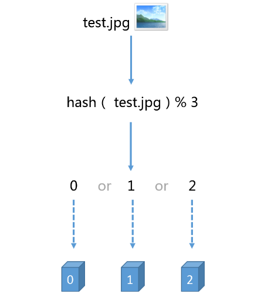

但哈希算法有其缺陷，比如在重大节日时，我们需要增加机器，那么我们整体的缓存服务器数量编增多了，而随着机器的改变，所有图片的缓存的位置我们都需要重新计算，重新部署，而在缓存时间段内，用户无法获取数据。 而同理，但我们的缓存服务器突然有一台出现故障，机器数量的减少，图片缓存的位置发生改变，之前的缓存都不起作用了，而大量缓存在同一时间失效，会造成缓存雪崩。

那么，如何解决上述的问题呢？怎么样尽量减少 当缓存服务器数量发生变化时 受影响的缓存呢？

下面就开始一致性哈希算法的讲解。

## 三、一致性哈希算法

> 在一致性哈希算法中，如果一台服务器不可用，则受影响的数据仅仅是此服务器到其环中前一台服务器，可以把影响范围控制在一个很小的范围内，大大增加系统的鲁棒性。

一致性哈希算法也是取模的方法，只是之前的哈希是对服务器的数量进行取模，而一致性哈希算法对2^32进行取模。

### 3.1 hash环构建

> hash环：在分布式系统中hash可以把服务器映射到环中任意一点

首先，对一个圆，假设其位2^32个点组成，示意图如下，这样一个圆环可称为哈希环。

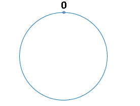

### 3.2 服务器映射到hash环中

其次，针对上述场景，假设我们有多台缓存服务器，每一台服务器都有其IP地址，那么便可进行取模运算了，其公式如下。

**哈希环ID = hash（服务器IP地址）% 2^32**

通过上述公式，便可找到缓存服务器与hash环相对应的一个整数，即将缓存服务器映射到哈希环中。

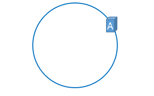

同理，其余服务器也是相同计算。

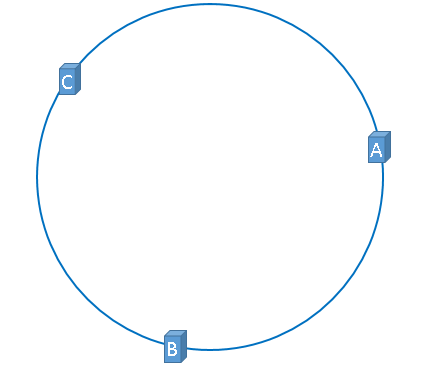

### 3.3 缓存数据缓存到服务器上

而缓存数据也是通过上述的hash算法，映射到我们的hash环中。缓存数据映射之后，我们需要确定该数据应该被缓存到哪个服务器上。 

> 从被缓存的数据位置出发, 沿顺时针方向(或逆时针方向)遇到的第一个服务器，便是我们的缓存数据要缓存存储的服务器。 所以一张图片必定会缓存到固定服务器上，下次想访问这张图片，用相同算法便可计算得到服务器的位置。

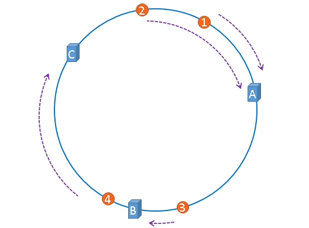

而该算法避免了上述哈希算法当服务器数量发生变化，会发生缓存的雪崩，导致系统崩溃问题，

### 3.4 一致性哈希算法在服务器增删上的优势

假设，服务器B出现了故障，需将服务器移除，即移除之后示意图如下：

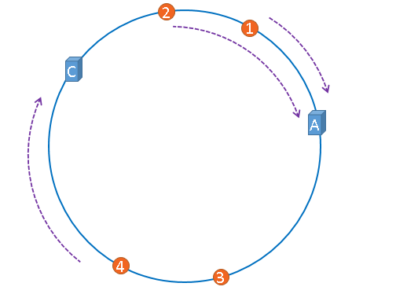

在服务器B未移除时，图片3应该被缓存到服务器B中，可是当服务器B移除以后，按照之前描述的一致性哈希算法的规则，图片3应该被缓存到服务器C中，因为从图片3的位置出发，沿顺时针方向遇到的第一个缓存服务器节点就是服务器C，也就是说，如果服务器B出现故障被移除时，图片3的缓存位置会发生改变。

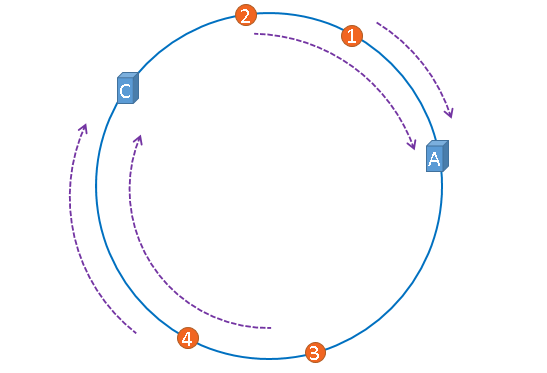

但是，图片4仍然会被缓存到服务器C中，图片1与图片2仍然会被缓存到服务器A中，这与服务器B移除之前并没有任何区别，这就是一致性哈希算法的优点，如果使用之前的hash算法，服务器数量发生改变时，所有服务器的所有缓存在同一时间失效了，而使用一致性哈希算法时，服务器的数量如果发生改变，并不是所有缓存都会失效，而是只有部分缓存会失效，前端的缓存仍然能分担整个系统的压力，而不至于所有压力都在同一时间集中到后端服务器上。

### 3.5 一致性哈希算法不足

但一致性哈希算法也存在了一定的不足，就是如何将机器均匀在hash环上分布，机器分布不足的情况下也会导致数据不均衡的分布在服务器上。

理想化的将服务器均衡映射到hash环中。

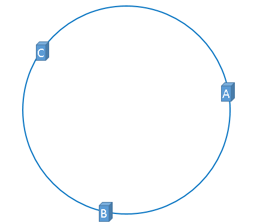

而实际中，服务器映射可能会出现以下情况。

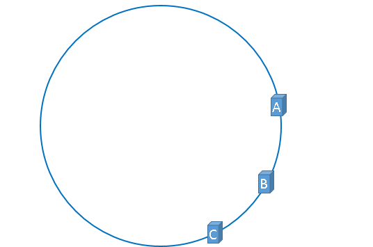

而上述这种情况，会导致被缓存的对象大量集中缓存在某一台服务器上。

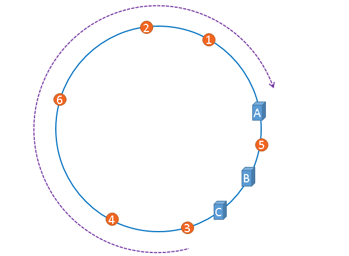

总之，就是服务器并没有被合理平均的充分利用，缓存分布极度不均匀，该现象称之为hash环的倾斜。

那么如何解决hash环切斜的问题呢？接下来就要引入“虚拟节点”的概念。

## 四、虚拟节点

由于我们只有3台服务器，当我们把服务器映射到hash环上的时候，很有可能出现hash环偏斜的情况，当hash环偏斜以后，缓存往往会极度不均衡的分布在各服务器上。

如果想要均衡的将缓存分布到3台服务器上，最好能让这3台服务器尽量多的、均匀的出现在hash环上，但是，真实的服务器资源只有3台，我们怎样凭空的让它们多起来呢？

既然没有多余的真正的物理服务器节点，我们就只能将现有的物理节点通过虚拟的方法复制出来，这些由实际节点虚拟复制而来的节点被称为"虚拟节点"。加入虚拟节点以后的hash环如下。

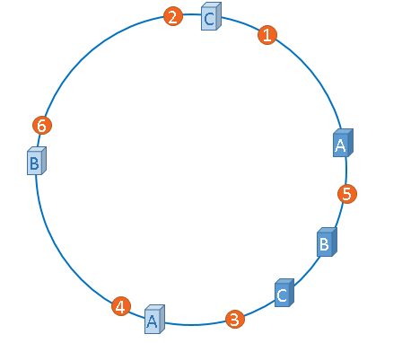

"虚拟节点"是"实际节点"（实际的物理服务器）在hash环上的复制品,一个实际节点可以对应多个虚拟节点。

从上图可以看出，A、B、C三台服务器分别虚拟出了一个虚拟节点，当然，如果你需要，也可以虚拟出更多的虚拟节点。引入虚拟节点的概念后，缓存的分布就均衡多了，上图中，1号、3号图片被缓存在服务器A中，5号、4号图片被缓存在服务器B中，6号、2号图片被缓存在服务器C中，如果你还不放心，可以虚拟出更多的虚拟节点，以便减小hash环偏斜所带来的影响，虚拟节点越多，hash环上的节点就越多，缓存被均匀分布的概率就越大。

实际操作中，对象从hash到虚拟节点到实际节点的转换如下图所示：

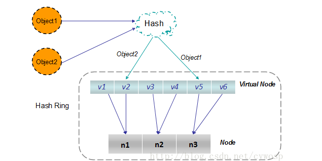