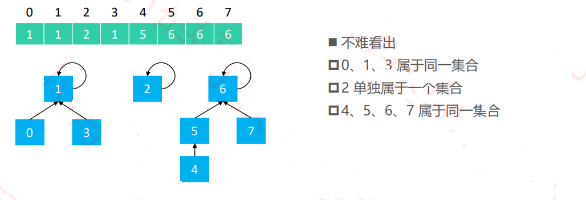
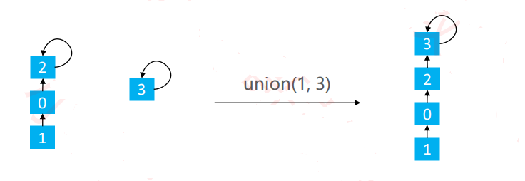
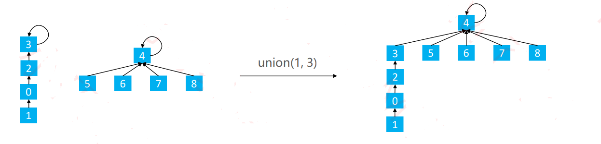
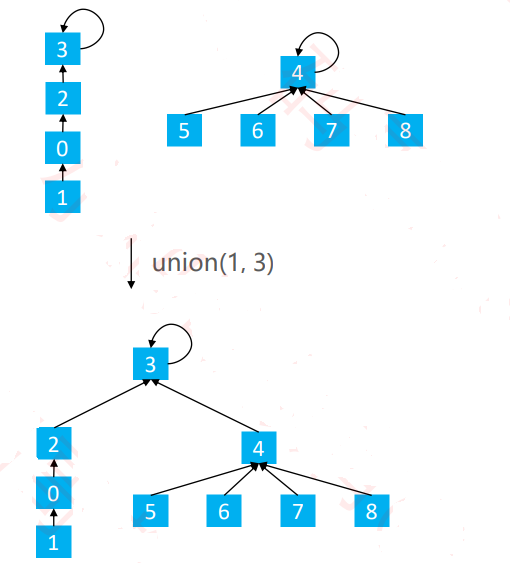
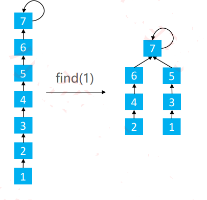
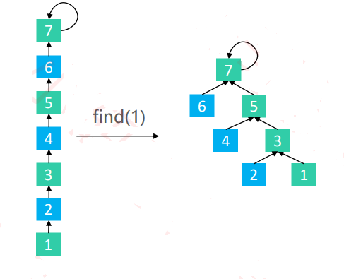

# 数据结构与算法-并查集(Union Find)

# 一、什么是并查集

现在有这样一个需求，假设有n个村庄，有些村庄之间有连接的路，有些村庄之间并没有连接的路。

现在需要设计一个数据结构，能够快速执行以下2个操作：

- 查询2个村庄之间是否有连接的路
- 连接2个村庄

而针对这类“连接”相关的问题，并查集能够办到查询、连接的均摊时间复杂度都是 O（ α（ n） ），α（ n） < 5


> 并查集有2个核心操作
>
> - 查找(Find): 查找元素所在的集合
> - 合并(Union): 将两个元素所在的集合合并成一个集合。


> 并查集主要有2种常见的实现思路：
>
> - Quick Find
>   - 查找(find)的时间复杂度：O(1)
>   - 合并(Union)的时间复杂度：O(n)
> - Quick Union
>   - 查找（Find）的时间复杂度：O(logn)，可以优化至 O (𝛼 (𝑛)) ，α(𝑛) < 5
>   - 合并（Union）的时间复杂度：O(logn)，可以优化至 O (𝛼 (𝑛)) ，α(𝑛) < 5


# 二、并查集如何存储数据

> 假设并查集处理的数据都是整型，那么可以用整型数组来存储数据。



# 三、并查集插常见的实现方式

## 3.1 Qucik Find的代码实现(不常用)

```java
public class UnionFind{
    private int[] parents;
    // 初始化
    public UnionFind(int capacity){
        if(capacity<0){
            throw new IllegalArgumentException("Capacity must be >= 1.");
        }
        parents = new int[capacity];
        for(int i=0;i<parents.length;i++){
            parents[i] = i;
        }
    }
    // 合并
    public void union(int v1,int v2){
        int p1 = find(v1);
        int p2 = find(v2);
        if(p1==p2)
            return;
        for(int i=0;i<parents.length;i++){
            if(parents[i]==p1){
                parents[i] = p2;
            }
        }
    }
    // 查找
    public int find(int v){
        return parents[v];
    }
    // 判断是否相同集合
    public boolean isSame(int v1,int v2){
        return find(v1) == find(v2);
    }
}
```

## 3.2 Qucik Union（待改进）

```java
public class UnionFind{
    private int[] parents;
    // 初始化
    public UnionFind(int capacity){
        if(capacity<0){
            throw new IllegalArgumentException("Capacity must be >= 1.");
        }
        parents = new int[capacity];
        for(int i=0;i<parents.length;i++){
            parents[i] = i;
        }
    }
    // 合并
    public void union(int v1,int v2){
        int p1 = find(v1);
        int p2 = find(v2);
        if(p1==p2)
            return;
        parents[p1] = p2;
    }
    // 查找
    public int find(int v){
        while(v!=parents[v]){
            v = parents[v];
        }
    }
    // 判断是否相同集合
    public boolean isSame(int v1,int v2){
        return find(v1) == find(v2);
    }
}
```


> 但在Union的过程中，可能会出现树不平衡的情况，甚至退化成链表



> 一般是有2种常见的优化方案
>
> - 基于size的优化：元素少的树嫁接到元素多的树
> - 基于rand的优化：矮的树嫁接到高的树

### 3.2.1 Quick Union-基于size优化(一般不采用)

在上述的基础上改进

```java
private int[] sizes;

size = new int[capacity];
for(int i=0;i<sizes.length;i++){
    sizes[i] = 1;
}

public void union(int v1,int v2){
    int p1 = find(v1);
    int p2 = find(v2);
    if(p1==p2)
        return;
    if(sizes[p1]<sizes[p2]){
        parents[p1] = p2;
        sizes[p2] += sizes[p1];
    }else{
        parents[p2]=p1;
        sizes[p1] += sizes[p2];
    }
}

```

> 但基于size的优化，还可能会存在树不平衡的情况



### 3.2.2 Quick Union-基于rand的优化



```java
private int[] ranks[];

ranks = new int[capacity];
for(int i=0;i<ranks.length;i++){
    ranks[i] = 1;
}

public void union(int v1,int v2){
    int p1 = find(v1);
    int p2 = find(v2);
    if(p1==p2)
        return;
    if(ranks[p1]<ranks[p2]){
        parents[p1] = p2;
    }else if(ranks[p2]<ranks[p1]){
        parents[p2] = p1;
    }else{
        parents[p1] = p2;
        ranks[p2]++;
    }
}
```

> 虽然有了基于rank的优化，树会相对平衡一点。
>
> 但是随着union次数的增多，树的高度依然会越来越高，导致find操作变慢，尤其是底层节点

## 3.3 Quick Union中的find优化

### 3.3.1 路径压缩

- 在find时使路径上的所有节点都指向根结点，从而降低树的高度

```java
public int find(int v){
	if(parents[v]!=v){
        parents[v] = find(parents[v]);
    }
    return parents[v];
}
```

> 路径压缩使路径上的所有节点都指向根结点，所以实现成本稍高
>
> 此外还有2种更优的做法，不但能降低树高，实现成本也比路径压缩低
>
> - 路径分裂
> - 路径减半

### 3.3.2 路径分裂

- 使路径上的每个节点都指向其祖父节点



```java
public int find(int v){
    while(v!=parents[v]){
        int parent = parents[v];
        parents[v] = parents[parent];
        v          = parent;
    }
    return v;
}
```

### 3.3.3 路径减半

- 使路径上每隔一个节点就指向其祖父节点



```java
public int find(int v){
    while(v!=parents[v]){
        parents[v] = parents[parents[v]];
        v          = parents[v];
    }
    return v;
}
```

## 3.4 自定义类型

- 之前的实现都是基于整型数据，如果对于其他自定义类型也想使用并查集呢？
  - 方案一、通过一些方法将自定义类型转为整型后使用并查集(比如生成哈希值)
  - 方案二、使用链表+映射(Map)

# 四、并查集代码最终实现方式

```java
class UnionFind{
    int[] parents;
    // 初始化
    public UnionFind(int totalNodes){
        parents = new int[totalNodes];
        for(int i=0;i<totalNodes;i++){
            parents[i] = i;
        }
    }
    
    // 合并
    public void union(int node1,int node2){
        int root1 = find(node1);
        int root2 = find(node2);
        if(root1!=root2){
            parents[root2] = root1;
        }
    }
    
    // 查找
    public int find(int node){
        while(parents[node]!=node){
            parents[node] = parents[parents[node]];
            node = parents[node];
        }
        return node;
    }
    
    // 看是否在同一个集合
    public boolean isConnected(int node1,int node2){
        return find(node1) == find(node2);
    }
}
```

# 五、并查集应用解题

## 5.1 岛问题

> 一个矩阵中只有0和1两种值，每个位置都可以和自己的上、下、左、右 四个位置相连，如果有一片1连在一起，这个部分叫做一个岛，求一个 矩阵中有多少个岛？ 

> 举例： 

 0 0 1 0 1 0

 1 1 1 0 1 0

 1 0 0 1 0 0

 0 0 0 0 0 0 

> 这个矩阵中有三个岛。

### 解法一、DFS

```java
public static int countIslands(int[][] m){
    if(m==null || m[0] == null){
        return 0;
    }
    int N = m.length;
    int M = m[0].length;
    int res = 0;
    for(int i=0;i<N;i++){
        for(int j=0;j<M;j++){
            if(m[i][j]==1){
                res++;
                infect(m,i,j,N,M);
            }
    	}
 	 }
    return res;
}

public static void infect(int[][] m,int i,int j,int N,int M){
    if(i<0 || i>=N || j<0 || j>=M || m[i][j]!=1){
        return;
    }
    m[i][j] = 2;
    infect(m,i+1,j,N,M);
    infect(m,i-1,j,N,M);
    infect(m,i,j+1,N,M);
    infect(m,i,j-1,N,M);
}
    
    
```

### 解法二、并查集

```java
package com.lcz.leetcode;

public class Leetcode200_2 {
	
	private int rows;
	private int cols;
	
	// 声明一个并查集类
	private class UnionFind{
		private int count;
		private int[] parent;
		
		public UnionFind(int n) {
			this.count = n;
			parent = new int[n];
			for(int i=0;i<n;i++) {
				parent[i] = i;
			}
		}
		public int getCount() {
			return this.count;
		}
		
		// 查找
		public int find(int x) {
			while(x!=parent[x]) {
				parent[x] = parent[parent[x]];
				x = parent[x];
			}
			return x;
		}
		// 判断是否在同一点上
		public boolean isConnected(int x1,int x2) {
			return find(x1)==find(x2);
		}
		// 合并
		public void union(int x,int y) {
			int xRoot = find(x);
			int yRoot = find(y);
			if(xRoot==yRoot) {
				return;
			}
			
			parent[xRoot] = yRoot;
			count--;
		}
	}
	
	
	//二维转一维的
	private int node(int i,int j) {
		return i*cols+j;
	}
	
	// 判断
	public int numIslands(char[][] grid) {
		rows = grid.length;
		if(rows==0) {
			return 0;
		}
		cols = grid[0].length;
		
		//空地的数量
		int spaces = 0;
		
		UnionFind unionfind = new UnionFind(rows*cols);
		for(int i=0;i<rows;i++) {
			for(int j=0;j<cols;j++) {
				if(grid[i][j]=='0') {
					spaces++;
				}else {
					// 和上下左右合并成一个连通区域
					if(i>0&&grid[i-1][j]=='1') {
						unionfind.union(node(i,j), node(i-1,j));
					}
					
					if(i<rows-1&&grid[i+1][j]=='1') {
						unionfind.union(node(i,j), node(i+1,j));
					}
					
					if(j>0&&grid[i][j-1]=='1') {
						unionfind.union(node(i,j), node(i,j-1));
					}
					
					if(j<cols-1&&grid[i][j+1]=='1') {
						unionfind.union(node(i,j), node(i,j+1));
					}
				}
			}
		}
		
		return unionfind.getCount()-spaces;
	}
	
}

```

## 5.2 被围绕的区域

>给定一个二维的矩阵，包含 `'X'` 和 `'O'`（**字母 O**）。
>
>找到所有被 `'X'` 围绕的区域，并将这些区域里所有的 `'O'` 用 `'X'` 填充。

> 示例:

X X X X
X O O X
X X O X
X O X X

> 运行你的函数后，矩阵变为：

X X X X
X X X X
X X X X
X O X X

> 解释:
>
> 被围绕的区间不会存在于边界上，换句话说，任何边界上的 'O' 都不会被填充为 'X'。 任何不在边界上，或不与边界上的 'O' 相连的 'O' 最终都会被填充为 'X'。如果两个元素在水平或垂直方向相邻，则称它们是“相连”的。

### 解法一、DFS

```java
class Solution{
    public void solve(char[][] board){
        if(board==null || board.length==0)
            return;
        int m = board.length;
        int n = board[0].length;
        for(int i=0;i<m;i++){
            for(int j=0;j<n;j++){
                // 边缘且为0
                boolean isEdge = i==0 || j==0 || i == m-1 || j== n-1;
                if(isEdge && board[i][j]=='O'){
                    dfs(board,i,j);
                }
            }
        }
        // 对其重新染色
        for(int i=0;i<m;i++){
            for(int j=0;j<n;j++){
                if(board[i][j]=='O'){
                    board[i][j] = 'X';
                }
                if(board[i][j]=='#'){
                    board[i][j]='O';
                }
            }
        }
    }
    
    public void dfs(char[][] board,int i,int j){
        if(i<0 || j<0 || i>=board.length || j>=board[0].length || board[i][j]=='X' || board[i][j] == '#'){
            return;
        }
        board[i][j] = '#';
        dfs(board,i-1,j);
        dfs(board,i+1,j);
        dfs(board,i,j-1);
        dfs(board,i,j+1);
    }
}
```

### 解法二、并查集

```java
class Solution {
    private int rows;
    private int cols;

    class UnionFind {
        int[] parents;

        public UnionFind(int totalNodes) {
            parents = new int[totalNodes];
            for (int i = 0; i < totalNodes; i++) {
                parents[i] = i;
            }
        }
            // 合并连通区域是通过find来操作的, 即看这两个节点是不是在一个连通区域内.
        void union(int node1, int node2) {
            int root1 = find(node1);
            int root2 = find(node2);
            if (root1 != root2) {
                parents[root2] = root1;
            }
        }

        int find(int node) {
            while (parents[node] != node) {
                // 当前节点的父节点 指向父节点的父节点.
                // 保证一个连通区域最终的parents只有一个.
                parents[node] = parents[parents[node]];
                node = parents[node];
            }

            return node;
        }

        boolean isConnected(int node1, int node2) {
            return find(node1) == find(node2);
        }
    }

    int node(int i, int j) {
        return i * cols + j;
    }


    public void solve(char[][] board) {
        if (board == null || board.length == 0)
            return;

        rows = board.length;
        cols = board[0].length;

        // 用一个虚拟节点, 边界上的O 的父节点都是这个虚拟节点
        UnionFind uf = new UnionFind(rows * cols + 1);
        int dummyNode = rows * cols;

        for (int i = 0; i < rows; i++) {
            for (int j = 0; j < cols; j++) {
                if (board[i][j] == 'O') {
                    // 遇到O进行并查集操作合并
                    if (i == 0 || i == rows - 1 || j == 0 || j == cols - 1) {
                        // 边界上的O,把它和dummyNode 合并成一个连通区域.
                        uf.union(node(i, j), dummyNode);
                    } else {
                        // 和上下左右合并成一个连通区域.
                        if (i > 0 && board[i - 1][j] == 'O')
                            uf.union(node(i, j), node(i - 1, j));
                        if (i < rows - 1 && board[i + 1][j] == 'O')
                            uf.union(node(i, j), node(i + 1, j));
                        if (j > 0 && board[i][j - 1] == 'O')
                            uf.union(node(i, j), node(i, j - 1));
                        if (j < cols - 1 && board[i][j + 1] == 'O')
                            uf.union(node(i, j), node(i, j + 1));
                    }
                }
            }
        }

        for (int i = 0; i < rows; i++) {
            for (int j = 0; j < cols; j++) {
                if (uf.isConnected(node(i, j), dummyNode)) {
                    // 和dummyNode 在一个连通区域的,那么就是O；
                    board[i][j] = 'O';
                } else {
                    board[i][j] = 'X';
                }
            }
        }
    }
}
```

## 5.3 朋友圈问题

班上有 N 名学生。其中有些人是朋友，有些则不是。他们的友谊具有是传递性。如果已知 A 是 B 的朋友，B 是 C 的朋友，那么我们可以认为 A 也是 C 的朋友。所谓的朋友圈，是指所有朋友的集合。 给定一个 N * N 的矩阵 M，表示班级中学生之间的朋友关系。如果M[i][j] = 1，表示已知第 i 个和 j 个学生互为朋友关系，否则为不知道。你必须输出所有学生中的已知的朋友圈总数。 示例 1: 输入: [[1,1,0], [1,1,0], [0,0,1]] 输出: 2 说明：已知学生0和学生1互为朋友，他们在一个朋友圈。 第2个学生自己在一个朋友圈。所以返回2

类似岛问题求解。