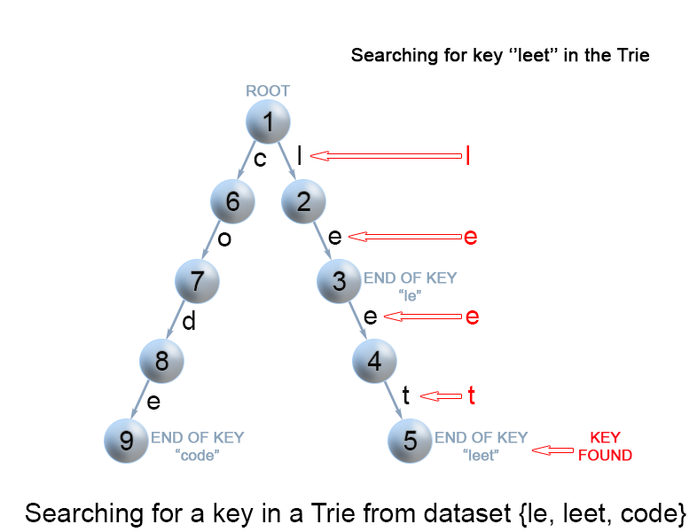

# 数据结构与算法-前缀树(Trie)

# 一、前缀树的应用

前缀树是一种树数据结构，用于检索字符串数据集中的键。这一高效的数据结构有多种应用：

- 自动补全


​																												图 1. 谷歌的搜索建议

- 拼写检查

  ​	

  ​							图2. 文字处理软件中的拼写检查

- IP 路由 (最长前缀匹配)

						

​															图 3. 使用Trie树的最长前缀匹配算法，Internet 协议（IP）路由中利用转发表选择路径。

- T9 (九宫格) 打字预测


​																				图 4. T9（九宫格输入），在 20 世纪 90 年代常用于手机输入

- 单词游戏


			图 5. Trie 树可通过剪枝搜索空间来高效解决 Boggle 单词游戏

还有其他的数据结构，如平衡树和哈希表，使我们能够在字符串数据集中搜索单词。为什么我们还需要 Trie 树呢？尽管哈希表可以在 O(1)O(1) 时间内寻找键值，却无法高效的完成以下操作：

- 找到具有同一前缀的全部键值。
- 按词典序枚举字符串的数据集。


Trie 树优于哈希表的另一个理由是，随着哈希表大小增加，会出现大量的冲突，时间复杂度可能增加到 O(n)O(n)，其中 nn 是插入的键的数量。与哈希表相比，Trie 树在存储多个具有相同前缀的键时可以使用较少的空间。此时 Trie 树只需要 O(m)O(m) 的时间复杂度，其中 mm 为键长。而在平衡树中查找键值需要 O(m log n)O(mlogn) 时间复杂度。


# 二、前缀树的数据结构

Trie 树是一个有根的树，其结点具有以下字段：。

- 最多 RR 个指向子结点的链接，其中每个链接对应字母表数据集中的一个字母。
  本文中假定 RR 为 26，小写拉丁字母的数量。
- 布尔字段，以指定节点是对应键的结尾还是只是键前缀。


# 三、前缀树的代码

## 3.1 TrieNode结点代码

```java
class TrieNode{
    //R links to node children
    private TrieNode[] links;
    
    private final int R = 26;
    
    private boolean isEnd;
    
    public TrieNode(){
        links = new TrieNode[R];
    }
    
    public boolean containsKey(char ch){
        retrurn links[ch-'a']!=null;
    }
    
    public TrieNode get(char ch){
        return links[ch-'a'];
    }
    
    public void put(char ch,TrieNode node){
        links[ch-'a'] = node;
    }
    
    public void setEnd(){
        isEnd = true;
    }
    
    public boolean isEnd(){
        return isEnd;
    }
    
}
```


## 3.2 Trie树代码

### 3.2.1 向Trie树插入键

通过搜索Trie树来插入一个键。我们从根开始搜索它对应于第一个键字符的链接。有两种情况：

- 链接存在。沿着链接移动到树的下一个子层。算法继续搜索下一个键字符。
- 链接不存在。创建一个新的结点，并将它与父节点的链接相连，该链接与当前的键字符相匹配。

重复以上步骤，直到达到键的最后一个字符，然后将当前节点标记为结束结点，算法结束。


```java
class Trie{
    private TrieNode root;
    
    public Trie(){
        root = new TrieNode();
    }
    
    // insert into a word into the trie
    public void insert(String word){
        TrieNode node = root;
        for(int i=0;i<word.length();i++){
            char currentChar = word.charAt(i);
            if(!node.containsKey(currentChar)){
                node.put(currentChar,new TrieNode());
            }
            node = node.get(currentChar);
        }
        node.setEnd();
    }
}
```

### 3.2.2 向Trie树中查找键

每个键在Trie中表示为从根到内部结点或叶的路径。用第一个键字符从根开始，检查当前节点中与键字符对应的链接。有两种情况：

- 存在链接。我们移动到该链接后面路径中的下一个节点，并继续搜索下一个键字符。
- 不存在链接。若已无键字符，且当前节点标记为isEnd，则返回true。否则有两种可能，均返回false
  - 还有键字符剩余，但无法跟随Trie数的键路径，找不到键。
  - 没有键字符剩余，但当前节点没有标记为isEnd。也就是说，待查询找键只是Trie树中另一个键的前缀。





```java
class Trie{
    //....
    private TrieNode searchPrefix(String word){
        TrieNode node = root;
        for(int i=0;i<word.length();i++){
            char currentChar = word.charAt(i);
            if(node.containsKey(currentChar)){
                node = node.get(currentChar);
            }else{
                return null;
            }
        }
        return node;
    }
    
    public boolean search(String word){
        TrieNode node = searchPrefix(word);
        return node!=null && node.isEnd();
    }
}
```

### 3.2.3 查找Trie树中的键前缀

该方法与在 Trie 树中搜索键时使用的方法非常相似。我们从根遍历 Trie 树，直到键前缀中没有字符，或者无法用当前的键字符继续 Trie 中的路径。与上面提到的“搜索键”算法唯一的区别是，到达键前缀的末尾时，总是返回 下true。我们不需要考虑当前 Trie 节点是否用 “isend” 标记，因为我们搜索的是键的前缀，而不是整个键。


```java
class Trie{
    // ...
    
    public boolean startsWith(String prefix){
        TrieNode root = searchPrefix(prefix);
        return node!=null;
    }
}
```

