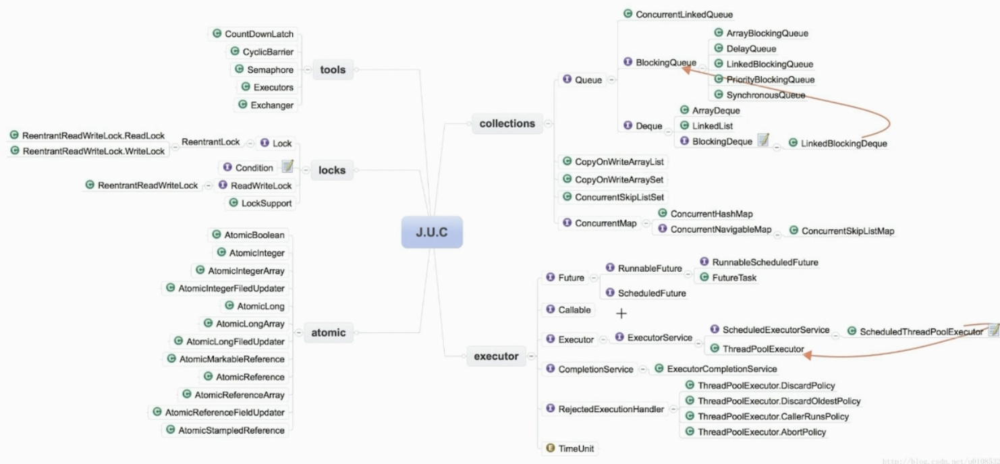

# Java中JUC知识点梳理

**java.util.concurrent: 提供了并发编程的解决方案**

- CAS是java.util.concurrent.atomic包的基础；
- AQS是java.util.concurrent.locks包以及一些常用类比如Semophore、ReentrantLock等类的基础；

**J.U.C包的分类**

- 线程执行器executor；
- 锁locks；
- 原子变量类atomic；
- 并发工具类tools；
- 并发集合collections

**并发工具类**

- 闭锁CountDownLatch；
  - 让主线程等待一组事件发生后继续执行；
  - 事件指的是CountDownLatch里的countDown()方法；

- 栅栏CyclicBarrier；
  - 阻塞当前线程，等待其他线程；
  - 等待其他线程，且会阻塞自己当前线程，所有线程必须同时到达栅栏位置后，才能继续执行；
  - 所有线程达到栅栏处，可以触发执行另外一个预先设置的线程；
- 信号量Semaphore；
  - 控制某个资源可被同时访问的线程个数；
- 交换器Exchanger；
  - 两个线程达到同步点，相互交换数据；

**BlockingQueue：提供可阻塞的入队和出队操作**

主要用于生产者-消费者模式，在多线程场景时生产者线程再队列尾部添加元素，而消费者线程则在队列头部消费元素，通过这种方式能够达到将任务的生产和消费进行隔离的目的。

- **ArrayBlockingQueue：一个由数组结构组成的有界阻塞队列；**
- **LinkedBlockingQueue：一个由链表结构组成的有界/无界阻塞队列；**
- **PriorityBlockingQueue：一个支持优先级排序的无界阻塞队列；**
- DealyQueue：一个使用优先级队列实现的无界阻塞队列；
- SynchronousQueue:一个不存储元素的阻塞队列；
- LinkedTransferQueue：一个由链表结构组成的无界阻塞队列；
- LinkedBlockingDeque：一个由链表结构组成的双向阻塞队列；

