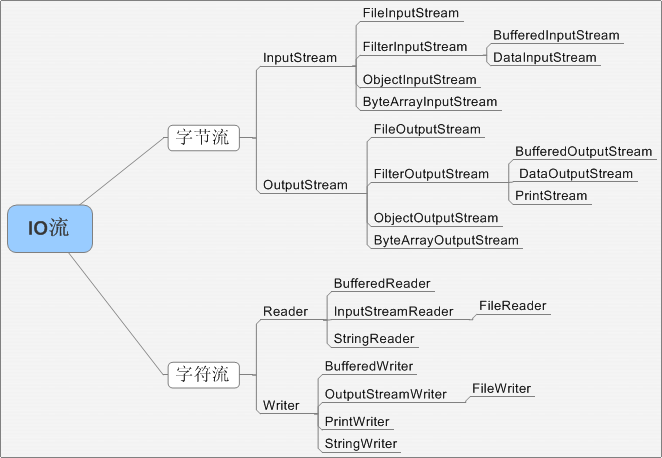
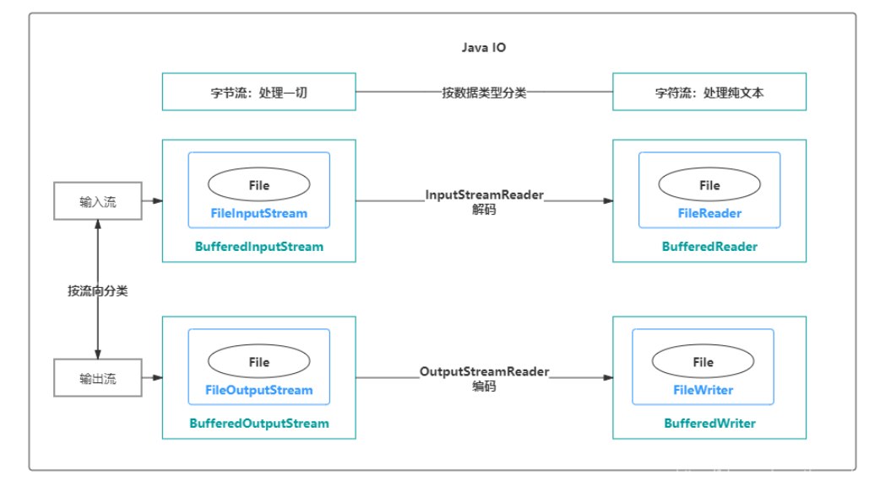
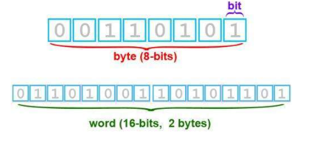
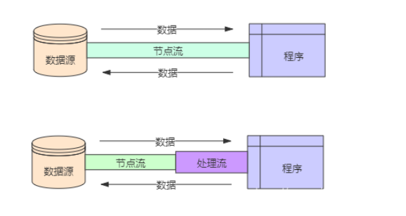
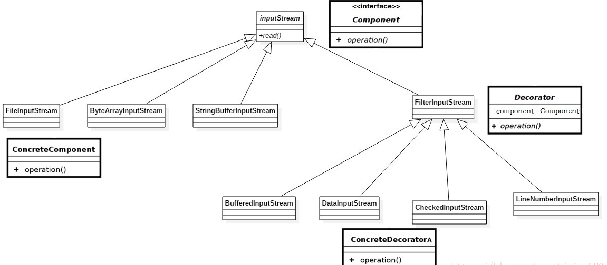
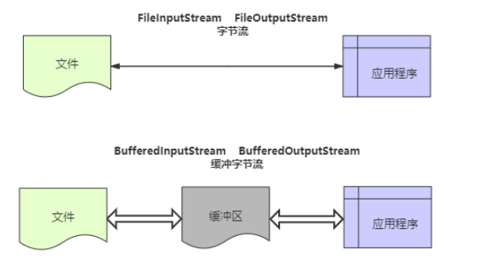
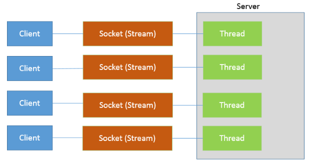
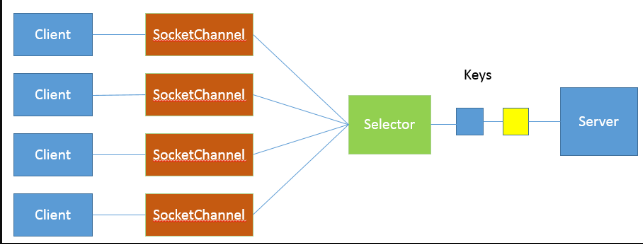
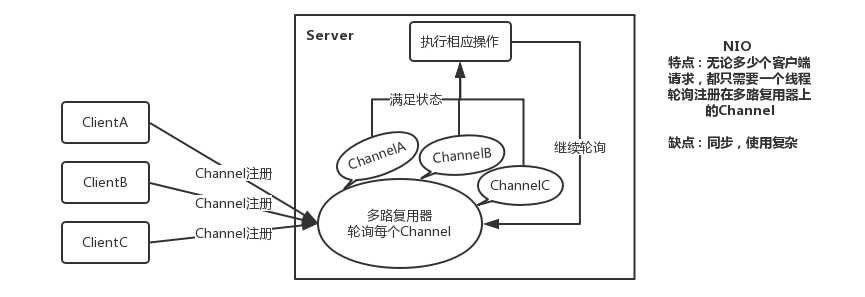
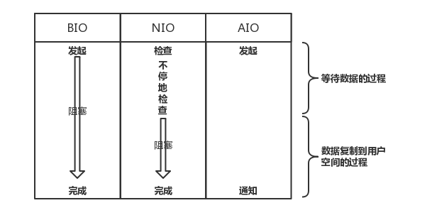

# 一、【Java网络编程与IO流】JAVA中IO流


### Java中IO流分为几种？




#### 1.Java的IO流是什么？

IO：即in和out，输入和输出，指的是应用程序和外部设备之间的数据传递；

Java是通过流来处理IO的，流(Stream)是一个抽象的概念，是指一连串的树(字符或字节)，是以先进先出的方式发送信息的通道；

一般流有以下特性：

- 先进先出：最先写入输出流的数据最先被输入流读取到；
- 顺序存取：可以一个接一个的往流中写入一串字节，读出时也会按写入顺序读取一串字节，不能随机访问中间的数据。
- 只读或者只写：每个流只能是输入流或输出流的一种，不能同时具备两个功能。

#### 2.IO流的分类：

- 按数据流的方向：输入流和输出流
- 按处理数据单位：字节流和字符流
- 按功能：节点流、处理流



**按操作方式分类结构图：**


按操作对象分类结构图：


##### a.输入流与输出流

输入与输出是相对于应用程序而言的，比如文件读写，读取文件是输入流，写文件是输出流。


##### b.字节流与字符流

两者的用法几乎一样，区别在于字节流和字符流所操作的数据单位不同，字节流操作的数据单位是8位的字节，字符流操作的数据单位是16位的字符。

**为什么有了字节流还要推出字符流？**

Java中字符是采用Unicode标准，在Unicode编码中，一个英文为一个字节，一个中文为两个字节。



为了更加方便的处理中文这些字符，Java推出了字符流。

> 补充：在UTF-8中，一个中文字符是3个字节。

**字节流和字符流的区别是什么？**

- 字节流可以处理一切文件，而字符流只能处理纯文本文件；例如字节流一般用来处理图像、视频、音频、PPT、Word等类型的文件。字符流一般用于处理纯文本类型的文件，如txt文件。
- 字节流本身没有缓冲区，缓冲字节流相比于字节流，效率提升非常高。而字符流本身就带有缓冲区，缓冲字符流相比于字符流提升没有那么大。

##### c.节点流和处理流

- 节点流：直接操作数据读写的流类，比如`FileInputStream`

- 处理流：对一个已存在的流的链接和封装，通过对数据进行处理为程序提供功能强大、灵活的读写功能，例如`BufferedInputStream`（缓冲字节流）



> 节点流和处理流应用了[Java的装饰者设计模式](https://blog.csdn.net/qian520ao/article/details/82529890)
>
> 
>
> - **抽象组件(InputStream)** ：装饰者模式中的超类，它只有一个抽象方法`read()`，子类都需要对该方法进行处理
> - **被装饰者(FileInputStream , ByteArrayInputStream , StringBufferInputStream)** ：拥有通用实现`read()`基本方法
> - **装饰者组件(FilterInputStream)** ：定义具体装饰者的行为规范，可以做统一基础处理。
> - **具体装饰(BufferedInputStream , DataInputStream , Base64InputStream)** ：具体的装饰类，拥有对流的读操作做完成具体拓展能力。
>
> 装饰者模式让我们可以有不同的被装饰者，例如`FileInputStream`，并且如果想使用缓冲功能那么只需写一下代码 ：
>
> ```java
> new BufferedInputStream(new FileInputStream(new File("path")));1
> ```
>
> 也可以对上面代码再进行加工，简单的加密处理 ：
>
> ```java
> new Base64InputStream(new BufferedInputStream(new FileInputStream(new File(""))),0)1
> ```
>
> 哪怕你突然改需求了，读取的对象不是文件，而是文本或字符，那么可以轻松的将代码改为 ：
>
> ```java
> new Base64InputStream(new BufferedInputStream(new StringBufferInputStream("str")),0)
> ```

##### d.什么是缓冲流？

程序与磁盘的交互相对于内存运算是很慢的，容易成为程序的性能瓶颈。减少程序与磁盘的交互，是提升程序效率一种有效手段。缓冲流，就应用这种思路：普通流每次读写一个字节，而缓冲流在内存中设置一个缓存区，缓冲区先存储足够的待操作数据后，再与内存或磁盘进行交互。这样，在总数据量不变的情况下，通过提高每次交互的数据量，减少了交互次数。



#### 3.Java中IO流的例子

**文本读写的例子**，将“松下问童子，言师采药去。只在此山中，云深不知处。”写入本地文本，然后再从文件读取内容并输出到控制台。

**1、FileInputStream、FileOutputStream（字节流）**

> **字节流的方式效率较低，不建议使用**

```java
public class IOTest {
	public static void main(String[] args) throws IOException {
		File file = new File("D:/test.txt");

		write(file);
		System.out.println(read(file));
	}

	public static void write(File file) throws IOException {
		OutputStream os = new FileOutputStream(file, true);

		// 要写入的字符串
		String string = "松下问童子，言师采药去。只在此山中，云深不知处。";
		// 写入文件
		os.write(string.getBytes());
		// 关闭流
		os.close();
	}

	public static String read(File file) throws IOException {
		InputStream in = new FileInputStream(file);

		// 一次性取多少个字节
		byte[] bytes = new byte[1024];
		// 用来接收读取的字节数组
		StringBuilder sb = new StringBuilder();
		// 读取到的字节数组长度，为-1时表示没有数据
		int length = 0;
		// 循环取数据
		while ((length = in.read(bytes)) != -1) {
			// 将读取的内容转换成字符串
			sb.append(new String(bytes, 0, length));
		}
		// 关闭流
		in.close();

		return sb.toString();
	}
}
```

**2、BufferedInputStream、BufferedOutputStream（缓冲字节流）**

> 缓冲字节流是为高效率而设计的，真正的读写操作还是靠`FileOutputStream`和`FileInputStream`，所以其构造方法入参是这两个类的对象也就不奇怪了。

```java
public class IOTest {

	public static void write(File file) throws IOException {
		// 缓冲字节流，提高了效率
		BufferedOutputStream bis = new BufferedOutputStream(new FileOutputStream(file, true));

		// 要写入的字符串
		String string = "松下问童子，言师采药去。只在此山中，云深不知处。";
		// 写入文件
		bis.write(string.getBytes());
		// 关闭流
		bis.close();
	}

	public static String read(File file) throws IOException {
		BufferedInputStream fis = new BufferedInputStream(new FileInputStream(file));

		// 一次性取多少个字节
		byte[] bytes = new byte[1024];
		// 用来接收读取的字节数组
		StringBuilder sb = new StringBuilder();
		// 读取到的字节数组长度，为-1时表示没有数据
		int length = 0;
		// 循环取数据
		while ((length = fis.read(bytes)) != -1) {
			// 将读取的内容转换成字符串
			sb.append(new String(bytes, 0, length));
		}
		// 关闭流
		fis.close();

		return sb.toString();
	}
}

```

**3、InputStreamReader、OutputStreamWriter（字符流）**

> **字符流适用于文本文件的读写**，`OutputStreamWriter`类其实也是借助`FileOutputStream`类实现的，故其构造方法是`FileOutputStream`的对象

```java
public class IOTest {
	
	public static void write(File file) throws IOException {
		// OutputStreamWriter可以显示指定字符集，否则使用默认字符集
		OutputStreamWriter osw = new OutputStreamWriter(new FileOutputStream(file, true), "UTF-8");

		// 要写入的字符串
		String string = "松下问童子，言师采药去。只在此山中，云深不知处。";
		osw.write(string);
		osw.close();
	}

	public static String read(File file) throws IOException {
		InputStreamReader isr = new InputStreamReader(new FileInputStream(file), "UTF-8");
		// 字符数组：一次读取多少个字符
		char[] chars = new char[1024];
		// 每次读取的字符数组先append到StringBuilder中
		StringBuilder sb = new StringBuilder();
		// 读取到的字符数组长度，为-1时表示没有数据
		int length;
		// 循环取数据
		while ((length = isr.read(chars)) != -1) {
			// 将读取的内容转换成字符串
			sb.append(chars, 0, length);
		}
		// 关闭流
		isr.close();

		return sb.toString()
	}
}
```

**4、字符流便捷类**

> Java提供了`FileWriter`和`FileReader`简化字符流的读写，`new FileWriter`等同于`new OutputStreamWriter(new FileOutputStream(file, true))`

```java
public class IOTest {
	
	public static void write(File file) throws IOException {
		FileWriter fw = new FileWriter(file, true);

		// 要写入的字符串
		String string = "松下问童子，言师采药去。只在此山中，云深不知处。";
		fw.write(string);
		fw.close();
	}

	public static String read(File file) throws IOException {
		FileReader fr = new FileReader(file);
		// 一次性取多少个字节
		char[] chars = new char[1024];
		// 用来接收读取的字节数组
		StringBuilder sb = new StringBuilder();
		// 读取到的字节数组长度，为-1时表示没有数据
		int length;
		// 循环取数据
		while ((length = fr.read(chars)) != -1) {
			// 将读取的内容转换成字符串
			sb.append(chars, 0, length);
		}
		// 关闭流
		fr.close();

		return sb.toString();
	}
}

```

**5、BufferedReader、BufferedWriter（字符缓冲流）**

```java
public class IOTest {
	
	public static void write(File file) throws IOException {
		// BufferedWriter fw = new BufferedWriter(new OutputStreamWriter(new
		// FileOutputStream(file, true), "UTF-8"));
		// FileWriter可以大幅度简化代码
		BufferedWriter bw = new BufferedWriter(new FileWriter(file, true));

		// 要写入的字符串
		String string = "松下问童子，言师采药去。只在此山中，云深不知处。";
		bw.write(string);
		bw.close();
	}

	public static String read(File file) throws IOException {
		BufferedReader br = new BufferedReader(new FileReader(file));
		// 用来接收读取的字节数组
		StringBuilder sb = new StringBuilder();

		// 按行读数据
		String line;
		// 循环取数据
		while ((line = br.readLine()) != null) {
			// 将读取的内容转换成字符串
			sb.append(line);
		}
		// 关闭流
		br.close();

		return sb.toString();
	}
}
```

### Java中BIO、NIO、AIO的区别是什么？

- **BIO (Blocking I/O):** 同步阻塞I/O模式，数据的读取写入必须阻塞在一个线程内等待其完成。在活动连接数不是特别高（小于单机1000）的情况下，这种模型是比较不错的，可以让每一个连接专注于自己的 I/O 并且编程模型简单，也不用过多考虑系统的过载、限流等问题。线程池本身就是一个天然的漏斗，可以缓冲一些系统处理不了的连接或请求。但是，当面对十万甚至百万级连接的时候，传统的 BIO 模型是无能为力的。因此，我们需要一种更高效的 I/O 处理模型来应对更高的并发量。
- **NIO (New I/O):** NIO是一种同步非阻塞的I/O模型，在Java 1.4 中引入了NIO框架，对应 java.nio 包，提供了 Channel , Selector，Buffer等抽象。NIO中的N可以理解为Non-blocking，不单纯是New。它支持面向缓冲的，基于通道的I/O操作方法。 NIO提供了与传统BIO模型中的 `Socket` 和 `ServerSocket` 相对应的 `SocketChannel` 和 `ServerSocketChannel` 两种不同的套接字通道实现,两种通道都支持阻塞和非阻塞两种模式。阻塞模式使用就像传统中的支持一样，比较简单，但是性能和可靠性都不好；非阻塞模式正好与之相反。对于低负载、低并发的应用程序，可以使用同步阻塞I/O来提升开发速率和更好的维护性；对于高负载、高并发的（网络）应用，应使用 NIO 的非阻塞模式来开发
- **AIO (Asynchronous I/O):** AIO 也就是 NIO 2。在 Java 7 中引入了 NIO 的改进版 NIO 2,它是异步非阻塞的IO模型。异步 IO 是基于事件和回调机制实现的，也就是应用操作之后会直接返回，不会堵塞在那里，当后台处理完成，操作系统会通知相应的线程进行后续的操作。AIO 是异步IO的缩写，虽然 NIO 在网络操作中，提供了非阻塞的方法，但是 NIO 的 IO 行为还是同步的。对于 NIO 来说，我们的业务线程是在 IO 操作准备好时，得到通知，接着就由这个线程自行进行 IO 操作，IO操作本身是同步的。查阅网上相关资料，我发现就目前来说 AIO 的应用还不是很广泛，Netty 之前也尝试使用过 AIO，不过又放弃了。

BIO：阻塞同步通信模式，客户端与服务器连接需要三次握手，使用简单，但吞吐量少；(流)

NIO: 非阻塞同步通信模式，客户端与服务器通过channel连接，采用多路复用器轮询注册的channel，提高吞吐量和可靠性。相比较于BIO，始终只有一个线程，并没有启动额外的线程来处理，解决了BIO线程无线增加的问题。(缓冲)

AIO：非阻塞异步通信模式，采用异步通道实现通信，其基于事件和回调机制。

> 补充：以一个经典的**烧开水**的例子通俗地讲解它们之间的区别
>
> 
>
> **BIO (同步阻塞 I/O)**
>
> 这里假设一个烧开水的场景，有一排水壶在烧开水，BIO的工作模式就是， 小菠萝**一直看着着这个水壶，直到这个水壶烧开，才去处理下一个水壶**。线程在等待水壶烧开的时间段什么都没有做。
>
> **NIO（同步非阻塞 I/O）**
>
> 还拿烧开水来说，NIO的做法是**小菠萝一边玩着手机，每隔一段时间就看一看每个水壶的状态**，看看是否有水壶的状态发生了改变，如果某个水壶烧开了，可以先处理那个水壶，然后继续玩手机，继续隔一段时间又看看每个水壶的状态。
>
> **AIO （异步非阻塞 I/O）**
>
> 小菠萝觉得每隔一段时间就去看一看水壶太费劲了，于是购买了一批烧开水时可以**哔哔响**的水壶，于是开始烧水后，小菠萝就直接去客厅玩手机了，水烧开时，就发出“哔哔”的响声，**通知小菠萝来关掉水壶**。

#### 1.IO介绍

##### a.全面认识IO

传统的IO大致可分为4种类型

- InputStream、OutputStream基于字节操作的IO
- Writer、Reader基于字符操作的操作
- File基于磁盘操作的IO
- Socket基于网络操作的IO

[java.net](http://java.net/) 下提供的 Scoket 很多时候人们也把它归为 同步阻塞 IO ,因为网络通讯同样是 IO 行为。

[java.io](http://java.io/) 下的类和接口很多，但大体都是 InputStream、OutputStream、Writer、Reader 的子集，所有掌握这4个类和File的使用，是用好 IO 的关键。

##### b.BIO、NIO、AIO的区别

- BIO：Block IO**同步阻塞式IO**，就是传统的IO，特点是模式简单使用方便，但并发处理能力低；（BIO 就是传统的 [java.io](http://java.io/) 包，它是基于流模型实现的 InputStram和OutputStram，Reader和Writer）
- NIO：New IO **同步非阻塞式IO**，是传统IO的升级，客户端和服务器通过**Channel(通道)通讯，实现了多路复用**；(NIO 是 Java 1.4 引入的 java.nio 包，提供了 **Channel、Selector、Buffer 等新的抽象**)
- AIO：Asynchronous IO是NIO的升级，实现了**异步非阻塞IO**，异步IO的操作**基于事件和回调机制**。（AIO是Java1.7之后引入的包，是NIO的升级）

 

| 属性/模型             | 阻塞BIO    | 非阻塞NIO    | 异步AIO      |
| --------------------- | ---------- | ------------ | ------------ |
| blocking              | 阻塞并同步 | 非阻塞但同步 | 非阻塞并异步 |
| 线程数(server:client) | 1:1        | 1:N          | 0:N          |
| 复杂度                | 简单       | 较复杂       | 复杂         |
| 吞吐量                | 低         | 高           | 高           |


##### c.IO的使用

可参考之前的Java的IO流，主要为InputStream OutputStream Reader Writer

#### 2.同步 异步 阻塞 非阻塞

##### a.同步与异步

**同步就是一个任务的完成需要依赖另外一个任务时，只有等待被依赖的任务完成后，依赖的任务才能算完成，这是一种可靠的任务序列。**要么成功都成功，失败都失败，两个任务的状态可以保持一致。**而异步是不需要等待被依赖的任务完成，只是通知被依赖的任务要完成什么工作，依赖的任务也立即执行，只要自己完成了整个任务就算完成了。**至于被依赖的任务最终是否真正完成，依赖它的任务无法确定，所以它是不可靠的任务序列。我们可以用打电话和发短信来很好的比喻同步与异步操作。

> **同步和异步就是指发送方和接收方是否协调步调一致。**
>
> 同步通信是指：发送方和接收方通过一定机制，实现收发步调协调。如：发送方发出数据后，等接收方发回响应以后才发下一个数据包的通讯方式
> 异步通信是指：发送方的发送不管接收方的接收状态，如：发送方发出数据后，不等接收方发回响应，接着发送下个数据包的通讯方式。

##### b.阻塞与非阻塞

阻塞与非阻塞主要是从 CPU 的消耗上来说的，**阻塞就是 CPU 停下来等待一个慢的操作完成 CPU 才接着完成其它的事**。**非阻塞就是在这个慢的操作在执行时 CPU 去干其它别的事，等这个慢的操作完成时，CPU 再接着完成后续的操作**。虽然表面上看非阻塞的方式可以明显的提高 CPU 的利用率，但是也带了另外一种后果就是系统的线程切换增加。增加的 CPU 使用时间能不能补偿系统的切换成本需要好好评估。

> 阻塞就是这个事情阻到这儿了，不能继续往下干事了，非阻塞就是这个事情不会阻碍你继续干后面的事情。


> 总之：同步是两个对象之间的关系，而阻塞是一个对象的状态。

##### c.什么是同步阻塞BIO，同步非阻塞NIO，异步非则塞AIO?

  **同步阻塞IO** : 用户进程发起一个IO操作以后，必须等待IO操作的真正完成后，才能继续运行。

   **同步非阻塞IO**: 用户进程发起一个IO操作以后，可做其它事情，但用户进程需要经常询问IO操作是否完成，这样造成不必要的CPU资源浪费。

   **异步非阻塞IO**: 用户进程发起一个IO操作然后，立即返回，等IO操作真正的完成以后，应用程序会得到IO操作完成的通知。类比Future模式。

#### 3.文件下的BIO与NIO

- 简单认为：**IO是面向流的处理，NIO是面向块(缓冲区)的处理**

- - 面向流的I/O 系统**一次一个字节地处理数据**。
  - 一个面向块(缓冲区)的I/O系统**以块的形式处理数据**。

NIO主要有**三个核心部分组成**：

- **buffer缓冲区**
- **Channel管道**
- **Selector选择器**

在NIO中并不是以流的方式来处理数据的，而是以buffer缓冲区和Channel管道**配合使用**来处理数据。

简单理解一下：

- Channel管道比作成铁路，buffer缓冲区比作成火车(运载着货物)

而我们的NIO就是**通过Channel管道运输着存储数据的Buffer缓冲区的来实现数据的处理**！

- 要时刻记住：Channel不与数据打交道，它只负责运输数据。与数据打交道的是Buffer缓冲区

- - **Channel-->运输**
  - **Buffer-->数据**

相对于传统IO而言，**流是单向的**。对于NIO而言，有了Channel管道这个概念，我们的**读写都是双向**的(铁路上的火车能从广州去北京、自然就能从北京返还到广州)！

Java 7 之前文件的读取是这样的：

```java
// 添加文件
FileWriter fileWriter = new FileWriter(filePath, true);
fileWriter.write(Content);
fileWriter.close();

// 读取文件
FileReader fileReader = new FileReader(filePath);
BufferedReader bufferedReader = new BufferedReader(fileReader);
StringBuffer bf = new StringBuffer();
String str;
while ((str = bufferedReader.readLine()) != null) {
    bf.append(str + "\n");
}
bufferedReader.close();
fileReader.close();
System.out.println(bf.toString());
```

Java 7 引入了Files（java.nio包下）的，大大简化了文件的读写，如下：

```java
// 写入文件（追加方式：StandardOpenOption.APPEND）
Files.write(Paths.get(filePath), Content.getBytes(StandardCharsets.UTF_8), StandardOpenOption.APPEND);

// 读取文件
byte[] data = Files.readAllBytes(Paths.get(filePath));
System.out.println(new String(data, StandardCharsets.UTF_8));
```

读写文件都是一行代码搞定，没错这就是最优雅的文件操作。

Files 下还有很多有用的方法，比如创建多层文件夹，写法上也简单了：

```java
// 创建多（单）层目录（如果不存在创建，存在不会报错）
new File("D://a//b").mkdirs();
```

#### 4.Socket通信下对比BIO NIO AIO

##### a.传统的Socket实现

接下来我们将会实现一个简单的 Socket，服务器端只发给客户端信息，再由客户端打印出来的例子，代码如下：

```java
int port = 4343; //端口号
// Socket 服务器端（简单的发送信息）
Thread sThread = new Thread(new Runnable() {
    @Override
    public void run() {
        try {
            ServerSocket serverSocket = new ServerSocket(port);
            while (true) {
                // 等待连接
                Socket socket = serverSocket.accept();
                Thread sHandlerThread = new Thread(new Runnable() {
                    @Override
                    public void run() {
                        try (PrintWriter printWriter = new PrintWriter(socket.getOutputStream())) {
                            printWriter.println("hello world！");
                            printWriter.flush();
                        } catch (IOException e) {
                            e.printStackTrace();
                        }
                    }
                });
                sHandlerThread.start();
            }
        } catch (IOException e) {
            e.printStackTrace();
        }
    }
});
sThread.start();

// Socket 客户端（接收信息并打印）
try (Socket cSocket = new Socket(InetAddress.getLocalHost(), port)) {
    BufferedReader bufferedReader = new BufferedReader(new InputStreamReader(cSocket.getInputStream()));
    bufferedReader.lines().forEach(s -> System.out.println("客户端：" + s));
} catch (UnknownHostException e) {
    e.printStackTrace();
} catch (IOException e) {
    e.printStackTrace();
}

```

- 调用 accept 方法，阻塞等待客户端连接；

- 利用 Socket 模拟了一个简单的客户端，只进行连接、读取和打印；



在 Java 中，线程的实现是比较重量级的，所以线程的启动或者销毁是很消耗服务器的资源的，即使使用线程池来实现，使用上述传统的 Socket 方式，当连接数极具上升也会带来性能瓶颈，原因是线程的上线文切换开销会在高并发的时候体现的很明显，并且以上操作方式还是同步阻塞式的编程，性能问题在高并发的时候就会体现的尤为明显。


>  服务器通过一个Acceptor线程负责监听客户端请求和为每个客户端创建一个新的线程进行链路处理。典型的一请求一应答模式。
>
>  若客户端数量增多，频繁地创建和销毁线程会给服务器打开很大的压力。后改良为用线程池的方式代替新增线程，被称为伪异步IO。服务器提供IP地址和监听的端口，客户端通过TCP的三次握手与服务器连接，连接成功后，双放才能通过套接字(Stock)通信。

##### b.NIO多路复用



NIO 是利用了单线程轮询事件的机制，通过高效地定位就绪的 Channel，来决定做什么，仅仅 select 阶段是阻塞的，可以有效避免大量客户端连接时，频繁线程切换带来的问题，应用的扩展能力有了非常大的提高。



> 客户端和服务器之间通过Channel通信。NIO可以在Channel进行读写操作。这些Channel都会被注册在Selector多路复用器上。
>
> Selector通过一个线程不停的轮询这些Channel。找出已经准备就绪的Channel执行IO操作。NIO 通过一个线程轮询，实现千万个客户端的请求，这就是非阻塞NIO的特点。

```java
// NIO 多路复用
ThreadPoolExecutor threadPool = new ThreadPoolExecutor(4, 4,
        60L, TimeUnit.SECONDS, new LinkedBlockingQueue<Runnable>());
threadPool.execute(new Runnable() {
    @Override
    public void run() {
        try (Selector selector = Selector.open();
             ServerSocketChannel serverSocketChannel = ServerSocketChannel.open();) {
            serverSocketChannel.bind(new InetSocketAddress(InetAddress.getLocalHost(), port));
            serverSocketChannel.configureBlocking(false);
            serverSocketChannel.register(selector, SelectionKey.OP_ACCEPT);
            while (true) {
                selector.select(); // 阻塞等待就绪的Channel
                Set<SelectionKey> selectionKeys = selector.selectedKeys();
                Iterator<SelectionKey> iterator = selectionKeys.iterator();
                while (iterator.hasNext()) {
                    SelectionKey key = iterator.next();
                    try (SocketChannel channel = ((ServerSocketChannel) key.channel()).accept()) {
                        channel.write(Charset.defaultCharset().encode("你好，世界"));
                    }
                    iterator.remove();
                }
            }
        } catch (IOException e) {
            e.printStackTrace();
        }
    }
});

// Socket 客户端（接收信息并打印）
try (Socket cSocket = new Socket(InetAddress.getLocalHost(), port)) {
    BufferedReader bufferedReader = new BufferedReader(new InputStreamReader(cSocket.getInputStream()));
    bufferedReader.lines().forEach(s -> System.out.println("NIO 客户端：" + s));
} catch (IOException e) {
    e.printStackTrace();
}

```

- 首先，通过 Selector.open() 创建一个 Selector，作为类似调度员的角色；

- 然后，创建一个 ServerSocketChannel，并且向 Selector 注册，通过指定 SelectionKey.OP_ACCEPT，告诉调度员，它关注的是新的连接请求；

- 为什么我们要明确配置非阻塞模式呢？这是因为阻塞模式下，注册操作是不允许的，会抛出 IllegalBlockingModeException 异常；

- Selector 阻塞在 select 操作，当有 Channel 发生接入请求，就会被唤醒；

##### c.AIO版



用户进程发起读取请求后立马返回，当数据完全拷贝到用户空间后通知用户直接使用数据。

Java 1.7 提供了 AIO 实现的 Socket 是这样的，如下代码：

```java
// AIO线程复用版
Thread sThread = new Thread(new Runnable() {
    @Override
    public void run() {
        AsynchronousChannelGroup group = null;
        try {
            group = AsynchronousChannelGroup.withThreadPool(Executors.newFixedThreadPool(4));
            AsynchronousServerSocketChannel server = AsynchronousServerSocketChannel.open(group).bind(new InetSocketAddress(InetAddress.getLocalHost(), port));
            server.accept(null, new CompletionHandler<AsynchronousSocketChannel, AsynchronousServerSocketChannel>() {
                @Override
                public void completed(AsynchronousSocketChannel result, AsynchronousServerSocketChannel attachment) {
                    server.accept(null, this); // 接收下一个请求
                    try {
                        Future<Integer> f = result.write(Charset.defaultCharset().encode("你好，世界"));
                        f.get();
                        System.out.println("服务端发送时间：" + new SimpleDateFormat("yyyy-MM-dd HH:mm:ss").format(new Date()));
                        result.close();
                    } catch (InterruptedException | ExecutionException | IOException e) {
                        e.printStackTrace();
                    }
                }

                @Override
                public void failed(Throwable exc, AsynchronousServerSocketChannel attachment) {
                }
            });
            group.awaitTermination(Long.MAX_VALUE, TimeUnit.SECONDS);
        } catch (IOException | InterruptedException e) {
            e.printStackTrace();
        }
    }
});
sThread.start();

// Socket 客户端
AsynchronousSocketChannel client = AsynchronousSocketChannel.open();
Future<Void> future = client.connect(new InetSocketAddress(InetAddress.getLocalHost(), port));
future.get();
ByteBuffer buffer = ByteBuffer.allocate(100);
client.read(buffer, null, new CompletionHandler<Integer, Void>() {
    @Override
    public void completed(Integer result, Void attachment) {
        System.out.println("客户端打印：" + new String(buffer.array()));
    }

    @Override
    public void failed(Throwable exc, Void attachment) {
        exc.printStackTrace();
        try {
            client.close();
        } catch (IOException e) {
            e.printStackTrace();
        }
    }
});
Thread.sleep(10 * 1000);

```

