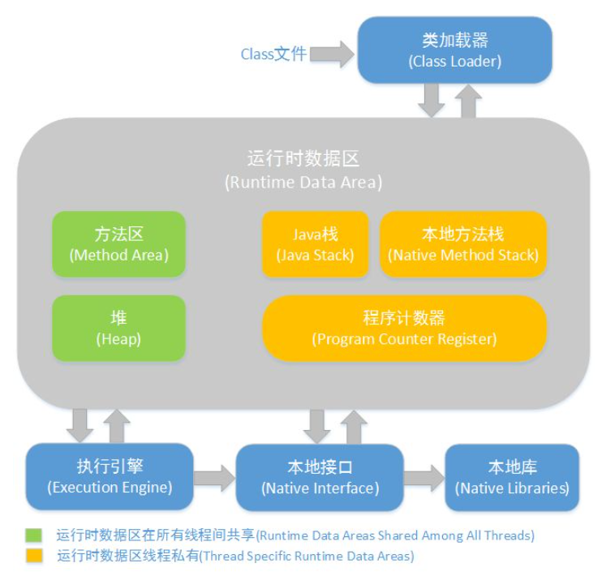
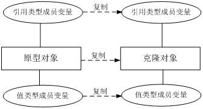

# Java基础语法

## Java介绍

### 1.Java语言采用何种编码方案？有何特点？

Java语言采用Unicode编码标准，Unicode(标准码)它为每个字符制定了一个唯一的数值。

### 2.什么是字节码？采用字节码的最大好处是什么？

**字节码:**

Java源代码经过编译器编译之后产生的文件(扩展名为.class的文件)，它不面向任何特定的处理器，只面向虚拟机。之后字节码文件在解释成机器码执行，解释是通过Java虚拟机来执行的。

**采用字节码的好处**

Java源程序经过编译器编译后产生字节码，字节码由虚拟机解释执行，虚拟机将每一条要执行的字节码发送给解释器，解释器将其翻译成特定机器上的机器码，然后在特定的机器上运行。可见，字节码并不是针对单一特定的机器。因此，Java程序无需重新编译便可在多种不同的机器上运行。一次编译多次运行。

### 3.什么是跨平台性？原理是什么

所谓跨平台性，是指java语言编写的程序，一次编译后，可以在多个系统平台上运行。

实现原理：Java程序是通过java虚拟机在系统平台上运行的，只要该系统可以安装相应的java虚拟机，该系统就可以运行java程序。

> Java源代码经过编译器编译之后产生.class的字节码文件，之后虚拟机将每一条要执行的字节码文件发送给解释器，解释器将其翻译成特定机器上的机器码，在特定的机器上运行。一次编译，多次运行。Java程序是通过JVM虚拟机在系统平台上运行的。

### 4.JDK和JRE有什么区别？

- **JDK：Java Development Kit 的简称，Java 开发工具包**，提供了 Java 的开发环境和运行环境。
- **JRE：Java Runtime Environment 的简称，Java 运行环境**，为 Java 的运行提供了所需环境。

具体来说 JDK 其实包含了 JRE，同时还包含了编译 Java 源码的编译器 Javac，还包含了很多 Java 程序调试和分析的工具。简单来说：如果你需要运行 Java 程序，只需安装 JRE 就可以了，如果你需要编写 Java 程序，需要安装 JDK。


### 5.JDK 中常用的包有哪些

- java.lang：这个是系统的**基础类**；
- **java.io：**这里面是所有输入输出有关的类，比如文件操作等；
- **java.nio：**为了完善 io 包中的功能，提高 io 包中性能而写的一个新包；
- **java.net：**这里面是与网络有关的类；
- **java.util：**这个是系统辅助类，特别是集合类；
- **java.sql：**这个是数据库操作的类。


## 基本数据类型

Java中的基本数据类型有8种。

| 整数类型 | 大小  |
| -------- | ----- |
| byte     | 1字节 |
| short    | 2字节 |
| int      | 4字节 |
| long     | 8字节 |

| 浮点类型 | 大小  |
| -------- | ----- |
| float    | 4字节 |
| double   | 8字节 |

| 字符类型 | 大小  |
| -------- | ----- |
| char     | 2字节 |

| 布尔类型 | 大小          |
| -------- | ------------- |
| boolean  | true或者false |


### 1.Math.round(11.5) 等于多少？Math.round(-11.5)等于多少

Math.round(11.5)的返回值是 12，Math.round(-11.5)的返回值是-11。四舍五入的原理是在参数上加 0.5 然后进行下取整。

- 向上取整指当计算的结果不为整数时取大于计算结果的整数,
- 向下取整指当计算的结果不为整数时取小于计算结果的整数.
- 当计算结果为整数时直接取整数

### 2.switch是否能作用到byte、long、String上？

在Java5之前，switch(expr)中，expr只能是byte、short、int、char。

从Java5之后，Java中开始引入了**枚举**类型，expr也可以是enum类型，从Java7开始，expr还可以是**字符串(**String),但是长整型(long)在目前的版本都是不支持的。

### 3.float f=3.4;是否正确？

不正确。3.4是双精度数，将双精度类型(double)赋值给浮点型(float)属于向下转型(donw-casting)会造成精度损失，因此需要强制类型转换float f = (float)3.4或者写成float f = 3.4F.

### 4.short s1 = 1; s1 = s1 + 1;有错吗?short s1 = 1; s1 += 1;有错吗

对于 short s1 = 1; s1 = s1 + 1;由于 1 是 int 类型，因此 s1+1 运算结果也是 int型，需要强制转换类型才能赋值给 short 型。

而 short s1 = 1; s1 += 1;可以正确编译，因为 s1+= 1;相当于 s1 = (short(s1 + 1);其中有隐含的强制类型转换。

### 5.用最有效率的方法计算 2 乘以 8

2 << 3（左移 3 位相当于乘以 2 的 3 次方，右移 3 位相当于除以 2 的 3 次方）。


## 访问修饰符

- **private** : 在同一类内可见。使用对象：变量、方法。 **注意：不能修饰类（外部类）**

- **default** (即默认，什么也不写）: 在同一包内可见，不使用任何修饰符。使用对象：类、接口、变量、方法。
- **protected** : 对同一包内的类和所有子类可见。使用对象：变量、方法。 **注意：不能修饰类（外部类）**。
- **public** : 对所有类可见。使用对象：类、接口、变量、方法

| 修饰符      | 当前类 | 同一包内 | 子孙类(同一包) | 子孙类(不同包)                                               | 其他包 |
| :---------- | :----- | :------- | :------------- | :----------------------------------------------------------- | :----- |
| `public`    | Y      | Y        | Y              | Y                                                            | Y      |
| `protected` | Y      | Y        | Y              | Y/N（[说明](https://www.runoob.com/java/java-modifier-types.html#protected-desc)） | N      |
| `default`   | Y      | Y        | Y              | N                                                            | N      |
| `private`   | Y      | N        | N              | N                                                            | N      |

接口里的变量都隐式声明为 **public static final**,而接口里的方法默认情况下访问权限为 **public**。

> protected 需要从以下两个点来分析说明：
>
> - **子类与基类在同一包中**：被声明为 protected 的变量、方法和构造器能被同一个包中的任何其他类访问；
> - **子类与基类不在同一包中**：那么在子类中，子类实例可以访问其从基类继承而来的 protected 方法，而不能访问基类实例的protected方法。

## 运算符

### 1.&和&&的区别是什么？

&运算符有两种用法：(1)按位与；(2)逻辑与

&&运算符是**短路与运算**。逻辑与与短路与的差别是非常巨大的，虽然两者都是要求运算符左右两端的布尔值都是true，整个表达式的值才是true。&&之所以被称为短路运算，即如果&&左边的表达式的值是false，右边的表达式会直接被短路掉，不会进行运算。

| 和 || 同理也是这样的操作。

### 2. ==和equals的区别是什么？

**==** : 它的作用是判断两个对象的地址是不是相等。即，判断两个对象是不是同一个对象。(**基本数据类型 == 比较的是值**，**引用数据类型 == 比较的是内存地址**)

**equals()** : 它的作用也是判断两个对象是否相等。但它一般有两种使用情况：

情况1：类没有覆盖 equals() 方法。则通过 equals() 比较该类的两个对象时，**等价于通过“==”比较这两个对象**。

情况2：类覆盖了 equals() 方法。一般，我们都覆盖 equals() 方法来两个对象的内容相等；若它们的内容相等，则返回 true (即，认为这两个对象相等)。

**注意：**string类中对equals()方法重写了。

### 3.hashCode 与 equals

**hashcode()介绍**

hashCode() 的作用是获取哈希码，也称为散列码；它实际上是返回一个int整数。这个**哈希码的作用是确定该对象在哈希表中的索引位置。**hashCode() 定义在JDK的Object.java中，这就意味着Java中的任何类都包含有hashCode()函数。

散列表存储的是键值对(key-value)，它的特点是：**能根据“键”快速的检索出对应的“值”。**这其中就利用到了散列码！（可以快速找到所需要的对象）

**为什么重写equals之后也要重写hashcode？**


**HashSet如何检查重复？**

当你把对象加入 HashSet 时，HashSet 会先计算对象的 **hashcode** 值来判断对象加入的位置，同时也会与其他已经加入的对象的 **hashcode** 值作比较，如果没有相符的**hashcode**，HashSet会假设对象没有重复出现。但是如果发现有相同 hashcode 值的对象，这时会调用 **equals()**方法来检查 hashcode 相等的对象是否真的相同。如果两者相同，HashSet 就不会让其加入操作成功。如果不同的话，就会重新散列到其他位置。这样我们就大大减少了 **equals 的次数**，相应就大大提高了执行速度。

**我们知道判断的时候先根据hashcode进行的判断，相同的情况下再根据equals()方法进行判断。如果只重写了equals方法，而不重写hashcode的方法，会造成hashcode的值不同，而equals()方法判断出来的结果为true。**


**因为hashCode()与equals()的相关规定**

如果两个对象相等，则hashcode一定也是相同的

两个对象相等，对两个对象分别调用equals方法都返回true

两个对象有相同的hashcode值，它们也不一定是相等的

**因此，equals 方法被覆盖过，则 hashCode 方法也必须被覆盖**

hashCode() 的默认行为是对堆上的对象产生独特值。**如果没有重写 hashCode()，则该 class 的两个对象无论如何都不会相等（即使这两个对象指向相同的数据）**


## 关键字

### 1.Java有没有goto？

goto是Java中的保留字，但在目前版本的Java中并没有使用。

### 2.this关键字的用法是什么？

**this是自身的一个对象，代表对象自身，可以理解为：指向对象本身的一个指针。**

this的用法在Java中大体可以分为3种：

- 普通的直接引用，this相当于是指向当前对象本身。
- 形参与成员名字重名，用this来区分：

```java
public Person(String name, int age) {
    this.name = name;
    this.age = age;
}

```

- 引用本类的构造函数

```java
class Person{
    private String name;
    private int age;
    
    public Person() {
    }
 
    public Person(String name) {
        this.name = name;
    }
    public Person(String name, int age) {
        this(name);
        this.age = age;
    }
}

```

### 3.super关键字的用法？

**super关键字可以理解为指向本身的超(父)类对象的一个指针，而这个超类指的是离自己最近的一个父类。**

super也有三种用法：

- 普通的直接引用

与this类似，super相当于是指向当前对象的父类的引用，这样就可以用super.xxx来引用父类的成员。

- 子类中的成员变量或方法与父类中的成员变量或方法同名时，用super进行区分

```java
class Person{
    protected String name;
 
    public Person(String name) {
        this.name = name;
    }
 
}
 
class Student extends Person{
    private String name;
 
    public Student(String name, String name1) {
        super(name);
        this.name = name1;
    }
 
    public void getInfo(){
        System.out.println(this.name);      //Child
        System.out.println(super.name);     //Father
    }
 
}

public class Test {
    public static void main(String[] args) {
       Student s1 = new Student("Father","Child");
       s1.getInfo();
 
    }
}

```

- 引用父类构造函数
  - super（参数）：调用父类中的某一个构造函数（应该为构造函数中的第一条语句）。
  - this（参数）：调用本类中另一种形式的构造函数（应该为构造函数中的第一条语句）。

### 3.this和super的区别是什么

- super:　它引用当前对象的直接父类中的成员（用来访问直接父类中被隐藏的父类中成员数据或函数，基类与派生类中有相同成员定义时如：super.变量名 super.成员函数据名（实参）
- this：它代表当前对象名（在程序中易产生二义性之处，应使用this来指明当前对象；如果函数的形参与类中的成员数据同名，这时需用this来指明成员变量名）
- super()和this()类似,区别是，super()在子类中调用父类的构造方法，this()在本类内调用本类的其它构造方法。
- super()和this()均需放在构造方法内第一行。
- 尽管可以用this调用一个构造器，但却不能调用两个。
- this和super不能同时出现在一个构造函数里面，因为this必然会调用其它的构造函数，其它的构造函数必然也会有super语句的存在，所以在同一个构造函数里面有相同的语句，就失去了语句的意义，编译器也不会通过。
- **this()和super()都指的是对象**，所以，均不可以在static环境中使用。包括：static变量,static方法，static语句块。
- 从本质上讲，**this是一个指向本对象的指针**, 然而**super是一个Java关键字**。

### 4.Java中final关键字的作用？

final的意思是最终，不可变的。是一个修饰符，可用来修饰类、类的成员以及局部变量；

- **final修饰的类，该类不能被继承**
  - 被final修饰的类，final类中的成员变量可以根据自己的实际需要设计为final；
  - 被final修饰的类，final类中的成员方法都会被隐式的指定为final方法；
  - 在JDK中，被设计为final类的有String、System。
- **被final修饰的方法不能被重写**
  - 注：类的private方法会隐式地被指定为final方法。
- **final修饰的变量叫常量，常量必须初始化，初始化之后就不能被修改。**

### 5.final finally finalize区别是什么？

- **final可以修饰类、变量、方法**，**修饰类**表示该类**不能被继承**、**修饰方法**表示该方法**不能被重写**、**修饰变量**表
  示该变量是**一个常量不能被重新赋值**。
- **finally一般作用在try-catch代码块中**，在处理异常的时候，通常**我们将一定要执行的代码方法finally代码块**
  **中，表示不管是否出现异常，该代码块都会执行，一般用来存放一些关闭资源的代码**。
- **finalize是一个方法，属于Object类的一个方法**，而Object类是所有类的父类，该**方法一般由垃圾回收器来调用，当我们调用System.gc() 方法的时候，由垃圾回收器调用finalize()，回收垃圾**，一个对象是否可回收的
  最后判断。

### 6.Java中static关键字的作用？

> **被static关键字修饰的变量或者方法是独立于该类的任何对象，即这些变量和方法不属于任何一个实例对象，而是被类的实例对象所共享**

**static注意事项**

> 静态只能访问静态;
>
> 非静态既可以访问静态，也可以访问非静态的。


- **static修饰类**

```java
public class StaticTest {
    // static关键字修饰内部类
    public static class InnerClass{
        InnerClass(){
            System.out.println("=======静态内部类=======");
        }
        public void InnerMethod(){
            System.out.println("========静态内部方法========");
        }
    }

    public static void main(String[] agrs){
        // 直接通过statictest类名来访问静态内部类
        InnerClass innerClass = new StaticTest.InnerClass();
        // 静态内部类可以和普通类一样使用
        innerClass.InnerMethod();
    }
}
```

结果 ：

```java
=======静态内部类=======
========静态内部方法========
```

如果没有用static修饰InterClass，则只能new 一个外部类实例。再通过外部实例创建内部类。

- **static修饰变量**

static变量也称作静态变量，静态变量和非静态变量的区别是：**静态变量被所有的对象所共享，在内存中只有一个副本，它当且仅当在类初次加载时会被初始化**。而非静态变量是对象所拥有的，在创建对象的时候被初始化，存在多个副本，各个对象拥有的副本互不影响。

```java
public class StaticTest {

    // static修饰变量
    private static String name = "hello java";


    public static void main(String[] agrs){
        System.out.println(StaticTest.name);
    }
}

```

- **static修饰方法**

static方法一般称作静态方法，由于静态方法不依赖于任何对象就可以进行访问，因此对于静态方法来说，是没有this的，因为它不依附于任何对象，既然都没有对象，就谈不上this了。并且由于这个特性，在静态方法中不能访问类的非静态成员变量和非静态成员方法，因为非静态成员方法/变量都是必须依赖具体的对象才能够被调用。

但是要注意的是，虽然在**静态方法中不能访问非静态成员方法和非静态成员变量，但是在非静态成员方法中是可以访问静态成员方法/变量的。**


- static关键字修饰代码块

  静态代码块在类一次被载入时被执行。类初始化顺序为

```java
public class Test extends Base{
 
    static{
        System.out.println("test static");
    }
     
    public Test(){
        System.out.println("test constructor");
    }
     
    public static void main(String[] args) {
        new Test();
    }
}
 
class Base{
     
    static{
        System.out.println("base static");
    }
     
    public Base(){
        System.out.println("base constructor");
    }
}
```

结果为：

```java
base static
test static
base constructor
test constructor
```

在执行开始，先要寻找到main方法，因为main方法是程序的入口，但是在执行main方法之前，必须**先加载Test类**，而在加载Test类的时候发现Test类继承**自Base类**，因此会转去先加载Base类，在加载Base类的时候，发现有**static块**，便执行了static块。在Base类加载完成之后，便继续加载**Test类**，然后发现Test类中也有**static块**，便执行static块。在加载完所需的类之后，便开始执行**main方法**。在main方法中执行new Test()的时候会先**调用父类的构造器**，然后再调**用自身的构造器**。因此，便出现了上面的输出结果。

```java
public class Test {
    Person person = new Person("Test");
    static{
        System.out.println("test static");
    }
     
    public Test() {
        System.out.println("test constructor");
    }
     
    public static void main(String[] args) {
        new MyClass();
    }
}
 
class Person{
    static{
        System.out.println("person static");
    }
    public Person(String str) {
        System.out.println("person "+str);
    }
}
 
 
class MyClass extends Test {
    Person person = new Person("MyClass");
    static{
        System.out.println("myclass static");
    }
     
    public MyClass() {
        System.out.println("myclass constructor");
    }
}
```

结果为：

```java
test static
myclass static
person static
person Test
test constructor
person MyClass
myclass constructor
```

首先加载Test类，因此会执行Test类中的static块。接着执行new MyClass()，而MyClass类还没有被加载，因此需要加载MyClass类。在加载MyClass类的时候，发现MyClass类继承自Test类，但是由于Test类已经被加载了，所以只需要加载MyClass类，那么就会执行MyClass类的中的static块。在加载完之后，就通过构造器来生成对象。而在生成对象的时候，必须先初始化父类的成员变量，因此会执行Test中的Person person = new Person()，而Person类还没有被加载过，因此会先加载Person类并执行Person类中的static块，接着执行父类的构造器，完成了父类的初始化，然后就来初始化自身了，因此会接着执行MyClass中的Person person = new Person()，最后执行MyClass的构造器。

```java
public class Test {
     
    static{
        System.out.println("test static 1");
    }
    public static void main(String[] args) {
         
    }
     
    static{
        System.out.println("test static 2");
    }
}
```

结果为：

```java
test static 1
test static 2
```

　　虽然在main方法中没有任何语句，但是还是会输出，原因上面已经讲述过了。另外，static块可以出现类中的任何地方（只要不是方法内部，记住，任何方法内部都不行），并且执行是按照static块的顺序执行的。


> 总结：
>
> - static强调**唯一性**，它的使用**无需建立对象，一个类中所有static修饰的变量或方法是唯一的**
> - final强调**不变性**，但是**必须建立对象才能调用，对象不同，final修饰的量也不同**。
> - static final：结合上述两者特性，**使用无需实例化，声明必须初始化**。


### 5.Java的abstract关键字的作用？

- **抽象类：**

  **抽象类不能用来实例化对象，声明抽象类的唯一目的是为了将来对该类进行扩充。**

  一个类不能**同时被 abstract 和 final 修饰**。如果一个类包含抽象方法，那么该类一定要声明为抽象类，否则将出现编译错误。

- **抽象方法：**

  抽象方法是一种没有任何实现的方法，该方法的的具体实现由子类提供。

  抽象方法不能被声明成 **final 和 static**。

  任何继承抽象类的子类必须实现父类的所有抽象方法，除非该子类也是抽象类。

  **如果一个类包含若干个抽象方法，那么该类必须声明为抽象类。抽象类可以不包含抽象方法。**


## 常用API

### Java中String类

#### 1.什么是字符串常量池？

**字符串常量池位于java虚拟机中，专门用来存储字符串常量**，可以提高内存的使用率，**避免开辟多块空间存储相同的字符串**，在创建字符串时 JVM 会首先检查字符串常量池，如果该字符串已经存在池中，则返回它的引用，如果不存在，则实例化一个字符串放到池中，并返回其引用。

#### 2.String 是最基本的数据类型吗

不是。Java 中的基本数据类型只有 8 个 ：**byte、short、int、long、float、double、char、boolean**；除了基本类型（primitive type），剩下的都是引用类型（referencetype），Java 5 以后引入的枚举类型也算是一种比较特殊的引用类型。

这是很基础的东西，但是很多初学者却容易忽视，Java 的 8 种基本数据类型中不包括 String，基本数据类型中用来描述文本数据的是 char，但是它只能表示单个字符，比如 ‘a’,‘好’ 之类的，如果要描述一段文本，就需要用多个 char 类型的变量，也就是一个 char 类型数组，比如“你好” 就是长度为2的数组 char[] chars = {‘你’,‘好’};

但是使用数组过于麻烦，所以就有了 String，**String 底层就是一个 char 类型的数组**，只是使用的时候开发者不需要直接操作底层数组，用更加简便的方式即可完成对字符串的使用

#### 3.String有哪些特性

- **不变性**：**String 是只读字符串**，是一个典型的 immutable 对象，对它进行任何操作，其实都是**创建一个新的对象**，再把**引用指向该对象**。不变模式的主要作用在于当一个对象需要被多线程共享并频繁访问时，可以保证数据的一致性。
- **常量池优化**：String 对象创建之后，会在字符串常量池中进行缓存，如果下次创建同样的对象时，会直接返回缓存的引用。
- **final**：使用 **final 来定义 String 类**，表示 **String 类不能被继承，提高了系统的安全性**。

#### 4.String为什么是不可变的吗？

简单来说就是String类利用了final修饰的char类型数组存储字符，源码如下图所以：

```java
/** The value is used for character storage. */
private final char value[];
```

**1) String不可变但不代表引用不可以变**

```java
String str = "Hello";
str = str + " World";
System.out.println("str=" + str);
```

结果：

```java
str=Hello World
```

解析：

实际上，原来String的内容是不变的，只是str由原来指向"Hello"的内存地址转为指向"Hello World"的内存地址而已，也就是说多开辟了一块内存区域给"Hello World"字符串。

**2) 通过反射是可以修改所谓的“不可变”对象**

```java
// 创建字符串"Hello World"， 并赋给引用s
String s = "Hello World";

System.out.println("s = " + s); // Hello World

// 获取String类中的value字段
Field valueFieldOfString = String.class.getDeclaredField("value");

// 改变value属性的访问权限
valueFieldOfString.setAccessible(true);

// 获取s对象上的value属性的值
char[] value = (char[]) valueFieldOfString.get(s);

// 改变value所引用的数组中的第5个字符
value[5] = '_';

System.out.println("s = " + s); // Hello_World
```

结果：

```java
s = Hello World
s = Hello_World
```

用**反射可以访问私有成员**， 然后反射出String对象中的value属性， 进而改变通过获得的value引用改变数组的结构。但是一般我们不会这么做，这里只是简单提一下有这个东西。

#### 5.是否可以继承 String 类

**String 类是 final 类，不可以被继承。**

#### 6.String str="i"与 String str=new String(“i”)一样吗？

不一样，因为内存的分配方式不一样。String str="i"的方式，java 虚拟机会将其分配到常量池中；而 String str=new String(“i”) 则会被分到堆内存中。

#### 7.String s = new String(“xyz”);创建了几个字符串对象

两个对象，一个是字符串常量池的"xyz"，一个是用new创建在堆上的对象。

```java
String str1 = "hello"; //str1指向静态区
String str2 = new String("hello");  //str2指向堆上的对象
String str3 = "hello";
String str4 = new String("hello");
System.out.println(str1.equals(str2)); //true
System.out.println(str2.equals(str4)); //true
System.out.println(str1 == str3); //true
System.out.println(str1 == str2); //false
System.out.println(str2 == str4); //false
System.out.println(str2 == "hello"); //false
str2 = str1;
System.out.println(str2 == "hello"); //true
```

#### 8.数组有没有 length()方法？String 有没有 length()方法

**数组没有 length()方法 ，有 length 的属性**。**String 有 length()方法**。JavaScript中，获得字符串的长度是通过 length 属性得到的，这一点容易和 Java 混淆。

#### 9.String 类的常用方法都有那些？

- indexOf()：返回指定字符的索引。
- **charAt()：返回指定索引处的字符。**
- replace()：字符串替换。
- **trim()：去除字符串两端空白。**
- **split()：分割字符串，返回一个分割后的字符串数组。**
- getBytes()：返回字符串的 byte 类型数组。
- **length()：返回字符串长度。**
- toLowerCase()：将字符串转成小写字母。
- toUpperCase()：将字符串转成大写字符。
- **substring()：截取字符串。**
- **equals()：字符串比较。**

#### 10.在使用 HashMap 的时候，用 String 做 key 有什么好处？

**HashMap 内部实现是通过 key 的 hashcode 来确定 value 的存储位置**，因为字符串是不可变的，所以**当创建字符串时，它的 hashcode 被缓存下来，不需要再次计算，所以相比于其他对象更快。**

#### 11.String和StringBuffer、StringBuilder的区别是什么？String为什么是不可变的

在 Java 中字符串属于**对象**，Java 提供了 **String 类来创建和操作字符串**。但String的值是不可变的，这就导致每次对String的操作都会生成**新的String对象**，这样不仅效率低下，而且大量浪费有限的内存空间。

因此引进了两个新的类-StringBuffer类和StringBuilder类来对这种变化的字符串进行处理。

与String类不同的是，**StringBuffer和StringBuilder类的对象能够被多次的修改，并且不产生新的未使用的对象。**

StringBuilder 类在 Java 5 中被提出，它和 StringBuffer 之间的最大不同在于 **StringBuilder 的方法不是线程安全的**（不能同步访问）。


- **String：不可变的字符串序列**
- **StringBuilder**：**可变**的字符串序列、线程安全效率低
- **StringBuffer**：**可变**的字符串序列、线程不安全效率高

**可变性**

String类中使用字符数组保存字符串，private　final　char　value[]，所以string对象是不可变的。StringBuilder与StringBuffer都继承自AbstractStringBuilder类，在AbstractStringBuilder中也是使用字符数组保存字符串，char[] value，这两种对象都是可变的。

**线程安全性**

String中的对象是不可变的，也就可以理解为常量，线程安全。AbstractStringBuilder是StringBuilder与StringBuffer的公共父类，定义了一些字符串的基本操作，如expandCapacity、append、insert、indexOf等公共方法。StringBuffer对方法加了同步锁或者对调用的方法加了同步锁，所以是线程安全的。StringBuilder并没有对方法进行加同步锁，所以是非线程安全的。

**性能**

每次对String 类型进行改变的时候，都会生成一个新的String对象，然后将指针指向新的String 对象。StringBuffer每次都会对StringBuffer对象本身进行操作，而不是生成新的对象并改变对象引用。相同情况下使用StirngBuilder 相比使用StringBuffer 仅能获得10%~15% 左右的性能提升，但却要冒多线程不安全的风险。

**对于三者使用的总结**

如果要操作少量的数据用 = String

单线程操作字符串缓冲区 下操作大量数据 = StringBuilder

多线程操作字符串缓冲区 下操作大量数据 = StringBuffer

#### 12.String类中对equals重写

- String类对equals的重写如下：

  ```java
  public boolean equals(Object anObject) {
      if (this == anObject) {
          return true;
      }
      if (anObject instanceof String) {
          String anotherString = (String)anObject;
          int n = value.length;
          if (n == anotherString.value.length) {
              char v1[] = value;
              char v2[] = anotherString.value;
              int i = 0;
              while (n-- != 0) {
                  if (v1[i] != v2[i])
                      return false;
                  i++;
              }
              return true;
          }
      }
      return false;
  }
  
  ```

此外**StringBuffer和StringBuilder并没有重写equals方法，其比较的还是引用类型的地址。**

#### 10.如何将字符串反转？

使用 StringBuilder 或者 stringBuffer 的 reverse() 方法。

```java
public class StaticTest {
    public static void main(String[] args){
        StringBuffer stringBuffer = new StringBuffer();
        stringBuffer.append("abcdef");
        System.out.println(stringBuffer.reverse());

        StringBuilder stringBuilder = new StringBuilder();
        stringBuilder.append("fedcba");
        System.out.println(stringBuilder.reverse());
    }
}
```

#### 13 Java字符串拼接

补充：字符串的拼接操作

**1: "+" 号操作符**

```java
String s1 = "hello";
String s2 = "world";
System.out.println(s1 + s2);
```

但实际上在编译的时候“+”是被替换成了StringBuilder里面的append方法。即

```java
System.out.println((new StringBuilder(String.valueOf(s1))).append(s2).toString());
```

**2: StringBuilder**

StringBuilder中的append方法就是常用的字符串拼接方法。

SpringBuilder类中的append方法源码如下：

```java
public StringBuilder append(String str) {
 super.append(str);
 return this;
}
```

这 3 行代码没啥可看的，可看的是父类 AbstractStringBuilder 的 append 方法：

```java
public AbstractStringBuilder append(String str) {
 if (str == null)
     return appendNull();
 int len = str.length();
 ensureCapacityInternal(count + len);
 str.getChars(0, len, value, count);
 count += len;
 return this;
}
```

1）判断拼接的字符串是不是 null，如果是，当做字符串“null”来处理。`appendNull` 方法的源码如下：

```java
private AbstractStringBuilder appendNull() {
 int c = count;
 ensureCapacityInternal(c + 4);
 final char[] value = this.value;
 value[c++] = 'n';
 value[c++] = 'u';
 value[c++] = 'l';
 value[c++] = 'l';
 count = c;
 return this;
}
```

2）拼接后的字符数组长度是否超过当前值，如果超过，进行扩容并复制。`ensureCapacityInternal` 方法的源码如下：

```java
private void ensureCapacityInternal(int minimumCapacity) {
 // overflow-conscious code
 if (minimumCapacity - value.length > 0) {
     value = Arrays.copyOf(value,
             newCapacity(minimumCapacity));
 }
}

```

3）将拼接的字符串 str 复制到目标数组 value 中。

```java
str.getChars(0, len, value, count);
```

**3.StringBuffer**

StringBuffer相比较StringBuilder区别在于线程安全。

```java
public synchronized StringBuffer append(String str) {
 toStringCache = null;
 super.append(str);
 return this;
}

```

StringBuffer 类的 append 方法比 StringBuilder 多了一个关键字 **synchronized**。


###  Java中包装类

> Java中的包装类
>
> 在实际开发过程中，我们经常会遇到需要使用对象，而不是内置数据类型的情形。为了解决这个问题，Java 语言为每一个内置数据类型提供了对应的包装类。所有的包装类**（Integer、Long、Byte、Double、Float、Short）**都是抽象类 Number 的子类。

| 包装类    | 基本数据类型 |
| :-------- | :----------- |
| Boolean   | boolean      |
| Byte      | byte         |
| Short     | short        |
| Integer   | int          |
| Long      | long         |
| Character | char         |
| Float     | float        |
| Double    | double       |


#### 1.自动装箱与拆箱

**装箱**：将基本类型用它们对应的引用类型包装起来；

**拆箱**：将包装类型转换为基本数据类型；

#### 2.int 和 Integer 有什么区别

Java 是一个近乎纯洁的面向对象编程语言，但是为了编程的方便还是引入了基本数据类型，但是为了能够**将这些基本数据类型当成对象操作**，Java 为每一个基本数据类型都引入了对应的包装类型（wrapper class），int 的包装类就是 Integer，从 Java 5 开始引入了自动装箱/拆箱机制，使得二者可以相互转换。

Java 为每个原始类型提供了包装类型：

原始类型: boolean，char，byte，short，int，long，float，double

包装类型：Boolean，Character，Byte，Short，Integer，Long，Float，Double

#### 3.Integer a= 127 与 Integer b = 127相等吗

对于对象引用类型：==比较的是对象的内存地址。
对于基本数据类型：==比较的是值。

**如果整型字面量的值在-128到127之间，那么自动装箱时不会new新的Integer对象，而是直接引用常量池中的Integer对象，超过范围 a1==b1的结果是false**

```java
public static void main(String[] args) {
    Integer a = new Integer(3);
    Integer b = 3;  // 将3自动装箱成Integer类型
    int c = 3;
    System.out.println(a == b); // false 两个引用没有引用同一对象
    System.out.println(a == c); // true a自动拆箱成int类型再和c比较
    System.out.println(b == c); // true

    Integer a1 = 128;
    Integer b1 = 128;
    System.out.println(a1 == b1); // false

    Integer a2 = 127;
    Integer b2 = 127;
    System.out.println(a2 == b2); // true
}

```


### File文件类

#### 1.Files的常用方法都有哪些？

- Files.exists():检测文件路径是否存在
- Files.createFile():创建文件
- Files.createDirectory():创建文件夹
- Files.delete():删除一个文件或目录
- Files.copy():复制文件
- Files.move():移动文件
- Files.size():查看文件大小
- Files.read():读取文件
- Files.write():写入文件


# Java面向对象

## 面向对象概述

### 1.面向对象和面向过程的区别是什么？

**面向过程是具体的，流程化的**，解决一个问题，你需要一步一步的分析，一步一步的实现

**面向对象是模型化的**，我们需抽象出一个类，这是一个封闭的盒子，在这里你拥有数据也拥有解决问题的方法。需要什么功能直接使用就可以。

其实面向对象的底层还是面向过程，但**把面向过程抽象成类，进行了封装**，方便我们使用的就是面向对象了。

### 2.面向对象的特征主要有以下几个方面？

**抽象： **  **抽象是将一类对象的共同特征总结出来构造类的过程**，包括数据抽象和行为抽象两方面。**抽象只关注对象有哪些属性和行为，并不关注这些行为的细节是什么。**

**封装： ** **封装把一个对象的属性私有化，同时提供一些可以被外界访问属性的方法。**如果属性不想被外界访问，那么就不必提供方法给外界访问。

**继承：**  **继承是使用已存在的类的定义作为基础建立新类的技术，新类的定义可以增加数据或新的功能**，也可以用父类的功能，但不能选择性的继承父类。

**多态：** **多态是指程序中定义的引用变量所指向的具体类型和通过该引用变量发出的方法调用在编程时不确定，而是在程序运行期间才确定**，换句话而言，一个引用变量到底会指向哪个类的实例对象，该引用变量发出的方法调用到底是哪个类中实现的方法，必须在由程序运行期间才能决定的。

> 抽象：将一类对象所公有的特征提取出来构造类的过程，包括数据抽象和行为抽象，只关注对象有哪些属性和行为，不关注具体实现细节；
>
> 封装：通常是把数据和操作数据的方法绑定起来，对数据的访问只能通过已有的接口；
>
> 继承：从已有类继承信息创建新类的过程，提供继承信息的类被称为父类，得到继承信息为子类；
>
> 多态：允许不同子类型的对象对同一消息作出不同的响应。多态分为运行时多态和编译时多态。编译时多态是方法的重载，即方法名中的参数类型或参数个数不同；运行时多态是方法重写，即子类继承父类并重写父类中已有的或抽象的方法，用父类型引用子类型的对象，这个引用调用同样的方法会根据子类对象的不同而表现出不同的行为。


其中Java 面向对象编程三大特性：**封装 继承 多态**

### 3.什么是多态机制？Java语言如何实现多态的？

多态是指程序中定义的引用变量所指向的具体类型和通过该引用变量发出的方法调用在编程时并不确定吗，而是在程序运行期间才能确定。即一个引用变量到底会指向哪个类的实例对象，该引用引用发出的方法调用到底是哪个类中实现的方法，必须在由程序运行期间才能决定。

多态的好处：因为在程序运行期间才能确定具体的类，这样不用修改源代码程序，就可以让引用变量绑定到各种不同的类实现上，从而导致该引用调用的具体方法随之改变，即不修改程序代码就可以改变程序运行时所绑定的具体代码，让程序可以选择多个运行状态，这就是多态性。

多态分为**编译时多态**和**运行时多态**。其中编译时多态是静态的，主要是指**方法的重载**，它是**根据参数列表的不同来区分不同的函数**，通过编译之后会变成两个不同的函数，谈不上多态。而运行时多态是动态的，它是通过动态绑定来实现的，也就是我们所说的多态性。


**多态的实现**

Java实现多态有三个必要条件：**继承**、**重写**、**向上转型**。

**继承：**在多态中必须存在有继承关系的子类和父类。

**重写：**子类对父类中某些方法进行重新定义，在调用这些方法时就会调用子类的方法。

**向上转型：**在多态中需要将子类的引用赋给父类对象，只有这样该引用才能够具备既能调用父类的方法和子类的方法。

只有满足了上述三个条件，我们才能够在同一个继承结构中使用统一的逻辑实现代码处理不同的对象，从而达到执行不同的行为。

对于Java而言，它多态的实现机制遵循一个原则：当超类对象引用变量引用子类对象时，被引用对象的类型而不是引用变量的类型决定了调用谁的成员方法，但是这个被调用的方法必须是在超类中定义过的，也就是说被子类覆盖的方法。

### 4.重写与重载的区别？

#### 构造器（constructor）是否可被重写（override）

构造器不能被继承，因此不能被重写，但可以被重载。

#### 重载（Overload）和重写（Override）的区别。重载的方法能否根据返回类型进行区分？

方法的重载和重写都是实现多态的方式，区别在于前者实现的是编译时的多态性，而后者实现的是运行时的多态性。

重载：发生在同一个类中，方法名相同参数列表不同（参数类型不同、个数不同、顺序不同），与方法返回值和访问修饰符无关，即重载的方法不能根据返回类型进行区分

重写：发生在父子类中，方法名、参数列表必须相同，返回值小于等于父类，抛出的异常小于等于父类，访问修饰符大于等于父类（里氏代换原则）；如果父类方法访问修饰符为private则子类中就不是重写。

不能，因为重载方法根据返回类型来区分的话，编译器不知道调用哪个方法了。

## Java枚举

Java 枚举是一个特殊的类，一般表示一组常量，比如一年的 4 个季节，一个年的 12 个月份，一个星期的 7 天，方向有东南西北等。

Java 枚举类使用 enum 关键字来定义，各个常量使用逗号 **,** 来分割。

例如定义一个颜色的枚举类。

**实例**

```java
enum Color
{
    RED, GREEN, BLUE;
}
 
public class Test
{
    // 执行输出结果
    public static void main(String[] args)
    {
        Color c1 = Color.RED;
        System.out.println(c1);
    }
}
```


## 类与接口

### 1.创建一个对象用什么关键字？对象实例与对象引用有何不同？

new关键字，new创建对象实例（**对象实例在堆内存中**），对象引用指向对象实例（**对象引用存放在栈内存中**）。**一个对象引用可以指向0个或1个对象**（一根绳子可以不系气球，也可以系一个气球）;**一个对象可以有n个引用指向它（可以用n条绳子系住一个气球）**

### 2.普通类和抽象类的区别？

- **普通类不能包含抽象方法**；**抽象类可以包含抽象方法**
- **抽象类不能直接实例化；****普通类可以直接实例化。**

### 3.抽象类必须要有抽象方法吗？

**不需要，抽象类不一定非要抽象方法。**

示例代码：

```java
abstract class Cat {

public static void sayHi() {

System. out. println("hi~");

}

}

```

上面代码，抽象类并没有抽象方法但完全可以正常运行。

### 4.抽象类能被final修饰吗？

不能，定位抽象类是为了让其它类继承的，如果定位为final该类就不能被继承，会产生矛盾。

**抽象类是为了将来对该类进行扩充。**


### 5.Java中接口和抽象类？

> Java中一个类只能继承一个抽象类，但是可以实现多个接口

**a.什么是接口**

接口就是比“抽象类"还“抽象”的“抽象类”, 可以更加规范的对子类进行约束。全面地专业地实现了:规范和具体实现的分离。接口是完全面向规范的,规定了-批类具有的公共方法规范。

- 从接口的实现者角度看,接口定义了可以向外部提供的服务。
- 从接口的调用者角度看,接口定义了实现者能提供那些服务

> **接口就是一种契约，协议。**

**b.格式**

```java
[访问修饰符号] interface 接口name [extends 父接口1，父接口2] {
	常量定义：
	方法定义：
}

```

**c.要点**

**1、访问修饰符：只能是public 或者默认
2、extends：接口支持多继承
3、接口中的属性只能是常量，默认就是`public static finnal`
4、接口中的方法默认是`public abstract`**

> JDK1.8中对接口增加了新的特性：
>
> （1）**默认方法（default method）**：JDK 1.8允许给接口添加非抽象的方法实现，但必须使用default关键字修饰；定义了default的方法可以不被实现子类所实现，但只能被实现子类的对象调用；如果子类实现了多个接口，并且这些接口包含一样的默认方法，则子类必须重写默认方法；
>
> （2）**静态方法（static method）**：JDK 1.8中允许使用static关键字修饰一个方法，并提供实现，称为接口静态方法。接口静态方法只能通过接口调用（接口名.静态方法名）。

****

**d.接口和抽象类的区别**

```java
// 抽象类
public abstract class Person{
    public abstract void say();
    public void eat(){};
}
```

```java
// 接口
public interface Person{
    public static final int a=10;
    //JDK1.8
    default void sayHello(){
        System.out.println("Hello World");
    }
    public static void sayJava(){
        System.out.println("Hello Java");
    }
    public void say();
}
```

- 相同点
  - 接口和抽象类都不能被实例化；
  - 抽象类的子类或接口的实现类都实现了抽象类或接口的方法后才能被实例化；
- 不同点

| 接口                                                         | 抽象类                                                       |
| ------------------------------------------------------------ | ------------------------------------------------------------ |
| **接口中没有构造函数**                                       | **抽象类中可以有构造函数**                                   |
| 接口中没有代码的实现(在Java1.8中可以用default或static来实现方法)，即默认方法隐式为`public abstract`，抽象方法 | 抽象类可以由普通成员方法，且方法修饰符可以由`public`、`protected`、`default`，可以包含抽象和非抽象的方法。 |
| 接口中的属性只能是常量，即`public static final`              | 抽象类可以不包含非`final`的变量，默认为`default`             |
| **接口可以多继承extends多个接口**                            | **抽象类只能单继承**                                         |

> 总之，接口强调特定功能的实现；而抽象类则强调所属关系。
>
> 抽象类中可以包含抽象方法和非抽象方法，并不是很严格；
>
> 而接口中只包含抽象方法(在jdk1.8之前，jdk1.8可用default或static来实现非抽象的方法)，严格；


## 变量与方法

### 1.成员变量与局部变量的区别有哪些

**变量：**在程序执行的过程中，在某个范围内其值可以发生改变的量。从本质上讲，变量其实是内存中的一小块区域

**成员变量：**方法外部，类内部定义的变量

**局部变量：**类的方法中的变量。

**作用域**

成员变量：针对整个类有效。
局部变量：只在某个范围内有效。(一般指的就是方法,语句体内)

**存储位置**

成员变量：随着对象的创建而存在，随着对象的消失而消失，存储在堆内存中。
局部变量：在方法被调用，或者语句被执行的时候存在，存储在栈内存中。当方法调用完，或者语句结束后，就自动释放。

**生命周期**

成员变量：随着对象的创建而存在，随着对象的消失而消失
局部变量：当方法调用完，或者语句结束后，就自动释放。

**初始值**

成员变量：有默认初始值。

局部变量：没有默认初始值，使用前必须赋值。

使用原则

在使用变量时需要遵循的原则为：就近原则
首先在局部范围找，有就使用；接着在成员位置找。

### 2.静态变量和实例变量区别

静态变量： **静态变量由于不属于任何实例对象，属于类的，所以在内存中只会有一份**，在类的加载过程中，JVM只为静态变量分配一次内存空间。

实例变量： **每次创建对象，都会为每个对象分配成员变量内存空间，实例变量是属于实例对象的**，在内存中，创建几次对象，就有几份成员变量。

### 3.静态变量与普通变量区别

static变量也称作静态变量，静态变量和非静态变量的区别是：**静态变量被所有的对象所共享，在内存中只有一个副本，它当且仅当在类初次加载时会被初始化**。**而非静态变量是对象所拥有的，在创建对象的时候被初始化，存在多个副本，各个对象拥有的副本互不影响。**

还有一点就是static成员变量的初始化顺序按照定义的顺序进行初始化。

### 4.静态方法和实例方法有何不同？

静态方法和实例方法的区别主要体现在两个方面：

1. 在外部调用静态方法时，可以使用**"类名.方法名**"的方式，也可以使用**"对象名.方法名"**的方式。而实例方法只有后面这种方式。也就是说，**调用静态方法可以无需创建对象。**
2. **静态方法在访问本类的成员时，只允许访问静态成员（即静态成员变量和静态方法）**，而不允许访问实例成员变量和实例方法；实例方法则无此限制

## 内部类

> 在Java中，可以将一个类的定义放在另外一个类的定义内部，这就是**内部类**。内部类本身就是类的一个属性，与其他属性定义方式一致。
>
> 内部类可以分为四种：成员内部类、局部内部类、匿名内部类和静态内部类。

### 1.静态内部类

定义在类内部的静态类，就是静态内部类。

```java
public class Outer {

    private static int radius = 1;

    static class StaticInner {
        public void visit() {
            System.out.println("visit outer static  variable:" + radius);
        }
    }
}

```

静态内部类可以访问外部类所有的静态变量，而不可访问外部类的非静态变量；静态内部类的创建方式，`new 外部类.静态内部类()`，如下：

```java
Outer.StaticInner inner = new Outer.StaticInner();
inner.visit();
```

### 2.成员内部类

定义在类内部，成员位置上的非静态类，就是成员内部类。

```java
public class Outer {

    private static  int radius = 1;
    private int count =2;
    
     class Inner {
        public void visit() {
            System.out.println("visit outer static  variable:" + radius);
            System.out.println("visit outer   variable:" + count);
        }
    }
}

```

成员内部类可以访问外部类所有的变量和方法，包括静态和非静态，私有和公有。成员内部类依赖于外部类的实例，它的创建方式`外部类实例.new 内部类()`，如下：

```java
Outer outer = new Outer();
Outer.Inner inner = outer.new Inner();
inner.visit();
```

### 3.局部内部类

定义在方法中的内部类，就是局部内部类。

```java
public class Outer {

    private  int out_a = 1;
    private static int STATIC_b = 2;

    public void testFunctionClass(){
        int inner_c =3;
        class Inner {
            private void fun(){
                System.out.println(out_a);
                System.out.println(STATIC_b);
                System.out.println(inner_c);
            }
        }
        Inner  inner = new Inner();
        inner.fun();
    }
    public static void testStaticFunctionClass(){
        int d =3;
        class Inner {
            private void fun(){
                // System.out.println(out_a); 编译错误，定义在静态方法中的局部类不可以访问外部类的实例变量
                System.out.println(STATIC_b);
                System.out.println(d);
            }
        }
        Inner  inner = new Inner();
        inner.fun();
    }
}

```

定义在实例方法中的局部类可以访问外部类的所有变量和方法，定义在静态方法中的局部类只能访问外部类的静态变量和方法。局部内部类的创建方式，在对应方法内，`new 内部类()`，如下：

```java
 public static void testStaticFunctionClass(){
    class Inner {
    }
    Inner  inner = new Inner();
 }

```

### 4.匿名内部类

匿名内部类就是没有名字的内部类，日常开发中使用的比较多。

```java
public class Outer {

    private void test(final int i) {
        new Service() {
            public void method() {
                for (int j = 0; j < i; j++) {
                    System.out.println("匿名内部类" );
                }
            }
        }.method();
    }
 }
 //匿名内部类必须继承或实现一个已有的接口 
 interface Service{
    void method();
}

```

除了没有名字，匿名内部类还有以下特点：

- 匿名内部类必须继承一个抽象类或者实现一个接口。
- 匿名内部类不能定义任何静态成员和静态方法。
- 当所在的方法的形参需要被匿名内部类使用时，必须声明为 final。
- 匿名内部类不能是抽象的，它必须要实现继承的类或者实现的接口的所有抽象方法。

匿名内部类创建方式：

```java
new 类/接口{ 
  //匿名内部类实现部分
}
```

### 5.内部类的优点：

为什么要使用内部类呢？因为其有以下优点：

- 一个内部类对象可以访问创建它的外部类对象的内容，包括私有数据。
- 内部类不为同一包的其它类所见，具有很好的封装性；
- 内部类有效实现了“多重继承”, 优化了Java单继承的缺陷
- 匿名内部类可以很方便的定义回调

### 6.局部内部类和匿名内部类访问局部变量的时候，为什么变量必须要加上final？

**局部内部类和匿名内部类访问局部变量的时候，为什么变量必须要加上final**呢？它内部原理是什么呢？

先看这段代码：

```java
public class Outer {

    void outMethod(){
        final int a =10;
        class Inner {
            void innerMethod(){
                System.out.println(a);
            }

        }
    }
}

```

以上例子，为什么要加final呢？是因为**生命周期不一致**， **局部变量直接存储在栈中**，当方法执行结束后，非final的局部变量就被销毁。而局部内部类对局部变量的引用依然存在，如果局部内部类要调用局部变量时，就会出错。加了final，可以确保局部内部类使用的变量与外层的局部变量区分开，解决了这个问题。


# Java高级知识点

## Java泛型

> Java泛型主要是针对：
>
> - 编译时不检查类型的异常
>   - 集合不能保证集合中的类型一致，运行会报异常，所以引入了泛型
> - 使用泛型
>   - 参数化类型，被称为泛型，允许程序在创建集合时指定集合元素的类型

**Java泛型，本质上是参数化类型，也就是将所操作的数据类型被指定一个参数。**

>假定我们有这样一个需求：写一个排序方法，能够对整型数组、字符串数组甚至其他任何类型的数组进行排序，该如何实现？
>
>答案是可以使用 **Java 泛型**。
>
>使用 Java 泛型的概念，我们可以写一个泛型方法来对一个对象数组排序。然后，调用该泛型方法来对整型数组、浮点数数组、字符串数组等进行排序。

## Java序列化

Java 序列化是**为了保存各种对象在内存中的状态，并且可以把保存的对象状态再读出来**。

以下情况需要使用 **Java 序列化**：

- **想把的内存中的对象状态保存到一个文件中或者数据库中时候；**
- **想用套接字在网络上传送对象的时候；**
- 想通过RMI（远程方法调用）传输对象的时候。

Java提供了一种对象序列化的机制。该机制中，一个对象可以被表示为一个字节序列，该字节序列包括该对象的数据、有关对象的类型的信息和存储在对象中的数据的类型。

将序列化对象写入文件之后，可以从文件中读取出来，并且对它进行反序列化，也就是说，对象的类型信息、对象的数据，还有对象中的数据类型可以用来在内存中新建对象。

整个过程都是Java虚拟机独立的，也就是说，在一个平台序列化的对象可以在另外一个完全不同的平台上反序列化该对象。

假设我们定义了如下的Employee类，该类实现了**Serializable** 接口。

```java
public class Employee implements java.io.Serializable
{
   public String name;
   public String address;
   public transient int SSN;
   public int number;
   public void mailCheck()
   {
      System.out.println("Mailing a check to " + name
                           + " " + address);
   }
}
```

请注意，一个类的对象要想序列化成功，必须满足两个条件：

该类必须实现 java.io.Serializable 接口。

该类的所有属性必须是可序列化的。如果有一个属性不是可序列化的，则该属性必须注明是短暂的。

### 1.序列化对象

ObjectOutputStream 类用来序列化一个对象，如下的 SerializeDemo 例子实例化了一个 Employee 对象，并将该对象序列化到一个文件中。

该程序执行后，就创建了一个名为 employee.ser 文件。该程序没有任何输出，但是你可以通过代码研读来理解程序的作用。

**注意：** 当序列化一个对象到文件时， 按照 Java 的标准约定是给文件一个 .ser 扩展名。

```java
import java.io.*;
 
public class SerializeDemo
{
   public static void main(String [] args)
   {
      Employee e = new Employee();
      e.name = "Reyan Ali";
      e.address = "Phokka Kuan, Ambehta Peer";
      e.SSN = 11122333;
      e.number = 101;
      try
      {
         FileOutputStream fileOut =
         new FileOutputStream("/tmp/employee.ser");
         ObjectOutputStream out = new ObjectOutputStream(fileOut);
         out.writeObject(e);
         out.close();
         fileOut.close();
         System.out.printf("Serialized data is saved in /tmp/employee.ser");
      }catch(IOException i)
      {
          i.printStackTrace();
      }
   }
}
```

### 2.反序列化对象

下面的 DeserializeDemo 程序实例了反序列化，/tmp/employee.ser 存储了 Employee 对象。

```java
import java.io.*;
 
public class DeserializeDemo
{
   public static void main(String [] args)
   {
      Employee e = null;
      try
      {
         FileInputStream fileIn = new FileInputStream("/tmp/employee.ser");
         ObjectInputStream in = new ObjectInputStream(fileIn);
         e = (Employee) in.readObject();
         in.close();
         fileIn.close();
      }catch(IOException i)
      {
         i.printStackTrace();
         return;
      }catch(ClassNotFoundException c)
      {
         System.out.println("Employee class not found");
         c.printStackTrace();
         return;
      }
      System.out.println("Deserialized Employee...");
      System.out.println("Name: " + e.name);
      System.out.println("Address: " + e.address);
      System.out.println("SSN: " + e.SSN);
      System.out.println("Number: " + e.number);
    }
}
```

## Java反射

> **Java反射机制是在运行状态中，对于任意一个类，都能够知道这个类的所有属性和方法；对于任意一个对象，都能够调用它的任意一个方法和属性；这种动态获取的信息以及动态调用对象的方法的功能称为Java语言的反射机制。**

### 1.什么是反射



假如你写了一段代码：Object o=new Object();  

运行起来之后！！！

首先JVM会启动，你的代码会编译成一个.class文件，然后被类加载器加载进jvm的内存中，你的类Object加载到方法区中，创建了Object类的class对象到堆中，注意这个不是new出来的对象，而是**类的类型对象**，每个类只有一个class对象，作为方法区类的数据结构的接口。**jvm创建对象前，会先检查类是否加载，寻找类对应的class对象，若加载好，则为你的对象分配内存，初始化也就是代码:new Object()。**


**反射的应用场景:**

- 数据库的配置驱动连接上。

我们的项目底层有时是用mysql，有时用oracle，需要动态地根据实际情况加载驱动类，这个时候反射就有用了，用不同的数据库调用连接数据库的时候代码中那几步过程基本一样的,唯一区别就是个驱动名称不一样吧,这样我们就可以把驱动名称通过xml文件配置,代码中class.forName(xml中配置的驱动名称).newInstance()直接使用;这样我们每次用不同的数据库,只需要修改xml

- **spring的注解**

在使用Spring写业务代码的时候，我们经常会用到注解来进行类的实例化，我们自定义一个注解

GPService

```java
@Target({ElementType.TYPE})
@Retention(RetentionPolicy.RUNTIME)
@Documented
public @interface GPService {
    String value() default "";
}
```

我们的业务类QuerySerivce，这里就是模拟Spring的Service注解，我们用一个自定义注解。

```java
@GPService
public class QuerySerivce implements IQueryService {
    public String query(String name) {
        return "query service result";
    }
}
```

然后我们在容器初始化的时候，我们需要扫描标有service注解的类，然后实例化后放进容器内。大概的代码如下：

```java
//拿到全类名，用于定位类，这一步一般Spring是通过扫描项目路径来获取，这一步是动态获取的，反射的作用其实就在这里，思考下如果不用反射，我们要怎么实例化，不可能一个类一个类去定位，然后实例化
String className = "com.demo.QueryService";
//反射获取类的Class对象
Class<?> clazz=Class.forName(className);
//如果该类标注有GPService注解，我们就实例化这个类
if(clazz.isAnnotationPresent(GPService.class){
   Object instance = clazz.newInstance();
   //用map来模拟容器
   map.put(clazz.getSimpleName(),instance);
}
```

### 2.获取Class对象的四种方式

如果我们动态获取到这些信息，我们需要依靠 Class 对象。Class 类对象将一个类的方法、变量等信息告诉运行的程序。Java 提供了四种方式获取 Class 对象:

1.知道具体类的情况下可以使用：

```java
Class alunbarClass = TargetObject.class;
```

但是我们一般是不知道具体类的，基本都是通过遍历包下面的类来获取 Class 对象，通过此方式获取Class对象不会进行初始化

2.通过 `Class.forName()`传入类的路径获取：(最常用)

```java
Class alunbarClass1 = Class.forName("cn.javaguide.TargetObject");
```

Class.forName(className)方法，内部实际调用的是一个native方法 forName0(className, true, ClassLoader.getClassLoader(caller), caller);

第2个boolean参数表示类是否需要初始化，Class.forName(className)默认是需要初始化。

一旦初始化，就会触发目标对象的 static块代码执行，static参数也会被再次初始化。

3.通过对象实例`instance.getClass()`获取：

```java
Employee e = new Employee();
Class alunbarClass2 = e.getClass();
```

4.通过类加载器`xxxClassLoader.loadClass()`传入类路径获取

```java
class clazz = ClassLoader.LoadClass("cn.javaguide.TargetObject");
```

通过类加载器获取**Class对象不会进行初始化，意味着不进行包括初始化等一些列步骤，静态块和静态对象不会得到执行**

### 3.反射的代码实例

```java
package com.lcz.reflect;

public class TargetObject {
    private String value;

    public TargetObject() {
        value  = "reflect";
    }

    public void publicMethod(String s){
        System.out.println("hello public method!!!" + s);
    }

    private void privateMethod(){
        System.out.println("hello private method!!!" + value);
    }
}

```


```java
package com.lcz.reflect;

import java.lang.reflect.Field;
import java.lang.reflect.InvocationTargetException;
import java.lang.reflect.Method;


public class reflectDemo{
    // 主函数
    public static void main(String[] args) throws ClassNotFoundException, IllegalAccessException, InstantiationException, NoSuchMethodException, InvocationTargetException, NoSuchFieldException {
        /**
         * 获取TargetObject类的Class对象并且创建TargetObject类实例
         */
        Class<?> tagetClass = Class.forName("com.lcz.reflect.TargetObject");
        TargetObject targetObject = (TargetObject) tagetClass.newInstance();
        /**
         * 获取所有类中所有定义的方法
         */
        Method[] methods = tagetClass.getDeclaredMethods();
        for (Method method : methods) {
            System.out.println(method.getName());
        }
        /**
         * 获取指定方法并调用
         */
        Method publicMethod = tagetClass.getDeclaredMethod("publicMethod",
                String.class);
        publicMethod.invoke(targetObject, "reflect test");
        /**
         * 获取指定参数并对参数进行修改
         */
        Field field = tagetClass.getDeclaredField("value");
        //为了对类中的参数进行修改我们取消安全检查
        field.setAccessible(true);
        field.set(targetObject, "reflect test");
        /**
         * 调用 private 方法
         */
        Method privateMethod = tagetClass.getDeclaredMethod("privateMethod");
        //为了调用private方法我们取消安全检查
        privateMethod.setAccessible(true);
        privateMethod.invoke(targetObject);
    }
}

```

输出内容：


### 4.静态编译和动态编译

- **静态编译：** 在编译时确定类型，绑定对象
- **动态编译：** 运行时确定类型，绑定对象

### 5.反射机制优缺点

- **优点：** 运行期类型的判断，动态加载类，提高代码灵活度。
- **缺点：** 1,性能瓶颈：反射相当于一系列解释操作，通知 JVM 要做的事情，性能比直接的 java 代码要慢很多。2,安全问题，让我们可以动态操作改变类的属性同时也增加了类的安全隐患。

### 6.反射的应用场景

举例：

1. 我们在使用 JDBC 连接数据库时使用 `Class.forName()`通过反射加载数据库的驱动程序；
2. Spring 框架的 IOC（动态加载管理 Bean）创建对象以及 AOP（动态代理）功能都和反射有联系；
3. 动态配置实例的属性；

举例：①我们在使用JDBC连接数据库时使用Class.forName()通过反射加载数据库的驱动程序；②Spring框架也用到很多反射机制，最经典的就是xml的配置模式。Spring 通过 XML 配置模式装载 Bean 的过程：1) 将程序内所有 XML 或 Properties 配置文件加载入内存中; 2)Java类里面解析xml或properties里面的内容，得到对应实体类的字节码字符串以及相关的属性信息; 3)使用反射机制，根据这个字符串获得某个类的Class实例; 4)动态配置实例的属性


## Java的代理模式

代理模式是一种比较好的理解的设计模式。简单来说就是 **我们使用代理对象来代替对真实对象(real object)的访问，这样就可以在不修改原目标对象的前提下，提供额外的功能操作，扩展目标对象的功能。**

**代理模式的主要作用是扩展目标对象的功能，比如说在目标对象的某个方法执行前后你可以增加一些自定义的操作。**


代理模式有静态代理和动态代理两种实现方式。

### 1.静态代理

**静态代理中，我们对目标对象的每个方法的增强都是手动完成的（后面会具体演示代码），非常不灵活（比如接口一旦新增加方法，目标对象和代理对象都要进行修改）且麻烦(需要对每个目标类都单独写一个代理类)。** 实际应用场景非常非常少，日常开发几乎看不到使用静态代理的场景。

静态代理实现步骤:

- 定义一个接口及其实现类；
- 创建一个代理类同样实现这个接口
- 将目标对象注入进代理类，然后在代理类的对应方法调用目标类中的对应方法。这样的话，我们就可以通过代理类屏蔽对目标对象的访问，并且可以在目标方法执行前后做一些自己想做的事情。

下面通过代码展示！

**(1)定义发送短信的接口**

```java
public interface SmsService {
    String send(String message);
}
```

**(2)实现发送短信的接口**

```java
public class SmsServiceImpl implements SmsService {
    public String send(String message) {
        System.out.println("send message:" + message);
        return message;
    }
}
```

**(3)创建代理类并同样实现发送短信的接口**

```java
public class SmsProxy implements SmsService {

    private final SmsService smsService;

    public SmsProxy(SmsService smsService) {
        this.smsService = smsService;
    }

    @Override
    public String send(String message) {
        //调用方法之前，我们可以添加自己的操作
        System.out.println("before method send()");
        smsService.send(message);
        //调用方法之后，我们同样可以添加自己的操作
        System.out.println("after method send()");
        return null;
    }
}
```

**(4)实际使用**

```java
public class Main {
    public static void main(String[] args) {
        SmsService smsService = new SmsServiceImpl();
        SmsProxy smsProxy = new SmsProxy(smsService);
        smsProxy.send("java");
    }
}
```

运行上述代码之后，控制台打印出：

```java
before method send()
send message:java
after method send()
```

可以输出结果看出，我们已经增加了 `SmsServiceImpl` 的`send()`方法。

### 2.动态代理

相比于静态代理来说，动态代理更加灵活。我们不需要针对每个目标类都单独创建一个代理类，并且也不需要我们必须实现接口，我们可以直接代理实现类( *CGLIB 动态代理机制*)。

**从 JVM 角度来说，动态代理是在运行时动态生成类字节码，并加载到 JVM 中的。**

就 Java 来说，动态代理的实现方式有很多种，比如 **JDK 动态代理**、**CGLIB 动态代理**等等。

#### a.JDK动态代理

- 定义一个接口及其实现类；

- 自定义 `InvocationHandler` 并重写`invoke`方法，在 `invoke` 方法中我们会调用原生方法（被代理类的方法）并自定义一些处理逻辑；

- 通过 `Proxy.newProxyInstance(ClassLoader loader,Class<?>[] interfaces,InvocationHandler h)` 方法创建代理对象；

**在 Java 动态代理机制中 `InvocationHandler` 接口和 `Proxy` 类是核心。**

`Proxy` 类中使用频率最高的方法是：`newProxyInstance()` ，这个方法主要用来生成一个代理对象。

```java
    public static Object newProxyInstance(ClassLoader loader,
                                          Class<?>[] interfaces,
                                          InvocationHandler h)
        throws IllegalArgumentException
    {
        ......
    }
```

这个方法一共有 3 个参数：

1. **loader** :类加载器，用于加载代理对象。
2. **interfaces** : 被代理类实现的一些接口；
3. **h** : 实现了 `InvocationHandler` 接口的对象；

要实现动态代理的话，还必须需要实现`InvocationHandler` 来自定义处理逻辑。 当我们的动态代理对象调用一个方法时候，这个方法的调用就会被转发到实现`InvocationHandler` 接口类的 `invoke` 方法来调用。

```java
public interface InvocationHandler {

    /**
     * 当你使用代理对象调用方法的时候实际会调用到这个方法
     */
    public Object invoke(Object proxy, Method method, Object[] args)
        throws Throwable;
}
```

`invoke()` 方法有下面三个参数：

1. **proxy** :动态生成的代理类
2. **method** : 与代理类对象调用的方法相对应
3. **args** : 当前 method 方法的参数

也就是说：**你通过`Proxy` 类的 `newProxyInstance()` 创建的代理对象在调用方法的时候，实际会调用到实现`InvocationHandler` 接口的类的 `invoke()`方法。** 你可以在 `invoke()` 方法中自定义处理逻辑，比如在方法执行前后做什么事情。


**代码示例**

**1.定义发送短信的接口**

```java
public interface SmsService {
    String send(String message);
}
```

**2.实现发送短信的接口**

```java
public class SmsServiceImpl implements SmsService {
    public String send(String message) {
        System.out.println("send message:" + message);
        return message;
    }
}
```

**3.定义一个 JDK 动态代理类**

```java
import java.lang.reflect.InvocationHandler;
import java.lang.reflect.InvocationTargetException;
import java.lang.reflect.Method;

/**
 * @author shuang.kou
 * @createTime 2020年05月11日 11:23:00
 */
public class DebugInvocationHandler implements InvocationHandler {
    /**
     * 代理类中的真实对象
     */
    private final Object target;

    public DebugInvocationHandler(Object target) {
        this.target = target;
    }


    public Object invoke(Object proxy, Method method, Object[] args) throws InvocationTargetException, IllegalAccessException {
        //调用方法之前，我们可以添加自己的操作
        System.out.println("before method " + method.getName());
        Object result = method.invoke(target, args);
        //调用方法之后，我们同样可以添加自己的操作
        System.out.println("after method " + method.getName());
        return result;
    }
}
```

`invoke()` 方法: 当我们的动态代理对象调用原生方法的时候，最终实际上调用到的是 `invoke()` 方法，然后 `invoke()` 方法代替我们去调用了被代理对象的原生方法。

**4.获取代理对象的工厂类**

```java
public class JdkProxyFactory {
    public static Object getProxy(Object target) {
        return Proxy.newProxyInstance(
                target.getClass().getClassLoader(), // 目标类的类加载
                target.getClass().getInterfaces(),  // 代理需要实现的接口，可指定多个
                new DebugInvocationHandler(target)   // 代理对象对应的自定义 InvocationHandler
        );
    }
}
```

`getProxy()` ：主要通过`Proxy.newProxyInstance（）`方法获取某个类的代理对象

**5.实际使用**

```java
SmsService smsService = (SmsService) JdkProxyFactory.getProxy(new SmsServiceImpl());
smsService.send("java");
```

运行上述代码之后，控制台打印出：

```java
before method send
send message:java
after method send
```

#### b.CGLIB动态代理

- 定义一个类；

- 自定义 `MethodInterceptor` 并重写 `intercept` 方法，`intercept` 用于拦截增强被代理类的方法，和 JDK 动态代理中的 `invoke` 方法类似；

- 通过 `Enhancer` 类的 `create()`创建代理类；


**JDK 动态代理有一个最致命的问题是其只能代理实现了接口的类。**

**为了解决这个问题，我们可以用 CGLIB 动态代理机制来避免。**

[CGLIB](https://github.com/cglib/cglib)(*Code Generation Library*)是一个基于[ASM](http://www.baeldung.com/java-asm)的字节码生成库，它允许我们在运行时对字节码进行修改和动态生成。CGLIB 通过继承方式实现代理。很多知名的开源框架都使用到了[CGLIB](https://github.com/cglib/cglib)， 例如 Spring 中的 AOP 模块中：如果目标对象实现了接口，则默认采用 JDK 动态代理，否则采用 CGLIB 动态代理。

**在 CGLIB 动态代理机制中 `MethodInterceptor` 接口和 `Enhancer` 类是核心。**

你需要自定义 `MethodInterceptor` 并重写 `intercept` 方法，`intercept` 用于拦截增强被代理类的方法。

```java
public interface MethodInterceptor
extends Callback{
    // 拦截被代理类中的方法
    public Object intercept(Object obj, java.lang.reflect.Method method, Object[] args,
                               MethodProxy proxy) throws Throwable;
}
```

1. **obj** :被代理的对象（需要增强的对象）
2. **method** :被拦截的方法（需要增强的方法）
3. **args** :方法入参
4. **methodProxy** :用于调用原始方法

你可以通过 `Enhancer`类来动态获取被代理类，当代理类调用方法的时候，实际调用的是 `MethodInterceptor` 中的 `intercept` 方法。


**代码示例**

不同于 JDK 动态代理不需要额外的依赖。[CGLIB](https://github.com/cglib/cglib)(*Code Generation Library*) 实际是属于一个开源项目，如果你要使用它的话，需要手动添加相关依赖。

```xml
<dependency>
  <groupId>cglib</groupId>
  <artifactId>cglib</artifactId>
  <version>3.3.0</version>
</dependency>
```

**1.实现一个使用阿里云发送短信的类**

```java
package github.javaguide.dynamicProxy.cglibDynamicProxy;

public class AliSmsService {
    public String send(String message) {
        System.out.println("send message:" + message);
        return message;
    }
}
```

**2.自定义 `MethodInterceptor`（方法拦截器）**

```java
import net.sf.cglib.proxy.MethodInterceptor;
import net.sf.cglib.proxy.MethodProxy;

import java.lang.reflect.Method;

/**
 * 自定义MethodInterceptor
 */
public class DebugMethodInterceptor implements MethodInterceptor {


    /**
     * @param o           被代理的对象（需要增强的对象）
     * @param method      被拦截的方法（需要增强的方法）
     * @param args        方法入参
     * @param methodProxy 用于调用原始方法
     */
    @Override
    public Object intercept(Object o, Method method, Object[] args, MethodProxy methodProxy) throws Throwable {
        //调用方法之前，我们可以添加自己的操作
        System.out.println("before method " + method.getName());
        Object object = methodProxy.invokeSuper(o, args);
        //调用方法之后，我们同样可以添加自己的操作
        System.out.println("after method " + method.getName());
        return object;
    }

}
```

**3.获取代理类**

```java
import net.sf.cglib.proxy.Enhancer;

public class CglibProxyFactory {

    public static Object getProxy(Class<?> clazz) {
        // 创建动态代理增强类
        Enhancer enhancer = new Enhancer();
        // 设置类加载器
        enhancer.setClassLoader(clazz.getClassLoader());
        // 设置被代理类
        enhancer.setSuperclass(clazz);
        // 设置方法拦截器
        enhancer.setCallback(new DebugMethodInterceptor());
        // 创建代理类
        return enhancer.create();
    }
}
```

**4.实际使用**

```java
AliSmsService aliSmsService = (AliSmsService) CglibProxyFactory.getProxy(AliSmsService.class);
aliSmsService.send("java");
```

运行上述代码之后，控制台打印出：

```java
before method send
send message:java
after method send
```

#### c.JDK动态代理和CGLIB动态代理的区别

- **JDK 动态代理只能只能代理实现了接口的类，而 CGLIB 可以代理未实现任何接口的类。** 另外， CGLIB 动态代理是通过生成一个被代理类的子类来拦截被代理类的方法调用，因此不能代理声明为 final 类型的类和方法。

- 就二者的效率来说，大部分情况都是 **JDK 动态代理更优秀，**随着 JDK 版本的升级，这个优势更加明显。

  

### 3.静态代理和动态代理的区别

- **灵活性** ：**动态代理更加灵活，不需要必须实现接口，可以直接代理实现类，并且可以不需要针对每个目标类都创建一个代理类**。另外，静态代理中，接口一旦新增加方法，目标对象和代理对象都要进行修改，这是非常麻烦的！

- **JVM 层面** ：静态代理在**编译时就将接口、实现类、代理类这些都变成了一个个实际的 class 文件**。而动态代理是在**运行时动态生成类字节码，并加载到 JVM 中的。**

### 4.动态代理是什么？有哪些应用？

 动态代理是运行时动态生成代理类。

 动态代理的应用有 spring aop、hibernate 数据查询、测试框架的后端 mock、rpc，Java注解对象获取等。

### 5.怎么实现动态代理？

  JDK 原生动态代理和 cglib 动态代理。**JDK 原生动态代理是基于接口实现的，而 cglib 是基于继承当前类的子类实现的。**

### 6.总结

**静态代理和动态代理的区别是什么？**

- 静态代理在编译期间就将接口、实现类、代理类都变成了一个个实际的class文件，其需要为每个目标类都创建一个代理类；而动态代理在运行期间动态生成字节码加载到JVM中，代理类不需要必须实现接口，可以直接代理实现类；


**动态代理中的JDK代理和CGLIB代理的区别是什么**

**JDK代理是通过接口来实现的；而CGLIB代理是通过继承当前子类实现的；**


 ## Java对象拷贝(对象克隆 对象复制)

### 1.前言

假如说你想复制一个简单变量。很简单：

```java
int apples = 5;  
int pears = apples;  
```

不仅仅是int类型，其它七种原始数据类型(boolean,char,byte,short,float,double.long)同样适用于该类情况。

但是如果你复制的是一个对象，情况就有些复杂了。


但假如是个新手，可能会这样写。

```java
class Student {  
    private int number;  
  
    public int getNumber() {  
        return number;  
    }  
  
    public void setNumber(int number) {  
        this.number = number;  
    }  
      
}  
public class Test {  
      
    public static void main(String args[]) {  
        Student stu1 = new Student();  
        stu1.setNumber(12345);  
        Student stu2 = stu1;  
          
        System.out.println("学生1:" + stu1.getNumber());  
        System.out.println("学生2:" + stu2.getNumber());  
    }  
}
```

结果：

学生1:12345  

学生2:12345  

但我们试着改变stu2实例的number字段，再打印结果看看：

```java
stu2.setNumber(54321);  
  
System.out.println("学生1:" + stu1.getNumber());  
System.out.println("学生2:" + stu2.getNumber());  
```

结果：

学生1:54321  

学生2:54321  

这就怪了，为什么改变学生2的学号，学生1的学号也发生了变化呢？

原因出在(stu2 = stu1) 这一句。该语句的作用是将stu1的引用赋值给stu2，

这样，stu1和stu2指向内存堆中同一个对象。如图：


### 2.为什么要克隆

为什么需要克隆对象呢？直接new一个对象可以吗？

> 克隆的对象可能包含一些已经修改过的属性，而new出来的对象的属性都还是初始化时候的值，所以当需要一个新的对象来保存当前的“状态”就靠克隆方法。

而我们常见的Object a=new Object();Object b;b=a;这种形式的代码复制的是引用，即对象在内存中的地址，a和b对象仍然指向了同一个对象。

### 3.如何实现对象克隆

介绍两种不同的克隆方法：浅克隆和深克隆。

#### (1)浅克隆

- **被复制的类需要实现Clonenable接口**（不实现的话在调用clone方法会抛出CloneNotSupportedException异常)， 该接口为标记接口(不含任何方法)

- **覆盖clone()方法，访问修饰符设为public**。**方法中调用super.clone()方法得到需要的复制对象**。（native为本地方法)

下面对上面那个方法进行改造：

```java
class Student implements Cloneable{  
    private int number;  
  
    public int getNumber() {  
        return number;  
    }  
  
    public void setNumber(int number) {  
        this.number = number;  
    }  
      
    @Override  
    public Object clone() {  
        Student stu = null;  
        try{  
            stu = (Student)super.clone();  
        }catch(CloneNotSupportedException e) {  
            e.printStackTrace();  
        }  
        return stu;  
    }  
}  
public class Test {  
    public static void main(String args[]) {  
        Student stu1 = new Student();  
        stu1.setNumber(12345);  
        Student stu2 = (Student)stu1.clone();  
          
        System.out.println("学生1:" + stu1.getNumber());  
        System.out.println("学生2:" + stu2.getNumber());  
          
        stu2.setNumber(54321);  
      
        System.out.println("学生1:" + stu1.getNumber());  
        System.out.println("学生2:" + stu2.getNumber());  
    }  
}
```

结果：

学生1:12345 

学生2:12345 

学生1:12345 

学生2:54321

上面的复制被称为浅克隆。

#### (2)深克隆

还在学生类里再加一个Address类。

```java
class Address  {
    private String add;

    public String getAdd() {
        return add;
    }

    public void setAdd(String add) {
        this.add = add;
    }

}

class Student implements Cloneable{
    private int number;

    private Address addr;

    public Address getAddr() {
        return addr;
    }

    public void setAddr(Address addr) {
        this.addr = addr;
    }

    public int getNumber() {
        return number;
    }

    public void setNumber(int number) {
        this.number = number;
    }

    @Override
    public Object clone() {
        Student stu = null;
        try{
            stu = (Student)super.clone();
        }catch(CloneNotSupportedException e) {
            e.printStackTrace();
        }
        return stu;
    }
}
public class Test {

    public static void main(String args[]) {

        Address addr = new Address();
        addr.setAdd("杭州市");
        Student stu1 = new Student();
        stu1.setNumber(123);
        stu1.setAddr(addr);

        Student stu2 = (Student)stu1.clone();

        System.out.println("学生1:" + stu1.getNumber() + ",地址:" + stu1.getAddr().getAdd());
        System.out.println("学生2:" + stu2.getNumber() + ",地址:" + stu2.getAddr().getAdd());
    }
}
```

结果：

学生1:123,地址:杭州市 

学生2:123,地址:杭州市  

乍一看没什么问题，真的是这样吗？

我们在main方法中试着改变addr实例的地址。

```java
addr.setAdd("西湖区");  
  
System.out.println("学生1:" + stu1.getNumber() + ",地址:" + stu1.getAddr().getAdd());  
System.out.println("学生2:" + stu2.getNumber() + ",地址:" + stu2.getAddr().getAdd());  
```

结果：

```
学生1:123,地址:杭州市  
学生2:123,地址:杭州市  
学生1:123,地址:西湖区  
学生2:123,地址:西湖区  
```

这就奇怪了，怎么两个学生的地址都改变了？

原因是浅复制只是复制了addr变量的引用，并没有真正的开辟另一块空间，将值复制后再将引用返回给新对象。

所以，为了达到真正的复制对象，而不是纯粹引用复制。我们需要将Address类可复制化，并且修改clone方法，完整代码如下：

```java
package abc;

class Address implements Cloneable {
    private String add;

    public String getAdd() {
        return add;
    }

    public void setAdd(String add) {
        this.add = add;
    }

    @Override
    public Object clone() {
        Address addr = null;
        try{
            addr = (Address)super.clone();
        }catch(CloneNotSupportedException e) {
            e.printStackTrace();
        }
        return addr;
    }
}

class Student implements Cloneable{
    private int number;

    private Address addr;

    public Address getAddr() {
        return addr;
    }

    public void setAddr(Address addr) {
        this.addr = addr;
    }

    public int getNumber() {
        return number;
    }

    public void setNumber(int number) {
        this.number = number;
    }

    @Override
    public Object clone() {
        Student stu = null;
        try{
            stu = (Student)super.clone();   //浅复制
        }catch(CloneNotSupportedException e) {
            e.printStackTrace();
        }
        stu.addr = (Address)addr.clone();   //深度复制
        return stu;
    }
}
public class Test {

    public static void main(String args[]) {

        Address addr = new Address();
        addr.setAdd("杭州市");
        Student stu1 = new Student();
        stu1.setNumber(123);
        stu1.setAddr(addr);

        Student stu2 = (Student)stu1.clone();

        System.out.println("学生1:" + stu1.getNumber() + ",地址:" + stu1.getAddr().getAdd());
        System.out.println("学生2:" + stu2.getNumber() + ",地址:" + stu2.getAddr().getAdd());

        addr.setAdd("西湖区");

        System.out.println("学生1:" + stu1.getNumber() + ",地址:" + stu1.getAddr().getAdd());
        System.out.println("学生2:" + stu2.getNumber() + ",地址:" + stu2.getAddr().getAdd());
    }
}
```

结果：

```java
学生1:123,地址:杭州市  
学生2:123,地址:杭州市  
学生1:123,地址:西湖区  
学生2:123,地址:杭州市  
```

这样结果就符合我们的想法了。

#### (3)浅克隆和深克隆

**浅克隆**

在浅克隆中，如果原型对象的成员变量是值类型，将复制一份给克隆对象；如果原型对象的成员变量是引用类型，则将引用对象的地址复制一份给克隆对象，也就是说原型对象和克隆对象的成员变量指向相同的内存地址。

简单来说，在浅克隆中，当对象被复制时只复制它本身和其中包含的值类型的成员变量，而引用类型的成员对象并没有复制。


在Java语言中，通过**覆盖Object类的clone()方法可以实现浅克隆**。

**深克隆**

在深克隆中，无论原型对象的成员变量是值类型还是引用类型，都将复制一份给克隆对象，深克隆将原型对象的所有引用对象也复制一份给克隆对象。

简单来说，在深克隆中，除了对象本身被复制外，对象所包含的所有成员变量也将复制。



在Java语言中，如果需要**实现深克隆，可以通过\**覆盖Object类的clone()方法实现，也\**可以通过序列化(Serialization)等方式**来实现。


> Java语言提供的Cloneable接口和Serializable接口的代码非常简单，它们都是空接口，这种空接口也称为标识接口，标识接口中没有任何方法的定义，其作用是告诉JRE这些接口的实现类是否具有某个功能，如是否支持克隆、是否支持序列化等。

 #### (4)解决多层克隆问题

如果引用类型里面还包含很多引用类型，或者内层引用类型的类里面又包含引用类型，使用clone方法就会很麻烦。这时我们可以用序列化的方式来实现对象的深克隆。

Inner也必须实现Serializable，否则无法序列化：

```java
public class Inner implements Serializable{
  private static final long serialVersionUID = 872390113109L; //最好是显式声明ID
  public String name = "";

  public Inner(String name) {
      this.name = name;
  }

  @Override
  public String toString() {
      return "Inner的name值为：" + name;
  }
}
```

```java
public class Outer implements Serializable{
  private static final long serialVersionUID = 369285298572941L;  //最好是显式声明ID
  public Inner inner;
　//Discription:[深度复制方法,需要对象及对象所有的对象属性都实现序列化]
  public Outer myclone() {
      Outer outer = null;
      try { // 将该对象序列化成流,因为写在流里的是对象的一个拷贝，而原对象仍然存在于JVM里面。所以利用这个特性可以实现对象的深拷贝
          ByteArrayOutputStream baos = new ByteArrayOutputStream();
          ObjectOutputStream oos = new ObjectOutputStream(baos);
          oos.writeObject(this);
　　　　　　// 将流序列化成对象
          ByteArrayInputStream bais = new ByteArrayInputStream(baos.toByteArray());
          ObjectInputStream ois = new ObjectInputStream(bais);
          outer = (Outer) ois.readObject();
      } catch (IOException e) {
          e.printStackTrace();
      } catch (ClassNotFoundException e) {
          e.printStackTrace();
      }
      return outer;
  }
}
```


## 设计模式

### 1. 说一下你熟悉的设计模式？

- **单例模式**：保证被创建一次，节省系统开销。
- **工厂模式（**简单工厂、抽象工厂）：解耦代码。
- **观察者模式：**定义了对象之间的一对多的依赖，这样一来，当一个对象改变时，它的所有的依赖者都会收到通知并自动更新。
- **代理模式：**在服务类与客户类之间插入其他功能，插入的功能对于调用者是透明的，起到伪装控制的作用；
- 外观模式：提供一个统一的接口，用来访问子系统中的一群接口，外观定义了一个高层的接口，让子系统更容易使用。
- 模版方法模式：定义了一个算法的骨架，而将一些步骤延迟到子类中，模版方法使得子类可以在不改变算法结构的情况下，重新定义算法的步骤。
- 状态模式：允许对象在内部状态改变时改变它的行为，对象看起来好像修改了它的类。

### 2. 简单工厂和抽象工厂有什么区别？

- 简单工厂：用来生产同一等级结构中的任意产品，对于增加新的产品，无能为力。
- 工厂方法：用来生产同一等级结构中的固定产品，支持增加任意产品。
- 抽象工厂：用来生产不同产品族的全部产品，对于增加新的产品，无能为力；支持增加产品族。


## 前后端分离spring boot处理跨域请求的方法

###  预备知识

之前的是传统的MVC的设计模式，而目前大都是前后端分离的设计模式。

`MVC的方式：`

- **客户端请求**
- **服务器端的servlet或者controller接收请求(后端控制路由与渲染页面)**
- **调用service,dao代码完成业务逻辑**
- **返回jsp**
- **jsp展现一些动态的代码**

`前后端分离的方式：`

- **游览器发送请求**
- **直接打到html页面（前端控制路由与渲染页面，整个页面开发的权重前移）**
- **html页面负责调用游览器端接口产生的数据（通过ajax后台返回json格式数据）**
- **填充html，展现动态效果，在页面上进行解析并操作DOM。**

但是前后端分离模式的设计会遇到跨域问题，而跨域问题要明确以下3点：

> - 跨域只存在于游览器端, 不存在java/python/node.js等环境
> - **跨域请求能发送出去，服务器端能收到请求并正常返回结果，只是结果被游览器给拦截了**
> - 而之所以会跨域，是因为受到了**同源策略的限制**，同源策略要求源相同才能正常进行通信，即**协议**、**域名**、**端口号**都完全一致。


浏览器出于安全的考虑，使用 XMLHttpRequest对象发起 HTTP请求时必须遵守同源策略，否则就是**跨域的HTTP请求**，默认情况下是被禁止的。换句话说，浏览器安全的基石是同源策略。

同源策略限制了从同一个源加载的文档或脚本如何与来自另一个源的资源进行交互。这是一个用于隔离潜在恶意文件的重要安全机制。

### 什么是COR

CORS是一个W3C标准，全称是”跨域资源共享”（Cross-origin resource sharing），允许浏览器向跨源服务器，发出XMLHttpRequest请求，从而克服了AJAX只能同源使用的限制。

它通过服务器增加一个特殊的Header[Access-Control-Allow-Origin]来告诉客户端跨域的限制，如果浏览器支持CORS、并且判断Origin通过的话，就会允许XMLHttpRequest发起跨域请求。

**CORS Header**

- Access-Control-Allow-Origin: http://www.xxx.com
- Access-Control-Max-Age：86400
- Access-Control-Allow-Methods：GET, POST, OPTIONS, PUT, DELETE
- Access-Control-Allow-Headers: content-type
- Access-Control-Allow-Credentials: true

含义解释：

| CORS Header属性                  | 解释                                                         |
| -------------------------------- | ------------------------------------------------------------ |
| Access-Control-Allow-Origin      | 允许http://www.xxx.com域（自行设置，这里只做示例）发起跨域请求 |
| Access-Control-Max-Age           | 设置在86400秒不需要再发送预校验请求                          |
| Access-Control-Allow-Methods     | 设置允许跨域请求的方法                                       |
| Access-Control-Allow-Headers     | 允许跨域请求包含content-type                                 |
| Access-Control-Allow-Credentials | 设置允许Cookie                                               |

### spring boot跨域请求解决方式

#### 方法一、采用注解@CrossOrigin

**Controller层在需要跨域的类或者方法上加上该注解即可**

```java

@RestController
@CrossOrigin
@RequestMapping("/situation")
public class SituationController extends PublicUtilController {
 
    @Autowired
    private SituationService situationService;
    // log日志信息
    private static Logger LOGGER = Logger.getLogger(SituationController.class);
 
 
 

```

但这种方式导致需要在每一个的Controller上都需要添加，很麻烦。那么可以创建一个Controller的公共父类(PublicUtilController)，让别的所有controller继承这个父类。


```java

@CrossOrigin
public class PublicUtilController {
 
    /**
     * 公共分页参数整理接口
     *
     * @param currentPage
     * @param pageSize
     * @return
     */
    public PageInfoUtil proccedPageInfo(String currentPage, String pageSize) {
 
        /* 分页 */
        PageInfoUtil pageInfoUtil = new PageInfoUtil();
        try {
            /*
             * 将字符串转换成整数,有风险, 字符串为a,转换不成整数
             */
            pageInfoUtil.setCurrentPage(Integer.valueOf(currentPage));
            pageInfoUtil.setPageSize(Integer.valueOf(pageSize));
        } catch (NumberFormatException e) {
        }
        return pageInfoUtil;
    }
 

```

SpringMVC使用@CrossOrigin使用场景要求

- jdk1.8+
- Spring4.2+

#### 方法二、处理跨域请求的configuration

增加一个配置类，**CrossOriginConfig**.java。继承WebMvcConfigurerAdapter或者实现WebMvcConfigurer接口，其他都不用管，项目启动时，会自动读取配置。

```java
import org.springframework.context.annotation.Configuration;
import org.springframework.web.servlet.config.annotation.CorsRegistry;
import org.springframework.web.servlet.config.annotation.WebMvcConfigurerAdapter;
 
/**
 * AJAX请求跨域
 */
@Configuration
public class CorsConfig extends WebMvcConfigurerAdapter {
    static final String ORIGINS[] = new String[] { "GET", "POST", "PUT", "DELETE" };
    @Override
    public void addCorsMappings(CorsRegistry registry) {
        registry.addMapping("/**").allowedOrigins("*").allowCredentials(true).allowedMethods(ORIGINS).maxAge(3600);
    }
```

#### 方法三、采用过滤器(filter)的方式

同方法二加配置类，增加一个CORSFilter 类，并实现Filter接口即可，其他都不用管，接口调用时，会过滤跨域的拦截。

```java
 @Component
public class CORSFilter implements Filter {
 
    @Override
    public void doFilter(ServletRequest request, ServletResponse response, FilterChain chain)
            throws IOException, ServletException {
        HttpServletResponse res = (HttpServletResponse) response;
        res.addHeader("Access-Control-Allow-Credentials", "true");
        res.addHeader("Access-Control-Allow-Origin", "*");
        res.addHeader("Access-Control-Allow-Methods", "GET, POST, DELETE, PUT");
        res.addHeader("Access-Control-Allow-Headers", "Content-Type,X-CAF-Authorization-Token,sessionToken,X-TOKEN");
        if (((HttpServletRequest) request).getMethod().equals("OPTIONS")) {
            response.getWriter().println("ok");
            return;
        }
        chain.doFilter(request, response);
    }
    @Override
    public void destroy() {
    }
    @Override
    public void init(FilterConfig filterConfig) throws ServletException {
    }
}
```


# 【Java复习框架】Java容器


# 【Java复习框架】Java异常


# 【Java复习框架】Java锁体系


# 【Java复习框架】多线程与高并发


# 【Java复习框架】JVM体系


# 【Java复习框架】Java网络编程与IO流体系

