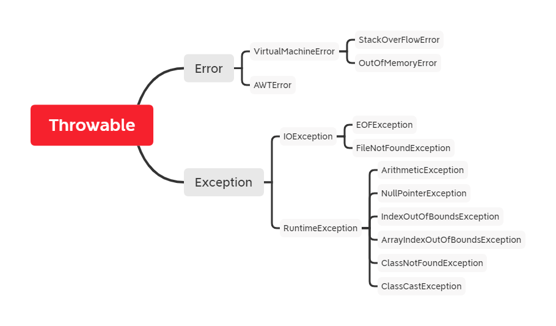
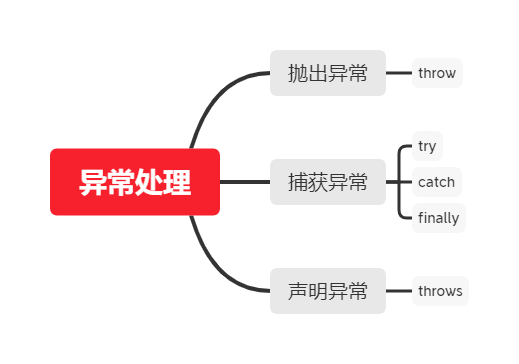

## Java异常模块

**异常处理机制主要回答了三个问题：**

- What：异常类型回答了什么被抛出；
- Where：异常堆栈跟踪回答了在哪抛出；
- Why：异常信息回答了我什么被抛出；

> Java异常是Java提供的一种识别以及响应速度的一致性机制。
>
> Java异常机制可以使程序中异常处理代码和正常业务分离，在有效使用异常的情况下，**异常能清晰的回答what,where,why这3个问题**：异常类型回答了“什么”被抛出；异常堆栈跟踪回答了“在哪”抛出；异常信息回答了“为什么”会抛出。



> 异常主要分为两类：一类是受检异常，一类是运行时异常；受检异常里面有filenotfoundexception和classnotfoundexception；而运行时异常主要是indexOutofBoundsException nullpointerexception，

# 一、Java异常架构

## 1.Throwable

Throwable是所有错误与异常的超类。

Throwable包含两个子类：Error（错误）和Exception（异常）,它们通常用于指示发生了异常情况。

Throwable包含了其**线程创建时线程执行堆栈的快照**，提供了**printStackTrace()等接口用于获取堆栈跟踪数据等信息。**

## 2.Error

**定义：**Error是程序中无法处理的错误，表示运行应用程序中出现了严重的错误。

**特点：**Error一般表示代码运行时JVM出现问题。通常有Virtual MachineError(虚拟机运行错误)、OutOfMemoryError（内存不足错误）、StackOverflowError（栈溢出错误）。此类错误发生时，JVM将终止线程。

这些错误是不受检异常，非带代码性错误。因此，当此类错误发生时，应用程序不应该去处理此类错误。


## 3.Exception

**定义：**程序本身可以捕获并且可以处理的异常。Exception这种异常又可以分为两类：**运行时异常**和**编译时异常**。

### 3.1 运行时异常

**定义：**RuntimeException类以及子类，表示JVM在运行期间可能出现的异常。

**特点：**Java编译器不会检查它。也就是，当程序中出现这类异常，倘若没有通过throws声明抛出它，也没有通过try-catch语句来捕获，还是会编译通过。比如NotNullPointerException空指针异常，ArrayIndexOutBoundsException数组下表越界异常，ClassCastException类型转换异常。通过都是程序逻辑错误引起的。

RuntimeException异常会由Java虚拟机自动抛出并自动捕获(**就算没写异常捕获语句运行时也会抛出错误！**)，此类异常的出现绝大多数是代码本身逻辑有问题。

### 3.2 编译时异常

**定义**: Exception 中除 RuntimeException 及其子类之外的异常。

**特点：**Java编译器会检查它。如果程序中出现此类异常，比如IOException FileNotFoundException，要么通过throws进行声明抛出，要么通过try-catch来捕获处理，否则不能编译。

在程序中，通常不会自定义该类异常，而是直接使用系统提供的异常类。**该异常我们必须手动在代码里添加捕获语句来处理该异常**。

## 4.受检异常与非受检异常

Java 的所有异常可以分为受检异常（checked exception）和非受检异常（unchecked exception）。

### 4.1 受检异常

编译器要求必须处理的异常。正确的程序在运行过程中，经常容易出现的、符合预期的异常情况。一旦发生此类异常，就必须采用某种方式进行处理。**除 RuntimeException 及其子类外，其他的 Exception 异常都属于受检异常**。编译器会检查此类异常，也就是说当编译器检查到应用中的某处可能会此类异常时，将会提示你处理本异常——要么使用try-catch捕获，要么使用方法签名中用 throws 关键字抛出，否则编译不通过。

### 4.2 非受检异常

编译器不会进行检查并且不要求必须处理的异常，也就说当程序中出现此类异常时，即使我们没有try-catch捕获它，也没有使用throws抛出该异常，编译也会正常通过。**该类异常包括运行时异常（RuntimeException极其子类）和错误（Error）。**


# 二、Java异常处理



## 1.Java异常关键字

Java的异常处理是通过5个关键字来实现的：try、catch、finally、throw、throws

• **try** – 用于监听。将要被监听的代码(可能抛出异常的代码)放在try语句块之内，当try语句块内发生异常时，异常就被抛出。
• **catch** – 用于捕获异常。catch用来捕获try语句块中发生的异常。
• **finally** – finally语句块总是会被执行。它主要用于回收在try块里打开的物力资源(如数据库连接、网络连接和磁盘文件)。只有finally块，执行完成之后，才会回来执行try或者catch块中的return或者throw语句，如果finally中使用了return或者throw等终止方法的语句，则就不会跳回执行，直接停止。

• **throw** – 用于抛出异常。
• **throws** – 用在方法签名中，用于声明该方法可能抛出的异常。

## 2.Java异常处理机制

在Java应用中，异常的处理机制分为声明异常、抛出异常和捕获异常。

### 2.1 声明异常

定义：通常，应该捕获那些知道如何处理的异常，将不知道如何处理的异常继续传递下去。传递异常可以在方法签名处使用**throws**关键字声明可能会抛出的异常。

注意：

- 非检查异常(Error、RuntimeException或它们的子类)不可使用throws关键字来声明要抛出的异常。
- 一个方法出现编译时异常，就需要**try-catch/throws处理，否则会导致编译错误**。

### 2.2 抛出异常

如果你觉得解决不了某些异常问题，且不需要调用者处理，那么你可以抛出异常。

throw关键字作用是在方法内部抛出一个`Throwable`类型的异常。任何Java代码都可以通过throw语句抛出异常。

### 2.3 捕获异常

程序通常在运行之前不报错，但是运行后可能会出现某些未知的错误，但是还不想直接抛出到上一级，那么就需要try..catch...的形式进行异常捕获，之后根据不同的异常情况来进行响应的处理。


## 3.如何选择异常类型

可以根据下图来选择是捕获异常，声明异常还是抛出异常


## 4.常见异常处理方式

### 4.1 直接抛出异常

通常，应该捕获那些知道如何处理的异常，将不知道如何处理的异常继续传递下去。传递异常可以在方法签名处使用 **throws** 关键字声明可能会抛出的异常。

```java
private static void readFile(String filePath) throws IOException {
    File file = new File(filePath);
    String result;
    BufferedReader reader = new BufferedReader(new FileReader(file));
    while((result = reader.readLine())!=null) {
        System.out.println(result);
    }
    reader.close();
}

```

### 4.2 封装异常再抛出

有时我们会从 catch 中抛出一个异常，目的是为了改变异常的类型。多用于在多系统集成时，当某个子系统故障，异常类型可能有多种，可以用统一的异常类型向外暴露，不需暴露太多内部异常细节。

```java
private static void readFile(String filePath) throws MyException {    
    try {
        // code
    } catch (IOException e) {
        MyException ex = new MyException("read file failed.");
        ex.initCause(e);
        throw ex;
    }
}

```

### 4.3 自定义异常

习惯上，定义一个异常类应包含两个构造函数，一个无参构造函数和一个带有详细描述信息的构造函数（Throwable 的 toString 方法会打印这些详细信息，调试时很有用）

```java
public class MyException extends Exception {
    public MyException(){ }
    public MyException(String msg){
        super(msg);
    }
    // ...
}

```

### 4.4 捕获异常try-catch 

在一个 try-catch 语句块中可以捕获多个异常类型，并对不同类型的异常做出不同的处理

```java
private static void readFile(String filePath) {
    try {
        // code
    } catch (FileNotFoundException e) {
        // handle FileNotFoundException
    } catch (IOException e){
        // handle IOException
    }
}

```

同一个 catch 也可以捕获多种类型异常，用 | 隔开

```java
private static void readFile(String filePath) {
    try {
        // code
    } catch (FileNotFoundException | UnknownHostException e) {
        // handle FileNotFoundException or UnknownHostException
    } catch (IOException e){
        // handle IOException
    }
}

```

### 4.5 捕获异常try-catch-finally

当方法中发生异常，异常处之后的代码不会再执行，如果之前获取了一些本地资源需要释放，则需要在方法正常结束时和 catch 语句中都调用释放本地资源的代码，显得代码比较繁琐，finally 语句可以解决这个问题。

```java
private static void readFile(String filePath) throws MyException {
    File file = new File(filePath);
    String result;
    BufferedReader reader = null;
    try {
        reader = new BufferedReader(new FileReader(file));
        while((result = reader.readLine())!=null) {
            System.out.println(result);
        }
    } catch (IOException e) {
        System.out.println("readFile method catch block.");
        MyException ex = new MyException("read file failed.");
        ex.initCause(e);
        throw ex;
    } finally {
        System.out.println("readFile method finally block.");
        if (null != reader) {
            try {
                reader.close();
            } catch (IOException e) {
                e.printStackTrace();
            }
        }
    }
}

```


# 三、Java异常常见面试题

## 1. Error和Exception的区别是什么？

Error类型的错误通常为虚拟机相关错误，如系统崩溃，内存不足，堆栈溢出；通常编译器不会对这类错误进行检测，Java应用程序也不应该对这类错误进行捕获，一旦这类错误发生，通常应用程序会被终止，仅靠应用程序本身无法恢复；

Exception类型的错误是可以在应用程序中进行捕获并进行处理的，通常遇到这类错误，应对其进行处理，使应用程序可以继续正常运行。

> 总结：Error不需要应用程序处理；Exception需要应用程序对异常进行捕获并处理。

## 2. 运行时异常和一般异常(受检异常)区别是什么？

运行时异常包括RuntimeException及其子类，表示JVM在运行期间可能出现的异常。Java编译器不会检查运行时异常。

受检异常是Exception中除RuntimeException及其子类之外的异常。Java编译器会检查受检异常。

> 总结：**两者的区别在于是否强制要求调用者必须处理此异常。如果强烈要求调用者必须进行处理，那么就使用受检异常，否则就选择非受检异常。**一般来讲，如果没有特殊要求，建议使用RuntimeException异常。

## 3.JVM是如何处理异常的？

在一个方法中发生异常，这个方法会创建一个异常对象，并转交给JVM。该异常对象包括异常名称，异常描述以及异常发生时程序的状态。创建异常对象并转交给JVM的过程称为抛出异常。可能有一系列的方法调用，最终才进入抛出异常的方法，这一系列方法调用的有序列表叫做调用栈。

JVM会顺着调用栈去查看是否有可以处理异常的代码。如果有，则调用异常处理代码。当JVM发现可以处理异常的代码，会把发生的异常传递给它。如果JVM没有找到可以处理该异常的代码块，JVM就会将异常转交给默认的异常处理器（默认处理器为JVM的一部分），默认异常处理器打印出异常信息并终止应用程序。

## 4.throw和throws的区别是什么？

throws关键字表示在方法中**声明**该方法要抛出的异常；throw是在方法内部**抛出**异常对象。

**区别：**

- throw关键字用在方法内部，只能用于抛出一种异常，用来抛出方法或代码块中的异常，受检异常和非受检异常都可以被抛出。
- throws关键字用在方法声明上，可以抛出多个异常。一个方法用throws标识了可能抛出的异常列表，那么调用该方法的方法中必须包含可处理异常的代码，否则也要在方法签名中throws关键字声明响应的异常。

## 5.final，finally和finalize区别是什么？

- final可以修饰类、变量、方法；修饰类表示该类不能被继承，修饰方法表示该方法不能被重写，修饰变量表示该变量是一个常量，不能被重新赋值；
- finally一般用在try-catch代码中，在捕获处理异常的时候，通常将一定要执行的代码方法放在finally中，表示不管是否出现异常，该代码块都会执行，一般用来存放一些关闭资源的代码。
- finalize是一个方法，属于Object类的一个方法，Java中允许使用finalize()方法在垃圾收集器将对象从内存中清除出去之前做必要的清理工作。

## 6. NoClassDefFoundError 和 ClassNotFoundException 区别？

NoClassDefFoundError 是一个 Error 类型的异常，是由 JVM 引起的，不应该尝试捕获这个异常。引起该异常的原因是 JVM 或 ClassLoader 尝试加载某类时在内存中找不到该类的定义，**该动作发生在运行期间，即编译时该类存在，但是在运行时却找不到了，可能是变异后被删除了等原因导致；**

ClassNotFoundException 是一个受检异常，需要显式地使用 try-catch 对其进行捕获和处理，或在方法签名中用 throws 关键字进行声明。当使用 Class.forName, ClassLoader.loadClass 或 ClassLoader.findSystemClass 动态加载类到内存的时候，通过传入的类路径参数**没有找到该类，就会抛出该异常**；另一种抛出该异常的可能原因是**某个类已经由一个类加载器加载至内存中，另一个加载器又尝试去加载它。**

## 7.try-catch-finally的处理

### (1)try-catch-finally 中哪个部分可以省略？

  try-catch-finally 其中 catch 和 finally 都可以被省略，但是不能同时省略，也就是说有 try 的时候，必须后面跟一个 catch 或者 finally。

### (2)try-catch-finally 中，如果 catch 中 return 了，finally 还会执行吗？

  finally 一定会执行，即使是 catch 中 return 了，catch 中的 return 会等 finally 中的代码执行完之后，才会执行。


## 7.代码写结果

try-catch-finally 中，如果 catch 中 return 了，finally 还会执行吗？答：会执行，在 return 前执行。

**代码示例1：**

```java
public static int getInt() {
    int a = 10;
    try {
        System.out.println(a / 0);
        a = 20;
    } catch (ArithmeticException e) {
        a = 30;
        return a;
        /*
         * return a 在程序执行到这一步的时候，这里不是return a 而是 return 30；这个返回路径就形成了
         * 但是呢，它发现后面还有finally，所以继续执行finally的内容，a=40
         * 再次回到以前的路径,继续走return 30，形成返回路径之后，这里的a就不是a变量了，而是常量30
         */
    } finally {
        a = 40;
    }
	return a;
}

```

执行结果：30

**代码示例2：**

```java
public static int getInt() {
    int a = 10;
    try {
        System.out.println(a / 0);
        a = 20;
    } catch (ArithmeticException e) {
        a = 30;
        return a;
    } finally {
        a = 40;
        //如果这样，就又重新形成了一条返回路径，由于只能通过1个return返回，所以这里直接返回40
        return a; 
    }

}

```

执行结果：40


**类 ExampleA 继承 Exception，类 ExampleB 继承ExampleA。**

有如下代码片断：

```java
try {
	throw new ExampleB("b")
} catch（ExampleA e）{
	System.out.println("ExampleA");
} catch（Exception e）{
	System.out.println("Exception");
}

```

输出：ExampleA。（根据里氏代换原则[能使用父类型的地方一定能使用子类型]，抓取 ExampleA 类型异常的 catch 块能够抓住 try 块中抛出的 ExampleB 类型的异常）


```java
class Annoyance extends Exception {
}
class Sneeze extends Annoyance {
}
class Human {
	public static void main(String[] args)
	throws Exception {
		try {
			try {
				throw new Sneeze();
			} catch ( Annoyance a ) {
				System.out.println("Caught Annoyance");
				throw a;
			}
		} catch ( Sneeze s ) {
			System.out.println("Caught Sneeze");
			return ;
		} finally {
			System.out.println("Hello World!");
		}
	}
}

```

结果

```java
Caught Annoyance
Caught Sneeze
Hello World!
```


# 四、异常处理实践

## 1.清理资源(finally块中清理资源/使用try-with-resource语句)

**错误用法**

当使用类似InputStream这种需要使用后关闭的资源时，一个常见的错误就是在try块的最后关闭资源。

```java
public void doNotCloseResourceInTry() {
    FileInputStream inputStream = null;
    try {
        File file = new File("./tmp.txt");
        inputStream = new FileInputStream(file);
        // use the inputStream to read a file
        // do NOT do this
        inputStream.close();
    } catch (FileNotFoundException e) {
        log.error(e);
    } catch (IOException e) {
        log.error(e);
    }
}

```

问题就是，只有没有异常抛出的时候，这段代码才可以正常工作。try 代码块内代码会正常执行，并且资源可以正常关闭。但是，使用 try 代码块是有原因的，一般调用一个或多个可能抛出异常的方法，而且，你自己也可能会抛出一个异常，这意味着代码可能不会执行到 try 代码块的最后部分。结果就是，你并没有关闭资源。

**因此，清理资源的工作要不放在finally中去，要不使用try-with-resource特性**

### 1.1 清理资源-finally代码块

与前面几行 try 代码块不同，finally 代码块总是会被执行。不管 try 代码块成功执行之后还是你在 catch 代码块中处理完异常后都会执行。因此，你可以确保你清理了所有打开的资源。

```java
public void closeResourceInFinally() {
    FileInputStream inputStream = null;
    try {
        File file = new File("./tmp.txt");
        inputStream = new FileInputStream(file);
        // use the inputStream to read a file
    } catch (FileNotFoundException e) {
        log.error(e);
    } finally {
        if (inputStream != null) {
            try {
                inputStream.close();
            } catch (IOException e) {
                log.error(e);
            }
        }
    }
}

```

### 1.2 Java 7 的 try-with-resource 语法

如果你的资源实现了 AutoCloseable 接口，你可以使用这个语法。大多数的 Java 标准资源都继承了这个接口。当你在 try 子句中打开资源，资源会在 try 代码块执行后或异常处理后自动关闭。

```java
public void automaticallyCloseResource() {
    File file = new File("./tmp.txt");
    try (FileInputStream inputStream = new FileInputStream(file);) {
        // use the inputStream to read a file
    } catch (FileNotFoundException e) {
        log.error(e);
    } catch (IOException e) {
        log.error(e);
    }
}


```

## 2.优先明确异常

尝试寻找最适合你的异常事件的类，例如，抛出一个 NumberFormatException 来替换一个 IllegalArgumentException 。避免抛出一个不明确的异常。

```java
public void doNotDoThis() throws Exception {
    ...
}
public void doThis() throws NumberFormatException {
    ...
}


```

# 五、总结

**异常**

> Throwable主要分为Error和Exception。主要区别为：在Java应用程序中是否需要处理。
>
> Exception分为受检异常和RuntimeException(运行时异常)。主要区别为：是否强制要求调用者必须处理此异常。

**Error和Exception**

Error类型的错误通常为虚拟机相关错误，如系统崩溃，内存不足，堆栈溢出；通常编译器不会对这类错误进行检测，Java应用程序也不应该对这类错误进行捕获，一旦这类错误发生，通常应用程序会被终止，仅靠应用程序本身无法恢复；

Exception类型的错误是可以在应用程序中进行捕获并进行处理的，通常遇到这类错误，应对其进行处理，使应用程序可以继续正常运行。

**受检异常和运行时异常**

运行时异常包括RuntimeException及其子类，表示JVM在运行期间可能出现的异常。Java编译器不会检查运行时异常。

受检异常是Exception中除RuntimeException及其子类之外的异常。Java编译器会检查受检异常。

> 总结：**两者的区别在于是否强制要求调用者必须处理此异常。如果强烈要求调用者必须进行处理，那么就使用受检异常，否则就选择非受检异常。**一般来讲，如果没有特殊要求，建议使用RuntimeException异常。


**异常处理**

> 捕获处理异常try-catch-finally   抛出异常throw  声明异常throws。、

throws关键字表示在方法中**声明**该方法要抛出的异常；throw是在方法内部**抛出**异常对象。

**区别：**

- throw关键字用在方法内部，只能用于抛出一种异常，用来抛出方法或代码块中的异常，受检异常和非受检异常都可以被抛出。
- throws关键字用在方法声明上，可以抛出多个异常。一个方法用throws标识了可能抛出的异常列表，那么调用该方法的方法中必须包含可处理异常的代码，否则也要在方法签名中throws关键字声明响应的异常。


