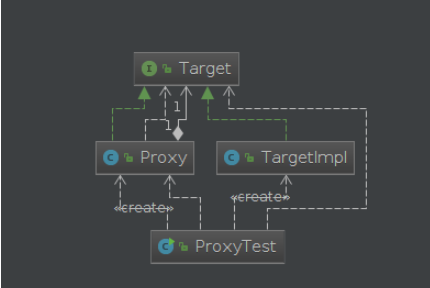
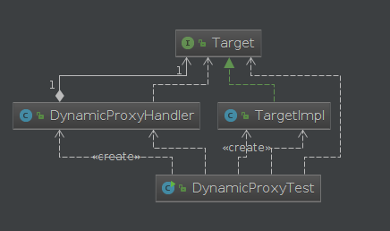
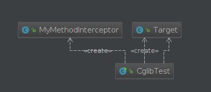
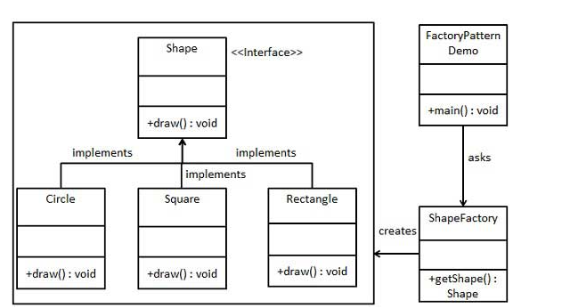
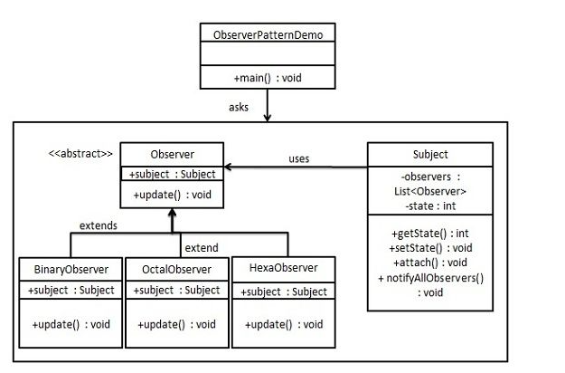
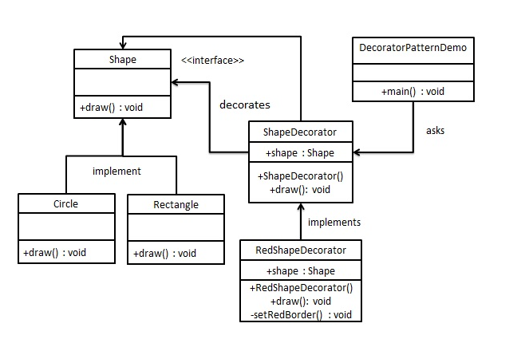

# Java架构设计

## 1.请列举出JDK中几个常用的设计模式？

**单例模式：保证一个类仅有一个实例，并提供一个访问它的全局访问点；**

**工厂模式：定义一个创建对象的接口，让其子类自己决定实例化哪一个工厂类，工厂模式使其创建过程延迟到子类进行；**

**观察者模式：定义对象间的一种一对多的依赖关系，当一个对象的状态发生改变时，所有依赖于它的对象都得到通知并被自动更新；**

**装饰者模式：动态地给一个对象添加一些额外的职责。就增加功能来说，装饰者模式相比生成子类更为灵活。**


**单例模式（Singleton pattern）**用于Runtime，Calendar和其他的一些类中。

**工厂模式（Factory pattern）**被用于各种不可变的类如 Boolean，像Boolean.valueOf，观察者模式（Observer pattern）被用于 Swing 和很多的事件监听中。

**装饰器设计模式（Decorator design pattern）**被用于多个 Java IO 类中。


> 补充:
>
> 设计模式是软件开发人员在开发过程中面临的一般问题的解决方案。这些解决方案是众多软件开发人员经过相当长的一段时间的试验和错误总结出来的。设计模式是代码可用性的延伸

## 2.代理模式-静态代理、JDK动态代理以及CGLIB动态代理

代理模式是java中最常用的设计模式之一，尤其是在spring框架中广泛应用。对于java的代理模式，一般可分为：静态代理、动态代理、以及CGLIB实现动态代理。

对于上述三种代理模式，分别进行说明。

### 2.1 静态代理

静态代理其实就是在程序运行之前，提前写好被代理方法的代理类，编译后运行。在程序运行之前，class已经存在。



定义一个接口Target

```java
package com.test.proxy;

public interface Target {

    public String execute();
}

```

TargetImpl 实现接口Target

```java
package com.test.proxy;

public class TargetImpl implements Target {

    @Override
    public String execute() {
        System.out.println("TargetImpl execute！");
        return "execute";
    }
}

```

代理类

```java
package com.test.proxy;

public class Proxy implements Target{

    private Target target;

    public Proxy(Target target) {
        this.target = target;
    }

    @Override
    public String execute() {
        System.out.println("perProcess");
        String result = this.target.execute();
        System.out.println("postProcess");
        return result;
    }
}

```

测试类:

```java
package com.test.proxy;

public class ProxyTest {

    public static void main(String[] args) {

        Target target = new TargetImpl();
        Proxy p = new Proxy(target);
        String result =  p.execute();
        System.out.println(result);
    }

}

```

运行结果:

```txt
perProcess
TargetImpl execute！
postProcess
execute

```

静态代理需要针对被代理的方法提前写好代理类，如果被代理的方法非常多则需要编写很多代码，因此，对于上述缺点，通过动态代理的方式进行了弥补。

### 2.2 JDK动态代理

动态代理主要是通过反射机制，在运行时动态生成所需代理的class.



接口

```java
package com.test.dynamic;

public interface Target {

    public String execute();
}

```

实现类

```java
package com.test.dynamic;

public class TargetImpl implements Target {

    @Override
    public String execute() {
        System.out.println("TargetImpl execute！");
        return "execute";
    }
}

```

代理类

```java
package com.test.dynamic;


import java.lang.reflect.InvocationHandler;
import java.lang.reflect.Method;

public class DynamicProxyHandler implements InvocationHandler{

    private Target target;

    public DynamicProxyHandler(Target target) {
        this.target = target;
    }

    @Override
    public Object invoke(Object proxy, Method method, Object[] args) throws Throwable {
        System.out.println("========before==========");
        Object result = method.invoke(target,args);
        System.out.println("========after===========");
        return result;
    }
}

```

测试类

```java
package com.test.dynamic;

import java.lang.reflect.Proxy;

public class DynamicProxyTest {

    public static void main(String[] args) {
        Target target = new TargetImpl();
        DynamicProxyHandler handler = new DynamicProxyHandler(target);
        Target proxySubject = (Target) Proxy.newProxyInstance(TargetImpl.class.getClassLoader(),TargetImpl.class.getInterfaces(),handler);
        String result = proxySubject.execute();
        System.out.println(result);
    }

}

```

运行结果：

```java
========before==========
TargetImpl execute！
========after===========
execute

```

无论是动态代理还是静态带领，都需要定义接口，然后才能实现代理功能。这同样存在局限性，因此，为了解决这个问题，出现了第三种代理方式：cglib代理。

### 2.3 cglib代理

CGLib采用了非常底层的字节码技术，其原理是通过字节码技术为一个类创建子类，并在子类中采用方法拦截的技术拦截所有父类方法的调用，顺势织入横切逻辑。JDK动态代理与CGLib动态代理均是实现Spring AOP的基础。



目标类

```java
package com.test.cglib;

public class Target {

    public String execute() {
        String message = "-----------test------------";
        System.out.println(message);
        return message;
    }
}

```

通用代理类

```java
package com.test.cglib;

import net.sf.cglib.proxy.MethodInterceptor;
import net.sf.cglib.proxy.MethodProxy;

import java.lang.reflect.Method;

public class MyMethodInterceptor implements MethodInterceptor{

    @Override
    public Object intercept(Object obj, Method method, Object[] args, MethodProxy proxy) throws Throwable {
        System.out.println(">>>>MethodInterceptor start...");
        Object result = proxy.invokeSuper(obj,args);
        System.out.println(">>>>MethodInterceptor ending...");
        return "result";
    }
}

```

测试类

```java
package com.test.cglib;

import net.sf.cglib.proxy.Enhancer;

public class CglibTest {

    public static void main(String[] args) {
        System.out.println("***************");
        Target target = new Target();
        CglibTest test = new CglibTest();
        Target proxyTarget = (Target) test.createProxy(Target.class);
        String res = proxyTarget.execute();
        System.out.println(res);
    }

    public Object createProxy(Class targetClass) {
        Enhancer enhancer = new Enhancer();
        enhancer.setSuperclass(targetClass);
        enhancer.setCallback(new MyMethodInterceptor());
        return enhancer.create();
    }

}

```

执行结果:

```java
***************
>>>>MethodInterceptor start...
-----------test------------
>>>>MethodInterceptor ending...
result

```

代理对象的生成过程由Enhancer类实现，大概步骤如下：

1. 生成代理类Class的二进制字节码；
2. 通过Class.forName加载二进制字节码，生成Class对象；
3. 通过反射机制获取实例构造，并初始化代理类对象。

## 3.单例模式

单例模式（Singleton Pattern）是 Java 中最简单的设计模式之一。这种类型的设计模式属于创建型模式，它提供了一种创建对象的最佳方式。

**意图**：保证一个类仅有一个实例，并提供一个访问它的全局访问点。

**主要解决**：一个全局使用的类频繁地创建与销毁。


饿汉式，线程安全

**代码实例**：

```java
public class Singleton3 {

    private static Singleton3 instance = new Singleton3();

    private Singleton3() {}

    public static Singleton3 getInstance() {
        return instance;
    }

} 

```


懒汉式，线程不安全

**代码实例**：

```java
public class Singleton2 {

    private static Singleton2 instance = null

    private Singleton2() {}

    public static  Singleton2 getInstance() {
        if (instance == null) {
            instance = new Singleton2();
        }

        return instance;
    }

}

```


双检锁/双重校验锁 + volatile关键字

**代码实例**：

```java
public class Singleton7 {

    private static volatile Singleton7 instance = null;

    private Singleton7() {}

    public static Singleton7 getInstance() {
        if (instance == null) {
            synchronized (Singleton7.class) {
                if (instance == null) {
                    instance = new Singleton7();
                }
            }
        }

        return instance;
    }

}

```


## 4.工厂模式

工厂模式（Factory Pattern）是 Java 中最常用的设计模式之一。这种类型的设计模式属于创建型模式，它提供了一种创建对象的最佳方式。

**意图**：**定义一个创建对象的接口，让其子类自己决定实例化哪一个工厂类，工厂模式使其创建过程延迟到子类进行**。

**主要解决**：主要解决接口选择的问题。

我们将创建一个 *Shape* 接口和实现 *Shape* 接口的实体类。下一步是定义工厂类 *ShapeFactory*。

*FactoryPatternDemo*，我们的演示类使用 *ShapeFactory* 来获取 *Shape* 对象。它将向 *ShapeFactory* 传递信息（*CIRCLE / RECTANGLE / SQUARE*），以便获取它所需对象的类型。



**步骤 1**

创建一个接口。

*Shape.java*

```java
public interface Shape {
    void draw();
}
```

**步骤 2**

创建实现接口的实体类。

*Rectangle.java*

```java
public class Rectangle implements Shape {
    @Override
    public void draw() {
        System.out.println("Inside Rectangle::draw() method.");
    }
}

```

*Square.java*

```java
public class Square implements Shape {
    @Override
    public void draw() {
        System.out.println("Inside Square::draw() method.");
    }
}

```

*Circle.java*

```java
public class Circle implements Shape {
    @Override
    public void draw() {
        System.out.println("Inside Circle::draw() method.");
    }
}

```

**步骤 3**

创建一个工厂，生成基于给定信息的实体类的对象。

*ShapeFactory.java*

```java
public class ShapeFactory {

    //使用 getShape 方法获取形状类型的对象
    public Shape getShape(String shapeType) {
        if (shapeType == null) {
            return null;
        }
        shapeType = shapeType.toLowerCase();

        switch (shapeType) {
            case "circle":
                return new Circle();
            case "rectangle":
                return new Rectangle();
            case "square":
                return new Square();
            default:
                return null;
        }

    }

}

```

**步骤 4**

使用该工厂，通过传递类型信息来获取实体类的对象。

*FactoryPatternDemo.java*

```java
public class FactoryPatternDemo {

    public static void main(String[] args) {
        ShapeFactory shapeFactory = new ShapeFactory();

        //获取 Circle 的对象，并调用它的 draw 方法
        Shape shape1 = shapeFactory.getShape("CIRCLE");
        //调用 Circle 的 draw 方法
        shape1.draw();

        //获取 Rectangle 的对象，并调用它的 draw 方法
        Shape shape2 = shapeFactory.getShape("RECTANGLE");
        //调用 Rectangle 的 draw 方法
        shape2.draw();

        //获取 Square 的对象，并调用它的 draw 方法
        Shape shape3 = shapeFactory.getShape("SQUARE");
        //调用 Square 的 draw 方法
        shape3.draw();
    }

}

```

**步骤 5**

验证输出。

```java
Inside Circle::draw() method.
Inside Rectangle::draw() method.
Inside Square::draw() method.

```

## 5.观察者模式

当对象间存在一对多关系时，则使用观察者模式（Observer Pattern）。比如，当一个对象被修改时，则会自动通知它的依赖对象。观察者模式属于行为型模式。

**意图**：**定义对象间的一种一对多的依赖关系，当一个对象的状态发生改变时，所有依赖于它的对象都得到通知并被自动更新。**

**主要解决**：一个对象状态改变给其他对象通知的问题，而且要考虑到易用和低耦合，保证高度的协作。

实现

观察者模式使用三个类 Subject、Observer 和 Client。Subject 对象带有绑定观察者到 Client 对象和从 Client 对象解绑观察者的方法。我们创建 *Subject* 类、*Observer* 抽象类和扩展了抽象类 *Observer* 的实体类。

*ObserverPatternDemo*，我们的演示类使用 *Subject* 和实体类对象来演示观察者模式。



**步骤 1**

创建 Subject 类。

*Subject.java*

```java
public class Subject {

    private List<Observer> observers = new ArrayList<>();

    private int state;

    public int getState() {
        return state;
    }

    public void setState(int state) {
        this.state = state;
        notifyAllObservers();
    }

    public void attach(Observer observer) {
        observers.add(observer);
    }

    public void notifyAllObservers() {
        for (Observer observer : observers) {
            observer.update();
        }
    }

}

```

**步骤 2**

创建 Observer 类。

*Observer.java*

```java
public abstract class Observer {

    protected Subject subject;

    public abstract void update();

}

```

**步骤 3**

创建实体观察者类。

*BinaryObserver.java*

```java
public class BinaryObserver extends Observer {

    public BinaryObserver(Subject subject) {
        this.subject = subject;
        this.subject.attach(this);
    }

    @Override
    public void update() {
        System.out.println("Binary String: "
                + Integer.toBinaryString(subject.getState()));
    }

}

```

*OctalObserver.java*

```java
public class OctalObserver extends Observer {

    public OctalObserver(Subject subject){
        this.subject = subject;
        this.subject.attach(this);
    }

    @Override
    public void update() {
        System.out.println( "Octal String: "
                + Integer.toOctalString( subject.getState() ) );
    }

}

```

*HexaObserver.java*

```java
public class HexaObserver extends Observer {

    public HexaObserver(Subject subject){
        this.subject = subject;
        this.subject.attach(this);
    }

    @Override
    public void update() {
        System.out.println( "Hex String: "
                + Integer.toHexString( subject.getState() ).toUpperCase() );
    }

}

```

**步骤 4**

使用 *Subject* 和实体观察者对象。

*ObserverPatternDemo.java*

```java
public class ObserverPatternDemo {

    public static void main(String[] args) {
        Subject subject = new Subject();

        new BinaryObserver(subject);
        new HexaObserver(subject);
        new OctalObserver(subject);

        System.out.println("First state change: 15");
        subject.setState(15);
        System.out.println();

        System.out.println("Second state change: 10");
        subject.setState(10);
    }

}

```

**步骤 5**

验证输出。

```java
First state change: 15
Binary String: 1111
Hex String: F
Octal String: 17

Second state change: 10
Binary String: 1010
Hex String: A
Octal String: 12

```

## 6.装饰者模式

装饰器模式（Decorator Pattern）允许向一个现有的对象添加新的功能，同时又不改变其结构。这种类型的设计模式属于结构型模式，它是作为现有的类的一个包装。

**意图**：**动态地给一个对象添加一些额外的职责。就增加功能来说，装饰器模式相比生成子类更为灵活。**

**主要解决**：一般的，我们为了扩展一个类经常使用继承方式实现，由于继承为类引入静态特征，并且随着扩展功能的增多，子类会很膨胀。

实现

我们将创建一个 *Shape* 接口和实现了 *Shape* 接口的实体类。然后我们创建一个实现了 *Shape* 接口的抽象装饰类 *ShapeDecorator*，并把 *Shape* 对象作为它的实例变量。

*RedShapeDecorator* 是实现了 *ShapeDecorator* 的实体类。

*DecoratorPatternDemo*，我们的演示类使用 *RedShapeDecorator* 来装饰 *Shape* 对象。



**步骤 1**

创建一个接口。

*Shape.java*

```java
public interface Shape {

    void draw();

}

```

**步骤 2**

创建实现接口的实体类。

*Rectangle.java*

```java
public class Rectangle implements Shape {

    @Override
    public void draw() {
        System.out.println("Shape: Rectangle");
    }

}

```

*Circle.java*

```java
public class Circle implements Shape {

    @Override
    public void draw() {
        System.out.println("Shape: Circle");
    }

}

```

**步骤 3**

创建实现了 *Shape* 接口的抽象装饰类。

*ShapeDecorator.java*

```java
public abstract class ShapeDecorator implements Shape {

    protected Shape decoratorShape;

    public ShapeDecorator(Shape decoratorShape) {
        this.decoratorShape = decoratorShape;
    }

    @Override
    public void draw() {
        decoratorShape.draw();
    }
}

```

**步骤 4**

创建扩展了 *ShapeDecorator* 类的实体装饰类。

*RedShapeDecorator.java*

```java
public class RedShapeDecorator extends ShapeDecorator {

    public RedShapeDecorator(Shape decoratorShape) {
        super(decoratorShape);
    }

    @Override
    public void draw() {
        decoratorShape.draw();
        setRedBorder(decoratorShape);
    }

    private void setRedBorder(Shape decoratorShape) {
        System.out.println("Border Color: Red");
    }

}

```

**步骤 5**

使用 *RedShapeDecorator* 来装饰 *Shape* 对象。

*DecoratorPatternDemo.java*

```java
public class DecoratorPatternDemo {

    public static void main(String[] args) {
        Shape circle = new Circle();
        Shape redCircle = new RedShapeDecorator(new Circle());
        Shape redRectangle = new RedShapeDecorator(new Rectangle());

        System.out.println("Circle with normal border");
        circle.draw();

        System.out.println("\nCircle of red border");
        redCircle.draw();

        System.out.println("\nRectangle of red border");
        redRectangle.draw();

    }

}

```

**步骤 6**

验证输出。

```
Circle with normal border
Shape: Circle

Circle of red border
Shape: Circle
Border Color: Red

Rectangle of red border
Shape: Rectangle
Border Color: Red

```

