# 剑指Java面试offer-计算机网络面试核心

## 一、OSI与TCP/IP 网络模型

> OSI七层参考模型是国际标准化组织(ISO)指定的一个用于计算机或通信系统间互联的标准体系。
>
> TCP/IP网络模型是目前的模型。
>
> 而五层协议是学习计算机网络时的对OSI以及TCP/IP模型学习的一种折中方法。

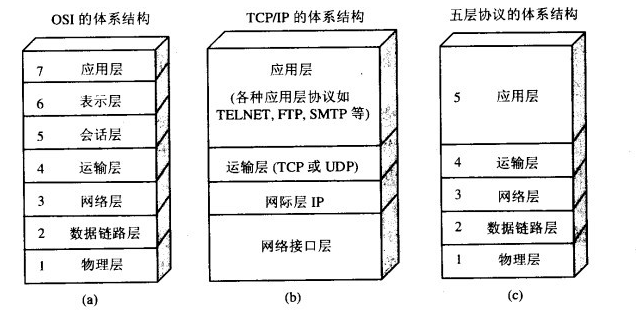

### 1.OSI开放式互联参考模型

- 第1层: 物理层
  - **通过硬件设备将模拟信息转换为数字信号**，即0/1数据流，也称为比特流
- 第2层：数据链路层
  - 可以发比特流但是没有格式会乱七八糟，于是就有了**“帧**”。**采用一种“帧”的数据块进行传输**。为了保证数据通信的准确，实现数据有效的差错控制，加入了检错等功能。
- 第3层：网络层
  - 前两层都是在与可以发数据，以及发的数据是否准确，然而**对于多台电脑通信，则需要路由**。选择的发，那每台电脑就得有自己的身份，于是出现了**IP协议**等。
- 第4层：传输层
  - 比特流的传输的过程不可能一直通畅，偶尔出现中断很正常，如**果人为制定出单位，分成一个个的信息端，从中衍生了报文**，结合上面的几层，就可以有目标的发送正确数据给某台计算机了。传输层有两个重要协议：**TCP和UDP**。TCP效率低但是发送包校验是否完整，UDP效率高但是不管别人是否能完整接收到。
- 第5层：会话层
  - **计算机收到了发送的数据，但是有那么多进程**，具体哪个进行需要用到这个数据，则把它输送到哪个进程。
- 第6层：表示层
  - 现在正确接收到了需要的数据，但是需要数据在传输过程中可**能基于安全性，或者是算法上的压缩，网络类型的不同，需要一个沟通桥梁进行整理**，还原出原本应该的表示。
- 第7层：应用层
  - **对用户的已经封装好的接口，提供多种服务，**用户只需操作应用层就可以得到服务内容，这样封装可以让更多的人能使用它。


其中每一个应用层(TCP/IP参考模型的最高层)协议一般都会使用到两个传输层协议之一：

运行在`TCP协议`上的协议：

- `HTTP（Hypertext Transfer Protocal, 超文本传输协议）`，主要用于普通游览；
- `HTTPS（HTTP over SSL，安全超文本传输协议）`,`HTTP`协议的安全版本。
- `FTP（File Transfer Protocol，文件传输协议）`，用于文件传输。
- `POP3（Post Office Protocol, version 3，邮局协议）`，收邮件用。
- `SMTP（Simple Mail Transfer Protocol，简单邮件传输协议）`，用来发送电子邮件。
- `TELNET（Teletype over the Network，网络电传）`，通过一个`终端（terminal）`登陆到网络。
- `SSH（Secure Shell，用于替代安全性差的TELNET）`，用于加密安全登陆用。

运行在`UDP协议`上的协议：

- `BOOTP（Boot Protocol，启动协议）`，应用于无盘设备。
- `NTP（Network Time Protocol，网络时间协议）`，用于网络同步。
- `DHCP（Dynamic Host Configuration Protocol，动态主机配置协议）`，动态配置IP地址。

运行在`TCP`和`UDP`协议上：

- `DNS（Domain Name Service，域名服务）`，用于完成地址查找，邮件转发等工作。

### 2.TCP/IP网络模型

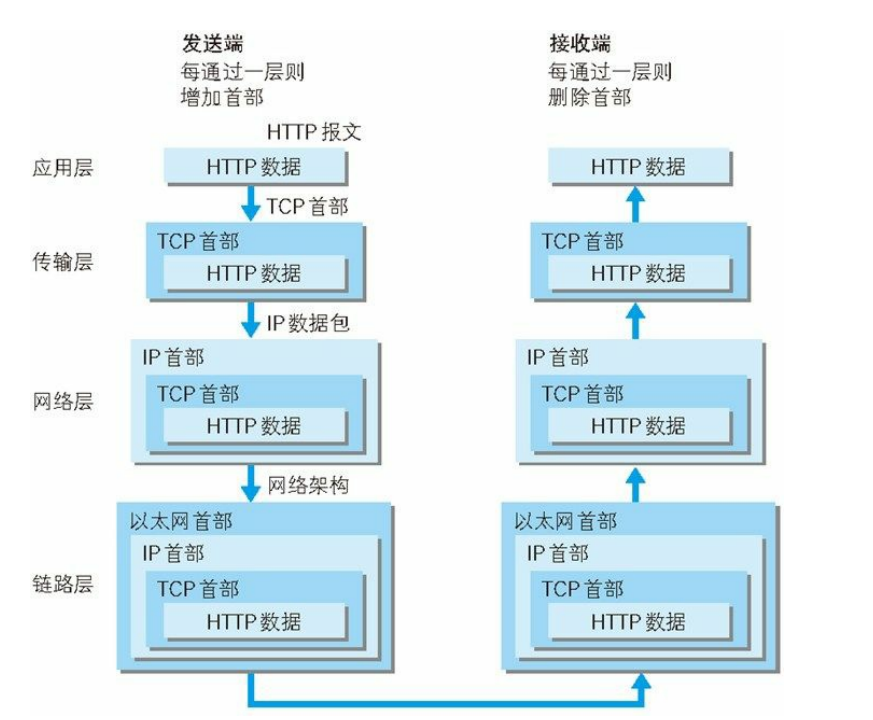

- 应用层：决定了向用户提供应用服务时通信的活动
- 传输层：对上层应用层，提供处于网络连接中的两台计算机之间的数据传输
- 网际层IP：用来处理在网络上流动的数据包
- 网络接口层：用来处理连接网络的硬件部分

##  

## 二、TCP的三次握手、四次挥手

> TCP协议：传输控制协议，对数据的传输进行一定的控制。
>
> - **面向连接的、可靠的、基于字节流的传输层通信协议**
> - 将应用层的数据流分割成报文段并发送给目标节点的TCP层
> - 数据包都有序号，对方收到则发送ACK确认，未收到则重传
> - 使用校验，来校验数据在传输过程中是否有误。

### 1.TCP报文头

（发送方和接收方，序号表示，数据大小，发送是否完整，数据）

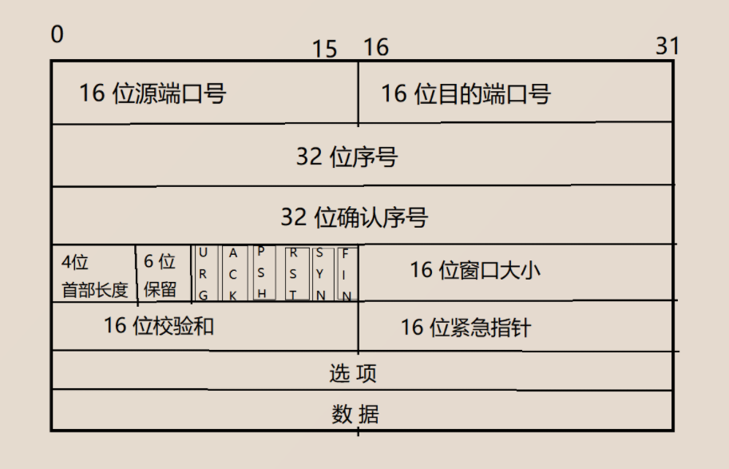

- 16位源端口号：源端口中包含初始化通信的端口。源端口和源地址的作用是标识报文的返回地址。
- 16位目的端口号：目的端口定义传输的目的。这个端口指明报文接收计算机上的应用程序地址接口。
- 32位序列号：用来标识从TCP源端向TCP目标端发送的数据字节流。
- 32位确认序号：只有ACK标志位1时，确认序号字段才有效。它包含目标端所期望收到源端的下一个数据字节。
- 4位首部长度：包括TCP头大小，指示何处数据开始。
- 6位保留：为了将来定义新的用途而保留
- 6位标志位：
  - URG:标识紧急指针是否有效
  - **ACK:**标识确认序号是否有效
  - PSH:用来提示接收端应用程序立刻将数据从tcp缓冲区读走
  - RST:要求重新建立连接，把含有RST标识的报文称为复位报文段
  - **SYN:**请求建立连接，建立连接，把含有SYN标识的报文称为同步报文段
  - **FIN:**通知对端即将关闭，释放连接。把含有FIN标识的报文称为结束报文段
- 16位窗口大小：用来表示想收到的每个TCP数据段的大小。TCP的流量控制由连接端通过声明的窗口大小来提供。
- 16位校验和：源机器基于数据内容计算一个数值，收信息机要与源机器数值结果完全一样，从而证明数据的有效性
- 16位紧急指针：指向后面是优先数据的字节，在URG标志设置时才有效。
- 选项：长度不定，但长度必须为一个字节
- 数据：该TCP协议包负载的数据

### 2.TCP的三次握手

“握手”是为了建立连接，TCP三次握手的流程图如下：


**第一次握手**：服务器知道了客户端要建立连接

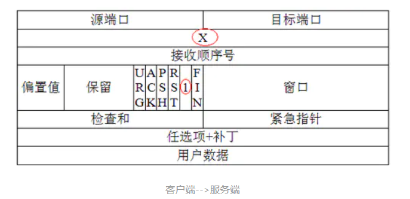

首先，当客户端需要与服务器建立连接的时候，会发送一个标志位SYN=1(表示请求建立连接)，随机生成序列号seq=X的数据报发送给服务端主机，此时客户端进入SYN_SEND状态，等待服务器确认。

**第二次握手：**客户端知道服务器收到连接请求

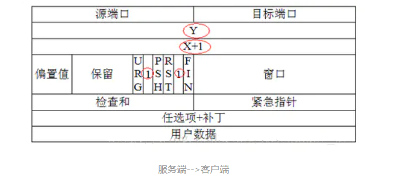

服务端收到请求后，必须确认客户的数据包，并且会给客户端发送一个标志位ACK=1和SYN=1的数据包，随机生成序列号seq=Y的数据包发送给客户端，ack=X+1（表示确认接收了一个序列号为X的数据包，同时也期望接收的下一个序列号为X+1的数据包），此时服务器进入SYN_RECV状态

**第三次握手：**服务器知道客户端收到了自己的响应

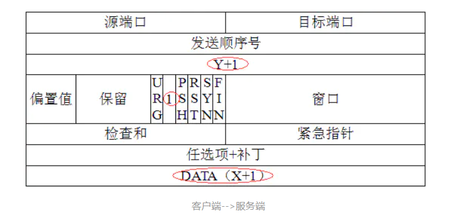

最后，客户端收到数据包之后，知道序列号seq=X的数据包已被服务端收到，但是服务端不知道客户端有没有收到自己的确认包，所以客户端会再次发送一个数据包，用来通知服务端收到了它的确认包。ACK=1,表示确认包，序列号seq=X+1,确认号ack=Y+1.

此包发送完毕，客户端和服务器进行ESTAB_LISHED状态。

> 未连接队列：在三次握手协议中，服务器会维护一个未连接队列，该队列为每个客户端的SYN包开设一个条目，该条目表明服务器已收到SYN包，并向客户端发出确认，当收到客户的确认包后才删除该条目，服务器仅需ESTAB_LISHED状态。
>
> 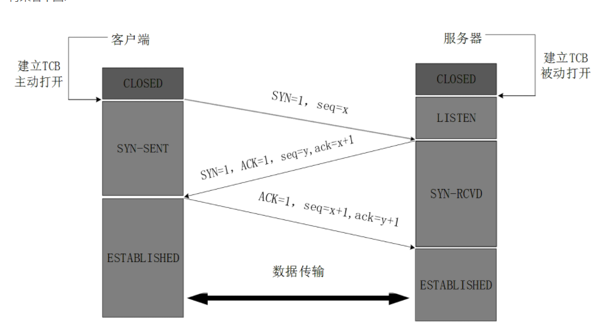

#### a.为什么三次握手才能建立起连接

最重要的目的就是 **建立可靠的通信信道，双方确认自己与对方的发送与接收是正常的。**

> **三次握手的目的是建立可靠的通信信道，通信即数据的发送与接收，而三次握手最主要的目的就是双方确认自己与对方发送接收是正常的。**
>
> 三次握手完成最重要的两个重要功能，即双方做好发送数据的准备工作(双方知道彼此的存在)，也要允许双方就初始序列号进行协商，这个序列号在握手过程中被发送和确认。

第一次握手：client什么都不能确认；server确认了对方发送正常，自己接收正常。

第二次握手：client确认：自己发送、自己接收正常、对方发送、接收正常；server确认：对方发送正常，自己接收正常

第三次握手：client确认：自己发送、自己接收正常、对方发送、接收正常；server确认：自己发送、自己接收正常，对方发送、接收正常

#### b.第2次握手传回了ACK，为什么还要传回SYN

接收端传回发送端所发送的ACK是为了客户端，我接收到的消息确实就是你所发送的信号了，这表明从客户端到服务端的通信是正常的。

而回传SYN则是为了建立并确认从服务端到客户端的通信。

> SYN同步序列编号（Synchronize Sequence Numbers）是TCP/IP建立连接时使用的握手信号。在客户机和服务器之间建立正常的TCP网络连接时，客户机首先发送一个SYN信息，服务器使用SYN-ACK应答表示接收到了这个消息，最后客户机再以ACK消息响应。这样在客户机和服务器之间才能建立起可靠的TCP连接，数据才可以在客户机和服务器之间传递。

#### c.TCP三次握手的隐患

> 问题：首次握手的隐患-SYN超时
>
> 起因：server在发送第2次握手(ACK-SYN)之后未收到A发送的ACK，一直处于SYN_RECV状态，此时服务器会不断重试直至超时，Linux默认等待63秒(1+2+4+8+16+32)
>
> 查询命令：SYN攻击是一种典型的DDOS攻击，client在短时间内伪造大量不存在的IP地址，向Server不断的发送SYN包。当Server上有大量半连接状态且源IP地址是随机的，则可以判定遭到SYN攻击了。
>
> #netstat -nap | grep SYN_RECV
>
> 后果：SYN超时容易导致服务器收到SYN Flood攻击，即一个恶意程序发完SYN后就下线了，服务器需要等待63秒，正常的SYN接收队列不足。
>
> 解决措施：**SYN队列满了后，回发SYN cookie参数**，若为正常连接则会回发SYN Cookie，直至连接。

#### d.建立连接后，client出现故障怎么办

**保活机制：**

- 向对方发送**保活探测报文**，如果未收到相应则继续发送；
- **尝试次数达到保活探测数仍未收到则中断连接。**


#### e.为什么TCP连接的时候是3次？2次不可以吗？

因为需要考虑**连接时丢包的问题**，如果只握手2次，第二次握手时如果服务端发给客户端的确认报文段丢失，此时服务端已经准备好了收发数(可以理解服务端已经连接成功)据，而客户端一直没收到服务端的确认报文，所以客户端就不知道服务端是否已经准备好了(可以理解为客户端未连接成功)，这种情况下客户端不会给服务端发数据，也会忽略服务端发过来的数据。

如果是三次握手，即便发生丢包也不会有问题，比如如果第三次握手客户端发的确认ack报文丢失，服务端在一段时间内没有收到确认ack报文的话就会重新进行第二次握手，也就是服务端会重发SYN报文段，客户端收到重发的报文段后会再次给服务端发送确认ack报文。

#### f.为什么TCP连接的时候是3次，关闭的时候却是4次？

**因为只有在客户端和服务端都没有数据要发送的时候才能断开TCP**。而客户端发出FIN报文时只能保证客户端没有数据发了，服务端还有没有数据发客户端是不知道的。而服务端收到客户端的FIN报文后只能先回复客户端一个确认报文来告诉客户端我服务端已经收到你的FIN报文了，但我服务端还有一些数据没发完，等这些数据发完了服务端才能给客户端发FIN报文(所以不能一次性将确认报文和FIN报文发给客户端，就是这里多出来了一次)。

#### g.为什么客户端发出第四次挥手的确认报文后要等2MSL的时间才能释放TCP连接？

这里同样是要考虑丢包的问题，如果第四次挥手的报文丢失，服务端没收到确认ack报文就会重发第三次挥手的报文，这样报文一去一回最长时间就是2MSL，所以需要等这么长时间来确认服务端确实已经收到了。

#### h.如果已经建立了连接，但是客户端突然出现故障了怎么办？

TCP设有一个**保活计时器**，客户端如果出现故障，服务器不能一直等下去，白白浪费资源。服务器每收到一次客户端的请求后都会重新复位这个计时器，时间通常是设置为2小时，若两小时还没有收到客户端的任何数据，服务器就会发送一个**探测报文段**，以后每隔75秒钟发送一次。若一连发送10个探测报文仍然没反应，服务器就认为客户端出了故障，接着就关闭连接。


### 3.TCP的四次挥手

> 握手是为了建立连接，连接可靠的传输通道；
>
> 挥手是为了终止连接，只有在双方都没有数据的情况下，才会终止数据传输。

“挥手”是为了终止连接，TCP四次挥手的流程图如下：


> 由于TCP连接是全双工的，因此每个方向都必须单独进行关闭。这个原则是当一方完成它的数据发送任务后就能发送一个FIN来终止这个方向的连接。收到一个FIN只意味着这一方向上没有数据流动，一个TCP连接在收到一个FIN后仍能发送数据。


第一次挥手：

首先，客户端发送一个FIN，用来关闭客户端到服务器的数据传送，然后等待服务器的确认。其中FIN=1,seq=u。

第二次挥手：

服务器收到这个FIN，它发送一个ACK，确认ack为收到的序号+1.

第三次挥手：

关闭服务器到客户端的连接，发送一个FIN给客户端。

第四次挥手：

客户端收到FIN后，并发挥一个ACK报确认，并将确认序号seq设置为收到序号+1。首先关闭的一方将执行主动关闭，而另一方执行被动关闭。

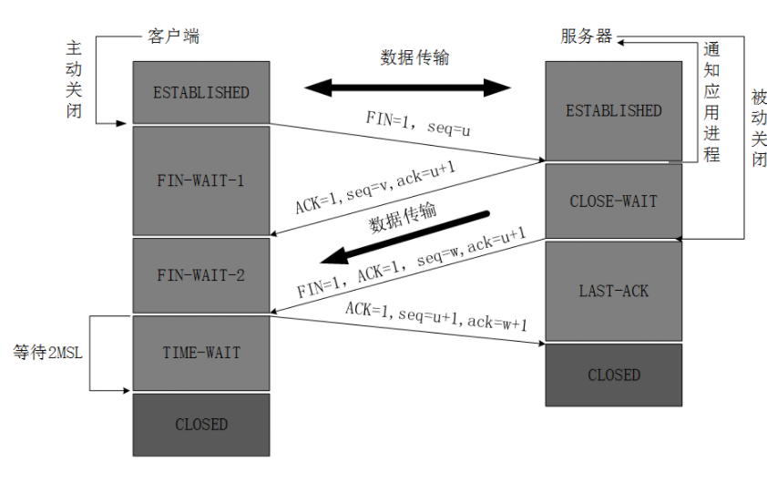

#### a.为什么TIME_wAIT状态还需等2MSL后才能返回到close状态？

> - 保证TCP协议的全双工连接能够可靠关闭
> - 保证这次连接的重复数据段从网络中消失。

如果Client直接CLOSED了，那么由于IP协议的不可靠性或者是其它网络原因，导致Server没有收到Client最后回复的ACK。那么Server就会在超时之后继续发送FIN，此时由于Client已经CLOSED了，就找不到与重发的FIN对应的连接，最后Server就会收到RST而不是ACK，Server就会以为是连接错误把问题报告给高层。这样的情况虽然不会造成数据丢失，但是却导致TCP协议不符合可靠连接的要求。所以，Client不是直接进入CLOSED，而是要保持TIME_WAIT，当再次收到FIN的时候，能够保证对方收到ACK，最后正确的关闭连接。

为了保证客户端发送的最后一个ACK报文段能够到达服务器。即最后一个确认报文可能丢失，服务器会超时重传，然后服务器发送FIN请求关闭连接，客户端发送ACK确认。**一个来回是两个报文生命周期**。如果没有等待时间，发送完确认报文段就立即释放连接的话，服务器就无法重传，因此也就收不到确认，就无法按步骤进入CLOSED状态，即必须收到确认才能close。

防止已经失效的连接请求报文出现在连接中。经过2MSL，在这个连续持续的时间内，产生的所有报文段就可以都从网络消失。


#### b.为什么建立连接协议是三次握手，而关闭连接确是四次握手呢？

因为全双工，发送方和接收方都需要**FIN报文和ACK报**文。即**双方关闭连接要经过双方都同意。**

在建立连接时，服务端收到SYN报文的建立请求后，它可以把**ACK和SYN放在一个报文里发送**。

但关闭连接时，当收到对方的**FIN报文通知**时，它仅仅表示**对方没有数据发送给你**了；但未必你所有的数据都发送给对方了，所以**可能不会马上关闭socket**，可能还需要在**发送一些数据给对方只会**，再发送FIN报文给对方来表示你同意现在可以关闭连接。

#### c.服务器出现大量CLOSE_WAIT状态的原因

对方关闭socket连接，我方忙于读或写，没有及时关闭连接。

- 检查代码，特别是释放资源的代码
- 检查配置，特别是处理请求的线程配置

### 4.TCP协议如何保证可靠传输

> 应用数据被分割成TCP认为最适合发送的数据块，TCP给发送的每一个包进行编号，接收方对数据包进行排序，把有序数据传送给应用层。

- **校验和：**TCP将保持它首部和数据的校验和。目的是检测数据在传输过程中的任何变化，如果收到的校验和有差错，TCP将丢弃这个报文段。
- **流量控制：**TCP连接的每一方都有固定大小的缓冲空间。TCP的接收端只允许发送端发送接收端缓冲区能接纳的数据。
- **拥塞控制：**当网络拥塞时，减少数据的发送。
- **ARQ协议：**每发完一个分组就停止发送，等待对方确认。在收到确认后再发下一个分组。
- **超时重传：**当TCP发出一个报文段后，它启动一个定时器，等待目标端确认收到这个报文段。如果不能及时收到这个确认，将重发这个报文段。

> - 流量控制：TCP利用滑动窗口实现流量控制。流量控制是为了控制发送方发送速率，保证接收方来得及接收。接收方发送的确认报文中的窗口字段可以用来控制发送方窗口大小，从而影响发送方的发送速率。将窗口字段设置为0，则发送方不能发送数据。
> - 拥塞控制：在某段时间，若对网络中某一资源的需求超过了该资源所能提供的可用部分，网络的性能就要变坏。这种情况就叫拥塞。拥塞控制就是为了防止过多的数据注入到网络中，这样就可以使网络中的路由器或链路不致过载。拥塞控制所要做的都有一个前提，就是网络能够承受现有的网络负荷。拥塞控制是一个全局性的过程，涉及到所有的主机，所有的路由器，以及与降低网络传输性能有关的所有因素。相反，流量控制往往是点对点通信量的控制，是个端到端的问题。流量控制所要做到的就是抑制发送端发送数据的速率，以便使接收端来得及接收。 为了进行拥塞控制,TCP发送方要维持一个拥塞窗口的状态变量。拥塞控制窗口的大小取决于网络的拥塞程序，并且动态变化。发送方让自己的发送窗口取为拥塞窗口和接收方的接收窗口中较小的一个。TCP拥塞控制采用了四种算法，`慢开始`、`拥塞避免` 、`快重传`、  `快恢复`。
>   - `慢开始：`慢开始算法的思路是当主机开始发送数据时，如果立即把大量数据字节注入到网络中，那么可能引起网络阻塞，因为现在还不知道网络的初始情况。较好的方法是先探测一下，即从小到大逐渐增大发送窗口，也就是从小到大逐渐增大拥塞窗口数值。cwnd初始值为1，每经过一个传播轮次，cwnd加倍。
>   - `拥塞避免：`拥塞避免算法的思路是让拥塞窗口cwnd缓慢增大，即每经过一个往返时间RTT就把发送的cwnd加1.
>   - `快重传和快恢复:`在 TCP/IP 中，快速重传和恢复（fast retransmit and recovery，FRR）是一种拥塞控制算法，它能快速恢复丢失的数据包。没有 FRR，如果数据包丢失了，TCP 将会使用定时器来要求传输暂停。在暂停的这段时间内，没有新的或复制的数据包被发送。有了 FRR，如果接收机接收到一个不按顺序的数据段，它会立即给发送机发送一个重复确认。如果发送机接收到三个重复确认，它会假定确认件指出的数据段丢失了，并立即重传这些丢失的数据段。有了 FRR，就不会因为重传时要求的暂停被耽误。 　当有单独的数据包丢失时，快速重传和恢复（FRR）能最有效地工作。当有多个数据信息包在某一段很短的时间内丢失时，它则不能很有效地工作。
> - ARQ协议：ARQ包括停止等待协议和连续ARQ协议。
>   - 停止等待协议是为了实现可靠传输的。它的基本原理就是每发完一个分组就停止发送，等待对方确认(回复ACK)。如果过了一段时间（超时后），还是没有收到ACK确认，说明没有发送成功，需要重新发送，直到收到确认后再发下一个分组。
>   - 连续ARQ协议可提高信道利用率，发送方维持一个发送窗口，凡位于发送窗口内的分组可以连续发送出去，而不需要等待对方确认。接收方一般采用累计确认，对按序到达的最后一个分组发送确认，表明到这个分组为止的所有分组都已经正确收到了。


##  三、UDP

### 1.UDP报文结构

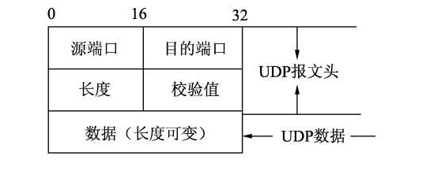

### 2.TCP和UDP的区别


- **UDP 在传送数据之前不需要先建立连接，远地主机在收到 UDP 报文后，不需要给出任何确认。虽然 UDP 不提供可靠交付**，但在某些情况下 UDP 确是一种最有效的工作方式（一般用于即时通信），比如： QQ 语音、 QQ 视频 、直播等等
- **TCP 提供面向连接的服务。在传送数据之前必须先建立连接，数据传送结束后要释放连接。** TCP 不提供广播或多播服务。由于 TCP 要提供可靠的，面向连接的传输服务（TCP的可靠体现在TCP在传递数据之前，会有三次握手来建立连接，而且在数据传递时，有**确认、窗口、重传、拥塞控制机**制，在数据传完后，还会断开连接用来节约系统资源），这一难以避免增加了许多开销，如确认，流量控制，计时器以及连接管理等。这不仅使协议数据单元的首部增大很多，还要占用许多处理机资源。TCP 一般用于文件传输、发送和接收邮件、远程登录等场景。

## 四、IP协议

（不同网络的机器之间的通信，要经过路由。）

I**P协议的作用是把各种数据包传送给对方**。而要保证确实传送到对方那里，则需要满足各种条件。其中两个重要的条件是**IP地址和MAC地址**。

**IP地址指明了节点被分配到的地址**，**MAC地址是指网卡所属的固定地址**。IP地址和MAC地址进行配对。IP地址可以变换，但MAC地址基本上不会更改。

IPV4协议具有**32位(4字节)**地址场地；IPv6协议具有**128位（16字节）**地址长度。

## 五、HTTP

### 1.在游览器输入url地址，显示主页的过程

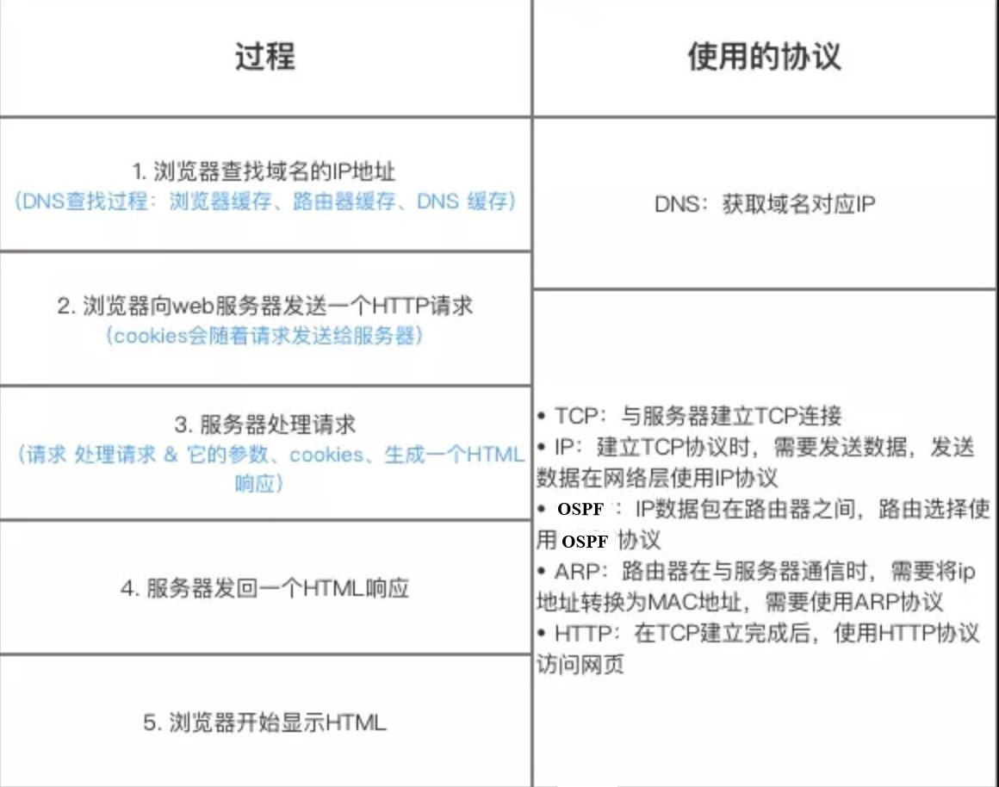

**总体步骤：**

- DNS解析：DNS解析是一个递归查询的过程。
- TCP连接
- 发送HTTP请求
- 服务处理请求并返回HTTP报文
- 游览器解析渲染页面
- 连接结束

[参考](https://segmentfault.com/a/1190000006879700)

**各种协议与HTTP协议之间的关系**

- HTTP协议的职责：生成针对目标Web服务器的HTTP请求报文
- TCP协议的职责：将HTTP请求报文分割成报文段，把每个报文段可靠的传给对方
- IP协议的职责：搜索对方的地址，一边中转一边传送
- TCP协议的职责：从对方那里接收到的报文段，按序号以原来的顺序重组请求报文
- HTTP协议的职责：对web服务器请求的内容的处理


### 2.HTTP状态码

|      | 类别                           | 原因                       |
| ---- | ------------------------------ | -------------------------- |
| 1XX  | Informational(信息性状态码)    | 接收的请求正在处理         |
| 2XX  | Success(成功状态码)            | 请求正常处理完毕           |
| 3XX  | Redirection(重定向状态码)      | 需要进行附加操作以完成请求 |
| 4XX  | Client Error(客户端错误状态码) | 服务器无法处理请求         |
| 5XX  | Server Error(服务器错误状态码) | 服务器处理请求出错         |

常用HTTP状态码：

| 2XX  | 成功（这系列表明请求被正常处理了）                     |
| ---- | ------------------------------------------------------ |
| 200  | OK，表示从客户端发来的请求在服务器端被正确处理         |
| 204  | No content，表示请求成功，但响应报文不含实体的主体部分 |
| 206  | Partial Content，进行范围请求成功                      |

| 3XX  | 重定向（表明浏览器要执行特殊处理）                           |
| ---- | ------------------------------------------------------------ |
| 301  | moved permanently，永久性重定向，表示资源已被分配了新的 URL  |
| 302  | found，临时性重定向，表示资源临时被分配了新的 URL            |
| 303  | see other，表示资源存在着另一个 URL，应使用 GET 方法获取资源（对于301/302/303响应，几乎所有浏览器都会删除报文主体并自动用GET重新请求） |
| 304  | not modified，表示服务器允许访问资源，但请求未满足条件的情况（与重定向无关） |
| 307  | temporary redirect，临时重定向，和302含义类似，但是期望客户端保持请求方法不变向新的地址发出请求 |

| 4XX  | 客户端错误                                                   |
| ---- | ------------------------------------------------------------ |
| 400  | bad request，请求报文存在语法错误                            |
| 401  | unauthorized，表示发送的请求需要有通过 HTTP 认证的认证信息   |
| 403  | forbidden，表示对请求资源的访问被服务器拒绝，可在实体主体部分返回原因描述 |
| 404  | not found，表示在服务器上没有找到请求的资源                  |

| 5XX  | 服务器错误                                                   |
| ---- | ------------------------------------------------------------ |
| 500  | internal sever error，表示服务器端在执行请求时发生了错误     |
| 501  | Not Implemented，表示服务器不支持当前请求所需要的某个功能    |
| 503  | service unavailable，表明服务器暂时处于超负载或正在停机维护，无法处理请求 |

### 3.常见状态码

- **200 OK: 从客户端发来的请求在服务器端被正常处理**
- 204 No Content：请求处理成功，但没有资源返回
- 400 Bad Request：客户端请求有语法错误，不能被服务器所理解
- 401 Unauthorized：请求未经授权，这个状态代码必须和www-authenticate报头域一起使用
- **403 Forbidden：服务器收到请求，但是拒绝提供服务**
- **404 Not Found：请求资源不存在**
- **500 Internal Server Error：服务器发生不可预期的错误**
- **503 Server Unavailable：服务器当前不能处理客户端的请求，一段时间可能恢复正常‘**

### 4.HTTP是不保存状态的协议,如何保存用户状态?

 **HTTP 是一种不保存状态，即无状态（stateless）协议**。也就是说 HTTP 协议自身不对请求和响应之间的通信状态进行保存。那么我们保存用户状态呢？**Session 机制**的存在就是为了解决这个问题，**Session 的主要作用就是通过服务端记录用户的状态**。典型的场景是购物车，当你要添加商品到购物车的时候，系统不知道是哪个用户操作的，因为 HTTP 协议是无状态的。**服务端给特定的用户创建特定的 Session 之后就可以标识这个用户并且跟踪这个用户了**（一般情况下，服务器会在一定时间内保存这个 Session，过了时间限制，就会销毁这个Session）。

在服务端保存 Session 的方法很多，最常用的就是内存和数据库(比如是使用内存数据库redis保存)。**既然 Session 存放在服务器端，那么我们如何实现 Session 跟踪呢？大部分情况下，我们都是通过在 Cookie 中附加一个 Session ID 来方式来跟踪**。

### 5.Get请求和Post请求的区别

> Get 和 Post是什么？  HTTP协议中的两种发送请求的方法
>
> HTTP是什么？ HTTP是基于TCP/IP的关于数据如何在万维网如何通信的协议。
>
> 在我大万维网世界中，TCP就像汽车，我们用TCP来运输数据，它很可靠，从来不会发生丢件少件的现象。但是如果路上跑的全是看起来一模一样的汽车，那这个世界看起来是一团混乱，送急件的汽车可能被前面满载货物的汽车拦堵在路上，整个交通系统一定会瘫痪。为了避免这种情况发生，交通规则HTTP诞生了。HTTP给汽车运输设定了好几个服务类别，有GET, POST, PUT, DELETE等等，HTTP规定，当执行GET请求的时候，要给汽车贴上GET的标签（设置method为GET），而且要求把传送的数据放在车顶上（url中）以方便记录。如果是POST请求，就要在车上贴上POST的标签，并把货物放在车厢里。当然，你也可以在GET的时候往车厢内偷偷藏点货物，但是这是很不光彩；也可以在POST的时候在车顶上也放一些数据，让人觉得傻乎乎的。HTTP只是个行为准则，而TCP才是GET和POST怎么实现的基本。


- **HTTP报文层面：Get将请求放在URL，POST放在报文体中**
- **数据库层面：GET符合幂等性；POST不符合（幂等性是同一个请求执行多次和仅执行一次的效果完全相等）**
- **其它层面：GET可以被缓存、被存储，而POST不行（get请求会保存在游览器历史记录，还可能保存在web服务器的日志中）**


1. Get是不安全的，因为在传输过程，数据被放在请求的URL中；Post的所有操作对用户来说都是不可见的。 但是这种做法也不时绝对的，大部分人的做法也是按照上面的说法来的，但是也可以在get请求加上 request body，给 post请求带上 URL 参数。

2. Get请求提交的url中的数据最多只能是2048字节，这个限制是浏览器或者服务器给添加的，http协议并没有对url长度进行限制，目的是为了保证服务器和浏览器能够正常运行，防止有人恶意发送请求。Post请求则没有大小限制。

3. Get限制Form表单的数据集的值必须为ASCII字符；而Post支持整个ISO10646字符集。

4. Get执行效率却比Post方法好。Get是form提交的默认方法。

5. GET产生一个TCP数据包；POST产生两个TCP数据包。

   对于GET方式的请求，浏览器会把http header和data一并发送出去，服务器响应200（返回数据）；

   而对于POST，浏览器先发送header，服务器响应100 continue，浏览器再发送data，服务器响应200 ok（返回数据）。

### 6.Cookie和Session的区别

cookie和session都是用来跟踪游览器身份的会话方式。但是两者的应用场景不太一样。

> Cookie简介：
>
> 服务器发给客户端的特殊信息，以文本的形式存放在客户端；
>
> 客户端再次请求的时候，会把cookie回发
>
> 服务器接收到，会解析cookie生成与客户端相对应的内容


> Session简介：
>
> 服务器端的机制，在服务器上保存的信息；
>
> 解析客户端请求并操作session id，按需保存状态信息。


> Cookie数据存放在客户的游览器上，session数据放在服务器上
>
> session相对于cookie更安全；若考虑减轻服务器负担，应当使用cookie
>
> **cookie一般用来保存用户信息，场景：自动登录** ； **session通过服务端记录用户的状态 场景：购物车**

###  7.http和https区别

>- **端口** ：HTTP的URL由“http://”起始且默认**使用端口80**，而HTTPS的URL由“https://”起始且默认**使用端口443**。
>
>- **安全性和资源消耗：** HTTP协议运行在**TCP**之上，所有传输的内容都是**明文**，客户端和服务器端都无法验证对方的身份。HTTPS是运行在**SSL/TLS**之上的HTTP协议，SSL/TLS 运行在**TCP**之上。所有传输的内容都经过加密，**加密采用对称加密**，但对称加密的密钥用服务器方的证书进行了**非对称加密**。所以说，HTTP 安全性没有 HTTPS高，但是 HTTPS 比HTTP耗费更多服务器资源。
> - 对称加密：密钥只有一个，加密解密为同一个密码，且加解密速度快，典型的对称加密算法有DES、AES等；
> - 非对称加密：密钥成对出现（且根据公钥无法推知私钥，根据私钥也无法推知公钥），加密解密使用不同密钥（公钥加密需要私钥解密，私钥加密需要公钥解密），相对对称加密速度较慢，典型的非对称加密算法有RSA、DSA等。

HTTP 是一个在计算机世界里专门在两点之间传输文字、图片、音频、视频等超文本数据的约定和规范

| 区别     | HTTP                                                         | HTTPS                                                        |
| -------- | ------------------------------------------------------------ | ------------------------------------------------------------ |
| 协议     | 运行在 TCP 之上，明文传输，**客户端与服务器端都无法验证对方的身份** | 身披 SSL( Secure Socket Layer )外壳的 HTTP，运行于 SSL 上，SSL 运行于 TCP 之上， **是添加了加密和认证机制的 HTTP**。 |
| 端口     | 80                                                           | 443                                                          |
| 资源消耗 | 较少                                                         | 由于加解密处理，会消耗更多的 CPU 和内存资源                  |
| 开销     | 无需证书                                                     | 需要证书，而证书一般需要向认证机构购买                       |
| 加密机制 | 无                                                           | 共享密钥加密和公开密钥加密并用的混合加密机制                 |
| 安全性   | 弱                                                           | 由于加密机制，安全性强                                       |

### 8.什么是对称加密与非对称加密

对称密钥加密是指加密和解密使用同一个密钥的方式，**这种方式存在的最大问题就是密钥发送问题，即如何安全地将密钥发给对方；**

而非对称加密是指使用一对非对称密钥，即公钥和私钥，公钥可以随意发布，但私钥只有自己知道。**发送密文的一方使用对方的公钥进行加密处理，对方接收到加密信息后，使用自己的私钥进行解密。**
由于非对称加密的方式不需要发送用来解密的私钥，所以可以保证安全性；但是和对称加密比起来，非常的慢


### 9.Session、Cookie和Token的主要区别

HTTP协议本身是无状态的。什么是无状态呢，即服务器无法判断用户身份。

**什么是cookie**

**cookie是由Web服务器保存在用户浏览器上的小文件（key-value格式）**，包含**用户相关的信息**。客户端向服务器发起请求，如果服务器需要记录该用户状态，就使用response向客户端浏览器颁发一个Cookie。客户端浏览器会把Cookie保存起来。当浏览器再请求该网站时，浏览器把请求的网址连同该Cookie一同提交给服务器。服务器检查该Cookie，以此来辨认用户身份。

**什么是session**

session是依赖Cookie实现的。session是服务器端对象

session 是浏览器和服务器会话过程中，服务器分配的一块储存空间。**服务器默认为浏览器在cookie中设置 sessionid，浏览器在向服务器请求过程中传输 cookie 包含 sessionid ，服务器根据 sessionid 获取出会话中存储的信息，然后确定会话的身份信息**。

**cookie与session区别**

- 存储位置与安全性：cookie数据存放在客户端上，安全性较差，session数据放在服务器上，安全性相对更高；
- 存储空间：单个cookie保存的数据不能超过4K，很多浏览器都限制一个站点最多保存20个cookie，session无此限制
- 占用服务器资源：session一定时间内保存在服务器上，当访问增多，占用服务器性能，考虑到服务器性能方面，应当使用cookie。

**什么是Token**

Token的引入：Token是在**客户端频繁向服务端请求数据，服务端频繁的去数据库查询用户名和密码并进行对比，判断用户名和密码正确与否，并作出相应提示，在这样的背景下，Token便应运而生。**

Token的定义：Token是服务端生成的一串字符串，以作客户端进行请求的一个令牌，当第一次登录后，服务器生成一个Token便将此Token返回给客户端，以后客户端只需带上这个Token前来请求数据即可，无需再次带上用户名和密码。

使用Token的目的：Token的目的是为了减轻服务器的压力，减少频繁的查询数据库，使服务器更加健壮。

Token 是在服务端产生的。如果前端使用用户名/密码向服务端请求认证，服务端认证成功，那么在服务端会返回 Token 给前端。前端可以在每次请求的时候带上 Token 证明自己的合法地位

**session与token区别**

- session机制存在服务器压力增大，CSRF跨站伪造请求攻击，扩展性不强等问题；
- session存储在服务器端，token存储在客户端
- token提供认证和授权功能，作为身份认证，token安全性比session好；
- session这种会话存储方式方式只适用于客户端代码和服务端代码运行在同一台服务器上，token适用于项目级的前后端分离（前后端代码运行在不同的服务器下）

## 六、Socket简介

> 两个进程能够进行通讯的办法是在网络中唯一的标识的一个进程。而在网络中唯一的标识一个进程的方法是：标出ip地址+协议+端口号。

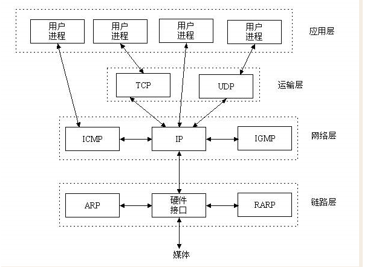

> Socket是应用层与TCP/IP协议通信的中间软件抽象层，它是一组接口，Socket把复杂的TCP/IP协议隐藏到socket接口后面。对用户来讲，一组简单的接口就是全部，让socket去组织数据以符合指定的协议。我们无需深入去理解tcp/udp协议，只需遵循socket的规定去编程，写出的程序自然遵循tcp/udp标准的。


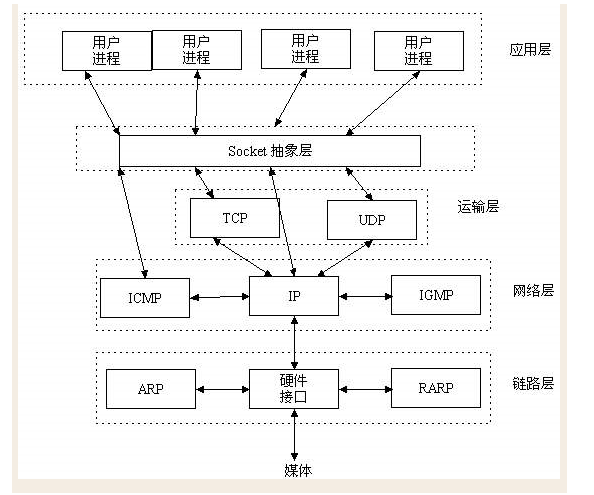

### 1.TCP、UDP通信的socket编程过程图

**(1)TCP通信socket编程过程**

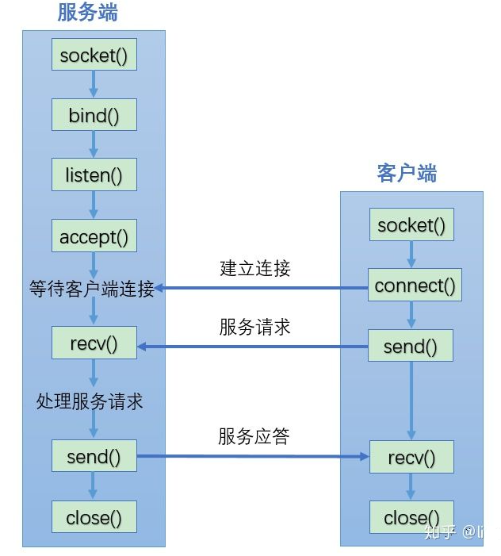


**(2)UDP通信socket编程过程**

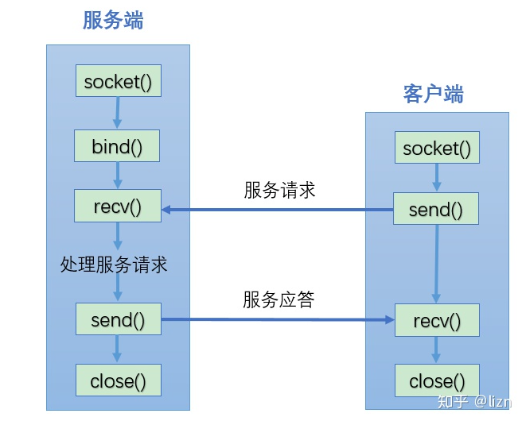

### 2.Servlet是线程安全的吗

**Servlet不是线程安全的，多线程并发的读写会导致数据不同步的问题。**

解决的办法是尽量不要定义name属性，而是要把name变量分别定义在doGet()和doPost()方法内。虽然使用synchronized(name){}语句块可以解决问题，但是会造成线程的等待，不是很科学的办法。

注意：多线程的并发的读写Servlet类属性会导致数据不同步。但是如果只是并发地读取属性而不写入，则不存在数据不同步的问题。因此Servlet里的只读属性最好定义为final类型的。

### 3.Servlet接口中有哪些方法及Servlet生命周期探秘

在Java Web程序中，**Servlet**主要负责接收用户请求**HttpServletRequest**，在**doGet()**，**doPost()\**中做相应的处理，并将回应\**HttpServletResponse**反馈给用户。Servlet可以设置初始化参数，供Servlet内部使用。

Servlet接口定义了5个方法，其中**前三个方法与Servlet生命周期相关**：

- **void init(ServletConfig config) throws ServletException**
- **void service(ServletRequest req, ServletResponse resp) throws ServletException, java.io.IOException**
- **void destory()**
- java.lang.String getServletInfo()
- ServletConfig getServletConfig()

**生命周期：**

**Web容器加载Servlet并将其实例化后，Servlet生命周期开始**，容器运行其**init()方法**进行Servlet的初始化；

请求到达时调用Servlet的**service()方法**，service()方法会根据需要调用与请求对应的**doGet或doPost**等方法；

当服务器关闭或项目被卸载时服务器会将Servlet实例销毁，此时会调用Servlet的**destroy()方法**。

**init方法和destory方法只会执行一次，service方法客户端每次请求Servlet都会执行**。Servlet中有时会用到一些需要初始化与销毁的资源，因此可以把初始化资源的代码放入init方法中，销毁资源的代码放入destroy方法中，这样就不需要每次处理客户端的请求都要初始化与销毁资源。

### 4.如果客户端禁止 cookie 能实现 session 还能用吗？

**Cookie 与 Session，一般认为是两个独立的东西，Session采用的是在服务器端保持状态的方案，而Cookie采用的是在客户端保持状态的方案。**

**但为什么禁用Cookie就不能得到Session呢？因为Session是用Session ID来确定当前对话所对应的服务器Session，而Session ID是通过Cookie来传递的，禁用Cookie相当于失去了Session ID，也就得不到Session了。**

假定用户关闭Cookie的情况下使用Session，其实现途径有以下几种：

1. **手动通过URL传值、隐藏表单传递Session ID**。
2. **用文件、数据库等形式保存Session ID，在跨页过程中手动调用**。

### 5.socket编程题

> 编写一个网络应用程序，有客户端与服务器端，客户端向服务器发送一个字符串，服务端收到该字符串后将其打印到命令行上，然后向客户端返回该字符串的长度，最后，客户端输出服务器端返回的该字符串的长度，分别用TCP和UDP两种方式去实现。

**a.LengthCalculator.java**

```java
package com.interview.javabasic.socket;

import java.io.IOException;
import java.io.InputStream;
import java.io.OutputStream;
import java.net.Socket;

public class LengthCalculator  extends  Thread{
    // 以socket为成员变量
    private Socket socket;

    // 有参构造方法
    public LengthCalculator(Socket socket) {
        this.socket = socket;
    }

    @Override
    public void run() {

        try {
            // 获取socket的输出流
            OutputStream os = socket.getOutputStream();
            // 获取socket的输入流
            InputStream is = socket.getInputStream();
            // ch用来读取数组的长度 buff用来读取输入的内容
            int ch = 0;
            byte[] buff = new byte[1024];

            ch = is.read(buff);
            String content = new String(buff,0,ch);
            System.out.println(content);

            // 往输出流里写入获得的字符串长度
            os.write(String.valueOf(content.length()).getBytes());

            is.close();
            os.close();
            socket.close();


        } catch (IOException e) {
            e.printStackTrace();
        }
    }
}
```

**b.TCPServer.java**

```java
package com.interview.javabasic.socket;

import java.io.IOException;
import java.net.ServerSocket;
import java.net.Socket;

public class TCPServer {
    public static void main(String[] args) throws IOException {
        // 创建socket，并将socket绑定到65000端口
        ServerSocket ss = new ServerSocket(65000);
        while(true){
            Socket socket = ss.accept();
            //  获取客户端请求后 ,执行相关业务逻辑
            new LengthCalculator(socket).start();
        }
    }
}
```

**c.TCPClient.java**

```java
package com.interview.javabasic.socket;


import java.io.IOException;
import java.io.InputStream;
import java.io.OutputStream;
import java.net.Socket;

public class TCPClient {
    public static void main(String[] args) throws IOException {
        // 创建socket
        Socket socket = new Socket("127.0.0.1",65000);
        // 获取输出流
        OutputStream os = socket.getOutputStream();
        // 获取输入流
        InputStream is = socket.getInputStream();
        // 将要传递的server字符串转换byte数组中
        os.write(new String("hello world").getBytes());


        int ch = 0;
        byte[] buff = new byte[1024];
        //buff主要用来读取输入的内容，存成byte数组，ch主要用来获取读取数组的长度
        ch = is.read(buff);
        //将接收流的byte数组转换成字符串，这里是从服务端回发回来的字符串参数的长度
        String content = new String(buff, 0, ch);
        System.out.println(content);
        //不要忘记关闭输入输出流以及socket
        is.close();
        os.close();
        socket.close();
    }
}
```

**d.UDPServer.java**

```java
package com.interview.javabasic.socket;
import java.net.DatagramPacket;
import java.net.DatagramSocket;

public class UDPServer {
    public static void main(String[] args) throws Exception {
        // 服务端接受客户端发送的数据报
        //监听的端口号
        DatagramSocket socket = new DatagramSocket(65001);
        //存储从客户端接受到的内容
        byte[] buff = new byte[100];
        DatagramPacket packet = new DatagramPacket(buff, buff.length);
        //接受客户端发送过来的内容，并将内容封装进DatagramPacket对象中
        socket.receive(packet);
        //从DatagramPacket对象中获取到真正存储的数据
        byte[] data = packet.getData();
        //将数据从二进制转换成字符串形式
        String content = new String(data, 0, packet.getLength());
        System.out.println(content);
        //将要发送给客户端的数据转换成二进制
        byte[] sendedContent = String.valueOf(content.length()).getBytes();
        // 服务端给客户端发送数据报
        //从DatagramPacket对象中获取到数据的来源地址与端口号
        DatagramPacket packetToClient = new DatagramPacket(sendedContent,
                sendedContent.length, packet.getAddress(), packet.getPort());
        //发送数据给客户端
        socket.send(packetToClient);
    }
}
```


**e.UDPClient.java**

```java
package com.interview.javabasic.socket;
import java.net.DatagramPacket;
import java.net.DatagramSocket;
import java.net.InetAddress;

public class UDPClient {
    public static void main(String[] args) throws Exception {
        // 客户端发数据报给服务端
        DatagramSocket socket = new DatagramSocket();
        // 要发送给服务端的数据
        byte[] buf = "Hello World".getBytes();
        // 将IP地址封装成InetAddress对象
        InetAddress address = InetAddress.getByName("127.0.0.1");
        // 将要发送给服务端的数据封装成DatagramPacket对象 需要填写上ip地址与端口号
        DatagramPacket packet = new DatagramPacket(buf, buf.length, address,
                65001);
        // 发送数据给服务端
        socket.send(packet);

        // 客户端接受服务端发送过来的数据报
        byte[] data = new byte[100];
        // 创建DatagramPacket对象用来存储服务端发送过来的数据
        DatagramPacket receivedPacket = new DatagramPacket(data, data.length);
        // 将接受到的数据存储到DatagramPacket对象中
        socket.receive(receivedPacket);
        // 将服务器端发送过来的数据取出来并打印到控制台
        String content = new String(receivedPacket.getData(), 0,
                receivedPacket.getLength());
        System.out.println(content);

    }

}
```


## 七、高频面试题


### 1.什么是HTTP，HTTP 与 HTTPS 的区别

HTTP是一个在计算机世界里专门在两点之间传输文字、图片、音频、视频等超文本数据的约定和规范。

| 区别     | HTTP                                                         | HTTPS                                                        |
| -------- | ------------------------------------------------------------ | ------------------------------------------------------------ |
| **协议** | 运行在 **TCP** 之上，明文传输，**客户端与服务器端都无法验证对方的身份** | 身披 **SSL**( Secure Socket Layer )外壳的 HTTP，运行于 SSL 上，SSL 运行于 **TCP** 之上， **是添加了加密和认证机制的 HTTP**。 |
| **端口** | **80**                                                       | **443**                                                      |
| 资源消耗 | 较少                                                         | 由于加解密处理，会消耗更多的 CPU 和内存资源                  |
| **开销** | 无需证书                                                     | 需要证书，而证书一般需要向认证机构购买                       |
| 加密机制 | 无                                                           | 共享密钥加密和公开密钥加密并用的混合加密机制                 |
| 安全性   | 弱                                                           | 由于加密机制，安全性强                                       |

## 七、计算机网络面试高频点思维导图

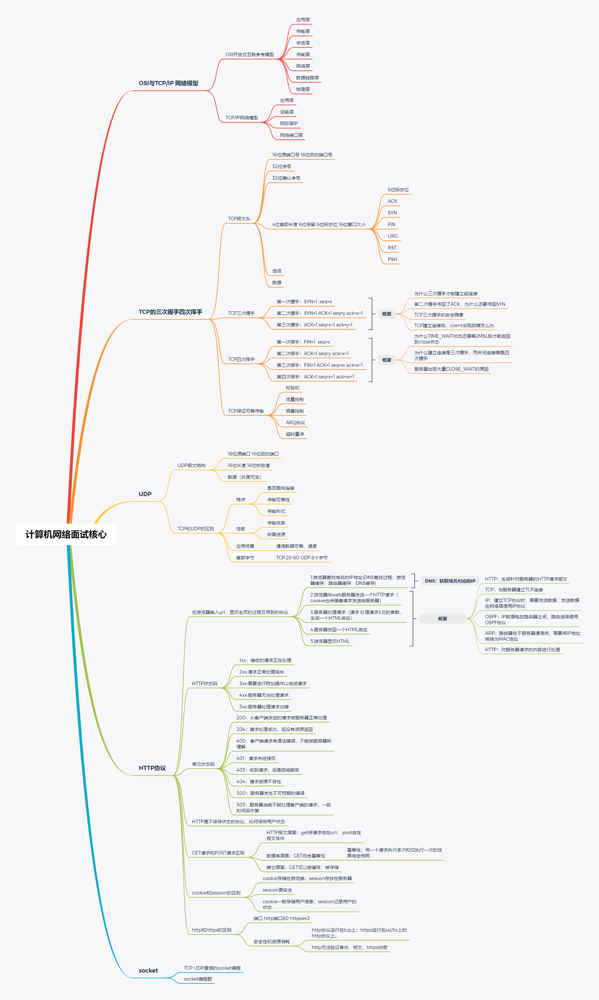

