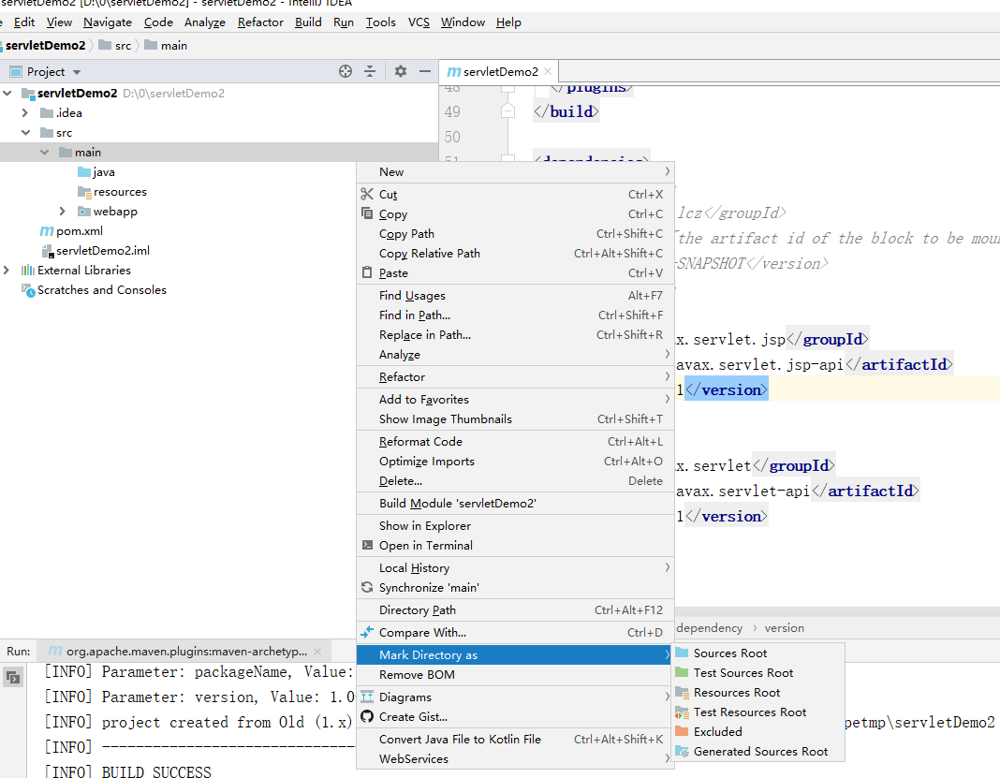
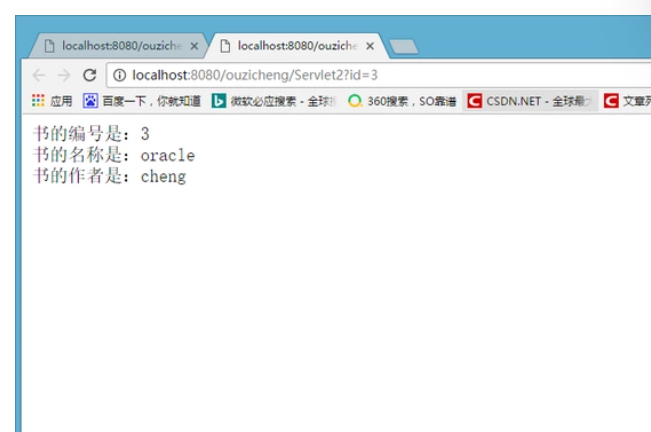

# 三、[【Java网络编程与IO流】Java之Java Servlet详解](https://codingchaozhang.blog.csdn.net/article/details/110877006)

### 1.JSP和servlet的区别是什么

**基本介绍**

**Servlet是一种服务端的Java应用程序**，具有独立于平台和协议的特性，可以生成动态的Web页面。它担当客户请求（web游览器或其它的HTTP客户程序）与服务器响应（HTTP服务器上的数据库或应用程序）的中间层。Servlet是位于服务器内部的服务器端的Java应用程序。与**传统的命令行启动的Java应用程序不同，Servlet由web服务器进行加载，该web服务器必须包含支持servlet的Java虚拟机**

**JSP**全称为Java Server Pages，中文名叫Java服务器页面，其本质上是一个**简化的Servlet设计**。JSP是一种动态页面技术，它的主要目的是讲**表示逻辑从servlet中分离出来**。

**相同点**

JSP经过编译后就编程了Servlet，JSP本质上是Servlet，**JVM只能识别Java的类**，不能识别jsp代码，**web容器将jsp的代码编译成jvm能识别的Java类。**

> 其实就是当你通过 http 请求一个 JSP 页面是，首先 Tomcat 会调用 service（）方法将JSP编译成为 Servlet，然后执行 Servlet。

**详细理解：**当服务器启动后，当Web浏览器端发送过来一个页面请求时，Web服务器先判断是否是JSP页面请求。如果该页面只是一般的HTML/XML页面请求，则直接将HTML/XML页面代码传给Web浏览器端。如果请求的页面是JSP页面，则由JSP引擎检查该JSP页面，如果该页面是第一次被请求、或不是第一次被请求但已被修改，则JSP引擎将此JSP页面代码转换成Servlet代码，然后JSP引擎调用服务器端的Java编译器javac.exe对Servlet代码进行编译，把它变成字节码(.class)文件，然后再调用JAVA虚拟机执行该字节码文件，然后将执行结果传给Web浏览器端。如果该JSP页面不是第一次被请求，且没有被修改过，则直接由JSP引擎调用JAVA虚拟机执行已编译过的字节码.class文件，然后将结果传送Web浏览器端。


**不同点**

- **JSP侧重视图**；**Servlet主要用于控制逻辑**；
- **JSP在静态HTML内容嵌入Java代码**；**Java代码被动态执行后生成HTML内容**；
- Servlet在Java代码中通过HTTPServletResponse对象动态输出HTML内容；

**各自的特点**

- Servt能够很好的组织业务逻辑代码，但是在Java源文件中通过字符串拼接的方式生成动态HTML内容会导致代码维护困难、可读性差
- JSP虽然规避了Servlet在生成HTML内容方面的劣势，但是在HTML中混入大量、复杂的业务逻辑同样也是不可取的。

**通过MVC双剑合璧**

既然JSP和Servlet都有自身的适用环境，那么能否扬长避短，让它们发挥各自的优势呢？**MVC(Model-View-Controller)**模式非常适合解决这一问题。

**MVC模式(Model-View-Controller)**是软件工程中一种软件架构模式，把软件系统分为三个基本部分：模型(Model)、视图(View)和控制器(Controller)：

- Controller：负责转发请求，对请求进行处理；
- View：负责业务显示
- Model：业功能编写(算法实现)、数据库设计以及数据存取操作实现

在JSP/Servlet开发的软件系统中，这三个部分的描述如下所示：


- Web游览器发送HTTP请求到服务端，被Controller(Servlet)获取并进行处理；
- Controller(Servlet)调用核心业务逻辑-Model部分，获得结果；
- Controller(Servlet)将逻辑处理结果交给View(JSP)，动态输出HTML内容；
- 动态生成的HTML内容返回到游览器显示。


### 二、Servlet

#### 2.1.Servlet简要介绍

> Servlet就是一个遵循Servlet开发的Java类。由服务器调用，运行在服务器端。主要应用在聊天、发帖这样的交互功能上。

##### 1.HTTP协议

> 超文本传输协议(HTTP,HyperText Transfer Protocal)是互联网上应用最为广泛的一种网络协议。**HTTP协议就是客户端和服务器端交换的一种通讯的格式。**

具体：当你在游览器中点击这个链接的时候，**游览器会向服务器发送一段文本，告诉服务器请求打开的是哪一个网页。服务器收到请求后，就返回一段文本给游览器，游览器会将该文本解析，然后显示出来。**

**HTTP1.0和HTTP1.1的区别**

- HTTP1.0协议中，客户端与web服务器建立连接后，只能获得一个web资源。(短连接，获取资源后就断开连接)；
- HTTP1.1协议中，允许客户端与web服务建立连接后，在一个连接上获取多个web资源。(长连接，保持连接)；

##### 2.HTTP请求

**游览器向服务器请求某个web资源时，称之为游览器向服务器发送了一个http请求。**

一个完整的http请求应该如下所示：

- **状态行（请求行）**
- **消息报头(请求头)**
- **空行**
- **响应正文(请求数据)**


**请求行**

> GET /index.html HTTP/1.1(描述客户端的请求方式、请求的资源名称，以及使用的HTTP协议版本号)

- 请求行中的GET为请求方式。常见的请求方式为：


**请求头**

> 描述客户端的一些环境信息。
>
> 请求头部由关键字/值对组成，每行一对，关键字和值用英文冒号“:”分隔。请求头部通知服务器有关于客户端请求的信息，典型的请求头有：
>
> - Accept: text/html,image/* 【浏览器告诉服务器，它支持的数据类型】
> - Accept-Charset: ISO-8859-1 【浏览器告诉服务器，它支持哪种**字符集**】
> - Accept-Encoding: gzip,compress 【浏览器告诉服务器，它支持的**压缩格式**】
> - Accept-Language: en-us,zh-cn 【浏览器告诉服务器，它的语言环境】
> - Host: www.it315.org:80【浏览器告诉服务器，它的想访问哪台主机】
> - If-Modified-Since: Tue, 11 Jul 2000 18:23:51 GMT【浏览器告诉服务器，缓存数据的时间】
> - Referer: http://www.it315.org/index.jsp【浏览器告诉服务器，客户机是从那个页面来的---**反盗链**】
> - 8.User-Agent: Mozilla/4.0 (compatible; MSIE 5.5; Windows NT 5.0)【浏览器告诉服务器，浏览器的内核是什么】
> - Cookie【浏览器告诉服务器，**带来的Cookie是什么**】
> - Connection: close/Keep-Alive 【浏览器告诉服务器，请求完后是断开链接还是保持链接】
> - Date: Tue, 11 Jul 2000 18:23:51 GMT【浏览器告诉服务器，请求的时间】

**请求正文**

请求数据不再GET方法中使用，而是在POST方法中使用。与请求数据相关的最常使用的请求头是Content-Type和Content-Length。

##### 3.HTTP响应

**服务器向游览器回送数据称之为一个HTTP响应。**

一个完整的HTTP响应应该如下所示：

- 状态行（响应行）【用于描述服务器对请求的处理结果】
- 消息报头(响应头)  【用于描述服务器的基本信息，以及数据的描述】
- 一个空行
- 实体内容【服务器向客户端回送的数据】

**状态行**

格式： HTTP版本号　状态码　原因叙述

状态行：HTTP/1.1 200 OK

状态码用于表示**服务器对请求的处理结果**，它是一个**三位的十进制数**。响应状态码分为5类


**响应头**

> 描述服务器端的一些环境信息。
>
> 响应头部由关键字/值对组成，每行一对，关键字和值用英文冒号“:”分隔。典型的响应头有：
>
> - ocation: http://www.it315.org/index.jsp 【服务器告诉浏览器**要跳转到哪个页面**】
> - Server:apache tomcat【服务器告诉浏览器，服务器的型号是什么】
> - Content-Encoding: gzip 【服务器告诉浏览器**数据压缩的格式**】
> - Content-Length: 80 【服务器告诉浏览器回送数据的长度】
> - Content-Language: zh-cn 【服务器告诉浏览器，服务器的语言环境】
> - Content-Type: text/html; charset=GB2312 【服务器告诉浏览器，**回送数据的类型**】
> - Last-Modified: Tue, 11 Jul 2000 18:23:51 GMT【服务器告诉浏览器该资源上次更新时间】
> - Refresh: 1;url=[http://www.it315.org](http://www.it315.org/)【服务器告诉浏览器要**定时刷新**】
> - Content-Disposition: attachment; filename=aaa.zip【服务器告诉浏览器**以下载方式打开数据**】
> - Transfer-Encoding: chunked 【服务器告诉浏览器数据以分块方式回送】
> - Set-Cookie:SS=Q0=5Lb_nQ; path=/search【服务器告诉浏览器要**保存Cookie**】
> - Expires: -1【服务器告诉浏览器**不要设置缓存**】
> - Cache-Control: no-cache 【服务器告诉浏览器**不要设置缓存**】
> - Pragma: no-cache 【服务器告诉浏览器**不要设置缓存**】
> - Connection: close/Keep-Alive 【服务器告诉浏览器连接方式】
> - Date: Tue, 11 Jul 2000 18:23:51 GMT【服务器告诉浏览器回送数据的时间】

#### 2.2 Servlet的作用

> **Servlet的作用就是能够处理游览器带来的HTTP请求，并返回一个响应给游览器，从而实现游览器和服务器的交互。**

#### 2.3 Servlet的Demo

##### 1.实现Servlet接口编写Servlet程序

在IDEA中用Maven，选择webapp来创建


在pom.xml中引入依赖

```xml
 <dependencies>

    <dependency>
      <groupId>javax.servlet.jsp</groupId>
      <artifactId>javax.servlet.jsp-api</artifactId>
      <version>2.3.1</version>
    </dependency>
    <dependency>
      <groupId>javax.servlet</groupId>
      <artifactId>javax.servlet-api</artifactId>
      <version>4.0.1</version>
    </dependency>
  </dependencies>
```

创建java文件夹，并mark directory as sources root.



编写MyServlet.java程序文件，在service中编写代码

```java
package com.lcz;

import javax.servlet.*;
import java.io.IOException;

public class MyServlet implements Servlet {
    public void init(ServletConfig servletConfig) throws ServletException {

    }

    public ServletConfig getServletConfig() {
        return null;
    }
    // 逻辑代码
    public void service(ServletRequest servletRequest, ServletResponse servletResponse) throws ServletException, IOException {
        servletResponse.getWriter().write("helloworld");
    }

    public String getServletInfo() {
        return null;
    }

    public void destroy() {

    }
}

```


在web.xml中编写配置文件信息，即注册servlet，并将url映射到servlet上

```xml
<?xml version="1.0" encoding="UTF-8"?>
<!--
  Licensed to the Apache Software Foundation (ASF) under one or more
  contributor license agreements.  See the NOTICE file distributed with
  this work for additional information regarding copyright ownership.
  The ASF licenses this file to You under the Apache License, Version 2.0
  (the "License"); you may not use this file except in compliance with
  the License.  You may obtain a copy of the License at

      http://www.apache.org/licenses/LICENSE-2.0

  Unless required by applicable law or agreed to in writing, software
  distributed under the License is distributed on an "AS IS" BASIS,
  WITHOUT WARRANTIES OR CONDITIONS OF ANY KIND, either express or implied.
  See the License for the specific language governing permissions and
  limitations under the License.
-->

<!--
  - This is the Cocoon web-app configurations file
  -
  - $Id$
  -->
<web-app version="2.4"
         xmlns="http://java.sun.com/xml/ns/j2ee"
         xmlns:xsi="http://www.w3.org/2001/XMLSchema-instance"
         xsi:schemaLocation="http://java.sun.com/xml/ns/j2ee http://java.sun.com/xml/ns/j2ee/web-app_2_4.xsd">

  <!-- Servlet Filters ================================================ -->


  <!--注册servlet-->
  <servlet>
    <servlet-name>MyServlet</servlet-name>
    <servlet-class>com.lcz.MyServlet</servlet-class>
  </servlet>
  <!--配置servlet的映射路径-->
  <servlet-mapping>
    <servlet-name>MyServlet</servlet-name>
    <url-pattern>/hello</url-pattern>
  </servlet-mapping>
  <!-- URL space mappings ============================================= -->

  <!--
    - Cocoon handles all the URL space assigned to the webapp using its sitemap.
    - It is recommended to leave it unchanged. Under some circumstances though
    - (like integration with proprietary webapps or servlets) you might have
    - to change this parameter.
    -->


</web-app>
        
```

配置tomcat相关的信息，然后启动tomcat


在游览器输入，即可得到以下


##### 2.Servlet生命周期

- **加载Servlet**。当Tomcat第一次访问Servlet的时候，**Tomcat会负责创建Servlet的实例**
- **初始化**。当Servlet被实例化后，Tomcat会**调用init()方法初始化这个对象
- **处理服务**。当浏览器**访问Servlet**的时候，Servlet **会调用service()方法处理请求**
- **销毁**。当Tomcat关闭时或者检测到Servlet要从Tomcat删除的时候会自动调用destroy()方法，**让该实例释放掉所占的资源**。一个Servlet如果长时间不被使用的话，也会被Tomcat自动销毁

- **卸载**。当Servlet调用完destroy()方法后，等待垃圾回收。如果**有需要再次使用这个Servlet，会重新调用init()方法进行初始化操作**。

##### 3.继承HttpServlet编写Servlet程序

```java
package com.lcz;

import javax.servlet.*;
import javax.servlet.http.HttpServlet;
import javax.servlet.http.HttpServletRequest;
import javax.servlet.http.HttpServletResponse;
import java.io.IOException;

public class MyServlet extends HttpServlet {
    @Override
    protected void doPost(HttpServletRequest req, HttpServletResponse resp) throws ServletException, IOException {
        resp.getWriter().write("hello httpservlet");
    }

    @Override
    protected void doGet(HttpServletRequest req, HttpServletResponse resp) throws ServletException, IOException {
        this.doPost(req,resp);
    }
}

```


#### 2.4 Servlet是单例模式

**浏览器多次对Servlet的请求**，一般情况下，**服务器只创建一个Servlet对象**，也就是说，Servlet对象**一旦创建了**，就会**驻留在内存中，为后续的请求做服务，直到服务器关闭**。

**每次访问请求对象和响应对象都是新的**

对于**每次访问请求**，Servlet引擎都会**创建一个新的HttpServletRequest请求对象和一个新的HttpServletResponse响应对象**，然后将这两**个对象作为参数传递给它调用的Servlet的service()方法**，**service方法再根据请求方式分别调用doXXX方法**。

**线程安全问题**

当多个用户访问Servlet的时候，**服务器会为每个用户创建一个线程**。**当多个用户并发访问Servlet共享资源的时候就会出现线程安全问题**。


#### 2.5 HttpServletResponse的应用

##### 1.HttpServletResponse向游览器输出数据

###### (1)调用getOutStream()方法向游览器输出数据

```java
package com.lcz;

import javax.servlet.*;
import javax.servlet.http.HttpServlet;
import javax.servlet.http.HttpServletRequest;
import javax.servlet.http.HttpServletResponse;
import java.io.IOException;

public class MyServlet extends HttpServlet {
    @Override
    protected void doPost(HttpServletRequest req, HttpServletResponse resp) throws ServletException, IOException {
        // 设置头信息，告诉游览器回送的数据编码是utf-8 游览器默认编码iso
        resp.setHeader("Content-Type","text/html;charset=UTF-8");
//        resp.getWriter().write("hello httpservlet");
        // 默认编码是iso
        resp.getOutputStream().write("你好呀".getBytes("UTF-8"));
    }

    @Override
    protected void doGet(HttpServletRequest req, HttpServletResponse resp) throws ServletException, IOException {
        this.doPost(req,resp);
    }
}

```


###### (2)调用getWriter()向游览器输出数据

- 对于getWriter()方法而言，是Writer的子类，那么**只能向浏览器输出字符数据，不能输出二进制数据**

```java
package com.lcz;

import javax.servlet.*;
import javax.servlet.http.HttpServlet;
import javax.servlet.http.HttpServletRequest;
import javax.servlet.http.HttpServletResponse;
import java.io.IOException;

public class MyServlet extends HttpServlet {
    @Override
    protected void doPost(HttpServletRequest req, HttpServletResponse resp) throws ServletException, IOException {
        // 设置头信息，告诉游览器回送的数据编码是utf-8 游览器默认编码iso
        resp.setHeader("Content-Type","text/html;charset=UTF-8");
        resp.getWriter().write("你好呀");
    }

    @Override
    protected void doGet(HttpServletRequest req, HttpServletResponse resp) throws ServletException, IOException {
        this.doPost(req,resp);
    }
}

```

##### 2.HttpServletResponse实现文件下载操作

```java
package com.lcz;

import javax.servlet.*;
import javax.servlet.http.HttpServlet;
import javax.servlet.http.HttpServletRequest;
import javax.servlet.http.HttpServletResponse;
import java.io.FileInputStream;
import java.io.IOException;
import java.net.URLEncoder;

public class MyServlet extends HttpServlet {
    @Override
    protected void doPost(HttpServletRequest req, HttpServletResponse resp) throws ServletException, IOException {
        // 获取到资源的路径
        String path = this.getServletContext().getRealPath("/download/lcz.jpg");

        // 读取资源
        FileInputStream fileInputStream = new FileInputStream(path);
        // 获取到文件名路径在电脑上保存是\\形式的。
        String fileName = path.substring(path.lastIndexOf("\\") + 1);
        System.out.println(fileName);

        //设置消息头，告诉浏览器，我要下载1.png这个图片
        resp.setHeader("Content-Disposition", "attachment; filename="+fileName);
        // 为了解决文件名乱码，要进行URL编码
        resp.setHeader("Content-Disposition", "attachment; filename=" + URLEncoder.encode(fileName, "UTF-8"));

        //把读取到的资源写给浏览器
        int len = 0;
        byte[] bytes = new byte[1024];
        ServletOutputStream servletOutputStream = resp.getOutputStream();

        while ((len = fileInputStream.read(bytes)) > 0) {
            servletOutputStream.write(bytes, 0, len);
        }

        //关闭资源
        servletOutputStream.close();
        fileInputStream.close();

    }

    @Override
    protected void doGet(HttpServletRequest req, HttpServletResponse resp) throws ServletException, IOException {
        this.doPost(req,resp);
    }
}

```


##### 3.HttpServletResponse实现自动刷新

```java
package com.lcz;

import javax.servlet.*;
import javax.servlet.http.HttpServlet;
import javax.servlet.http.HttpServletRequest;
import javax.servlet.http.HttpServletResponse;
import java.io.FileInputStream;
import java.io.IOException;
import java.net.URLEncoder;

public class MyServlet extends HttpServlet {
    @Override
    protected void doPost(HttpServletRequest req, HttpServletResponse resp) throws ServletException, IOException {
        //每3秒自动刷新网页一次
        resp.setHeader("Refresh", "3");
        resp.getWriter().write("time is :" + System.currentTimeMillis());

    }

    @Override
    protected void doGet(HttpServletRequest req, HttpServletResponse resp) throws ServletException, IOException {
        this.doPost(req,resp);
    }
}

```


##### 4.HttpServletResponse实现数据压缩

网页上的信息量是很大的，如果**不将数据压缩再回送给浏览器，这样就十分耗费流量**

 

```java
package com.lcz;

import javax.servlet.*;
import javax.servlet.http.HttpServlet;
import javax.servlet.http.HttpServletRequest;
import javax.servlet.http.HttpServletResponse;
import java.io.FileInputStream;
import java.io.IOException;
import java.net.URLEncoder;

public class MyServlet extends HttpServlet {
    @Override
    protected void doPost(HttpServletRequest req, HttpServletResponse resp) throws ServletException, IOException {
        resp.setContentType("text/html;charset=UTF-8");

        String ss = "fsdfhsdfhuisdhfusdhfuids" +
                "fsdfdsfsdfsdfdsfdafdsfhsdjfhsdjkfhkjds" +
                "fdsfjdslkfjsldkfjsdlkfjsdkfsdjkff" +
                "fsjdfjdsklfjdsklfjkldsfjlksdjflksdjflkds" +
                "dsjfklsdjflsdjfkldsfkjsdkfjsldkfjsdlfk" +
                "fdsjlkfjdslkfjsdlkfjlkasjflk";
        resp.getWriter().write("原来的长度是："+ss.getBytes().length+"</br>");

        //输出给浏览器
        resp.getWriter().write(ss);


    }

    @Override
    protected void doGet(HttpServletRequest req, HttpServletResponse resp) throws ServletException, IOException {
        this.doPost(req,resp);
    }
}

```


压缩的原理是什么？我们知道**getOutputStream()和getWriter()都是直接把数据输出给浏览器的**。现在我要做的就是**让数据不直接输出给浏览器，先让我压缩了，再输出给浏览器**。**java提供了GZIP压缩类给我们**

```java
package com.lcz;

import javax.servlet.*;
import javax.servlet.http.HttpServlet;
import javax.servlet.http.HttpServletRequest;
import javax.servlet.http.HttpServletResponse;
import java.io.ByteArrayOutputStream;
import java.io.FileInputStream;
import java.io.IOException;
import java.net.URLEncoder;
import java.util.zip.GZIPOutputStream;

public class MyServlet extends HttpServlet {
    @Override
    protected void doPost(HttpServletRequest req, HttpServletResponse resp) throws ServletException, IOException {
        resp.setContentType("text/html;charset=UTF-8");

        String ss = "fsdfhsdfhuisdhfusdhfuids" +
                "fsdfdsfsdfsdfdsfdafdsfhsdjfhsdjkfhkjds" +
                "fdsfjdslkfjsldkfjsdlkfjsdkfsdjkff" +
                "fsjdfjdsklfjdsklfjkldsfjlksdjflksdjflkds" +
                "dsjfklsdjflsdjfkldsfkjsdkfjsldkfjsdlfk" +
                "fdsjlkfjdslkfjsdlkfjlkasjflk";

        //输出给浏览器
        //创建GZIPOutputStream对象，给予它ByteArrayOutputStream
        ByteArrayOutputStream byteArrayOutputStream = new ByteArrayOutputStream();
        GZIPOutputStream gzipOutputStream = new GZIPOutputStream(byteArrayOutputStream);

        //GZIP对数据压缩，GZIP写入的数据是保存在byteArrayOutputStream上的
        gzipOutputStream.write(ss.getBytes());
        //gzipOutputStream有缓冲，把缓冲清了，并顺便关闭流
        gzipOutputStream.close();

        //将压缩的数据取出来
        byte[] bytes = byteArrayOutputStream.toByteArray();
        //告诉浏览器这是gzip压缩的数据
        resp.setHeader("Content-Encoding","gzip");
        //再将压缩的数据写给浏览器
        resp.getOutputStream().write(bytes);
    }

    @Override
    protected void doGet(HttpServletRequest req, HttpServletResponse resp) throws ServletException, IOException {
        this.doPost(req,resp);
    }
}

```

##### 5.HttpServletResponse生成随机图片

要生成一张图片，**java提供了BufferedImage类供我们使用**；**把图片写给浏览器，java又提供了图片流【ImageIO】给我们使用**

```java
package com.lcz;

import javax.imageio.ImageIO;
import javax.servlet.*;
import javax.servlet.http.HttpServlet;
import javax.servlet.http.HttpServletRequest;
import javax.servlet.http.HttpServletResponse;
import java.awt.*;
import java.awt.image.BufferedImage;
import java.io.ByteArrayOutputStream;
import java.io.FileInputStream;
import java.io.IOException;
import java.net.URLEncoder;
import java.util.Random;
import java.util.zip.GZIPOutputStream;

public class MyServlet extends HttpServlet {
    @Override
    protected void doPost(HttpServletRequest req, HttpServletResponse resp) throws ServletException, IOException {
        //在内存中生成一张图片,宽为80,高为20，类型是RGB
        BufferedImage bufferedImage = new BufferedImage(80, 20, BufferedImage.TYPE_INT_RGB);

        //获取到这张图片
        Graphics graphics = bufferedImage.getGraphics();

        //往图片设置颜色和字体
        graphics.setColor(Color.BLUE);
        graphics.setFont(new Font(null, Font.BOLD, 20));

        //往图片上写数据，先写个12345，横坐标是0，纵坐标是20【高度】
        graphics.drawString("12345", 0, 20);
        //要往浏览器写一张图片，那要告诉浏览器回送的类型是一张图片
        resp.setHeader("ContentType", "jpeg");

        //java提供了图片流给我们使用，这是一个工具类
        //把图片传进去，类型是jpg，写给浏览器
        ImageIO.write(bufferedImage, "jpg", resp.getOutputStream());
    }
    // 随机生成随机数
    private String makeNum(){
        Random random = new Random();
        // 生成随机数
        int antInt = random.nextInt(9999999);
        // 数字转字符串
        String num = String.valueOf(antInt);
        // 判断位数，补齐7位
        StringBuilder stringBuilder = new StringBuilder();
        for (int i=0;i<7.-num.length();i++){
            stringBuilder.append("0");
        }
        return stringBuilder.append(num).toString();
    }
    @Override
    protected void doGet(HttpServletRequest req, HttpServletResponse resp) throws ServletException, IOException {
        this.doPost(req,resp);
    }
}

```


#### 2.6 HttpServletRequest的应用

> HttpServletRequest对象代表客户端的请求，当客户端通过HTTP协议访问服务器时，HTTP请求头中的所有信息都封装在这个对象中，开发人员通过这个对象的方法，可以获得客户端的信息。**要得到浏览器信息，就找HttpServletRequest对象**

##### 1.HttpServletRequest常用方法

**获得客户端(游览器的信息)**

- **getRequestURL方法返回客户端发出请求时的完整URL。**
- getRequestURI方法返回请求行中的资源名部分。
- **getQueryString 方法返回请求行中的参数部分。**
- getPathInfo方法返回请求URL中的额外路径信息。额外路径信息是请求URL中的位于Servlet的路径之后和查询参数之前的内容，它以“/”开头。
- **getRemoteAddr方法返回发出请求的客户机的IP地址**
- getRemoteHost方法返回发出请求的客户机的完整主机名
- getRemotePort方法返回客户机所使用的网络端口号
- **getLocalAddr方法返回WEB服务器的IP地址。**
- getLocalName方法返回WEB服务器的主机名

**获得客户端请求头**

- **getHeader方法**
- getHeaders方法
- getHeaderNames方法

**获得客户端请求参数**

- **getParameter方法**
- **getParameterValues（String name）方法**
- getParameterNames方法
- getParameterMap方法

##### 2.HttpServletRequset实现防盗链

- **想要看我的资源，就必须经过我的首页点进去看**。
- 想要实现这样的效果，就要**获取Referer这个消息头**，**判断Referer是不是从我的首页来的。如果不是从我的首页来的，跳转回我的首页**。

```java
        //获取到网页是从哪里来的
        String referer = request.getHeader("Referer");

        //如果不是从我的首页来或者从地址栏直接访问的，
        if ( referer == null || !referer.contains("localhost:8080/zhongfucheng/index.jsp") ) {

            //回到首页去
            response.sendRedirect("/zhongfucheng/index.jsp");
            return;
        }

        //能执行下面的语句，说明是从我的首页点击进来的，那没问题，照常显示
        response.setContentType("text/html;charset=UTF-8");
        response.getWriter().write("路飞做了XXXXxxxxxxxxxxxxxxxx");

```

##### 3.HttpServletRequest获取表单数据

```html
<form action="/zhongfucheng/Servlet111" method="post">
    <table>
        <tr>
            <td>用户名</td>
            <td><input type="text" name="username"></td>
        </tr>
        <tr>
            <td>密码</td>
            <td><input type="password" name="password"></td>
        </tr>
        <tr>
            <td>性别</td>
            <td>
                <input type="radio" name="gender" value="男">男
                <input type="radio" name="gender" value="女">女
            </td>
        </tr>
        <tr>
            <td>爱好</td>
            <td>
                <input type="checkbox" name="hobbies" value="游泳">游泳
                <input type="checkbox" name="hobbies" value="跑步">跑步
                <input type="checkbox" name="hobbies" value="飞翔">飞翔
            </td>
        </tr>
        <input type="hidden" name="aaa" value="my name is zhongfucheng">
        <tr>
            <td>你的来自于哪里</td>
            <td>
                <select name="address">
                    <option value="广州">广州</option>
                    <option value="深圳">深圳</option>
                    <option value="北京">北京</option>
                </select>
            </td>
        </tr>
        <tr>
            <td>详细说明:</td>
            <td>
                <textarea cols="30" rows="2" name="textarea"></textarea>
            </td>
        </tr>
        <tr>
            <td><input type="submit" value="提交"></td>
            <td><input type="reset" value="重置"></td>
        </tr>
    </table>

```

```java
        //设置request字符编码的格式
        request.setCharacterEncoding("UTF-8");

        //通过html的name属性，获取到值
        String username = request.getParameter("username");
        String password = request.getParameter("password");
        String gender = request.getParameter("gender");

        //复选框和下拉框有多个值，获取到多个值
        String[] hobbies = request.getParameterValues("hobbies");
        String[] address = request.getParameterValues("address");

        //获取到文本域的值
        String description = request.getParameter("textarea");

        //得到隐藏域的值
        String hiddenValue = request.getParameter("aaa");

        ....各种System.out.println().......


```

##### 4.HttpServletResponse实现转发

之前讲过使用response的sendRedirect()可以**实现重定向，做到的功能是页面跳转**，使用request的getRequestDispatcher.forward(request,response)**实现转发，做到的功能也是页面跳转**

```java
        //获取到requestDispatcher对象，跳转到index.jsp
        RequestDispatcher requestDispatcher = request.getRequestDispatcher("/index.jsp");

        //调用requestDispatcher对象的forward()实现转发,传入request和response方法
        requestDispatcher.forward(request, response);

```

##### 5.转发和重定向

- 转发是发生在服务器的
  - **转发是由服务器进行跳转的**，细心的朋友会发现，在转发的时候，**浏览器的地址栏是没有发生变化的**，在我访问Servlet111的时候，即使跳转到了Servlet222的页面，浏览器的地址还是Servlet111的。也就是说**浏览器是不知道该跳转的动作，转发是对浏览器透明的**。通过上面的转发时序图我们也可以发现，**实现转发只是一次的http请求**，**一次转发中request和response对象都是同一个**。这也解释了，为什么可以使用**request作为域对象进行Servlet之间的通讯。**
- 重定向是发生在浏览器的
  - **重定向是由浏览器进行跳转的**，进行重定向跳转的时候，**浏览器的地址会发生变化的**。曾经介绍过：实现重定向的原理是由response的状态码和Location头组合而实现的。**这是由浏览器进行的页面跳转**实现重定向**会发出两个http请求**，**request域对象是无效的，因为它不是同一个request对象**

> **转发是带着转发前的请求的参数的。重定向是新的请求**。
>
> 典型的应用场景：
>
> 1. 转发: 访问 Servlet 处理业务逻辑，然后 forward 到 jsp 显示处理结果，浏览器里 URL 不变
> 2. 重定向: 提交表单，处理成功后 redirect 到另一个 jsp，防止表单重复提交，浏览器里 URL 变了

#### 2.7 会话Cookie

> 什么是会话技术？
>
> 用户开一个游览器，访问一个网站，只要不关闭该游览器，不管该用户点击多少个超链接，访问多少资源，直到用户关闭游览器，整个过程称为一次会话。
>
> 会话技术的应用场景有哪些？
>
> - 在论坛登录的时候，下次自动登录按钮；
> - 根据游览过的商品，显示商品；
>
> 会话技术有哪些？
>
> 会话跟踪技术有cookie和session。

##### 1.Cookie技术

- 网页之间的**交互是通过HTTP协议传输数据的，**而Http协议是**无状态的协议**。无状态的协议是什么意思呢？**一旦数据提交完后，浏览器和服务器的连接就会关闭，再次交互的时候需要重新建立新的连接**。
- 服务器无法确认用户的信息，于是乎，W3C就提出了：**给每一个用户都发一个通行证，无论谁访问的时候都需要携带通行证，这样服务器就可以从通行证上确认用户的信息**。通行证就是Cookie。


Cookie的流程：浏览器访问服务器，**如果服务器需要记录该用户的状态，就使用response向浏览器发送一个Cookie，浏览器会把Cookie保存起来。当浏览器再次访问服务器的时候，浏览器会把请求的网址连同Cookie一同交给服务器**。

##### 2.简单使用Cookie

- 创建Cookie对象，发送Cookie给浏览器

  ```java
   		//设置response的编码
          resp.setContentType("text/html;charset=UTF-8");
  
          //创建Cookie对象，指定名称和值
          Cookie cookie = new Cookie("username", "lcz");
          //设置Cookie的时间
          cookie.setMaxAge(1000);
  
  		//向浏览器给一个Cookie
          resp.addCookie(cookie);
  
          resp.getWriter().write("我已经向浏览器发送了一个Cookie");
  ```

- 再次访问，已经发现文件夹中多了个Cookie的文本了


##### 3.Cookie不可跨域名性

- 很多人在初学的时候可能有一个疑问：在访问Servlet的时候浏览器**是不是把所有的Cookie都带过去给服务器**，**会不会修改了别的网站的Cookie**
- 答案是否定的。Cookie具有不可跨域名性。浏览器判断**一个网站是否能操作另一个网站的Cookie的依据是域名**。所以一般来说，**当我访问baidu的时候，浏览器只会把baidu颁发的Cookie带过去，而不会带上google的Cookie。**

##### 4.Cookie保存中文

```java
        response.setContentType("text/html;charset=UTF-8");
        PrintWriter printWriter = response.getWriter();

        String name = "中国";
        //对Unicode字符进行编码
        Cookie cookie = new Cookie("country", URLEncoder.encode(name, "UTF-8"));
        cookie.setMaxAge(2000);
        response.addCookie(cookie);

        printWriter.write("我颁发了一个Cookie，值保存的是中文数据");

```

**取出Cookie的时候要对中文数据进行解码**

```java
		Cookie[] cookies = request.getCookies();
        for (int i = 0; cookies != null && i < cookies.length; i++) {
            String name = cookies[i].getName();

            //经过URLEncoding就要URLDecoding
            String value = URLDecoder.decode(cookies[i].getValue(), "UTF-8");

            printWriter.write(name + "------" + value);
        }
```


##### 5.Cookie的有效期

**Cookie的有效期是通过setMaxAge()来设置的**。

- 如果MaxAge为**正数**，**浏览器会把Cookie写到硬盘中，只要还在MaxAge秒之前，登陆网站时该Cookie就有效**【不论关闭了浏览器还是电脑】
- 如果MaxAge为**负数**，**Cookie是临时性的，仅在本浏览器内有效**，关闭浏览器Cookie就失效了，Cookie不会写到硬盘中。Cookie默认值就是-1。这也就为什么在我第一个例子中，如果我没设置Cookie的有效期，在硬盘中就找不到对应的文件。
- 如果MaxAge为**0**，则表示**删除该Cookie**。Cookie机制没有提供删除Cookie对应的方法，把MaxAge设置为0等同于删除Cookie


##### 6.Cookie的安全属性

- HTTP协议不仅仅是无状态的，而且是不安全的！如果不希望Cookie在非安全协议中传输，可以**设置Cookie的secure属性为true，浏览器只会在HTTPS和SSL等安全协议中传输该Cookie**。
- 当然了，设置secure属性不会将Cookie的内容加密。如果想要保证安全，最好使用md5算法加密


##### 7.Cookie的应用

###### (1)显示用户上次访问的时间

访问Servlet有两种情况

- 第一次访问
- 已经访问了

```java
        SimpleDateFormat simpleDateFormat = new SimpleDateFormat("yyyy-MM-dd-HH:mm:ss");
        response.setContentType("text/html;charset=UTF-8");
        PrintWriter printWriter = response.getWriter();


        //获取网页上所有的Cookie
        Cookie[] cookies = request.getCookies();

        //判断Cookie的值是否为空
        String cookieValue = null;
        for (int i = 0; cookies != null && i < cookies.length; i++) {

            //获取到以time为名的Cookie
            if (cookies[i].getName().equals("time")) {
                printWriter.write("您上次登陆的时间是：");
                cookieValue = cookies[i].getValue();
                printWriter.write(cookieValue);

                cookies[i].setValue(simpleDateFormat.format(new Date()));
                response.addCookie(cookies[i]);
                
                //既然已经找到了就可以break循环了
                break;
            }
        }

        //如果Cookie的值是空的，那么就是第一次访问
        if (cookieValue == null) {
            //创建一个Cookie对象，日期为当前时间
            Cookie cookie = new Cookie("time", simpleDateFormat.format(new Date()));

            //设置Cookie的生命期
            cookie.setMaxAge(20000);

            //response对象回送Cookie给浏览器
            response.addCookie(cookie);

            printWriter.write("您是第一次登陆啊！");
        }

```


###### (2)显示上次游览过的商品

- **首先设计Book对象**

```java
    private String id ;
    private String name ;
    private String author;

    public Book() {
    }

    public Book(String id, String name, String author) {
        this.id = id;
        this.name = name;
        this.author = author;
    }

    ...各种set、get方法

```

- 设计一个简单的数据库存储数据。就用**LinkedHashMap集合【根据商品的id找书籍所以用Map，删改较多所以用Linked】**

```java
    private static LinkedHashMap<String, Book> linkedHashMap = new LinkedHashMap();
    
    
    //简化开发复杂度，book的id和商品的id相同
    static {
        linkedHashMap.put("1", new Book("1", "javaweb", "zhong"));
        linkedHashMap.put("2", new Book("2", "java", "fu"));
        linkedHashMap.put("3", new Book("3", "oracle", "cheng"));
        linkedHashMap.put("4", new Book("4", "mysql", "ou"));
        linkedHashMap.put("5", new Book("5", "ajax", "zi"));
    }

    //获取到所有书籍
    public static LinkedHashMap getAll() {
        return linkedHashMap;
    }


```

- **显示网页上所有的书籍【首页】**

```java
 		 printWriter.write("网页上所有的书籍："+"<br/>");

        //拿到数据库所有的书
        LinkedHashMap<String, Book> linkedHashMap = DB.getAll();
        Set<Map.Entry<String, Book>> entry = linkedHashMap.entrySet();

        //显示所有的书到网页上
        for (Map.Entry<String, Book> stringBookEntry : entry) {
            Book book = stringBookEntry.getValue();
            printWriter.write(book.getId() +"           "+ book.getName()+"<br/>");
        }

```


- 接着，我们要做的就是**给显示的书籍挂上一个超链接**，当用户点击想看的书籍时，就**跳转到该书籍的详细信息页面**
- **超链接应该把书的id传递过去，不然处理页面是不知道用户想看的是哪一本书的！**

```java
//显示所有的书到网页上
        for (Map.Entry<String, Book> stringBookEntry : entry) {
            Book book = stringBookEntry.getValue();
            printWriter.write("<a href='/ouzicheng/Servlet2?id=" + book.getId() + "''target=_blank' +" + book.getName() + "</a>");
            printWriter.write("<br/>");
        }
```

- **接收id，找到用户想要看哪一本书，输出该书的详细信息**

```java
        String id = request.getParameter("id");

        //由于book的id和商品的id是一致的。获取到用户点击的书
        Book book = (Book) DB.getAll().get(id);

        //输出书的详细信息
        printWriter.write("书的编号是：" + book.getId()+"<br/>");
        printWriter.write("书的名称是：" + book.getName()+"<br/>");
        printWriter.write("书的作者是：" + book.getAuthor()+"<br/>");

```

- 点击想要的书籍。


- 得到书籍的详细信息



- 既然用户点击了书籍，那么**服务器就应该颁发Cookie给浏览器，记住用户点击了该书籍**
- 现在问题来了，Cookie的值应该是什么呢？试想一下，**待会还要把浏览过的书籍显示出来，所以用书籍的id是最好不过的**。想到了用书籍的id作为Cookie的值，我们还要定义一些规则！
- 我们可能有非常多的书籍，不可能把用户浏览过的书籍都显示出来。所以我们定义**只能显示3本浏览过的书籍**
- 书籍的id都是数字，**如果不做任何修改，存到Cookie里边可能就是231，345，123此类的数字**，这样**取出某一个id的时候就十分费劲并且后面还要判断该书是否存在Cookie里边了**，所以我们要把存储到Cookie的书籍id分割起来。所以**我们定义”_“作为分隔符**
- 按上面的应用，**我们的逻辑应该是：先遍历下Cookie，看下有没有我们想要的Cookie。如果找到想要的Cookie，那就取出Cookie的值**

```java
		String bookHistory = null;
        Cookie[] cookies = request.getCookies();
        for (int i = 0; cookies != null && i < cookies.length; i++) {
            if (cookies[i].getName().equals("bookHistory")) {
                bookHistory = cookies[i].getValue();
            }
        }

```

- 取出了Cookie的值也分几种情况

1. Cookie的值为null【直接把传入进来的id当做是Cookie的值】
2. Cookie的值长度有3个了【把排在最后的id去掉，把传进来的id排在最前边】
3. Cookie的值已经包含有传递进来的id了【把已经包含的id先去掉，再把id排在最前面】
4. Cookie的值就只有1个或2个，直接把id排在最前边

```java
        if (bookHistory == null) {
            return id;
        }

        //如果Cookie的值不是null的，那么就分解Cookie的得到之前的id。
        String[] strings = bookHistory.split("\\_");

        //为了增删容易并且还要判断id是否存在于该字符串内-----我们使用LinkedList集合装载分解出来的id
        List list = Arrays.asList(strings);
        LinkedList<String> linkedList = new LinkedList<>();
        linkedList.addAll(list);

        if (linkedList.contains(id)) {
            linkedList.remove(id);
            linkedList.addFirst(id);
        }else {
            if (linkedList.size() >= 3) {
                linkedList.removeLast();
                linkedList.addFirst(id);
            } else {
                linkedList.addFirst(id);
            }
        }


```

- 这么折腾完了，我们的Cookie值就在LinkedList集合里边了。接下来，**我们要做的就是把集合中的值取出来，拼接成一个字符串**

```java
        StringBuffer stringBuffer = new StringBuffer();

        //遍历LinkedList集合，添加个下划线“_”
        for (String s : linkedList) {
            stringBuffer.append(s + "_");
        }

        //最后一个元素后面就不需要下划线了
        return stringBuffer.deleteCharAt(stringBuffer.length() - 1).toString();

```

- 好的，我们现在已经完成了Cookie值了。接下来设置Cookie的生命周期，回送给浏览器即可

```java
 	String bookHistory = makeHistory(request, id);
        Cookie cookie = new Cookie("bookHistory", bookHistory);
        cookie.setMaxAge(30000);
        response.addCookie(cookie);
```

- 既然我们已经把Cookie回送给浏览器了。那么接下来我们**就在首页上获取Cookie的值，显示用户浏览过什么商品就行了**！

```java
        printWriter.write("您曾经浏览过的商品：");
        printWriter.write("<br/>");

        //显示用户浏览过的商品
        Cookie[] cookies = request.getCookies();
        for (int i = 0; cookies != null && i < cookies.length; i++) {

            if (cookies[i].getName().equals("bookHistory")) {

                //获取到的bookHistory是2_3_1之类的
                String bookHistory = cookies[i].getValue();

                //拆解成每一个id值
                String[] ids = bookHistory.split("\\_");

                //得到每一个id值
                for (String id : ids) {

                    //通过id找到每一本书
                    Book book = linkedHashMap.get(id);

                    printWriter.write(book.getName());
                    printWriter.write("<br/>");

                }
                break;
            }

        }
```


#### 2.8 会话Session

> Session 是另一种记录浏览器状态的机制。不同的是Cookie保存在浏览器中，Session保存在服务器中。用户使用浏览器访问服务器的时候，服务器把用户的信息以某种的形式记录在服务器，这就是Session

如果说Cookie是检查用户身上的”通行证“来确认用户的身份，那么Session就是通过检查服务器上的”客户明细表“来确认用户的身份的。Session相当于在服务器中建立了一份“客户明细表”。

##### 1.为什么要使用Session技术

**Session比Cookie使用方便，Session可以解决Cookie解决不了的事情【Session可以存储对象，Cookie只能存储字符串。】。**

##### 2.Session API

- long getCreationTime();【获取Session被创建时间】
- **String getId();【获取Session的id】**
- long getLastAccessedTime();【返回Session最后活跃的时间】
- ServletContext getServletContext();【获取ServletContext对象】
- **void setMaxInactiveInterval(int var1);【设置Session超时时间】**
- **int getMaxInactiveInterval();【获取Session超时时间】**
- **Object getAttribute(String var1);【获取Session属性**】
- Enumeration<String> getAttributeNames();【获取Session所有的属性名】
- **void setAttribute(String var1, Object var2);【设置Session属性】**
- **void removeAttribute(String var1);【移除Session属性】**
- **void invalidate();【销毁该Session】**
- boolean isNew();【该Session是否为新的】

##### 3. 简单使用Session

- 我们来试试吧，在Servlet4中设置Session属性

```java
        //得到Session对象
        HttpSession httpSession = request.getSession();
        
        //设置Session属性
        httpSession.setAttribute("name", "看完博客就要点赞！！");
```

- 在Servlet5中获取到Session存进去的属性

```java
        //获取到从Servlet4的Session存进去的值
        HttpSession httpSession = request.getSession();
        String value = (String) httpSession.getAttribute("name");
        System.out.println(value);
```

- 访问Servlet4，再访问Servlet5


- 一般来讲，当我们要存进的是**用户级别的数据就用Session**，那什么是用户级别呢？**只要浏览器不关闭，希望数据还在，就使用Session来保存**。

##### 5.Session的生命周期

- Session在用户**第一次访问服务器Servlet，jsp等动态资源就会被自动创建，Session对象保存在内存里**，这也就为什么上面的例子可以**直接使用request对象获取得到Session对象**。
- 如果访问HTML,IMAGE等静态资源Session不会被创建。
- Session生成后，只要用户继续访问，服务器就会更新Session的最后访问时间，无论**是否对Session进行读写，服务器都会认为Session活跃了一次**。
- 由于会有越来越多的用户访问服务器，因此Session也会越来越多。**为了防止内存溢出，服务器会把长时间没有活跃的Session从内存中删除，这个时间也就是Session的超时时间**。


##### 6.Session简单应用

还是以书籍为例，所以可以“显示浏览过的商品“例子部分的代码。        response.setContentType("text/html;charset=UTF-8");
        PrintWriter printWriter = response.getWriter();

```java
    printWriter.write("网页上所有的书籍：" + "<br/>");

    //拿到数据库所有的书
    LinkedHashMap<String, Book> linkedHashMap = DB.getAll();
    Set<Map.Entry<String, Book>> entry = linkedHashMap.entrySet();

    //显示所有的书到网页上
    for (Map.Entry<String, Book> stringBookEntry : entry) {

        Book book = stringBookEntry.getValue();

        String url = "/ouzicheng/Servlet6?id=" + book.getId();
        printWriter.write(book.getName());
        printWriter.write("<a href='" + url + "'>购买</a>");
        printWriter.write("<br/>");
    }
```

- 在购物车页面上，获取到用户想买的书籍【用户可能不单想买一本书，于是乎，就用一个List容器装载书籍】，有了：**先遍历Cookie，再判断是否是第一次访问Servlet的逻辑思路**，我们就可以先获取到Session的属性，如果Session的属性为null，那么就是还没有该属性。

```java
        //得到用户想买书籍的id
        String id = request.getParameter("id");

        //根据书籍的id找到用户想买的书
        Book book = (Book) DB.getAll().get(id);

        //获取到Session对象
        HttpSession httpSession = request.getSession();

        //由于用户可能想买多本书的，所以我们用一个容器装着书籍
        List list = (List) httpSession.getAttribute("list");
        if (list == null) {
            
            list = new ArrayList();
            
            //设置Session属性
            httpSession.setAttribute("list",list);
        }
        //把书籍加入到list集合中
        list.add(book);

```

- 既然用户已经购买了书籍，那么也应该给提供页面显示用户购买过哪些书籍

```java
        //得到用户想买书籍的id
        String id = request.getParameter("id");

        //根据书籍的id找到用户想买的书
        Book book = (Book) DB.getAll().get(id);

        //获取到Session对象
        HttpSession httpSession = request.getSession();

        //由于用户可能想买多本书的，所以我们用一个容器装着书籍
        List list = (List) httpSession.getAttribute("list");
        if (list == null) {

            list = new ArrayList();

            //设置Session属性
            httpSession.setAttribute("list",list);
        }
        //把书籍加入到list集合中
        list.add(book);

        String url = "/ouzicheng/Servlet7";
        response.sendRedirect(url);

```

- 列出用户购买过的书籍

```java
        //要得到用户购买过哪些书籍，得到Session的属性遍历即可
        HttpSession httpSession = request.getSession();
        List<Book> list = (List) httpSession.getAttribute("list");

        if (list == null || list.size() == 0) {
            printWriter.write("对不起，你还没有买过任何商品");

        } else {
            printWriter.write("您购买过以下商品：");
            printWriter.write("<br/>");
            for (Book book : list) {
                printWriter.write(book.getName());
                printWriter.write("<br/>");
            }
        }

```


##### 7.Session的原理

**服务器是如何实现一个session为一个用户浏览器服务的？换个说法：为什么服务器能够为不同的用户浏览器提供不同session？**

- HTTP协议是无状态的，**Session不能依据HTTP连接来判断是否为同一个用户**。于是乎：**服务器向用户浏览器发送了一个名为JESSIONID的Cookie，它的值是Session的id值**。其实Session依据Cookie来识别是否是同一个用户。
- 简单来说：Session **之所以可以识别不同的用户，依靠的就是Cookie**
- 该Cookie是**服务器自动颁发给浏览器的**，不用我们手工创建的。**该Cookie的maxAge值默认是-1，也就是说仅当前浏览器使用，不将该Cookie存在硬盘中**

##### 8.浏览器禁用了Cookie，Session还能用吗？

- URL地址重写的原理：**将Session的id信息重写到URL地址中**。**服务器解析重写后URL，获取Session的id**。这样一来，即使浏览器禁用掉了Cookie，但Session的id通过服务器端传递，还是可以使用Session来记录用户的状态。

##### 9.Session案例-用户登录

- 先创建User类

```java
    private String username = null;
    private String password = null;

    public User() {
    }

    public User(String username, String password) {
        this.username = username;
        this.password = password;
    }

    ....各种set、get方法
```

- 使用简单的集合模拟一个数据库

```java
    private static List<User> list = new ArrayList<>();

    //装载些数据进数据库
    static {

        list.add(new User("aaa","111"));
        list.add(new User("bbb","222"));
        list.add(new User("ccc","333"));
    }

    //通过用户名和密码查找用户
    public static User find(String username, String password) {

        for (User user : list) {
            if (user.getUsername().equals(username) && user.getPassword().equals(password)) {
                
                return user;
            }
        }
        
        return null;
    }
```

- 表单提交的工作我就在jsp写了，如果在Servlet写太麻烦了！

```java
<form action="/ouzicheng/LoginServlet" method="post">
    用户名：<input type="text" name="username"><br/>
    密码：<input type="password" name="password"><br/>
    <input type="submit" value="提交">

</form>
```

- **获取到表单提交的数据，查找数据库是否有相对应的用户名和密码**。如果没有就提示用户名或密码出错了，如果有就跳转到另外一个页面

```java
        String username = request.getParameter("username");
        String password = request.getParameter("password");

        User user = UserDB.find(username, password);

        //如果找不到，就是用户名或密码出错了。
        if (user == null) {
            response.getWriter().write("you can't login");
            return;
        }

        //标记着该用户已经登陆了！
        HttpSession httpSession = request.getSession();
        httpSession.setAttribute("user", user);

        //跳转到其他页面，告诉用户成功登陆了。
        response.sendRedirect(response.encodeURL("index.jsp"));
```


##### 10.Session案例-防止表单重复提交

**Session可以用来标识一个用户是否登陆了**。Session的原理也说了：**不同的用户浏览器会拥有不同的Session**。

步骤：

- 在session域中存储一个token；
- 此时前台页面的隐藏域获取得到这个token；
- 在第一次访问的时候，就判断session有没有值，如果有就对比。对比正确后就处理请求，接着把session存储的数据给删除
- 等到再次访问的时候，session就没有值了，就不在受理前台的请求了。


- **生成一个独一无二的随机数**

```java
/*
* 产生随机数就应该用一个对象来生成，这样可以避免随机数的重复。
* 所以设计成单例
* */
public class TokenProcessor {


    private TokenProcessor() {
    }

    private final static TokenProcessor TOKEN_PROCESSOR = new TokenProcessor();

    public static TokenProcessor getInstance() {
        return TOKEN_PROCESSOR;
    }


    public static String makeToken() {


        //这个随机生成出来的Token的长度是不确定的
        String token = String.valueOf(System.currentTimeMillis() + new Random().nextInt(99999999));

        try {
            //我们想要随机数的长度一致，就要获取到数据指纹
            MessageDigest messageDigest = MessageDigest.getInstance("md5");
            byte[] md5 = messageDigest.digest(token.getBytes());

            //如果我们直接 return  new String(md5)出去，得到的随机数会乱码。
            //因为随机数是任意的01010101010，在转换成字符串的时候，会查gb2312的码表，gb2312码表不一定支持该二进制数据，得到的就是乱码
            
            //于是乎经过base64编码成了明文的数据
            BASE64Encoder base64Encoder = new BASE64Encoder();
            return base64Encoder.encode(md5);

        } catch (NoSuchAlgorithmException e) {
            e.printStackTrace();
        }

        return null;

    }

}


```

- **创建Token随机数，并跳转到jsp页面**

```java
        //生出随机数
        TokenProcessor tokenProcessor = TokenProcessor.getInstance();
        String token = tokenProcessor.makeToken();

        //将随机数存进Session中
        request.getSession().setAttribute("token", token);

        //跳转到显示页面
        request.getRequestDispatcher("/login.jsp").forward(request, response);
```

- **jsp隐藏域获取到Session的值**

```java
<form action="/ouzicheng/Servlet7" >

    用户名：<input type="text" name="username">
    <input type="submit" value="提交" id="button">

    <%--使用EL表达式取出session中的Token--%>
    <input type="hidden" name="token" value="${token}" >

</form>
```

- 在处理表单提交页面中判断：**jsp隐藏域是否有值带过来，Session中的值是否为空，Session中的值和jsp隐藏域带过来的值是否相等**

```java
        String serverValue = (String) request.getSession().getAttribute("token");
        String clientValue = request.getParameter("token");

        if (serverValue != null && clientValue != null && serverValue.equals(clientValue)) {

            System.out.println("处理请求");

            //清除Session域对象数据
            request.getSession().removeAttribute("token");

        }else {

            System.out.println("请不要重复提交数据！");
        }
```

##### 11.Session案例-一次性校验码

- 一次性校验码其实就是为了**防止暴力猜测密码**
- 在讲response对象的时候，我们使用response对象输出过验证码，但是没有去验证！
- 验证的原理也非常简单：**生成验证码后，把验证码的数据存进Session域对象中，判断用户输入验证码是否和Session域对象的数据一致**。
- **生成验证码图片，并将验证码存进Session域中**


```java
  //在内存中生成图片
        BufferedImage bufferedImage = new BufferedImage(80, 20, BufferedImage.TYPE_INT_RGB);

        //获取到这张图片
        Graphics2D graphics2D = (Graphics2D) bufferedImage.getGraphics();

        //设置背景色为白色
        graphics2D.setColor(Color.white);
        graphics2D.fillRect(0, 0, 80, 20);

        //设置图片的字体和颜色
        graphics2D.setFont(new Font(null, Font.BOLD, 20));
        graphics2D.setColor(Color.BLUE);

        //生成随机数
        String randomNum = makeNum();

        //往这张图片上写数据,横坐标是0，纵坐标是20
        graphics2D.drawString(randomNum, 0, 20);

        //将随机数存进Session域中
        request.getSession().setAttribute("randomNum", randomNum);

        //控制浏览器不缓存该图片
        response.setHeader("Expires", "-1");
        response.setHeader("Cache-Control", "no-cache");
        response.setHeader("Pragma", "no-cache");

        //通知浏览器以图片的方式打开
        response.setHeader("Content-type", "image/jpeg");

        //把图片写给浏览器
        ImageIO.write(bufferedImage, "jpg", response.getOutputStream());
```

- 生成随机数的方法：

```java
    private String makeNum() {

        Random random = new Random();

        //生成0-6位的随机数
        int num = random.nextInt(999999);

        //验证码的数位全都要6位数，于是将该随机数转换成字符串，不够位数就添加
        String randomNum = String.valueOf(num);

        //使用StringBuffer来拼凑字符串
        StringBuffer stringBuffer = new StringBuffer();
        for (int i = 0; i < 6 - randomNum.length(); i++) {
            stringBuffer.append("0");
        }

        return stringBuffer.append(randomNum).toString();


    }
```

- jsp显示页面

```jsp
<form action="/ouzicheng/Login2Servlet">

    用户名：<input type="text" name="username"><br>
    密码：<input type="password" name="password"><br>
    验证码：<input type="text" name="randomNum">
    <br><br>

    <input type="submit" value="提交">

</form>
```

- 处理提交表单数据的Servlet，**判断用户带过来验证码的数据是否和Session的数据相同。**

```java
        //获取用户输入验证码的数据
        String client_randomNum = request.getParameter("randomNum");

        //获取Session中的数据
        String session_randomNum = (String) request.getSession().getAttribute("randomNum");

        //判断他俩数据是否相等，用户是否有输入验证码，Session中是否为空
        if (client_randomNum == null || session_randomNum == null || !client_randomNum.equals(session_randomNum)) {
            System.out.println("验证码错误了！！！");
            return ;
        }

        //下面就是验证用户名和密码...................
```

##### 2.session和cookie的区别？

- **从存储方式上比较**
  - Cookie只能存储字符串，如果要存储非ASCII字符串还要对其编码。
  - Session可以存储任何类型的数据，可以把Session看成是一个容器
- **从隐私安全上比较**
  - **Cookie存储在浏览器中，对客户端是可见的**。信息容易泄露出去。如果使用Cookie，最好将Cookie加密
  - **Session存储在服务器上，对客户端是透明的**。不存在敏感信息泄露问题。
- **从有效期上比较**
  - Cookie保存在硬盘中，只需要设置maxAge属性为比较大的正整数，即使关闭浏览器，Cookie还是存在的
  - **Session的保存在服务器中，设置maxInactiveInterval属性值来确定Session的有效期。并且Session依赖于名为JSESSIONID的Cookie，该Cookie默认的maxAge属性为-1。如果关闭了浏览器，该Session虽然没有从服务器中消亡，但也就失效了。**
- **从对服务器的负担比较**
  - Session是保存在服务器的，每个用户都会产生一个Session，如果是并发访问的用户非常多，是不能使用Session的，Session会消耗大量的内存。
  - Cookie是保存在客户端的。不占用服务器的资源。像baidu、Sina这样的大型网站，一般都是使用Cookie来进行会话跟踪。
- **从浏览器的支持上比较**
  - 如果浏览器禁用了Cookie，那么Cookie是无用的了！
  - 如果浏览器禁用了Cookie，Session可以通过URL地址重写来进行会话跟踪。
- **从跨域名上比较**
  - Cookie可以设置domain属性来实现跨域名
  - Session只在当前的域名内有效，不可夸域名

### 3.JSP有哪些内置对象？作用是什么？

JSP有9大内置对象：

- request:封装客户端的请求，其中包含来自get或post请求的参数；
- response：封装服务器对客户端的响应；
- pageContext：通过该对象可以获取其它对象；
- session：封装用户用户的对象；
- application：封装服务器运行环境的对象；
- out：输出服务器响应的输出流对象；
- config：Web应用的配置对象；
- page：JSP页面本身
- exception：封装页面抛出异常的对象

### 4.JSP的四种作用域？

- page：代表与一个页面相关的对象和属性。
- request：代表与客户端发出的一个请求相关的对象和属性。一个请求可能跨越多个页面，涉及多个 Web 组件；需要在页面显示的临时数据可以置于此作用域。
- session：代表与某个用户与服务器建立的一次会话相关的对象和属性。跟某个用户相关的数据应该放在用户自己的 session 中。
- application：代表与整个 Web 应用程序相关的对象和属性，它实质上是跨越整个 Web 应用程序，包括多个页面、请求和会话的一个全局作用域。

### 5.session 和 cookie 有什么区别？

- 存储位置不同：session 存储在服务器端；cookie 存储在浏览器端。
- 安全性不同：cookie 安全性一般，在浏览器存储，可以被伪造和修改。
- 容量和个数限制：cookie 有容量限制，每个站点下的 cookie 也有个数限制。
- 存储的多样性：session 可以存储在 Redis 中、数据库中、应用程序中；而 cookie 只能存储在浏览器中。

### 6.Session的工作原理？

session 的工作原理是客户端登录完成之后，服务器会创建对应的 session，session 创建完之后，会把 session 的 id 发送给客户端，客户端再存储到浏览器中。这样客户端每次访问服务器时，都会带着 sessionid，服务器拿到 sessionid 之后，在内存找到与之对应的 session 这样就可以正常工作了。

### 7.如果客户端禁止 cookie 能实现 session 还能用吗？

  可以用，session 只是依赖 cookie 存储 sessionid，如果 cookie 被禁用了，可以使用 url 中添加 sessionid 的方式保证 session 能正常使用。