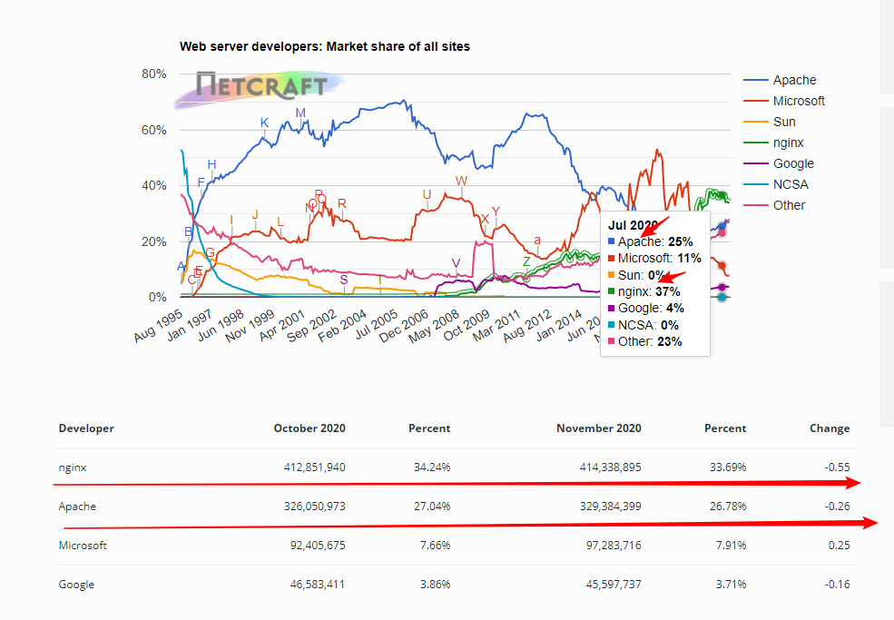
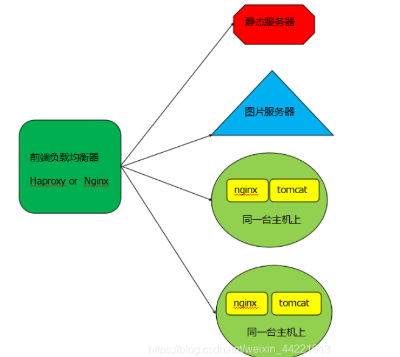

# 四、【Java网络编程与IO流】Apache Tomcat和Nginx的区别是什么？

Nginx的势头很足，在2020 11月份使用份额上领先Apache。

## 1.预备知识 线程 阻塞和非阻塞 同步和异步

**线程：**

**当一个程序在执行的时候，一般会创建一个进程，也可以有多个进程。而一个进程至少会创建一个线程，多个线程共享一个进程的内存。程序的最终运行是通过线程来操作的。**线程的数量跟CPU的核数有关，一个核最多能发出两个线程。线程的操作主要分为给：CPU进行程序命令的执行；IO的操作(读取或输出数据)或请求网络数据。

**进程是资源分配的最小单位，线程是CPU调度的最小单位；**

**阻塞和非阻塞：**

阻塞：线程在执行IO操作读取数据时，这个IO可能会需要一定的时间才能等到数据返回，然后才能执行下面的命令。那么，此时这个线程的等待状态就把它成为阻塞，没有充分利用起CPU资源；

非阻塞：还是上述线程在进行IO操作时，无序等待数据的返回，可以接着往下执行代码命令，cpu资源一直在充分利用。

**同步和异步：**

同步：当线程进行IO操作请求数据时，是**线程“主动”关心数据的返回**；

异步：当前线程无需主动关心数据是否返回，当**数据返回时，会有相关的事件通知线程**。

> 而**Nginx使用的就是非阻塞+异步**；**Apache使用的则是同步阻塞**。

## 2.Apache和Nginx的概念

**Apache**

每一个连接，apache就会创建一个进程，每个线程内单线程，apache最多能创建256个线程。对于一个负载相对较高的网站来说，256的线程，也就是256个线程，因为线程处理请求时，是同步阻塞模式，接收请求之后，会一直等待该请求读取程序文件(IO)(同步), 执行业务逻辑，返回客户端，所有操作完成之后才能处理下一个请求（阻塞），如果服务器已经达到256的极限，那么接下去的访问就需要排队。

**Nginx**

nginx接收一个请求后，不会等待这个请求的文件读取操作完成之后才接收下一个请求，它不会等待这个请求的后续的处理结果。而是会马上循环处理下一个请求（不阻塞）。请求的程序文件执行完成之后，会主动通知该线程，不用你主动去等待或者轮询查看（异步）。最后返回给客户端。这样做，每个请求过来就不需要等待很长的时间排队，而是马上就能接收，开始进行处理了。等处理完成之后，会主动通知回调这个线程进行数据返回。

## 3.Apache和Tomcat概念

- **Apache是web服务器**；**Tomcat是Java服务器**，只是一个servlet容器，是apache的扩展。
- Apache是普通服务器，本身只支持html普通网页，不过可以通过插件支持jsp；而Tomcat是js/servlet容器，可解释Java程序；此外Apache可以与Tomcat单向连接，即Apache可以访问Tomcat资源，反之不然。

## 4.Apache、Tomcat和Nginx三者区别以及优缺点

**Aapche：**

**Apache支持模块多，性能稳定，Apache本身是静态解析，适合静态HTML、图片**等，但可以通过扩展脚本、模块等支持动态页面等。

缺点：配置相对复杂，本身不支持动态页面。

优点：相对于Tomcat服务器来说处理静态文件是它的优势，速度快。Apache是静态解析，适合静态HTML、图片等。

**Tomcat：**

**Tomcat是应用(Java)服务器，它只是一个Servlet容器，可以认为是Apache的开展，但是可以独立于Apache运行**；

缺点：可以说Tomcat只能做Java服务器

优点：动态解析容器，处理动态请求，是编译JSP/Servlet的容器。

**Nginx**

**Nginx是十分轻量的HTTP服务器，是一个高性能的HTTP和反向代理服务器，同时也是一个IMAP/POP3/SMTP代理服务器**，其特点是占用内存少，并发能力强，易于开发，部署方便。

缺点：Nginx只适合静态和反向代理。

优点：负载均衡、反向代理，处理静态文件优势。Nginx处理静态请求的速度高于Apache。

## 5.Tomcat结合Apache、Nginx实现高性能的web服务器

**tomcat与nginx、apache结合使用共有如下几点原因：**

- tomcat处理html的能力不如Apache和nginx，tomcat处理静态内容的速度不如apache和nginx。
- tomcat接受的最大并发数有限，连接数过多，会导致tomcat处于"僵尸"状态，对后续的连接失去响应，需要结合nginx一起使用。

通常情况下，tomcat与nginx、Apache结合使用，nginx、apache既可以提供web服务，也可以转发动态请求至tomcat服务器上。但在一个高性能的站点上，通常**nginx、apache只提供代理的功能**，也就是转发请求至tomcat服务器上，而对于静态内容的响应，则由前端负载均衡器来转发至专门的静态服务器上进行处理。其架构类似于如下图：

在这种架构中，当haproxy或nginx作为前端代理时，如果是静态内容，如html、css等内容，则直接交给静态服务器处理；如果请求的图片等内容，则直接交给图片服务器处理；如果请求的是动态内容，则交给tomcat服务器处理，不过在tomcat服务器上，同时运行着nginx服务器，此时的nginx作为静态服务器，它不处理静态请求，它的作用主要是接受请求，并将请求转发给tomcat服务器的，除此之外，nginx没有任何作用。

