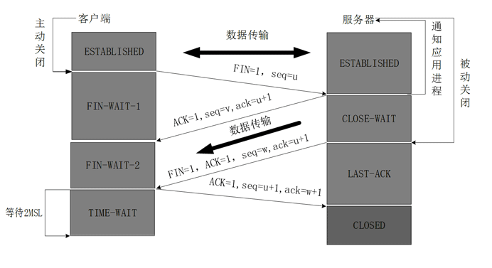

# 四、【面试篇】Web实时通信技术即消息推送机制- 简要介绍短连接 长连接 轮询 长轮询 SSE WebSocket？

## 一、什么是长连接和短连接？

**HTTP的长连接和短连接实质上是TCP长连接的短连接。**  

> 在了解HTTP的长连接和短连接之前先来了解一下HTTP协议。

## 1.预备知识

### 1.1 HTTP协议与TCP/IP协议的关系

HTTP属于应用层协议，在**传输层中使用TCP协议**，在网络层中使用IP协议。其中**IP协议主要解决网络路由和寻址的问题**，**TCP协议主要解决如何在IP层之上传输可靠的数据包。**

### 1.2 如何理解HTTP协议是无状态的

HTTP协议是无状态的，指的是HTTP协议对于事务处理没有记忆能力，服务器不知道客户端是什么状态。即打开一个服务器上的网页和之前打开的服务器的网页之间没有任何关系。

> HTTP是一个无状态的面向连接的协议。

## 2.什么是长连接、短连接

HTTP协议主要有HTTP/1.0和HTTP/1.1，目前上网大多数用的是HTTP/1.1协议。

**在HTTP/1.0中，默认使用的是短连接**，也就是说，浏览器和服务器每进行一次HTTP操作，就建立一次连接，但任务结束就中断连接。如果客户端浏览器访问的某个HTML或其他类型的 Web页中包含有其他的Web资源，如JavaScript文件、图像文件、CSS文件等；当浏览器每遇到这样一个Web资源，就会建立一个HTTP会话。

但**从HTTP/1.1中，默认使用长连接，用以保持连接特性**。使用长连接的HTTP协议，会在响应头有加入这行代码：Connection:keep-alive。 即一个网页打开完成后，客户端和服务器之间用于传输HTTP数据的 TCP连接不会关闭，如果客户端再次访问这个服务器上的网页，会继续使用这一条已经建立的连接。**Keep-Alive不会永久保持连接，它有一个保持时间，可以在不同的服务器软件（如Apache）中设定这个时间。实现长连接要客户端和服务端都支持长连接。**

**HTTP协议的长连接和短连接，实质上是TCP协议的长连接和短连接。**

### 2.1 TCP连接

在网络通信时采用TCP协议，server与client之间必须建立一个连接，当读写操作完成后，双方不再需要这个连接时它们可以释放这个连接。而连接的建立是需要三次握手，而连接的释放需要四次挥手，因此连接的建立是需要资源消耗的和时间的。

**三次握手示意图**

**四次挥手示意图**

### 2.2 TCP短连接

TCP 短连接的情况，client 向 server 发起连接请求，server 接到请求，然后双方建立连接。client 向 server 发送消息，server 回应 client，然后一次读写就完成了，这时候双方任何一个都可以发起 close 操作，不过一般都是 client 先发起 close 操作。为什么呢，一般的 server 不会回复完 client 后立即关闭连接的，当然不排除有特殊的情况。从上面的描述看，短连接一般只会在 client/server 间传递一次读写操作
 短连接的优点是：管理起来比较简单，存在的连接都是有用的连接，不需要额外的控制手段

### 2.2 TCP长连接

长连接的情况，client 向 server 发起连接，server 接受 client 连接，双方建立连接。Client 与 server 完成一次读写之后，它们之间的连接并不会主动关闭，后续的读写操作会继续使用这个连接。

而保持TCP长连接需要用到TCP的保活功能。

> **TCP保活功能**：主要为服务器应用提供，服务器应用希望知道客户主机是否崩溃，从而可以代表客户使用资源。如果客户已经消失，使得服务器上保留一个半开放的连接，而服务器又在等待来自客户端的数据，则服务器将应远等待客户端的数据，保活功能就是试图在服务 器端检测到这种半开放的连接。

如果**一个给定的连接在两小时内没有任何的动作，则服务器就向客户发一个探测报文段**，客户主机必须处于以下4个状态之一：

- 客户主机依然正常运行，并从服务器可达。客户的 TCP 响应正常，而服务器也知道对方是正常的，服务器在两小时后将保活定时器复位。
- 客户主机已经崩溃，并且关闭或者正在重新启动。在任何一种情况下，客户的 TCP 都没有响应。服务端将不能收到对探测的响应，并在75秒后超时。服务器总共发送10个这样的探测 ，每个间隔75秒。如果服务器没有收到一个响应，它就认为客户主机已经关闭并终止连接。
- 客户主机崩溃并已经重新启动。服务器将收到一个对其保活探测的响应，这个响应是一个复位，使得服务器终止这个连接。
- 客户机正常运行，但是服务器不可达，这种情况与2类似，TCP能发现的就是没有收到探查的响应。

## 二、什么是长轮询和短轮询 

## 2.1 需求场景

比如一个电商商品详情的页面，这个详情页面中一个字段是库存量，而这个库存量是需要实时变化，保持和服务里实际的库存一致。

## 2.2 短轮询ShortPolling（客户端轮询）

> 短轮询：短轮询是在特定的时间间隔(如间隔1s)，由客户端向服务器端发送HTTP request，然后由服务器返回最新的数据给客户端。不管服务器数据有没有变化，客户端都会发送请求，来获取数据

那么对上面需求的实现方式就是：用JS写个死循环，不停的去请求服务器中的库存量是多少，然后刷新到这个页面当中，这其实就是所谓的短轮询。

**特点：**客户端主动向服务器请求数据，服务器被动推送消息。
**缺点：**浏览器需要不断的向服务器发出请求，然而HTTP request 的header是非常长的，里面包含的有用数据可能只是一个很小的值，这样会占用很多的带宽，造成资源浪费。同时也不能保证及时更新最新信息。

## 2.3 长轮询

> > 客户端发送请求后，服务器端不会立即返回数据，服务器端会阻塞请求，连接不会立即断开，直到服务器端有数据更新或者是连接超时才返回，客户端才再次发出请求，新建连接，如此反复，从而获取最新数据。
>
>
> 

还是对上面那个需求的实现，不同于短轮询去服务查询的时候，不管库存量有没有变化，服务器就立即返回结果。长轮询，服务器如果检测到库存量没有变化的话，将会把当前请求挂起一段时间(这个时间也叫作超时时间)。在这个时间，服务器会去检测库存量有没有变化，检测到变化就立即返回，否则就一直等到超时为止。

**特点：**客户端主动向服务器请求数据，服务器被动推送消息。一个连接断开后，就有新的连接产生，跟轮询（短轮询）相比，能减少资源浪费但依旧很浪费资源。

## 2.4 长轮询和短轮询的区别

对于客户端来说，不管是长轮询还是短轮询，客户端的动作都是一样的，就是不停的去请求；

不同的是服务端，短轮询情况下服务端每次请求不管有没有变化都会立即返回结果，而长轮询情况下，如果有变化才会立即返回结果，而没有变化的话，则不会再立即给客户端返回结果，直到超时为止

## 2.5 长短轮询和长短连接

- 对于长短连接：

  - 一个TCP连接是否为长连接，是通过设置HTTP的Connection Header来决定的，而且是需要两边都设置才有效。
  - 连接的长短是通过协议来规定和实现的。

- 对于长短轮询：

  - 根据服务端的处理方式来决定的，与客户端没有关系。

  - 服务器通过编程的方式手动挂起请求来实现的。

    

## 三、Server-Sent Events（SSE）

> 传统意义上服务器端不会主动推送给客户端消息，一般都是客户端主动去请求服务器端获取最新的数据。而SSE是一种可以主动从服务器推送消息的技术。
>
> 严格来说，HTTP协议无法做到服务器主动推送信息。但有一种变通方法，就是服务器向客户端声明，接下来要发送的是流信息(streaming).也就是说，发送的不是一次性的数据包，而是一个数据流，会连续不断的发送过来。这时，客户端不会关闭连接，会一直等着服务器发过来的新的数据流。本质上，这种通信就是以流信息的方式，完成一次用时很长的下载。

## 3.1 需求场景

在商品后台中，如果有用户下了订单就给后台一个通知，即服务器推送功能。

当前网站在线的实时人数；

法币汇率显示当前实时汇率；

电商大促的实时成交额；

## 3.2 SSE的特点

SSE与WebSocket作用很相似，都是建立游览器与服务器之间的通信渠道，然后服务器向游览器推送信息。

但websocket更强大和灵活，因为websocket是全双工的通道，可以双向通信；SSE是单向通道，只能服务器向游览器发送，因为流信息本质上就是下载，如果游览器向服务器发送消息，就变成了另一次的HTTP请求。

> SSE的优势如下：
>
> - SSE使用HTTP协议，现有的服务器软件都支持；而WebSocket是一个独立协议。
> - SSE属于轻量级，使用简单；WebSocket协议相对复杂。
> - SSE默认支持断线重连；WebSocket需要自己实现。
> - SSE一般只用来传送文本，二进制数据需要编码后传送；WebSocket默认支持传送二进制数据
> - SSE支持自定义发送的消息类型。

总之，SSE是长连接的；且服务端可以向客户端推送信息。即客户端只需连接一次，Server就定时推送，除非其中一端断开连接，并且SSE会在连接意外断开时自动重连。

## 四、WebSocket

> WebSocket要求游览器可以通过JavaScript脚本手动创建一个TCP连接与服务器端进行通讯。WebSocket使用了ws和wss协议，需要服务器有与之握手的算法才能将连接打开。客户端什么时候想发就发，服务器端什么时候想回就回，两边都有监听者socket在负责，可以服务器端消息的实时推送。

> 补充：HTTP101状态码：切换协议，服务器端根据客户端的请求切换协议。
>
> socket本身并不是协议，是一个套接字，TCP/IP网络的API，是为了方便大家直接使用更底层的协议而存在的抽象层。
>
> 

## 4.1 需求场景

**WebSocket是一种在单个TCP连接上进行全双工通信的协议**，是为了满足基于Web的日益增长的实时通信需求而产生的。我们平时接触的大多数是HTTP的接口，但是在有些业务场景中无法满足要求，就需要用到WebSocket。

- **页面地图上要实时显示在线人员的坐标**：传统基于HTTP接口的处理方式是轮询，每次轮询更新的坐标信息。
- **手机的付款码页面**，在外界设备扫描付款码支付成功后，手机付款码页面提示“支付成功”并自动关闭。是付款码页面一直调用接口，直到从服务器获取成功支付的状态后，手机提示“支付成功”并关闭付款码页面。

很明显，**HTTP协议有一个缺陷：通信只能有客户端发起，这种单向请求的特点**，注定了如果服务器有连续的状态变化，客户端要获知就非常麻烦。我们就只能使用“轮询”:每隔一段时间，就发出一个询问，了解服务器有没有新的信息，但这种方式浪费带宽(HTTP HEAD是比较大的)，又消耗服务器CPU占用(没有消息也要接受请求)

## 4.2 WebSocket特点

WebSocket是一种协议，是一种与HTTP同等的网络协议，两者都是应用层协议，都基于TCP协议。但是WebSocket是一种双向通信协议，在建立连接之后，WebSocket的server与client都能够主动向对方发送或者接收数据。同时WebSocket在建立连接时需要借助HTTP协议，连接建立之后client与server之间的双向通信就与HTTP无关了。

相比较传统HTTP的每次“请求-应答”都要client与sevrer建立连接的模式，websocket是一种长连接的模式。就是一旦websocket连接后，除非client或者server中有一端主动断开连接，否则每次数据传输之前都不需要HTTP那样请求数据。

|          | Websocket                                            | SSE(Server-Sent Events)                |
| :------- | :--------------------------------------------------- | :------------------------------------- |
| 通讯方式 | 基于TCP长连接通讯                                    | http                                   |
| 优点     | 全双工通讯协议，性能开销小、安全性高，有一定可扩展性 | 实现简便，开发成本低，默认支持断线重连 |
| 缺点     | 传输数据需要进行二次解析，增加开发成本及难度         | 浏览器兼容问题，单向                   |

## 总结

|    #     |           轮询(Polling)            |        长轮询(Long-Polling)        |                    Websocket                     |                sse                |
| :------: | :--------------------------------: | :--------------------------------: | :----------------------------------------------: | :-------------------------------: |
| 通信协议 |                http                |                http                |                       tcp                        |               http                |
| 触发方式 |           client(客户端)           |           client(客户端)           |          client、server(客户端、服务端)          |  client、server(客户端、服务端)   |
|   优点   |     兼容性好容错性强，实现简单     |          比短轮询节约资源          | 全双工通讯协议，性能开销小、安全性高，可扩展性强 |       实现简便，开发成本低        |
|   缺点   | 安全性差，占较多的内存资源与请求数 | 安全性差，占较多的内存资源与请求数 |   传输数据需要进行二次解析，增加开发成本及难度   |         只适用高级浏览器          |
|   延迟   |     非实时，延迟取决于请求间隔     |              同短轮询              |                       实时                       | 非实时，默认3秒延迟，延迟可自定义 |