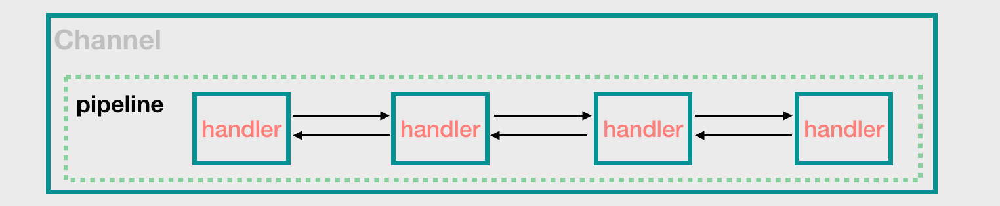

# Java之Netty网络编程

来自[JavaGuide](https://github.com/Snailclimb/netty-practical-tutorial/blob/master/docs/2-Netty%E7%89%88%E7%9A%84HelloWorld.md)

**为什么要学Netty？**

- Netty基于NIO(NIO是一种同步非阻塞的I/O模型，在Java1.4中引入了NIO)。使用Netty可以极大地简化TCP和UP套接字服务器等网络编程，并且性能以及安全等很多方面非常优秀；
- 平常经常接触的 Dubbo、RocketMQ、Elasticsearch、gRPC、Spark、Elasticsearch 等等热门开源项目都用到了 Netty。
- 大部分微服务框架底层涉及到网络通信的部分都是基于 Netty 来做的，比如说 Spring Cloud 生态系统中的网关 Spring Cloud Gateway 。

# 预备知识

## 1.什么是Netty？Netty特性是什么？

Netty是一个异步事件驱动的网络应用程序框架，用于快速开发可维护的高性能协议服务器和客户端。Netty是基于nio的，它封装了jdk的nio，其使用更加灵活。

- **高并发：**Netty是一款基于NIO(Nonblocking,非阻塞IO)开发的网络通信框架，对比与BIO(Blocking I/O,阻塞IO)，它的并发性能得到了很大提高；
- **传输快：**Netty的传输依赖于零拷贝特性，尽量减少不必要的内存拷贝，实现了更高效率的传输；
- **封装好：**Netty封装了NIO操作的很多细节，提供了易于使用的调用接口。

## 2.Netty高性能表现在哪些方面？

- **IO线程模型：**同步非阻塞，用最少的资源做更多的事情；
- **内存零拷贝：**尽量减少不必要的内存拷贝，实现了更高效率的传输；
- **内存池设计：**申请的内存可以重用，主要指直接内存。内部实现是用一棵二叉查找树管理内存分配情况；
- **串行化处理读写：**避免使用锁带来的性能开销；
- **高性能序列化协议：**支持protobuf等高性能序列化协议

## 3.BIO、NIO和AIO的区别是什么？

**BIO：**一个连接一个线程，客户端有连接请求时服务器端就需要启动一个线程进行处理，线程开销大；

**伪异步IO：**将请求连接放入连接池，一对多，但线程还是很宝贝的资源；

**NIO：**一个请求一个线程，但客户端发送的连接请求都会注册到多路复用器上，多路复用器轮询到连接有I/O请求时才启动一个线程进行处理。

**AIO：**一个有效请求一个线程，客户端的I/O请求都是由OS先完成了再通知服务器应用去启动线程进行处理。

> BIO是面向流的，NIO是面向缓冲区的；
>
> BIO是各种流是阻塞的，而NIO是非阻塞的；
>
> BIO的Stream的单向的，而NIO的channel是双向的。

## 4.Netty的线程模型？

Netty通过Reactor模型基于多路复用器接收并处理用户请求，内部实现了两个线程池，boss线程池和work线程池。其中boss线程池的线程负责处理请求的accpet事件，当接收到accept事件的请求时，把对应的socket封装到一个NioSocketChannel中，并交给work线程池，其中work线程池负责请求的read和write事件，由对应的Handler处理。


单线程模型：所有I/O操作都由一个线程完成，即多路复用、事件分发和处理都是在一个Reactor线程上完成的。既要接收客户端的连接请求,向服务端发起连接，又要发送/读取请求或应答/响应消息。一个NIO 线程同时处理成百上千的链路，性能上无法支撑，速度慢，若线程进入死循环，整个程序不可用，对于高负载、大并发的应用场景不合适。

多线程模型：有一个NIO 线程（Acceptor） 只负责监听服务端，接收客户端的TCP 连接请求；NIO 线程池负责网络IO 的操作，即消息的读取、解码、编码和发送；1 个NIO 线程可以同时处理N 条链路，但是1 个链路只对应1 个NIO 线程，这是为了防止发生并发操作问题。但在并发百万客户端连接或需要安全认证时，一个Acceptor 线程可能会存在性能不足问题。

主从多线程模型：Acceptor 线程用于绑定监听端口，接收客户端连接，将SocketChannel 从主线程池的Reactor 线程的多路复用器上移除，重新注册到Sub 线程池的线程上，用于处理I/O 的读写等操作，从而保证mainReactor只负责接入认证、握手等操作；

## 5.TCP粘包/拆包的原因以及解决方法？

**原因：**

TCP是以流的方式来处理数据，一个完整的包可能会被TCP拆分成多个包进行发送，也可能把小的封装成一个大的数据包发送。当应用程序写入数据小于套接字缓冲区大小，网卡将应用多次写入的数据发送到网络上，这将会发生粘包的现象；

**解决方法：**

消息定长：FixedLengthFrameDecoder类

包尾增加特殊字符分割：

- 行分隔符类：LineBasedFrameDecoder
- 或自定义分隔符类 ：DelimiterBasedFrameDecoder

将消息分为消息头和消息体：LengthFieldBasedFrameDecoder类。分为有头部的拆包与粘包、长度字段在前且有头部的拆包与粘包、多扩展头部的拆包与粘包。

## 6.什么是Netty的零拷贝？

Netty 的零拷贝主要包含三个方面：

- Netty 的接收和发送 ByteBuffer 采用 DIRECT BUFFERS，使用堆外直接内存进行 Socket 读写，不需要进行字节缓冲区的二次拷贝。如果使用传统的堆内存（HEAP BUFFERS）进行 Socket 读写，JVM 会将堆内存 Buffer 拷贝一份到直接内存中，然后才写入 Socket 中。相比于堆外直接内存，消息在发送过程中多了一次缓冲区的内存拷贝。
- Netty 提供了组合 Buffer 对象，可以聚合多个 ByteBuffer 对象，用户可以像操作一个 Buffer 那样方便的对组合 Buffer 进行操作，避免了传统通过内存拷贝的方式将几个小 Buffer 合并成一个大的 Buffer。
- Netty 的文件传输采用了 transferTo 方法，它可以直接将文件缓冲区的数据发送到目标 Channel，避免了传统通过循环 write 方式导致的内存拷贝问题

## 7.Netty有哪种重要组件？

- Channel：Netty 网络操作抽象类，它除了包括基本的 I/O 操作，如 bind、connect、read、write 等。
- EventLoop：主要是配合 Channel 处理 I/O 操作，用来处理连接的生命周期中所发生的事情。
- ChannelFuture：Netty 框架中所有的 I/O 操作都为异步的，因此我们需要 ChannelFuture 的 addListener()注册一个 ChannelFutureListener 监听事件，当操作执行成功或者失败时，监听就会自动触发返回结果。
- ChannelHandler：充当了所有处理入站和出站数据的逻辑容器。ChannelHandler 主要用来处理各种事件，这里的事件很广泛，比如可以是连接、数据接收、异常、数据转换等。
- ChannelPipeline：为 ChannelHandler 链提供了容器，当 channel 创建时，就会被自动分配到它专属的 ChannelPipeline，这个关联是永久性的。

## 8.Netty 发送消息有几种方式？

Netty 有两种发送消息的方式：

- 直接写入 Channel 中，消息从 ChannelPipeline 当中尾部开始移动；
- 写入和 ChannelHandler 绑定的 ChannelHandlerContext 中，消息从 ChannelPipeline 中的下一个 ChannelHandler 中移动。

## 9.默认情况 Netty 起多少线程？何时启动？

Netty 默认是 CPU 处理器数的两倍，bind 完之后启动。

## 10.Netty 和 Tomcat 的区别？

- 作用不同：**Tomcat 是 Servlet 容器**，可以视为 Web 服务器，而 **Netty 是异步事件驱动的网络应用程序框架和工具用于简化网络编程**，例如TCP和UDP套接字服务器。
- 协议不同：Tomcat 是基于 http 协议的 Web 服务器，而 Netty 能通过编程自定义各种协议，因为 Netty 本身自己能编码/解码字节流，所有 Netty 可以实现，HTTP 服务器、FTP 服务器、UDP 服务器、RPC 服务器、WebSocket 服务器、Redis 的 Proxy 服务器、MySQL 的 Proxy 服务器等等。

# 一、Netty的起源

## 1.传统的Socket实现

**早期的 Java 网络相关的 API(`java.net`包) 使用 Socket(套接字)进行网络通信，不过只支持阻塞函数使用。**

要通过互联网进行通信，至少需要一对套接字：

1. 运行于服务器端的 Server Socket。
2. 运行于客户机端的 Client Socket

Socket 网络通信过程如下图所示：


**Socket 网络通信过程简单来说分为下面 4 步：**

1. 建立服务端并且监听客户端请求
2. 客户端请求，服务端和客户端建立连接
3. 两端之间可以传递数据
4. 关闭资源

对应到服务端和客户端的话，是下面这样的。

**服务器端：**

1. 创建 `ServerSocket` 对象并且绑定地址（ip）和端口号(port)：` server.bind(new InetSocketAddress(host, port))`
2. 通过 `accept()`方法监听客户端请求
3. 连接建立后，通过输入流读取客户端发送的请求信息
4. 通过输出流向客户端发送响应信息
5. 关闭相关资源

**客户端：**

1. 创建`Socket` 对象并且连接指定的服务器的地址（ip）和端口号(port)：`socket.connect(inetSocketAddress)`
2. 连接建立后，通过输出流向服务器端发送请求信息
3. 通过输入流获取服务器响应的信息
4. 关闭相关资源

### 1.1一对一的demo


**服务端：**

```java
package com.lcz.io;

import org.apache.commons.logging.Log;
import org.apache.commons.logging.LogFactory;

import java.io.IOException;
import java.io.ObjectInputStream;
import java.io.ObjectOutputStream;
import java.net.ServerSocket;
import java.net.Socket;

/**
 * 服务器端
 */
public class HelloServer {
    // 日志文件
    private static final Log log = LogFactory.getLog(HelloServer.class);

    // 方法
    public void start(int port){
        // 1.创建serversocket对象并且绑定端口
        try (ServerSocket server = new ServerSocket(port);){
            Socket socket;
            //2.通过accept()方法监听客户端请求，
            while((socket=server.accept())!=null){
                log.info("client connected!");
                try(ObjectInputStream objectInputStream = new ObjectInputStream(socket.getInputStream());
                    ObjectOutputStream objectOutputStream = new ObjectOutputStream(socket.getOutputStream())){

                    // 3.通过输入流读取客户端发送的请求信息
                    Message message = (Message)objectInputStream.readObject();
                    log.info("server receive message:" + message.getContent());
                    message.setContent("new content");
                    // 4.通过输入流向客户端发送相应消息
                    objectOutputStream.writeObject(message);
                    objectOutputStream.flush();
                }catch (IOException | ClassNotFoundException e){
                    log.error("occur exception:", e);
                }
            }
        }catch (IOException e){
            log.error("occur IOException:",e);
        }
    }

    // 主函数
    public static void main(String[] args){
        HelloServer helloServer = new HelloServer();
        helloServer.start(6666);
    }

}
```

`ServerSocket` 的 `accept（）` 方法是阻塞方法，也就是说 `ServerSocket` 在调用 `accept（)`等待客户端的连接请求时会阻塞，直到收到客户端发送的连接请求才会继续往下执行代码，因此我们需要要为每个 Socket 连接开启一个线程（可以通过线程池来做）。

上述服务端的代码只是为了演示，并没有考虑多个客户端连接并发的情况。

**客户端：**

```java
package com.lcz.io;

import org.apache.commons.logging.Log;
import org.apache.commons.logging.LogFactory;

import java.io.IOException;
import java.io.ObjectInputStream;
import java.io.ObjectOutputStream;
import java.net.Socket;

public class HelloClient {
    private static final Log log = LogFactory.getLog(HelloClient.class);

    // 发送
    public Object send(Message message,String host,int port){
        //1.创建socket对象并且制定服务器的地址和初始化
        try(Socket socket = new Socket(host,port)){
            ObjectOutputStream objectOutputStream = new ObjectOutputStream(socket.getOutputStream());
            //2.通过输出流向服务器发送请求消息
            objectOutputStream.writeObject(message);
            // 3.通过输入流获取服务器相应的信息
            ObjectInputStream objectInputStream = new ObjectInputStream(socket.getInputStream());
            return objectInputStream.readObject();
        }catch (IOException | ClassNotFoundException e) {
            log.error("occur exception:", e);
        }
        return null;
    }

    // 主函数
    public static void main(String[] args){
        HelloClient helloClient = new HelloClient();
        Message message = (Message) helloClient.send(new Message("content from client"),"127.0.0.1",6666);
        System.out.println("client receive message:" + message.getContent());
    }
}

```

**发送的消息实体类**：

```java
package com.lcz.io;

import java.io.Serializable;

/**
 * 发送消息的实体类
 */
public class Message implements Serializable {
    private String content;

    public Message(){

    }
    public Message(String content){
        this.content = content;
    }

    public String getContent() {
        return content;
    }

    public void setContent(String content) {
        this.content = content;
    }
}

```

> 其中用到对象序列化，Serializable接口是弃用序列化功能的接口。
>
> 序列化的过程就是一个freeze的过程，将一个对象freeze冻住，然后进行存储；等到需要的时候，再将这个对象de-freeze解冻就可使用；打开一个java的Serializable这个接口的源码，会发现这个一个空接口，其告诉JVM此类可被序列化，可被默认的序列化机制序列化。
>
> 序列化可以很快捷的创建一个副本，便于数据传输。

**首先运行服务端，然后再运行客户端，控制台输出如下：**

服务端:

```java
十一月 30, 2020 1:06:02 下午 com.lcz.io.HelloServer start
信息: client connected!
十一月 30, 2020 1:06:02 下午 com.lcz.io.HelloServer start
信息: server receive message:content from client
```

客户端：

```java
client receive message:new content
```

### 资源消耗严重的问题

很明显，我上面演示的代码片段有一个很严重的问题：**只能同时处理一个客户端的连接，如果需要管理多个客户端的话，就需要为我们请求的客户端单独创建一个线程。** 如下图所示：


### 1.2 多对一(多线程)的demo

**服务器端的Java代码**

```java
package com.lcz.io;

import org.apache.commons.logging.Log;
import org.apache.commons.logging.LogFactory;

import java.io.IOException;
import java.io.ObjectInputStream;
import java.io.ObjectOutputStream;
import java.net.ServerSocket;
import java.net.Socket;

/**
 * 服务器端
 */
public class HelloServer_2 {
    // 日志文件
    private static final Log log = LogFactory.getLog(HelloServer_2.class);

    // 方法
    public void start(int port){
        Thread thread = new Thread(new Runnable() {
            @Override
            public void run() {
                // 1.创建serversocket对象并且绑定端口
                try (ServerSocket server = new ServerSocket(port);){
                    Socket socket;
                    //2.通过accept()方法监听客户端请求，
                    while((socket=server.accept())!=null){
                        log.info("client connected!");
                        try(ObjectInputStream objectInputStream = new ObjectInputStream(socket.getInputStream());
                            ObjectOutputStream objectOutputStream = new ObjectOutputStream(socket.getOutputStream())){

                            // 3.通过输入流读取客户端发送的请求信息
                            Message message = (Message)objectInputStream.readObject();
                            log.info("server receive message:" + message.getContent());
                            message.setContent("new content");
                            // 4.通过输入流向客户端发送相应消息
                            objectOutputStream.writeObject(message);
                            objectOutputStream.flush();
                        }catch (IOException | ClassNotFoundException e){
                            log.error("occur exception:", e);
                        }
                    }
                }catch (IOException e){
                    log.error("occur IOException:",e);
                }
            }
        });
        thread.start();
    }

    // 主函数
    public static void main(String[] args){
        HelloServer_2 helloServer = new HelloServer_2();
        helloServer.start(6666);
    }

}
```

但是，这样会导致一个很严重的问题：**资源浪费**。

我们知道线程是很宝贵的资源，如果我们为每一次连接都用一个线程处理的话，就会导致线程越来越好，最好达到了极限之后，就无法再创建线程处理请求了。处理的不好的话，甚至可能直接就宕机掉了。

很多人就会问了：那有没有改进的方法呢？

### 线程池虽可以改善，但终究未从根本解决问题

当然有！ 比较简单并且实际的改进方法就是使用线程池。线程池还可以让线程的创建和回收成本相对较低，并且我们可以指定线程池的可创建线程的最大数量，这样就不会导致线程创建过多，机器资源被不合理消耗。

```java
package com.lcz.io;

import org.apache.commons.logging.Log;
import org.apache.commons.logging.LogFactory;

import java.io.IOException;
import java.io.ObjectInputStream;
import java.io.ObjectOutputStream;
import java.net.ServerSocket;
import java.net.Socket;
import java.util.concurrent.*;

/**
 * 服务器端
 */
public class HelloServer_3 {
    // 日志文件
    private static final Log log = LogFactory.getLog(HelloServer_3.class);

    // 方法
    public void start(int port){
        ThreadFactory threadFactory = Executors.defaultThreadFactory();
        ExecutorService threadPool = new ThreadPoolExecutor(10,100,1,TimeUnit.MINUTES,new ArrayBlockingQueue<>(100),threadFactory);
        threadPool.execute(()->{
            // 1.创建serversocket对象并且绑定端口
            try (ServerSocket server = new ServerSocket(port);){
                Socket socket;
                //2.通过accept()方法监听客户端请求，
                while((socket=server.accept())!=null){
                    log.info("client connected!");
                    try(ObjectInputStream objectInputStream = new ObjectInputStream(socket.getInputStream());
                        ObjectOutputStream objectOutputStream = new ObjectOutputStream(socket.getOutputStream())){

                        // 3.通过输入流读取客户端发送的请求信息
                        Message message = (Message)objectInputStream.readObject();
                        log.info("server receive message:" + message.getContent());
                        message.setContent("new content");
                        // 4.通过输入流向客户端发送相应消息
                        objectOutputStream.writeObject(message);
                        objectOutputStream.flush();
                    }catch (IOException | ClassNotFoundException e){
                        log.error("occur exception:", e);
                    }
                }
            }catch (IOException e){
                log.error("occur IOException:",e);
            }
        });
    }

    // 主函数
    public static void main(String[] args){
        HelloServer_3 helloServer = new HelloServer_3();
        helloServer.start(6666);
    }

}


```

**但是，即使你再怎么优化和改变。也改变不了它的底层仍然是同步阻塞的 BIO 模型的事实，因此无法从根本上解决问题。**

**为了解决上述的问题，Java 1.4 中引入了 NIO ，一种同步非阻塞的 I/O 模型。**

## 2.NIO

**Netty 实际上就基于 Java NIO 技术封装完善之后得到一个高性能框架，熟悉 NIO 的基本概念对于学习和更好地理解 Netty 还是很有必要的！**

> 例子：假如有10000个连接，4核CPU ，那么bio 就需要一万个线程，而nio大概就需要5个线程(一个接收请求，四个处理请求)。如果这10000个连接同时请求，那么bio就有10000个线程抢四个CPU ，几乎每个CPU 平均执行2500次上下文切换，而nio 四个处理线程，几乎每个线程都对应一个CPU ，也就是几乎没有上下文切换。效率就体现出来了。
>
> 

### 2.1初识 NIO

**NIO 是一种同步非阻塞的 I/O 模型，在 Java 1.4 中引入了 NIO 框架，对应 `java.nio` 包，提供了 Channel , Selector，Buffer 等抽象。**

**NIO 中的 N 可以理解为 Non-blocking，已经不在是 New 了（已经出来很长时间了）。**

NIO 支持面向缓冲(Buffer)的，基于通道(Channel)的 I/O 操作方法。

NIO 提供了与传统 BIO 模型中的 `Socket` 和 `ServerSocket` 相对应的 `SocketChannel` 和 `ServerSocketChannel` 两种不同的套接字通道实现,两种通道都支持阻塞和非阻塞两种模式：

1. **阻塞模式** : 基本不会被使用到。使用起来就像传统的网络编程一样，比较简单，但是性能和可靠性都不好。对于低负载、低并发的应用程序，勉强可以用一下以提升开发速率和更好的维护性
2. **非阻塞模式** ： 与阻塞模式正好相反，非阻塞模式对于高负载、高并发的（网络）应用来说非常友好，但是编程麻烦，这个是大部分人诟病的地方。所以， 也就导致了 Netty 的诞生。

### 2.2 NIO 核心组件解读

NIO 包含下面几个核心的组件：

- **Channel**
- **Buffer**
- **Selector**
- **Selection Key**

**这些组件之间的关系是怎么的呢？**


1. NIO 使用 Channel(通道)和 Buffer(缓冲区)传输数据，数据总是从缓冲区写入通道，并从通道读取到缓冲区。**在面向流的 I/O 中，可以将数据直接写入或者将数据直接读到 Stream 对象中。在 NIO 库中，所有数据都是通过 Buffer(缓冲区)处理的**。 Channel 可以看作是 Netty 的网络操作抽象类，对应于 JDK 底层的 Socket
2. NIO 利用 Selector （选择器）来监视多个通道的对象，如数据到达，连接打开等。因此，单线程可以监视多个通道中的数据。
3. 当我们将 Channel 注册到 Selector 中的时候, 会返回一个 Selection Key 对象, Selection Key 则表示了一个特定的通道对象和一个特定的选择器对象之间的注册关系。通过 Selection Key 我们可以获取哪些 IO 事件已经就绪了，并且可以通过其获取 Channel 并对其进行操作。

**Selector（选择器，也可以理解为多路复用器）是 NIO（非阻塞 IO）实现的关键。它使用了事件通知相关的 API 来实现选择已经就绪也就是能够进行 I/O 相关的操作的任务的能力。**

简单来说，整个过程是这样的：

1. 将 Channel 注册到 Selector 中。
2. 调用 Selector 的 `select()` 方法，这个方法会阻塞；
3. 到注册在 Selector 中的某个 Channel 有新的 TCP 连接或者可读写事件的话，这个 Channel 就会处于就绪状态，会被 Selector 轮询出来。
4. 然后通过 SelectionKey 可以获取就绪 Channel 的集合，进行后续的 I/O 操作。

### 2.3 NIO 为啥更好？

**相比于传统的 BIO 模型来说， NIO 模型的最大改进是：**

1. 使用比较少的线程便可以管理多个客户端的连接，提高了并发量并且减少的资源消耗（减少了线程的上下文切换的开销）
2. 在没有 I/O 操作相关的事情的时候，线程可以被安排在其他任务上面，以让线程资源得到充分利用。

### 2.4 使用 NIO 编写代码太难了

一个使用 NIO 编写的 Server 端如下，可以看出还是整体还是比较复杂的，并且代码读起来不是很直观，并且还可能由于 NIO 本身会存在 Bug。

很少使用 NIO，很大情况下也是因为使用 NIO 来创建正确并且安全的应用程序的开发成本和维护成本都比较大。所以，一般情况下我们都会使用 Netty 这个比较成熟的高性能框架来做（Apace Mina 与之类似，但是 Netty 使用的更多一点）。

## 3.Netty出现

- **Netty 是一个基于 NIO 的 client-server(客户端服务器)框架，使用它可以快速简单地开发网络应用程序。**

- 它极大地简化并简化了 TCP 和 UDP 套接字服务器等网络编程,并且性能以及安全性等很多方面甚至都要更好。

- 支持多种协议如 FTP，SMTP，HTTP 以及各种二进制和基于文本的传统协议。

用官方的总结就是：**Netty 成功地找到了一种在不妥协可维护性和性能的情况下实现易于开发，性能，稳定性和灵活性的方法。**

### 3.1 Netty架构总览

下面是Netty的模块设计部分：


Netty提供了通用的传输API（TCP/UDP...）；多种网络协议（HTTP/WebSocket...）；基于事件驱动的IO模型； 超高性能的零拷贝...

### 3.2 使用 Netty 能做什么？

这个应该是老铁们最关心的一个问题了，凭借自己的了解，简单说一下，理论上 NIO 可以做的事情 ，使用 Netty 都可以做并且更好。Netty 主要用来做**网络通信** :

1.  **作为 RPC 框架的网络通信工具** ： 我们在分布式系统中，不同服务节点之间经常需要相互调用，这个时候就需要 RPC 框架了。不同服务指点的通信是如何做的呢？可以使用 Netty 来做。比如我调用另外一个节点的方法的话，至少是要让对方知道我调用的是哪个类中的哪个方法以及相关参数吧！
2.  **实现一个自己的 HTTP 服务器** ：通过 Netty 我们可以自己实现一个简单的 HTTP 服务器，这个大家应该不陌生。说到 HTTP 服务器的话，作为 Java 后端开发，我们一般使用 Tomcat 比较多。一个最基本的 HTTP 服务器可要以处理常见的 HTTP Method 的请求，比如 POST 请求、GET 请求等等。
3.  **实现一个即时通讯系统** ： 使用 Netty 我们可以实现一个可以聊天类似微信的即时通讯系统，这方面的开源项目还蛮多的，可以自行去 Github 找一找。
4.  **消息推送系统** ：市面上有很多消息推送系统都是基于 Netty 来做的。

### 3.3 哪些开源项目用到了 Netty？

我们平常经常接触的 Dubbo、RocketMQ、Elasticsearch、gRPC 等等都用到了 Netty。

可以说大量的开源项目都用到了 Netty，所以掌握 Netty 有助于你更好的使用这些开源项目并且让你有能力对其进行二次开发。

实际上还有很多很多优秀的项目用到了 Netty,Netty 官方也做了统计，统计结果在这里：https://netty.io/wiki/related-projects.html 。

# 二、Netty的Hello World程序

IDEA中建立一个maven项目，其依赖为：

```java
 <dependencies>
        <dependency>
            <groupId>io.netty</groupId>
            <artifactId>netty-all</artifactId>
            <version>4.1.42.Final</version>
        </dependency>
    </dependencies>
```

## 1.服务端

我们可以通过 `ServerBootstrap` 来引导我们启动一个简单的 Netty 服务端，为此，你必须要为其指定下面三类属性：

1. **线程组**（*一般需要两个线程组，一个负责处理客户端的连接，一个负责具体的 IO 处理*）
2. **IO 模型**（*BIO/NIO*）
3. **自定义 `ChannelHandler`** （*处理客户端发过来的数据并返回数据给客户端*）

### 1.1创建服务端

```java
/**
 * @author shuang.kou
 * @createTime 2020年05月14日 20:28:00
 */
public final class HelloServer {

    private  final int port;

    public HelloServer(int port) {
        this.port = port;
    }

    private  void start() throws InterruptedException {
        // 1.bossGroup 用于接收连接，workerGroup 用于具体的处理
        EventLoopGroup bossGroup = new NioEventLoopGroup(1);
        EventLoopGroup workerGroup = new NioEventLoopGroup();
        try {
            //2.创建服务端启动引导/辅助类：ServerBootstrap
            ServerBootstrap b = new ServerBootstrap();
            //3.给引导类配置两大线程组,确定了线程模型
            b.group(bossGroup, workerGroup)
                    // (非必备)打印日志
                    .handler(new LoggingHandler(LogLevel.INFO))
                    // 4.指定 IO 模型
                    .channel(NioServerSocketChannel.class)
                    .childHandler(new ChannelInitializer<SocketChannel>() {
                        @Override
                        public void initChannel(SocketChannel ch) {
                            ChannelPipeline p = ch.pipeline();
                            //5.可以自定义客户端消息的业务处理逻辑
                            p.addLast(new HelloServerHandler());
                        }
                    });
            // 6.绑定端口,调用 sync 方法阻塞知道绑定完成
            ChannelFuture f = b.bind(port).sync();
            // 7.阻塞等待直到服务器Channel关闭(closeFuture()方法获取Channel 的CloseFuture对象,然后调用sync()方法)
            f.channel().closeFuture().sync();
        } finally {
            //8.优雅关闭相关线程组资源
            bossGroup.shutdownGracefully();
            workerGroup.shutdownGracefully();
        }
    }
    public static void main(String[] args) throws InterruptedException {
        new HelloServer(8080).start();
    }

}
```

简单解析一下服务端的创建过程具体是怎样的：

**1.创建了两个 `NioEventLoopGroup` 对象实例：`bossGroup` 和 `workerGroup`。**

- `bossGroup` : 用于处理客户端的 TCP 连接请求。
- `workerGroup` ： 负责每一条连接的具体读写数据的处理逻辑，真正负责 I/O 读写操作，交由对应的 Handler 处理。

举个例子：我们把公司的老板当做 bossGroup，员工当做 workerGroup，bossGroup 在外面接完活之后，扔给 workerGroup 去处理。一般情况下我们会指定 bossGroup 的 线程数为 1（并发连接量不大的时候） ，workGroup 的线程数量为 **CPU 核心数 \*2** 。另外，根据源码来看，使用 `NioEventLoopGroup` 类的无参构造函数设置线程数量的默认值就是 **CPU 核心数 \*2** 。

**2.创建一个服务端启动引导/辅助类： `ServerBootstrap`，这个类将引导我们进行服务端的启动工作。**

**3.通过 `.group()` 方法给引导类 `ServerBootstrap` 配置两大线程组，确定了线程模型。**

```java
    EventLoopGroup bossGroup = new NioEventLoopGroup(1);
    EventLoopGroup workerGroup = new NioEventLoopGroup();
```

**4.通过`channel()`方法给引导类 `ServerBootstrap`指定了 IO 模型为`NIO`**

- `NioServerSocketChannel` ：指定服务端的 IO 模型为 NIO，与 BIO 编程模型中的`ServerSocket`对应
- `NioSocketChannel` : 指定客户端的 IO 模型为 NIO， 与 BIO 编程模型中的`Socket`对应

**5.通过 `.childHandler()`给引导类创建一个`ChannelInitializer` ，然后指定了服务端消息的业务处理逻辑也就是自定义的`ChannelHandler` 对象**

**6.调用 `ServerBootstrap` 类的 `bind()`方法绑定端口** 。

```java
//bind()是异步的，但是，你可以通过 `sync()`方法将其变为同步。
ChannelFuture f = b.bind(port).sync();
```

### 1.2自定义服务端 ChannelHandler 处理消息

```java
HelloServerHandler.java
/**
 * @author shuang.kou
 * @createTime 2020年05月14日 20:39:00
 */
@Sharable
public class HelloServerHandler extends ChannelInboundHandlerAdapter {

    @Override
    public void channelRead(ChannelHandlerContext ctx, Object msg) {
        try {
            ByteBuf in = (ByteBuf) msg;
            System.out.println("message from client:" + in.toString(CharsetUtil.UTF_8));
            // 发送消息给客户端
            ctx.writeAndFlush(Unpooled.copiedBuffer("你也好！", CharsetUtil.UTF_8));
        } finally {
            ReferenceCountUtil.release(msg);
        }
    }

    @Override
    public void exceptionCaught(ChannelHandlerContext ctx, Throwable cause) {
        // Close the connection when an exception is raised.
        cause.printStackTrace();
        ctx.close();
    }
}
```

这个逻辑处理器继承自`ChannelInboundHandlerAdapter` 并重写了下面 2 个方法：

1. `channelRead()` ：服务端接收客户端发送数据调用的方法
2. `exceptionCaught()` ：处理客户端消息发生异常的时候被调用

## 2.客户端

### 2.1创建客户端

```java
public final class HelloClient {

    private final String host;
    private final int port;
    private final String message;

    public HelloClient(String host, int port, String message) {
        this.host = host;
        this.port = port;
        this.message = message;
    }

    private void start() throws InterruptedException {
        //1.创建一个 NioEventLoopGroup 对象实例
        EventLoopGroup group = new NioEventLoopGroup();
        try {
            //2.创建客户端启动引导/辅助类：Bootstrap
            Bootstrap b = new Bootstrap();
            //3.指定线程组
            b.group(group)
                    //4.指定 IO 模型
                    .channel(NioSocketChannel.class)
                    .handler(new ChannelInitializer<SocketChannel>() {
                        @Override
                        public void initChannel(SocketChannel ch) throws Exception {
                            ChannelPipeline p = ch.pipeline();
                            // 5.这里可以自定义消息的业务处理逻辑
                            p.addLast(new HelloClientHandler(message));
                        }
                    });
            // 6.尝试建立连接
            ChannelFuture f = b.connect(host, port).sync();
            // 7.等待连接关闭（阻塞，直到Channel关闭）
            f.channel().closeFuture().sync();
        } finally {
            group.shutdownGracefully();
        }
    }
    public static void main(String[] args) throws Exception {
        new HelloClient("127.0.0.1",8080, "你好,你真帅啊！哥哥！").start();
    }
}
```

继续分析一下客户端的创建流程：

**1.创建一个 `NioEventLoopGroup` 对象实例** （*服务端创建了两个 `NioEventLoopGroup` 对象*）

**2.创建客户端启动的引导类是 `Bootstrap`**

**3.通过 `.group()` 方法给引导类 `Bootstrap` 配置一个线程组**

**4.通过`channel()`方法给引导类 `Bootstrap`指定了 IO 模型为`NIO`**

**5.通过 `.childHandler()`给引导类创建一个`ChannelInitializer` ，然后指定了客户端消息的业务处理逻辑也就是自定义的`ChannelHandler` 对象**

**6.调用 `Bootstrap` 类的 `connect()`方法连接服务端，这个方法需要指定两个参数：**

- `inetHost` : ip 地址
- `inetPort` : 端口号

```java
    public ChannelFuture connect(String inetHost, int inetPort) {
        return this.connect(InetSocketAddress.createUnresolved(inetHost, inetPort));
    }
    public ChannelFuture connect(SocketAddress remoteAddress) {
        ObjectUtil.checkNotNull(remoteAddress, "remoteAddress");
        this.validate();
        return this.doResolveAndConnect(remoteAddress, this.config.localAddress());
    }
```

`connect` 方法返回的是一个 `Future` 类型的对象

```java
public interface ChannelFuture extends Future<Void> {
  ......
}
```

也就是说这个方是异步的，我们通过 `addListener` 方法可以监听到连接是否成功，进而打印出连接信息。具体做法很简单，只需要对代码进行以下改动：

```java
ChannelFuture f = b.connect(host, port).addListener(future -> {
  if (future.isSuccess()) {
    System.out.println("连接成功!");
  } else {
    System.err.println("连接失败!");
  }
}).sync();
```

### 2.2自定义客户端 ChannelHandler 处理消息

```java
HelloClientHandler.java
/**
 * @author shuang.kou
 * @createTime 2020年05月14日 20:46:00
 */
@Sharable
public class HelloClientHandler extends ChannelInboundHandlerAdapter {

    private final String message;

    public HelloClientHandler(String message) {
        this.message = message;
    }

    @Override
    public void channelActive(ChannelHandlerContext ctx) {
        System.out.println("client sen msg to server " + message);
        ctx.writeAndFlush(Unpooled.copiedBuffer(message, CharsetUtil.UTF_8));
    }

    @Override
    public void channelRead(ChannelHandlerContext ctx, Object msg) {
        ByteBuf in = (ByteBuf) msg;
        try {
            System.out.println("client receive msg from server: " + in.toString(CharsetUtil.UTF_8));
        } finally {
            ReferenceCountUtil.release(msg);
        }
    }

    @Override
    public void exceptionCaught(ChannelHandlerContext ctx, Throwable cause) {
        cause.printStackTrace();
        ctx.close();
    }
}
```

这个逻辑处理器继承自 `ChannelInboundHandlerAdapter`，并且覆盖了下面三个方法：

1. `channelActive()` :客户端和服务端的连接建立之后就会被调用
2. `channelRead` :客户端接收服务端发送数据调用的方法
3. `exceptionCaught` :处理消息发生异常的时候被调用

### 3.运行程序

首先运行服务端 ，然后再运行客户端。

如果你看到，服务端控制台打印出：

```java
message from client:你好,你真帅啊！哥哥！
```

客户端控制台打印出：

```java
client sen msg to server 你好,你真帅啊！哥哥！
client receive msg from server: 你也好！
```

说明你的 Netty 版的 Hello World 已经完成了！

# 三、Netty的核心组件

- Bytebuf（字节容器）
- Boostrap和ServerBootstrap（启动引导类）
- Channel(网络操作抽象类)
- EventLoop(事件循环)
  - Eventloop介绍
  - Channel和EventLoop的关系
  - EventloopGroup和EventLoop的关系

- ChannelHandler(消息处理器)和ChannelPipeline(对象链表)
- ChannelFuture（操作执行结果）


## 1.Bytebuf（字节容器）

**网络通信最终都是通过字节流进行传输的。 `ByteBuf` 就是 Netty 提供的一个字节容器，其内部是一个字节数组。** 当我们通过 Netty 传输数据的时候，就是通过 `ByteBuf` 进行的。

我们可以将 `ByteBuf` 看作是 Netty 对 Java NIO 提供了 `ByteBuffer` 字节容器的封装和抽象。

有很多小伙伴可能就要问了 ： **为什么不直接使用 Java NIO 提供的 `ByteBuffer` 呢？**

因为 `ByteBuffer` 这个类使用起来过于复杂和繁琐。

## 2.Bootstrap 和 ServerBootstrap（启动引导类）

**`Bootstrap` 是客户端的启动引导类/辅助类**，具体使用方法如下：

```java
        EventLoopGroup group = new NioEventLoopGroup();
        try {
            //创建客户端启动引导/辅助类：Bootstrap
            Bootstrap b = new Bootstrap();
            //指定线程模型
            b.group(group).
                    ......
            // 尝试建立连接
            ChannelFuture f = b.connect(host, port).sync();
            f.channel().closeFuture().sync();
        } finally {
            // 优雅关闭相关线程组资源
            group.shutdownGracefully();
        }
```

**`ServerBootstrap` 客户端的启动引导类/辅助类**，具体使用方法如下：

```java
        // 1.bossGroup 用于接收连接，workerGroup 用于具体的处理
        EventLoopGroup bossGroup = new NioEventLoopGroup(1);
        EventLoopGroup workerGroup = new NioEventLoopGroup();
        try {
            //2.创建服务端启动引导/辅助类：ServerBootstrap
            ServerBootstrap b = new ServerBootstrap();
            //3.给引导类配置两大线程组,确定了线程模型
            b.group(bossGroup, workerGroup).
                   ......
            // 6.绑定端口
            ChannelFuture f = b.bind(port).sync();
            // 等待连接关闭
            f.channel().closeFuture().sync();
        } finally {
            //7.优雅关闭相关线程组资源
            bossGroup.shutdownGracefully();
            workerGroup.shutdownGracefully();
        }
    }
```

从上面的示例中，我们可以看出：

1. `Bootstrap` 通常使用 `connet()` 方法连接到远程的主机和端口，作为一个 Netty TCP 协议通信中的客户端。另外，`Bootstrap` 也可以通过 `bind()` 方法绑定本地的一个端口，作为 UDP 协议通信中的一端。
2. `ServerBootstrap`通常使用 `bind()` 方法绑定本地的端口上，然后等待客户端的连接。
3. `Bootstrap` 只需要配置一个线程组— `EventLoopGroup` ,而 `ServerBootstrap`需要配置两个线程组— `EventLoopGroup` ，一个用于接收连接，一个用于具体的 IO 处理。

## 3.Channel（网络操作抽象类）

`Channel` 接口是 Netty 对网络操作抽象类。通过 `Channel` 我们可以进行 I/O 操作。

一旦客户端成功连接服务端，就会新建一个 `Channel` 同该用户端进行绑定，示例代码如下：

```java
   //  通过 Bootstrap 的 connect 方法连接到服务端
   public Channel doConnect(InetSocketAddress inetSocketAddress) {
        CompletableFuture<Channel> completableFuture = new CompletableFuture<>();
        bootstrap.connect(inetSocketAddress).addListener((ChannelFutureListener) future -> {
            if (future.isSuccess()) {
                completableFuture.complete(future.channel());
            } else {
                throw new IllegalStateException();
            }
        });
        return completableFuture.get();
    }
```

比较常用的`Channel`接口实现类是 ：

- `NioServerSocketChannel`（服务端）
- `NioSocketChannel`（客户端）

这两个 `Channel` 可以和 BIO 编程模型中的`ServerSocket`以及`Socket`两个概念对应上。

## 4.EventLoop（事件循环）

### 4.1 EventLoop 介绍

这么说吧！`EventLoop`（事件循环）接口可以说是 Netty 中最核心的概念了！

《Netty 实战》这本书是这样介绍它的：

> `EventLoop` 定义了 Netty 的核心抽象，用于处理连接的生命周期中所发生的事件。

是不是很难理解？说实话，我学习 Netty 的时候看到这句话是没太能理解的。

说白了，**`EventLoop` 的主要作用实际就是责监听网络事件并调用事件处理器进行相关 I/O 操作（读写）的处理。**

### 4.2Channel 和 EventLoop 的关系

那 `Channel` 和 `EventLoop` 直接有啥联系呢？

**`Channel` 为 Netty 网络操作(读写等操作)抽象类，`EventLoop` 负责处理注册到其上的`Channel` 的 I/O 操作，两者配合进行 I/O 操作。**

### 4.3EventloopGroup 和 EventLoop 的关系

`EventLoopGroup` 包含多个 `EventLoop`（每一个 `EventLoop` 通常内部包含一个线程），它管理着所有的 `EventLoop` 的生命周期。

并且，**`EventLoop` 处理的 I/O 事件都将在它专有的 `Thread` 上被处理，即 `Thread` 和 `EventLoop` 属于 1 : 1 的关系，从而保证线程安全。**

下图是 Netty **NIO** 模型对应的 `EventLoop` 模型。通过这个图应该可以将`EventloopGroup`、`EventLoop`、 `Channel`三者联系起来。

[

## 5.ChannelHandler（消息处理器） 和 ChannelPipeline（ChannelHandler 对象链表）

下面这段代码使用过 Netty 的小伙伴应该不会陌生，我们指定了序列化编解码器以及自定义的 `ChannelHandler` 处理消息。

```
        b.group(eventLoopGroup)
                .handler(new ChannelInitializer<SocketChannel>() {
                    @Override
                    protected void initChannel(SocketChannel ch) {
                        ch.pipeline().addLast(new NettyKryoDecoder(kryoSerializer, RpcResponse.class));
                        ch.pipeline().addLast(new NettyKryoEncoder(kryoSerializer, RpcRequest.class));
                        ch.pipeline().addLast(new KryoClientHandler());
                    }
                });
```

**`ChannelHandler` 是消息的具体处理器，主要负责处理客户端/服务端接收和发送的数据。**

当 `Channel` 被创建时，它会被自动地分配到它专属的 `ChannelPipeline`。 一个`Channel`包含一个 `ChannelPipeline`。 `ChannelPipeline` 为 `ChannelHandler` 的链，一个 pipeline 上可以有多个 `ChannelHandler`。

我们可以在 `ChannelPipeline` 上通过 `addLast()` 方法添加一个或者多个`ChannelHandler` （*一个数据或者事件可能会被多个 Handler 处理*） 。当一个 `ChannelHandler` 处理完之后就将数据交给下一个 `ChannelHandler` 。

当 `ChannelHandler` 被添加到的 `ChannelPipeline` 它得到一个 `ChannelHandlerContext`，它代表一个 `ChannelHandler` 和 `ChannelPipeline` 之间的“绑定”。 `ChannelPipeline` 通过 `ChannelHandlerContext`来间接管理 `ChannelHandler` 。

[

## 6.ChannelFuture（操作执行结果）

```java
public interface ChannelFuture extends Future<Void> {
    Channel channel();

    ChannelFuture addListener(GenericFutureListener<? extends Future<? super Void>> var1);
     ......

    ChannelFuture sync() throws InterruptedException;
}
```

Netty 是异步非阻塞的，所有的 I/O 操作都为异步的。

因此，我们不能立刻得到操作是否执行成功，但是，你可以通过 `ChannelFuture` 接口的 `addListener()` 方法注册一个 `ChannelFutureListener`，当操作执行成功或者失败时，监听就会自动触发返回结果。

```java
ChannelFuture f = b.connect(host, port).addListener(future -> {
  if (future.isSuccess()) {
    System.out.println("连接成功!");
  } else {
    System.err.println("连接失败!");
  }
}).sync();
```

并且，你还可以通过`ChannelFuture` 的 `channel()` 方法获取连接相关联的`Channel` 。

```java
Channel channel = f.channel();
```

另外，我们还可以通过 `ChannelFuture` 接口的 `sync()`方法让异步的操作编程同步的。

```java
//bind()是异步的，但是，你可以通过 `sync()`方法将其变为同步。
ChannelFuture f = b.bind(port).sync();
```

# 四、Netty实现一个HTTP Server

## 1.实现 HTTP Server 必知的前置知识

既然，我们要实现 HTTP Server 那必然先要回顾一下 HTTP 协议相关的基础知识。

### 1.1 HTTP 协议

**超文本传输协议（HTTP，HyperText Transfer Protocol)主要是为 Web 浏览器与 Web 服务器之间的通信而设计的。**

当我们使用浏览器浏览网页的时候，我们网页就是通过 HTTP 请求进行加载的，整个过程如下图所示。


**HTTP 协议是基于 TCP 协议的**，因此，发送 HTTP 请求之前首先要建立 TCP 连接也就是要经历 3 次握手。目前使用的 HTTP 协议大部分都是 1.1。在 1.1 的协议里面，默认是开启了 Keep-Alive 的，这样的话建立的连接就可以在多次请求中被复用了。

了解了 HTTP 协议之后，我们再来看一下 HTTP 报文的内容，这部分内容很重要！（参考图片来自：https://iamgopikrishna.wordpress.com/2014/06/13/4/）

**HTTP 请求报文：**


**HTTP 响应报文：**


**我们的 HTTP 服务器会在后台解析 HTTP 请求报文内容，然后根据报文内容进行处理之后返回 HTTP 响应报文给客户端。**

### 1.2 Netty 编解码器

如果我们要通过 Netty 处理 HTTP 请求，需要先进行编解码。所谓编解码说白了就是在 Netty 传输数据所用的 `ByteBuf` 和 Netty 中针对 HTTP 请求和响应所提供的对象比如 `HttpRequest` 和 `HttpContent`之间互相转换。

Netty 自带了 4 个常用的编解码器：

1. `HttpRequestEncoder` （HTTP 请求编码器）
2. `HttpRequestDecoder` （HTTP 请求解码器）
3. `HttpResponsetEncoder` （HTTP 响应编码器）
4. `HttpResponseDecoder`（HTTP 响应解码器）

**网络通信最终都是通过字节流进行传输的。 `ByteBuf` 是 Netty 提供的一个字节容器，其内部是一个字节数组。** 当我们通过 Netty 传输数据的时候，就是通过 `ByteBuf` 进行的。

**HTTP Server 端用于接收 HTTP Request，然后发送 HTTP Response。因此我们只需要 `HttpRequestDecoder` 和 `HttpResponseEncoder` 即可。**

我手绘了一张图，这样看着应该更容易理解了。

[

### 1.3 Netty 对 HTTP 消息的抽象

为了能够表示 HTTP 中的各种消息，Netty 设计了抽象了一套完整的 HTTP 消息结构图，核心继承关系如下图所示。

[

1. `HttpObject` : 整个 HTTP 消息体系结构的最上层接口。`HttpObject` 接口下又有 `HttpMessage` 和`HttpContent`两大核心接口。
2. `HttpMessage`: 定义 HTTP 消息，为`HttpRequest`和`HttpResponse`提供通用属性
3. `HttpRequest` : `HttpRequest`对应 HTTP request。通过 `HttpRequest` 我们可以访问查询参数（Query Parameters）和 Cookie。和 Servlet API 不同的是，查询参数是通过`QueryStringEncoder`和`QueryStringDecoder`来构造和解析查询查询参数。
4. `HttpResponse` ： `HttpResponse` 对应 HTTP response。和`HttpMessage`相比，`HttpResponse` 增加了 status（相应状态码） 属性及其对应的方法。
5. `HttpContent` : **分块传输编码**（**Chunked transfer encoding**）是超文本传输协议（HTTP）中的一种数据传输机制（HTTP/1.1 才有），允许 HTTP 由应用服务器发送给客户端应用（ 通常是网页浏览器）的数据可以分成多“块”（数据量比较大的情况）。我们可以把 `HttpContent` 看作是这一块一块的数据。
6. `LastHttpContent` : 标识 HTTP 请求结束，同时包含 `HttpHeaders` 对象。
7. `FullHttpRequest` 和 `FullHttpResponse` ： `HttpMessage` 和 `HttpContent` 聚合后得到的对象。

[


### 1.4 HTTP 消息聚合器

`HttpObjectAggregator` 是 Netty 提供的 HTTP 消息聚合器，通过它可以把 `HttpMessage` 和 `HttpContent` 聚合成一个 `FullHttpRequest` 或者 `FullHttpResponse`(取决于是处理请求还是响应），方便我们使用。

另外，消息体比较大的话，可能还会分成好几个消息体来处理，`HttpObjectAggregator` 可以将这些消息聚合成一个完整的，方便我们处理。

使用方法：将 `HttpObjectAggregator` 添加到 `ChannelPipeline` 中，如果是用于处理 HTTP Request 就将其放在 `HttpResponseEncoder` 之后，反之，如果用于处理 HTTP Response 就将其放在 `HttpResponseDecoder` 之后。

因为，HTTP Server 端用于接收 HTTP Request，对应的使用方式如下。

```
ChannelPipeline p = ...;
 p.addLast("decoder", new HttpRequestDecoder())
  .addLast("encoder", new HttpResponseEncoder())
  .addLast("aggregator", new HttpObjectAggregator(512 * 1024))
  .addLast("handler", new HttpServerHandler());
```

## 2.基于 Netty 实现一个 HTTP Server

**通过 Netty，我们可以很方便地使用少量代码构建一个可以正确处理 GET 请求和 POST 请求的轻量级 HTTP Server。**

### 2.1 添加所需依赖到pom.xml

第一步，我们需要将实现 HTTP Server 所必需的第三方依赖的坐标添加到 `pom.xml`中。

```xml
<!--netty-->
<dependency>
    <groupId>io.netty</groupId>
    <artifactId>netty-all</artifactId>
    <version>4.1.42.Final</version>
</dependency>
<!-- log -->
<dependency>
    <groupId>org.slf4j</groupId>
    <artifactId>slf4j-api</artifactId>
    <version>1.7.25</version>
</dependency>
<dependency>
    <groupId>org.slf4j</groupId>
    <artifactId>slf4j-simple</artifactId>
    <version>1.7.25</version>
</dependency>
<!-- lombok -->
<dependency>
    <groupId>org.projectlombok</groupId>
    <artifactId>lombok</artifactId>
    <version>1.18.8</version>
    <scope>provided</scope>
</dependency>
<!--commons-codec-->
<dependency>
    <groupId>commons-codec</groupId>
    <artifactId>commons-codec</artifactId>
    <version>1.14</version>
</dependency>
```

### 2.2 创建服务端

```java
@Slf4j
public class HttpServer {

    private static final int PORT = 8080;

    public void start() {
        EventLoopGroup bossGroup = new NioEventLoopGroup(1);
        EventLoopGroup workerGroup = new NioEventLoopGroup();
        try {
            ServerBootstrap b = new ServerBootstrap();
            b.group(bossGroup, workerGroup)
                    .channel(NioServerSocketChannel.class)
                    // TCP默认开启了 Nagle 算法，该算法的作用是尽可能的发送大数据快，减少网络传输。TCP_NODELAY 参数的作用就是控制是否启用 Nagle 算法。
                    .childOption(ChannelOption.TCP_NODELAY, true)
                    // 是否开启 TCP 底层心跳机制
                    .childOption(ChannelOption.SO_KEEPALIVE, true)
                    //表示系统用于临时存放已完成三次握手的请求的队列的最大长度,如果连接建立频繁，服务器处理创建新连接较慢，可以适当调大这个参数
                    .option(ChannelOption.SO_BACKLOG, 128)
                    .handler(new LoggingHandler(LogLevel.INFO))
                    .childHandler(new ChannelInitializer<SocketChannel>() {
                        @Override
                        protected void initChannel(SocketChannel ch) {
                            ch.pipeline().addLast("decoder", new HttpRequestDecoder())
                                    .addLast("encoder", new HttpResponseEncoder())
                                    .addLast("aggregator", new HttpObjectAggregator(512 * 1024))
                                    .addLast("handler", new HttpServerHandler());
                        }
                    });
            Channel ch = b.bind(PORT).sync().channel();
            log.info("Netty Http Server started on port {}.", PORT);
            ch.closeFuture().sync();
        } catch (InterruptedException e) {
            log.error("occur exception when start server:", e);
        } finally {
            log.error("shutdown bossGroup and workerGroup");
            bossGroup.shutdownGracefully();
            workerGroup.shutdownGracefully();
        }
    }
}
```

简单解析一下服务端的创建过程具体是怎样的!

**1.创建了两个 `NioEventLoopGroup` 对象实例：`bossGroup` 和 `workerGroup`。**

- `bossGroup` : 用于处理客户端的 TCP 连接请求。
- `workerGroup` ： 负责每一条连接的具体读写数据的处理逻辑，真正负责 I/O 读写操作，交由对应的 Handler 处理。

举个例子：我们把公司的老板当做 bossGroup，员工当做 workerGroup，bossGroup 在外面接完活之后，扔给 workerGroup 去处理。一般情况下我们会指定 bossGroup 的 线程数为 1（并发连接量不大的时候） ，workGroup 的线程数量为 **CPU 核心数 \*2** 。另外，根据源码来看，使用 `NioEventLoopGroup` 类的无参构造函数设置线程数量的默认值就是 **CPU 核心数 \*2** 。

**2.创建一个服务端启动引导/辅助类： `ServerBootstrap`，这个类将引导我们进行服务端的启动工作。**

**3.通过 `.group()` 方法给引导类 `ServerBootstrap` 配置两大线程组，确定了线程模型。**

**4.通过`channel()`方法给引导类 `ServerBootstrap`指定了 IO 模型为`NIO`**

- `NioServerSocketChannel` ：指定服务端的 IO 模型为 NIO，与 BIO 编程模型中的`ServerSocket`对应
- `NioSocketChannel` : 指定客户端的 IO 模型为 NIO， 与 BIO 编程模型中的`Socket`对应

**5.通过 `.childHandler()`给引导类创建一个`ChannelInitializer` ，然后指定了服务端消息的业务处理逻辑也就是自定义的`ChannelHandler` 对象**

**6.调用 `ServerBootstrap` 类的 `bind()`方法绑定端口** 。

```java
//bind()是异步的，但是，你可以通过 sync()方法将其变为同步。
ChannelFuture f = b.bind(port).sync();
```

### 2.3 自定义服务端 ChannelHandler 处理 HTTP 请求

我们继承`SimpleChannelInboundHandler` ,并重写下面 3 个方法：

1. `channelRead()` ：服务端接收并处理客户端发送的 HTTP 请求调用的方法。
2. `exceptionCaught()` ：处理客户端发送的 HTTP 请求发生异常的时候被调用。
3. `channelReadComplete()` : 服务端消费完客户端发送的 HTTP 请求之后调用的方法。

另外，客户端 HTTP 请求参数类型为 `FullHttpRequest`。我们可以把 `FullHttpRequest`对象看作是 HTTP 请求报文的 Java 对象的表现形式。

```java
@Slf4j
public class HttpServerHandler extends SimpleChannelInboundHandler<FullHttpRequest> {
    private static final String FAVICON_ICO = "/favicon.ico";
    private static final AsciiString CONNECTION = AsciiString.cached("Connection");
    private static final AsciiString KEEP_ALIVE = AsciiString.cached("keep-alive");
    private static final AsciiString CONTENT_TYPE = AsciiString.cached("Content-Type");
    private static final AsciiString CONTENT_LENGTH = AsciiString.cached("Content-Length");

    @Override
    protected void channelRead(ChannelHandlerContext ctx, FullHttpRequest fullHttpRequest) {
        log.info("Handle http request:{}", fullHttpRequest);
        String uri = fullHttpRequest.uri();
        if (uri.equals(FAVICON_ICO)) {
            return;
        }
        RequestHandler requestHandler = RequestHandlerFactory.create(fullHttpRequest.method());
        Object result;
        FullHttpResponse response;
        try {
            result = requestHandler.handle(fullHttpRequest);
            String responseHtml = "<html><body>" + result + "</body></html>";
            byte[] responseBytes = responseHtml.getBytes(StandardCharsets.UTF_8);
            response = new DefaultFullHttpResponse(HTTP_1_1, OK, Unpooled.wrappedBuffer(responseBytes));
            response.headers().set(CONTENT_TYPE, "text/html; charset=utf-8");
            response.headers().setInt(CONTENT_LENGTH, response.content().readableBytes());
        } catch (IllegalArgumentException e) {
            e.printStackTrace();
            String responseHtml = "<html><body>" + e.toString() + "</body></html>";
            byte[] responseBytes = responseHtml.getBytes(StandardCharsets.UTF_8);
            response = new DefaultFullHttpResponse(HTTP_1_1, INTERNAL_SERVER_ERROR, Unpooled.wrappedBuffer(responseBytes));
            response.headers().set(CONTENT_TYPE, "text/html; charset=utf-8");
        }
        boolean keepAlive = HttpUtil.isKeepAlive(fullHttpRequest);
        if (!keepAlive) {
            ctx.write(response).addListener(ChannelFutureListener.CLOSE);
        } else {
            response.headers().set(CONNECTION, KEEP_ALIVE);
            ctx.write(response);
        }
    }


    @Override
    public void exceptionCaught(ChannelHandlerContext ctx, Throwable cause) {
        cause.printStackTrace();
        ctx.close();
    }

    @Override
    public void channelReadComplete(ChannelHandlerContext ctx) {
        ctx.flush();
    }

}
```

我们返回给客户端的消息体是 `FullHttpResponse` 对象。通过 `FullHttpResponse` 对象，我们可以设置 HTTP 响应报文的 HTTP 协议版本、响应的具体内容 等内容。

我们可以把 `FullHttpResponse` 对象看作是 HTTP 响应报文的 Java 对象的表现形式。

```java
FullHttpResponse response;

String responseHtml = "<html><body>" + result + "</body></html>";
byte[] responseBytes = responseHtml.getBytes(StandardCharsets.UTF_8);
// 初始化 FullHttpResponse ，并设置 HTTP 协议 、响应状态码、响应的具体内容
response = new DefaultFullHttpResponse(HTTP_1_1, OK, Unpooled.wrappedBuffer(responseBytes));
```

我们通过 `FullHttpResponse`的`headers()`方法获取到 `HttpHeaders`,这里的 `HttpHeaders` 对应于 HTTP 响应报文的头部。通过 `HttpHeaders`对象，我们就可以对 HTTP 响应报文的头部的内容比如 Content-Typ 进行设置。

```java
response.headers().set(CONTENT_TYPE, "text/html; charset=utf-8");
response.headers().setInt(CONTENT_LENGTH, response.content().readableBytes());
```

本案例中，为了掩饰我们设置的 Content-Type 为 `text/html` ，也就是返回 html 格式的数据给客户端。

**常见的 Content-Type**

| Content-Type     | 解释                            |
| ---------------- | ------------------------------- |
| text/html        | html 格式                       |
| text/plain       | 纯文本格式                      |
| text/css         | css 格式                        |
| text/javascript  | js 格式                         |
| application/json | json 格式（前后端分离项目常用） |
| image/gif        | gif 图片格式                    |
| image/jpeg       | jpg 图片格式                    |
| image/png        | png 图片格式                    |

### 2.4 请求的具体处理逻辑实现

因为这里要分别处理 POST 请求和 GET 请求。因此我们需要首先定义一个处理 HTTP Request 的接口。

```java
public interface RequestHandler {
    Object handle(FullHttpRequest fullHttpRequest);
}
```

HTTP Method 不只是有 GET 和 POST，其他常见的还有 PUT、DELETE、PATCH。只是本案例中实现的 HTTP Server 只考虑了 GET 和 POST。

- GET ：请求从服务器获取特定资源。举个例子：`GET /classes`（获取所有班级）
- POST ：在服务器上创建一个新的资源。举个例子：`POST /classes`（创建班级）
- PUT ：更新服务器上的资源（客户端提供更新后的整个资源）。举个例子：`PUT /classes/12`（更新编号为 12 的班级）
- DELETE ：从服务器删除特定的资源。举个例子：`DELETE /classes/12`（删除编号为 12 的班级）
- PATCH ：更新服务器上的资源（客户端提供更改的属性，可以看做作是部分更新），使用的比较少，这里就不举例子了。

#### 1.GET 请求的处理

```java
@Slf4j
public class GetRequestHandler implements RequestHandler {
    @Override
    public Object handle(FullHttpRequest fullHttpRequest) {
        String requestUri = fullHttpRequest.uri();
        Map<String, String> queryParameterMappings = this.getQueryParams(requestUri);
        return queryParameterMappings.toString();
    }

    private Map<String, String> getQueryParams(String uri) {
        QueryStringDecoder queryDecoder = new QueryStringDecoder(uri, Charsets.toCharset(CharEncoding.UTF_8));
        Map<String, List<String>> parameters = queryDecoder.parameters();
        Map<String, String> queryParams = new HashMap<>();
        for (Map.Entry<String, List<String>> attr : parameters.entrySet()) {
            for (String attrVal : attr.getValue()) {
                queryParams.put(attr.getKey(), attrVal);
            }
        }
        return queryParams;
    }

}
```

我这里只是简单得把 URI 的查询参数的对应关系直接返回给客户端了。

实际上，获得了 URI 的查询参数的对应关系，再结合反射和注解相关的知识，我们很容易实现类似于 Spring Boot 的 `@RequestParam` 注解了。

建议想要学习的小伙伴，可以自己独立实现一下。不知道如何实现的话，你可以参考我开源的轻量级 HTTP 框架[jsoncat](https://github.com/Snailclimb/jsoncat) （仿 Spring Boot 但不同于 Spring Boot 的一个轻量级的 HTTP 框架）。

#### 2.POST 请求的处理

```java
@Slf4j
public class PostRequestHandler implements RequestHandler {

    @Override
    public Object handle(FullHttpRequest fullHttpRequest) {
        String requestUri = fullHttpRequest.uri();
        log.info("request uri :[{}]", requestUri);
        String contentType = this.getContentType(fullHttpRequest.headers());
        if (contentType.equals("application/json")) {
            return fullHttpRequest.content().toString(Charsets.toCharset(CharEncoding.UTF_8));
        } else {
            throw new IllegalArgumentException("only receive application/json type data");
        }

    }

    private String getContentType(HttpHeaders headers) {
        String typeStr = headers.get("Content-Type");
        String[] list = typeStr.split(";");
        return list[0];
    }
}
```

对于 POST 请求的处理，我们这里只接受处理 Content-Type 为 `application/json` 的数据，如果 POST 请求传过来的不是 `application/json` 类型的数据，我们就直接抛出异常。

实际上，我们获得了客户端传来的 json 格式的数据之后，再结合反射和注解相关的知识，我们很容易实现类似于 Spring Boot 的 `@RequestBody` 注解了。

建议想要学习的小伙伴，可以自己独立实现一下。不知道如何实现的话，你可以参考我开源的轻量级 HTTP 框架[jsoncat](https://github.com/Snailclimb/jsoncat) （仿 Spring Boot 但不同于 Spring Boot 的一个轻量级的 HTTP 框架）。

#### 3.请求处理工厂类

```java
public class RequestHandlerFactory {
    public static final Map<HttpMethod, RequestHandler> REQUEST_HANDLERS = new HashMap<>();

    static {
        REQUEST_HANDLERS.put(HttpMethod.GET, new GetRequestHandler());
        REQUEST_HANDLERS.put(HttpMethod.POST, new PostRequestHandler());
    }

    public static RequestHandler create(HttpMethod httpMethod) {
        return REQUEST_HANDLERS.get(httpMethod);
    }
}
```

我这里用到了工厂模式，当我们额外处理新的 HTTP Method 方法的时候，直接实现 `RequestHandler` 接口，然后将实现类添加到 `RequestHandlerFactory` 即可。

### 2.5 启动类

```java
public class HttpServerApplication {
    public static void main(String[] args) {
        HttpServer httpServer = new HttpServer();
        httpServer.start();
    }
}
```

### 2.6 效果

运行 `HttpServerApplication` 的`main()`方法，控制台打印出：

```java
[nioEventLoopGroup-2-1] INFO io.netty.handler.logging.LoggingHandler - [id: 0x9bb1012a] REGISTERED
[nioEventLoopGroup-2-1] INFO io.netty.handler.logging.LoggingHandler - [id: 0x9bb1012a] BIND: 0.0.0.0/0.0.0.0:8080
[nioEventLoopGroup-2-1] INFO io.netty.handler.logging.LoggingHandler - [id: 0x9bb1012a, L:/0:0:0:0:0:0:0:0:8080] ACTIVE
[main] INFO server.HttpServer - Netty Http Server started on port 8080.
```

#### 1.GET 请求


#### 2.POST 请求

