# Java锁体系】二、Java中的CAS机制算法

## 1.CAS例子

再讲解CAS机制之前，先来看一道经典的并发执行1000次递增的问题；

```java
public class Test {
    public static int count = 0;
    public static void main(String[] args){
        // 开启两个线程
        for (int i=0;i<2;i++){
            new Thread(()->{
                try{
                    Thread.sleep(10);
                }catch (InterruptedException e){
                    e.printStackTrace();
                }
                for (int j=0;j<1000;j++){
                    count++;
                }

            }).start();
        }

        // 主线程休息
        try{
            Thread.sleep(2000);
        }catch (InterruptedException e){
            e.printStackTrace();
        }
        System.out.println("count="+count);
    }
}

```

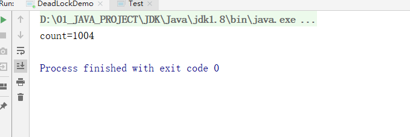

因为这段代码是非线程安全的，所以最终的自增结果很可能会小于200。我们再加上synchronized同步锁，再来看一下。

```java
public class Test {
    public static int count = 0;
    public static void main(String[] args){
        // 开启两个线程
        for (int i=0;i<2;i++){
            new Thread(()->{
                try{
                    Thread.sleep(10);
                }catch (InterruptedException e){
                    e.printStackTrace();
                }
                for (int j=0;j<1000;j++){
                   synchronized (Test.class){
                       count++;
                   }
                }

            }).start();
        }

        // 主线程休息
        try{
            Thread.sleep(2000);
        }catch (InterruptedException e){
            e.printStackTrace();
        }
        System.out.println("count="+count);
    }
}

```

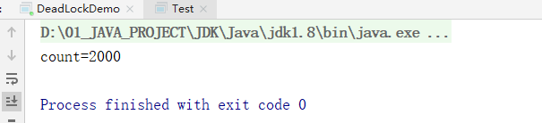


**synchronized关键字会让没有得到锁资源的线程进入BLOCKED状态，而后在争夺到锁资源后恢复为RUNNABLE状态，这个过程中涉及到操作系统用户模式和内核模式的转换，代价比较高。**

**尽管JAVA 1.6为synchronized做了优化，增加了从偏向锁到轻量级锁再到重量级锁的过过度，但是在最终转变为重量级锁之后，性能仍然比较低。所以面对这种情况，我们就可以使用java中的“原子操作类”。**

**所谓原子操作类，指的是java.util.concurrent.atomic包下，一系列以Atomic开头的包装类。如AtomicBoolean，AtomicUInteger，AtomicLong。它们分别用于Boolean，Integer，Long类型的原子性操作。**


现在我们使用AtomicInteger类：

```java
ublic class Test {
    public static AtomicInteger count = new AtomicInteger(0);
    public static void main(String[] args){
        // 开启两个线程
        for (int i=0;i<2;i++){
            new Thread(()->{
                try{
                    Thread.sleep(10);
                }catch (InterruptedException e){
                    e.printStackTrace();
                }
                for (int j=0;j<1000;j++){
                    count.incrementAndGet();
                }

            }).start();
        }

        // 主线程休息
        try{
            Thread.sleep(2000);
        }catch (InterruptedException e){
            e.printStackTrace();
        }
        System.out.println("count="+count);
    }
}

```

而Atomic操作类的底层正是用到了“CAS机制”。

## 2.CAS概念

CAS即`compare and swap（比较与交换）`，是一种无锁的算法。即不使用锁的情况下实现多线程之间的变量同步。

CAS中涉及了三个要素：

- 需要读写的内存值V
- 进行比较的值A
- 拟写入的新值B

当且仅当预期值A和内存值V相同时，将内存值修改为B，否则什么都不做。


以一个例子：

1.在内存地址V当中，存储着值为10的变量。


2.此时线程1想要把变量的值增加1。对线程1来说，旧的预期值A=10，要修改的新值B=11。

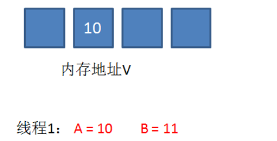

3.在线程1要提交更新之前，另一个线程2抢先一步，把内存地址V中的变量值率先更新成了11。

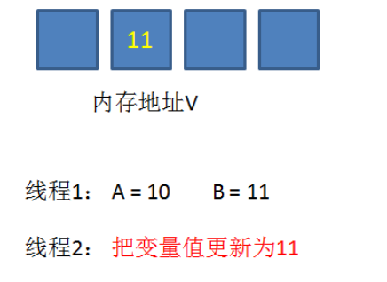

4.线程1开始提交更新，首先进行**A和地址V的实际值比较（Compare）**，发现A不等于V的实际值，提交失败。

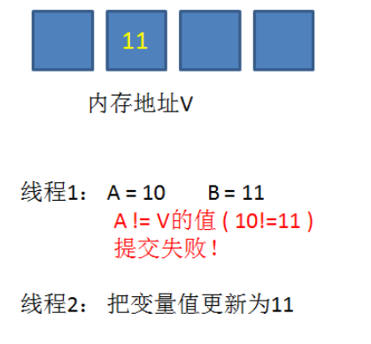

5.线程1重新获取内存地址V的当前值，并重新计算想要修改的新值。此时对线程1来说，A=11，B=12。这个重新尝试的过程被称为**自旋**。

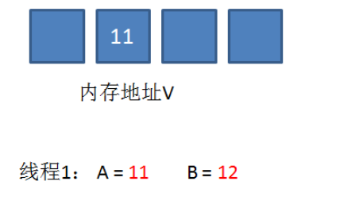

6.这一次比较幸运，没有其他线程改变地址V的值。线程1进行**Compare**，发现A和地址V的实际值是相等的。

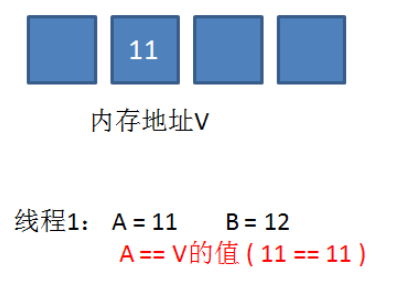

7.线程1进行**SWAP**，把地址V的值替换为B，也就是12。

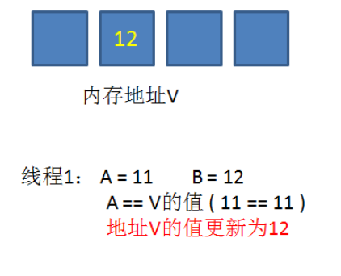

## 3.CAS的缺点

- **CPU开销过大**

  在并发量比较高的情况下，如果许多线程反复尝试更新某一个变量，却又一直更新不成功，循环往复，会给CPU带来很大的压力

- 不能保证代码块的原子性

  CAS机制所保证的只是一个变量的原子性操作，而不能保证整个代码块的原子性。比如需要保证3个变量共同进行原子性的更新，就不得使用synchronized

- ABA问题

  CAS机制的最大的问题所在。

## 4.ABA问题

假设一个提款机的例子。假设有一个咨询CAS原理的提款机，小灰有100元存款，要用这个提款机来提款50元。


由于提款机硬件出了点问题，小灰的提款操作被同时提交了两次，开启了两个线程，两个线程都是获取当前值100元，要更新成50元。

理想情况下，应该一个线程更新成功，一个线程更新失败，小灰的存款值被扣一次。

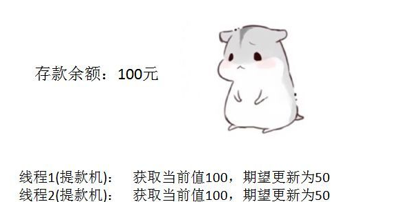

线程1首先执行成功，把余额从100改成50.线程2因为某种原因阻塞。这时，小灰的妈妈刚好给小灰汇款50元。

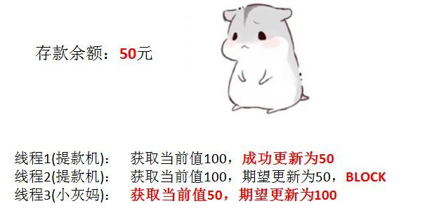

线程2仍然是阻塞状态，线程3执行成功，把余额从50改成了100。

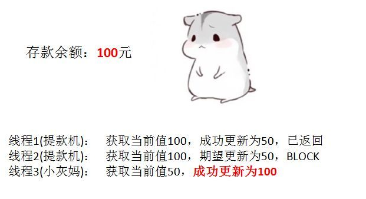

线程2恢复运行，由于阻塞之前获得了“当前值”100，并且经过compare检测，此时存款实际值也是100，所以会成功把变量值100更新成50。

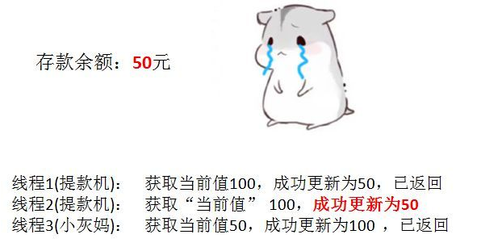

原本线程2应当提交失败，小灰的正确余额应该保持100元，结果由于ABA问题提交成功了。

那如何解决这个问题呢？在上述的基础上添加个版本号即可

## 5.版本号机制

版本号机制是在数据表中加上一个 `version` 字段来实现的，表示数据被修改的次数，当执行写操作并且写入成功后，version = version + 1，当线程A要更新数据时，在读取数据的同时也会读取 version 值，在提交更新时，若刚才读取到的 version 值为当前数据库中的version值相等时才更新，否则重试更新操作，直到更新成功。

> 真正要做到严谨的CAS机制，我们在compare阶段不仅要比较期望值A和地址V中的实际值，还要比较变量的版本号是否一致。

## 6.CAS与synchronized的使用场景

CAS适用于写比较少的情况下（多读场景，冲突一般较少）；

synchronized适用于写比较多的情况下（多写场景，冲突一般较多）；

- 对于资源竞争较少(线程冲突比较轻)的情况下，使用synchronized同步锁进行线程阻塞和唤醒切换以及用户态内核态间的切换操作额外浪费消耗cpu资源；而CAS不需要进入内核，不需要切换线程，操作内旋几率较少，因此可以获得更高的性能。
- 对于资源竞争严重(线程冲突严重)的情况，CAS自旋的概率会比较大，从而浪费更多的CPU资源，效率低于synchronized。

> 补充：Java并发编程这个领域中 synchronized 关键字一直都是元老级的角色，很久之前很多人都会称它为 “重量级锁” 。但是，在JavaSE 1.6之后进行了主要包括为了减少获得锁和释放锁带来的性能消耗而引入的 偏向锁 和 轻量级锁 以及其它各种优化之后变得在某些情况下并不是那么重了。synchronized 的底层实现主要依靠 Lock-Free 的队列，基本思路是 自旋后阻塞，竞争切换后继续竞争锁，稍微牺牲了公平性，但获得了高吞吐量。在线程冲突较少的情况下，可以获得和 CAS 类似的性能；而线程冲突严重的情况下，性能远高于CAS。

## 7.Java中的CAS的实现

在JDK中实现：java.util.concurrent中的原子类AtomicInteger通过CAS实现的。

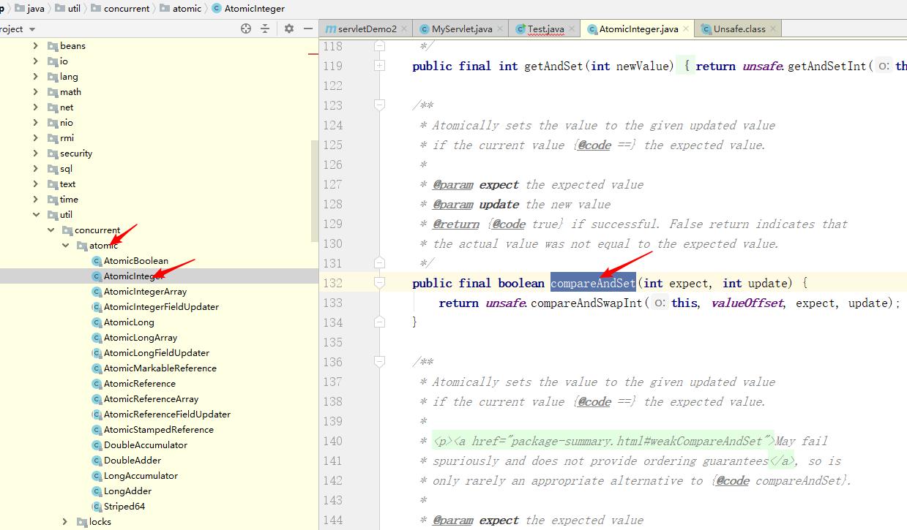

具体使用是通过Unsafe类来使用

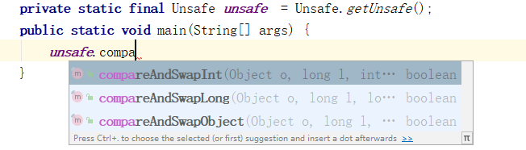

> 其中Unsafe类有100+个方法，大部分是native方法，可以理解为Java平台和底层操作系统操作的桥梁，它封装了大量的底层操作，比如直接操作内存的方法，低级同步的方法CAS方法。CAS方法就是通过直接操作主内存实现的。