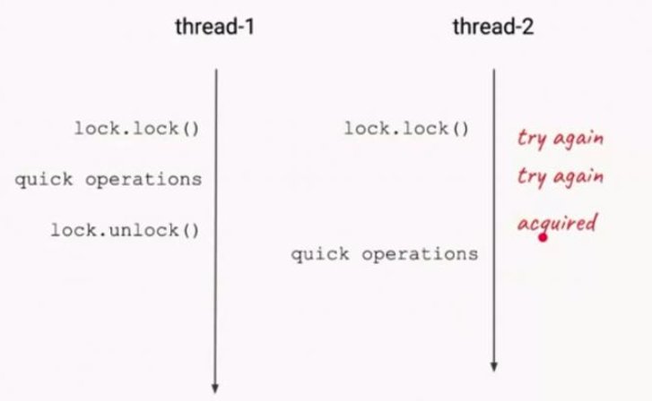

# 【Java锁体系】三、自旋锁

## 1.自旋锁的提出背景

由于在多处理器环境中某些资源的有限性，有时需要互斥访问，这时候就需要引入锁的概念，只有获取了锁的线程才能够对资源进行访问，由于多线程的核心是CPU的时间片，**所以同一时刻只能有一个线程获取到锁**。那么就面临了一个问题，没有获取到的锁的线程应该怎么办？

通常有两种方式：一种是没有获取到的锁的线程就一直循环等待判断该资源是否已经释放锁了，这种锁叫做自旋锁，它不用将线程阻塞起来(NON-BLOCKING)；还有一种处理方式就是把自己阻塞起来，等待重新调度申请，这种叫做`互斥锁`.

**自旋锁存在的意义：阻塞与唤醒线程需要操作系统从用户态切换到内核态，需要消耗一定的时间**

## 2.什么是自旋锁

自旋锁的定义：当一个线程尝试去获取某一把锁的时候，如果这个锁此时已经被别人获取(占用)，那么此线程就无法获取到这把锁，**该线程将会等待，间隔一段时间后会再次尝试获取**。这种采用循环加锁 -> 等待的机制被称为`自旋锁(spinlock)`。

`自适应自旋锁：`假定不同线程持有同一个锁对象的时间基本相当，竞争程序趋于稳定，因此，可以根据上一次自旋的时间与结果调整下一次自旋的时间，



## 3.自旋锁的优缺点

自旋锁尽可能的减少线程的阻塞，这对于锁的竞争不激烈，且占用锁时间非常短的代码块来说性能能大幅度的提升，因为自旋的消耗会小于线程阻塞挂起再唤醒的操作的消耗，这些操作会导致线程发生两次上下文切换！

但是如果锁的竞争激烈，或者持有锁的线程需要长时间占用锁执行同步块，这时候就不适合使用自旋锁了，因为自旋锁在获取锁前一直都是占用 cpu 做无用功，占着 XX 不 XX，同时有大量线程在竞争一个锁，会导致获取锁的时间很长，线程自旋的消耗大于线程阻塞挂起操作的消耗，其它需要 cpu 的线程又不能获取到 cpu，造成 cpu 的浪费。所以这种情况下我们要关闭自旋锁。

## 4.自旋锁的实现

```java
public class SpinLockTest {

    private AtomicBoolean available = new AtomicBoolean(false);

    public void lock(){

        // 循环检测尝试获取锁
        while (!tryLock()){
            // doSomething...
        }

    }

    public boolean tryLock(){
        // 尝试获取锁，成功返回true，失败返回false
        return available.compareAndSet(false,true);
    }

    public void unLock(){
        if(!available.compareAndSet(true,false)){
            throw new RuntimeException("释放锁失败");
        }
    }

}
```

这种简单的自旋锁有一个问题：**无法保证多线程竞争的公平性**。对于上面的SpinlockTest，当多个线程想要获取锁时，谁最先将`available`设为`false`谁就能最先获得锁，这可能会造成某些线程一直都未获取到锁造成`线程饥饿`。就像我们下课后蜂拥的跑向食堂，下班后蜂拥地挤向地铁，通常我们会采取排队的方式解决这样的问题，类似地，我们把这种锁叫**排队自旋锁(QueuedSpinlock)**。计算机科学家们使用了各种方式来实现排队自旋锁，如TicketLock，MCSLock，CLHLock。接下来我们分别对这几种锁做个大致的介绍

### (1)TicketLock

在计算机科学领域中，TicketLock 是一种同步机制或锁定算法，它是一种自旋锁，它使用`ticket` 来控制线程执行顺序。

TicketLock 是基于先进先出(FIFO) 队列的机制。它增加了锁的公平性，其设计原则如下：TicketLock 中有两个 int 类型的数值，开始都是0，第一个值是`队列ticket(队列票据)`， 第二个值是 `出队(票据)`。队列票据是线程在队列中的位置，而出队票据是现在持有锁的票证的队列位置。可能有点模糊不清，简单来说，**就是队列票据是你取票号的位置，出队票据是你距离叫号的位置**。现在应该明白一些了吧

**上面这个流程的关键点在于，每个办业务的人在办完业务之后，他必须丢弃自己的号码，叫号机才能继续叫到下面的人，如果这个人没有丢弃这个号码，那么其他人只能继续等待**。

### (2)CLHLock

上面说到TicketLock 是基于队列的，那么 CLHLock 就是基于链表设计的，CLH的发明人是：Craig，Landin and Hagersten，用它们各自的字母开头命名。CLH 是一种基于链表的可扩展，高性能，公平的自旋锁，申请线程只能在本地变量上自旋，它会不断轮询前驱的状态，如果发现前驱释放了锁就结束自旋。

### (3)MCSLock

MCS Spinlock 是一种基于链表的可扩展、高性能、公平的自旋锁，申请线程只在本地变量上自旋，直接前驱负责通知其结束自旋，从而极大地减少了不必要的处理器缓存同步的次数，降低了总线和内存的开销。MCS 来自于其发明人名字的首字母： John Mellor-Crummey和Michael Scott。

## 5.总结

> 自旋锁是为了提高资源的使用频率而出现的一种锁，自旋锁说的是线程获取锁的时候，如果锁被其他线程持有，则当前线程将循环等待，直到获取到锁。
>
> 自旋锁在等待期间不会睡眠或者释放自己的线程。自旋锁不适用于长时间持有CPU的情况，这会加剧系统的负担，为了解决这种情况，需要设定自旋周期，那么自旋周期的设定也是一门学问。
>
> 还提到了自旋锁本身无法保证公平性，那么为了保证公平性又引出了TicketLock ，TicketLock 是采用排队叫号的机制来实现的一种公平锁，但是它每次读写操作都必须在多个处理器缓存之间进行缓存同步，这会导致繁重的系统总线和内存的流量，大大降低系统整体的性能。
>
> 所以我们又引出了CLHLock和MCSLock，CLHLock和MCSLock通过链表的方式避免了减少了处理器缓存同步，极大的提高了性能，区别在于CLHLock是通过轮询其前驱节点的状态，而MCS则是查看当前节点的锁状态。


参考文章 [看完你就明白的锁系列之自旋锁](https://www.cnblogs.com/cxuanBlog/p/11679883.html)

