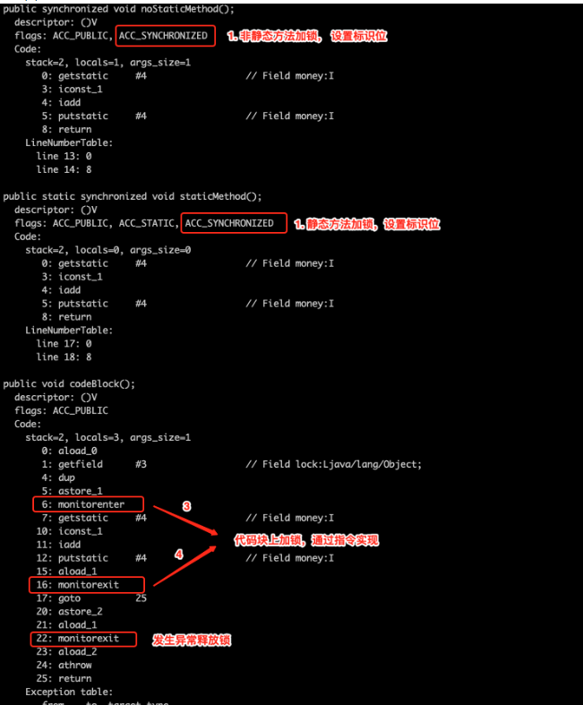
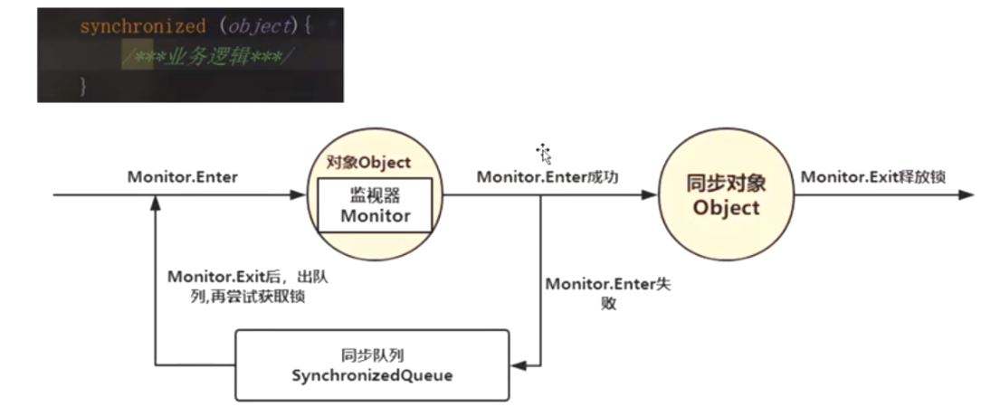
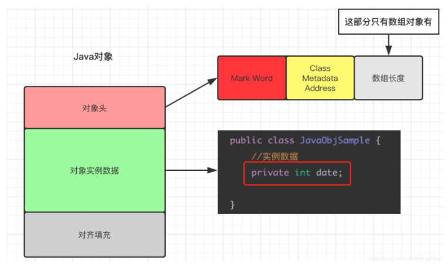
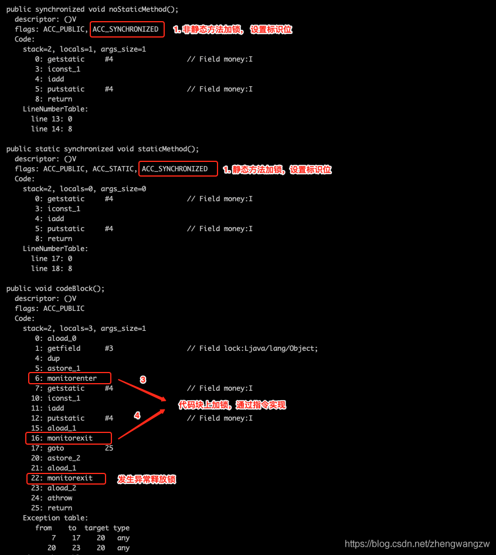
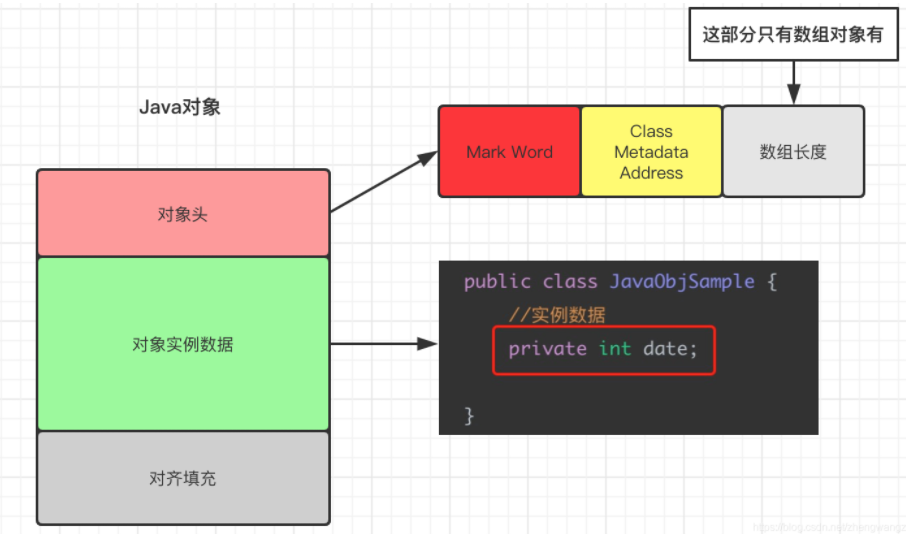
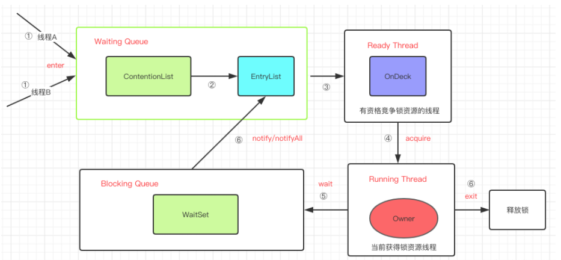
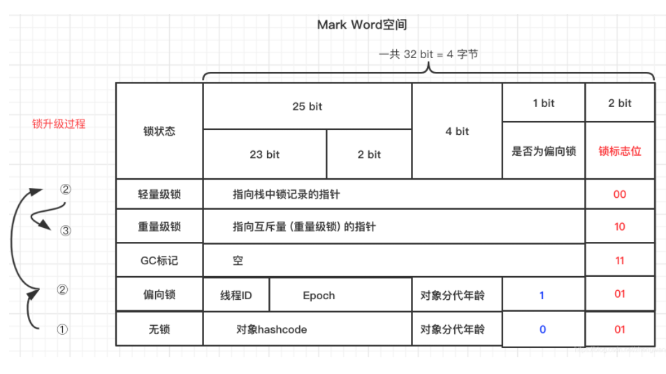
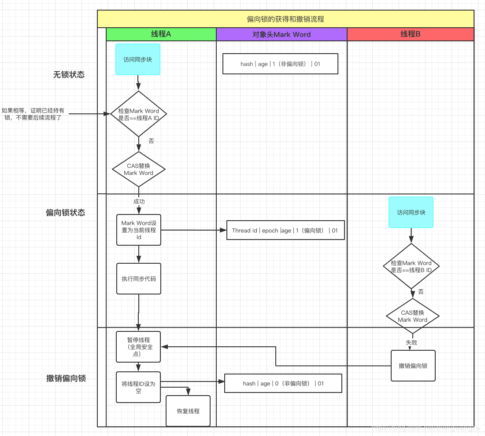

# 【Java锁体系】四、Synchronized

**互斥锁的特性：**

- 互斥性：即在**同一时间只允许一个线程持有某个对象锁**，通过这种特性来实现多线程的协调机制，这样在同一时间只有一个线程对需要同步的代码块(复合操作)进行访问。互斥性也称为操作的原子性；
- 可见性：**必须确保在锁被释放之前，对共享变量所做的修改，对于随后获得该锁的另一个线程是可见的(即在获得锁时应获得最新共享变量的值)，否则另一个线程可能是在本地缓存的某个副本上继续操作，从而引起不一致。**

**注意：**synchronized锁的不是代码，锁的都是对象；

**补充知识：**

> synchronized是JVM的内置锁，通过内部对象Monitor(监视器锁)实现的，基于进入与退出Monitor对象实现方法与代码块同步，监视器锁的实现依赖底层操作系统的Mutex lock(互斥锁的实现)。
>
> 
>
> 每一个同步对象都有一个Monitor(监视器锁)
>
> 
>
> 那么如何知道一个对象是否加锁了呢？
>
> 这里就需要引入对象的内存结构来看：
>
> 
>
> 对象的内存结构：
>
> - 对象头：比如hash码，对象所属的年代，对象锁，锁状态标志
> - 对象实例数据：即创建对象时，对象中成员变量、方法。
> - 对齐填充
>
> 那么对象具体是如何存储的呢？
>
> 具体详情可看[【JVM篇】一、初识JVM](https://codingchaozhang.blog.csdn.net/article/details/111182588)
>
> - 对象的引用存储在栈空间中
> - 对象的实例数据存储在堆空间中
> - 对象中的元数据存储在方法区中
>
> 具体对象是如何存储锁信息的可看后面的知识点。


synchronized关键字是怎么使用的？

通常是有是有三种使用方式，即synchronized关键字的使用。

即synchronized关键字加到static静态方法和synchronized(类.class)代码块上都是是给class类上锁。synchronized关键字加到实例方法上是给对象实例上锁。


> `synchronized`关键字解决的是多个线程之间访问资源的同步性，`synchronized`关键字可以保证被它修饰的方法或者代码块在任意时刻只能有一个线程执行。

Java线程是映射到操作系统的原生线程之上的。如果要挂起或者唤醒一个线程，都需要操作系统帮忙完成，而操作系统实现线程之间的切换时需要从用户态转换到内核态，这个状态之间的转环需要相对比较长的时间，时间成本相对较高。

但在Java1.6之后Java官方从JVM层面对synchronized较大优化，所以现在的synchronized锁效率也优化的很不错了。JDK1.6对锁的实现引入了大量的优化，如自旋锁、适应性自旋锁、锁消除、锁粗化、偏向锁、轻量级锁等技术来减少锁操作的开销。

## 1.synchronized关键字的使用

synchronized根据获取锁的分类：获取对象锁和获取类锁。

获取对象锁的两种用法：

- 同步代码块(synchronized(this),synchronized(类实例对象)),锁是小括号()中的实例对象；
- 同步非静态方法(synchronize method)，锁是当前对象的实例对象。

synchronized有以下三种作用范围：

- **在静态方法上加锁**
- **在非静态方法上加锁**
- **在代码块上加锁**

```java
public class SynchronizedSample {

    private final Object lock = new Object();

    private static int money = 0;
		//非静态方法
    public synchronized void noStaticMethod(){
        money++;
    }
		//静态方法
    public static synchronized void staticMethod(){
        money++;
    }
		
    public void codeBlock(){
      	//代码块
        synchronized (lock){
            money++;
        }
    }
}

```

那synchronized这三种作用范围的加锁方式的区别吗？

> 锁都是加在对象上面的。

- 对于静态方法，锁是**当前类的class对象**；
- 对于非静态方法，锁是**当前实例对象**；
- 对于同步方法快，锁是**synchronized括号里面配置的对象**。


那么JVM在实现这三种synchronized的实现方式一样吗？

> JVM基于进入和退出Monitor对象来实现同步和代码块同步，但是两者的实现细节不一样。
>
> 对代码编译成class文件之后，通过`javap -v SynchronizedSample.class` 来看下synchronized 到底在源码层面如何实现的？
>
> - 在代码块上是通过**monitorenter**和**monitorexit**指令实现的
> - 在静态方法和非静态方法上是通过**ACC_SYNCHRONIZED**实现的。



> **构造方法不能使用 synchronized 关键字修饰。**
>
> 构造方法本身就属于线程安全的，不存在同步的构造方法一说。

1. **monitorenter**：每个对象都是一个监视器锁（monitor）。当monitor被占用时就会处于锁定状态，线程执行monitorenter指令时尝试获取monitor的所有权，过程如下：

   > 1. 如果monitor的进入数为0，则该线程进入monitor，然后将进入数设置为1，该线程即为monitor的所有者；
   > 2. 如果线程已经占有该monitor，只是重新进入，则进入monitor的进入数加1；
   > 3. 如果其他线程已经占用了monitor，则该线程进入阻塞状态，直到monitor的进入数为0，再重新尝试获取monitor的所有权；

2. monitorexit：执行monitorexit的线程必须是objectref所对应的monitor的所有者。指令执行时，monitor的进入数减1，如果减1后进入数为0，那线程退出monitor，不再是这个monitor的所有者。其他被这个monitor阻塞的线程可以尝试去获取这个 monitor 的所有权。

   > monitorexit指令出现了两次，第1次为同步正常退出释放锁；第2次为发生异步退出释放锁；

   **Synchronized的底层原理是通过一个monitor的对象来完成的，其实wait/notify等方法也依赖与monitor对象，这就是为什么只有在同步的块或方法中才能调用wait/notify等方法，否则会抛出异常。**

## 2.synchronized实现对象单例模式

> 补充：单例模式定义-一个类有且仅有一个实例，并且自行实例化向整个系统提供。

其实现方式主要是通过饿汉式(线程安全的)和懒汉式(线程不安全的)。

**饿汉式**

```java
package com.lcz.syn;

// 单例模式实现方式-饿汉式
class SingleOne{
   // 创建类中私有构造
    private SingleOne(){

    }
    // 创建私有对象
    private static SingleOne instance = new SingleOne();

    // 创建公有静态返回
    public static SingleOne getInstance(){
        return instance;
    }
}

public class Test1 {
    // 主函数
    public static void main(String[] args){
        SingleOne singleOne1 = SingleOne.getInstance();
        SingleOne singleOne2 = SingleOne.getInstance();
        System.out.println(singleOne1 == singleOne2);
    }
}

```


**懒汉式**

```java
// 单例模式实现方式-懒汉式
class SingeleTwo{
    // 创建类中私有构造
    private SingeleTwo(){

    }
    // 创建静态私有对象
    private static SingeleTwo instance;
    // 创建返回
    public static SingeleTwo getInstance(){
        if (instance==null){
            instance = new SingeleTwo();
        }
        return instance;
    }
}

public class Test1 {
    // 主函数
    public static void main(String[] args){
        SingeleTwo singleOne1 = SingeleTwo.getInstance();
        SingeleTwo singleOne2 = SingeleTwo.getInstance();
        System.out.println(singleOne1 == singleOne2);
    }
}
```

但是懒汉式在多线程下不安全。

这里通过双重校验锁使其安全。

**双重校验锁实现懒汉式**

```java
// 双重校验锁实现
class Singleton{
    //私有化
    private Singleton(){

    }
    // 私有化对象
    private volatile static Singleton instance;

    // 返回方法
    public static Singleton getInstance(){
        if (instance==null){
            // 加锁
            synchronized (Singleton.class){
                if (instance==null){
                    instance = new Singleton();
                }
            }
        }
        return instance;
    }

}
```

> 1.为什么使用volatile修饰了singleton引用还用synchronized？
>
> volatile 只保证了共享变量 singleton 的可见性，但是 `singleton = new Singleton();` 这个操作不是原子的，可以分为三步：
>
> 步骤1：**在堆内存申请一块内存空**间；
>
> 步骤2：**初始化申请好的内存空间**；
>
> 步骤3：**将内存空间的地址赋值给 singleton**；
>
> 所以`singleton = new Singleton();` 是一个由三步操作组成的复合操作，多线程环境下A 线程执行了第一步、第二步之后发生线程切换，B 线程开始执行第一步、第二步、第三步（因为A 线程singleton 是还没有赋值的），所以为了保障这三个步骤不可中断，可以使用synchronized 在这段代码块上加锁。
>
> 2.第一次检查singleton为空后为什么内部还进行第二次检查
>
> **A 线程进行判空检查之后开始执行synchronized代码块时发生线程切换(线程切换可能发生在任何时候)**，B 线程也进行判空检查，B线程检查 singleton == null 结果为true，也开始执行synchronized代码块，虽然synchronized 会让二个线程串行执行，如果synchronized代码块内部不进行二次判空检查，singleton 可能会初始化二次。
>
> 3.volatile 除了内存可见性，还有别的作用吗？
>
> volatile 修饰的变量除了可见性，还能防止指令重排序。
>
> **指令重排序** 是编译器和处理器为了优化程序执行的性能而对指令序列进行重排的一种手段。现象就是CPU 执行指令的顺序可能和程序代码的顺序不一致，例如 `a = 1; b = 2;` 可能 CPU 先执行`b=2;` 后执行`a=1;`
>
> `singleton = new Singleton();` 由三步操作组合而成，如果不使用volatile 修饰，可能发生指令重排序。步骤3 在步骤2 之前执行，singleton 引用的是还没有被初始化的内存空间，别的线程调用单例的方法就会引发未被初始化的错误。

## 3.synchronized关键字的底层实现

- 在JDK6之前，synchronized那是还是重量级锁，每次加锁都依赖操作系统Mutex Lock实现，设计到操作系统让线程从用户态切换到内核态，切换成本很高l
- 在JDK6之后，synchronized的锁主要有四种状态：无锁状态、偏向锁状态、重量级锁状态，会随着竞争的激烈而逐渐升级，注意锁可以升级不可降级，这种策略是为了提高获得锁和释放锁的效率。因为sun程序员发现大部分程序大多数时间不会发生多个线程同时访问静态资源的情况。

### (1)预备知识-Java对象头(存储锁类型)



对象存储在堆中，主要分为三部分内容：对象头、对象实例化数据和对齐填充。

- 对象头

  对象头分为二个部分，Mard Word 和 Klass Word(若是数组对象还多了一个区别：记录数组长度)，列出了详细说明：

  | 对象头结构             | 存储信息-说明                                                |
  | ---------------------- | ------------------------------------------------------------ |
  | Mard Word              | 存储对象的hashCode、锁信息或分代年龄或GC标志, monitor对象 地址等信息 |
  | Class Metadata Address | 存储指向对象所属类（元数据）的指针，JVM通过这个确定这个对象属于哪个类 |

- 对象实例数据

  如上图所示类中的成员变量data就属于对象实例化数据；

- 对齐填充

  JVM要求对象占用的空间必须是8的倍数，方便内存分配，因此这部分就是用于填满不够的空间的凑数用的。

### (2)预备知识-Monitor

每一个对象都有一个与之关联的Monitor对象，Monitor对象属性如下所示：

```java
ObjectMonitor() {
    _header       = NULL;
    _count        = 0;   // 重入次数
    _waiters      = 0,   // 等待线程数
    _recursions   = 0;
    _object       = NULL;
    _owner        = NULL;  // 当前持有锁的线程
    _WaitSet      = NULL;  // 调用了 wait 方法的线程被阻塞 放置在这里
    _WaitSetLock  = 0 ;
    _Responsible  = NULL ;
    _succ         = NULL ;
    _cxq          = NULL ;
    FreeNext      = NULL ;
    _EntryList    = NULL ; // 等待锁 处于block的线程 有资格成为候选资源的线程
    _SpinFreq     = 0 ;
    _SpinClock    = 0 ;
    OwnerIsThread = 0 ;
  }

```

对象关联的ObjectMonitor对象有一个线程内部竞争锁的机制。



### (3)JDK1.6对synchronized的变化

> 在早期版本中，synchronized属于重量级锁，依赖于Mutex Lock实现；
>
> 线程之间的切换需要从用户态转换到和核心态，开销较大；



#### I.适应性自旋锁

`自旋锁的思想：`让一个线程在请另外一个共享数据的锁时执行忙循环（自旋）一段时间，如果在这段时间内能获得锁，就可以**避免进入阻塞状态**。

`自旋锁的缺点：`需要进行忙循环操作占用CPU时间，它只适用于共享数据的锁定状态很短的场景。

适应性自旋锁：若锁被其它线程长时间占用，会带来许多性能上的开销，所以自旋的次数不再固定。由前一次在同一个锁上的自旋时间以及锁的拥有者的状态来决定。

> **自旋锁**
>
> - 许多情况下，共享数据的锁定状态持续时间较短，切换线程不值得；
> - 通过让线程执行循环等待锁的释放，不让出CPU；
> - 缺点：若锁被其他线程长时间占用，会带来许多性能上的开销；
>
> **自适应自旋锁**
>
> - 自旋的次数不再固定；
> - 由前一次在同一个锁上的自旋时间以及锁的拥有者的状态来决定；

#### II.锁消除

JIT编译时，会去除不可能存在竞争的锁。通过**JIT的逃逸分析**来**消除一些没有在当前同步块以外被其它线程共享的数据的锁的保护**，通过逃逸分析在TLAB来分配对象，这样就不存在共享数据带来的线程安全问题。

#### III.锁粗化

减少不必要的紧连载一起的lock，unlock操作，**将多个连续的锁扩展成一个范围更大的锁。**

#### IV.偏向锁、轻量级锁、重量级锁

偏向锁：**只有一个线程进入临界区；**

- **大多数情况下，锁不存在多线程竞争，总是由同一线程多次获得；**

> **核心思想：**
>
> 如果一个线程获得了锁，那么锁就进入偏向模式，此时Mark Word的结构也变为偏向锁结构，当该线程再次请求锁时，无需再做任何同步操作，即获取锁的过程只需要检查Mark Work的锁标记位为偏向锁以及当前线程Id等于Mark Word的ThreadID即可，这样就省去了大量有关锁申请的操作。

轻量级锁：**多个线程交替进入临界区**；

- 轻量级锁是由偏向锁升级来的，偏向锁运行在一个线程进入同步块的情况下，当第二个线程加入锁争用的时候，偏向锁就会升级为轻量级锁。
- 适应的场景：**线程交替执行同步块**
- **若存在同一时间访问同一锁的情况，就会导致轻量级锁膨胀为重量级锁**

重量级锁：多个线程同时进入临界区；


> 背景 ：研究者经过研究发现，大多数情况下，锁不仅不存在多线程竞争，而且总是由同一线程多次获得。

**偏向锁**



**偏向锁由来：**假设整**个过程只有一个线程获得锁，那么没必要对一个线程进行多次的加锁和解锁**。

**偏向锁的使用：**

- 首先线程A访问同步代码块, 使用**CAS操作**将Thread ID放到Mark Word当中；
- 如果CAS成功，则此时线程A就获取了锁；
- 如果CAS失败，证明有别的线程持有锁，此时启动偏向锁撤销。

**偏向锁的撤销：**

- 如果第一个线程A已经执行完毕，那么CAS操作将Mark Word设置为null，第二个线程获取偏向锁，此时不会升级成轻量级锁；
- 如果第一个线程A未执行完毕，那么此时第二个线程获取锁失败，会对A线程在全局安全点阻塞，并升级为轻量级锁。


**轻量级锁**

**轻量级锁由来：**假设多线程竞争是互相错开的，不会发生线程阻塞，那么上下文切换(**用户态到内核态)**是多余的。

**轻量级锁的特点：**

- 采用了CAS操作加锁和解锁，由于轻量级锁的锁记录(Lock Record)是存放在对象头和线程空间里，因此加锁和解锁不需要上下文切换，性能消耗较少；
- 一旦发生**多线程竞争**，首先基于**“自旋锁”思想，自旋CPU旋转**等待一段时间，不会发生上下文切换，如果还是无法获得锁，那么将锁升级为**重量级锁**。


**重量级锁**

**重量级锁由来：**当同一时刻有不同的线程尝试获取锁，那么就会从轻量级锁上升为重量级锁。

**重量级锁的特点：**依赖于底层操作系统的Mutex Lock，线程会被阻塞，加锁和解锁都需要从用户态切换到内核态，性能消耗较大。


**偏向锁、轻量级锁、重量级锁的三者对比**

- 偏向锁：**只需要判断Mark Word中的一些值是否正确就行。**

  只有一个线程访问同步块时，使用偏向锁。

  > 适用于一个线程访问

- 轻量级锁：需要**执行CAS操作自旋来获取锁**

  如果执行同步代码块的时间比较少，那么**多个线程之间使用轻量级锁交替执行**。

  > 追求响应时间

- 重量级锁：会发生上下文切换，CPU状态会从**用户态转为内核态执行操作系统提供的互斥**锁，系统开销比较大。

  如果执行同步块的时间比较长，那么多个线程之间刚开始使用轻量级锁，后面膨胀为重量级锁。（因为执行同步代码块的时间长，线程CAS自旋获得轻量级失败后就会锁膨胀）

  > 追求吞吐量

## 4.synchronized是公平锁吗

synchronized是非公平锁。

synchronized在线程竞争锁时，首先做的不是直接进contentionlist队列（等待锁池）排队，在轻量级锁时会尝试自旋获取锁，如果获取不到升级为重量级锁进入contentionlist队列（等待锁池），这明显对于已经进入队列的线程是不公平的。

## 5.除了synchronized之后还有锁吗？(ReentrantLock)

ReentrantLock也可以实现加锁操作，例子如下：

```java
public class Test2 {

    private static  int money = 0;
    private final static ReentrantLock lock = new ReentrantLock();

    private static void increaseMoney(int n){
        money += n;
    }

    public static void main(String[] args) throws InterruptedException {
        Thread a= new Thread(()->{
            lock.lock();
            try{
                for (int i=0;i<1000;i++){
                    increaseMoney(1);
                }
            }finally {
                lock.unlock();
            }
        });

        Thread b = new Thread(()->{
            lock.lock();
            try{
                for (int i=0;i<1000;i++){
                    increaseMoney(1);
                }
            }finally {
                lock.unlock();
            }
        });

        a.start();
        b.start();

        a.join();
        b.join();

        System.out.println("当前总经济："+money);
    }
}

```

### (1)synchronized和ReentrantLock两者都是可重入锁

`可重入锁`指的是自己可以再次获取自己的内部锁。比如一个线程获得了某个对象的锁，此时这个对象锁还没有释放，当其再次想要获取这个对象的锁的时候还是可以获取的，如果不可锁重入的话，就会造成死锁。同一个线程每次获取锁，锁的计数器都会自增1，所以要等到锁的计数器下降为0才能释放锁。

### (2)synchronized依赖于JVM而ReentrantLock依赖于API

`synchronized` 是依赖于 JVM 实现的，前面我们也讲到了 虚拟机团队在 JDK1.6 为 `synchronized` 关键字进行了很多优化，但是这些优化都是在虚拟机层面实现的，并没有直接暴露给我们。`ReentrantLock` 是 JDK 层面实现的（也就是 API 层面，需要 lock() 和 unlock() 方法配合 try/finally 语句块来完成），所以我们可以通过查看它的源代码，来看它是如何实现的。

### (3)ReentrantLock相比synchronized增加了一些高级功能

相比`synchronized`，`ReentrantLock`增加了一些高级功能。主要来说主要有三点：

- **等待可中断** : `ReentrantLock`提供了一种能够中断等待锁的线程的机制，通过 `lock.lockInterruptibly()` 来实现这个机制。也就是说正在等待的线程可以选择放弃等待，改为处理其他事情。
- **可实现公平锁** : `ReentrantLock`可以指定是公平锁还是非公平锁。而`synchronized`只能是非公平锁。所谓的公平锁就是先等待的线程先获得锁。`ReentrantLock`默认情况是非公平的，可以通过 `ReentrantLock`类的`ReentrantLock(boolean fair)`构造方法来制定是否是公平的。
- **可实现选择性通知（锁可以绑定多个条件）**: `synchronized`关键字与`wait()`和`notify()`/`notifyAll()`方法相结合可以实现等待/通知机制。`ReentrantLock`类当然也可以实现，但是需要借助于`Condition`接口与`newCondition()`方法。

> `Condition`是 JDK1.5 之后才有的，它具有很好的灵活性，比如可以实现多路通知功能也就是在一个`Lock`对象中可以创建多个`Condition`实例（即对象监视器），**线程对象可以注册在指定的`Condition`中，从而可以有选择性的进行线程通知，在调度线程上更加灵活。 在使用`notify()/notifyAll()`方法进行通知时，被通知的线程是由 JVM 选择的，用`ReentrantLock`类结合`Condition`实例可以实现“选择性通知”** ，这个功能非常重要，而且是 Condition 接口默认提供的。而`synchronized`关键字就相当于整个 Lock 对象中只有一个`Condition`实例，所有的线程都注册在它一个身上。如果执行`notifyAll()`方法的话就会通知所有处于等待状态的线程这样会造成很大的效率问题，而`Condition`实例的`signalAll()`方法 只会唤醒注册在该`Condition`实例中的所有等待线程。


## 6.题目

### 6.1 线程B怎么知道线程A修改了变量？

- **volatile修饰变量；**
- **synchronized修饰修改变量对象**
- wait/notify
- while轮询

### 6.2 当一个线程进入一个对象的 synchronized 静态方法 A 之后，其它线程是否可进入此对象的 synchronized 方法 B？

不能。其它线程只能访问该对象的非同步方法，同步方法则不能进入。因为非静态方法上的 synchronized 修饰符要求执行方法时要获得对象的锁，如果已经进入A 方法说明对象锁已经被取走，那么试图进入 B 方法的线程就只能在等锁池（注意不是等待池哦）中等待对象的锁。

### 6.3 synchronized、volatile、CAS 比较

（1）**synchronized 是悲观锁**，属于抢占式，会引起其他线程阻塞。

（2）**volatile 提供多线程共享变量可见性**和**禁止指令重排序优化**。

（3）CAS 是基于冲突检测的**乐观锁（**非阻塞）

### 6.4 synchronized 和 Lock 有什么区别？ 参考隐式锁和显式锁 

- 首先synchronized是Java内置关键字，在JVM层面，Lock是个Java类；
- synchronized 可以给**类**、**方法**、**代码块**加锁；而 lock 只能给**代码块**加锁。
- synchronized 不需要手动获取锁和释放锁，使用简单，发生异常会自动释放锁，不会造成死锁；而 lock 需要自己加锁和释放锁，如果使用不当没有 unLock()去释放锁就会造成死锁。
- 通过 **Lock 可以知道有没有成功获取锁**，而 **synchronized 却无法办到**。

### 6.4 synchronized 和 ReentrantLock 区别是什么？

synchronized 是和 if、else、for、while 一样的关键字，ReentrantLock 是类，这是二者的本质区别。既然 ReentrantLock 是类，那么它就提供了比synchronized 更多更灵活的特性，可以被继承、可以有方法、可以有各种各样的类变量

synchronized 早期的实现比较低效，对比 ReentrantLock，大多数场景性能都相差较大，但是在 Java 6 中对 synchronized 进行了非常多的改进。

相同点：两者都是可重入锁

两者都是可重入锁。“可重入锁”概念是：自己可以再次获取自己的内部锁。比如一个线程获得了某个对象的锁，此时这个对象锁还没有释放，当其再次想要获取这个对象的锁的时候还是可以获取的，如果不可锁重入的话，就会造成死锁。同一个线程每次获取锁，锁的计数器都自增1，所以要等到锁的计数器下降为0时才能释放锁。

主要区别如下：

- ReentrantLock 使用起来比较灵活，但是必须有释放锁的配合动作；
- ReentrantLock 必须手动获取与释放锁，而 synchronized 不需要手动释放和开启锁；
- ReentrantLock 只适用于代码块锁，而 synchronized 可以修饰类、方法、变量等。
- 二者的锁机制其实也是不一样的。ReentrantLock 底层调用的是 Unsafe 的park 方法加锁，synchronized 操作的应该是对象头中 mark word

Java中每一个对象都可以作为锁，这是synchronized实现同步的基础：

- 普通同步方法，锁是当前实例对象
- 静态同步方法，锁是当前类的class对象
- 同步方法块，锁是括号里面的对象


> 总结：
>
> - synchronized是关键字，ReentrantLock是类；
> - ReentrantLock可以对获取锁的等待时间进行设置，避免死锁；
> - ReentrantLock可以获取各种锁的信息；
> - ReentrantLock可以灵活地实现多路通知；
> - 机制：synchronized操作Mark Work，ReentrantLock调用**Unsafe类的park()方法**