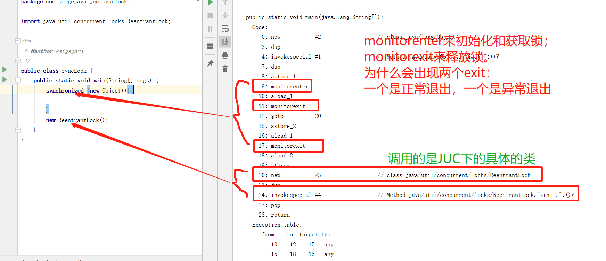
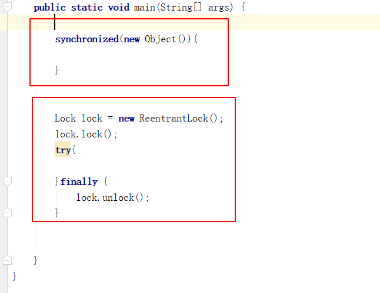
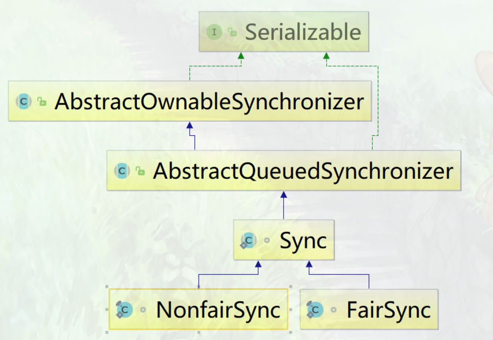

# 【Java锁体系】五、隐式锁和显式锁的区别(Synchronized和Lock的区别)

在Java并发编程中，Java中隐式锁有synchronized，显氏锁有Lock。

## 1.两者的出身不同

synchronized是Java中的关键字，由JVM维护，是JVM层面的锁；

而lock是JDK5之后才出现的具体的类，使用Lock是调用对应的API，是API层面的锁。

> **synchronized的底层是通过monitorenter进行加锁的**（底层是通过monitor对象来完成的，其中的wait/notify等方法也是依赖monito对象的，只有在同步块或者是同步方法中才可以调用wait/notify方法。因为只有在同步块或同步方法中，JVM才会调用monitor对象的。）；通过monitorexit来退出锁的。
>
> **Lock则是通过调用相应的API方法来获取和释放锁**

## 2.使用方式的不同

synchronized隐式锁；lock是显式锁

显氏锁和隐式锁的区别在于：使用显式锁的时候，使用者需要手动去获取和释放锁。

> 在使用synchronized关键字的时候，使用者不需要写其他的代码，程序就可以自动获取锁和释放锁。synchronized是由系统维护的，系统会自动的让程序释放占用的锁。
>
> 在使用lock的时候，需要使用者手动去获取锁和释放锁。如果没有释放锁，就可能出现死锁的现象。手动获取锁的方法lock.lock(); 释放锁的操作：unlock().

## 3.等待是否中断

synchronized关键字是不可中断的，除非抛出异常或者正常运行结束

而Lock是可以中断的，中断方式：

- 调用设置超时方法tryLock(Long timeout,timeUnit unit)
- 调用lockInterruptibly()放到代码块中，然后调用interrupt()方法可以中断。

## 4.加锁的时候是否公平

synchronized是非公平锁；

而lock两者都可以，默认创建是非公平锁。

## 5.锁绑定多个条件来condition

synchronized要么随机唤醒一个线程；要么是唤醒所有等待的线程。

lock：可以用实现分组唤醒需要唤醒的线程，可以精准的唤醒，而不是像synchronized那样，不能精准唤醒线程。

## 6.性能比较

synchronized是托管给JVM去执行的，而Lock是Java写的控制锁的代码。在Java1.5中，synchronized的性能是低效的，因为其是重量级锁的操作，需要从用户态切换到内核态消耗大量的时间。相比之下使用Java提供的Lock对象，性能更高一些。但是到了Java1.6之后，对synchronized关键字进行了优化，有适应性自旋，锁消除，轻量级锁，偏向锁等，导致在Java1.6中synchronized的性能并不比lock差。

> 在之前的synchronized版本中使用是**悲观锁**的机制，即线程独占锁，其它线程只能依靠阻塞来等待线程释放的锁，而线程阻塞时会引起线程的上下文切换，当有很多线程竞争锁的时候，会引起CPU频繁的上下文切换导致效率很低。
>
> 而**Lock使用的乐观锁的**方式。所谓乐观锁就是，每次不加锁而是假设没有冲突而去完成某项操作，如果因为冲突失败就重试，直到成功为止。乐观锁的实现方式就**CAS机制(compareAndSetstate)，调用的是CPU提供的底层指令**。