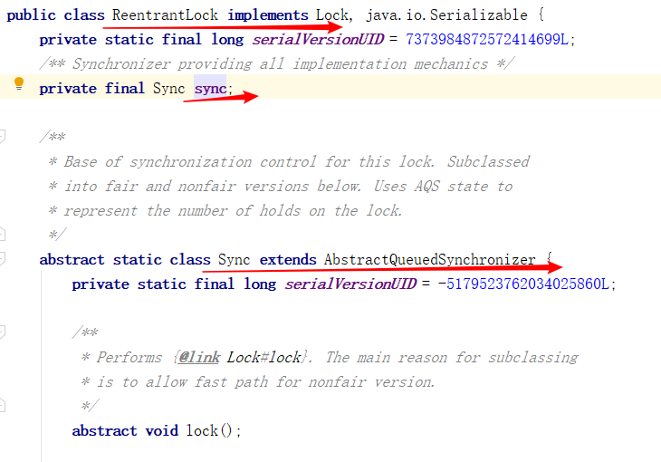
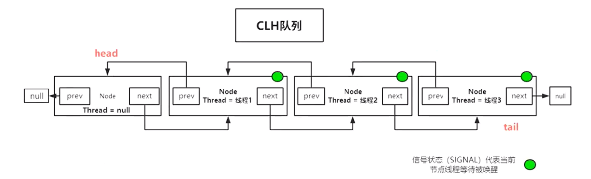
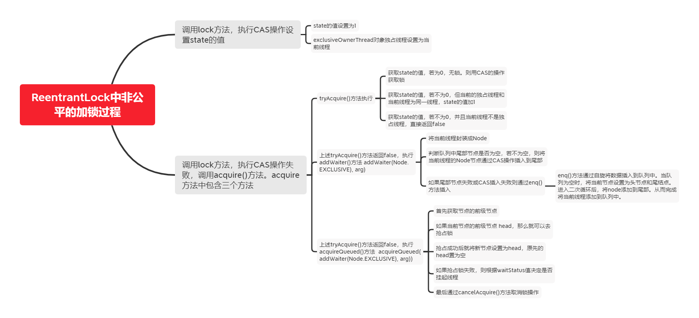

# 【Java锁体系】六、AQS原理分析(AbstractQueuedSynchronizer实现分析)

上述文章中提到了ReentrantLock，而是通过AQS来实现的。



## 1.什么是AQS？AQS是用来做什么的？

AQS(AbstractQueuedSynchronuzer)是JUC(java.util.concurrent)中提供的用来**构建锁和同步器**的框架，基于AQS，我们可以很容易的构建高效的同步器，例如ReentrantLock。

AQS是锁实现的模板，解决锁实现中大量的细节问题，例如线程等待，资源的同步等。

> 总之，AQS的设计初衷就是为了一个方便开发者再其基础上定制开发各类同步器，所以需要分析各类通乎其的共通可复用的特性，将其抽取出来，由AQS封装实现，外部仅需调用即可。

**AQS维护了一个volatile的state(共享资源)和一个FIFO(双向队列)线程等待队列(多线程争用资源被阻塞时会进入此队列)**

java.util.concurrent(J.U.C)大大提高了并发性能，AQS被认为是J.U.C的核心。AQS相当于模板方法，将锁实现的模板抽离出来，解决了锁实现中大量的细节问题。其主要通过维护了一个volatile的state共享资源和一个FIFO的双向队列。

**(1)CountDownLatch**

用来控制一个或者多个线程等待多个线程。

**(2)CyclicBarrier**

用来控制多个线程互相等待，只有当多个线程都到达时，这些线程才会继续执行。

**(3)Semaphore**

Semaphore类似于操作系统中的信号量，可以对互斥资源的访问线程数。

**(4)JUC的其它框架-FutureTask**

**(5)BlockingQueue**

java.util.concurrent.BlockingQueue接口有以下阻塞队列的实现：

- FIFO队列：LinkedBlockingQueue、ArrayBlokingQueue(固定长度)
- 优先级队列：ProrityBlockingQueue

阻塞的队列的作用是：如果队列为空take()将阻塞，直到队列有内容；如果队列为满put()将阻塞，直到队列有空闲位置；

**(5)ForkJoin**

主要用于并行计算中，把大的计算任务拆分成多个小任务并行计算。


## 2.AQS原理

AQS全称是`AbstractQueuedSynchronizer`，抽象队列同步器。

AQS定义了两个资源共享模式：

- **独占式：每次只能有一个线程持有锁，例如`ReentrantLock`实现的就是独占式的锁资源。**
- **共享式：允许多个线程同时获取锁，并发访问共享资源, `ReentrantWriteLock`和`CountDownLatch`就是实现的该种模式。**

一般来说，自定义同步器要么是独占式方法，要么是共享式方法。它们也只需实现`tryAcquire-tryRelease`，`tryAcquireShared-tryReleaseShared`中的一种即可。但AQS也支持自定义同步器同时实现独占式和共享式这两种方法，如`ReentrantReadWriteLock`.



**AQS维护了一个`volatile`的state的共享资源变量和一个`FIFO`（先进先出）的队列**。其中`state`的变量代表的是竞争资源标识，而队列代表的是竞争资源失败的线程排队时存放的容器。

```java
public abstract class AbstractQueuedSynchronizer extends AbstractOwnableSynchronizer implements java.io.Serializable {
	...
	/**
	 * The synchronization state.
	 */
	private volatile int state;
	/**
     * Wait queue node class.
     **/
     static final class Node {
		...
	}
	...
}
```


AQS提供了操作state的方法：

- **getState();**
- **setState();**
- **compareSetState();**

```java
protected final int getState() {
    return state;
}
protected final void setState(int newState) {
    state = newState;
}
protected final boolean compareAndSetState(int expect, int update) {
    // See below for intrinsics setup to support this
    return unsafe.compareAndSwapInt(this, stateOffset, expect, update);
}
```


因为`AbstractQueuedSynchronizer`是一个抽象类，他采用**模板方法**的设计模式，规定了**独占**和**共享**模式需要实现的方法，并且将一些通用的功能已经进行了实现，所以不同模式的使用方式，只需要自己定义好实现共享资源的获取与释放即可，至于具体线程在等待队列中的维护（获取资源入队列、唤醒出队列等），AQS已经实现好了。

- `isHeldExclusively()；`// 是否为独占模式；但是只有使用到了Condition的，才需要去实现它。例如：ReentrantLock。
- `boolean tryAcquire(int arg);` // 独占模式；尝试获取资源，成功返回true，失败返回false。
- `boolean tryRelease(int arg) ;` // 独占模式；尝试释放资源，成功返回true，失败返回false。
- `int tryAcquireShared(int arg);` // 共享模式；尝试获取资源，负数表示失败；0表示成功，但是没有剩余可用资源了；正数表示成功，且有剩余可用资源。
- `boolean tryReleaseShared(int arg) ;` // 共享模式；尝试释放资源，若释放资源后允许唤醒后续等待节点返回true，否则返回false。

上面的这几个方法在`AbstractQueuedSynchronizer`这个抽象类中，都没有被定义为abstract的，说明这些方法都是可以按需实现的，共享模式下可以只实现共享模式的方法（例如`CountDownLatch`），独占模式下可以只实现独占模式的方法（例如`ReentrantLock`）,也支持两种都实现，两种模式都使用（例如`ReentrantReadWriteLock`）。


## 3.AQS源码分析

先简单介绍AQS的两种模式的实现类的代表`ReentrantLock`(独占模式)和`CountDonwLatch`(共享模式)，是如何来共享资源的一个过程。之后再详细通过AQS的源码来分析整个过程。

- `ReentrantLock`在初始化的时候state=0，表示资源未被锁定。当A线程执行`lock()`方法时，会调用`tryAcquire()`方法，将AQS中队列的模式设置为独占，并将独占线程设置为线程A，以及将`state+1`。这样在线程A没有释放锁前，其它线程来竞争锁，调用`tryAcquire()`方法时都会失败，然后竞争锁失败的线程就会进入到队列中。当线程A调用执行`unlock()`方法将`state=0`后，其它线程才有机会获取锁（注意：`ReentrantLock`是可重入的，同一线程多次获取锁时`state`值会进行叠加的，在释放锁也要释放相应的次数才算完全释放了锁）。
- `CountDownLatch`会将任务分成N个子线程去执行，satte的初始值也是N(`state`与子线程的数量一致)。N个子线程是并行执行的，每个子线程执行完成后`countDown()`一次，`state`会通过CAS的方式减1。直到所有子线程执行完成后(`state=0`)，会通过`unpack()`方法唤醒主线程，然后主线程就会从`await()`方法返回，继续后续操作。

### 3.1 基于AQS的独占模式-ReentrantLock

**独占模式**

在AbstractQueuedSynchronizer的类里面有一个静态内部类Node。它代表的是队列中的每一个节点。
其中Node节点有如下几个属性：

```java
// 节点的状态
volatile int waitStatus;
// 当前节点的前一个节点
volatile Node prev;
// 当前节点的后一个节点
volatile Node next;
// 当前节点中所包含的线程对象
volatile Thread thread;
// 等待队列中的下一个节点
Node nextWaiter;
```

每个属性代表的什么，已经写在代码注释中了。其中Node类中还有几个常量，代表了几个节点的状态（`waitStatus`）值。

```java
	/** waitStatus value to indicate thread has cancelled */
	static final int CANCELLED =  1;
	/** waitStatus value to indicate successor's thread needs unparking */
	static final int SIGNAL    = -1;
	/** waitStatus value to indicate thread is waiting on condition */
	static final int CONDITION = -2;
	/**
	 * waitStatus value to indicate the next acquireShared should
	 * unconditionally propagate
	 */
	static final int PROPAGATE = -3;
```

首先节点的状态值waitStatus默认是0，然后下面几个常量有自己具体的含义。
`CANCELLED = 1；` 代表的是当前节点从同步队列中取消，当timeout或被中断（响应中断的情况下），会触发变更为此状态，进入该状态后的结点将不会再变化。
`SIGNAL = -1；` 代表后继节点处于等待状态。后继结点入队时，会将前继结点的状态更新为SIGNAL。
`CONDITION = -2;` 节点在等待队列中，节点线程等待在Condition上，当其他线程对Condition调用了 `signal()`方法后，该节点将会从等待队列中转移到同步队列中，加入到对同步状态的获取中。
`PROPAGATE = -3;` 表示在共享模式下，前继节点在释放资源后会唤醒后继节点，并将这种共享模式传播下去。

通过上面几个固定的常量值，我们可以看出节点状态中通常负数值通常表示节点处于有效的等待状态，而正数值代表节点已经被取消了。

所以AQS源码中有很多地方都用`waitStatus>0`或`waitStatus<0`这种方式来判断队列中节点的是否正常。

**独占模式下，只能有一个线程占有锁资源，其他竞争资源的线程，在竞争失败后都会进入到等待队列中，等待占有锁资源的线程释放锁，然后再重新被唤醒竞争资源。**

#### 3.1.1 ReentrantLock加锁过程

`ReentrantLock`默认是非公平锁，就是说，线程在竞争锁的时候并不是按照先来后到的顺序来获取锁的，但是`ReentrantLock`也是支持公平锁的，在创建的时候传入一个参数值即可。
下面我们以`ReentrantLock`默认情况下的加锁来分析AQS的源码。
`ReentrantLock`并没有直接继承AQS类，而是通过内部类来继承AQS类的，这样自己的实现功能，自己用。
我们在用`ReentrantLock`加锁的时候都是调用的用`lock()`方法，那么我们来看看默认非公平锁下，`lock()`方法的源码：

```java
/**
 * Sync object for non-fair locks
 */
static final class NonfairSync extends Sync {
    private static final long serialVersionUID = 7316153563782823691L;

    /**
     * Performs lock.  Try immediate barge, backing up to normal
     * acquire on failure.
     */
    final void lock() {
        if (compareAndSetState(0, 1))
            setExclusiveOwnerThread(Thread.currentThread());
        else
            acquire(1);
    }

    protected final boolean tryAcquire(int acquires) {
        return nonfairTryAcquire(acquires);
    }
}
```

通过源码可以看到，`lock()`方法，首先是通过CAS的方式抢占锁，如果抢占成功则将state的值设置为1。然后将对象独占线程设置为当前线程。

```java
// 设置独占线程为当前线程
protected final void setExclusiveOwnerThread(Thread thread) {
    exclusiveOwnerThread = thread;
}
```

如果抢占锁失败，就会调用`acquire()`方法，这个`acquire()`方法的实现就是在AQS类中了，说明具体抢占锁失败后的逻辑，AQS已经规定好了模板。

```java
public final void acquire(int arg) {
    if (!tryAcquire(arg) &&
        acquireQueued(addWaiter(Node.EXCLUSIVE), arg))
        selfInterrupt();
}
```

这里首先就是通过`tryAcquire()`方法抢占锁，如果成功返回true，失败返回false。`tryAcquire()`方法的具体实现，是在`ReentrantLock`里面的，AQS类中默认是直接抛出异常的。

- 首先获取state值，如果state值为0，说明无锁，那么通过CAS尝试加锁，成功后，将独占线程设置为当前线程。
- 如果state值不为0，并且当前的独占线程和当前线程为同一线程，那么state重入次数加1。
- 如果state值不为0，并且当前线程不是独占线程，直接返回false。

```java
protected final boolean tryAcquire(int acquires) {
    return nonfairTryAcquire(acquires);
}
final boolean nonfairTryAcquire(int acquires) {
     final Thread current = Thread.currentThread();
     int c = getState();// 获取state值
     if (c == 0) { 
     // 如果state值为0，说明无锁，那么就通过cas方式，尝试加锁，成功后将独占线程设置为当前线程
         if (compareAndSetState(0, acquires)) {
             setExclusiveOwnerThread(current);
             return true;
         }
     }
     else if (current == getExclusiveOwnerThread()) { // 如果是同一个线程再次来获取锁，那么就将state的值进行加1处理（可重入锁的，重入次数）。
         int nextc = c + acquires;
         if (nextc < 0) // overflow
             throw new Error("Maximum lock count exceeded");
         setState(nextc);
         return true;
     }
     return false;
 }
```

在`acquire()`方法，在执行完`tryAcquire()`方法后，如果加锁失败那么就会执行`addWaiter()`方法和`acquireQueued()`，这两个方法的作用是将竞争锁失败的线程放入到等待队列中。

`addWaiter()`方法的源码如下：

```java
private Node addWaiter(Node mode) {
	// 用参数指定的模式将当前线程封装成队列中的节点（EXCLUSIVE【独占】，SHARED【共享】）
    Node node = new Node(Thread.currentThread(), mode);
    // Try the fast path of enq; backup to full enq on failure
    Node pred = tail;
    // tail是队列的尾部节点，初始时队列为空，尾部节点为null，直接调用enq将节点插入队列
    if (pred != null) {
    // 将当前线程节点的前级节点指向队列的尾部节点。
        node.prev = pred;
        // 通过CAS方式将节点插入到队列中
        if (compareAndSetTail(pred, node)) {
        // 插入成功后，将原先的尾部节点的后级节点指向新的尾部节点
            pred.next = node;
            return node;
        }
    }
    // 如果尾部节点为空或通过CAS插入队列失败则通过enq方法插入节点
    enq(node);
    return node;
}
```

`addWaiter()`中主要做了三件事：

- 将当前线程封装成Node。
- 判断队列中尾部节点是否为空，若不为空，则将当前线程的Node节点通过CAS插入到尾部。
- 如果尾部节点为空或CAS插入失败则通过`enq()`方法插入到队列中。

**那么enq()方法是又是怎么插入节点的呢？**

enq()方法源码如下：

```java
private Node enq(final Node node) {
	// 看到死循环，就明白是通过自旋咯
    for (;;) {
    // 当tail节点为空时直接将当前节点设置成尾部节点，并插入到队列中，以及设置它为head节点。
        Node t = tail;
        if (t == null) { // Must initialize
            if (compareAndSetHead(new Node()))
                tail = head;
        } else {
        // 若是因为在addWaiter()方法中插入失败或第二次进入循环，那么将当前线程的前级节点指向尾部节点，并通过CAS方式将尾部节点指向当前线程的节点。
            node.prev = t;
            if (compareAndSetTail(t, node)) {
                t.next = node;
                return t;
            }
        }
    }
}
```

其实enq()方法主要就是通过自旋将数据插入到队列中的操作：

- 当队列为空时，将当前节点设置为头节点和尾节点。
- 进入二次循环后，将node添加到尾部。

这样addWaiter()方法就构造了一个队列，并将当前线程添加到了队列中了。我们再回到`acquire()`方法中。现在就剩下`acquireQueued()`方法没看了，这个方法中的操作挺多的。

```java
final boolean acquireQueued(final Node node, int arg) {
    boolean failed = true;
    try {
        boolean interrupted = false;
        for (;;) {
        // 获取前级节点，如果未null，则抛出异常
            final Node p = node.predecessor();
        // 如果前级节点为head，并且执行抢占锁成功。
            if (p == head && tryAcquire(arg)) {
            // 抢占锁成功，当前节点成功新的head节点
                setHead(node);
                // 然后将原先的head节点指向null，方便垃圾回收进行回收
                p.next = null; // help GC
                failed = false;
                return interrupted;
            }
            // 如果当前节点不为head,或者抢占锁失败。就根据节点的状态决定是否需要挂起线程。
            if (shouldParkAfterFailedAcquire(p, node) &&
                parkAndCheckInterrupt())
                interrupted = true;
        }
    } finally {
        if (failed) // 如果获取锁异常，则出取消获取锁操作。
            cancelAcquire(node);
    }
}
```

```java
final Node predecessor() throws NullPointerException {
    Node p = prev;
    if (p == null)
        throw new NullPointerException();
    else
        return p;
}
```

- 首先获取节点的前级节点。
- 如果当前节点的前级节点是head那么就可以去抢占锁了。
- 抢占成功后就将新节点设置为head，原先的head置为空。
- 如果抢占锁失败，则根据`waitStatus`值决定是否挂起线程。
- 最后，通过`cancelAcquire()`取消获取锁操作。

下面看一下`shouldParkAfterFailedAcquire()`和`parkAndCheckInterrupt()`这两个方法是如何挂起线程的。

```java
private static boolean shouldParkAfterFailedAcquire(Node pred, Node node) {
    int ws = pred.waitStatus;// 获取前级节点
    if (ws == Node.SIGNAL)// 如果前级节点的waitStatus值为SIGNAL(-1),说明当前节点也已经在等待唤醒了，直接返回true。
        return true;
  // 如果前级节点的waitStatus值大于0说明前级节点已经取消了。
    if (ws > 0) {
   // 如果前级节点已经是CANCEL状态了，那么会继续向前找，直到找到的节点不是CANCEL（waitStatue>0）状态的节点，然后将其设置为当前节点的前级节点。
        do {
            node.prev = pred = pred.prev;
        } while (pred.waitStatus > 0);
        pred.next = node;
    } else {
    // 如果前级节点为0或者其他不为-1的小于0的值，则将当前节点的前级节点设置为 SIGNAL(-1)
        compareAndSetWaitStatus(pred, ws, Node.SIGNAL);
    }
    return false;
}
```

`arkAndCheckInterrupt()`方法的作用就是挂起线程，如果`shouldParkAfterFailedAcquire()`方法成功，会执行`parkAndCheckInterrupt()`方法，它通过`LockSupport的park()`方法，将当前线程挂起（WAITING），它需要`unpark()`方法唤醒它，通过这样一种FIFO机制的等待，来实现Lock操作。

```java
private final boolean parkAndCheckInterrupt() {
    LockSupport.park(this);
    return Thread.interrupted();
}
```

`LockSupport`是JDK从1.6开始提供的一个线程同步源语工具类，在这里主要用到了它的两个方法，挂起线程和唤醒线程：

```java
public static void park() {
    UNSAFE.park(false, 0L);
}
public static void unpark(Thread thread) {
    if (thread != null)
        UNSAFE.unpark(thread);
}
```

`LockSupport`的挂起和唤醒线程都是不可重入的，它由一个许可标志，当调用park()时就会将许可设置为0，挂起线程，如果再调用一次`park()`，会阻塞线程。当调用`unpark()`时才会将许可标志设置成1。

**总结加锁过程：**



#### 3.1.2 ReentrantLock释放锁过程

`ReentrantLock`释放锁的过程主要有两个阶段：

- 释放锁
- 唤醒挂起的线程。


`unlock()`方法的源码如下。

```java
public void unlock() {
   sync.release(1);
}
```

释放锁的方法是写在父类，`AbstractQueuedSynchronizer`类中的。源码如下：

```java
// 释放独占模式下的锁资源
public final boolean release(int arg) {
    if (tryRelease(arg)) { // 尝试释放资源
        Node h = head;
  //释放成功后，判断头节点的状态是否为无锁状态，如果不为无锁状态就将头节点中的线程唤醒。
        if (h != null && h.waitStatus != 0)
            unparkSuccessor(h);
        return true;
    }
    return false; // 释放资源失败，直接返回false
}
```

我们首先释放资源来看`tryRelease()`方法的源码，看看释放资源是怎样的过程。

```java
protected final boolean tryRelease(int releases) {
// 从state中减去传入参数的相应值（一般为1）
    int c = getState() - releases;
    // 当释放资源的线程与独占锁现有线程不一致时，非法线程释放，直接抛出异常。
    if (Thread.currentThread() != getExclusiveOwnerThread())
        throw new IllegalMonitorStateException();
    boolean free = false;
    // 这里是处理重入锁的机制，因为可重入机制，所以每次都重入state值都加1，
    //所以在释放的时候也要相应的减1，直到state的值为0才算完全的释放锁资源。
    if (c == 0) {
        free = true;
        // 完全释放资源后，将独占线程设置为null,这样后面的竞争线程才有可能抢占。
        setExclusiveOwnerThread(null);
    }
    // 重新赋值state
    setState(c);
    return free;
}
```

`tryRelease()`方法在释放锁资源时，可以单纯的理解为是修改**独占模式的状态值**和**置空占有线程**的操作。将`state`的值减掉相应的参数值（一般是1），如果计算结果为0，就将他的独占线程设置为`null`，其他线程才有机会抢占成功。（在加锁时，同一线程加一次锁，`state`状态值就会加1，在解锁的时候没解锁一次就会减1，同一个锁可重入，只有`lock`次数与`unlock`次数相同才会释放资源，将独占线程设置为null。）

释放了资源后，我们再看唤醒挂起线程时的过程。这个过程就在`unparkSuccessor()`方法中。

```java
private void unparkSuccessor(Node node) {
    /* 获取当前节点的等待状态，一般是头节点，占有锁的节点是在头节点上。 */
    int ws = node.waitStatus;
    // 将当前节点的线程的状态值设为0，成为无锁状态。
    if (ws < 0)
        compareAndSetWaitStatus(node, ws, 0);
    /*
     * Thread to unpark is held in successor, which is normally
     * just the next node.  But if cancelled or apparently null,
     * traverse backwards from tail to find the actual
     * non-cancelled successor.
     */
    Node s = node.next;// 获取下一个需要唤醒的节点线程。
    if (s == null || s.waitStatus > 0) {// 如果获取到的节点线程为空或已经取消
        s = null;
        // 就从队列的后面向前找，直到找到一个未取消的节点。
        for (Node t = tail; t != null && t != node; t = t.prev)
            if (t.waitStatus <= 0)
                s = t;
    }
    if (s != null) // 如果获得的下一个可以唤醒的节点线程不为空，那么就唤醒它。
        LockSupport.unpark(s.thread);
}
```

这个释放过程就是将需要释放的线程节点设置成无锁状态，然后去队列中找到可以唤醒的节点，进行唤醒线程。
**有一点需要解释一下，就是在寻找可以唤醒的节点时，为什么要从后向前找？**

**线程唤醒的时候，通常是从当前线程的下个节点线程开始寻找，但是下个节点有可能已经取消了或者为null了，所以从后向前找，直到找到一个非 取消状态的节点线程。**


### 3.2 基于AQS的共享模式-CountDownLatch

> CountDownLatch的简介：CountDownLatch是一个同步工具类，用来协调多个线程之间的同步，或者起到线程之间的通信。
>
> CountDownLatch能够使一个线程在等待另外一些线程完成各自工作之后，再继续执行。使用一个计数器进行实现。计数器的初始值为线程的数量。当每一个线程完成自己的任务后，计数器的值就会减一。当计数器的值为0时，表示所有的线程的都已经完成一些任务，然后在CountDownLatch上等待的线程就可以恢复执行接下来的任务。

#### 3.2.1 CountDownLatch获取共享资源的过程

在使用CountDownLatch的时候，是先创建CountDownLatch对象，然后在每次执行完一个任务后，就执行一次countDown()方法。直到通过getCount()获取到的值为0时才算执行完，如果count值不为0可通过await()方法让主线程进行等待，直到所有任务都执行完成，count的值被设为0。

那么我们先来看创建CountDownLatch的方法。

```java
public CountDownLatch(int count) {
    if (count < 0) throw new IllegalArgumentException("count < 0");
    this.sync = new Sync(count);
}

private static final class Sync extends AbstractQueuedSynchronizer {
   private static final long serialVersionUID = 4982264981922014374L;
   Sync(int count) {
       setState(count);
   }
}
```

我们看到创建CountDownLatch的过程，其实就是将count值赋值给state的过程。

再来看await()方法的源码：

```java
public void await() throws InterruptedException {
    sync.acquireSharedInterruptibly(1);// 等待可中断的获取共享资源的方法
}
public final void acquireSharedInterruptibly(int arg)
            throws InterruptedException {
    if (Thread.interrupted()) // 如果线程已经中断，直接抛出异常结束。
        throw new InterruptedException();
    if (tryAcquireShared(arg) < 0)// 尝试获取共享资源，获取失败后，自旋入队列
        doAcquireSharedInterruptibly(arg);// 可中断的入队列过程
}
```

整个await()的等待过程是，先尝试获取共享资源，获取成功则执行任务，获取失败，则调用方法自旋式进入等待队列。

通过最初在介绍AQS的时候就说过 ，共享模式下是需要自己去实现tryAcquireShared()方法来获取共享资源的，那么我们看看CountDownLatch是如何实现获取共享资源的。

```java
protected int tryAcquireShared(int acquires) {
    return (getState() == 0) ? 1 : -1;
}
```

简单易懂，就一行代码，直接获取state值，等于0就是成功，不等于0就失败。

那么获取资源失败后，doAcquireSharedInterruptibly()方法是如何入执行的呢。
源码如下：

```java
private void doAcquireSharedInterruptibly(int arg)
        throws InterruptedException {
    final Node node = addWaiter(Node.SHARED);// addWaiter()方法已经总结过了，这一步操作的目的就是将当前线程封装成节点加入队尾，并设置成共享模式。
    boolean failed = true;
    try {
        for (;;) {
            final Node p = node.predecessor();// 获取前级节点
            if (p == head) {
            // 如果前级节点是头节点，直接尝试获取共享资源。
                int r = tryAcquireShared(arg);
                if (r >= 0) {// 如果获取共享资源成功，将head节点指向自己
                    setHeadAndPropagate(node, r);
                    p.next = null; // help GC 将原head节点指向空，方便垃圾回收。
                    failed = false;
                    return;
                }
            }
            // 如果不是前级节点不是head节点，就根据前级节点状态，判断是否需要挂起线程。
            if (shouldParkAfterFailedAcquire(p, node) &&
                parkAndCheckInterrupt())
                throw new InterruptedException();
        }
    } finally {
        if (failed) // 如果执行失败，取消获取共享资源的操作。
            cancelAcquire(node);
    }
}
```

这里的方法和独占模式下acquireQueued()方法很像，只是在设置头节点唤醒新线程的时候有所不同，在setHeadAndPropagate()方法里面。

```java
private void setHeadAndPropagate(Node node, int propagate) {
    Node h = head; // Record old head for check below
    setHead(node);
   // 如果在唤醒完下一个节点后，资源还有剩余，并且新唤醒的节点状态不为无效状态，就继续唤醒队列中的后面节点里的线程。
    if (propagate > 0 || h == null || h.waitStatus < 0 ||
        (h = head) == null || h.waitStatus < 0) {
        Node s = node.next;
        if (s == null || s.isShared())
            doReleaseShared();
    }
}
```

setHeadAndPropagate()这个方法名称翻译成中文是“设置头节点并传播”，其实就是在获取共享锁资源的时候，如果资源除了用于唤醒下一个节点后，还有剩余，就会用于唤醒后面的节点，直到资源被用完。这里充分体现共享模式的“**共享**”。


#### 3.2.2 CountDownLatch释放共享资源的过程

源码如下：

```java
public void countDown() {
    sync.releaseShared(1);
}
```

CountDownLatch中内部类Sync的releaseShared()方法，是使用的AQS的releaseShared()方法。

```java
public final boolean releaseShared(int arg) {
    if (tryReleaseShared(arg)) {// 尝试释放资源
        doReleaseShared();// 释放资源成功后，唤醒节点。
        return true;
    }
    return false;
}
```

尝试释放资源方法tryReleaseShared()是AQS规定需要自己来实现的，CountDownLatch的实现如下：

```java
protected boolean tryReleaseShared(int releases) {
    // Decrement count; signal when transition to zero
    for (;;) {
        int c = getState();
        if (c == 0) // 若state为0，说明已经不需要释放资源了，直接返回false。
            return false;
        int nextc = c-1;
        if (compareAndSetState(c, nextc))// 真正的释放资源，是通过CAS的方式将state的值减1。
            return nextc == 0;
    }
}
```

其实主要的就是通过CAS的方式将state的值减1的操作。
释放资源成功后，就到了唤醒节点的过程了，在doReleaseShared()方法中。

```java
private void doReleaseShared() {
  for (;;) {
      Node h = head;
      if (h != null && h != tail) {// 当头节点不为空，并且不等于尾节点时，从头开始唤醒。
          int ws = h.waitStatus;// 获取头节点的等待状态
          if (ws == Node.SIGNAL) {// 如果头节点状态为等待唤醒，那么将头节点的状态设置为无锁状态，若CAS设置节点状态失败，就自旋。
              if (!compareAndSetWaitStatus(h, Node.SIGNAL, 0))
                  continue;            // loop to recheck cases
              unparkSuccessor(h);// 唤醒头节点
          }// 如果head节点的状态已经为无锁状态了，那么将head节点状态设置为可以向下传播唤醒的状态（PROPAGATE）。
          else if (ws == 0 &&
                   !compareAndSetWaitStatus(h, 0, Node.PROPAGATE))
              continue;                // loop on failed CAS
      }
      // 若在执行过程中，head节点发生的变化，直接跳出循环。
      if (h == head)                   // loop if head changed
          break;
  }
```

## 4.总结

AQS(AbstractQueuedSynchronizer)的三大核心思想。也就是AQS的三板斧。

**第一板斧-CAS**

用CAS保证并发修改的原子性，同一时刻只能有一个线程修改成功。内部借助于Unsafe类实现。

**第二板斧-自旋**

用于保证线程不跳出指定的执行逻辑。

**第三板斧-LockSupport**

由于不停的自旋会导致cpu空转，非常浪费性能。所以引入LockSupport（底层由Posix线程库pthread中的mutex(互斥量)，condition(条件变量)来实现的），用于控制线程的休眠与唤醒。


## 补充

### 4.1 什么是可重入锁(ReentrantLock)?

ReentrantLock可重入锁，是实现Lock接口的一个类，也是在实际编程中使用频率很高的一个锁，支持可重入性，表示**能够对共享资源重复加锁，即当前线程获取该锁再次获取不会被阻塞；**

**重入锁的实现原理**

一个锁要想支持可重入性，就要解决两个关键问题：

- 在线程获取锁的时候，如果已经获取锁的线程是当前线程的话则直接再次获取成功；
- 由于锁会被获取n次，那么只有锁在被释放同样的n次之后，该锁才算是完全释放成功。

此外ReentrantLock支持两种锁：公平锁和非公平锁。何谓公平性，是针对获取锁而言的，如果锁是公平的，那么锁的获取顺序就应该符合请求上的绝对时间顺序。

### 4.2 ReentrantReadWriteLock是什么？

如果使用ReentrantLock，可能本身是为了防止线程A在写数据，线程B在读数据造成的数据不一致的。但是如果是这样的情况：如果线程C在读数据，线程D也在读数据读数据是不会改变数据的，所以没必要加锁，但是ReentrantLock还是加锁了，降低了程序的性能，因此诞生了读写锁ReadWriteLock。

ReadWriteLock 是一个读写锁接口，读写锁是用来提升并发程序性能的锁分离技术，ReentrantReadWriteLock 是 ReadWriteLock 接口的一个具体实现，实现了读写的分离，读锁是共享的，写锁是独占的，读和读之间不会互斥，读和写、写和读、写和写之间才会互斥，提升了读写的性能。

而读写锁有以下三个重要的特性：

（1）公平选择性：支持非公平（默认）和公平的锁获取方式，吞吐量还是非公平优于公平。

（2）重进入：读锁和写锁都支持线程重进入。

（3）锁降级：遵循获取写锁、获取读锁再释放写锁的次序，写锁能够降级成为读锁。

### 4.3 在 Java 中 CycliBarriar 和 CountdownLatch 有什么区别？

CountDownLatch与CyclicBarrier都是用于控制并发的工具类，都可以理解成维护的就是一个计数器，但是这两者还是各有不同侧重点的：

- CountDownLatch一般用于某个线程A等待若干个其他线程执行完任务之后，它才执行；而CyclicBarrier一般用于一组线程互相等待至某个状态，然后这一组线程再同时执行；CountDownLatch强调一个线程等多个线程完成某件事情。CyclicBarrier是多个线程互等，等大家都完成，再携手共进。
- 调用CountDownLatch的countDown方法后，当前线程并不会阻塞，会继续往下执行；而调用CyclicBarrier的await方法，会阻塞当前线程，直到CyclicBarrier指定的线程全部都到达了指定点的时候，才能继续往下执行；
- CountDownLatch方法比较少，操作比较简单，而CyclicBarrier提供的方法更多，比如能够通过getNumberWaiting()，isBroken()这些方法获取当前多个线程的状态，并且CyclicBarrier的构造方法可以传入barrierAction，指定当所有线程都到达时执行的业务功能；
- CountDownLatch是不能复用的，而CyclicLatch是可以复用的

### 4.4 常用的并发工具类有哪些？

- **Semaphore(信号量)-允许多个线程同时访问：** synchronized 和 ReentrantLock 都是一次只允许一个线程访问某个资源，Semaphore(信号量)可以指定多个线程同时访问某个资源。
- **CountDownLatch(倒计时器)：** CountDownLatch是一个同步工具类，用来协调多个线程之间的同步。这个工具通常用来控制线程等待，它可以让某一个线程等待直到倒计时结束，再开始执行。
- **CyclicBarrier(循环栅栏)：** CyclicBarrier 和 CountDownLatch 非常类似，它也可以实现线程间的技术等待，但是它的功能比 CountDownLatch 更加复杂和强大。主要应用场景和 CountDownLatch 类似。CyclicBarrier 的字面意思是可循环使用（Cyclic）的屏障（Barrier）。它要做的事情是，让一组线程到达一个屏障（也可以叫同步点）时被阻塞，直到最后一个线程到达屏障时，屏障才会开门，所有被屏障拦截的线程才会继续干活。CyclicBarrier默认的构造方法是 CyclicBarrier(int parties)，其参数表示屏障拦截的线程数量，每个线程调用await()方法告诉 CyclicBarrier 我已经到达了屏障，然后当前线程被阻塞。