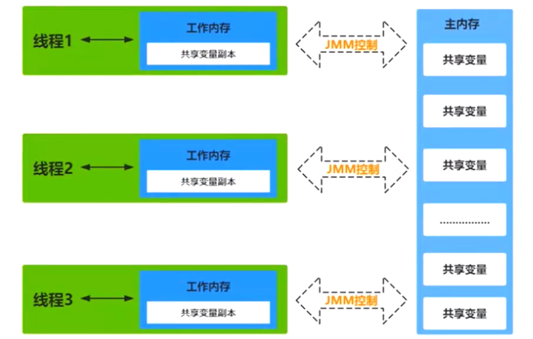
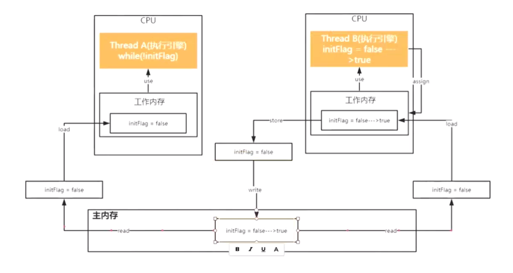

# 【Java锁体系】七、JMM内存模型详解

JMM是Java的内存模型，与Java的内存区域(运行时数据集区域)是不同的，是两个完全的概念。

Java内存模型JMM：**解决多线程下，线程间通信的类似的问题**；

JVM运行数据区：**对象内存自动化管理**。

## 1 理论基础

### 1.1 Java中垃圾回收有什么目的？什么时候进行垃圾回收？

垃圾回收是在内存中存在没有引用的对象或超过作用域的对象时进行的。

垃圾回收的目的是**识别并丢弃应用不再使用的对象来释放和重用资源。**

### 1.2 如果对象的引用被置为null，垃圾收集器是否会立即释放对象占用的内存？

不会，在下一个垃圾回调周期中，这个对象将是被可回收的。

也就是说并不会立即被垃圾收集器立刻回收，而是在下一次垃圾回收时才会释放其占用的内存。

### 1.3 finalize()方法什么时候被调用？析构函数(finalization)的目的是什么？

1）**垃圾回收器（garbage colector）决定回收某对象时，就会运行该对象的finalize()方法**；
finalize是Object类的一个方法，该方法在Object类中的声明protected void finalize() throws Throwable { }
在垃圾回收器执行时会调用被回收对象的finalize()方法，可以覆盖此方法来实现对其资源的回收。注意：一**旦垃圾回收器准备释放对象占用的内存，将首先调用该对象的finalize()方法，并且下一次垃圾回收动作发生时，才真正回收对象占用的内存空间**

2）GC本来就是内存回收了，应用还需要在finalization做什么呢？ 答案是大部分时候，什么都不用做(也就是不需要重载)。只有在某些很特殊的情况下，比如你调用了一些native的方法(一般是C写的)，可以要在finaliztion里去调用C的释放函数。

### 1.4 为什么代码会重排序？

在执行程序时，为了提高性能，处理器和编译器常常会对指令进行重排序，但是不能随意重排序，它需要满足以下两个条件：

- **在单线程环境下不能改变程序运行的结果；**
- **存在数据依赖关系的不允许重排序；**

需要注意的是：重排序不会影响单线程环境的执行结果，但是会破坏多线程的执行语义。

### 1.5 as-if-serial规则和happens-before规则的区别

- **as-if-serial语义保证单线程内程序的执行结果不被改变**，**happens-before关系保证正确同步的多线程程序的执行结果不被改变。**
- as-if-serial语义给编写单线程程序的程序员创造了一个幻境：单线程程序是按程序的顺序来执行的。happens-before关系给编写正确同步的多线程程序的程序员创造了一个幻境：正确同步的多线程程序是按happens-before指定的顺序来执行的。
- as-if-serial语义和happens-before这么做的目的，都是为了在不改变程序执行结果的前提下，尽可能地提高程序执行的并行度。

### 1.6 JMM如何保证volatile变量为何立即可见？

当写一个volatile变量时，JMM会把该线程对应的工作内存中的共享变量值刷新到主内存中；

当读取一个volatile变量时，JMM会把该线程对应的工作内存置为无效。

### 1.7 volatile如何禁止重排优化？

**内存屏障(Memory Barrier)**

- 保证特定操作的执行顺序；
- 保证某些变量的内存可见性；

通过插入**内存屏障指令禁止在内存屏障前后的指令执行重排序优化**。

强制刷出各种CPU的缓存数据，因此任何CPU上的线程都能读取到这些数据的最新版本。

### 1.8 synchronized和volatile的区别？

- **volatile本质上是在告诉JVM当前变量在寄存器(工作内存)中的值是不确定的，需要从主存中读取**；**synchronized则是锁定当前遍历，只有当前线程可以访问该变量，其他线程被阻塞住直到该线程完成变量操作为止；**
- **volatile仅能使用在变量级别**；**synchronized则可以使用在变量、方法和类级**别；
- **volatile仅能实现变量的修改可见性**，不能保证原子性；**而synchronized则可以保证变量修改的可见性和原子性；**
- volatile不会造成线程的阻塞；synchronized可能会造成线程的阻塞；
- volatile标记的变量不会被编译器优化；而synchronized标记的变量可以被编译器优化

## 2 为什么要存在JMM这抽象概念?

由于JVM运行程序的实体是线程，而每个线程创建时都会为其创建一个工作内存（有些地方称之为栈空间）用于存储线程私有的数据，线程与主内存中的变量操作必须通过工作内存间接完成，主要过程是讲变量从主内存拷贝到每个线程各自的工作内存空间，然后对变量进行操作，操作完成后再将变量写回主内存，如果存在两个线程同时对一个主内存中的实例对象的变量进行操作就有可能诱发线程安全问题。

JMM模型可以很清晰的描述多线程带来的问题，并且与程序和硬件有很好的契合解释。

## 3 Java内存模型抽象图

JMM模型是抽象的概念，描述的是**多线程与内存间的通信**，Java线程内存模型与CPU缓存模型类似，它是标准化的，**用于屏蔽各种硬件和操作系统的内存访问差异。**

## 4  JMM的8大数据原子操作

- **lock(锁定)**：作用于主内存的变量，把一个变量标记为一条线程独占状态
- **unlock(解锁)**：作用于主内存的变量，把一个处于锁定状态的变量释放出来，释放后的变量才可以被其它线程锁定。
- **read(读取)**：把一个变量值从主内存传输到线程的工作内存中，以便随后的load动作使用。
- **load(载入)**：它把read操作从主内存中得到的变量值放入工作内存的变量副本中。
- **use**(使用)：把工作内存中的一个变量值传递给执行引擎
- **assign(赋值)**：它把一个从执行引擎接收到的值赋给工作内存的变量
- **store(存储)**：把工作内存中的一个变量的值传送到主内存中，以便随后的write的操作
- **write(写入)**：把store操作从工作内存中的一个变量的值传送到主内存的变量中。

具体线程间通信用到的原子操作如下：

但这样的线程通信面临可见性的问题。而通过volatile关键字便可解决可见性的问题。那么volatile底层逻辑到底是什么样的呢？

## 5 JMM缓存不一致问题底层机制

**总线加锁(性能很低)**

CPU从主内读取数据到缓存区当中，总线会加锁锁定该缓存对应的主存区域，来自其他CPU或者总线代理的控制请求将被阻塞，无法读写数据直到锁定被释放。

**MESI缓存一致性协议**

**多CPU从主内读取同一数据到到各自缓存区中，该数据在lock前缀指令执行期间已经在处理器内部的缓存中被锁定了，缓存被锁定期间其它CPU无法读写该数据，直到该缓存数据被修改同步回主内存后，其它CPU通过总线嗅探机制感知数据变化及时失效自己缓存中的数据，在下一轮指令周期从主存重新load数据。**

