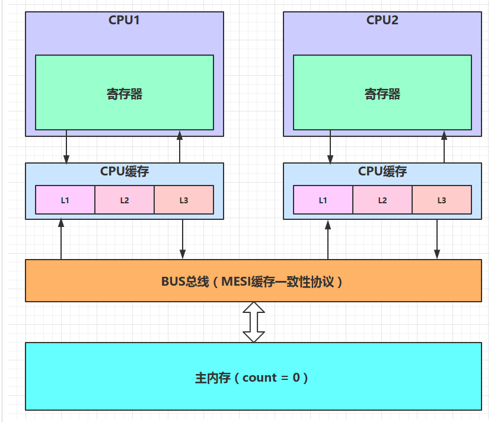

# 【Java锁体系】八、MESI缓存一致性协议讲解

MESI是一种广泛使用的写回策略的缓存一致性协议。

## 8.1 MESI协议中的状态

M：Modified被修改

E：Exclusive独享的

S：Shared共享的

I：Invalid无效的

| **M: 被修改（Modified)**  | 该缓存行只被缓存在该CPU的缓存中，并且是被修改过的（dirty),即与主存中的数据不一致，该缓存行中的内存需要在未来的某个时间点（允许其它CPU读取请主存中相应内存之前）写回（write back）主存。当被写回主存之后，该缓存行的状态会变成独享（exclusive)状态。 |
| ------------------------- | ------------------------------------------------------------ |
| **E: 独享的（Exclusive)** | 该缓存行只被缓存在该CPU的缓存中，它是未被修改过的（clean)，与主存中数据一致。该状态可以在任何时刻当有其它CPU读取该内存时变成共享状态（shared)。同样地，当CPU修改该缓存行中内容时，该状态可以变成Modified状态。 |
| **S: 共享的（Shared)**    | 该状态意味着该缓存行可能被多个CPU缓存，并且各个缓存中的数据与主存数据一致（clean)，当有一个CPU修改该缓存行中，其它CPU中该缓存行可以被作废（变成无效状态（Invalid））。 |
| **I: 无效的（Invalid）**  | 该缓存是无效的（可能有其它CPU修改了该缓存行）。              |

## 8.2 一个例子来分析MESI的工作原理

利用对变量count自增的程序，来理解MESI的工作过程，明白多CPU下是如何进行数据写回同步，保证数据的可见性，

- 1.假设CPU1率先抢到时间片，当变量count加载至CPU缓存中时，会将count的使用标志为（E独占：首次加载会将变量置为独占，也就说明没有其他CPU进行加载）
- 2.CPU2也获得时间片，把变量count加载缓存中，此时count的使用标志为（E独占），并发送消息至总线，告知其他CPU读取了变量的值，各CPU通过时刻监听（总线嗅探机制）获得到此变量已被多个CPU所加载，那么此时CPU2就会将自身count的使用标志置为（S共享），CPU1也会将变量的使用标志也会置为（S）
- 3.CPU1从缓存中加载count至寄存器中进行自增操作，执行完毕之后，count = 0 -> 1，此时由于count的值发生了变化，因此CPU1中变量count使用标志应为（M修改），此时CPU1会发送消息至总线，告知其他线程已经修改了变量count 的值，其他CPU嗅探到值的修改，就会将自身变量count的使用标志置为（I无效）
- 4.CPU1会将M状态的变量立刻写回至主内存中，写回完毕之后，CPU1会将使用状态置为（E独享），发送消息至总线，告知其他CPU已经写回完毕，其他CPU会再此从主内存中读取变量count的值，读取完毕之后，也会发送消息至总线，其他CPU嗅探到之后将自身变量count置为（S共享），自身变量的使用状态也会置为（S共享）

> 那么如果多个CPU同时都将变量置为M修改状态，那怎么办？
>
> 首先多个CPU都想将变量置为M修改状态，那么**系统会有裁决机制**，保证只有一个CPU能够操作成功，因此不会存在多个M状态的数据

MESI操作的基本单位：缓存行（CPU缓存中的最小存储单元）

缓存行的最小存储单元大小：32bit，64bit，128bit（因系统而定）

机械硬盘的最小存储单元：簇

 

**MESI缓存一致性协议失效的原因**

  缓存一致性协议失效的后果：当MESI失效之后，那么系统会自动将启用总线加锁机制，那么执行效率则会大打折扣。

  失效的情况：

  1.**当缓存行存储的数据超过最小存储单元大小时**（数据长度存储跨越多个缓存行的情况），就会导致MESI操作缓存行无效，导致MESI缓存一致性协议失效；

  2.系统不支持缓存一致性协议。

缓存行的概念：多个数据可以存储在一个缓存行，一个数据可以存储在多个缓存行（此种情况会导致MESI失效）

**总线加锁机制**

  **对主内存数据进行加锁和解锁操作，当加锁之后，此数据不允许其他线程进行读写，只能等加锁线程操作完毕进行解锁之后才能进行操作。**

## 8.3 Java中volatile关键字保证可见性原理

MESI缓存一致性协议底层是通过#Lock的指令进行触发的，

**而volatile关键词修饰之后的变量，编译为指令时会加上#Lock修饰，用来触发缓存一致性协议**，而且#Lock指令修饰之后，**置为M（修改状态）的变量，会强制立刻写入主内存中，并且发送消息至总线，其它加载此变量的线程，就会将工作内存中变量的使用状态修改为I(无效状态)，此时线程就被迫重新从主内存中读取该变量的值，这就是volatile关键词保证可见性的原因。**

> volatile是Java虚拟机提供的轻量级的同步机制，它具备两种特性：
>
> - 保证共享变量对所有线程的可见性；
> - 禁止指令重排序，保证有序性；
> - 无法保证原子性（像count++就不是原子操作，包含了读 自加操作）