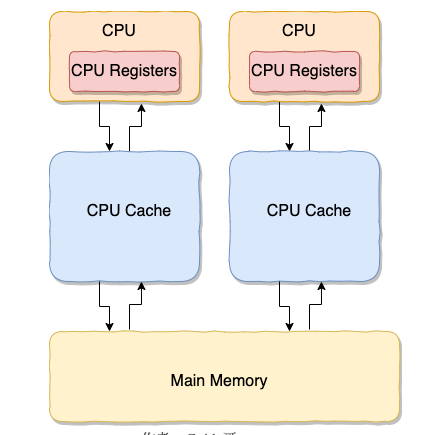
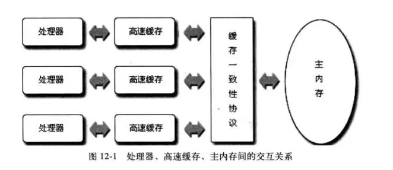
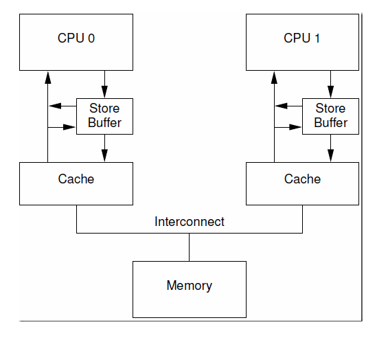
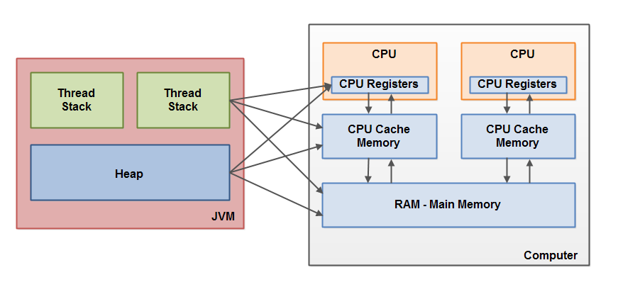
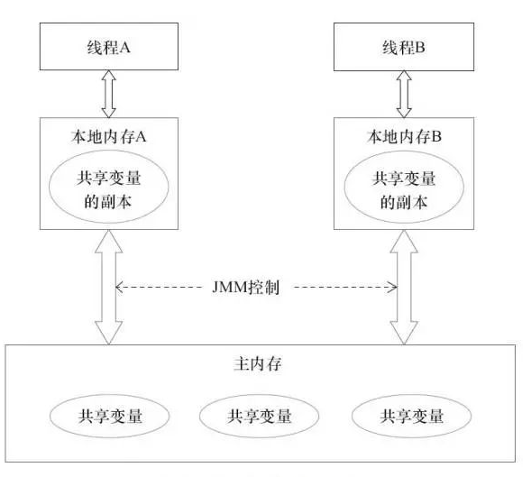
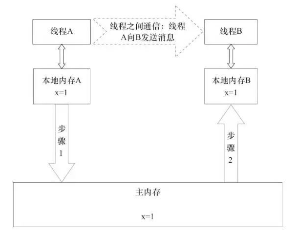

# 【Java锁体系】九、volatile关键字

> volatile关键字在需要保证多线程共享变量的可见性时，用volatile来修饰变量。
>
> volatile关键字很适合只有一个线程修改，其它线程读取的情况。volatile变量被修改之后，对其它线程立即可见。

对于可见性，Java 提供了 volatile 关键字来保证**可见性**和**禁止指令重排**。 volatile 提供 happens-before 的保证，确保一个线程的修改能对其他线程是可见的。当一个共享变量被 volatile 修饰时，它会保证修改的值会立即被更新到主存，当有其他线程需要读取时，它会去内存中读取新值。

从实践角度而言，volatile 的一个重要作用就是和 CAS 结合，保证了原子性，详细的可以参见 java.util.concurrent.atomic 包下的类，比如 AtomicInteger。

volatile 常用于多线程环境下的单次操作(单次读或者单次写)。

## 1  synchronized和volatile关键字的单例模式例子

> 补充：单例模式定义-一个类有且仅有一个实例，并且自行实例化向整个系统提供。

其实现方式主要是通过饿汉式(线程安全的)和懒汉式(线程不安全的)。

**饿汉式**

```java
package com.lcz.syn;

// 单例模式实现方式-饿汉式
class SingleOne{
   // 创建类中私有构造
    private SingleOne(){

    }
    // 创建私有对象
    private static SingleOne instance = new SingleOne();

    // 创建公有静态返回
    public static SingleOne getInstance(){
        return instance;
    }
}

public class Test1 {
    // 主函数
    public static void main(String[] args){
        SingleOne singleOne1 = SingleOne.getInstance();
        SingleOne singleOne2 = SingleOne.getInstance();
        System.out.println(singleOne1 == singleOne2);
    }
}

```


**懒汉式**

```java
// 单例模式实现方式-懒汉式
class SingeleTwo{
    // 创建类中私有构造
    private SingeleTwo(){

    }
    // 创建静态私有对象
    private static SingeleTwo instance;
    // 创建返回
    public static SingeleTwo getInstance(){
        if (instance==null){
            instance = new SingeleTwo();
        }
        return instance;
    }
}

public class Test1 {
    // 主函数
    public static void main(String[] args){
        SingeleTwo singleOne1 = SingeleTwo.getInstance();
        SingeleTwo singleOne2 = SingeleTwo.getInstance();
        System.out.println(singleOne1 == singleOne2);
    }
}
```

但是懒汉式在多线程下不安全。

这里通过双重校验锁使其安全。

**双重校验锁实现懒汉式**

```java
// 双重校验锁实现
class Singleton{
    //私有化
    private Singleton(){

    }
    // 私有化对象
    private volatile static Singleton instance;

    // 返回方法
    public static Singleton getInstance(){
        if (instance==null){
            // 加锁
            synchronized (Singleton.class){
                if (instance==null){
                    instance = new Singleton();
                }
            }
        }
        return instance;
    }

}
```

> 1.为什么使用volatile修饰了singleton引用还用synchronized？
>
> volatile 只保证了共享变量 singleton 的可见性，但是 `singleton = new Singleton();` 这个操作不是原子的，可以分为三步：
>
> 步骤1：在堆内存申请一块内存空间；
>
> 步骤2：初始化申请好的内存空间；
>
> 步骤3：将内存空间的地址赋值给 singleton；
>
> 所以`singleton = new Singleton();` 是一个由三步操作组成的复合操作，多线程环境下A 线程执行了第一步、第二步之后发生线程切换，B 线程开始执行第一步、第二步、第三步（因为A 线程singleton 是还没有赋值的），所以为了保障这三个步骤不可中断，可以使用synchronized 在这段代码块上加锁。
>
> 2.第一次检查singleton为空后为什么内部还进行第二次检查
>
> A 线程进行判空检查之后开始执行synchronized代码块时发生线程切换(线程切换可能发生在任何时候)，B 线程也进行判空检查，B线程检查 singleton == null 结果为true，也开始执行synchronized代码块，虽然synchronized 会让二个线程串行执行，如果synchronized代码块内部不进行二次判空检查，singleton 可能会初始化二次。
>
> 3.volatile 除了内存可见性，还有别的作用吗？
>
> volatile 修饰的变量除了可见性，还能防止指令重排序。
>
> **指令重排序** 是编译器和处理器为了优化程序执行的性能而对指令序列进行重排的一种手段。现象就是CPU 执行指令的顺序可能和程序代码的顺序不一致，例如 `a = 1; b = 2;` 可能 CPU 先执行`b=2;` 后执行`a=1;`
>
> `singleton = new Singleton();` 由三步操作组合而成，如果不使用volatile 修饰，可能发生指令重排序。步骤3 在步骤2 之前执行，singleton 引用的是还没有被初始化的内存空间，别的线程调用单例的方法就会引发未被初始化的错误。


**volatile关键字底层原理是通过内存屏障技术实现的**

## 2 CPU缓存模型

CPU缓存是为了解决CPU处理速度和内存处理速度不对等的问题。



先复制一份数据到 CPU Cache 中，当 CPU 需要用到的时候就可以直接从 CPU Cache 中读取数据，当运算完成后，再将运算得到的数据写回 Main Memory 中。但是，这样存在 **内存缓存不一致性的问题** ！比如我执行一个 i++操作的话，如果两个线程同时执行的话，假设两个线程从 CPU Cache 中读取的 i=1，两个线程做了 1++运算完之后再写回 Main Memory 之后 i=2，而正确结果应该是 i=3。

而针对缓存不一致性的问题可以通过执行缓存一致性协议或者其他手段来解决。



但还存在一个问题，每个处理器上的store buffer(写缓冲区)，仅仅对它所在的处理器可见。即一个处理器的写缓冲器中的内容是无法被其它处理器读取的，这个也就造成了处理器更新一个共享变量后，对其它处理器而言，看不到这个更新的值，即**可见性。**



## 3 内存屏障

为了解决写缓冲器和无效化队列带来的可见性和重排序问题，硬件设计者推出了新的方案：内存屏障。

> 内存屏障是被插入两个CPU指令之间的一种指令，用来禁止处理器指令发生重排序(像屏障一样)，从而保障有序性的。另外，为了达到屏障的效果，它也会使处理器写入、读取值之前，将写缓冲器的值写入高速缓存，清空无效队列，从而“附带”的保障了可见性。


**举个例子说明：**
     Store1     Store2    Load1     **StoreLoad屏障**     Store3     Load2     Load3

对于上面的一组CPU指令（Store表示写入指令，Load表示读取指令），`StoreLoad屏障`之前的`Store`指令无法与`StoreLoad屏障`之后的`Load`指令进行交换位置，即重排序。但是`StoreLoad屏障`之前和之后的指令是可以互换位置的，即Store1可以和Store2互换，Load2可以和Load3互换。

`StoreLoad屏障`的目的在于使屏障前的写操作的结果，对于屏障后的读操作是可见的。为了保障这一点，除了指令不能重排序外，`StoreLoad屏障`还会在写操作完之后，将写缓冲器中的条目冲刷入高速缓存或主内存；在读操作之前，清空无效化队列，从主内存或其他处理器的高速缓存中读取最新值到自己的内存。从而保障了数据在不同处理器之间是一致的，即可见性。

## 4 JMM（Java内存模型）

JMM 是Java 定义的一套协议，用来屏蔽各种硬件和操作系统的内存访问差异，让Java 程序在各种平台都能有一致的运行效果。

> 所有的变量都存储在主内存中，每个线程还有自己的工作内存，线程的工作内存中保存了该线程使用到的变量（主内存的拷贝），线程对变量的所有操作（读取、赋值）都必须在工作内存中进行，而不能直接读写主内存中的变量。不同线程之间无法直接访问对方工作内存中的变量，线程间变量值的传递均需要在主内存来完成。



**线程本地内存和物理真实内存之间的关系**

- 初始变量首先存储在主内存中；
- 线程操作变量需要从主内存拷贝到线程本地内存中；
- 线程的本地工作内存是一个抽象概念，包括了缓存、store buffer(后面会讲到)、寄存器等



**多线程如何通过共享变量通信**

1）线程A把本地内存A中更新过的共享变量刷新到主内存中去。

2）线程B到主内存中去读取线程A之前已更新过的共享变量。



## 5 并发编程的三个重要特性

- **原子性：**一个的操作或一组操作要么全部执行，要么全部不执行。`synchronized`保证代码片段的原子性。
- **可见性：**当多个线程共同访问同一个共享变量时，一个线程修改了这个变量的值，其它线程能够立即看到修改后的值。`volatile`关键字可以保证共享变量的可见性。
- **有序性：**代码在执行的过程中的先后顺序，Java在编译器以及运行期间的优化，代码的执行顺序未必就是编写代码时的顺序。`volatile`关键字可以禁止指令进行重排序优化。

## 6 synchronized关键字和volatile关键字的区别

`synchronized` 关键字和 `volatile` 关键字是两个互补的存在，而不是对立的存在！

- synchronized本质上是一种**阻塞锁**；而volatile则是使用了**内存屏障**来实现的；
- volatile 关键字能保证数据的可见性，但不能保证数据的原子性。synchronized 关键字两者都能保证。
- volatile 关键字主要用于解决变量在多个线程之间的可见性，而 synchronized 关键字解决的是多个线程之间访问资源的同步性。

## 7 题目

### 7.1 volatile关键字的作用

对于可见性，Java提供了volatile关键字来保证**可见性**和**禁止指令重排**。当一个共享变量被volatile修饰时，它会保证修改的值会立即更新到主存，当有其它线程需要读取时，它会去内存中读取新值。

从实践角度来看，**volatile的一个重要作用就是和CAS结合，保证了原子性**，可参见java.util.concurrent.atomic包下的类，比如AtomicInteger。

volatile常用于多线程环境下的单次操作(单次读或者单次写)。

### 7.2 Java中能创建volatile数组吗？

能，Java中可以创建volatile类型数组，不过只是一个指向数组的引用，而不是整个数组。即如果改变引用指向的数组，将会受到volatile的保护，但是如果多个线程同时改变数组的元素，volatile标识符就不能起到之前的保护作用了。

### 7.3 volatile 变量和 atomic 变量有什么不同？

volatile 变量可以确保先行关系，即写操作会发生在后续的读操作之前, **但它并不能保证原子性**。**例如用 volatile 修饰 count 变量，那么 count++ 操作就不是原子性的。**

而 AtomicInteger 类提供的 atomic 方法可以让这种操作具有原子性如getAndIncrement()方法会原子性的进行增量操作把当前值加一，其它数据类型和引用变量也可以进行相似操作。

### 7.4 volatile能使得一个非原子操作变成原子操作？

**关键字volatile的主要作用是使变量在多个线程间可见，但无法保证原子性，对于多个线程访问同一个实例变量需要加锁进行同步。**

虽然volatile只能保证可见性不能保证原子性，但用**volatile修饰long和double可以保证其操作原子性。**

从Oracle Java Spec里面可以看到：

- 对于64位的long和double，如果没有被volatile修饰，那么对其操作可以不是原子的。在操作的时候，可以分成两步，每次对32位操作。
- 如果使用volatile修饰long和double，那么其读写都是原子操作
- 对于64位的引用地址的读写，都是原子操作
- 在实现JVM时，可以自由选择是否把读写long和double作为原子操作
- 推荐JVM实现为原子操作

### 7.5 synchronized和volatile关键字的区别是什么？

**synchronized表示只有一个线程可以获取作用对象的锁，执行代码，阻塞其它线程。**

**volatile表示变量在CPU的寄存器中是不确定的，必须从主存中读取。保证了多线程环境下变量的可见性；禁止指令重排序。**

**区别：**

- volatile是变量修饰符；synchronized可以修饰类、方法、变量；
- volatile仅能实现变量的修改可见性，不能保证其原子性；而synchronized则可以保证变量的修改可见性和原子性；
- volatile不会造成线程阻塞；而synchronized可能会造成线程的阻塞；
- volatile标记的变量不会被编译器优化；而synchronized标记的变量可以被编译器优化
- **volatile关键字**是线程同步的**轻量级实现**，所以**volatile性能肯定比synchronized关键字要好**。但是**volatile关键字只能用于变量而synchronized关键字可以修饰方法以及代码块**。synchronized关键字在JavaSE1.6之后进行了主要包括为了减少获得锁和释放锁带来的性能消耗而引入的偏向锁和轻量级锁以及其它各种优化之后执行效率有了显著提升，**实际开发中使用 synchronized 关键字的场景还是更多一些**。

### 7.6 final关键字-什么是不可变对象

不可变对象即对象一旦被创建它的状态（对象的数据，也即对象属性值）就不能改变，反之即为可变对象。

不可变对象的类即为不可变类。Java平台类库中包含许多不可变类，如**String**、基本类型的包装类、BigInteger和BigDecimal等。

只有满足以下状态，一个对象才是不可变的。

- 它的状态不能再创建后再被修改；
- 所有域都是final类型；并且，它被正确创建

**不可变对象保证了对象的内存可见性**，对不可变对象的读取不需要进行额外的同步手段，提升了代码执行效率。

