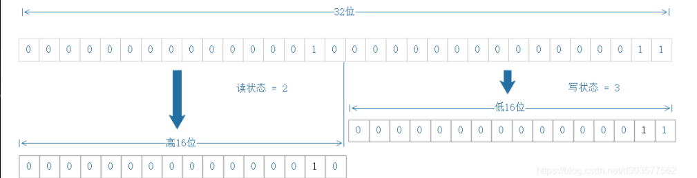

# 【Java锁体系】ReadWriteLock读写锁场景

## 一、背景

像我们所知的ReentrantLock、synchronized关键字都是排它锁，这些锁在同一时刻只允许一个线程访问。

而读写锁允许在同一时刻多个读线程访问，但是写线程访问时，所有的读线程和其它写线程均被阻塞。读写锁维护了一对锁，一个读锁和一个写锁，通过分离读锁和写锁，使得并发性能对于一般的排它锁有了很大得到提升。


假设在程序中定义一个共享的用作缓存的数据结构。它大部分时间都是提供读服务的，例如查询和搜索，而写操作占有的时间很少，但是写操作完成之后的更新需要对后续的读服务可见。

在没有读写锁支持的JDK5之前，如果需要完成上述地工作，就要用到java的等待通知机制。即当写操作时，所有晚于写操作的读操作都会进入等待状态，只有写操作完成并通知之后，所有等待的读操作才能继续执行，这样做的目的就是使得读操作都能读取到正确的数据，不会出现脏读。使用读写锁完成上述功能后，只需在读操作时获取读锁，写操作时获取写锁即可。写操作获取写锁时，后续的写操作和读操作都会被阻塞。

读写锁的性能比其它的排它锁好，因为大多数的场景是读多与写的。读写锁能够提供比其它排它锁更好的并发性能和吞吐量。

Java并发包中读写锁的实现是ReentrantReadWriteLock。


## 二、ReentrantReadWriteLock的特性

公平性选择：支持公平和非公平性的锁获取方式，默认为非公平；

可重入锁：以读写锁为例：读线程在获取读锁之后，能够再次获取读锁；

锁降级：遵循获取写锁、获取读锁、再释放写锁的次序，**写锁能够降级为读锁；**


## 三、ReentrantReadWriteLock的API

| 方法名称                | 描述                                                         |
| ----------------------- | ------------------------------------------------------------ |
| ReadLock readLock()     | 获取读锁                                                     |
| WriteLock writeLock()   | 获取写锁                                                     |
| int getReadLockCount()  | 返回当前读锁被获取的次数。该次数不等于获取读锁的线程数。例如：仅一个线程，它连续获取了n次读锁，那么占据读锁的线程数是1 ，但该方法返回n |
| int getReadHoldCount()  | 返回当前线程获取读锁的次数。该方法在Java 6 中加入到ReentrantReadWriteLock中，使用ThreadLocal保存当前线程获取的次数，这也使得Java 6的实现变得更加复杂 |
| boolean isWriteLocked() | 判断写锁是否被获取                                           |
| int getWriteHoldCount() | 返回当前写锁被获取的次数                                     |


## 四、读写锁的实现分析

ReentrantReadWriteLock的实现，主要包括：读写状态的设计、写锁的获取与释放、读锁的获取与释放、锁降级。

### 1.读写状态的设计

读写锁同样依赖自定义同步器来实现同步功能，而读写状态就是其同步器的同步状态。在ReentrantLock中自定义同步器的实现，同步状态表示锁被一个线程重复获取的次数。而读写锁的自定义同步器需要在同步状态(一个AtomicInteger的整型变量)上维护多个读线程和一个写线程的状态。

如果在一个整型变量上维护多种状态，就一定需要“按位分割使用”这个变量，读写锁将变量切分为两个部分，高16位表示读，低16位表示写。




当前同步状态表示一个线程已经获取了写锁，且重进入了两次，同时也连续获得了两次读锁。读写锁通过位运算快速的确定各自的状态。假设当前同步状态值为S，写状态等于S & 0x0000FFFF（将高16位全部抹去），读状态等于 S>>>16（无符号补0右移16位）。当写状态增加1时，等于 S+1，当读状态增加1时，等于 S+(1<<16)，也就是S+0x00010000。
根据状态的划分能得出一个推论：S不等于10时，当写状态（S & 0x0000FFFF）等于0时，则读状态（S>>>16）大于0，即读锁已被获取。

### 2.写锁的获取和释放

写锁是一个支持重进入的排它锁。如果当前线程已经获取了写锁，则增加写状态。如果当前线程在获取写锁时，读锁已经被获取，读状态不为0，或者该线程不是已经获取写锁的线程，则当前线程进入等待状态。
获取写锁的实现方法：ReentrantReadWriteLock的tryAcquire方法

```java
protected final boolean tryAcquire(int acquires) {
    //c != 0的时候，代表重入
    //1.c != 0 and w==0 说明读取状态不为0，失败
    //2.当前线程不是已获取到锁的线程，失败
    //3.w+state > MAX_COUNT，说明计数饱和，失败
    
    Thread current = Thread.currentThread();
    int c = getState();
    int w = exclusiveCount(c);
    if (c != 0) {
        if (w == 0 || current != getExclusiveOwnerThread())
            return false;
        if (w + exclusiveCount(acquires) > MAX_COUNT)
            throw new Error("Maximum lock count exceeded");
        // Reentrant acquire
        setState(c + acquires);
        return true;
    }
    //c == 0的时候，代表第一次获取锁
    if (writerShouldBlock() ||
        !compareAndSetState(c, c + acquires))
        return false;
    setExclusiveOwnerThread(current);
    return true;
}

```

该方法除了写线程的重入条件判定之外，增加了一个读锁是否存在的判断。如果存在读锁，则写锁不能被获取，原因在于：读写锁要确保写锁的操作对读锁可见，如果允许读锁再已被获取的情况下对写锁的获取，那么正在运行的其他读线程就无法感知到当前写线程的操作。因此，只有等待其他读线程都释放了读锁，写锁才能被当前线程获取，而写锁一旦被获取，则其他读写线程的后续访问均被阻塞。

如果当前状态为0，写线程第一次获取锁，会进行writerShouldBlock()的判断。
这个方法在公平和非公平的锁获取方式下实现是不同的。

```java
//公平模式
final boolean writerShouldBlock() {
    return hasQueuedPredecessors();
}

```

hasQueuedPredecessors()方法，顾名思义，就是判定当前线程是否有还在队列中的前驱。如果没有，才能获取锁，如果有则返回true。

```java
//非公平模式
final boolean writerShouldBlock() {
     return false; 
}
```

非公平模式下，writer线程始终不需要阻塞。

写锁的释放与ReentrantLock的释放过程基本类似，每次释放均减少写状态，当写状态为0时表示写锁已被释放，从而等待的读写线程能够继续访问读写锁，同时前次写线程的修改对后续读写线程可见。

```java
protected final boolean tryRelease(int releases) {
   if (!isHeldExclusively())
        throw new IllegalMonitorStateException();
    int nextc = getState() - releases;
    boolean free = exclusiveCount(nextc) == 0;
    if (free)
        setExclusiveOwnerThread(null);
    setState(nextc);
    return free;
}

```

### 3.读锁的获取和释放

读锁是一个支持重进入的共享锁，它能够被多个线程同时获取，在没有其他写线程访问或者写状态为0时，读锁总会被成功地获取，而所做的也只是增加读状态，由于是多个读写线程同时获取，所以增加读状态是线程安全的。如果当前线程已经获取了读锁，则增加读状态。如果当前线程在获取读锁时，写锁已被其他线程获取，则进入等待状态。获取读锁的实现从Java 5到Java 6变得复杂许多，主要原因是新增了一些功能，例如getReadHoldCount()方法，作用是返回**当前线程获取读锁的次数**。读状态是**所有线程获取读锁次数的总和**，而**每个线程各自获取读锁的次数只能选择保存在ThreadLocal中，由线程自身维护，这是获取读锁的实现变得复杂**。

```java
protected final int tryAcquireShared(int unused) {
    //1.如果有写线程持有锁，则直接返回失败
    //2.如果读线程需要阻塞，则不尝试获取读锁，进入fullTryAcquireShared方法
    //3.如果读锁计数器已经达到上限或者状态设置失败，也进入fullTryAcquireShared方法
    //4.如果是首个获取读锁的线程，会将信息记录在firstReader和firstReaderHoldCount中
    //5.非首个获取读锁的线程，会将信息记录在ThreadLocalHoldCounter线程内部变量中
    Thread current = Thread.currentThread();
    int c = getState();
    if (exclusiveCount(c) != 0 &&
        getExclusiveOwnerThread() != current)
        return -1;
    int r = sharedCount(c);
    if (!readerShouldBlock() &&
        r < MAX_COUNT &&
        compareAndSetState(c, c + SHARED_UNIT)) {
        if (r == 0) {
            firstReader = current;
            firstReaderHoldCount = 1;
        } else if (firstReader == current) {
            firstReaderHoldCount++;
        } else {
            HoldCounter rh = cachedHoldCounter;
            if (rh == null || rh.tid != getThreadId(current))
                cachedHoldCounter = rh = readHolds.get();
            else if (rh.count == 0)
                readHolds.set(rh);
            rh.count++;
        }
        return 1;
    }
    return fullTryAcquireShared(current);
}

```

```java
//具有循环重试的完整版本，可以处理CAS遗漏
final int fullTryAcquireShared(Thread current) {
    //该代码与tryAcquireShared中的代码部分冗余
    HoldCounter rh = null;
    for (;;) {
        int c = getState();
        if (exclusiveCount(c) != 0) {
            if (getExclusiveOwnerThread() != current)
                return -1;
        } else if (readerShouldBlock()) {
            if (firstReader == current) {
            } else {
                if (rh == null) {
                    rh = cachedHoldCounter;
                    if (rh == null || rh.tid != getThreadId(current)) {
                        rh = readHolds.get();
                        if (rh.count == 0)
                            readHolds.remove();
                    }
                }
                if (rh.count == 0)
                    return -1;
            }
        }
        if (sharedCount(c) == MAX_COUNT)
            throw new Error("Maximum lock count exceeded");
        if (compareAndSetState(c, c + SHARED_UNIT)) {
            if (sharedCount(c) == 0) {
                firstReader = current;
                firstReaderHoldCount = 1;
            } else if (firstReader == current) {
                firstReaderHoldCount++;
            } else {
                if (rh == null)
                    rh = cachedHoldCounter;
                if (rh == null || rh.tid != getThreadId(current))
                    rh = readHolds.get();
                else if (rh.count == 0)
                    readHolds.set(rh);
                rh.count++;
                cachedHoldCounter = rh; // cache for release
            }
            return 1;
        }
    }
}

```

非公平模式的readerShouldBlock()方法

```java
final boolean readerShouldBlock() {
    //为了避免无限期的阻塞写线程
    //如果同步队列中的第一个节点（头节点的后继节点）是写线程，则阻塞        
    return apparentlyFirstQueuedIsExclusive();
 }

```

```java
//如果明显的第一个排队线程（如果存在）正在排他模式下等待，则返回{@code true}。
final boolean apparentlyFirstQueuedIsExclusive() {
    Node h, s;
    return (h = head) != null &&
        (s = h.next)  != null &&
        !s.isShared()         &&
        s.thread != null;
}

```

公平模式的readerShouldBlock()方法和writerShouldBlock()一致

```java
final boolean readerShouldBlock() {
	return hasQueuedPredecessors();
}
```

在tryAcquireShared(int unused)方法中，如果其他线程已经获取了写锁，则当前线程获取读锁失败，进入等待状态。如果当前线程获取了写锁或者写锁未被获取，则当前线程增加读状态，成功获取读锁。

```java
protected final boolean tryReleaseShared(int unused) {
    Thread current = Thread.currentThread();
    if (firstReader == current) {
        if (firstReaderHoldCount == 1)
            firstReader = null;
        else
            firstReaderHoldCount--;
    } else {
        HoldCounter rh = cachedHoldCounter;
        if (rh == null || rh.tid != getThreadId(current))
            rh = readHolds.get();
        int count = rh.count;
        if (count <= 1) {
            readHolds.remove();
            if (count <= 0)
                throw unmatchedUnlockException();
        }
        --rh.count;
    }
    for (;;) {
        int c = getState();
        int nextc = c - SHARED_UNIT;
        if (compareAndSetState(c, nextc))
            return nextc == 0;
    }
}

```

读锁的每次释放均减少读状态，减少的值是（1<<16）。
**读锁的获取和释放都是线程安全的，其安全性由CAS来保证。**

### 4.锁降级

锁降级指的是写锁降级为读锁。**如果当前线程拥有写锁，然后将其释放，最后再获取读锁，这种分段完成的过程被称之为锁降级**。锁降级是指把持住当前拥有的写锁，再获取到读锁，随后释放之前拥有的写锁的过程。

接下来看一个锁降级的示例。因为数据不常变化，所以多个线程可以并发地进行数据处理，当数据变更后，如果当前线程感知到数据变化，则进行数据的准备工作，同时其他处理线程被阻塞，直到当前线程完成数据的准备工作。

```java
public class ReadWriteLockTest implements Runnable{
	
	private ReentrantReadWriteLock lock = new ReentrantReadWriteLock();
	private  ReadLock readLock = lock.readLock();
	private  WriteLock writeLock = lock.writeLock();
	
	volatile int index;
	volatile boolean update;
	
	public ReadWriteLockTest() {
		update = false;
	}
	
	@Override
	public void run() {
		while(true) {
			processData();
		}
		
	}

	public void processData() {
		readLock.lock();
		if(!update) {
			//必须先释放读锁
			readLock.unlock();
			//锁降级从写锁开始
			writeLock.lock();
			try {
				if(!update) {
				    //准备数据的流程,操作数据
					++index;
					try {
						System.out.println("数据更新，请稍等...");
						TimeUnit.MILLISECONDS.sleep(1000);
						System.out.println("数据更新完成");
					} catch (InterruptedException e) {
						// TODO Auto-generated catch block
						e.printStackTrace();
					}
					update = true;
				}
				readLock.lock();
			}finally {
				writeLock.unlock();
			}
			//锁降级完成，写锁降级为读锁
		}
		try {
			for (int i=0; i<5; i++) {
                try {
        			//使用数据的流程
                    TimeUnit.MILLISECONDS.sleep(100);
        			System.out.println(Thread.currentThread().getId() + "使用数据，数据为：" + index);
                } catch (InterruptedException e) {
                    e.printStackTrace();
                }
			}
		}finally {
			readLock.unlock();
		}
	}
	
	public static void main(String[] args) {
		ReadWriteLockTest readWriteLockTest = new ReadWriteLockTest();
		for(int i = 0; i < 3; i++) {
			new Thread(readWriteLockTest).start();
		}

        try {
            TimeUnit.MILLISECONDS.sleep(2000);
        } catch (InterruptedException e) {
            e.printStackTrace();
        }
        readWriteLockTest.update = false;
        try {
            TimeUnit.MILLISECONDS.sleep(4000);
        } catch (InterruptedException e) {
            e.printStackTrace();
        }
        readWriteLockTest.update = false;
	}
	
}

```

## 五、总结

