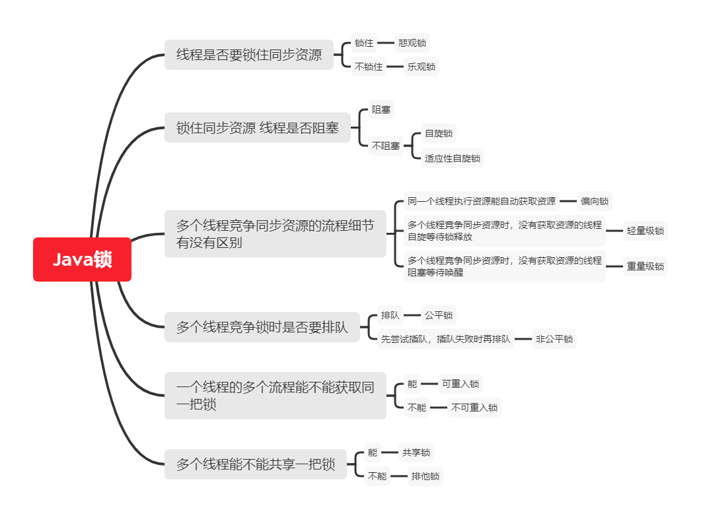

# 【【Java复习框架】】Java锁体系

目录：

[【Java锁体系】一、悲观锁和乐观锁](https://codingchaozhang.blog.csdn.net/article/details/110532962)

[【Java锁体系】二、Java中的CAS机制算法](https://codingchaozhang.blog.csdn.net/article/details/110533186)

[【Java锁体系】三、自旋锁详解](https://codingchaozhang.blog.csdn.net/article/details/110533375)

[【Java锁体系】四、Synchronized关键字详解](https://codingchaozhang.blog.csdn.net/article/details/110563657)

[【Java锁体系】五、隐式锁和显氏锁的区别(Synchronized和Lock的区别)](https://codingchaozhang.blog.csdn.net/article/details/111338689)

[【Java锁体系】六、AQS原理分析(AbstractQueuedSynchronizer实现分析)](https://codingchaozhang.blog.csdn.net/article/details/111339138)

[【Java锁体系】七、JMM内存模型详解](https://codingchaozhang.blog.csdn.net/article/details/111339429)

[【Java锁体系】八、MESI缓存一致性协议讲解](https://codingchaozhang.blog.csdn.net/article/details/111339679)

[【Java锁体系】九、volatile关键字](https://codingchaozhang.blog.csdn.net/article/details/110631110)

