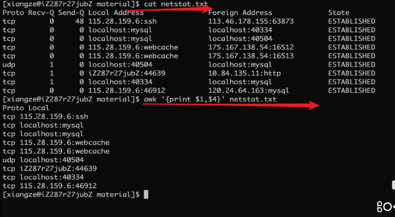

 # Java复习框架-Linux

## 一、Linux的体系结构

- 体系结构主要分为用户态和内核态；
- **内核：**本质上是一段管理计算机硬件设备的程序；
- **系统调用库**：内核的访问接口，是一种不能再简化的操作；
- **公用函数库：**系统调用的组合拳；
- **Shell：**命令解释器，可编程；

## 二、Linux常用命令

 ### 2.1 如何查找特定的文件-find

**find**

> 语法 ：find path [options] params

- 作用：在指定目录下查找文件

**例子：**

find ~ -name "target3.java"   : 精确查找文件

find ~ -name "target*": 模糊查找文件

find ~ -iname "target*": 不区分文件名大小写去查找文件

man find：更多关于find命令的说明

### 2.2 如何检索文件内容-grep

**grep**

> 语法：grep [options] pattern file

- 作用：查找文件里符合条件的字符串

**例子：**

grep “lcz” target* :从target打头的文件里搜索lcz的字符串

**管道操作符 |**

- 可将指令连接起来，前一个指令的输出作为后一个指令的输入；

**例子：**

find ~ | grep “lcz” : 从前一个文件里搜索lcz的字符串

**注意事项：**

- 只处理前一个命令正确输出，不处理错误输出；
- 右边命令必须能够接收标准输入流，否则传递过程中数据会被抛弃

**面试里常用的方式：**

- `grep 'partial\[true\]' bsc-plat-al-data.info.log `
- `grep -o 'engine\[[0-9a-z]*\]'` # 正则表达式
- `grep -v 'grep'` # 过滤掉包含该字符串的内容

### 2.3 如何对日志文件做统计-awk

**awk**

> 语法：awk [options] 'cmd' file

**作用：**

- 一次读取一行文本，按输入分隔符进行切片，切成多个组成部分；
- 将切片直接保存在内建的变量中，$1,$2...($0表示行的全部)；
- 支持对单个切片的判断，支持循环判断，默认分割符为空格；

**例子：**

// 统计次数

**面试里常用的方式**

- 筛选出文件里某些列的数据：`awk '{print $1,$4}' netstat.txt`
- 依据某些条件筛选出某些列的数据：`awk '$1=="tcp" && $2==1 {print $0}' netstat.txt`
- 对内容逐行进行统计从操作 并列出统计结果 `awk '{enginearr[$1]++} END {for(i in enginearr) print i "\t" enginearr[i]}'`

### 2.4 如何批量替换文件中的内容-sed

**sed**

> 语法：sed [option] 'sed command' filename

**作用：**

- 全名stream editor，流编辑器；
- 适合用于对文本的行内容进行处理；

**例子：**

- 替换以str打头(^)：`sed -i 's/^Str/String/' replace.java`
- 替换以.结尾的($)：`sed -i 's/\.$/\;/' replace.java`
- 替换字符串(g为全部替换)：`sed -i 's/jack/me/g' replace.java`
- 删除空行 `sed -i '/^ *$/d' replace.java` 