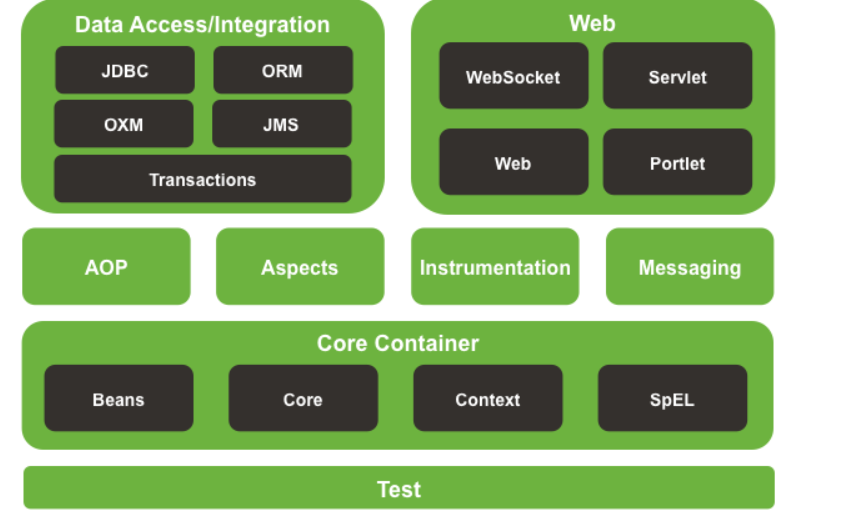
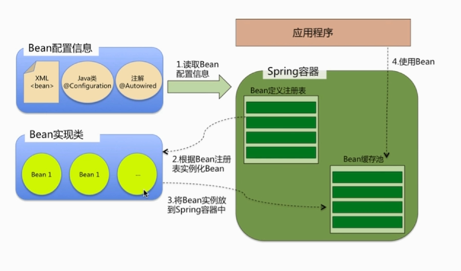
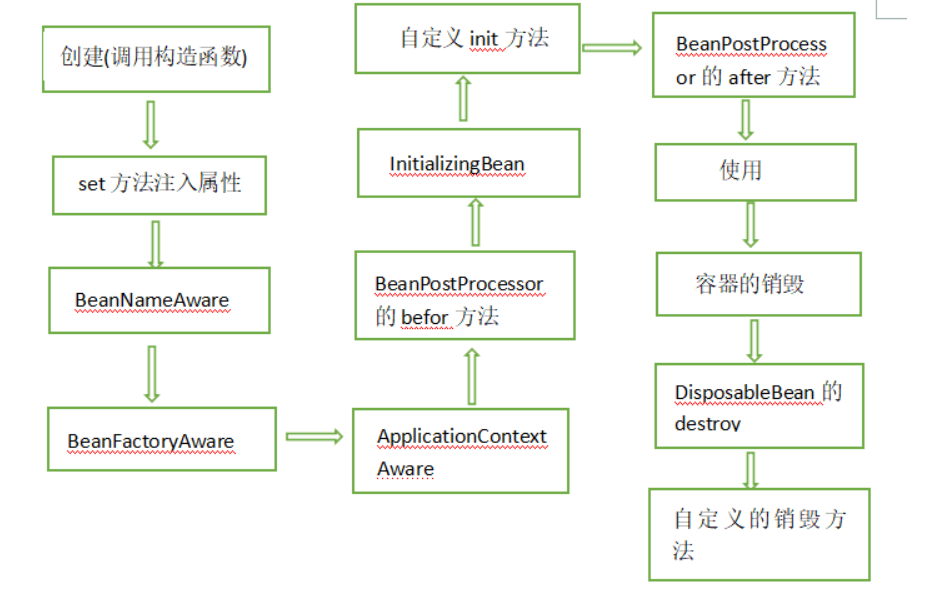
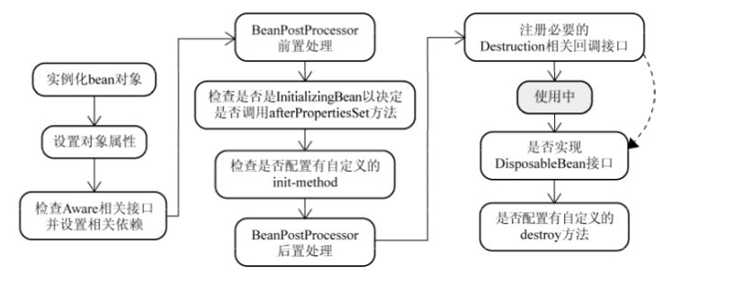
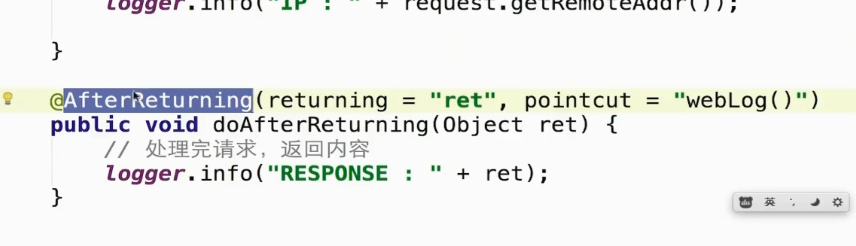
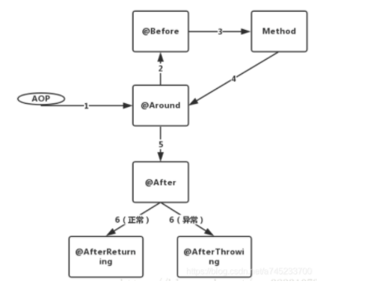

# Java框架-spring

## 一、spring概述

### Q1: spring是什么？ 

Spring是一个轻量级Java开发框架，其最根本的使命是解决企业级应用开发的复杂性，即简化Java开发。

Spring为企业级开发提供了丰富的功能，但是这些功能的底层都依赖与它的两个核心特性，也就是依赖注入(DI)和面向切面编程(AOP).

### Q2:使用spring的好处是什么？

- **轻量级：**在开发中使用框架开销很小；
- **控制反转(Ioc)**：spring容器负责处理各种对象的依赖关系，而不是创建或查找依赖对象；
- **面向切面编程(AOP)：**Spring支持AOP将业务逻辑与系统服务分开；
- **IOC容器：**它管理Spring Bean生命周期和项目特定配置；
- **MVC框架：**用于创建Web应用程序或RESTful Web福，能够返回XML/JSON响应；
- **事务管理：**通过使用Java注释或Spring Bean XML配置文件减少JDBC操作；
- **异常处理：**Spring提供了一个方便的API，用于将特定与技术的异常转换为未经检查的异常；

### Q3：spring的模块组成



- **Core** - 提供框架基本部分的关键模块，如IoC或DI
- **JDBC** - 此模块启用JDBC抽象层，无需对特定供应商数据库执行JDBC编码
- **ORM集成** - 为流行的对象关系映射API提供集成层，例如JPA，JDO和Hibernate
- **Web** - 面向Web的集成模块，提供多部分文件上传，Servlet侦听器和面向Web的应用程序上下文功能
- **MVC框架** - 实现模型视图控制器设计模式的Web模块
- **AOP模块** - 面向切面的编程实现，允许定义干净的方法 - 拦截器和切入点

### Q4：spring框架中都用到了哪些设计模式？

- **工厂模式：**BeanFactory就是简单工厂模式的体现，用来创建对象的实例；
- **单例模式：**Bean默认为单例模式；
- **代理模式：**Spring的AOP功能用到了JDK的动态代理和CGLIB字节码生成技术；
- 模板方法：用来解决代码重复的问题。比如RestTemplate,JpaTemplate.
- 观察者模式：定义对象键一对多的依赖关系，当一个对象的状态发生改变时，所有依赖与它的对象都会得到通知被动更新，如spring中listener的实现-ApplicationListener。


## 二、Spring IOC控制反转



Spring IOC根据Bean配置信息，读取Bean配置信息，生成Bean定义注册表；之后根据Bean注册表实例化Bean；之后将Bean实例到Spring容器中。从而为上层提供Bean。

### Q1：Spring IOC的理解

**IOC就是控制反转，指创建对象的控制权转交给Spring 框架进行管理，并由Spring 根据配置文件去创建实例和管理各个实例之间的依赖关系，**对象与对象之间松散耦合，有利用功能的复用。

所谓**依赖注入（Dependency Injection）**，即**组件之间的依赖关系由容器在应用系统运行期来决定，也就是由容器动态地将某种依赖关系的目标对象实例注入到应用系统中的各个关联的组件之中**。组件不做定位查询，只提供普通的Java方法让容器去决定依赖关系。

> **Spring的IOC有四种注入方式：Set注入，接口注入，注解注入，构造器注入。**


> 举例：上层建筑依赖下层建筑；
>
> **依赖**
>
> 
>
> 
>
> **依赖注入**
>
> 
>
> 
>
> **总之，依赖注入的含义就是把底层类作为参数传递给上层类，实现上层对下层的控制。**


### Q2：Spring IOC容器的优势

- 避免在各处使用new来创建类，并且可以做到统一维护；
- 创建实例的时候不需要了解里面的细节；

### Q3：Spring IOC的实现机制

Spring中的IoC的实现原理是工厂模式+反射机制。

```java
interface Fruit {
   public abstract void eat();
 }

class Apple implements Fruit {
    public void eat(){
        System.out.println("Apple");
    }
}

class Orange implements Fruit {
    public void eat(){
        System.out.println("Orange");
    }
}

class Factory {
    public static Fruit getInstance(String ClassName) {
        Fruit f=null;
        try {
            f=(Fruit)Class.forName(ClassName).newInstance();
        } catch (Exception e) {
            e.printStackTrace();
        }
        return f;
    }
}

class Client {
    public static void main(String[] a) {
        Fruit f=Factory.getInstance("io.github.dunwu.spring.Apple");
        if(f!=null){
            f.eat();
        }
    }
}

```

### Q4 Spring IOC实现的功能

Spring的IoC设计支持以下功能：

- **依赖注入；**
- 依赖检查；
- 自动装配；
- 支持集合；
- 指定初始化方法和销毁方法；
- 支持回调某些方法

其中，最重要的就是依赖注入，从XML的配置上来说，即ref标签。

对于IOC来说，最重要的就是容器。**容器管理了Bean的生命周期，控制这Bean的依赖注入。**


### Q5: BeanFacotry和ApplicationContext有什么区别?

BeanFactory和ApplicationContext是Spring的两大核心接口，都可以当做spring的容器。其中ApplicationContext继承了BeanFactory接口。

**依赖关系**

**BeanFactory：**是Spring里面最底层的接口，包含了各种Bean的定义，读取bean配置文档，管理bena的加载，实例化，控制bean的生命周期，维护bean之间的依赖关系。

**ApplicationContext：**作为BeanFactory的派生，除了提供BeanFactory所具有的功能之外：

- BeanFactory：能够管理、装配Bean；
- ResourcePatternResolver：能够加载资源文件；
- MessageSource：能够实现国际化等功能；
- ApplicationEventPublisher：能够注册监听器，实现监听机制；

**加载方式**

BeanFacotry采用的是延迟加载方式来注入Bean的，即只有在使用到某个Bean时(调用getBean()),才会对该Bean进行加载实例化。如果Bean的某一个属性没有注入，BeanFacotry加载后，直至第一次使用调用getBean方法才会抛出异常。

ApplicationContext：在容器启动时，一次性创建了所有的Bean。这样在容器启动时，就可以发现spring中存在的配置错误，这样有利于检查所依赖属性是否注入。

> 例子：
>
> **Spring的方式**
>
> 
>
> 
>
> **Spring Boot的方式**
>
> 
>
> 
>
> 依赖注入
>
> 
>
> 


## 三、Spring Beans

### Q1：什么是Spring Beans

Spring Bean是那些形成Spring应用的主干的Java对象。它们被Spring IOC容器初始化，装配和管理。这些beans通过容器中配置的元数据创建。

**Spring Bean是由Spring IoC容器初始化的Java对象。默认情况下，Spring Bean初始化为单例 。**

**一个Spring Bean的定义包含容器必知的所有配置元数据，包括如何创建一个bean，它的生命周期详情以及它的依赖。**

### Q2:如何给Spring容器提供配置元数据？Spring有几种配置方式

这里有三种重要的方法给Spring容器提供配置元数据。

- **XML配置文件；**
- **基于注解的配置；**
- **基于Java的配置；**

> 额外知识：
>
> **1.Spring配置文件包含了哪些信息？**
>
> Spring配置文件是个XML文件，这个文件包含了类信息，描述了如何配置它们，以及如何相互调用。
>
> **2.Spring基于xml注入bean的几种方式？**
>
> - set方法注入；
> - 构造器注入：通过index设置参数的位置；通过type设置参数类型；
> - 静态工厂注入；
> - 实例工厂；

### Q3: Spring的Bean作用域

**spring的Bean的作用域就是实例起作用的区域。**

- **singleton（单例） :** bean在每个Spring ioc 容器中只有一个实例。 被标注为singleton的类，只会被实例化一次，这个实例可以无限重复注入。
- **prototype（原型）：**一个bean的定义可以有多个实例。被标注为prototype的类可以被实例化多次，每个实例只能注入一次，即每次注入prototype的实例时，要检查这个实例是否已经在其他地方注入过，如果已经注入过，则不能再使用这个实例，要新建一个实例。
- **request：**每次http请求都会创建一个bean，该作用域仅在基于web的Spring ApplicationContext情形下有效。是一个请求周期内，实例可以重复注入。超过一个请求周期，再要注入就要新建实例，原来的实例不能使用了。
- **session：**在一个HTTP Session中，一个bean定义对应一个实例。该作用域仅在基于web的Spring ApplicationContext情形下有效。是一个会话周期内，实例可以重复注入。超过一个会话周期，再要注入就要新建实例，原来的实例不能使用了。
- **global-session：**在一个全局的HTTP Session中，一个bean定义对应一个实例。该作用域仅在基于web的Spring ApplicationContext情形下有效。

### Q4: spring框架中的单例bean是线程安全的吗？

不是，Spring框架中的单例bean不是线程安全的。spring中的bean模式是单例模式，但spring框架并没有对单例bean进行多线程的封装处理。

**实际上大部分时候spring bean是无状态的（比如dao类）**，在某种程度来说**bean也是安全的**。但如果bean有状态的话（比如view model对象），那就要开发者自己去保证线程安全了。简单做法就是改变bean的作用域，将其“singleton”变为“prototype”，这样请求bean就相当于new Bean()，就可以保证线程安全了。

- **有状态的bean就是有数据存储功能；**
- **无状态的bean就是不会保存数据；**

### Q5: Spring如何处理线程并发问题？

在一般情况下，**只有无状态的bean才可以在多线程环境下共享**。在Spring中，绝大部分Bean都可以声明为singleton作用域，因为Spring对一些Bean中非线程安全状态采用**ThreadLocal**进行处理，来解决线程安全问题。

**ThreadLocal和线程同步机制都是为了解决多线程中相同变量的访问冲突问题。**

同步机制采用了“时间换空间”的方式，仅提供一份变量，不同的线程在访问前需要获取锁，没获得锁的线程则需要排队、

而ThreadLocal采用了“空间换时间”的方式，会为每一个线程提供一个独立的变量副本，从而隔离了多个线程对数据的访问冲突。因为每一个线程都拥有自己的变量副本，从而也就没必要对该变量进行同步。ThreadLocal提供了线程安全的共享对象，在编写多线程代码时，可以把不安全的变量封装进ThreadLocal中。

### Q6：Spring的生命周期是什么样的？

在传统的Java应用中，bean的生命周期很简单。使用Java关键字new进行bean实例化，然后该bean就可以使用了。一旦该bean不再被使用，则由Java自动进行垃圾回收。相比之下，Spring容器中的bean的生命周期就显得相对复杂多了。





Spring对bean进行实例化；

Spring将值和bean的引用注入到bean对应的属性中；

如果bean实现了BeanNameAware接口，Spring将bean的ID传递给setBean-Name()方法；

如果bean实现了BeanFactoryAware接口，Spring将调用setBeanFactory()方法，将BeanFactory容器实例传入；

如果bean实现了ApplicationContextAware接口，Spring将调用setApplicationContext()方法，将bean所在的应用上下文的引用传入进来；

如果bean实现了BeanPostProcessor接口，Spring将调用它们的post-ProcessBeforeInitialization()方法；

如果bean实现了InitializingBean接口，Spring将调用它们的after-PropertiesSet()方法。类似地，如果bean使用initmethod声明了初始化方法，该方法也会被调用；

如果bean实现了BeanPostProcessor接口，Spring将调用它们的post-ProcessAfterInitialization()方法；

此时，bean已经准备就绪，可以被应用程序使用了，它们将一直驻留在应用上下文中，直到该应用上下文被销毁；

如果bean实现了DisposableBean接口，Spring将调用它的destroy()接口方法。同样，如果bean使用destroy-method声明了销毁方法，该方法也会被调用。

### Q7.哪些是重要的bean生命周期方法？你能重载它们吗？

有两个重要的bean 生命周期方法，第一个是setup ， 它是在容器加载bean的时候被调用。第二个方法是 teardown 它是在容器卸载类的时候被调用。

bean 标签有两个重要的属性（init-method和destroy-method）。用它们你可以自己定制初始化和注销方法。它们也有相应的注解（@PostConstruct和@PreDestroy）。

### Q8. 使用@Autowired注解自动装配的过程是怎么样的？

使用@Autowired注解来自动装配指定的bean。在使用@Autowired注解之前需要在Spring配置文件进行配置，<context:annotation-config />。

在启动spring IoC时，容器自动装载了一个AutowiredAnnotationBeanPostProcessor后置处理器，当容器扫描到@Autowied、@Resource或@Inject时，就会在IoC容器自动查找需要的bean，并装配给该对象的属性。在使用@Autowired时，首先在容器中查询对应类型的bean：

- 如果查询结果刚好为一个，就将该bean装配给@Autowired指定的数据；

- 如果查询的结果不止一个，那么@Autowired会根据名称来查找；

- 如果上述查找的结果为空，那么会抛出异常。解决方法时，使用required=false。


### Q9. Spring的事务的实现方式和实现原理

Spring事务的本质其实就是数据库对事务的支持，没有数据库的事务支持，soring是无法提供事务功能的。真正的数据库层的事务提交和回滚是通过binlog或者redo log实现的。

### Q10. Spring的事务隔离

Spring管理事务的方式有两种：

- 编程式事务，在代码中硬编码(不推荐使用)；
- 声明式事务，在配置文件中配置（推荐使用）；
  - 基于XML的声明式事务；
  - 基于注解的声明式事务；

spring 有五大隔离级别，默认值为 ISOLATION_DEFAULT（使用数据库的设置），其他四个隔离级别和数据库的隔离级别一致：

- **ISOLATION_DEFAULT：用底层数据库的设置隔离级别**，数据库设置的是什么我就用什么；

- **ISOLATION_READ_UNCOMMITTED：未提交读**，最低隔离级别、事务未提交前，就可被其他事务读取（会出现幻读、脏读、不可重复读）；

- **ISOLATION_READ_COMMITTED：提交读**，一个事务提交后才能被其他事务读取到（会造成幻读、不可重复读），SQL server 的默认级别；

- **ISOLATION_REPEATABLE_READ：可重复读**，保证多次读取同一个数据时，其值都和事务开始时候的内容是一致，禁止读取到别的事务未提交的数据（会造成幻读），MySQL 的默认级别；

- **ISOLATION_SERIALIZABLE：序列化**，代价最高最可靠的隔离级别，该隔离级别能防止脏读、不可重复读、幻读。

**脏读 ：**表示一个事务能够读取另一个事务中还未提交的数据。比如，某个事务尝试插入记录 A，此时该事务还未提交，然后另一个事务尝试读取到了记录 A。

**不可重复读 ：**是指在一个事务内，多次读同一数据。

**幻读 ：**指同一个事务内多次查询返回的结果集不一样。比如同一个事务 A 第一次查询时候有 n 条记录，但是第二次同等条件下查询却有 n+1 条记录，这就好像产生了幻觉。发生幻读的原因也是另外一个事务新增或者删除或者修改了第一个事务结果集里面的数据，同一个记录的数据内容被修改了，所有数据行的记录就变多或者变少了。

## 三、AOP

### Q1. AOP的理解

AOP(Aspect-Oriented Programming：面向切面编程)能够将那些与业务无关，却为业务模块所共同调用的逻辑或责任（例如事务处理、日志管理、权限控制等）封装起来，便于减少系统的重复代码，降低模块间的耦合度，有利于未来的可扩展性和可维护性。

AOP实现的关键在于代理模式，**AOP代理**主要分为**静态代理**和**动态代理**。静态代理的代表为**AspectJ**；动态代理则以**Spring AOP**为代表。

- AspectJ是静态代理的增强，所谓静态代理，就是AOP框架会在编译阶段生成AOP代理类，因此也被称为编译时增强，即在编译阶段会将AspectJ(切面)织入到Java字节码中，运行的时候就是增强之后的AOP对象。
- Spring AOP使用的是动态代理，所谓的动态代理就是AOP框架不会去修改字节码，而是每次运行时是在内存中临时为方法生成一个AOP对象，这个AOP对象包含了目标对象的全部方法，并且在特定的切点做了增强处理，并回调原对象的方法。**Spring AOP的动态代理主要有两种方式，JDK动态代理和CGLIB动态代理。**
  - 如果要代理的对象，实现了某个接口，那么Spring AOP会使用JDK Proxy，去创建代理对象；(**JDK动态代理的核心是InvocationHandler接口和Proxy类，在获取代理对象时，使用Proxy类来动态创建目标类的代理类**（即最终真正的代理类，这个类继承自Proxy并实现了我们定义的接口），当代理对象调用真实对象的方法时， InvocationHandler 通过invoke()方法反射来调用目标类中的代码，动态地将横切逻辑和业务编织在一起；)
  - 对于没有实现接口的对象，Spring AOP就会使用Cglib生成一个被代理对象的子类来作为代理；（**CGLIB（Code Generation Library），是一个代码生成的类库，可以在运行时动态的生成指定类的一个子类对象，并覆盖其中特定方法并添加增强代码，从而实现AOP**。**CGLIB是通过继承的方式做的动态代理，**因此如果某个类被标记为final，那么它是无法使用CGLIB做动态代理的。）


> IoC让相互协作的组件保持松散的耦合，而AOP编程允许你把遍布与应用各层的功能分离出来形成可重用的功能组件。
>
> **JDK动态代理只能对实现了接口的类生成代理，而不能针对类**
>
> **CGLIB是针对类实现代理，主要是对指定的类生成一个子类，覆盖其中的方法（继承）**
>
> java动态代理是利用反射机制生成一个实现代理接口的匿名类，在调用具体方法前调用InvokeHandler来处理。
>
> 而cglib动态代理是利用asm开源包，对代理对象类的class文件加载进来，通过修改其字节码生成子类来处理。

### Q2. Spring AOP和Aspect J AOP有什么区别？

**Spring AOP属于运行时增强，而AspectJ是编译时增强。**Spring AOP基于代理(Proxying)，而AspectJ基于字节码操作(Bytecode Manipulation).

Spring AOP 已经集成了 AspectJ ，AspectJ 应该算的上是 Java 生态系统中最完整的 AOP 框架了。AspectJ 相比于 Spring AOP 功能更加强大，但是 Spring AOP 相对来说更简单，

如果我们的切面比较少，那么两者性能差异不大。但是，当切面太多的话，最好选择 AspectJ ，它比Spring AOP 快很多

### Q3. Spring AOP里面的几个名词概念

- **连接点(Join point)：**指程序运行过程中所执行的方法。在Spring AOP中，一个连接点总代表一个方法的执行；
- **切面(Aspect)：**被抽取出来的公共模块，可以用来横切多个对象。Aspect切面可以看成Pointcut切点和Advice通知的结合。

> 在Spring AOP中，切面可以在类上使用@AspectJ注解来实现。

- **切点（Pointcut）：**切点用于定义要对哪些Join point进行拦截；

> 切点分为execution方式和annotation方式。execution方式可以用路径表达式指定对哪些方法拦截，比如指定拦截add*、search*。annotation方式可以指定被哪些注解修饰的代码进行拦截。

- **通知（Advice）：**指要在连接点（Join Point）上执行的动作，即增强的逻辑，比如权限校验和、日志记录等。通知有各种类型，包括Around、Before、After、After returning、After throwing。
- **目标对象（Target）：**包含连接点的对象，也称作被通知（Advice）的对象。 由于Spring AOP是通过动态代理实现的，所以这个对象永远是一个代理对象。
- **织入（Weaving）：**通过动态代理，在目标对象（Target）的方法（即连接点Join point）中执行增强逻辑（Advice）的过程。
- **引入（Introduction）：**添加额外的方法或者字段到被通知的类。Spring允许引入新的接口（以及对应的实现）到任何被代理的对象。例如，你可以使用一个引入来使bean实现 IsModified 接口，以便简化缓存机制。


**AOP的主要名词概念**

- **Aspect：通用多功能的代码实现**
- Target：被织入Aspect的对象；
- Join Point：可以作为切入点的机会，所有方法都可以作为切入点；
- **Pointcut：Aspect实际被应用在的Join Point，支持正则；**
- Advice：类里的方法以及这个方法如何织入到目标方法的方式； 
- Weaving：AOP的实现过程




### Q4. Spring通知(Advice)有哪些类型？

- **前置通知(Before Advice)**：在连接点（Join point）之前执行的通知；
- **后置通知(After Advice)**：当连接点退出的时候执行的通知（不论是正常返回还是异常退出）；
- **环绕通知（Around Advice）：**包围一个连接点的通知，这是最强大的一种通知类型。环绕通知可以在方法调用前后完成自定义的行为。它也可以选择是否继续执行连接点或直接返回它们自己的返回值或抛出异常来结束执行；
- **返回后通知(AfterReturning Advice)：**在连接点正常完成后执行的通知（如果连接点抛出异常，则不执行）；
- **抛出异常后通知(AfterThrowing advice)：**在方法抛出异常退出时执行的通知；




## 四、Spring MVC

> MVC是一种设计模式。模型(model)-视图(view)-控制器(controller)。三层架构的设计模式。用于实现前端页面的展现与后端业务数据处理的分离。

### Q1.Spring MVC的了解

Spring MVC是一款很优秀的MVC框架。Spring MVC可以帮助我们进行更简洁的Web层的开发，并且它天生与Spring框架集成。Spring MVC下我们一般把后端项目分为**Service层(处理业务)**、**Dao层（数据库操作）**、**Entity层（实体类）**、**Controller层(控制层，返回**数据给前台数据)。


### Q2.Spring MVC工作原理了解吗？


**流程说明：**

- 客户端（游览器）发送请求，直接请求到`DispatcherServlet`;
- `DispatcherServlet`根据请求信息调用`HandlerMapping`, 解析请求对应的`Handler`;
- 解析到对应的`Handler`(也就是平常说的Controller控制器)后，开始由`HandlerAdapter`适配器处理；
- `HandlerAdapter`会根据`Handler`来调用真正的处理器开始处理请求，并处理相应的业务逻辑；
- 处理器处理完业务后，会返回一个`ModelAndView`对象，`Model`是返回的数据对象，`View`是逻辑上的`View`
- `ViewResolver`会根据逻辑`View`查找实际的`View`;
- `DispaterServlet`把返回的`Model`传给`View`（视图渲染）；
- 把`View`返回给请求者(游览器)；

### Q3. Spring MVC常用的注解有哪些？

`@RequestMapping`：用于处理请求url映射的注解，可用于类或方法上。用于类上，则表示类中的所有相应请求的都是以该地方作为父路径；

`@RequestBody`：注解实现接收http请求的json数据，将json转换为Java对象；

`@ResponseBody`：注解实现将controller方法返回对象转换为json对象响应给客户。

### Q4. Spring Boot的了解？

Spring Boot是Spring 开源组织下的子项目，是Spring组件一站式解决方案，主要是简化了使用Spring的难度，节省了繁重的配置，提供了各种启动器，开发者能快速上手。


## 五、Spring 注解

### Q1.将一个类声明为Spring的bean的注解有哪些？

我们一般使用`@Autowired`注解自动装配bean，要想把类标识成可用于`@Autowired`注解自动装配的bean的类，采用以下注解可实现：

- `@Component`：通用的注解，可标注任意类为`Spring`的组件。如果一个Bean不知道属于哪个层，可以使用`@Component`注解标注；
- `@Repository`：对应持久层即Dao层，主要用于数据库相关操作；
- `@Service`：对应服务层，主要涉及一些复杂的逻辑，需要用到Dao层；
- `@Controller`：对应Spring MVC的控制层，主要用户接受用户请求并调用Service层返回数据集给前端页面。

### Q2. @Component和@Bean的区别是什么？

- 作用对象不同：`@Component`注解作用于类；`@Bean`注解作用于方法；
- `@Component`通常是通过类路径扫描来自动侦测以及自动装配到Spring 容器中。`@Bean`注解同时是我们在标有该注解的方法中定义产生这个bean；
- `@Bean` 注解比 `Component` 注解的自定义性更强，而且很多地方我们只能通过 `@Bean` 注解来注册bean。比如当我们引用第三方库中的类需要装配到 `Spring`容器时，则只能通过 `@Bean`来实现。