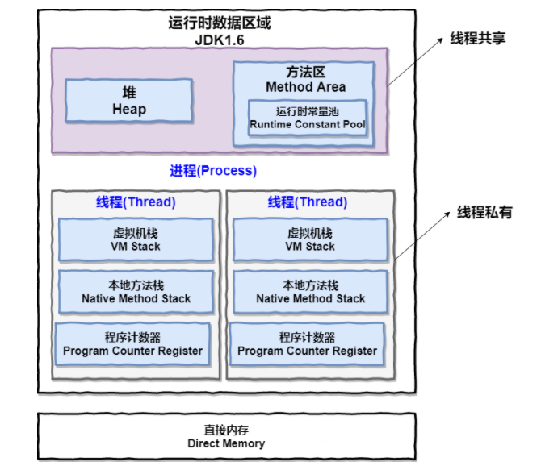
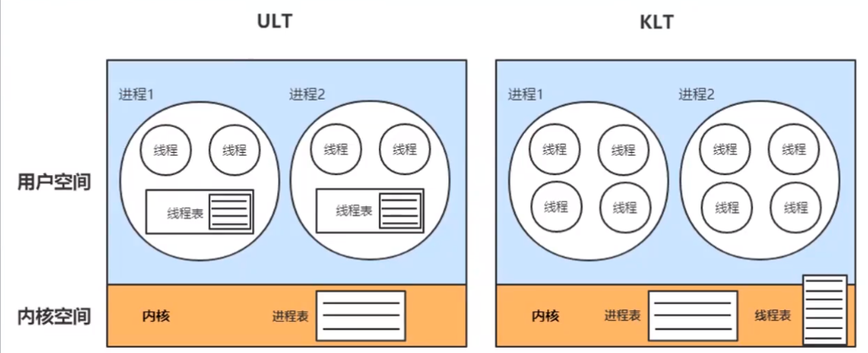
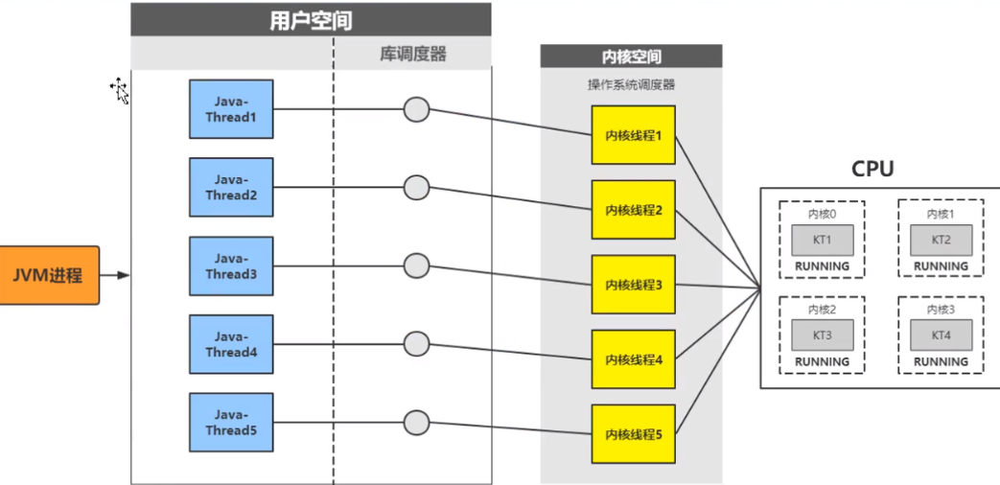

# 【多线程与高并发】一、什么是线程？什么是进程？线程与进程的区别是什么？

现代操作系统在运行一个程序时，会为其创建一个进程。例如，启动一个Java程序，操作系统就会创建一个Java进程。**现代操作系统调度的最小单位是进程，也叫作轻量级进程，在一个进程里可以创建多个线程，这些线程都拥有各自的计数器、堆栈和局部变量等属性，并且能够访问共享的内存变量。处理器在这些线程上高速切换，让使用者感受到这些线程在同时执行。**

> - 进程是系统进行资源分配的基本单位，有独立的内存地址空间；
> - 线程是CPU调度的基本单位，没有单独的地址空间，但是有独立的栈，局部变量，寄存器，程序计数器等。

**进程和线程的由来**

- 串行：初期的计算机智能串行执行任务，并且需要长时间等待用户输入；
- 批处理：预先将用户的指令集中成清单，批量串行处理用户指令，仍然无法并发执行；
- 进程：进程独占内存空间，保存各自运行状态，相互间不干扰且可以互相切换，为并发处理任务提供了可能；
- 线程：共享进程的内存资源，相互间切换更切换，支持更细粒度的任务空间，使进程内的子任务得以并发执行；

**进程和线程的区别**

**当一个程序运行的时候，一般会创建一个进程，当然也可能会有多个进程。而一个进程至少包含一个线程，多个线程共享一个进程的内存空间，程序的调度是由线程完成的。**

**进程是资源分配的最小单位，线程是CPU调度的最小单位；**

- 线程不能看做独立应用，而进程可看做独立应用；
- 进程有独立的地址空间，相互不影响，线程只是进程的不同执行路径；
- 线程没有独立的地址空间，多进程的程序比多线程程序健壮；
- 进程的切换比线程的切换开销大

## 0.什么是多线程，多线程的优劣？

**多线程：**多线程是指程序中包含多个执行流，即在一个程序中可以同时运行多个不同的线程来执行的任务

**多线程的好处：**可以提高CPU的利用率。在多线程程序中，一个线程必须等待的时候，CPU可以运行其它的线程而不是等待，这样就大大提高了程序的效率。

**多线程的劣势：**a.线程也是程序，所以线程需要占用内存，线程越多占用内存也越多；b.多线程需要协调和管理，其需要CPU时间跟踪线程；c.线程之间对共享资源的访问相互影响，必须解决竞用共享资源的问题。

## 1.进程和线程的区别是什么？

**进程：**

一个程序下至少有一个进程，进程是程序的一次执行过程，是系统运行程序的基本单位，系统运行一个程序就是进程从创建、运行到消亡的过程。

**线程：**

一个进程下至少有多个线程，线程与进程相似，但线程是一个比进程更小的执行单位。 与进程不同的是同类的多个线程共享进程的**堆**和**方法区**资源，但每个线程有自己的**程序计数器**、**虚拟机栈**和**本地方法栈**。

## 2.JVM下看进程和线程的区别是什么？

从上图中可以看到：一个进程中可以由多个线程，多个线程共享进程的**堆**和**方法区**的资源，但是每个线程有自己的**程序计数器**、**虚拟机栈**、**本地方法栈**。

**线程和进程最大的不同在于基本上各进程是独立的，而各线程则不一定，因为同一进程中的线程极有可能会相互影响。线程执行开销小，但不利于资源的管理和保护；而进程正相反。**

### 2.1 堆和方法区

**堆**和**方法区**是所有线程共享的资源；

**堆**主要用于存放新创建的对象（几乎所有对象都在这里分配内存）；

**方法区**主要存放已被加载的 类信息、常量、静态变量；

### 2.2 程序计数器为什么线程私有？

**程序计数器主要私有主要是为了线程切换后能恢复到正确的执行位置；**

- 字节码解释器通过改变程序计数器来依次读取指令，从而实现代码的流程控制；
- 在多线程的情况下，程序计数器用来记录当前线程执行的位置，从而线程切换回来的时候知道该线程上次运行到哪里了。

### 2.3 虚拟机栈和本地方法栈为什么私用？

虚拟机栈是Java方法执行的内存空间。

**虚拟机栈和本地方法栈私有的目的为了保证线程中的局部变量不被别的线程访问到。**

- 虚拟机栈：每个Java方法在执行的同时会创建一个栈帧用于存储局部变量、操作数栈、常量池引用等信息。从方法调用直至执行结束的过程，就对应着一个栈帧在Java虚拟机栈中入栈和出栈的过程。
- 本地方法栈：和虚拟机栈非常相似，但虚拟机栈为虚拟机执行Java方法服务器，而本地方法栈则为虚拟机使用到的Native方法服务。

## 3.从java线程模型来看线程

两种Java线程模型：用户级线程(ULT)和内核级线程(KLT)

**用户线程(ULT):**用户程序实现，不依赖操作系统核心，应用提供创建、同步、调度和管理线程的函数来控制用户线程。不需要用户态/核心态的切换，速度快。内核对ULT无感知，线程阻塞则进程（包括它的所有线程）阻塞。

**内核线程(KLT):**系统内核管理线程(KLT),内核保存线程的状态和上下文信息，线程阻塞不会引起进程阻塞。在多处理器系统上，多线程在多处理器上并行运行。线程的创建、调度和管理由内核完成，效率比ULT要慢，比进程操作快。

而JVM虚拟机使用的线程模型是KLT.

在操作系统的内存进行逻辑上的划分，并不是真实存在的。用户空间和内核空间，权限不一样。只有取得内核级别的权限，才能调用API，即操作底层API pthread来调用cpu执行线程。

总之，**Java线程是依赖于系统内核，通过JVM调用系统库创建内核线程，内核线程与Java-Thread是1:1的映射关系。**

## 4.什么是上下文切换？

多线程编程中一般线程的个数都大于CPU核心的个数，而一个CPU核心在任意时刻只能被一个线程使用，为了让这些线程都能得到有效执行，CPU采取的策略是为每个线程分配时间片轮转的形式。当一个线程的时间片用完的时候就会重新处于就绪状态让给其它线程的使用，这个过程就属于一次上下文切换。

概括来说，就是：当前任务在执行完CPU时间片切换到另一个任务之前会首先保存自己的状态，以便下次再切换回这个任务时，可以再加载这个任务的状态。任务从保存到加载的过程就是一次上下文切换。

通常来说，上下文切换对系统来说意味着消耗大量的cpu时间。