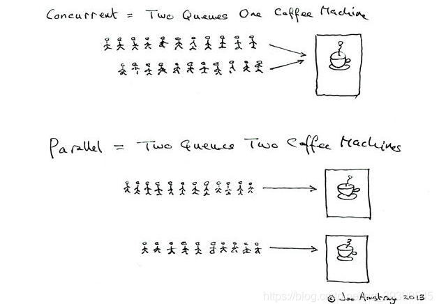

# 【多线程与高并发】二、并发和并行的区别是什么？

并发：多个任务在同一个CPU核上，按细分的时间片轮流执行，从逻辑上看任务是同时执行的；

并行：多个处理器或多核处理器同时处理多个任务。

## 1.为什么要使用并发编程？

- 充分利用多核CPU的计算能力
- 方便进行业务拆分，提高系统并发能力和性能；

## 2.并发编程三要素是什么？在Java程序中怎么保证多线程的运行安全？

**并发编程上三要素：**

**原子性：**指的是一个或多个操作要么全部执行成功要么全部执行失败；

**可见性：**一个线程对共享变量的修改，另外一个线程能够立即看到；

**有序性：**程序执行的顺序应该按照代码的先后顺序执行；

**出现线程安全问题的原因：**

- 线程切换带来的原子性问题；
- 缓存导致的可见性问题；
- 编译优化带来的有序性问题；

**解决问题：**

- JDK Atomic开头的原子类，synchronized，Lock可以解决原子性问题
- synchronized，volatile，Lock，可以解决可见性问题
- happens-before规则可以解决有序性问题