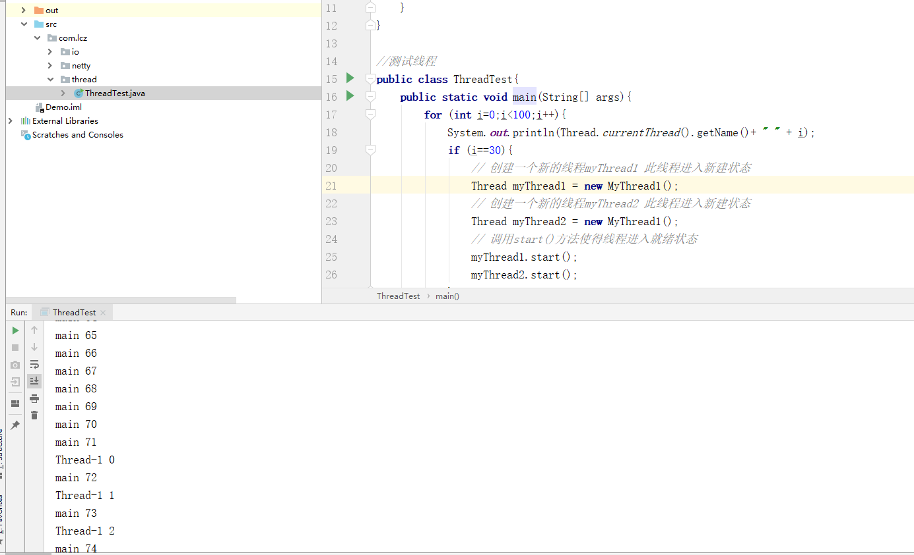

# 【多线程与高并发】五、线程的生命周期

Java线程在运行的生命周期中的指定时刻只可能处于以下6种不同状态中的其中一个状态。

| 状态名称    | 说明                                                         |
| ----------- | ------------------------------------------------------------ |
| NEW         | 初始状态，线程被构建，但是还没有调用start()方法              |
| RUNNABLE    | 运行状态，Java线程将操作系统中的就绪和运行两种状态笼统称作“运行中”。 |
| BLOCKED     | 阻塞状态，表示线程阻塞与锁(如synchronized)                   |
| WAITING     | 等待状态，表示线程进入等待状态(wait())，进入该状态表示当前线程需要等待其它线程做出一些特定动作（notity()或者notify()） |
| TIMEWAITING | 超时等待状态，该状态不同于WAITING，它是可以在指定的时间内自行返回的(sleep()) |
| TERMINATED  | 终止状态，表示当前线程已经执行完毕。                         |


> 补充：
>
> 线程创建之后它将处于 **NEW（新建）** 状态，调用 `start()` 方法后开始运行，线程这时候处于 **READY（可运行）** 状态。可运行状态的线程获得了 CPU 时间片（timeslice）后就处于 **RUNNING（运行）** 状态；
>
> 当线程执行 `wait()`方法之后，线程进入 **WAITING（等待）** 状态。进入等待状态的线程需要依靠其他线程的通知才能够返回到运行状态，而 **TIME_WAITING(超时等待)** 状态相当于在等待状态的基础上增加了超时限制，比如通过 `sleep（long millis）`方法或 `wait（long millis）`方法可以将 Java 线程置于 TIMED WAITING 状态。当超时时间到达后 Java 线程将会返回到 RUNNABLE 状态。当线程调用同步方法时，在没有获取到锁的情况下，线程将会进入到 **BLOCKED（阻塞）** 状态。线程在执行 Runnable 的`run()`方法之后将会进入到 **TERMINATED（终止）** 状态。

> 换个角度来看

- **新建(new)**：新创建了一个线程对象。

- **可运行(runnable)**：线程对象创建后，当调用线程对象的 start()方法，该线程处于就绪状态，等待被线程调度选中，获取cpu的使用权。

- **运行(running)**：可运行状态(runnable)的线程获得了cpu时间片（timeslice），执行程序代码。注：就绪状态是进入到运行状态的唯一入口，也就是说，线程要想进入运行状态执行，首先必须处于就绪状态中；

- **阻塞(block)**：处于运行状态中的线程由于某种原因，暂时放弃对 CPU的使用权，停止执行，此时进入阻塞状态，直到其进入到就绪状态，才 有机会再次被 CPU 调用以进入到运行状态。

  阻塞的情况分三种：
  (一). 等待阻塞：运行状态中的线程执行 wait()方法，JVM会把该线程放入等待队列(waitting queue)中，使本线程进入到等待阻塞状态；
  (二). 同步阻塞：线程在获取 synchronized 同步锁失败(因为锁被其它线程所占用)，，则JVM会把该线程放入锁池(lock pool)中，线程会进入同步阻塞状态；
  (三). 其他阻塞: 通过调用线程的 sleep()或 join()或发出了 I/O 请求时，线程会进入到阻塞状态。当 sleep()状态超时、join()等待线程终止或者超时、或者 I/O 处理完毕时，线程重新转入就绪状态。

- **死亡(dead)**：线程run()、main()方法执行结束，或者因异常退出了run()方法，则该线程结束生命周期。死亡的线程不可再次复生。


> 注意：调用start()方法后，JVM会新建一个线程来执行run()方法内容。Thread对象是Java中普通的对象，和其他对象一样，只是在调用start()这个native方法时变得不一样了，JVM会根据Thread对象来创建线程。
>
> new Thread() 创建Thread 对象时，JVM 还没有实际创造线程，调用start() 方法后JVM 才会通过 `pthread_create` 方法(Linux系统)创建线程。因此一定要将Thread 对象和真实的线程区分开。
>
> Java 种新建的Thread 对象只是操作系统线程运行的载体，Thread类的作用主要有二点：
>
> - Thread 对象内的属性提供了创建新线程时所需要的线程描述信息，例如线程名、线程id、线程组、是否为守护线程；
> - Thread 对象内的方法提供了Java 程序可以跟操作系统线程打交道的手段，例如wait、sleep、join、interrupt等。

## 1.创建线程

创建线程有四种方式：

- 继承Thread重写run方法；
- 实现Runnable接口；
- 实现Callable接口；
- 使用Executors工具类创建线程池

### 1.1 继承Thread类重写run方法

步骤：

- 定义一个Thread类的子类，重写run方法，将相关逻辑实现，run()方法就是线程要执行的业务逻辑方法

- 创建自定义的线程子类对象

- 调用子类实例的star()方法来启动线程

```java
package com.lcz.thread;

//继承Thread类，重写run方法
class MyThread1 extends Thread {

    @Override
    public void run() {
        for(int i=0;i<100;i++){
            System.out.println(Thread.currentThread().getName() + " " + i);
        }
    }
}

//测试线程
public class ThreadTest{
    public static void main(String[] args){
        for (int i=0;i<100;i++){
            System.out.println(Thread.currentThread().getName()+ " " + i);
            if (i==30){
                // 创建一个新的线程myThread1 此线程进入新建状态
                Thread myThread1 = new MyThread1();
                // 创建一个新的线程myThread2 此线程进入新建状态
                Thread myThread2 = new MyThread1();
                // 调用start()方法使得线程进入就绪状态
                myThread1.start();
                myThread2.start();
            }
        }
    }
}
```



如上图所示，继承Thead类，通过重写run()方法定义了一个新的线程类MyThread，其中run()方法的方法体代表了线程需要完成的任务，称之为线程执行体。当创建此线程类对象时一个新的线程得以创建，并进入到线程新建状态。通过调用此线程对象引用的start()方法，使得线程进入到就绪状态，此时线程不一定会马上得以执行，这取决于CPU调度时机。

### 1.2 实现Runnable接口

实现Runnable接口，重写该接口的run方法，该run()方法同样是线程执行体，创建Runnable实现类的实例，并将此实例作为Thread类的target来创建Thread对象，该Thread对象才是真正的线程对象。

- 定义Runnable接口实现类MyRunnable，并重写run()方法

- 创建MyRunnable实例myRunnable，以myRunnable作为target创建Thead对象，**该Thread对象才是真正的线程对象**

- 调用线程对象的start()方法

```java
package com.lcz.thread;

// 实现runnable
class MyRunnable implements Runnable{
    private int i = 0;

    @Override
    public void run() {
        for(i=0;i<100;i++){
            System.out.println(Thread.currentThread().getName()+ " " + i);
        }
    }
}

public class ThreadTest2 {
    public static void main(String[] args){
        for(int i=0;i<100;i++){
            System.out.println(Thread.currentThread().getName()+ " " + i);
            if (i == 30){
                // 创建一个runnable实现类的对象
                Runnable myRunnable = new MyRunnable();
                Thread thread1 = new Thread(myRunnable);
                Thread thread2 = new Thread(myRunnable);

                thread1.start();
                thread2.start();
            }
        }
    }
}

```


### 1.3 **使用callable接口创建线程**

使用callable和future接口创建线程。具体是创建callable接口的实现类，并实现call方法。并使用FututreTask类来包装Callable来实现类的对象，且以此FutureTask对象作为Thread对象的target来创建线程。

- 创建实现Callable接口的类myCallable

- 以myCallable为参数创建FutureTask对象

- 将FutureTask作为参数创建Thread对象

- 调用线程对象的start()方法

```java
package com.lcz.thread;

import java.util.concurrent.Callable;
import java.util.concurrent.ExecutionException;
import java.util.concurrent.FutureTask;

// 实现一个callable接口
class MyCallable implements Callable<Integer>{
    private  int i = 0;

    // 与run方法不同的是，call方法有返回值
    @Override
    public Integer call() throws Exception {
        int sum = 0;
        for (;i<100;i++){
            System.out.println(Thread.currentThread().getName()+ " " + i);
            sum += i;
        }
        return sum;
    }
}


public class ThreadTest3 {
    // 主函数
    public static void main(String[] args){
        // 创建MyCallable对象
        Callable<Integer> myCallable = new MyCallable();
        // 使用futuretask；来包装callable对象
        FutureTask<Integer> ft = new FutureTask<>(myCallable);
        for (int i=0;i<100;i++){
            System.out.println(Thread.currentThread().getName()+ " " + i);
            if (i == 30){
                //FutureTask对象作为Thread对象的target创建新的线程
                Thread thread = new Thread(ft);
                // 线程进入就绪状态
                thread.start();
            }
        }
        System.out.println("主线程for循环执行完毕。。。");
        try{
            // 取得新创建的新线程中的call()方法的返回值
            int sum = ft.get();
            System.out.println("sum = " + sum);
        }catch (InterruptedException e){
            e.printStackTrace();
        }catch (ExecutionException e){
            e.printStackTrace();
        }
    }
}

```


上述提到的FutureTask类实际上是同时实现了Runnable和Future接口，由此才使得其具有Future和Runnable双重特性。通过Runnable特性，可以作为Thread对象的targe，而Future特性，使得其可以取得新创建线程中的call()方法的返回值。

**上述三种方法对比**

上述实现Runnable和实现Callable接口的方式基本相同，不过是后者执行call方法有返回值，前者线程执行体run()方法无返回值，因此可以把这两种方式归为一种方式与集成Thread类的方法之间的差别如下：

- 线程只是实现runnable或实现callable接口，还可以继承其它类；
- 这种方式下，多个线程可以共享一个target对象，非常适合多线程处理同一份资源的情形。
- 继承Thread类的线程类不能再继承其它父类

> 注意：一般推荐采用实现接口的方式来创建多线程。

当然除了上述三种创建方法，也可以通过线程池的方式来创建。


**补充：**

**说下runnable和callable有什么区别？**

相同点：

- 都是接口；
- 都可以编写多线程程序；
- 都采用Thread.start()启动线程

不同点：

- **Runnable接口run方法无返回值**；Call**able接口call方法有返回值，是个泛型，和Future、FutureTask配合可以用来获取异步执行的结果；**
- **Runnable接口run方法只能抛出运行时异常，且无法捕获异常**；**Callable接口call方法允许抛出异常，可以获取异常信息。**


## 2.线程的几个问题

### 2.1 线程的run()和start()方法的区别是什么？

即为什么在执行线程的时候调用start()方法会执行run()方法，而不能直接调用run()方法？

>new一个Thread，线程进入了新建状态；调用start()方法，会启动一个线程并使线程进入了就绪状态，当分配到时间片之后就可以开始运行了；start()会执行线程的相应准备工作，然后自动执行run()方法的内容，这是真正的多线程工作，
>
>而直接执行run()方法，会把run()方法当成main线程下的普通方法去执行，并不会在某个线程中执行，所以并不是多线程的工作。

**总结：调用start方法可启动线程并使线程进入就绪状态；而run方法只是thread的一个普通方法调用，还是在主线程里执行。** 

> 补充：
>
> **Thread和Runnable是什么关系？**
>
> - Thread是实现了Runnable接口的类，使得run支持多线程；
> - 因类的单一继承原则，推荐多使用Runnable接口；
>
> **如何实现处理线程的返回值？**
>
> 实现的方式主要有三种：
>
> - 主线程等待法；
> - 使用Thread类的join()阻塞当前线程以等待子线程处理完毕；
> - 通过Callable接口实现：通过FutureTask Or 线程池获取；

### 2.2 sleep()和wait()方法区别是什么

- 类的不同：sleep()来自Thread；wait()来自Object；
- 用法不同：sleep()调用后使线程进入time_waiting，时间到会自动恢复；而wait()方法会进入wait状态，需使用notify或者notifyAll直接唤醒（sleep方法可以在任何地方使用；wait方法只能在synchronized方法或synchronized块中使用；本质是因为：
  - Thread.sleep只会让出CPU，不会导致锁行为的改变；
  - Object.wait不仅让出CPU，还会释放已经占用的同步资源锁； 
- 释放锁：sleep()不释放锁；wait()释放锁(因为wait方法跟对象绑定，调用wait方法会释放wait关联的对象锁)

### 2.3 notify和notifyAll()方法区别是什么

- notify：唤醒一个正在等待状态的线程。注意调用此方法，并不能确切知道唤醒的是哪一个等待状态的线程，是由JVM来决定唤醒哪个线程，不是线程优先级决定的；
- notifyAll：唤醒所有等待状态的线程。即将全部线程由等待池移到锁池，然后参与锁的竞争，竞争成功则继续执行，如果不成功则在锁池等待锁释放后再次参与竞争。

### 2.4 yield、join和interrupt方法是什么

yield：线程让步，yield会使当前线程让出CPU执行时间片，与其它线程一起重新竞争CPU时间片，一般来说，优先级高的线程更大的可能性成功竞争到CPU时间片，但不是决定的，有的系统对优先级不敏感。（**yield()方法是停止当前线程，让同等优先权的线程运行，如果没有同等优先级的线程，那么yield()方法将不起作用**；  注意：sleep()方法允许较低优先级的线程获得运行机会，但yield()方法执行时，当前线程仍处于可运行状态，所以，不可能让出较低优先级的线程获得cpu占有权）

join：在当前线程中调用另一个线程的join方法，则当前线程转为阻塞状态，等到另一线程执行结束，当前线程才从阻塞状态变为就绪状态，等到CPU的调度。(**让主线程等待子线程结束之后再继续运行**)

interrupt：线程中断，调用interrupt方法中断一个线程，是希望给这个线程一个通知信号，会改变线程内部的一个中断标识位，线程本身并不会因为中断而改变状态(如阻塞、终止等)。调用interrupt 方法有二种情况：

- 如果当前线程正处于 Running 状态，interrupt( ) 只会改变中断标识位，不会真的中断正在运行的线程；
- 如果线程当前处于 Timed_Waiting 状态，interrupt( ) 会让线程抛出 InterruptedException。

### 2.5 如何调用wait()方法的？使用if还是循环？为什么？

处于等待状态的线程可能会收到错误警告和伪唤醒，如果不在循环中检查等待条件，程序就会在没有满足结束条件的情况下退出。

wait()方法应该在循环中调用，因为当线程获取到CPU开始执行的时候，其它条件可能还没有满足，所以在处理前，循环检测条件是否满足会更好。下面是一段标准的使用wait和notify方法的代码：

```java
synchronized (monitor) {
    //  判断条件谓词是否得到满足
    while(!locked) {
        //  等待唤醒
        monitor.wait();
    }
    //  处理其他的业务逻辑
}

```

### 2.6 为什么线程通信的方法wait(),notify()和notifyAll()被定义在Object类里？为什么必须在同步方法或者同步块中被调用？

Java中，任何对象都可以作为锁，并且wait(),notify()等方法用于等待对象的锁或者唤醒线程，在Java的线程中并没有可供任何对象使用的锁，所以任意对象调用方法一定定义在Object类中。

wait()、notify()和notifyAll()方法要定义在Object类中


当一个线程需要调用对象的 wait()方法的时候，这个线程必须拥有该对象的锁，接着它就会释放这个对象锁并进入等待状态直到其他线程调用这个对象上的 notify()方法。同样的，当一个线程需要调用对象的 notify()方法时，它会释放这个对象的锁，以便其他在等待的线程就可以得到这个对象锁。由于所有的这些方法都需要线程持有对象的锁，这样就只能通过同步来实现，所以他们只能在同步方法或者同步块中被调用。

### 2.7 Thread 类中的 yield 方法有什么作用？

使当前线程从执行状态（运行状态）变为可执行态（就绪状态）。

当前线程到了就绪状态，那么接下来哪个线程会从就绪状态变成执行状态呢？可能是当前线程，也可能是其他线程，看系统的分配了。

### 2.8 为什么 Thread 类的 sleep()和 yield ()方法是静态的？

Thread 类的 sleep()和 yield()方法将在当前正在执行的线程上运行。所以在其他处于等待状态的线程上调用这些方法是没有意义的。这就是为什么这些方法是静态的。它们可以在当前正在执行的线程中工作，并避免程序员错误的认为可以在其他非运行线程调用这些方法。

### 2.9 线程的 sleep()方法和 yield()方法有什么区别？

（1） **sleep()方法给其他线程运行机会时不考虑线程的优先级，因此会给低优先级的线程以运行的机会**；**yield()方法只会给相同优先级或更高优先级的线程以运行的机会；**

（2） **线程执行 sleep()方法后转入阻塞（blocked）状态**，而**执行 yield()方法后转入就绪（ready）状态；**

（3）sleep()方法声明抛出 InterruptedException，而 yield()方法没有声明任何异常；

（4）**sleep()方法比 yield()方法（跟操作系统 CPU 调度相关）具有更好的可移植性**，通常不建议使用yield()方法来控制并发线程的执行。

### 2.10 关闭线程的方法有几种？

在java中有以下3种方法可以终止正在运行的线程：

1. **使用退出标志，使线程正常退出，也就是当run方法完成后线程终止。**
2. **使用stop方法强行终止，但是不推荐这个方法**，因为stop和suspend及resume一样都是过期作废的方法。
3. **使用interrupt方法中断线程**。

- **使用退出标识位(用这个正确)；**

```java
public class ThreadSafe extends Thread { 
  public volatile boolean exit = false;
  public void run() { 
    while (!exit){
  		//do something 
    }
  }
}
```

- **调用 interrupt 方法，这种是最可取的，但是要考虑到处理二种情况；（）**

  - **如果当前线程正处于 Running 状态**，**interrupt( ) 只会改变中断标识位**，不会真的中断正在运行的线程；
  - 如**果线程当前处于 Timed_Waiting 状态**，**interrupt( ) 会让线程抛出 InterruptedException。**

  ```java
  package com.lcz.thread;
  
  class ThreadInterrupt implements Runnable{
      @Override
      public void run() {
          // 1.非阻塞状态，检查中断标志位退出
          while(!Thread.currentThread().isInterrupted()){
              try {
                  Thread.sleep(1000);
              }catch (InterruptedException e){
                  e.printStackTrace();
                  break;
              }
          }
      }
  }
  
  public class ThreadTest5 {
  }
  
  ```

  

- stop 方法，这种属于强行终止，非常危险。（不正确的方法）就像直接给线程断电，调用thread.stop() 方法时，会释放子线程持有的所有锁，这种突然的释放可能会导致数据不一致，因此不推荐使用这种方式终止线程。

### 2.11 手写一个死锁的例子

```java
package com.lcz.thread;

// 死锁的例子
public class DeadLockDemo {
    // 两个资源
    private static Object resource1 = new Object();
    private static Object resource2 = new Object();

    // 主函数
    public static void main(String[] args){
        // 线程1
        new Thread(()->{
            synchronized(resource1){
                System.out.println(Thread.currentThread() + "get resource1");

                try{
                    Thread.sleep(1000);
                }catch(InterruptedException e){
                    e.printStackTrace();
                }

                System.out.println(Thread.currentThread() +"waiting get resource2");
                synchronized (resource2){
                    System.out.println(Thread.currentThread() + "get resource2");
                }
            }
        },"线程1").start();

        // 线程1
        new Thread(()->{
            synchronized(resource2){
                System.out.println(Thread.currentThread() + "get resource2");

                try{
                    Thread.sleep(1000);
                }catch(InterruptedException e){
                    e.printStackTrace();
                }

                System.out.println(Thread.currentThread() +"waiting get resource1");
                synchronized (resource1){
                    System.out.println(Thread.currentThread() + "get resource1");
                }
            }
        },"线程2").start();
    }
}

```

### 2.12 什么是callable和future？

Callable接口类似于Runnable，但是Runnable不会返回结果，并且无法抛出返回结果的异常，而Callable功能更强大一些，被线程执行后，可以有返回值，这个返回值可以被Future拿到，即Future可以拿到异步执行任务的返回值。

Future接口表示异步任务，是一个可能还没有完成的异步任务的结果。所以说Callable用于产生结果，Future用于获取结果。

### 2.13 什么是FutureTask？

FutureTask 表示一个异步运算的任务。FutureTask 里面可以传入一个 Callable 的具体实现类，可以对这个异步运算的任务的结果进行等待获取、判断是否已经完成、取消任务等操作。只有当运算完成的时候结果才能取回，如果运算尚未完成 get 方法将会阻塞。一个 FutureTask 对象可以对调用了 Callable 和 Runnable 的对象进行包装，由于 FutureTask 也是Runnable 接口的实现类，所以 FutureTask 也可以放入线程池中。

### 2.14 线程调度

#### 2.14.1 Java用到的线程调度算法是什么？

计算机通常只有一个CPU，在任意时刻只能执行一条机器指令，每个线程只有获取cpu的使用权才能执行指令。那么所谓的多线程的并发运行，从宏观上来看，各个线程轮流获得CPU的使用权，分别执行各自的任务。在运行池中，会有多个处于就绪状态的线程在等待CPU，Java虚拟机的一项任务就是负责线程的调度，**线程调度就是按照特定机制为多个线程分配CPU的使用权。**

通常有两种调度模型：**分时调度模型**和**抢占式调度模型**。

**分时调度模型**：让所有的线程轮流获得CPU的使用权，并且平均分配每个线程占用的CPU时间片。

**Java虚拟机采用抢占式调度模型**：指优先让可运行池中优先级高的线程占用CPU，如果可运行池中的线程优先级相同，那么就随机选择一个线程，使其占用CPU.处于运行状态的线程会一直运行，直到其不得不放弃CPU。

#### 2.14.2 线程的调度策略

线程调度器选择优先级最高的线程运行，但是，如果发生以下情况，就会终止线程的运行：

- 线程体中调用了**yield方法让出了对CPU的占用权利**；
- 线程体中调用了**sleep方法使线程进入睡眠状态**；
- 线程由于**IO操作受到阻塞**；
- 另外一个更高优先级线程出现；
- **在支持时间片的系统中，该线程的时间片用完**

#### 2.14.3 什么是线程调度器(Thread Scheduler)和时间片(Time Slicing)?

线程调度器是一个操作系统服务，它负责为Runnable状态的线程分配CPU时间。一旦我们创建一个线程并启动它，它的执行便依赖于线程调度器的实现。

时间分片是指将可用的CPU时间分配给可用的Runnable线程的过程。分配CPU时间可以基于线程优先级或者线程等待的时间。

线程调度并不受到Java虚拟机控制，所以由应用程序来控制它是更好的选择。

#### 2.14.4 请说出与线程同步以及线程调度相关的方法

- wait()：**使一个线程处于等待（阻塞）状态，并且释放所持有的对象的锁；**、
- sleep()：**使一个正在运行的线程处于睡眠状态，是一个静态方法**，调用**此方法要处理 InterruptedException 异常**；
- notify()：**唤醒一个处于等待状态的线程，当然在调用此方法的时候，并不能确切的唤醒某一个等待状态的线程**，而是由 JVM 确**定唤醒哪个线程，而且与优先级无关**；
-  notityAll()：唤醒所有处于等待状态的线程，该方法并不是将对象的锁给所有线程，而是让它们竞争，只有获得锁的线程才能进入就绪状态；

### 2.15 Java中interrupted和isInterrupted方法的区别？

**interrupt：用于中断线程。调用该方法的线程的状态为将被置为”中断”状态。**

注意：线程中断仅仅是置线程的中断状态位，不会停止线程。需要用户自己去监视线程的状态为并做处理。支持线程中断的方法（也就是线程中断后会抛出interruptedException 的方法）就是在监视线程的中断状态，一旦线程的中断状态被置为“中断状态”，就会抛出中断异常。

interrupted：是静态方法，查看当前中断信号是true还是false并且清除中断信号。如果一个线程被中断了，第一次调用 interrupted 则返回 true，第二次和后面的就返回 false 了。

**isInterrupted：查看当前中断信号是true还是false**

### 2.16 Java中如何唤醒一个阻塞的线程？

**首先 ，wait()、notify() 方法是针对对象的，调用任意对象的 wait()方法都将导致线程阻塞，阻塞的同时也将释放该对象的锁，相应地，调用任意对象的 notify()方法则将随机解除该对象阻塞的线程，但它需要重新获取该对象的锁，直到获取成功才能往下执行；**

其次，wait、notify 方法必须在 synchronized 块或方法中被调用，并且要保证同步块或方法的锁对象与调用 wait、notify 方法的对象是同一个，如此一来在调用 wait 之前当前线程就已经成功获取某对象的锁，执行 wait 阻塞后当前线程就将之前获取的对象锁释放。

### 2.17 Java如何实现多线程之间的通讯和协作？

**可以通过中断 和 共享变量的方式实现线程间的通讯和协作**

**比如说最经典的生产者**-消费者模型：当队列满时，生产者需要等待队列有空间才能继续往里面放入商品，而**在等待的期间内，生产者必须释放对临界资源（即队列）的占用权**。因为生产者如果不释放对临界资源的占用权，那么**消费者就无法消费队列中的商品**，就不会让队列有空间，那么生产者就会一直无限等待下去。因此，一般情况下，当队列满时，会让生产者交出对临界资源的占用权，并进入挂起状态。然后等待消费者消费了商品，然后消费者通知生产者队列有空间了。同样地，当队列空时，消费者也必须等待，等待生产者通知它队列中有商品了。这种互相通信的过程就是线程间的协作。

Java中线程通信协作的最常见的两种方式：

一.syncrhoized加锁的线程的**Object类**的wait()/notify()/notifyAll()

二.ReentrantLock类加锁的线程的**Condition类的**await()/signal()/signalAll()

线程间直接的数据交换：

三.通过管道进行线程间通信：1）字节流；2）字符流

### 2.18 什么是线程同步和线程同斥，有哪些实现方式？

当一个线程对共享的数据进行操作时，应使之成为一个”原子操作“，即在没有完成相关操作之前，不允许其他线程打断它，否则，就会破坏数据的完整性，必然会得到错误的处理结果，这就是**线程的同步**。

**线程互斥**是指对于共享的进程系统资源，在各单个线程访问时的排它性。当有若干个线程都要使用某一共享资源时，任何时刻最多只允许一个线程去使用，其它要使用该资源的线程必须等待，直到占用资源者释放该资源。线程互斥可以看成是一种特殊的线程同步。

实现线程同步的方法

- **同步代码方法：sychronized 关键字修饰的方法**
- **同步代码块：sychronized 关键字修饰的代码块**
- **使用特殊变量域volatile实现线程同步：volatile关键字为域变量的访问提供了一种免锁机制**
- **使用重入锁实现线程同步：reentrantlock类是可冲入、互斥、实现了lock接口的锁他与sychronized方法具有相同的基本行为和语义**

## 3.多线程使用带来的问题

使用多线程机制可以大大提高系统整体的并发能力以及性能。

但多线程并发编程可能会遇到很多问题，比如：内存泄露、死锁、线程不安全等。

### 1.上下文切换

多线程编程中一般线程的个数都大于CPU核心的个数，而一个CPU核心在任意时刻只能被一个线程使用，为了让这些线程都能得到有效执行，CPU采取的策略是为**每个线程分配时间片并轮转使用，不是平均分配，而是抢占式分配**。

> 当前任务在执行完CPU时间片切换到另外一个任务时会先保存自己的状态，以便下次再切换到这个任务时，可以再加载这个任务的状态。**任务从保存到再加载的过程就是一次上下文切换。**

### 2.线程死锁和饥饿

#### 2.1 线程死锁

线程之间互相占用对方所需的资源，且都不愿意释放资源，就会做成死锁。


```java
public class DeadLockDemo {
    private static Object resource1 = new Object();//资源 1
    private static Object resource2 = new Object();//资源 2

    public static void main(String[] args) {
        new Thread(() -> {
            synchronized (resource1) {
                System.out.println(Thread.currentThread() + "get resource1");
                try {
                    Thread.sleep(1000);
                } catch (InterruptedException e) {
                    e.printStackTrace();
                }
                System.out.println(Thread.currentThread() + "waiting get resource2");
                synchronized (resource2) {
                    System.out.println(Thread.currentThread() + "get resource2");
                }
            }
        }, "线程 1").start();

        new Thread(() -> {
            synchronized (resource2) {
                System.out.println(Thread.currentThread() + "get resource2");
                try {
                    Thread.sleep(1000);
                } catch (InterruptedException e) {
                    e.printStackTrace();
                }
                System.out.println(Thread.currentThread() + "waiting get resource1");
                synchronized (resource1) {
                    System.out.println(Thread.currentThread() + "get resource1");
                }
            }
        }, "线程 2").start();
    }
}

```

**输出结果**

```java
Thread[线程 1,5,main]get resource1
Thread[线程 2,5,main]get resource2
Thread[线程 1,5,main]waiting get resource2
Thread[线程 2,5,main]waiting get resource1
```

**产生死锁必须具备以下四个条件：**

- 互斥条件：该资源任意一个时刻只能由一个线程占用；
- 请求与保持条件：一个线程因请求资源而阻塞时，对已获得资源保持不放；
- 不剥夺条件：线程已获得资源在未使用完之前不能被其它线程强行剥夺，只有自己使用完毕后才释放资源；
- 循环等待条件：若干线程之间形成一种头尾相接的循环等待资源关系。

**解决方案：**

破坏上述死锁的四个条件中的其中一个即可了。

**破坏互斥条件**

这个条件我们没有办法破坏，因为我们用锁本来就是想让他们互斥的（临界资源需要互斥访问）。

**破坏请求与保持条件**

一次性申请所有的资源。

**破坏不剥夺条件**

占用部分资源的线程进一步申请其他资源时，如果申请不到，可以主动释放它占有的资源。

**破坏循环等待条件**

靠按序申请资源来预防。按某一顺序申请资源，释放资源则反序释放。破坏循环等待条件。

我们对线程 2 的代码修改成下面这样就不会产生死锁了。

```java
new Thread(() -> {
    synchronized (resource1) {
        System.out.println(Thread.currentThread() + "get resource1");
        try {
            Thread.sleep(1000);
        } catch (InterruptedException e) {
            e.printStackTrace();
        }
        System.out.println(Thread.currentThread() + "waiting get resource2");
        synchronized (resource2) {
            System.out.println(Thread.currentThread() + "get resource2");
        }
    }
}, "线程 2").start();

```

线程 1 首先获得到 resource1 的监视器锁，这时候线程 2 就获取不到了。然后线程 1 再去获取 resource2 的监视器锁，可以获取到。然后线程 1 释放了对 resource1、resource2 的监视器锁的占用，线程 2 获取到就可以执行了。这样就破坏了破坏循环等待条件，因此避免了死锁。

#### 2.2 饥饿

高优先级吞噬所有低优先级的CPU时间片，优先级低的线程一直抢不到资源，导致饥饿；

解决方案：

- 设置合理的优先级；
- 使用锁来代替synchronized


## 4.常见题目

### 4.1 在监视器(Monitor)内部，是如何做到线程同步的？程序应该做哪种级别的同步？

在Java虚拟机中，每个对象(Object和class)通过某种**逻辑关联监视器monitor**，每个monitor和一个对象引用相关联，为了实现monitor的互斥功能，每个对象**都关联了一把锁**。

一旦方法或者代码块被 **synchronized** 修饰，那么这个部分就放入了监视器的监视区域，**确保一次只能有一个线程执行该部分的代码**，线程在获取锁之前不允许执行该部分的代码。

另外 java 还提供了显式监视器( Lock )和隐式监视器( synchronized )两种锁方案。

### 4.2 如果你提交任务时，线程池队列已满，这时会发生什么

这里区分一下：

（1）如果使用的是无界队列 LinkedBlockingQueue，也就是无界队列的话，没关系，继续添加任务到阻塞队列中等待执行，因为 **LinkedBlockingQueue** 可以近乎认为是一个无穷大的队列，可以无限存放任务

（2）如果使用的是有界队列比如 **ArrayBlockingQueue**，任务首先会被添加到ArrayBlockingQueue 中，ArrayBlockingQueue 满了，会根据**maximumPoolSize** 的值增加线程数量，如果增加了线程数量还是处理不过来，ArrayBlockingQueue 继续满，那么则会使用拒绝策略RejectedExecutionHandler 处理满了的任务，默认是 AbortPolicy

### 4.3 在 Java 程序中怎么保证多线程的运行安全？

- 方法一：使用安全类，比如 java.util.concurrent 下的类，使用原子类**AtomicInteger**
- 方法二：使用自动锁 **synchronized**。
- 方法三：使用手动锁 **Lock**。

手动锁 Java 示例代码如下：

```Java
Lock lock = new ReentrantLock();
lock. lock();
try {
    System. out. println("获得锁");
} catch (Exception e) {
    // TODO: handle exception
} finally {
    System. out. println("释放锁");
    lock. unlock();
}
```

### 4.4 线程类的构造方法、静态块是被哪个线程调用的

线程类的**构造方法、静态块是被 new这个线程类所在的线程所调用的**，而 **run 方法里面的代码才是被线程自身所调用的**。

如果说上面的说法让你感到困惑，那么我举个例子，假设 Thread2 中 new 了Thread1，main 函数中 new 了 Thread2，那么：

（1）Thread2 的构造方法、静态块是 main 线程调用的，Thread2 的 run()方法是Thread2 自己调用的

（2）Thread1 的构造方法、静态块是 Thread2 调用的，Thread1 的 run()方法是Thread1 自己调用的


