# 【多线程与高并发】六、线程池

> **线程池的主要思想是为了减少每次获取资源的消耗，提高对资源的利用率；**
>
> - **降低资源消耗：**通过重复利用已创建的线程降低线程创建和销毁造成的消耗；
> - **提高响应速度：**当任务到达时，任务可以不需要的等到线程创建就能立即执行。
> - **提高线程的可管理性：**线程是稀缺资源，如果无限制的创建，不仅会消耗系统资源，还会降低系统的稳定性，使用线程池可以进行统一的分配、调优和监控

## 1.从Java源码开始

**ThreadPollExecutor**起源是**Executor**接口开始的。

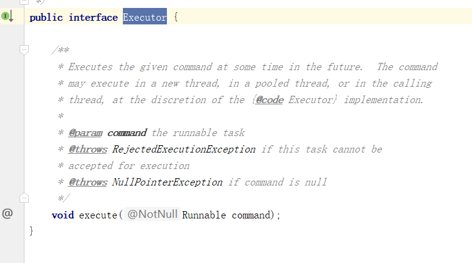

之后在IDEA中快捷键ctrl+shift+alt+u,或者右击选择show diagram，也可以打开如下所示的包依赖图。

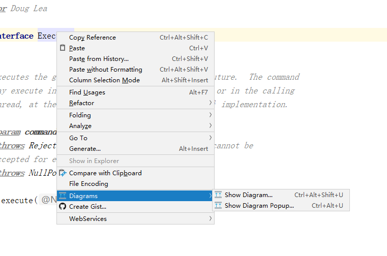


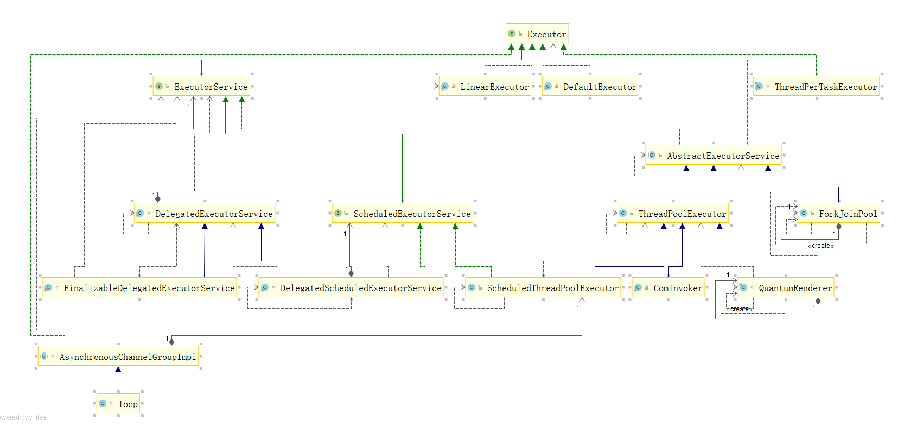


## 2.如何创建线程池？

线程池的创建主要是通过两个类：Executors和**ThreadPollExecutor**。通常建议入门使用ThreadPollExecutor的方式来创建线程，这样可以更加明确线程池的运行规则，避免资源耗尽的风险。阿里巴巴手册不建议用Executors这种方式来创建。

**方法一、通过ThreadPollExecutor的方式**

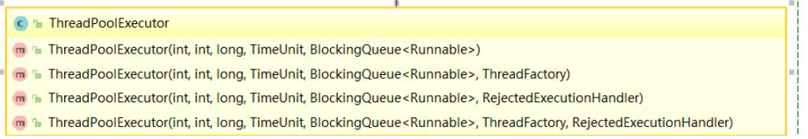


**方法二、通过Executor框架的工具类Executors来创建**

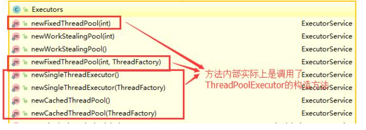

Executors 返回线程池对象的弊端如下：

- **FixedThreadPool 和 SingleThreadExecutor** ： 允许请求的队列长度为 Integer.MAX_VALUE ，可能堆积大量的请求，从而导致 OOM。
- **CachedThreadPool 和 ScheduledThreadPool** ： 允许创建的线程数量为 Integer.MAX_VALUE ，可能会创建大量线程，从而导致 OOM。


## 3.线程池的基本原理

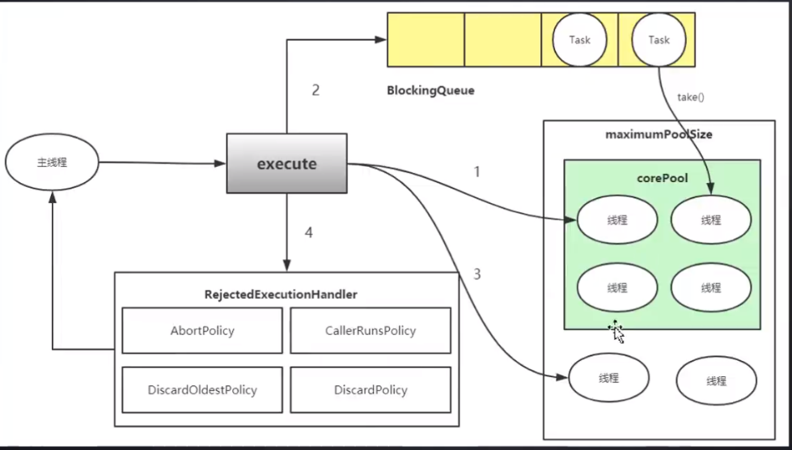

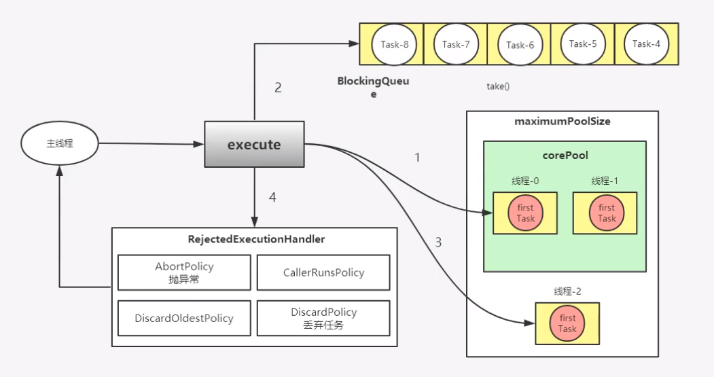

## 4.ThreadPoolExecutor七大核心属性


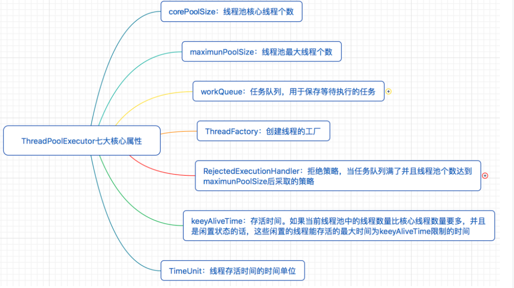

**`ThreadPoolExecutor` 3 个最重要的参数：**

- **`corePoolSize` :** 核心线程数线程数定义了最小可以同时运行的线程数量。
- **`maximumPoolSize` :** 当队列中存放的任务达到队列容量的时候，当前可以同时运行的线程数量变为最大线程数。
- **`workQueue`:** 当新任务来的时候会先判断当前运行的线程数量是否达到核心线程数，如果达到的话，新任务就会被存放在队列中。

`hreadPoolExecutor`其他常见参数:

1. **`keepAliveTime`**:当线程池中的线程数量大于 `corePoolSize` 的时候，如果这时没有新的任务提交，核心线程外的线程不会立即销毁，而是会等待，直到等待的时间超过了 `keepAliveTime`才会被回收销毁；

2. **`unit`** : `keepAliveTime` 参数的时间单位。

3. **`threadFactory`** :executor 创建新线程的时候会用到。

4. **`handler`** :饱和策略

   如果当前同时运行的线程数量达到最大线程数量并且队列也已经被放满了任时，`ThreadPoolTaskExecutor` 定义一些策略:

   - **`ThreadPoolExecutor.AbortPolicy`**：抛出 `RejectedExecutionException`来拒绝新任务的处理。
   - **`ThreadPoolExecutor.CallerRunsPolicy`**：调用执行自己的线程运行任务，也就是直接在调用`execute`方法的线程中运行(`run`)被拒绝的任务，如果执行程序已关闭，则会丢弃该任务。因此这种策略会降低对于新任务提交速度，影响程序的整体性能。如果您的应用程序可以承受此延迟并且你要求任何一个任务请求都要被执行的话，你可以选择这个策略。
   - **`ThreadPoolExecutor.DiscardPolicy`：** 不处理新任务，直接丢弃掉。
   - **`ThreadPoolExecutor.DiscardOldestPolicy`：** 此策略将丢弃最早的未处理的任务请求。

   举个例子： Spring 通过 `ThreadPoolTaskExecutor` 或者我们直接通过 `ThreadPoolExecutor` 的构造函数创建线程池的时候，当我们不指定 `RejectedExecutionHandler` 饱和策略的话来配置线程池的时候默认使用的是 `ThreadPoolExecutor.AbortPolicy`。在默认情况下，`ThreadPoolExecutor` 将抛出 `RejectedExecutionException` 来拒绝新来的任务 ，这代表你将丢失对这个任务的处理。 对于可伸缩的应用程序，建议使用 `ThreadPoolExecutor.CallerRunsPolicy`。当最大池被填满时，此策略为我们提供可伸缩队列。

## 5.线程池的Demo

```java
package com.lcz.threadpool;

import java.util.Date;
import java.util.concurrent.ArrayBlockingQueue;
import java.util.concurrent.ThreadPoolExecutor;
import java.util.concurrent.TimeUnit;

// 创建一个runnable接口实现的类
class MyRunnable implements Runnable{

    private String command;

    public MyRunnable(String s) {
        this.command = s;
    }

    @Override
    public void run() {
        System.out.println(Thread.currentThread().getName() + " Start. Time = " + new Date());
        processCommand();
        System.out.println(Thread.currentThread().getName() + " End. Time = " + new Date());
    }

    private void processCommand() {
        try {
            Thread.sleep(5000);
        } catch (InterruptedException e) {
            e.printStackTrace();
        }
    }

    @Override
    public String toString() {
        return this.command;
    }
}

public class ThreadPoolExecurorDemo {

    private static final int CORE_POOL_SIZE = 5;
    private static final int MAX_POOL_SIZE = 10;
    private static final int QUEUE_CAPACITY = 100;
    private static final Long KEEP_ALIVE_TIME = 1L;

    // 主函数
    public static void main(String[] args){
        //通过ThreadPoolExecutor构造函数自定义参数创建
        ThreadPoolExecutor executor = new ThreadPoolExecutor(
                CORE_POOL_SIZE,
                MAX_POOL_SIZE,
                KEEP_ALIVE_TIME,
                TimeUnit.SECONDS,
                new ArrayBlockingQueue<>(QUEUE_CAPACITY),
                new ThreadPoolExecutor.CallerRunsPolicy());

        for (int i = 0; i < 10; i++) {
            //创建WorkerThread对象（WorkerThread类实现了Runnable 接口）
            Runnable worker = new MyRunnable("" + i);
            //执行Runnable
            executor.execute(worker);
        }
        //终止线程池
        executor.shutdown();
        while (!executor.isTerminated()) {
        }
        System.out.println("Finished all threads");
    }
}

```

结果输出：

```java
pool-1-thread-4 Start. Time = Fri Dec 04 17:03:13 CST 2020
pool-1-thread-2 Start. Time = Fri Dec 04 17:03:13 CST 2020
pool-1-thread-1 Start. Time = Fri Dec 04 17:03:13 CST 2020
pool-1-thread-5 Start. Time = Fri Dec 04 17:03:13 CST 2020
pool-1-thread-3 Start. Time = Fri Dec 04 17:03:13 CST 2020
pool-1-thread-2 End. Time = Fri Dec 04 17:03:18 CST 2020
pool-1-thread-1 End. Time = Fri Dec 04 17:03:18 CST 2020
pool-1-thread-4 End. Time = Fri Dec 04 17:03:18 CST 2020
pool-1-thread-2 Start. Time = Fri Dec 04 17:03:18 CST 2020
pool-1-thread-1 Start. Time = Fri Dec 04 17:03:18 CST 2020
pool-1-thread-4 Start. Time = Fri Dec 04 17:03:18 CST 2020
pool-1-thread-3 End. Time = Fri Dec 04 17:03:18 CST 2020
pool-1-thread-5 End. Time = Fri Dec 04 17:03:18 CST 2020
pool-1-thread-3 Start. Time = Fri Dec 04 17:03:18 CST 2020
pool-1-thread-5 Start. Time = Fri Dec 04 17:03:18 CST 2020
pool-1-thread-4 End. Time = Fri Dec 04 17:03:23 CST 2020
pool-1-thread-1 End. Time = Fri Dec 04 17:03:23 CST 2020
pool-1-thread-2 End. Time = Fri Dec 04 17:03:23 CST 2020
pool-1-thread-3 End. Time = Fri Dec 04 17:03:23 CST 2020
pool-1-thread-5 End. Time = Fri Dec 04 17:03:23 CST 2020
Finished all threads

```

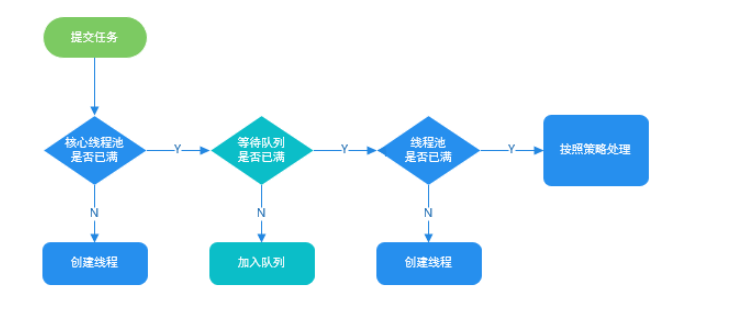

## 6.线程池的状态

- **RUNNING**：这是最正常的状态，接受新的任务，处理等待队列中的任务。
- **SHUTDOWN**：不接受新的任务提交，但是会继续处理等待队列中的任务。
- **STOP**：不接受新的任务提交，不再处理等待队列中的任务，中断正在执行任务的线程。
- **TIDYING**：所有的任务都销毁了，workCount 为 0，线程池的状态在转换为 TIDYING 状态时，会执行钩子方法 terminated()。
- **TERMINATED**：terminated()方法结束后，线程池的状态就会变成这个

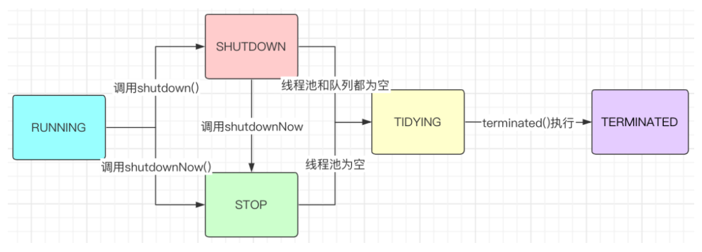

五大状态：

- running：能接受新任务以及处理已添加的任务；
- shutdown：不接受新任务，可以处理已经添加的任务；
- stop：不接受新任务，不处理已经添加的任务，并且中断正在处理的任务；
- tiding：所有的任务已经终止，ctl记录的“任务数量”为0，ctl负责记录线程池的运行状态与活动线程数量
- terminated：线程池彻底终止，则线程池转变为terminated状态。

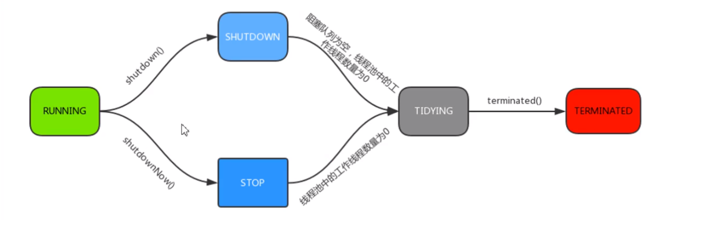


## 7.线程池中submit()和exectute()方法的区别？

- **execute():只能执行Runnable类型的任务**；而Runnable任务执行无返回值；
- **submit():可以执行runnable和callable类型的任务**，其中runnable任务执行有返回值。


## 8.线程池是如何保证线程安全的？

`ThreadPoolExecutor`有一个`ctl`的原子整型变量。该ctl是一个AtomicInteger的类，就是让保存的int变量的更新都是原子操作，保证线程安全。

```java
 private final AtomicInteger ctl = new AtomicInteger(ctlOf(RUNNING, 0));
```

而线程池的生命状态和工作线程数是通过一个int整型变量来实现的。

将int变量拆分为两部分使用，**高3位记录线程池生命状态**，而**29位记录当前工作线程数。**

```java
private static final int COUNT_BITS = Integer.SIZE - 3;
private static final int CAPACITY   = (1 << COUNT_BITS) - 1;
```


```java
// runState is stored in the high-order bits
private static final int RUNNING    = -1 << COUNT_BITS;   // 高3位为111 running状态
private static final int SHUTDOWN   =  0 << COUNT_BITS;   // 高3位为000 shutdown状态
private static final int STOP       =  1 << COUNT_BITS;   // 高3位为001 stop状态
private static final int TIDYING    =  2 << COUNT_BITS;   // 高3位为010 tiding状态
private static final int TERMINATED =  3 << COUNT_BITS;   // 高3位为011 terminated状态 

// Packing and unpacking ctl
private static int runStateOf(int c)     { return c & ~CAPACITY; }
private static int workerCountOf(int c)  { return c & CAPACITY; }
private static int ctlOf(int rs, int wc) { return rs | wc; }
```

## 9.题目

### 9.1 什么是Executor框架？

**Executor框架是一个根据一组执行策略调用，调度，执行和控制的异步任务的框架。**

每次执行任务**创建线程 new Thread()比较消耗性能**，创建一个线程是比较耗时、耗资源的，而且无限制的创建线程会引起应用程序内存溢出。

所以**创建一个线程池是个更好的的解决方案**，因为**可以限制线程的数量并且可以回收再利用这些线程**。利用Executors 框架可以非常方便的创建一个线程池。

**J.U.C的三个Executor接口**

- Executor：运行新任务的简单接口，将任务提交和任务执行细节解耦；
- ExecutorService：具备管理执行器和任务生命周期的方法，提交任务机制更完善；
- ScheduledExecutorService:支持Future和定期执行任务

### 9.2 在 Java 中 Executor 和 Executors 的区别？

- Executors 工具类的不同方法按照我们的需求创建了不同的线程池，来满足业务的需求。
- Executor 接口对象能执行我们的线程任务。
- ExecutorService 接口继承了 Executor 接口并进行了扩展，提供了更多的方法我们能获得任务执行的状态并且可以获取任务的返回值。
- 使用 ThreadPoolExecutor 可以创建自定义线程池。
- Future 表示异步计算的结果，他提供了检查计算是否完成的方法，以等待计算的完成，并可以使用 get()方法获取计算的结果。

 ### 9.3 Executors和ThreaPoolExecutor创建线程池的区别

《阿里巴巴Java开发手册》中强制线程池不允许使用 Executors 去创建，而是通过 ThreadPoolExecutor 的方式，这样的处理方式让写的同学更加明确线程池的运行规则，规避资源耗尽的风险

Executors 各个方法的弊端：

- newFixedThreadPool 和 newSingleThreadExecutor:
  主要问题是堆积的请求处理队列可能会耗费非常大的内存，甚至 OOM。
- newCachedThreadPool 和 newScheduledThreadPool:
  主要问题是线程数最大数是 Integer.MAX_VALUE，可能会创建数量非常多的线程，甚至 OOM。

ThreaPoolExecutor创建线程池方式只有一种，就是走它的构造函数，参数自己指定

创建线程池的方式有多种，这里你只需要答 ThreadPoolExecutor 即可。

**ThreadPoolExecutor() 是最原始的线程池创建，也是阿里巴巴 Java 开发手册中明确规范的创建线程池的方式。**