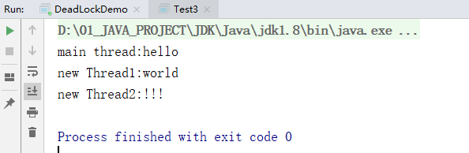
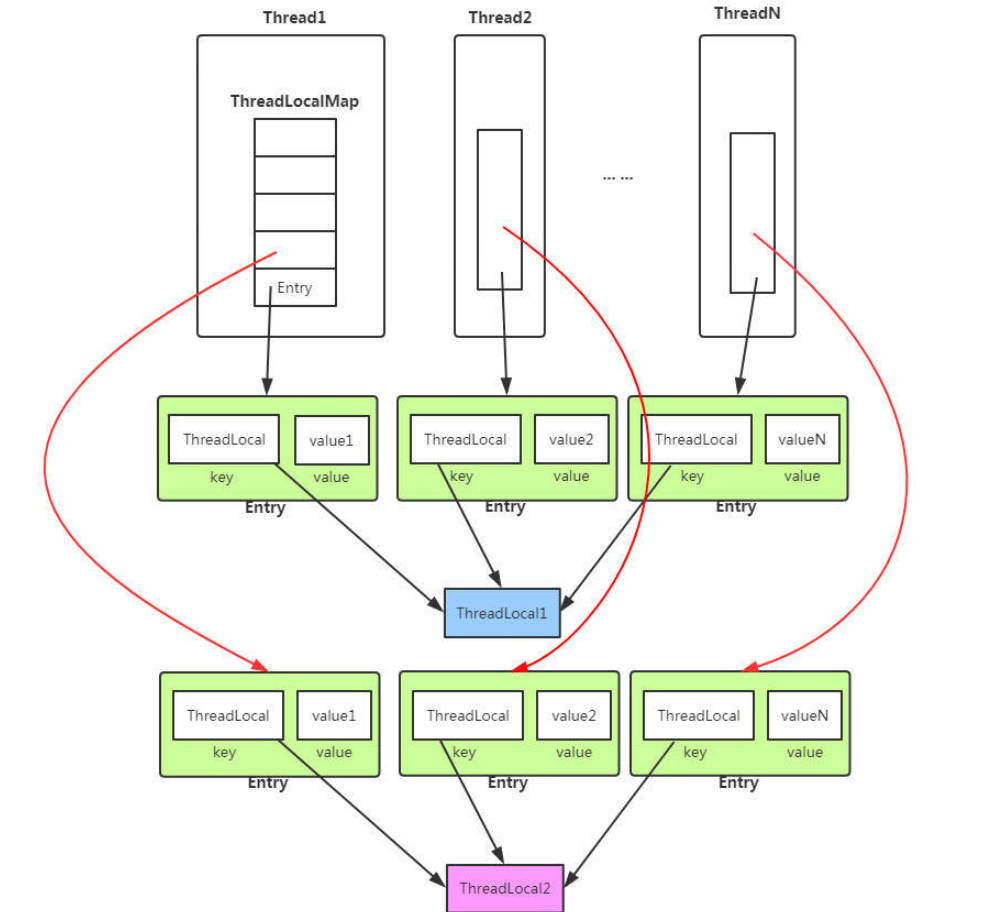
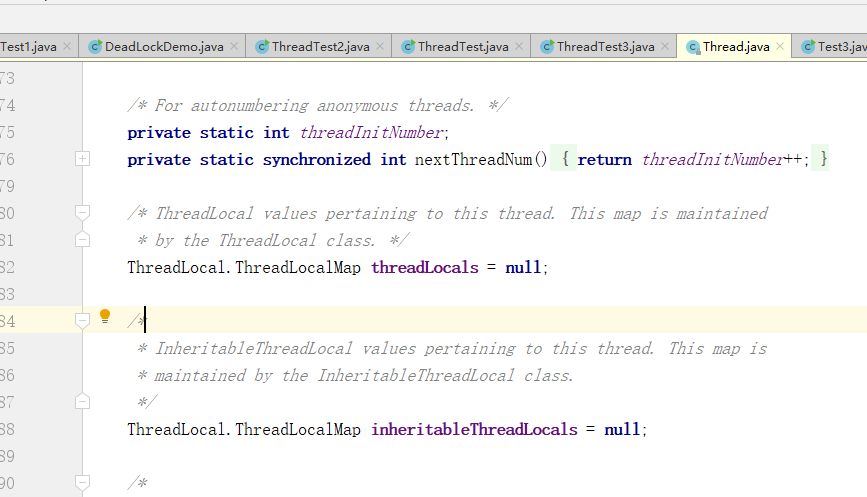

# 【多线程与高并发】七、ThreadLocal关键字

> **ThreadLocal为每个使用该变量的线程提供独立的变量副本，所以每一个线程都可以独立地改变自己的副本，而不会影响其它线程所对应的副本。**
>
> ThreadLocal的经典使用场景是数据库连接和session管理等。

**如果一个你创建了一个`ThreadLocal`变量，那么访问这个变量的每个线程都会有这个变量的本地副本，这也是ThreadLocal变量名的由来。可以使用get()和set()方法来获取默认值或者将其值更改为当前线程所存的副本的值，。**

## 1.ThreadLocal的例子

```java
public static void main(String[] args) {
         final ThreadLocal threadLocal = new ThreadLocal();
        threadLocal.set("hello");
        System.out.println("main thread:"+ threadLocal.get());
        new Thread(new Runnable() {
            @Override
            public void run() {
                threadLocal.set("world");
                System.out.println("new Thread1:" + threadLocal.get());
            }
        }).start();

        new Thread(new Runnable() {
            @Override
            public void run() {
                threadLocal.set("!!!");
                System.out.println("new Thread2:" + threadLocal.get());
            }
        }).start();
    }
```



## 2.ThreadLocal源码

从ThreadLocal的set方法开始：

```java
public void set(T value) {
    Thread t = Thread.currentThread();
    ThreadLocalMap map = getMap(t);
    if (map != null)
        map.set(this, value);
    else
        createMap(t, value);
}
```

>set方法的第一步是获取当前线程实例，然后通过getMap方法获取当前线程实例的threadLocals属性，threadLocals是ThreadLocalMap类型的变量，而T**hreadLocalMap则是一个定制化的HashMap。**  

```java
// ThreadLocal类中的getMap方法
    ThreadLocalMap getMap(Thread t) {
        return t.threadLocals;
    }
    // Thread类中声明的threadLocals变量
    ThreadLocal.ThreadLocalMap threadLocals = null;
```

如果getMap方法获取的ThreadLocalMap类型变量map不等于null，则以当前ThreadLocal实例对象为key，传入的value值为value存到这个ThreadLocalMap中，需要注意的是在实际存储的时候，key使用的是ThreadLocal的弱引用。

如果getMap方法获取的ThreadLocalMap类型变量map等于null，则调用createMap方法创建一个ThreadLocalMap实例对象，并以当前ThreadLocal实例对象为key，传入的value值为value存到这个ThreadLocalMap中。

看到这里就会明白，使用ThreadLocal时，**每个线程维护一个ThreadLocalMap映射表**，**映射表的key是ThreadLocal实例**，并且使用的是ThreadLocal的弱引用 ，**value是具体需要存储的Object。**

紧接着进入ThreadLocal类的get方法，这个方法的第一步也是获取当前线程，通过getMap方法获取当前线程所维护的ThreadLocalMap实例，如果ThreadLocalMap对象实例不等于null，则以当前ThreadLocal对象实例为key从ThreadLocalMap中获取所需要的值。

```java
   public T get() {
        Thread t = Thread.currentThread();
        ThreadLocalMap map = getMap(t);
        if (map != null) {
            ThreadLocalMap.Entry e = map.getEntry(this);
            if (e != null)
                return (T)e.value;
        }
        return setInitialValue();
    }
```

如果getMap方法获取到的ThreadLocalMap对象实例等于null，则调用setInitialValue方法初始化一个ThreadLocalMap，并以当前ThreadLocal实例对象为key，null值为value存到这个ThreadLocalMap中，同时返回null。

```java
    private T setInitialValue() {
        T value = initialValue();
        Thread t = Thread.currentThread();
        ThreadLocalMap map = getMap(t);
        if (map != null)
            map.set(this, value);
        else
            createMap(t, value);
        return value;
    }
    protected T initialValue() {
        return null;
    }
    ThreadLocalMap getMap(Thread t) {
        return t.threadLocals;
    }
    void createMap(Thread t, T firstValue) {
        t.threadLocals = new ThreadLocalMap(this, firstValue);
    }
```

整体如下：



Thread类中声明的ThreadLocalMap可以让每个线程都关联很多个ThreadLocal变量

## 3.ThreadLocal内存泄露的问题

`ThreadLocalMap` 中使用的 key 为 `ThreadLocal` 的弱引用,而 value 是强引用。所以，如果 `ThreadLocal` 没有被外部强引用的情况下，在垃圾回收的时候，key 会被清理掉，而 value 不会被清理掉。这样一来，`ThreadLocalMap` 中就会出现 key 为 null 的 Entry。假如我们不做任何措施的话，value 永远无法被 GC 回收，这个时候就可能会产生内存泄露。

> 解决办法是**每次使用完ThreadLocal都调用它的remove()方法清除数据，**或者按照**JDK建议将ThreadLocal变量定义成private static，这样就一直存在ThreadLocal的强引用**，也就能保证任何时候都能通过ThreadLocal的弱引用访问到Entry的value值，进而清除掉。

## 4.子线程中获取主线程中的ThreadLocal中的值

使用InheritableThreadLocal，ThreadLocal threadLocal = new InheritableThreadLocal()，这样在子线程中就可以通过get方法获取到主线程set方法设置的值了。

总结：




