# Java复习框架-数据库Mysql

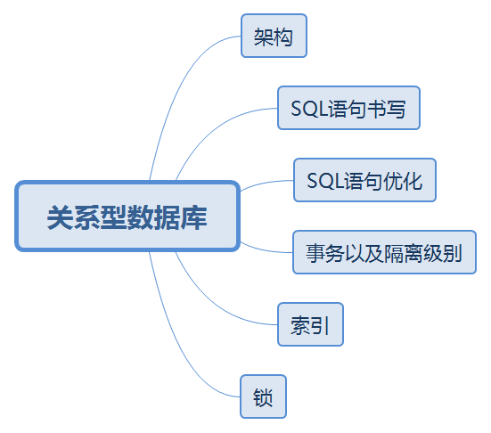

## 数据库架构

**如何设计一个数据库系统？**

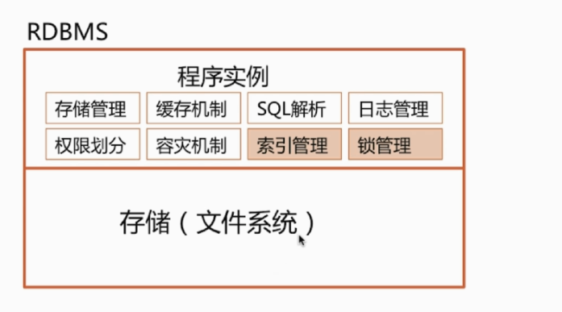


## 一、数据库基础知识

### 1.为什么要使用数据库

- **数据存储在内存中**
  - 优点：存取速度快；
  - 缺点：数据不能永久保存
- **数据存储在文件中**
  - 优点：数据永久保存
  - 缺点：速度比内存操作慢，频繁的IO操作；查询数据不方便
- **数据存储在数据库**
  - 数据可以永久保存；
  - 使用SQL语句，查询方便效率高；
  - 管理数据方便；

### 2.什么是SQL？

SQL(Structured Query Language)结构化查询语言简称SQL，是一种数据库查询语言。

作用：用于存取数据、查询、更新和管理关系数据库系统。

### 3.什么是Mysql？

**Mysql是一个关系型数据库管理系统，**属于Oracle公司旗下产品。MySQL是最流行的关系型数据库管理系统之一。

### 4.数据库的三大范式？

**第一范式：**每个列都不可以再拆分。

**举例：**

如以下表存在可再分项（高级职称），所以不满足第一范式

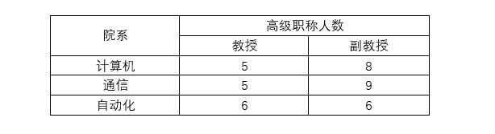

**解决措施：**非规范化转换为规范化的第一范式方法很简单，将表分别从横向、纵向展开即可。将高级职称横向展开即可以得到满足第一范式的表结构。

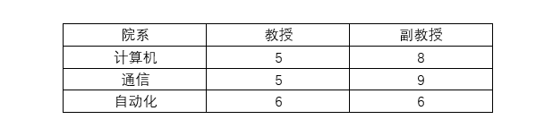

**第二范式：**关系模式必须满足第一范式，**并且所有非主属性都完全依赖与主码**。注意，符合第二范式的关系模式可能还存在数据冗余、更新异常等问题。

**举例：**如关系模型（职工号，姓名，职称，项目号，项目名称）中，职工号->姓名，职工号->职称，而项目号->项目名称。显然依赖关系不满足第二范式，常用的解决办法是差分表格，比如拆分为职工信息表和项目信息表。

**第三范式：**关系模式满足第二范式，所有非主属性对任何候选关键字都不存在传递依赖。即**每个属性都跟主键有直接关系而不是间接关系**，像：a-->b-->c。一般数据库设计中，一般要求达到3NF，第四第五较少涉及。

**举例：**比如Student表（学号，姓名，年龄，性别，所在院校，院校地址，院校电话）这样一个表结构，就存在上述关系。 学号--> 所在院校 --> (院校地址，院校电话)。我们应该拆开来，如下：

（学号，姓名，年龄，性别，所在院校）--（所在院校，院校地址，院校电话）

### 5.数据库的事务性

除了数据库设计三大范式之外，事务处理也是保证数据完整性的重要手段。**事务是单独的工作单元，该单元可以包含多个操作以完成一个完整的任务**。**锁是在多用户环境中对数据访问的限制。**事务和锁确保了数据的完整性。

**事务处理**

提交commit：当所有的操作步骤都被完整执行后，称该事务被提交

回滚rollback：由于某一操作步骤执行失败，导致所有步骤都没有被提交，则事务必须回滚，即回到事务执行前的状态。

**事务ACID属性**

事务处理的特性，每一个事务都有它们所共有的特性，叫做ACID特性，分别是原子性atomicity，一致性consistency，隔离性Isolation，持久性Durability。

- **原子性：**

  事务的原子性表示事务执行过程中，把**事务作为一个工作单元处理**，**一个工作单元可能包括若干个操作步骤**，每个操作步骤都必须完成才算完成，若因任何原因导致其中的一个步骤操作失败，则所有步骤操作失败，前面的步骤必须回滚。

- **一致性：**

  事务的一致性保证数据处于一致状态。**如果事务开始时系统处于一致状态，则事务结束时系统也处于一致状态，不管事务成功还是失败。**

- **隔离性：**

  事务的隔离性**保证事务访问的任何数据不会受到其它事务所做的任何改变的影响，直到该事务完成。**

- **持久性：**

  事务的持久性**保证加入事务执行成功，则它在系统中产生的结果应该是持久的**。

### 6.Mysql有关权限的表都有哪几个？

Mysql服务器通过权限表来控制用户对数据库的访问，权限表存放在Mysql数据库里，由mysql_install_db脚本初始化。这些权限表分别为user,db,table_priv,columns_priv和host。下面分别介绍一下这些表的结构和内容：

- **user权限表**：记录允许连接到**服务器**的用户账号信息，里面的权限是全局级的。
- **db权限表**：记录各个账号在**各个数据库上**的操作权限。
- **table_priv权限表**：记录**数据表级**的操作权限。
- **columns_priv权限表**：记录**数据列级的**操作权限。
- **host权限表**：配合**db权限表对给定主机上数据库级操作权限作梗细致的控制**。这个权限表不受GRANT和REVOKE语句的影响。

### 7.MySQL Binlog介绍

#### 7.1 Binlog简介

在MySQL中一般有以下几种日志：

| 日志类型                 | 写入日志的信息                                               |
| ------------------------ | ------------------------------------------------------------ |
| **错误日志**             | 记录在启动，运行或停止mysqld时遇到的问题                     |
| **通用查询日志**         | 记录建立的客户端连接和执行的语句                             |
| **二进制日志（Binlog）** | **记录更改数据的语句**                                       |
| 中继日志                 | 从复制主服务器接收的数据更改                                 |
| **慢查询日志**           | 记录所有执行时间超过`long_query_time`秒的所有查询或不使用索引的查询 |
| DDL日志(元数据日志)      | 元数据操作由DDL语句执行                                      |

本次的二进制日志Binlog可以说是Mysql最重要的日志，其记录了所有的`DDL`和`DML`语句(除了数据查询语句select，show等)，以事件形式记录，还包含语句所执行的消耗时间，Mysql的二进制日志是事务安全型的。binlog的主要目的是**复制和恢复**。

#### 7.2 Binlog日志的两个最重要的使用场景

- **Mysql主从复制：**Mysql Replication在Master端开启binlog，Master把它的二进制日志传递给slaves来达到master-slave数据一致的目的。
- **数据恢复：**通过使用mysqlbinlog工具来恢复数据。

#### 7.3 启用Binlog日志

一般来说开启binlog日志大概会有1%的性能损耗。

启用binlog，通过配置 `/etc/my.cnf` 或 `/etc/mysql/mysql.conf.d/mysqld.cnf` 配置文件的 `log-bin` 选项：

在配置文件中加入 `log-bin` 配置，表示启用binlog，如果没有给定值，写成 `log-bin=`，则默认名称为主机名。（注：名称若带有小数点，则只取第一个小数点前的部分作为名称）

```
[mysqld]
log-bin=my-binlog-name
12
```

也可以通过 `SET SQL_LOG_BIN=1` 命令来启用 binlog，通过 `SET SQL_LOG_BIN=0` 命令停用 binlog。启用 binlog 之后须重启MySQL才能生效。

#### 7.4 常用的BinLog操作命令

```java
# 是否启用binlog日志
show variables like 'log_bin';

# 查看详细的日志配置信息
show global variables like '%log%';

# mysql数据存储目录
show variables like '%dir%';

# 查看binlog的目录
show global variables like "%log_bin%";

# 查看当前服务器使用的biglog文件及大小
show binary logs;

# 查看主服务器使用的biglog文件及大小

# 查看最新一个binlog日志文件名称和Position
show master status;


# 事件查询命令
# IN 'log_name' ：指定要查询的binlog文件名(不指定就是第一个binlog文件)
# FROM pos ：指定从哪个pos起始点开始查起(不指定就是从整个文件首个pos点开始算)
# LIMIT [offset,] ：偏移量(不指定就是0)
# row_count ：查询总条数(不指定就是所有行)
show binlog events [IN 'log_name'] [FROM pos] [LIMIT [offset,] row_count];

# 查看 binlog 内容
show binlog events;

# 查看具体一个binlog文件的内容 （in 后面为binlog的文件名）
show binlog events in 'master.000003';

# 设置binlog文件保存事件，过期删除，单位天
set global expire_log_days=3; 

# 删除当前的binlog文件
reset master; 

# 删除slave的中继日志
reset slave;

# 删除指定日期前的日志索引中binlog日志文件
purge master logs before '2019-03-09 14:00:00';

# 删除指定日志文件
purge master logs to 'master.000003';

```

#### 7.5 Binlog的写入时机

对支持事务的引擎如InnoDB而言，必须要提交了事务才会记录binlog。binlog 什么时候**刷新到磁盘**跟参数 `sync_binlog` 相关。

- 如果设置为0，则表示**MySQL不控制binlog的刷新，由文件系统去控制它缓存的刷新**；
- 如果设置为不为0的值，则表示每 `sync_binlog` 次事务，**MySQL调用文件系统的刷新操作刷新binlog到磁盘中**。
- 设为1是最安全的，在系统故障时最多丢失一个事务的更新，但是会对性能有所影响。

如果 `sync_binlog=0` 或 `sync_binlog大于1`，**当发生电源故障或操作系统崩溃时，可能有一部分已提交但其binlog未被同步到磁盘的事务会被丢失，恢复程序将无法恢复这部分事务。**

在MySQL 5.7.7之前，默认值 sync_binlog 是0，MySQL 5.7.7和更高版本使用默认值1，这是最安全的选择。一般情况下会设置为100或者0，牺牲一定的一致性来获取更好的性能。

#### 7.6 Binlog文件

binlog日志包括两类文件:

- **二进制日志索引文件**（文件名后缀为.index）用于记录所有有效的的二进制文件
- **二进制日志文件（**文件名后缀为.00000*）记录数据库所有的DDL和DML语句事件

binlog是一个二进制文件集合，每个binlog文件以一个4字节的魔数开头，接着是一组Events:

- 魔数：0xfe62696e对应的是0xfebin；
- Event：每个Event包含header和data两个部分；header提供了Event的创建时间，哪个服务器等信息，data部分提供的是针对该Event的具体信息，如具体数据的修改；
- 第一个Event用于描述binlog文件的格式版本，这个格式就是event写入binlog文件的格式；
- 其余的Event按照第一个Event的格式版本写入；
- 最后一个Event用于说明下一个binlog文件；
- binlog的索引文件是一个文本文件，其中内容为当前的binlog文件列表

当遇到以下3种情况时，MySQL会重新生成一个新的日志文件，文件序号递增：

- MySQL服务器停止或重启时
- 使用 `flush logs` 命令；
- 当 binlog 文件大小超过 `max_binlog_size` 变量的值时；

> `max_binlog_size` 的最小值是4096字节，最大值和默认值是 1GB (1073741824字节)。事务被写入到binlog的一个块中，所以它不会在几个二进制日志之间被拆分。因此，如果你有很大的事务，为了保证事务的完整性，不可能做切换日志的动作，只能将该事务的日志都记录到当前日志文件中，直到事务结束，你可能会看到binlog文件大于 max_binlog_size 的情况。

#### 7.7 Mysql的binlog有几种记录格式？分别有什么区别？

记录在二进制日志中的事件的格式取决于二进制记录格式。支持三种格式类型：

- STATEMENT：基于SQL语句的复制（statement-based replication, SBR）
- ROW：基于行的复制（row-based replication, RBR）
- MIXED：混合模式复制（mixed-based replication, MBR）

在 `MySQL 5.7.7` 之前，默认的格式是 `STATEMENT`，在 `MySQL 5.7.7` 及更高版本中，默认值是 `ROW`。日志格式通过 `binlog-format` 指定，如 `binlog-format=STATEMENT`、`binlog-format=ROW`、`binlog-format=MIXED`。

- statement模式下，每一条会修改数据的sql都会记录在binlog中。不需要记录每一行的变化，减少了binlog日志量，节约了IO，提高性能。由于sql的执行是有上下文的，因此在保存的时候需要保存相关的信息，同时还有一些使用了函数之类的语句无法被记录复制。
- row级别下，不记录sql语句上下文相关信息，仅保存哪条记录被修改。记录单元为每一行的改动，基本是可以全部记下来但是由于很多操作，会导致大量行的改动(比如alter table)，因此这种模式的文件保存的信息太多，日志量太大。
- mixed，一种折中的方案，普通操作使用statement记录，当无法使用statement的时候使用row。

## 二、Mysql数据类型

- `1、整数类型`，包括TINYINT、SMALLINT、MEDIUMINT、INT、BIGINT，分别表示1字节、2字节、3字节、4字节、8字节整数。任何整数类型都可以加上UNSIGNED属性，表示数据是无符号的，即非负整数。
  `长度`：整数类型可以被指定长度，例如：INT(11)表示长度为11的INT类型。长度在大多数场景是没有意义的，它不会限制值的合法范围，只会影响显示字符的个数，而且需要和UNSIGNED ZEROFILL属性配合使用才有意义。
  `例子`，假定类型设定为INT(5)，属性为UNSIGNED ZEROFILL，如果用户插入的数据为12的话，那么数据库实际存储数据为00012。

- `2、实数类型`，包括FLOAT、DOUBLE、DECIMAL。
  DECIMAL可以用于存储比BIGINT还大的整型，能存储精确的小数。
  而FLOAT和DOUBLE是有取值范围的，并支持使用标准的浮点进行近似计算。
  计算时FLOAT和DOUBLE相比DECIMAL效率更高一些，DECIMAL你可以理解成是用字符串进行处理。

- `3、字符串类型`，包括VARCHAR、CHAR、TEXT、BLOB
  VARCHAR用于存储可变长字符串，它比定长类型更节省空间。
  VARCHAR使用额外1或2个字节存储字符串长度。列长度小于255字节时，使用1字节表示，否则使用2字节表示。
  VARCHAR存储的内容超出设置的长度时，内容会被截断。
  CHAR是定长的，根据定义的字符串长度分配足够的空间。
  CHAR会根据需要使用空格进行填充方便比较。
  CHAR适合存储很短的字符串，或者所有值都接近同一个长度。
  CHAR存储的内容超出设置的长度时，内容同样会被截断。

  **使用策略：**
  对于经常变更的数据来说，CHAR比VARCHAR更好，因为CHAR不容易产生碎片。
  对于非常短的列，CHAR比VARCHAR在存储空间上更有效率。
  使用时要注意只分配需要的空间，更长的列排序时会消耗更多内存。
  尽量避免使用TEXT/BLOB类型，查询时会使用临时表，导致严重的性能开销。

- `4、枚举类型（ENUM）`，把不重复的数据存储为一个预定义的集合。
  有时可以使用ENUM代替常用的字符串类型。
  ENUM存储非常紧凑，会把列表值压缩到一个或两个字节。
  ENUM在内部存储时，其实存的是整数。
  尽量避免使用数字作为ENUM枚举的常量，因为容易混乱。
  排序是按照内部存储的整数

- `5、日期和时间类型`，尽量使用timestamp，空间效率高于datetime，
  用整数保存时间戳通常不方便处理。
  如果需要存储微妙，可以使用bigint存储。
  看到这里，这道真题是不是就比较容易回答了。

| **分类**             | **类型名称**  | **说明**                                                     |
| -------------------- | ------------- | ------------------------------------------------------------ |
| **整数类型**         | tinyInt       | 很小的整数(8位二进制)                                        |
|                      | smallint      | 小的整数(16位二进制)                                         |
|                      | mediumint     | 中等大小的整数(24位二进制)                                   |
|                      | int(integer)  | 普通大小的整数(32位二进制)                                   |
| **小数类型**         | float         | 单精度浮点数                                                 |
|                      | double        | 双精度浮点数                                                 |
|                      | decimal(m,d)  | 压缩严格的定点数                                             |
| **日期类型**         | year          | YYYY 1901~2155                                               |
|                      | time          | HH:MM:SS -838:59:59~838:59:59                                |
|                      | date          | YYYY-MM-DD 1000-01-01~9999-12-3                              |
|                      | **datetime**  | YYYY-MM-DD HH:MM:SS 1000-01-01 00:00:00~ 9999-12-31 23:59:59 |
|                      | **timestamp** | YYYY-MM-DD HH:MM:SS 19700101 00:00:01 UTC~2038-01-19 03:14:07UTC |
| **文本、二进制类型** | CHAR(M)       | M为0~255之间的整数                                           |
|                      | VARCHAR(M)    | M为0~65535之间的整数                                         |
|                      | TINYBLOB      | 允许长度0~255字节                                            |
|                      | BLOB          | 允许长度0~65535字节                                          |
|                      | MEDIUMBLOB    | 允许长度0~167772150字节                                      |
|                      | LONGBLOB      | 允许长度0~4294967295字节                                     |
|                      | TINYTEXT      | 允许长度0~255字节                                            |
|                      | TEXT          | 允许长度0~65535字节                                          |
|                      | MEDIUMTEXT    | 允许长度0~167772150字节                                      |
|                      | LONGTEXT      | 允许长度0~4294967295字节                                     |
|                      | VARBINARY(M)  | 允许长度0~M个字节的变长字节字符串                            |
|                      | BINARY(M)     | 允许长度0~M个字节的定长字节字符串                            |

## 三、Mysql数据引擎（重点）

存储引擎Storage engine：Mysql中的**数据、索引以及其它对象是如何存储的，是一套文件系统的实现。**

常用的存储引擎有以下：

- **Innodb引擎**：Innodb引擎提供了对数据库ACID事务的支持。并且还提供了行级锁和外键的约束。它的设计的目标就是处理大数据容量的数据库系统。
- **MyIASM引擎**(原本Mysql的默认引擎)：不提供事务的支持，也不支持行级锁和外键。
- **MEMORY引擎**：所有的数据都在内存中，数据的处理速度快，但是安全性不高。

**MyISAM与InnoDB区别**

|                                                              | MyISAM                                                       | Innodb                                                       |
| ------------------------------------------------------------ | ------------------------------------------------------------ | ------------------------------------------------------------ |
| 存储结构                                                     | 每张表被存放在三个文件：frm-表格定义、MYD(MYData)-数据文件、MYI(MYIndex)-索引文件 | 所有的表都保存在同一个数据文件中（也可能是多个文件，或者是独立的表空间文件），InnoDB表的大小只受限于操作系统文件的大小，一般为2GB |
| 存储空间                                                     | MyISAM可被压缩，存储空间较小                                 | InnoDB的表需要更多的内存和存储，它会在主内存中建立其专用的缓冲池用于高速缓冲数据和索引 |
| 可移植性、备份及恢复                                         | 由于MyISAM的数据是以文件的形式存储，所以在跨平台的数据转移中会很方便。在备份和恢复时可单独针对某个表进行操作 | 免费的方案可以是拷贝数据文件、备份 binlog，或者用 mysqldump，在数据量达到几十G的时候就相对痛苦了 |
| 文件格式                                                     | 数据和索引是分别存储的，数据`.MYD`，索引`.MYI`               | 数据和索引是集中存储的，`.ibd`                               |
| 记录存储顺序                                                 | 按记录插入顺序保存                                           | 按主键大小有序插入                                           |
| 外键                                                         | 不支持                                                       | 支持                                                         |
| 事务                                                         | 不支持                                                       | 支持                                                         |
| 锁支持（锁是避免资源争用的一个机制，MySQL锁对用户几乎是透明的） | 表级锁定                                                     | 行级锁定、表级锁定，锁定力度小并发能力高                     |
| SELECT                                                       | MyISAM更优                                                   |                                                              |
| INSERT、UPDATE、DELETE                                       |                                                              | InnoDB更优                                                   |
| select count(*)                                              | myisam更快，因为myisam内部维护了一个计数器，可以直接调取。   |                                                              |
| 索引的实现方式                                               | B+树索引，myisam 是堆表                                      | B+树索引，Innodb 是索引组织表                                |
| 哈希索引                                                     | 不支持                                                       | 支持                                                         |
| 全文索引                                                     | 支持                                                         | 不支持                                                       |

### 3.1 MyISAM引擎与InnoDB引擎的区别？

**MyIsam和InnoDB引擎的区别：**

- **InooDB支持事务**，**MyISAM不支持事务**；
- **InnoDB支持外键**，**MyISAM不支持；**
- **InnoDB是聚集索引**，**MyISAM是非聚集索引**；
- **InnoDB不保存表的具体行数**，执行select count(*) from table时需要全表扫描**，而MyISAM用一个变量保存了整个表的行数，执行上述语句只需读出该变量即可，速度很快。**
- I**nooDB最小的锁粒度是行锁**，MyISAM最小的锁粒度是表锁。一个更新语句会锁住整张表，导致其他查询和更新都会被阻塞，因此并发访问受限。

**MyISAM索引和InnoDB索引实现：**

**(1) MyISAM索引实现：**

非聚集性索引

**a.主键索引**

MyISAM引擎使用B+树作为索引结果，**叶子结点的data域存放的是数据记录的地址**。下图为MyISAM表的主索引，Col1为主键。


**b.辅助索引**

在MyISAM中，主索引和辅助索引在结构上没有任何区别，只是主索引要求key是唯一的，而辅助索引的key可以重复。下图在Col2上建议一个辅助索引。


同样是一棵B+树，data域保存数据记录的地址。因此，**MYISAM中索引检索的算法为首先按照B+ Tree搜索算法搜索索引，如果指定的key存在，则取出其data域的值，然后 以data域的值为地址，读取相应数据记录。**

**(2) InnoDB**

聚集性索引

**a.主键索引**

同样是B+树，实现方式却完全不同。InnoDB表数据文件本身就是一个索引结构，树的叶节点data域保存了完整的数据记录，这种索引叫做**聚集索引**。


 因为InnoDB的数据文件本身要按**主键聚集**，所以InnoDB要求表必须有主键(MyISAM可以没有)，如果没有显式指定，则mysql会自动选择一个可以唯一标识数据记录的列作为主键。如果不存在这种列，则**mysql自动为InnoDB表生成一个隐含字段作为主键，这个字段长度为6个字节，类型为长整型。**

**b.辅助索引**

nnoDB的所有辅助索引都引用主键作为data域。下图为定义在Col3上的一个辅助索引


因此InnoDB 的索引能提供一种非常快速的主键查找性能。不过，它的辅助索引也会包含主键列，所以如果主键定义的比较大，其他索引也将很大。InnoDB 不会压缩索引。

**聚集索引这种实现方式使得按主键的搜索十分高效，但是辅助索引搜索需要检索两遍索引：首先检索辅助索引获得主键，然后用主键到主索引中检索获得记录。**


不同存储引擎的索引实现方式对于正确使用和优化索引都非常有帮助，例如知道了InnoDB的索引实现后，就很容易明白为什么不建议使用过长的字段作为主键，因为所有辅助索引都引用主索引，过长的主索引会令辅助索引变得过大。再例如，用非单调的字段作为主键在InnoDB中不是个好主意，因为InnoDB数据文件本身是一颗B+Tree，非单调的主键会造成在插入新记录时数据文件为了维持B+Tree的特性而频繁的分裂调整，十分低效，而使用自增字段作为主键则是一个很好的选择。


**MyIsam和InooDB应用场景**

MyISAM：**以读写插为主的应用程序**，比如博客系统、新闻门户网站；

Innodb：**更新(删除)操作频率也高，或者要保证数据的完整性；并发量高、支持事务和外键。比如OA自动化办公系统。**

**如何选择MyISam和InnoDB引擎？**

- 是否要支持事务，如果要选择InnoDB；如果不需要考虑MyISAM
- 如果表中绝大数都只是读查询，可以考虑MyISAM；如果既考虑读也有写，请使用InnoDB。
- 系统崩溃后，MyISAM恢复起来更困难，能否接受；
- MySQL5.5 版本开始Innodb开始成为Mysql的默认引擎。

**InnoDB为什么推荐使用自增ID作为主键？**

**自增ID可以保证每次插入时B+索引是从右边扩展的，可以避免B+树和频繁合并和分裂**(对比使用UUID)。**如果使用字符串主键和随机主键，会使得数据随机插入，效率比较差。**

**INNODB引擎的4大特性**

插入缓冲  二次写 自适应哈希索引 预读

### 3.2 InnoDB引擎的4大特性

- 插入缓冲（insert buffer)
- 二次写(double write)
- 自适应哈希索引(ahi)
- 预读(read ahead)

### 3.3 存储引擎选择

如果没有特别的需求，使用默认的`Innodb`即可。

MyISAM：**以读写插入为主的应用程序**，比如博客系统、新闻门户网站。

Innodb：**更新（删除）操作频率也高**，或者要保证数据的完整性；并发量高，支持事务和外键。比如OA自动化办公系统。


## 四、常见SQL语句书写

### 4.1 SQL语句主要分为哪几类？

**数据定义语言DDL(Data Defination Language)：**主要为**create** **drop** **alter**等操作，即对逻辑结构等有操作的，其中包括表结构，视图和索引。

**数据查询语言DQL(Data Query Language)：**主要为select操作，即以select关键字的各种简单查询，连接查询都属于DQL。

**数据操纵语言DML(Data Manipulation Language)：**主要为**insert**，**update**，**delete**等操作。其中DQL和DML共同组建了常用的增删改查操作。

### 4.2 初级SQL语言

#### 4.2.1 SQL-select

**1.SQL-select语法**

```
SELECT 列名称 FROM 表名称
```

以及：

```
SELECT * FROM 表名称
```

**注释：**SQL 语句对大小写不敏感。SELECT 等效于 select。

**2.SQL-select实例**

实例1：如需获取名为 "LastName" 和 "FirstName" 的列的内容（从名为 "Persons" 的数据库表），请使用类似这样的 SELECT 语句：

```
SELECT LastName,FirstName FROM Persons
```

**"Persons" 表:**

| Id   | LastName | FirstName | Address        | City     |
| :--- | :------- | :-------- | :------------- | :------- |
| 1    | Adams    | John      | Oxford Street  | London   |
| 2    | Bush     | George    | Fifth Avenue   | New York |
| 3    | Carter   | Thomas    | Changan Street | Beijing  |

**结果：**

| LastName | FirstName |
| :------- | :-------- |
| Adams    | John      |
| Bush     | George    |
| Carter   | Thomas    |

**实例2：**现在我们希望从 "Persons" 表中选取所有的列。

请使用符号 * 取代列的名称，就像这样：

```
SELECT * FROM Persons
```

**提示：**星号（*）是选取所有列的快捷方式。

**结果：**

| Id   | LastName | FirstName | Address        | City     |
| :--- | :------- | :-------- | :------------- | :------- |
| 1    | Adams    | John      | Oxford Street  | London   |
| 2    | Bush     | George    | Fifth Avenue   | New York |
| 3    | Carter   | Thomas    | Changan Street | Beijing  |

#### 4.2.2 SQL-select-distinct

在表中，可能会包含重复值，有时候我们希望仅仅列出不同(distinct)的值。关键词DISTINCT用于返回唯一不同的值。

**1.SQL-select-distinct语法**

```
SELECT DISTINCT 列名称 FROM 表名称
```

**2.SQL-select-distinct实例**

如需从 Company" 列中仅选取唯一不同的值，我们需要使用 SELECT DISTINCT 语句：

```
SELECT DISTINCT Company FROM Orders 
```

**"Orders"表：**

| Company  | OrderNumber |
| :------- | :---------- |
| IBM      | 3532        |
| W3School | 2356        |
| Apple    | 4698        |
| W3School | 6953        |

**结果：**

| Company  |
| :------- |
| IBM      |
| W3School |
| Apple    |

现在，在结果集中，"W3School" 仅被列出了一次。

#### 4.2.3 SQL-select-where

如需要有条件地从表中选取数据，可将WHERE子句添加到SELECT语句中。

**1.SQL-select-where语法**

```java
SELECT 列名称 FROM 表名称 WHERE 列 运算符 值
```

下面的运算符可在 WHERE 子句中使用：

| 操作符  | 描述         |
| :------ | :----------- |
| =       | 等于         |
| <>      | 不等于       |
| >       | 大于         |
| <       | 小于         |
| >=      | 大于等于     |
| <=      | 小于等于     |
| BETWEEN | 在某个范围内 |
| LIKE    | 搜索某种模式 |

**注释：**在某些版本的 SQL 中，操作符 <> 可以写为 !=。

**2.SQL-select-where实例**

**实例1：**

如果只希望选取居住在城市 "Beijing" 中的人，我们需要向 SELECT 语句添加 WHERE 子句：

```
SELECT * FROM Persons WHERE City='Beijing'
```

**"Persons" 表**

| LastName | FirstName | Address        | City     | Year |
| :------- | :-------- | :------------- | :------- | :--- |
| Adams    | John      | Oxford Street  | London   | 1970 |
| Bush     | George    | Fifth Avenue   | New York | 1975 |
| Carter   | Thomas    | Changan Street | Beijing  | 1980 |
| Gates    | Bill      | Xuanwumen 10   | Beijing  | 1985 |

**结果：**

| LastName | FirstName | Address        | City    | Year |
| :------- | :-------- | :------------- | :------ | :--- |
| Carter   | Thomas    | Changan Street | Beijing | 1980 |
| Gates    | Bill      | Xuanwumen 10   | Beijing | 1985 |

**3.引号的使用**

请注意，我们在例子中的条件值周围使用的是单引号。

SQL 使用单引号来环绕*文本值*（大部分数据库系统也接受双引号）。如果是*数值*，请不要使用引号。

**文本值：**

```
这是正确的：
SELECT * FROM Persons WHERE FirstName='Bush'

这是错误的：
SELECT * FROM Persons WHERE FirstName=Bush
```

**数值：**

```
这是正确的：
SELECT * FROM Persons WHERE Year>1965

这是错误的：
SELECT * FROM Persons WHERE Year>'1965'
```

#### 4.2.4 SQL-AND & OR

AND和OR运算符用于基于一个以上的条件对记录进行过滤。

**1.AND 和 OR 运算符**

AND 和 OR 可在 WHERE 子语句中把两个或多个条件结合起来。

如果第一个条件和第二个条件都成立，则 AND 运算符显示一条记录。

如果第一个条件和第二个条件中只要有一个成立，则 OR 运算符显示一条记录。

**2.AND运算符实例**

| LastName | FirstName | Address        | City     |
| :------- | :-------- | :------------- | :------- |
| Adams    | John      | Oxford Street  | London   |
| Bush     | George    | Fifth Avenue   | New York |
| Carter   | Thomas    | Changan Street | Beijing  |
| Carter   | William   | Xuanwumen 10   | Beijing  |

使用 AND 来显示所有姓为 "Carter" 并且名为 "Thomas" 的人：

```
SELECT * FROM Persons WHERE FirstName='Thomas' AND LastName='Carter'
```

**结果：**

| LastName | FirstName | Address        | City    |
| :------- | :-------- | :------------- | :------ |
| Carter   | Thomas    | Changan Street | Beijing |

**3.OR运算符实例**

使用 OR 来显示所有姓为 "Carter" 或者名为 "Thomas" 的人：

```
SELECT * FROM Persons WHERE firstname='Thomas' OR lastname='Carter'
```

**结果：**

| LastName | FirstName | Address        | City    |
| :------- | :-------- | :------------- | :------ |
| Carter   | Thomas    | Changan Street | Beijing |
| Carter   | William   | Xuanwumen 10   | Beijing |

#### 4.2.5 结合AND和OR运算符的实例

我们也可以把 AND 和 OR 结合起来（使用圆括号来组成复杂的表达式）:

```
SELECT * FROM Persons WHERE (FirstName='Thomas' OR FirstName='William')
AND LastName='Carter'
```

**结果：**

| LastName | FirstName | Address        | City    |
| :------- | :-------- | :------------- | :------ |
| Carter   | Thomas    | Changan Street | Beijing |
| Carter   | William   | Xuanwumen 10   | Beijing |

#### 4.2.6 SQL ORDER BY

ORDER BY语句用于根据指定的列对结果集进行排序。

ORDER BY语句默认按照升序对记录进行排序。

如果希望按照降序对记录进行排序，可以使用DESC关键字。

**1.实例**

Orders 表:

| Company  | OrderNumber |
| :------- | :---------- |
| IBM      | 3532        |
| W3School | 2356        |
| Apple    | 4698        |
| W3School | 6953        |

实例1：以字母顺序显示公司名称：

```
SELECT Company, OrderNumber FROM Orders ORDER BY Company
```

**结果：**

| Company  | OrderNumber |
| :------- | :---------- |
| Apple    | 4698        |
| IBM      | 3532        |
| W3School | 6953        |
| W3School | 2356        |

实例2：以字母顺序显示公司名称（Company），并以数字顺序显示顺序号（OrderNumber）：

```sql
SELECT Company, OrderNumber FROM Orders ORDER BY Company, OrderNumber
```

结果：

| Company  | OrderNumber |
| :------- | :---------- |
| Apple    | 4698        |
| IBM      | 3532        |
| W3School | 2356        |
| W3School | 6953        |

实例3：以逆字母顺序显示公司名称

```
SELECT Company, OrderNumber FROM Orders ORDER BY Company DESC
```

**结果：**

| Company  | OrderNumber |
| :------- | :---------- |
| W3School | 6953        |
| W3School | 2356        |
| IBM      | 3532        |
| Apple    | 4698        |

实例4：以逆字母顺序显示公司名称，并以数字顺序显示顺序号：

```
SELECT Company, OrderNumber FROM Orders ORDER BY Company DESC, OrderNumber ASC
```

**结果：**

| Company  | OrderNumber |
| :------- | :---------- |
| W3School | 2356        |
| W3School | 6953        |
| IBM      | 3532        |
| Apple    | 4698        |

#### 4.2.7 SQL-insert-into

insert into语句用于向表格中插入新的行。

**1. insert into语法**

```
INSERT INTO 表名称 VALUES (值1, 值2,....)
```

我们也可以指定所要插入数据的列：

```
INSERT INTO table_name (列1, 列2,...) VALUES (值1, 值2,....)
```

**2. insert into实例**

"Persons" 表：

| LastName | FirstName | Address        | City    |
| :------- | :-------- | :------------- | :------ |
| Carter   | Thomas    | Changan Street | Beijing |

SQL 语句：

```
INSERT INTO Persons VALUES ('Gates', 'Bill', 'Xuanwumen 10', 'Beijing')
```

结果：

| LastName | FirstName | Address        | City    |
| :------- | :-------- | :------------- | :------ |
| Carter   | Thomas    | Changan Street | Beijing |
| Gates    | Bill      | Xuanwumen 10   | Beijing |

**3. insert into实例2**

在指定的列中插入数据。

**"Persons" 表：**

| LastName | FirstName | Address        | City    |
| :------- | :-------- | :------------- | :------ |
| Carter   | Thomas    | Changan Street | Beijing |
| Gates    | Bill      | Xuanwumen 10   | Beijing |

**SQL 语句：**

```
INSERT INTO Persons (LastName, Address) VALUES ('Wilson', 'Champs-Elysees')
```

**结果：**

| LastName | FirstName | Address        | City    |
| :------- | :-------- | :------------- | :------ |
| Carter   | Thomas    | Changan Street | Beijing |
| Gates    | Bill      | Xuanwumen 10   | Beijing |
| Wilson   |           | Champs-Elysees |         |

#### 4.2.8 SQL-update

update语句用于修改表中的数据。

**1.update语法**

```
UPDATE 表名称 SET 列名称 = 新值 WHERE 列名称 = 某值
```

**2.实例**

**Person:**

| LastName | FirstName | Address        | City    |
| :------- | :-------- | :------------- | :------ |
| Gates    | Bill      | Xuanwumen 10   | Beijing |
| Wilson   |           | Champs-Elysees |         |

**(1)实例1-更新某一行中的一个列**

我们为 lastname 是 "Wilson" 的人添加 firstname：

```
UPDATE Person SET FirstName = 'Fred' WHERE LastName = 'Wilson' 
```

**结果：**

| LastName | FirstName | Address        | City    |
| :------- | :-------- | :------------- | :------ |
| Gates    | Bill      | Xuanwumen 10   | Beijing |
| Wilson   | Fred      | Champs-Elysees |         |

**(2)实例2-更新某一行中的若干列**

修改地址（address），并添加城市名称（city）：

```
UPDATE Person SET Address = 'Zhongshan 23', City = 'Nanjing'
WHERE LastName = 'Wilson'
```

**结果：**

| LastName | FirstName | Address      | City    |
| :------- | :-------- | :----------- | :------ |
| Gates    | Bill      | Xuanwumen 10 | Beijing |
| Wilson   | Fred      | Zhongshan 23 | Nanjing |

#### 4.2.9 SQL-delete

delete语句删除表中的行。

**1.delete语法**

```
DELETE FROM 表名称 WHERE 列名称 = 值
```

**2.delete实例**

**Person:**

| LastName | FirstName | Address      | City    |
| :------- | :-------- | :----------- | :------ |
| Gates    | Bill      | Xuanwumen 10 | Beijing |
| Wilson   | Fred      | Zhongshan 23 | Nanjing |

**(1) 删除某行**

"Fred Wilson" 会被删除：

```
DELETE FROM Person WHERE LastName = 'Wilson' 
```

**结果:**

| LastName | FirstName | Address      | City    |
| :------- | :-------- | :----------- | :------ |
| Gates    | Bill      | Xuanwumen 10 | Beijing |

**(2) 删除所有行**

可以在不删除表的情况下删除所有的行。这意味着表的结构、属性和索引都是完整的：

```
DELETE FROM table_name
```

或者：

```
DELETE * FROM table_name
```

### 4.3 高级SQL语言

#### 4.3.1 SQL TOP

从表中选取头两条记录。

```sql
select top 2 * from persons
```

从表中选取50%的记录

```sql
SELECT TOP 50 PERCENT * FROM Persons
```

#### 4.3.2 SQL LIKE

LIKE操作符用于在where子句中搜索列中的指定模式。

Persons 表:

| Id   | LastName | FirstName | Address        | City     |
| :--- | :------- | :-------- | :------------- | :------- |
| 1    | Adams    | John      | Oxford Street  | London   |
| 2    | Bush     | George    | Fifth Avenue   | New York |
| 3    | Carter   | Thomas    | Changan Street | Beijing  |

**例子1**

从“Persons”表中选取居住在以“N”开始的城市里的人

```sql
SELECT * FROM Persons
WHERE City LIKE 'N%'
```

**提示：**"%" 可用于定义通配符（模式中缺少的字母）。

**例子2**

从 "Persons" 表中选取居住在以 "g" 结尾的城市里的人：

我们可以使用下面的 SELECT 语句：

```sql
SELECT * FROM Persons
WHERE City LIKE '%g'
```

**例子3**

从 "Persons" 表中选取居住在包含 "lon" 的城市里的人：

我们可以使用下面的 SELECT 语句：

```sql
SELECT * FROM Persons
WHERE City LIKE '%lon%'
```

**例子4**

使用 NOT 关键字，我们可以从 "Persons" 表中选取居住在*不包含* "lon" 的城市里的人：

我们可以使用下面的 SELECT 语句：

```sql
SELECT * FROM Persons
WHERE City NOT LIKE '%lon%'
```

#### 4.3.3 SQL 通配符

SQL 通配符必须与 LIKE 运算符一起使用。

在 SQL 中，可使用以下通配符：

| 通配符                     | 描述                       |
| :------------------------- | :------------------------- |
| %                          | **替代一个或多个字符**     |
| _                          | **仅替代一个字符**         |
| [charlist]                 | 字符列中的任何单一字符     |
| [^charlist]或者[!charlist] | 不在字符列中的任何单一字符 |


Persons 表:

| Id   | LastName | FirstName | Address        | City     |
| :--- | :------- | :-------- | :------------- | :------- |
| 1    | Adams    | John      | Oxford Street  | London   |
| 2    | Bush     | George    | Fifth Avenue   | New York |
| 3    | Carter   | Thomas    | Changan Street | Beijing  |

**使用%通配符的实例**

从上面的 "Persons" 表中选取居住在以 "Ne" 开始的城市里的人：

我们可以使用下面的 SELECT 语句：

```sql
SELECT * FROM Persons
WHERE City LIKE 'Ne%'
```

从 "Persons" 表中选取居住在包含 "lond" 的城市里的人：

我们可以使用下面的 SELECT 语句：

```sql
SELECT * FROM Persons
WHERE City LIKE '%lond%'
```

**使用_通配符**

从上面的 "Persons" 表中选取名字的第一个字符之后是 "eorge" 的人：

我们可以使用下面的 SELECT 语句：

```sql
SELECT * FROM Persons
WHERE FirstName LIKE '_eorge'
```

从 "Persons" 表中选取的这条记录的姓氏以 "C" 开头，然后是一个任意字符，然后是 "r"，然后是任意字符，然后是 "er"：

我们可以使用下面的 SELECT 语句：

```sql
SELECT * FROM Persons
WHERE LastName LIKE 'C_r_er'
```

**使用[charlist]通配符**

从上面的 "Persons" 表中选取居住的城市以 "A" 或 "L" 或 "N" 开头的人：

我们可以使用下面的 SELECT 语句：

```sqlite
SELECT * FROM Persons
WHERE City LIKE '[ALN]%'
```

从上面的 "Persons" 表中选取居住的城市*不以* "A" 或 "L" 或 "N" 开头的人：

我们可以使用下面的 SELECT 语句：

```sql
SELECT * FROM Persons
WHERE City LIKE '[!ALN]%'
```

#### 4.3.4 SQL IN

IN操作符允许我们在WHERE子句中规定多个值。

Persons 表:

| Id   | LastName | FirstName | Address        | City     |
| :--- | :------- | :-------- | :------------- | :------- |
| 1    | Adams    | John      | Oxford Street  | London   |
| 2    | Bush     | George    | Fifth Avenue   | New York |
| 3    | Carter   | Thomas    | Changan Street | Beijing  |

**实例**

从上表中选取姓氏为 Adams 和 Carter 的人：

我们可以使用下面的 SELECT 语句：

```sql
SELECT * FROM Persons
WHERE LastName IN ('Adams','Carter')
```

**结果集：**

| Id   | LastName | FirstName | Address        | City    |
| :--- | :------- | :-------- | :------------- | :------ |
| 1    | Adams    | John      | Oxford Street  | London  |
| 3    | Carter   | Thomas    | Changan Street | Beijing |

#### 4.3.5 SQL BETWEEN

BETWEEN操作符在WHERE子句中使用，作用是选取介于两个值之间的数据范围。

Persons 表:

| Id   | LastName | FirstName | Address        | City     |
| :--- | :------- | :-------- | :------------- | :------- |
| 1    | Adams    | John      | Oxford Street  | London   |
| 2    | Bush     | George    | Fifth Avenue   | New York |
| 3    | Carter   | Thomas    | Changan Street | Beijing  |
| 4    | Gates    | Bill      | Xuanwumen 10   | Beijing  |

**实例**

如需以字母顺序显示介于 "Adams"（包括）和 "Carter"（不包括）之间的人，请使用下面的 SQL：

```sql
SELECT * FROM Persons
WHERE LastName
BETWEEN 'Adams' AND 'Carter'
```

如需使用上面的例子显示范围之外的人，请使用 NOT 操作符：

```sql
SELECT * FROM Persons
WHERE LastName
NOT BETWEEN 'Adams' AND 'Carter'
```

#### 4.3.6 SQL Alias(别名)

通过使用 SQL，可以为列名称和表名称指定别名（Alias）。

**表的 SQL Alias 语法**

```sql
SELECT column_name(s)
FROM table_name
AS alias_name
```

**列的 SQL Alias 语法**

```sql
SELECT column_name AS alias_name
FROM table_name
```

**Alias实例：使用表名称别名**

假设我们有两个表分别是："Persons" 和 "Product_Orders"。我们分别为它们指定别名 "p" 和 "po"。

现在，我们希望列出 "John Adams" 的所有定单。

我们可以使用下面的 SELECT 语句：

```sql
SELECT po.OrderID, p.LastName, p.FirstName
FROM Persons AS p, Product_Orders AS po
WHERE p.LastName='Adams' AND p.FirstName='John'
```

**Alias实例：使用列名别名**

```sql
SELECT LastName AS Family, FirstName AS Name
FROM Persons
```

#### 4.3.7 SQL join

SQL join用于根据两个或多个表中的列之间的关系，从这些表中查询数据。

**引用两个表**

可以通过引用两个表的方式，从两个表中获取数据：

谁订购了产品，并且他们订购了什么产品？

```sql
SELECT Persons.LastName, Persons.FirstName, Orders.OrderNo
FROM Persons, Orders
WHERE Persons.Id_P = Orders.Id_P 
```

**使用join**

可以使用关键词 JOIN 来从两个表中获取数据。

如果我们希望列出所有人的定购，可以使用下面的 SELECT 语句：

```sql
SELECT Persons.LastName, Persons.FirstName, Orders.OrderNo
FROM Persons
INNER JOIN Orders
ON Persons.Id_P = Orders.Id_P
ORDER BY Persons.LastName
```

下面列出了您可以使用的 JOIN 类型，以及它们之间的差异。

- **JOIN: 如果表中有至少一个匹配，则返回行**
- **LEFT JOIN: 即使右表中没有匹配，也从左表返回所有的行**
- **RIGHT JOIN: 即使左表中没有匹配，也从右表返回所有的行**
- **FULL JOIN: 只要其中一个表中存在匹配，就返回行**

##### 1.Inner Join

"Persons" 表：

| Id_P | LastName | FirstName | Address        | City     |
| :--- | :------- | :-------- | :------------- | :------- |
| 1    | Adams    | John      | Oxford Street  | London   |
| 2    | Bush     | George    | Fifth Avenue   | New York |
| 3    | Carter   | Thomas    | Changan Street | Beijing  |

"Orders" 表：

| Id_O | OrderNo | Id_P |
| :--- | :------ | :--- |
| 1    | 77895   | 3    |
| 2    | 44678   | 3    |
| 3    | 22456   | 1    |
| 4    | 24562   | 1    |
| 5    | 34764   | 65   |

**内连接INNER JOIN实例**

现在，我们希望列出所有人的定购。

您可以使用下面的 SELECT 语句：

```sql
SELECT Persons.LastName, Persons.FirstName, Orders.OrderNo
FROM Persons
INNER JOIN Orders
ON Persons.Id_P=Orders.Id_P
ORDER BY Persons.LastName
```

结果集：

| LastName | FirstName | OrderNo |
| :------- | :-------- | :------ |
| Adams    | John      | 22456   |
| Adams    | John      | 24562   |
| Carter   | Thomas    | 77895   |
| Carter   | Thomas    | 44678   |

INNER JOIN 关键字在表中存在至少一个匹配时返回行。如果 "Persons" 中的行在 "Orders" 中没有匹配，就不会列出这些行。

##### 2. LEFT JOIN

LEFT JOIN 关键字会从左表 (table_name1) 那里返回所有的行，即使在右表 (table_name2) 中没有匹配的行。

"Persons" 表：

| Id_P | LastName | FirstName | Address        | City     |
| :--- | :------- | :-------- | :------------- | :------- |
| 1    | Adams    | John      | Oxford Street  | London   |
| 2    | Bush     | George    | Fifth Avenue   | New York |
| 3    | Carter   | Thomas    | Changan Street | Beijing  |

"Orders" 表：

| Id_O | OrderNo | Id_P |
| :--- | :------ | :--- |
| 1    | 77895   | 3    |
| 2    | 44678   | 3    |
| 3    | 22456   | 1    |
| 4    | 24562   | 1    |
| 5    | 34764   | 65   |

**LEFT JOIN实例**

现在，我们希望列出所有的人，以及他们的定购 - 如果有的话。

您可以使用下面的 SELECT 语句：

```
SELECT Persons.LastName, Persons.FirstName, Orders.OrderNo
FROM Persons
LEFT JOIN Orders
ON Persons.Id_P=Orders.Id_P
ORDER BY Persons.LastName
```

结果集：

| LastName | FirstName | OrderNo |
| :------- | :-------- | :------ |
| Adams    | John      | 22456   |
| Adams    | John      | 24562   |
| Carter   | Thomas    | 77895   |
| Carter   | Thomas    | 44678   |
| Bush     | George    |         |

LEFT JOIN 关键字会从左表 (Persons) 那里返回所有的行，即使在右表 (Orders) 中没有匹配的行。

##### 3. SQL RIGHT JOIN

RIGHT JOIN 关键字会右表 (table_name2) 那里返回所有的行，即使在左表 (table_name1) 中没有匹配的行。

"Persons" 表：

| Id_P | LastName | FirstName | Address        | City     |
| :--- | :------- | :-------- | :------------- | :------- |
| 1    | Adams    | John      | Oxford Street  | London   |
| 2    | Bush     | George    | Fifth Avenue   | New York |
| 3    | Carter   | Thomas    | Changan Street | Beijing  |

"Orders" 表：

| Id_O | OrderNo | Id_P |
| :--- | :------ | :--- |
| 1    | 77895   | 3    |
| 2    | 44678   | 3    |
| 3    | 22456   | 1    |
| 4    | 24562   | 1    |
| 5    | 34764   | 65   |

**右连接(RIGHT JOIN)实例**

现在，我们希望列出所有的定单，以及定购它们的人 - 如果有的话。

您可以使用下面的 SELECT 语句：

```
SELECT Persons.LastName, Persons.FirstName, Orders.OrderNo
FROM Persons
RIGHT JOIN Orders
ON Persons.Id_P=Orders.Id_P
ORDER BY Persons.LastName
```

结果集：

| LastName | FirstName | OrderNo |
| :------- | :-------- | :------ |
| Adams    | John      | 22456   |
| Adams    | John      | 24562   |
| Carter   | Thomas    | 77895   |
| Carter   | Thomas    | 44678   |
|          |           | 34764   |

RIGHT JOIN 关键字会从右表 (Orders) 那里返回所有的行，即使在左表 (Persons) 中没有匹配的行。

##### 4.SQL FULL JOIN

只要其中某个表存在匹配，FULL JOIN 关键字就会返回行。

"Persons" 表：

| Id_P | LastName | FirstName | Address        | City     |
| :--- | :------- | :-------- | :------------- | :------- |
| 1    | Adams    | John      | Oxford Street  | London   |
| 2    | Bush     | George    | Fifth Avenue   | New York |
| 3    | Carter   | Thomas    | Changan Street | Beijing  |

"Orders" 表：

| Id_O | OrderNo | Id_P |
| :--- | :------ | :--- |
| 1    | 77895   | 3    |
| 2    | 44678   | 3    |
| 3    | 22456   | 1    |
| 4    | 24562   | 1    |
| 5    | 34764   | 65   |

现在，我们希望列出所有的人，以及他们的定单，以及所有的定单，以及定购它们的人。

您可以使用下面的 SELECT 语句：

```
SELECT Persons.LastName, Persons.FirstName, Orders.OrderNo
FROM Persons
FULL JOIN Orders
ON Persons.Id_P=Orders.Id_P
ORDER BY Persons.LastName
```

结果集：

| LastName | FirstName | OrderNo |
| :------- | :-------- | :------ |
| Adams    | John      | 22456   |
| Adams    | John      | 24562   |
| Carter   | Thomas    | 77895   |
| Carter   | Thomas    | 44678   |
| Bush     | George    |         |
|          |           | 34764   |

#### 4.3.8 SQL UNION

UNION 操作符用于合并两个或多个 SELECT 语句的结果集。

请注意，UNION 内部的 SELECT 语句必须拥有相同数量的列。列也必须拥有相似的数据类型。同时，每条 SELECT 语句中的列的顺序必须相同。

**Employees_China:**

| E_ID | E_Name         |
| :--- | :------------- |
| 01   | Zhang, Hua     |
| 02   | Wang, Wei      |
| 03   | Carter, Thomas |
| 04   | Yang, Ming     |

**Employees_USA:**

| E_ID | E_Name         |
| :--- | :------------- |
| 01   | Adams, John    |
| 02   | Bush, George   |
| 03   | Carter, Thomas |
| 04   | Gates, Bill    |

**使用UNION命令的实例**

实例

列出所有在中国和美国的不同的雇员名：

```
SELECT E_Name FROM Employees_China
UNION
SELECT E_Name FROM Employees_USA
```

结果

| E_Name         |
| :------------- |
| Zhang, Hua     |
| Wang, Wei      |
| Carter, Thomas |
| Yang, Ming     |
| Adams, John    |
| Bush, George   |
| Gates, Bill    |

**注释：**这个命令无法列出在中国和美国的所有雇员。在上面的例子中，我们有两个名字相同的雇员，他们当中只有一个人被列出来了。UNION 命令只会选取不同的值

**使用UNION ALL实例**

实例：

列出在中国和美国的所有的雇员：

```
SELECT E_Name FROM Employees_China
UNION ALL
SELECT E_Name FROM Employees_USA
```

结果

| E_Name         |
| :------------- |
| Zhang, Hua     |
| Wang, Wei      |
| Carter, Thomas |
| Yang, Ming     |
| Adams, John    |
| Bush, George   |
| Carter, Thomas |
| Gates, Bill    |

#### 4.3.9 SQL SELECT INTO

SQL SELECT INTO语句可用于创建表的备份复件。

SELECT INTO 语句从一个表中选取数据，然后把数据插入另一个表中。

SELECT INTO 语句常用于创建表的备份复件或者用于对记录进行存档。


**SQL SELECT INTO实例-制作备份复件**

下面的例子会制作 "Persons" 表的备份复件：

```sql
SELECT *
INTO Persons_backup
FROM Persons
```

**SQL SELECT INTO 实例 - 带有 WHERE 子句**

下面的例子通过从 "Persons" 表中提取居住在 "Beijing" 的人的信息，创建了一个带有两个列的名为 "Persons_backup" 的表：

```sql
SELECT LastName,Firstname
INTO Persons_backup
FROM Persons
WHERE City='Beijing'
```

**SQL SELECT INTO 实例 - 被连接的表**

下面的例子会创建一个名为 "Persons_Order_Backup" 的新表，其中包含了从 Persons 和 Orders 两个表中取得的信息：

```sql
SELECT Persons.LastName,Orders.OrderNo
INTO Persons_Order_Backup
FROM Persons
INNER JOIN Orders
ON Persons.Id_P=Orders.Id_P
```

#### 4.3.10 SQL CREATE DB

CREATE DATABASE 用于创建数据库。

现在我们希望创建一个名为 "my_db" 的数据库。

我们使用下面的 CREATE DATABASE 语句：

```sql
CREATE DATABASE my_db
```

可以通过 CREATE TABLE 来添加数据库表。

#### 4.3.11 SQL CREATE TABLE

CREATE TABLE 语句用于创建数据库中的表。

本例演示如何创建名为 "Person" 的表。

该表包含 5 个列，列名分别是："Id_P"、"LastName"、"FirstName"、"Address" 以及 "City"：

```sql
CREATE TABLE Persons
(
Id_P int,
LastName varchar(255),
FirstName varchar(255),
Address varchar(255),
City varchar(255)
)
```

#### 4.3.12 SQL 约束(Constraints)

约束用于限制加入表的数据的类型。

可以在创建表时规定约束（通过 CREATE TABLE 语句），或者在表创建之后也可以（通过 ALTER TABLE 语句）。

我们将主要探讨以下几种约束：

- NOT NULL
- UNIQUE
- PRIMARY KEY
- FOREIGN KEY
- CHECK
- DEFAULT

##### 1.SQL NOT NULL约束

NOT NULL 约束强制列不接受 NULL 值。

NOT NULL 约束强制字段始终包含值。这意味着，如果不向字段添加值，就无法插入新记录或者更新记录。

下面的 SQL 语句强制 "Id_P" 列和 "LastName" 列不接受 NULL 值：

```sql
CREATE TABLE Persons
(
Id_P int NOT NULL,
LastName varchar(255) NOT NULL,
FirstName varchar(255),
Address varchar(255),
City varchar(255)
)
```

##### 2.SQL UNIQUE约束

UNIQUE 约束唯一标识数据库表中的每条记录。

UNIQUE 和 PRIMARY KEY 约束均为列或列集合提供了唯一性的保证。

PRIMARY KEY 拥有自动定义的 UNIQUE 约束。

请注意，每个表可以有多个 UNIQUE 约束，但是每个表只能有一个 PRIMARY KEY 约束。

下面的 SQL 在 "Persons" 表创建时在 "Id_P" 列创建 UNIQUE 约束：

**MySQL:**

```
CREATE TABLE Persons
(
Id_P int NOT NULL,
LastName varchar(255) NOT NULL,
FirstName varchar(255),
Address varchar(255),
City varchar(255),
UNIQUE (Id_P)
)
```

**SQL Server / Oracle / MS Access:**

```
CREATE TABLE Persons
(
Id_P int NOT NULL UNIQUE,
LastName varchar(255) NOT NULL,
FirstName varchar(255),
Address varchar(255),
City varchar(255)
)
```

如果需要命名 UNIQUE 约束，以及为多个列定义 UNIQUE 约束，请使用下面的 SQL 语法：

**MySQL / SQL Server / Oracle / MS Access:**

```sql
CREATE TABLE Persons
(
Id_P int NOT NULL,
LastName varchar(255) NOT NULL,
FirstName varchar(255),
Address varchar(255),
City varchar(255),
CONSTRAINT uc_PersonID UNIQUE (Id_P,LastName)
)
```


当表已被创建时，如需在 "Id_P" 列创建 UNIQUE 约束，请使用下列 SQL：

**MySQL / SQL Server / Oracle / MS Access:**

```sql
ALTER TABLE Persons
ADD UNIQUE (Id_P)
```

如需命名 UNIQUE 约束，并定义多个列的 UNIQUE 约束，请使用下面的 SQL 语法：

**MySQL / SQL Server / Oracle / MS Access:**

```sql
ALTER TABLE Persons
ADD CONSTRAINT uc_PersonID UNIQUE (Id_P,LastName)
```

如需撤销 UNIQUE 约束，请使用下面的 SQL：

**MySQL:**

```sql
ALTER TABLE Persons
DROP INDEX uc_PersonID
```

**SQL Server / Oracle / MS Access:**

```sql
ALTER TABLE Persons
DROP CONSTRAINT uc_PersonID
```

##### 3.SQL PRIMARY KEY约束

PRIMARY KEY 约束唯一标识数据库表中的每条记录。

**主键必须包含唯一的值。**

**主键列不能包含 NULL 值。**

每个表都应该有一个主键，并且每个表只能有一个主键。

**实例**

下面的 SQL 在 "Persons" 表创建时在 "Id_P" 列创建 PRIMARY KEY 约束：

**MySQL:**

```sql
CREATE TABLE Persons
(
Id_P int NOT NULL,
LastName varchar(255) NOT NULL,
FirstName varchar(255),
Address varchar(255),
City varchar(255),
PRIMARY KEY (Id_P)
)
```

**SQL Server / Oracle / MS Access:**

```sql
CREATE TABLE Persons
(
Id_P int NOT NULL PRIMARY KEY,
LastName varchar(255) NOT NULL,
FirstName varchar(255),
Address varchar(255),
City varchar(255)
)
```

如果需要命名 PRIMARY KEY 约束，以及为多个列定义 PRIMARY KEY 约束，请使用下面的 SQL 语法：

**MySQL / SQL Server / Oracle / MS Access:**

```sql
CREATE TABLE Persons
(
Id_P int NOT NULL,
LastName varchar(255) NOT NULL,
FirstName varchar(255),
Address varchar(255),
City varchar(255),
CONSTRAINT pk_PersonID PRIMARY KEY (Id_P,LastName)
)
```

如果在表已存在的情况下为 "Id_P" 列创建 PRIMARY KEY 约束，请使用下面的 SQL：

**MySQL / SQL Server / Oracle / MS Access:**

```sql
ALTER TABLE Persons
ADD PRIMARY KEY (Id_P)
```

如果需要命名 PRIMARY KEY 约束，以及为多个列定义 PRIMARY KEY 约束，请使用下面的 SQL 语法：

**MySQL / SQL Server / Oracle / MS Access:**

```sql
ALTER TABLE Persons
ADD CONSTRAINT pk_PersonID PRIMARY KEY (Id_P,LastName)
```

如需撤销 PRIMARY KEY 约束，请使用下面的 SQL：

**MySQL:**

```sql
ALTER TABLE Persons
DROP PRIMARY KEY
```

**SQL Server / Oracle / MS Access:**

```sql
ALTER TABLE Persons
DROP CONSTRAINT pk_PersonID
```

##### 4.SQL FOREIGN KEY约束

一个表中的 FOREIGN KEY 指向另一个表中的 PRIMARY KEY。

让我们通过一个例子来解释外键。请看下面两个表：

"Persons" 表：

| Id_P | LastName | FirstName | Address        | City     |
| :--- | :------- | :-------- | :------------- | :------- |
| 1    | Adams    | John      | Oxford Street  | London   |
| 2    | Bush     | George    | Fifth Avenue   | New York |
| 3    | Carter   | Thomas    | Changan Street | Beijing  |

"Orders" 表：

| Id_O | OrderNo | Id_P |
| :--- | :------ | :--- |
| 1    | 77895   | 3    |
| 2    | 44678   | 3    |
| 3    | 22456   | 1    |
| 4    | 24562   | 1    |

请注意，"Orders" 中的 "Id_P" 列指向 "Persons" 表中的 "Id_P" 列。

"Persons" 表中的 "Id_P" 列是 "Persons" 表中的 PRIMARY KEY。

"Orders" 表中的 "Id_P" 列是 "Orders" 表中的 FOREIGN KEY。

FOREIGN KEY 约束用于预防破坏表之间连接的动作。

FOREIGN KEY 约束也能防止非法数据插入外键列，因为它必须是它指向的那个表中的值之一。

**实例**

下面的 SQL 在 "Orders" 表创建时为 "Id_P" 列创建 FOREIGN KEY：

**MySQL:**

```sql
CREATE TABLE Orders
(
Id_O int NOT NULL,
OrderNo int NOT NULL,
Id_P int,
PRIMARY KEY (Id_O),
FOREIGN KEY (Id_P) REFERENCES Persons(Id_P)
)
```

**SQL Server / Oracle / MS Access:**

```sql
CREATE TABLE Orders
(
Id_O int NOT NULL PRIMARY KEY,
OrderNo int NOT NULL,
Id_P int FOREIGN KEY REFERENCES Persons(Id_P)
)
```

如果需要命名 FOREIGN KEY 约束，以及为多个列定义 FOREIGN KEY 约束，请使用下面的 SQL 语法：

**MySQL / SQL Server / Oracle / MS Access:**

```sql
CREATE TABLE Orders
(
Id_O int NOT NULL,
OrderNo int NOT NULL,
Id_P int,
PRIMARY KEY (Id_O),
CONSTRAINT fk_PerOrders FOREIGN KEY (Id_P)
REFERENCES Persons(Id_P)
)
```

如果在 "Orders" 表已存在的情况下为 "Id_P" 列创建 FOREIGN KEY 约束，请使用下面的 SQL：

**MySQL / SQL Server / Oracle / MS Access:**

```sql
ALTER TABLE Orders
ADD FOREIGN KEY (Id_P)
REFERENCES Persons(Id_P)
```

如果需要命名 FOREIGN KEY 约束，以及为多个列定义 FOREIGN KEY 约束，请使用下面的 SQL 语法：

**MySQL / SQL Server / Oracle / MS Access:**

```sql
ALTER TABLE Orders
ADD CONSTRAINT fk_PerOrders
FOREIGN KEY (Id_P)
REFERENCES Persons(Id_P)
```

如需撤销 FOREIGN KEY 约束，请使用下面的 SQL：

**MySQL:**

```sql
ALTER TABLE Orders
DROP FOREIGN KEY fk_PerOrders
```

**SQL Server / Oracle / MS Access:**

```sql
ALTER TABLE Orders
DROP CONSTRAINT fk_PerOrders
```

##### 5.SQL CHECK 约束

CHECK 约束用于限制列中的值的范围。

如果对单个列定义 CHECK 约束，那么该列只允许特定的值。

如果对一个表定义 CHECK 约束，那么此约束会在特定的列中对值进行限制。

下面的 SQL 在 "Persons" 表创建时为 "Id_P" 列创建 CHECK 约束。CHECK 约束规定 "Id_P" 列必须只包含大于 0 的整数。

**My SQL:**

```sql
CREATE TABLE Persons
(
Id_P int NOT NULL,
LastName varchar(255) NOT NULL,
FirstName varchar(255),
Address varchar(255),
City varchar(255),
CHECK (Id_P>0)
)
```

**SQL Server / Oracle / MS Access:**

```sql
CREATE TABLE Persons
(
Id_P int NOT NULL CHECK (Id_P>0),
LastName varchar(255) NOT NULL,
FirstName varchar(255),
Address varchar(255),
City varchar(255)
)
```

如果需要命名 CHECK 约束，以及为多个列定义 CHECK 约束，请使用下面的 SQL 语法：

**MySQL / SQL Server / Oracle / MS Access:**

```sql
CREATE TABLE Persons
(
Id_P int NOT NULL,
LastName varchar(255) NOT NULL,
FirstName varchar(255),
Address varchar(255),
City varchar(255),
CONSTRAINT chk_Person CHECK (Id_P>0 AND City='Sandnes')
)
```

如果在表已存在的情况下为 "Id_P" 列创建 CHECK 约束，请使用下面的 SQL：

**MySQL / SQL Server / Oracle / MS Access:**

```sql
ALTER TABLE Persons
ADD CHECK (Id_P>0)
```

如果需要命名 CHECK 约束，以及为多个列定义 CHECK 约束，请使用下面的 SQL 语法：

**MySQL / SQL Server / Oracle / MS Access:**

```sql
ALTER TABLE Persons
ADD CONSTRAINT chk_Person CHECK (Id_P>0 AND City='Sandnes')
```

如需撤销 CHECK 约束，请使用下面的 SQL：

**SQL Server / Oracle / MS Access:**

```sql
ALTER TABLE Persons
DROP CONSTRAINT chk_Person
```

**MySQL:**

```sql
ALTER TABLE Persons
DROP CHECK chk_Person
```

##### 6.SQL DEFAULT

DEFAULT 约束用于向列中插入默认值。

如果没有规定其他的值，那么会将默认值添加到所有的新记录。

下面的 SQL 在 "Persons" 表创建时为 "City" 列创建 DEFAULT 约束：

**My SQL / SQL Server / Oracle / MS Access:**

```sql
CREATE TABLE Persons
(
Id_P int NOT NULL,
LastName varchar(255) NOT NULL,
FirstName varchar(255),
Address varchar(255),
City varchar(255) DEFAULT 'Sandnes'
)
```

如果在表已存在的情况下为 "City" 列创建 DEFAULT 约束，请使用下面的 SQL：

**MySQL:**

```sql
ALTER TABLE Persons
ALTER City SET DEFAULT 'SANDNES'
```

**SQL Server / Oracle / MS Access:**

```sql
ALTER TABLE Persons
ALTER COLUMN City SET DEFAULT 'SANDNES'
```

如需撤销 DEFAULT 约束，请使用下面的 SQL：

**MySQL:**

```sql
ALTER TABLE Persons
ALTER City DROP DEFAULT
```

**SQL Server / Oracle / MS Access:**

```sql
ALTER TABLE Persons
ALTER COLUMN City DROP DEFAULT
```

#### 4.3.14 SQL CREATE INDEX

CREATE INDEX语句用于在表中创建索引。

在不读取整个表的情况下，索引使数据库应用程序可以更快地查找数据。

**CREATE INDEX 实例**

本例会创建一个简单的索引，名为 "PersonIndex"，在 Person 表的 LastName 列：

```sql
CREATE INDEX PersonIndex
ON Person (LastName) 
```

如果您希望以*降序*索引某个列中的值，您可以在列名称之后添加保留字 *DESC*：

```sql
CREATE INDEX PersonIndex
ON Person (LastName DESC) 
```

假如您希望索引不止一个列，您可以在括号中列出这些列的名称，用逗号隔开：

```sql
CREATE INDEX PersonIndex
ON Person (LastName, FirstName)
```

#### 4.3.15 SQL Drop

可以使用 DROP INDEX 命令删除表格中的索引。

**用于 Microsoft SQLJet (以及 Microsoft Access) 的语法:**

```sql
DROP INDEX index_name ON table_name
```

**用于 MS SQL Server 的语法:**

```sql
DROP INDEX table_name.index_name
```

**用于 IBM DB2 和 Oracle 语法:**

```sql
DROP INDEX index_name
```

**用于 MySQL 的语法:**

```sql
ALTER TABLE table_name DROP INDEX index_name
```

**SQL DROP TABLE 语句**

DROP TABLE 语句用于删除表（表的结构、属性以及索引也会被删除）：

```sql
DROP TABLE 表名称
```

**SQL DROP DATABASE 语句**

DROP DATABASE 语句用于删除数据库：

```sql
DROP DATABASE 数据库名称
```

**SQL TRUNCATE TABLE 语句**

如果我们仅仅需要除去表内的数据，但并不删除表本身，那么我们该如何做呢？

请使用 TRUNCATE TABLE 命令（仅仅删除表格中的数据）：

```sql
TRUNCATE TABLE 表名称
```

#### 4.3.16 SQL ALTER TABLE

ALTER TABLE 语句用于在已有的表中添加、修改或删除列。

Persons 表:

| Id   | LastName | FirstName | Address        | City     |
| :--- | :------- | :-------- | :------------- | :------- |
| 1    | Adams    | John      | Oxford Street  | London   |
| 2    | Bush     | George    | Fifth Avenue   | New York |
| 3    | Carter   | Thomas    | Changan Street | Beijing  |

**SQL ALTER TABLE 实例**

现在，我们希望在表 "Persons" 中添加一个名为 "Birthday" 的新列。

我们使用下列 SQL 语句：

```
ALTER TABLE Persons
ADD Birthday date
```

请注意，新列 "Birthday" 的类型是 date，可以存放日期。数据类型规定列中可以存放的数据的类型。

新的 "Persons" 表类似这样：

| Id   | LastName | FirstName | Address        | City     | Birthday |
| :--- | :------- | :-------- | :------------- | :------- | :------- |
| 1    | Adams    | John      | Oxford Street  | London   |          |
| 2    | Bush     | George    | Fifth Avenue   | New York |          |
| 3    | Carter   | Thomas    | Changan Street | Beijing  |          |

现在我们希望改变 "Persons" 表中 "Birthday" 列的数据类型。

我们使用下列 SQL 语句：

```sql
ALTER TABLE Persons
ALTER COLUMN Birthday year
```

请注意，"Birthday" 列的数据类型是 year，可以存放 2 位或 4 位格式的年份。

接下来，我们删除 "Person" 表中的 "Birthday" 列：

```sql
ALTER TABLE Person
DROP COLUMN Birthday
```

#### 4.3.17 SQL AUTO INCREMENT

Auto-Increment会在新纪录插入表时生成一个唯一的数字。

**用于 MySQL 的语法**

下列 SQL 语句把 "Persons" 表中的 "P_Id" 列定义为 auto-increment 主键：

```sql
CREATE TABLE Persons
(
P_Id int NOT NULL AUTO_INCREMENT,
LastName varchar(255) NOT NULL,
FirstName varchar(255),
Address varchar(255),
City varchar(255),
PRIMARY KEY (P_Id)
)
```

MySQL 使用 AUTO_INCREMENT 关键字来执行 auto-increment 任务。

默认地，AUTO_INCREMENT 的开始值是 1，每条新记录递增 1。

**用于 SQL Server 的语法**

下列 SQL 语句把 "Persons" 表中的 "P_Id" 列定义为 auto-increment 主键：

```sql
CREATE TABLE Persons
(
P_Id int PRIMARY KEY IDENTITY,
LastName varchar(255) NOT NULL,
FirstName varchar(255),
Address varchar(255),
City varchar(255)
)
```

MS SQL 使用 IDENTITY 关键字来执行 auto-increment 任务。

默认地，IDENTITY 的开始值是 1，每条新记录递增 1。

#### 4.3.18 SQL CREATE VIEW

视图是可视化的表。在SQL中，视图是基于SQL语句的结果集的可视化的表。

视图包含行和列，就像一个真实的表。视图中的字段就是来自一个或多个数据库中的真实表中的字段。我们可以向视图添加SQL函数，WHERE以及JOIN语句，也可以提交数据。

**SQL CREATE VIEW实例**

样本数据库 Northwind 拥有一些被默认安装的视图。视图 "Current Product List" 会从 Products 表列出所有正在使用的产品。这个视图使用下列 SQL 创建：

```sql
CREATE VIEW [Current Product List] AS
SELECT ProductID,ProductName
FROM Products
WHERE Discontinued=No
```

我们可以查询上面这个视图：

```sql
SELECT * FROM [Current Product List]
```

Northwind 样本数据库的另一个视图会选取 Products 表中所有单位价格高于平均单位价格的产品：

```sql
CREATE VIEW [Products Above Average Price] AS
SELECT ProductName,UnitPrice
FROM Products
WHERE UnitPrice>(SELECT AVG(UnitPrice) FROM Products) 
```

我们可以像这样查询上面这个视图：

```sql
SELECT * FROM [Products Above Average Price]
```

另一个来自 Northwind 数据库的视图实例会计算在 1997 年每个种类的销售总数。请注意，这个视图会从另一个名为 "Product Sales for 1997" 的视图那里选取数据：

```sql
CREATE VIEW [Category Sales For 1997] AS
SELECT DISTINCT CategoryName,Sum(ProductSales) AS CategorySales
FROM [Product Sales for 1997]
GROUP BY CategoryName 
```

我们可以像这样查询上面这个视图：

```sql
SELECT * FROM [Category Sales For 1997]
```

我们也可以向查询添加条件。现在，我们仅仅需要查看 "Beverages" 类的全部销量：

```sql
SELECT * FROM [Category Sales For 1997]
WHERE CategoryName='Beverages'
```

现在，我们希望向 "Current Product List" 视图添加 "Category" 列。我们将通过下列 SQL 更新视图：

```sql
CREATE VIEW [Current Product List] AS
SELECT ProductID,ProductName,Category
FROM Products
WHERE Discontinued=No
```

您可以通过 DROP VIEW 命令来删除视图。

```sql
DROP VIEW view_name
```

#### 4.3.19 SQL日期

MySQL 使用下列数据类型在数据库中存储日期或日期/时间值：

- **DATE - 格式 YYYY-MM-DD**
- **DATETIME - 格式: YYYY-MM-DD HH:MM:SS**
- **TIMESTAMP - 格式: YYYY-MM-DD HH:MM:SS**
- **YEAR - 格式 YYYY 或 YY**

SQL Server 使用下列数据类型在数据库中存储日期或日期/时间值：

- DATE - 格式 YYYY-MM-DD
- DATETIME - 格式: YYYY-MM-DD HH:MM:SS
- SMALLDATETIME - 格式: YYYY-MM-DD HH:MM:SS
- TIMESTAMP - 格式: 唯一的数字

#### 4.3.20 SQL Nulls

我们如何仅仅选取在 "Address" 列中带有 NULL 值的记录呢？

我们必须使用 IS NULL 操作符：

```
SELECT LastName,FirstName,Address FROM Persons
WHERE Address IS NULL
```

结果集：

| LastName | FirstName | Address |
| :------- | :-------- | :------ |
| Adams    | John      |         |
| Carter   | Thomas    |         |

**提示：**请始终使用 IS NULL 来查找 NULL 值。

#### 4.3.21 SQL limit

```sql
select * from 表名 limit start=0,count
```

说明：

从start开始，获取count条数据；start默认值为0，即当用户需要获取数据的前n条的时候可以直接写上xxx limit n;


### 4.4 SQL常用函数

#### 4.4.1 GROUP BY

GROUP BY 语句用于结合合计函数，根据一个或多个列对结果集进行分组。

**实例**

我们拥有下面这个 "Orders" 表：

| O_Id | OrderDate  | OrderPrice | Customer |
| :--- | :--------- | :--------- | :------- |
| 1    | 2008/12/29 | 1000       | Bush     |
| 2    | 2008/11/23 | 1600       | Carter   |
| 3    | 2008/10/05 | 700        | Bush     |
| 4    | 2008/09/28 | 300        | Bush     |
| 5    | 2008/08/06 | 2000       | Adams    |
| 6    | 2008/07/21 | 100        | Carter   |

现在，我们希望查找每个客户的总金额（总订单）。

我们想要使用 GROUP BY 语句对客户进行组合。

我们使用下列 SQL 语句：

```sql
SELECT Customer,SUM(OrderPrice) FROM Orders
GROUP BY Customer
```

结果集类似这样：

| Customer | SUM(OrderPrice) |
| :------- | :-------------- |
| Bush     | 2000            |
| Carter   | 1700            |
| Adams    | 2000            |

#### 4.4.2 HAVING

在SQL中增加HAVING子句的原因是，WHERE关键字无法与合计函数一起使用。

**实例**

我们拥有下面这个 "Orders" 表：

| O_Id | OrderDate  | OrderPrice | Customer |
| :--- | :--------- | :--------- | :------- |
| 1    | 2008/12/29 | 1000       | Bush     |
| 2    | 2008/11/23 | 1600       | Carter   |
| 3    | 2008/10/05 | 700        | Bush     |
| 4    | 2008/09/28 | 300        | Bush     |
| 5    | 2008/08/06 | 2000       | Adams    |
| 6    | 2008/07/21 | 100        | Carter   |

现在，我们希望查找订单总金额少于 2000 的客户。

我们使用如下 SQL 语句：

```sql
SELECT Customer,SUM(OrderPrice) FROM Orders
GROUP BY Customer
HAVING SUM(OrderPrice)<2000
```

结果集类似：

| Customer | SUM(OrderPrice) |
| :------- | :-------------- |
| Carter   | 1700            |


现在我们希望查找客户 "Bush" 或 "Adams" 拥有超过 1500 的订单总金额。

我们在 SQL 语句中增加了一个普通的 WHERE 子句：

```sql
SELECT Customer,SUM(OrderPrice) FROM Orders
WHERE Customer='Bush' OR Customer='Adams'
GROUP BY Customer
HAVING SUM(OrderPrice)>1500
```

结果集：

| Customer | SUM(OrderPrice) |
| :------- | :-------------- |
| Bush     | 2000            |
| Adams    | 2000            |


### 4.3 超键、候选键、主键、外键分别是什么？

- **超键：**在关系中能唯一标识元组的属性集成为关系模式的超键。一个属性可以作为一个超键，多个属性组合在一起也可以作为一个超键。

- **候选键：**是最小的超键，即没有冗余元素的超键。

- **主键：**数据库表中对存储数据对象予以唯一和完整标识的数据列或属性的组合。一个数据列只能有一个主键，且主键的取值不能缺失，即不能为空值（NULL）。

- **外键：**在一个表中存在的另一个表的主键称为此表的外键。

**结合实例具体解释：**

假设有如下两个表：

学生（学号，姓名，性别，身份证号，教师编号）

教师（教师编号，姓名，工资）

**超键：**

由超键的定义可知，学生表中含有学号或者身份证号的任意组合都为此表的超键。如：（学号）、（学号，姓名）、（身份证号，性别）等。

**候选键：**

候选键属于超键，它是最小的超键，就是说如果再去掉候选键中的任何一个属性它就不再是超键了。学生表中的候选键为：（学号）、（身份证号）。

**主键：**

主键就是候选键里面的一个，是人为规定的，例如学生表中，我们通常会让“学号”做主键，教师表中让“教师编号”做主键。

**外键：**

外键比较简单，学生表中的外键就是“教师编号”。外键主要是用来描述两个表的关系。

### 4.4 SQL约束有几种？

- **NOT NULL：**用于控制字段的内容一定不能为空(NULL);
- **UNIQUE：**控制字段内容不能重复，一个表允许有多个Unique约束；
- **PRIMARY KEY：**用于控制字段内容不能重复，但它在一个表中只允许出现一个；
- **FOREIGN KEY：**用于预防破坏表之间连接的动作，也能防止非法数据插入外键列，因为它必须是它指向的那个表中的值之一；
- **CHECK：**用于控制字段的值范围。

### 4.5 SQL的关联查询

**实例：**

T_A A表 T_B B标，id为表与表相关联的字段`
创建相关表结构

```sql
CREATE TABLE Table_B( id INT(2), serNum VARCHAR(10) ); 
CREATE TABLE Table_A( id INT(2), serNum VARCHAR(10) ); 
INSERT INTO table_a (id, serNum)
 VALUES (1,'A000101'),(2,'A000102'),(3,'A000103'),(5,'A000104'),(8,'A000105'),(4,'A000106');
INSERT INTO table_b (id, serNum) 
 VALUES (1,'B000201'),(2,'B000202'),(3,'B000203'),(6,'B000204'),(7,'B000205'),(9,'B000206');
```

Table_A
id serNum

------

```
 1  A000100  
 2  A000102  
 3  A000103  
 5  A000104  
 8  A000105  
 4  A000106  
```

Table_B
id serNum

------

```
 1  B000201  
 2  B000202  
 3  B000203  
 6  B000204  
 7  B000205  
 9  B000206  
```

#### 4.5.1 inner join 内连接查询

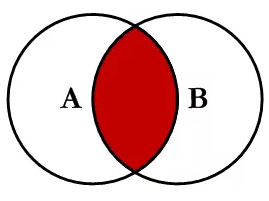

```sql
SELECT a.*,b.*
FROM table_a a
INNER JOIN table_b b
ON a.id=b.id
```

查询结果：
    id    serNum               id  serNum

------

```
 1  A000100       1  B000201  
 2  A000102       2  B000202  
 3  A000103       3  B000203  
```

#### 4.5.2 left join 左关联查询

以左表作为基础表去关联右表，查询的结果为左表的子集。

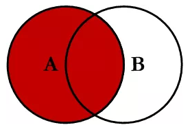

```sql
SELECT a.*,b.*
FROM table_a a
LEFT JOIN table_b b
ON a.id=b.id
```

查询结果：
id        serNum               id   serNum

------

```
 1  A000100       1  B000201  
 2  A000102       2  B000202  
 3  A000103       3  B000203  
 5  A000104      (NULL)  (NULL)   
 8  A000105      (NULL)  (NULL)   
 4  A000106      (NULL)  (NULL)  
```

#### 4.5.3 right join 右关联查询

以右表作为基础表去关联左表，查询的结果作为右表的子集。

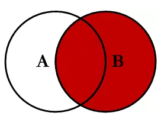

```sql
SELECT a.*,b.*
FROM table_a a
RIGHT JOIN table_b b
ON a.id=b.id
```

查询结果：
     id    serNum              id  serNum

------

```
 1  A000100       1  B000201  
 2  A000102       2  B000202  
 3  A000103       3  B000203  
(NULL) (NULL)     6 B000204
(NULL) (NULL)     7 B000205
(NULL) (NULL)     9 B000206
```

#### 4.5.4 左连接-内连接

取左表的部分集合，但又不存在右表中。

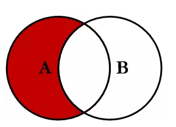

```sql
SELECT a.*,b.*
FROM table_a a
LEFT JOIN table_b b
ON a.id=b.id
WHERE b.id IS NULL
```

查询结果：
     id    serNum       id           serNum

------

```
 5  A000104  (NULL)  (NULL)  
 8  A000105  (NULL)  (NULL)  
 4  A000106  (NULL)  (NULL)
```

#### 4.5.5 右连接

取有表的部分数据，但又不存在左表中
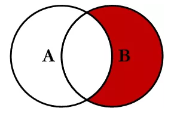


```sql
SELECT a.*,b.*
FROM table_a a
RIGHT JOIN table_b b
ON a.id=b.id
WHERE a.id IS NULL
```

查询结果：
     id    serNum       id       serNum

------

```
(NULL) (NULL) 6    B000204
(NULL) (NULL) 7    B000205
(NULL) (NULL) 9    B000206
```

### 4.6 子查询语句

- **条件：**一条SQL语句的查询结果作为另一条查询语句的条件或查询结果；
- **嵌套：**多条SQL语句嵌套使用，内部的SQL查询语句称为子查询；

**子查询的三种情况**

1. 子查询是单行单列的情况：结果集是一个值，父查询使用：=、 <、 > 等运算符

```sql
-- 查询工资最高的员工是谁？ 
select  * from employee where salary=(select max(salary) from employee);   

```

2. 子查询是多行多列的情况：结果集类似于一张虚拟表，不能用于where条件，用于select子句中做为子表

```sql
-- 1) 查询出2011年以后入职的员工信息
-- 2) 查询所有的部门信息，与上面的虚拟表中的信息比对，找出所有部门ID相等的员工。
select * from dept d,  (select * from employee where join_date > '2011-1-1') e where e.dept_id =  d.id;    

-- 使用表连接：
select d.*, e.* from  dept d inner join employee e on d.id = e.dept_id where e.join_date >  '2011-1-1'  

```

### 4.7 mysql中in和exists区别

MySQL中的in语言是把外表和内表做hash连接，而exists语句是对外表做loop循环，每次loop循环再对内表进行查询。一直大家都认为exists比in语句的效率要高，这种说法其实是不准确的，这个要区分环境的。

- **如果要查询的两个表大小相等，那么用in和exists差别不大；**
- **如果两个表中一个较小，一个是大表，那么子查询表大的用exists，子查询表小的用in；**
- not in 和not exists：如果查询语句使用了not in，那么内外表都进行全表扫描，没有用到索引；而not extsts的子查询依然能用到表上的索引。所以无论那个表大，用**not exists都比not in要快。**

### 4.8 varchar和char的区别(重点)

**char的特点：**

- **char表示定长字符串，长度是固定的；**
- 如果插入数据的长度小于char的固定长度时，则用空格填充；
- 因为长度固定，所以存取速度要比varchar快很多，甚至能快50%，但正因为其长度固定，所以会占据多余的空间，是空间换时间的做法；
- 对于char来说，最多能存放的字符个数为255，和编码无关；

**varchar的特点：**

- **varchar表示可变长的字符串，长度是可变的；**
- 插入的数据是多长，就按照多长存储；
- varchar在存取方面与char相反，它存取速度慢，因为长度不固定，但正因如此，不占据多余的空间，是时间换空间的做法；
- **对于varchar来说，最多能存放的字符个数为65532**

总之，结合性能角度(char更快)和节省磁盘空间角度(varchar更小)，具体情况还需具体来设计数据库才是妥当的做法。

### 4.9 mysql中int(10)和char(10)以及varchar(10)之间的区别

- **int(10)中的10表示显示的数据长度**，不是存储数据的大小；**char(10)和varchar(10)的10表示存储数据的大小**，即表示存储多少个字符、
- **char(10)表示存储定长的10个字符**，不足10个就用空格补齐，占用更多的存储空间
- **varchar(10)表示存储10个变长的字符**，存储多少个就是多少个，空格也按一个字符存储，这一点和char(10)的空格是不同的，char(10)的空格表示占位不算一个字符

- **int(10) 10位的数据长度 9999999999**，占32个字节，int型4位
  **char(10) 10位固定字符串**，不足补空格 最多10个字符
  **varchar(10) 10位可变字符串**，不足补空格 最多10个字符

### 4.10 FLOAT和DOUBLE的区别是什么？

- FLOAT类型数据可以存储至多8位十进制数，并在内存中占4字节；
- DOUBLE类型数据可以存储至多18位十进制数，并在内存中占8字节；

### 4.11 drop、delete与truncate的区别

三者都表示删除，但是三者有一些差别：

|          | Delete                                   | Truncate                       | Drop                                                 |
| -------- | ---------------------------------------- | ------------------------------ | ---------------------------------------------------- |
| 类型     | 属于DML                                  | 属于DDL                        | 属于DDL                                              |
| 回滚     | 可回滚                                   | 不可回滚                       | 不可回滚                                             |
| 删除内容 | 表结构还在，删除表的全部或者一部分数据行 | 表结构还在，删除表中的所有数据 | 从数据库中删除表，所有的数据行，索引和权限也会被删除 |
| 删除速度 | 删除速度慢，需要逐行删除                 | 删除速度快                     | 删除速度最快                                         |

因此，在不再需要一张表的时候，用drop；在想删除部分数据行时候，用delete；在保留表而删除所有数据的时候用truncate。

### 4.12 UNION与UNION ALL的区别？

- **如果使用UNION ALL，不会合并重复的记录行**
- **效率 UNION 高于 UNION ALL**

## 五、SQL优化

### 5.1 如何定义以及优化SQL语句的性能问题？创建的索引有没有被使用到？或者说怎么才可以知道这条语句运行很慢的原因？

**对于低性能的SQL语句的定位，最重要也是最有效的方法就是使用执行计划，Mysql提供了explain命令来查看语句的执行计划。**我们知道，不管是哪种数据库，或者是哪种数据库引擎，在对一条SQL语句进行执行的过程中都会做很多相关的优化。**对于查询语句，最重要的优化方式就是使用索引，而执行计划，就是显示数据库引擎对于SQL语句的执行的详细情况，其中包含了是否使用索引，使用什么索引，使用的索引的相关信息等。**

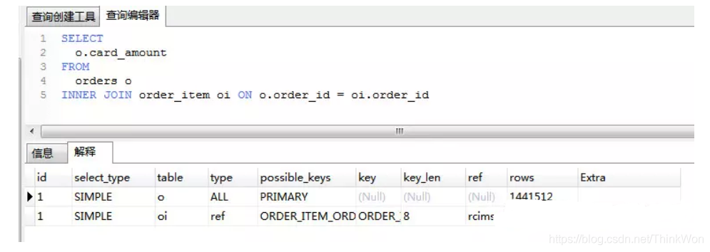

执行计划包含的信息 **id** 有一组数字组成。表示一个查询中各个子查询的执行顺序;

- id相同执行顺序由上至下。
- id不同，id值越大优先级越高，越先被执行。
- id为null时表示一个结果集，不需要使用它查询，常出现在包含union等查询语句中。

**select_type** 每个子查询的查询类型，一些常见的查询类型。

| id   | select_type  | description                               |
| ---- | ------------ | ----------------------------------------- |
| 1    | SIMPLE       | 不包含任何子查询或union等查询             |
| 2    | PRIMARY      | 包含子查询最外层查询就显示为 PRIMARY      |
| 3    | SUBQUERY     | 在select或 where字句中包含的查询          |
| 4    | DERIVED      | from字句中包含的查询                      |
| 5    | UNION        | 出现在union后的查询语句中                 |
| 6    | UNION RESULT | 从UNION中获取结果集，例如上文的第三个例子 |

**table** 查询的数据表，当从衍生表中查数据时会显示 x 表示对应的执行计划id **partitions** 表分区、表创建的时候可以指定通过那个列进行表分区。 举个例子：

```sql
create table tmp (
    id int unsigned not null AUTO_INCREMENT,
    name varchar(255),
    PRIMARY KEY (id)
) engine = innodb
partition by key (id) partitions 5;
```

**type**(非常重要，可以看到有没有走索引) 访问类型

- ALL 扫描全表数据
- index 遍历索引
- **range 索引范围查找**
- index_subquery 在子查询中使用 ref
- unique_subquery 在子查询中使用 eq_ref
- ref_or_null 对Null进行索引的优化的 ref
- fulltext 使用全文索引
- ref 使用非唯一索引查找数据
- eq_ref 在join查询中使用PRIMARY KEYorUNIQUE NOT NULL索引关联。

**possible_keys** 可能使用的索引，注意不一定会使用。查询涉及到的字段上若存在索引，则该索引将被列出来。当该列为 NULL时就要考虑当前的SQL是否需要优化了。

**key** 显示MySQL在查询中实际使用的索引，若没有使用索引，显示为NULL。

**TIPS**:查询中若使用了覆盖索引(覆盖索引：索引的数据覆盖了需要查询的所有数据)，则该索引仅出现在key列表中

**key_length** 索引长度

**ref** 表示上述表的连接匹配条件，即哪些列或常量被用于查找索引列上的值

**rows** 返回估算的结果集数目，并不是一个准确的值。

**extra** 的信息非常丰富，常见的有：

1. Using index 使用覆盖索引
2. Using where 使用了用where子句来过滤结果集
3. Using filesort 使用文件排序，使用非索引列进行排序时出现，非常消耗性能，尽量优化。
4. Using temporary 使用了临时表 sql优化的目标可以参考阿里开发手册

>【推荐】SQL性能优化的目标：至少要达到 range 级别，要求是ref级别，如果可以是consts最好。 
>说明： 
>1） consts 单表中最多只有一个匹配行（主键或者唯一索引），在优化阶段即可读取到数据。 
>2） ref 指的是使用普通的索引（normal index）。 
>3） range 对索引进行范围检索。 
>反例：explain表的结果，type=index，索引物理文件全扫描，速度非常慢，这个index级别比较range还低，与全表扫描是小巫见大巫。


### 5.2 SQL的生命周期

- 1.应用服务器与数据库服务器建立一个连接
- 2.数据库进程拿到请求sql
- 3.解析并生成执行计划，执行
- 4.读取数据到内存并进行逻辑处理
- 5.通过步骤一的连接，发送结果到客户端
- 6.关掉连接，释放资源

### 5.3 大表数据查询，怎么优化？

- **1.优化schema，sql语句+索引；**
- **2.加缓存，memcached redis；**
- **3.主从复制，读写分离；**
- **4.垂直拆分，根据模块的耦合度，将一个大的系统拆分成小的系统，即分布式系统；**
- **5.水平拆分，针对数据量大的表，这一步最麻烦，最能考验技术水平，要选择一个合理的sharding key，为了有更好的查询效率，表结构也要改动，做一定的冗余，sql中尽量待sharding key，将数据定位到限定的表上去查，而不是扫描全部的表。**

### 5.4大分页怎么处理？（缓存）

超大的分页一般从两个方向上来解决.

- **数据库层面,**这也是我们主要集中关注的(虽然收效没那么大),类似于`select * from table where age > 20 limit 1000000,10`这种查询其实也是有可以优化的余地的. 这条语句需要load1000000数据然后基本上全部丢弃,只取10条当然比较慢. 当时我们可以修改为`select * from table where id in (select id from table where age > 20 limit 1000000,10)`.这样虽然也load了一百万的数据,但是由于索引覆盖,要查询的所有字段都在索引中,所以速度会很快. 同时如果ID连续的好,我们还可以`select * from table where id > 1000000 limit 10`,效率也是不错的,优化的可能性有许多种,但是核心思想都一样,就是**减少load的数据.**
- 从**需求的**角度减少这种请求…主要是不做类似的需求(直接跳转到几百万页之后的具体某一页.只允许逐页查看或者按照给定的路线走,这样可预测,可缓存)以及防止ID泄漏且连续被人恶意攻击.

**解决超大分页,其实主要是靠缓存,可预测性的提前查到内容,缓存至redis等k-V数据库中,直接返回即可.**

在阿里巴巴《Java开发手册》中,对超大分页的解决办法是类似于上面提到的第一种.

> 【推荐】利用延迟关联或者子查询优化超多分页场景。 
>
> 说明：MySQL并不是跳过offset行，而是取offset+N行，然后返回放弃前offset行，返回N行，那当offset特别大的时候，效率就非常的低下，要么控制返回的总页数，要么对超过特定阈值的页数进行SQL改写。 
>
> 正例：**先快速定位需要获取的id段，然后再关联：** 
>
> SELECT a.* FROM 表1 a, (select id from 表1 where 条件 LIMIT 100000,20 ) b where a.id=b.id

### 5.5 Mysql 分页 limit

LIMIT子句可以被用于强制SELECT语句返回执行的记录数。LIMIT接受一个或两个数字参数。参数必须是一个整数常量。如果给定两个参数，第一个参数指定第一个返回记录行的偏移量，第二个参数执行返回记录行的最大数目。初始记录行的偏移量是0(而不是1)

```sql
mysql> SELECT * FROM table LIMIT 5,10; // 检索记录行 6-15 
```

为了检索从某一个偏移量到记录集的结束所有的记录行，可以指定第二个参数为 -1：

```sql
mysql> SELECT * FROM table LIMIT 95,-1; // 检索记录行 96-last. 
```

如果只给定一个参数，它表示返回最大的记录行数目：

```sql
mysql> SELECT * FROM table LIMIT 5; //检索前 5 个记录行 
```

换句话说，LIMIT n 等价于 LIMIT 0,n。

### 5.6 慢查询日志

> 用于记录执行时间超过某个临界值的SQL日志，用于快速定位慢查询，为我们的优化做参考。

开启慢查询日志

配置项：`slow_query_log`

可以使用`show variables like ‘slov_query_log’`查看是否开启，如果状态值为`OFF`，可以使用`set GLOBAL slow_query_log = on`来开启，它会在`datadir`下产生一个`xxx-slow.log`的文件。

设置临界时间

配置项：`long_query_time`

查看：`show VARIABLES like 'long_query_time'`，单位秒

设置：`set long_query_time=0.5`

实操时应该从长时间设置到短的时间，即将最慢的SQL优化掉

查看日志，一旦SQL超过了我们设置的临界时间就会被记录到`xxx-slow.log`中

### 5.7 关心过业务系统里面的sql耗时吗？统计过慢查询吗？对慢查询都怎么优化过？

慢查询的优化首先要搞明白慢的原因是什么？ 是查询条件没有命中索引？是load了不需要的数据列？还是数据量太大？

所以优化也是针对这三个方向来的，

- 首先分析语句，**看看是否load了额外的数据，可能是查询了多余的行并且抛弃掉了，可能是加载了许多结果中并不需要的列，对语句进行分析以及重写。**
- **分析语句的执行计划**，然后获得其使用**索引的情况**，之后**修改语句或者修改索引，使得语句可以尽可能的命中索引。**
- 如果对语句的优化已经无法进行，可以考虑表中的数据量是否太大，如果是的话可以进行横向或者纵向的分表，或者考虑缓存。

### 5.8 为什么要尽量设定一个主键？

**主键是数据库确保数据行在整张表唯一性的保障**，即使业务上本张表没有主键，也建议**添加一个自增长的ID列作为主键。设定了主键之后，在后续的删改查的时候可能更加快速以及确保操作数据范围安全。**

### 5.9 主键使用自增ID还UUID

推荐使用**自增ID**，不要使用UUID。

因为在InnoDB存储引擎中，主键索引是作为**聚簇索**引存在的，也就是说，主键索引的B+树叶子节点上存储了主键索引以及全部的数据(按照顺序)，如果**主键索引是自增ID，那么只需要不断向后排列即可**，如果是UUID，由于到来的ID与原来的大小不确定，会造成非常多的数据插入，数据移动，然后导致产生很多的内存碎片，进而造成插入性能的下降。

总之，在数据量大一些的情况下，用自增主键性能会好一些。

关于主键是聚簇索引，如果没有主键，InnoDB会选择一个唯一键来作为聚簇索引，如果没有唯一键，会生成一个隐式的主键。

### 5.10 字段为什么要求定义为not null？

**null值会占用更多的字节**，且会在程序中造成很多与预期不符的情况。

### 5.11 如果要存储用户的密码散列，应该使用什么字段进行存储？

**密码散列，盐，用户身份证号等固定长度的字符串应该使用char**而不是varchar来存储，这样可以**节省空间且提高检索效率**。

### 5.12 优化查询过程中的数据访问

访问数据太多导致查询性能下降：

- 确定应用程序是否在检索大量超过需要的数据，可能是太多行或列；
- 确定Mysql服务器是否在分析大量不必要的数据行；

查询不需要的数据：

- 使用limit解决

多表关联返回全部列：

- 指定列名

总是返回全部列：

- 避免使用select *

重复查询相同的数据：

- 缓存数据，下次直接读取缓存

是否在扫描额外的记录：

- 使用explain进行分析，如果发现查询需要扫描大量的数据，但只返回少数的行，可以通过以下技巧去优化：
  - 使用索引覆盖扫描，把所有的列放到索引中，这样存储引擎不需要回表获取对应行就可以返回结果；
  - 改变数据库和表的结构，修改数据表范式
  - 重写SQL语句，让优化器可以更优的方式执行查询。

### 5.13 优化

#### 5.13.1 优化长难的查询语句

使用一个复杂查询还是多个简单查询

- 使用尽可能小的查询是好的，有时将一个大的查询分解为多个小的查询是很有必要的；
- 切分查询，将一个大的查询划分为多个小的相同查询；
- 一次性删除1000万的数据要比删除1万，暂停一会的方案更加损耗服务器开销；
- 执行单个查询可以减少锁的竞争，查询效率会有大幅提升；

#### 5.13.2 优化关联查询

- 确定ON或者USING子句中是否有索引。
- 确保GROUP BY和ORDER BY只有一个表中的列，这样MySQL才有可能使用索引。

#### 5.13.3 优化子查询

- 用关联查询替代
- 优化GROUP BY和DISTINCT
- 这两种查询据可以使用索引来优化，是最有效的优化方法
- 关联查询中，使用标识列分组的效率更高
- 如果不需要ORDER BY，进行GROUP BY时加ORDER BY NULL，MySQL不会再进行文件排序。
- WITH ROLLUP超级聚合，可以挪到应用程序处理

#### 5.13.4 优化LIMIT分页

- LIMIT偏移量大的时候，查询效率较低
- 可以记录上次查询的最大ID，下次查询时直接根据该ID来查询

#### 5.13.5 优化UNION查询

- UNION ALL的效率高于UNION

#### 5.13.6 优化WHERE子句

对于此类考题，先说明如何定位低效SQL语句，然后根据SQL语句可能低效的原因做排查，先从索引着手，如果索引没有问题，考虑以上几个方面，数据访问的问题，长难查询句的问题还是一些特定类型优化的问题，逐一回答。

SQL语句优化的一些方法？

- 1.对查询进行优化，应尽量避免全表扫描，首先应考虑在 where 及 order by 涉及的列上建立索引。
- 2.应尽量避免在 **where 子句中对字段进行 null 值判断，否则将导致引擎放弃使用索引而进行全表扫描**，如：

```sql
select id from t where num is null
-- 可以在num上设置默认值0，确保表中num列没有null值，然后这样查询：
select id from t where num=
```

- 3.应尽量避免在 where 子句中使用!=或<>操作符，否则引擎将放弃使用索引而进行全表扫描。
- 4.**应尽量避免在 where 子句中使用or 来连接条件，否则将导致引擎放弃使用索引而进行全表扫描**，如：

```sql
select id from t where num=10 or num=20
-- 可以这样查询：
select id from t where num=10 union all select id from t where num=20
```

- 5.**in 和 not in 也要慎用，否则会导致全表扫描**，如：

```sql
select id from t where num in(1,2,3) 
-- 对于连续的数值，能用 between 就不要用 in 了：
select id from t where num between 1 and 3
```

- 6.下面的查询也将导致全表扫描：select id from t where name like ‘%李%’若要提高效率，可以考虑全文检索。
- 7.如果在 where 子句中使用参数，也会导致全表扫描。因为SQL只有在运行时才会解析局部变量，但优化程序不能将访问计划的选择推迟到运行时；它必须在编译时进行选择。然 而，如果在编译时建立访问计划，变量的值还是未知的，因而无法作为索引选择的输入项。如下面语句将进行全表扫描：

```sql
select id from t where num=@num
-- 可以改为强制查询使用索引：
select id from t with(index(索引名)) where num=@num
```

- 8.应尽量避免在 where 子句中对字段进行表达式操作，这将导致引擎放弃使用索引而进行全表扫描。如：

```sql
select id from t where num/2=100
-- 应改为:
select id from t where num=100*2
```

- 9.应尽量避免在where子句中对字段进行函数操作，这将导致引擎放弃使用索引而进行全表扫描。如：

```sql
select id from t where substring(name,1,3)=’abc’
-- name以abc开头的id应改为:
select id from t where name like ‘abc%’
```

- 10.不要在 where 子句中的“=”左边进行函数、算术运算或其他表达式运算，否则系统将可能无法正确使用索引。


## 六、数据库事务以及隔离级别

### 6.1 什么是数据库事务？

**事务是一个不可分割的数据库操作序列，也是数据库并发控制的基本单位**，其执行的结果必须使数据库从一种一致性状态变到另一种一致性状态。**事务是逻辑上得到一组操作**，要么都执行，要么都不执行。

事务最经典也经常被拿出来说例子就是转账了。

假如小明要给小红转账1000元，这个转账会涉及到两个关键操作就是：将小明的余额减少1000元，将小红的余额增加1000元。万一在这两个操作之间突然出现错误比如银行系统崩溃，导致小明余额减少而小红的余额没有增加，这样就不对了。事务就是保证这两个关键操作要么都成功，要么都要失败。

### 6.2 事务的四大特性(ACID)是什么


- 原子性：**事务是最小的执行单位，不允许分割。事务的原子性确保动作要么都执行，要么都不执行；**
- 一致性：**执行事务前后，数据保持一致，多个事务对同一个数据读取的结果是相同的；**
- 隔离性：**并发访问数据库时，一个用户的事务不被其他事务所干扰，各并发事务之间数据库是独立的；**
- 持久性：**一个事务被提交之后，它对数据库中的数据的改变是持久的，即使数据库发生故障也不应该对其有任何影响**。

### 6.3 什么是脏读？幻读？不可重复读？

- **脏读(Dirty Read)：**某个事务已更新一份数据，另一个事务在此时读取了同一份数据，但由于某些原因，前一个进行了rollback操作，则后一个事务所读取的数据就会是不正确的；
- **不可重复读(Non-repeatable read):**在一个事务的两次查询之中数据不一致，这可能是两次查询过程中间插入了一个事务之前事务对更新的原有的数据；同一行数据
- **幻读(Phantom Read)：**在一个事务的两次查询中数据量不一致，例如有一个事务查询了几列数据，而另一个事务却在此时插入了新的几列数据，先前的事务在接下来的查询中，就会发现有几列数据是它先前所没有的。插入了新行

### 6.4 什么是事务的隔离级别？Mysql的默认隔离级别是什么？

为了达到事务的四大特性，数据库定义了4种不同的事务隔离级别，由低到高依次为Read uncommitted、Read committed、Repeatable read、Serializable，这四个级别可以逐个解决脏读、不可重复读、幻读这几类问题。

| 隔离级别         | 脏读 | 不可重复读 | 幻影读 |
| ---------------- | ---- | ---------- | ------ |
| READ-UNCOMMITTED | √    | √          | √      |
| READ-COMMITTED   | ×    | √          | √      |
| REPEATABLE-READ  | ×    | ×          | √      |
| SERIALIZABLE     | ×    | ×          | ×      |

**SQL标准定义了四个隔离级别：**

- **READ-UNCOMMITED(读取未提交)：**最低的隔离级别，允许读取尚未提交的数据变更，可能会导致脏读、幻读、或不可重复读；
- **READ-COMMITED(读取已提交)：**允许读取并发事务已经提交的数据，可以阻止脏读，但是幻读或不可重复读仍有可能发生。
- **REPEATABLE-READ(可重复读)：**对同一字段的多次读取结果都是一致的，除非数据是被事务本身自己所修改，可以阻止脏读和不可重复读的发生，但幻读仍有可能发生。
- **SERIABLIZABLE(可串行化)：**最高的隔离级别，完全服务ACID的隔离级别。所有的事务依次逐个执行，这样事务之间就完全不可能产生干扰，也就是说，该级别可以阻止脏读、不可重复读以及幻读。

> 不可重复读和幻读的区别是什么？
>
> 不可重复读主要是说多次读取一条记录，发现该记录中某些列值被修改过；同样的条件，读取过的数据，再次读取出来发现值不一样了。
>
> 幻读主要是说多次读取一个范围内的记录(包括直接查询所有记录结果做聚合统计)，发现结果不一致。同样的条件，第1次和第2次读出来记录数不一样。

注意：Mysql默认使用的是REPEATABLE-READ隔离级别, Oracle默认使用READ_COMMITED隔离级别。


事务隔离机制的实现是基于锁机制和并发调度。其中**并发调度使用是MVCC(多版本并发控制)**，通过保存修改的旧版本信息来支持并发一致性读和回滚等特性。

因为隔离级别越低，事务请求的锁越少，所以大部分数据库系统的隔离级别都是**READ-COMMITTED(读取提交内容):**，但是你要知道的是InnoDB 存储引擎默认使用 **REPEATABLE-READ（可重读）**并不会有任何性能损失。

InnoDB 存储引擎在 **分布式事务** 的情况下一般会用到**SERIALIZABLE(可串行化)**隔离级别。


## 七、索引

> 为什么需要索引？什么样的信息可以作为索引？索引的数据结构？

索引的数据结构：**二叉查找树、平衡二叉树AVL、红黑树、B-Tree、B+ Tree。**

### 7.1 什么是索引？

索引是一种特殊的文件(InnoDB数据表上的索引是表空间的一个组成部分)，它们包含了对数据表里所有记录的引用指针；

**索引是一种数据结构。**数据库索引，是数据库管理系统中一个排序的数据结构，以协助快速查询、更新数据库表中数据。**索引的实现通常使用B树或变种B+树。**

更通俗来说，**索引就相当于目录，为了方便查找书中的内容，通过对内容建立索引形成目录。**索引是一个文件，是占据物理空间的。

### 7.2 索引的优缺点

索引的优点：

- **可以大大加快数的检索速度**，这也是创建索引的最主要的原因；
- 通过使用索引，可以在查询的过程中，使用优化隐藏器，提高系统的性能；

索引的缺点：

- **时间方面：创建索引和维护索引要耗费时间。**具体来将，当对表中的数据进行增加、删除和修改的时候，索引也要动态的维护，会降低增删改的执行效率。
- 空间方面：索引需要占据物理空间

### 7.3 索引使用场景(重点)

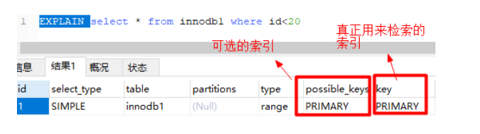

上图中，根据`id`查询记录，因为`id`字段仅建立了主键索引，因此此SQL执行可选的索引只有主键索引，如果有多个，最终会选一个较优的作为检索的依据。

```sql
-- 增加一个没有建立索引的字段
alter table innodb1 add sex char(1);
-- 按sex检索时可选的索引为null
EXPLAIN SELECT * from innodb1 where sex='男';

```

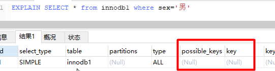

> 可以尝试在一个字段未建立索引时，根据该字段查询的效率，然后对该字段建立索引（`alter table 表名 add index(字段名)`），同样的SQL执行的效率，你会发现查询效率会有明显的提升（数据量越大越明显）。

**order by**

当我们使用`order by`将查询结果按照某个字段排序时，如果该字段没有建立索引，那么执行计划会将查询出的所有数据使用外部排序（将数据从硬盘分批读取到内存使用内部排序，最后合并排序结果），这个操作是很影响性能的，因为需要将查询涉及到的所有数据从磁盘中读到内存（如果单条数据过大或者数据量过多都会降低效率），更无论读到内存之后的排序了。

但是如果我们对该字段建立索引`alter table 表名 add index(字段名)`，那么由于索引本身是有序的，因此直接按照索引的顺序和映射关系逐条取出数据即可。而且如果分页的，那么只用**取出索引表某个范围内的索引对应的数据**，而不用像上述那**取出所有数据**进行排序再返回某个范围内的数据。（从磁盘取数据是最影响性能的）


**join**

> 对`join`语句匹配关系（`on`）涉及的字段建立索引能够提高效率

索引覆盖

如果要查询的字段都建立过索引，那么引擎会直接在索引表中查询而不会访问原始数据（否则只要有一个字段没有建立索引就会做全表扫描），这叫索引覆盖。因此我们需要尽可能的在`select`后只写必要的查询字段，以增加索引覆盖的几率。

这里值得注意的是不要想着为每个字段建立索引，因为优先使用索引的优势就在于其体积小。

### 7.4 索引有哪几种类型？

**主键索引:** 数据列不允许重复，不允许为NULL，**一个表只能有一个主键**。

**唯一索引:** 数据列不允许重复，允许为NULL值，**一个表允许多个列创建唯一索引。**

- 可以通过 `ALTER TABLE table_name ADD UNIQUE (column);` 创建唯一索引
- 可以通过 `ALTER TABLE table_name ADD UNIQUE (column1,column2);` 创建唯一组合索引

**普通索引:** 基本的索引类型，没有唯一性的限制，**允许为NULL值**。

- 可以通过`ALTER TABLE table_name ADD INDEX index_name (column);`创建普通索引
- 可以通过`ALTER TABLE table_name ADD INDEX index_name(column1, column2, column3);`创建组合索引

**全文索引：** 是**目前搜索引擎使用的一种关键技术。**

- 可以通过`ALTER TABLE table_name ADD FULLTEXT (column);`创建全文索引

### 7.5 索引的数据结构(B树，Hash)

索引的数据结构和具体存储引擎的实现有关，在MySQL中使用较多的索引有**Hash索引**，**B+树索引**等，而我们经常使用的**InnoDB存储引擎的默认索引实现为：B+树索引**。对于哈希索引来说，底层的数据结构就是哈希表，因此在绝大多数需求为单条记录查询的时候，可以选择哈希索引，查询性能最快；其余大部分场景，建议选择BTree索引。

**(1)B树索引**

mysql通过存储引擎取数据，基本上90%的人用的就是InnoDB了，按照实现方式分，InnoDB的索引类型目前只有两种：**BTREE（B树）索引**和**HASH索引**。B树索引是Mysql数据库中使用最频繁的索引类型，基本所有存储引擎都支持BTree索引。通常我们说的索引不出意外指的就是（B树）索引（实际是用B+树实现的，因为在查看表索引时，mysql一律打印BTREE，所以简称为B树索引）


**查询方式：**

主键索引区:PI(关联保存的时数据的地址)按主键查询,

普通索引区:si(关联的id的地址,然后再到达上面的地址)。所以按主键查询,速度最快

**B+tree性质：**

- a. n棵子tree的节点包含n个关键字，不用来保存数据而是保存数据的索引。
- b. 所有的叶子结点中包含了全部关键字的信息，及指向含这些关键字记录的指针，且叶子结点本身依关键字的大小自小而大顺序链接。
- c. 所有的非终端结点可以看成是索引部分，结点中仅含其子树中的最大（或最小）关键字。
- d. B+ 树中，数据对象的插入和删除仅在叶节点上进行。
- e. B+树有2个头指针，一个是树的根节点，一个是最小关键码的叶节点。


**(2) 哈希索引**

简要说下，类似于数据结构中简单实现的HASH表（散列表）一样，当我们在mysql中用哈希索引时，主要就是通过Hash算法（常见的Hash算法有直接定址法、平方取中法、折叠法、除数取余法、随机数法），将数据库字段数据转换成定长的Hash值，与这条数据的行指针一并存入Hash表的对应位置；如果发生Hash碰撞（两个不同关键字的Hash值相同），则在对应Hash键下以链表形式存储。当然这只是简略模拟图。

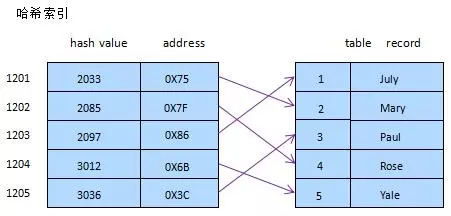

### 7.6 索引的基本原理

索引用来快速地寻找那些具有特定值的记录。如果没有索引，一般来说执行查询时遍历整张表。

**索引的原理很简单，就是把无序的数据变成有序的查询。**

- **把创建了索引的列的内容进行排序；**
- **对排序结果生成倒排表；**
- **在倒排表内容上拼上数据地址链**；
- **在查询的时候，先拿到倒排表内容，再取出数据地址链，从而拿到具体数据。**

### 7.7 索引的算法有哪些？

索引算法有**BTree算法**和**Hash算法**。

**BTree算法**

BTree是最常用的mysql数据库索引算法，也是mysql默认的算法。因为它不仅可以被用在=,>,>=,<,<=和between这些比较操作符上，而且还可以用于like操作符，只要它的查询条件是一个不以通配符开头的常量， 例如：

```sql
-- 只要它的查询条件是一个不以通配符开头的常量
select * from user where name like 'jack%'; 
-- 如果一通配符开头，或者没有使用常量，则不会使用索引，例如： 
select * from user where name like '%jack'; 
```

**Hash算法**

Hash Hash索引只能用于对等比较，例如=,<=>（相当于=）操作符。由于是一次定位数据，不像BTree索引需要从根节点到枝节点，最后才能访问到页节点这样多次IO访问，所以检索效率远高于BTree索引。

### 7.8 索引设计的原则？

- 适合索引的列是出现在where子句中的列，或者连接子句中指定的列；
- 基数较小的类，索引效果较差，没有必要在此列建立索引；
- 使用短索引，如果对长字符串列进行索引，应该指定一个前缀长度，这样能够节省大量索引空间；
- 不过过度索引。索引需要额外的磁盘空间，并会降低写操作的性能。在修改表内容的时候，索引会进行更新甚至重构，索引列越多，这个时间就会越长。所以只保持需要的索引有利于查询即可。

### 7.9 创建索引的方式

**第一种方式：在执行CREATE TABLE时创建索引**

```sql
CREATE TABLE user_index2 (
	id INT auto_increment PRIMARY KEY,
	first_name VARCHAR (16),
	last_name VARCHAR (16),
	id_card VARCHAR (18),
	information text,
	KEY name (first_name, last_name),
	FULLTEXT KEY (information),
	UNIQUE KEY (id_card)
);
```

**第二种方式：使用ALTER TABLE命令去增加索引**

```sql
ALTER TABLE table_name ADD INDEX index_name (column_list);
```

ALTER TABLE用来创建普通索引、UNIQUE索引或PRIMARY KEY索引。

其中table_name是要增加索引的表名，column_list指出对哪些列进行索引，多列时各列之间用逗号分隔。

索引名index_name可自己命名，缺省时，MySQL将根据第一个索引列赋一个名称。另外，ALTER TABLE允许在单个语句中更改多个表，因此可以在同时创建多个索引。

第三种方式：使用CREATE INDEX命令创建

```sql
CREATE INDEX index_name ON table_name (column_list);
```

CREATE INDEX可对表增加普通索引或UNIQUE索引。（但是，不能创建PRIMARY KEY索引）

删除索引

根据索引名删除普通索引、唯一索引、全文索引：`alter table 表名 drop KEY 索引名`

```sql
alter table user_index drop KEY name;
alter table user_index drop KEY id_card;
alter table user_index drop KEY information;
```

删除主键索引：`alter table 表名 drop primary key`（因为主键只有一个）。这里值得注意的是，如果主键自增长，那么不能直接执行此操作（自增长依赖于主键索引）：

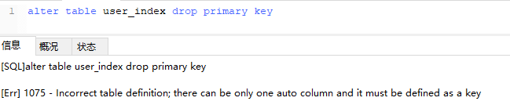

需要取消自增长再行删除：

```sql
alter table user_index
-- 重新定义字段
MODIFY id int,
drop PRIMARY KEY
```

但通常不会删除主键，因为设计主键一定与业务逻辑无关。

**创建索引时需要注意什么？**

- **非空字段**：应该指定列为NOT NULL,除非你想存储NULL。在mysql中，含有控制的列很难进行查询优化，因为它们使得索引、索引的统计信息以及比较运算更加发复杂。应该用0、一个特殊的值或者一个空串代替空值；
- **取值离散大的字段：**（变量各个取值之间的差异程度）的列放到联合索引的前面，可以通过count()函数查看字段的差异值，返回值越大说明字段的谓一致越多，字段的离散程度高；
- **索引字段越小越好：**数据库的数据存储以页为单位存储，一页存储的数据越多，一次IO操作获取的数据越多，效率越高。

### 7.10 使用索引查询一定能提高查询的性能吗？为什么？

通常，**通过索引查询数据比全表扫描要快。但是我们也要注意到它的代价。**

- **索引需要空间来存储，也需要定期维护**。每当有记录在表中增减或索引列被修改时，索引本身也会被修改。这意味着没调记录的INSET,DELETE,UPDATE将为此多付出4,5次的磁盘I/O操作。此外因为索引需要额外的存储空间和处理，那些不必要的索引反而会使查询反应时间变慢。使用索引查询不一定能提高查询性能，索引范围查询(INDEX RANGE SCAN)适用于两种情况：
  - 基于一个范围的检索，一般查询返回结果集小于表中记录数的30%；
  - 基于非唯一性索引的检索；

### 7.11 百万级别或以上的数据如何删除？

关于索引：由于索引需要额外的维护成本，因为索引文件是单独存在的文件,所以当我们对数据的增加,修改,删除,都会产生额外的对索引文件的操作,这些操作需要消耗额外的IO,会降低增/改/删的执行效率。所以，在我们删除数据库百万级别数据的时候，查询MySQL官方手册得知删除数据的速度和创建的索引数量是成正比的。

- **要删除百万数据时可以先删除索引**(此时耗时大概3分钟)；
- **之后删除其中无用数据**(此过程不到2分钟)
- **删除完成后重新创建索引**(此时数据较小)，创建索引非常快；
- **相比较之前的直接删除绝对是要快速很多，更别说万一删除中断，一切删除会回滚。**

### 7.12 前缀索引

语法：`index(field(10))`，**使用字段值的前10个字符建立索引**，默认是使用字段的全部内容建立索引。

前提：前缀的标识度高。比如密码就适合建立前缀索引，因为密码几乎各不相同。

实操的难度：在于前缀截取的长度。

我们可以利用`select count(*)/count(distinct left(password,prefixLen));`，通过从调整`prefixLen`的值（从1自增）查看不同前缀长度的一个平均匹配度，接近1时就可以了（表示一个密码的前`prefixLen`个字符几乎能确定唯一一条记录）

### 7.13 什么是最前缀原则？什么是最左匹配原则

**在mysql建立联合索引时会遵循最左前缀匹配的原则，即最左优先，在检索数据时从联合索引的最左边开始匹配**，示例：
对列col1、列col2和列col3建一个联合索引

```sql
KEY index_col1_col2_col3 on test(col1,col2,col3);
```

联合索引 index_col1_col2_col3 实际建立了(col1)、(col1,col2)、(col,col2,col3)三个索引。

```sql
SELECT * FROM table WHERE col1="1" AND clo2="2" AND clo4="4"
```

上面这个查询语句执行时会依照最左前缀匹配原则，检索时会使用索引(col1,col2)进行数据匹配。索引的字段可以是任意顺序的。

> 例子：索引的最左前缀原理：
>
> 通常我们在建立联合索引的时候，也就是对多个字段建立索引，相信建立过索引的同学们会发现，无论是oralce还是mysql都会让我们选择索引的顺序，比如我们想在a,b,c三个字段上建立一个联合索引，我们可以选择自己想要的优先级，a、b、c,或者是b、a、c 或者是c、a、b等顺序。为什么数据库会让我们选择字段的顺序呢？不都是三个字段的联合索引么？这里就引出了数据库索引的最左前缀原理。
>
> 比如：索引index1:(a,b,c)有三个字段，我们在使用sql语句来查询的时候，会发现很多情况下不按照我们想象的来走索引。
>
> select * from table where c = '1'     这个sql语句是不会走index1索引的，select * from table where b =‘1’ and c ='2' 这个语句也不会走index1索引。
>
> 什么语句会走index1索引呢？
>
> 答案是：
>
> select * from table where a = '1' 
>
> select * from table where a = '1' and b = ‘2’ 
>
> select * from table where a = '1' and b = ‘2’ and c='3'
>
> 我们可以发现一个共同点，就是所有走索引index1的sql语句的查询条件里面都带有a字段，那么问题来了，index1的索引的最左边的列字段是a，是不是查询条件中包含a就会走索引呢？

### 7.14 B树和B+树的区别是什么？

- **在B树中，你可以将键和值存放在内部节点和叶子节点**；**但在B+树中，内部节点都是键，没有值，叶子节点同时存放键和值**。
- **B+树的叶子节点有一条链相连**，**而B树的叶子节点各自独立**。

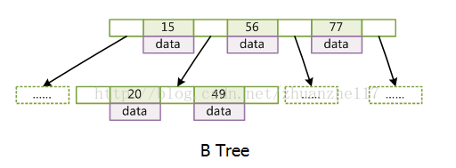

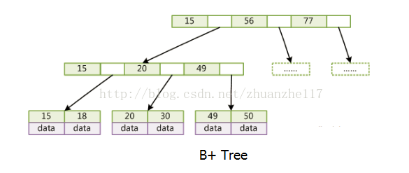

**使用B树的好处是什么？**

**B树可以在内部结点同时存储键和值，因此，把频繁访问的数据放在靠近根节点的地方将会大大提高热点数据的查询效率**。这种特性使得b树在特定数据重复多次查询的场景中更加有效。

**使用B+树的好处是什么？**

**由于B+树的内部结点只存放键，不存放值。因此一次读取，可以在内存页中获取更多的键，有利于更快地缩小查找范围**。B+数的叶节点由一条链相连。**因此，当需要进行一次全数据遍历的时候，B+树只需要使用O(logN)的时间找到最小的一个结点，之后通过链进行O(N)的顺序遍历即可**。

**相比较B树则需要对树的每一层进行遍历，这会需要更多的内存置换次数**，因此花费时间更多。

### 7.15 Hash索引和B+树索引区别？

**Hash索引底层实现是Hash表，进行查找时，调用一次hash函数就可以获取到相应的键值对**，之后进行回表查询获得实际数据。

**B+树底层实现是多路平衡查找树，对于每一次的查询都是从根节点出发，查找到叶子结点方可获取所有键值，之后根据查询判断是否需要回表查询数据。**

>  因为在hash索引中经过hash函数建立索引之后，索引的顺序与原顺序无法保持一致，**不能支持范围查询**。而B+树的的所有节点皆遵循(左节点小于父节点，右节点大于父节点，多叉树也类似)，天然支持范围。

 因此，在大多数情况下，直接选择B+树索引可以获得稳定且较好的查询速度。而不需要使用hash索引。

### 7.16 数据库为什么使用B+树而不是B树

- B树只适合随机检索，而B+树同时支持随机检索和顺序检索；
- **B+树空间利用率更高，可减少I/O次数，磁盘读写代价更低**。一般来说，索引本身也很大，不可能全部存储在内存中，因此索引往往以索引文件的形式存储的磁盘上。这样的话，索引查找过程中就要产生磁盘I/O消耗。B+树的内部结点并没有指向关键字具体信息的指针，只是作为索引使用，其内部结点比B树小，盘块能容纳的结点中关键字数量更多，一次性读入内存中可以查找的关键字也就越多，相对的，IO读写次数也就降低了。而IO读写次数是影响索引检索效率的最大因素；
- **B+树的查询效率更加稳定**。B树搜索有可能会在非叶子结点结束，越靠近根节点的记录查找时间越短，只要找到关键字即可确定记录的存在，其性能等价于在关键字全集内做一次二分查找。而在B+树中，顺序检索比较明显，随机检索时，任何关键字的查找都必须走一条从根节点到叶节点的路，所有关键字的查找路径长度相同，导致每一个关键字的查询效率相当。
- B-树在提高了磁盘IO性能的同时并没有解决元素遍历的效率低下的问题。B+树的叶子节点使用指针顺序连接在一起，只要遍历叶子节点就可以实现整棵树的遍历。而且在数据库中基于范围的查询是非常频繁的，而B树不支持这样的操作。
- 增删文件（节点）时，效率更高。因为B+树的叶子节点包含所有关键字，并以有序的链表结构存储，这样可很好提高增删效率。

> B树可以在内部节点或叶子节点存储键值信息；B+树只在叶子节点存储键值信息；B+树的查询效率就很稳定，且因为内部结点只存储键的信息，一次性读入内存中可以查找的关键字就越多，IO读写次数降低，效率较高；
>
> B树的叶子节点相互独立，B+树的叶子节点有一条链路相连。

### 7.17 什么是聚簇索引、非聚簇索引？

- **聚簇索引：将数据存储与索引放到了一起，找到索引也就找到了数据；**
- **非聚簇索引：将数据存储与索引分开，索引结构的叶子结点指向了数据的对应行**，myisam通过key_buffer把索引先缓存到内存中，当需要访问数据时（通过索引访问数据），在内存中直接搜索索引，然后通过索引找到磁盘相应数据，这也就是为什么索引不在key buffer命中时，速度慢的原因

### 7.18 B+树在满足聚簇索引和覆盖索引的时候不需要回表查询数据

**在B+树的索引中，叶子节点可能存储了当前的key值，也可能存储了当前的key值以及整行的数据，这就是聚簇索引和非聚簇索引**。 在InnoDB中，只有主键索引是聚簇索引，如果没有主键，则挑选一个唯一键建立聚簇索引。如果没有唯一键，则隐式的生成一个键来建立聚簇索引。

**当查询使用聚簇索引时，在对应的叶子节点，可以获取到整行数据，因此不用再次进行回表查询。**

### 7.19 非聚簇索引一定会回表查询吗？

不一定，**这涉及到查询语句所要求的字段是否全部命中了索引，如果全部命中了索引，那么就不必再进行回表查询**。

举个简单的例子，假设我们在员工表的年龄上建立了索引，那么当进行`select age from employee where age < 20`的查询时，在索引的叶子节点上，已经包含了age信息，不会再次进行回表查询。

> 非聚簇索引的value包含了整行数据，如果命中了，不需要回表查询；
>
> 举措索引如果查询的字段 全部命中了索引，也不需要回表查询；

### 7.20 联合索引是什么？为什么需要注意联合索引中的顺序？

MySQL可以使用多个字段同时建立一个索引**，叫做联合索引**。在联合索引中，如果想要命中索引，需要按照建立索引时的字段顺序挨个使用，否则无法命中索引。

具体原因为:

MySQL使用索引时需要索引有序，假设现在建立了"name，age，school"的联合索引，那么索引的排序为: 先按照name排序，如果name相同，则按照age排序，如果age的值也相等，则按照school进行排序。

当进行查询时，此时索引仅仅按照name严格有序，因此必须首先使用name字段进行等值查询，之后对于匹配到的列而言，其按照age字段严格有序，此时可以使用age字段用做索引查找，以此类推。因此在建立联合索引的时候应该注意索引列的顺序，一般情况下，将查询需求频繁或者字段选择性高的列放在前面。此外可以根据特例的查询或者表结构进行单独的调整。


## 八、锁

### 8.1 对Mysql锁了解？

**当数据库有并发事务的时候，可能会产生数据的不一致，这时候需要一些机制来保证访问的次序**，锁机制就是这样的一个机制。

### 8.2 隔离级别与锁的关系

在Read Uncommitted级别下，**读取数据不需要加共享锁**，这样就不会跟被修改的数据上的排他锁冲突

在Read Committed级别下，**读操作需要加共享锁**，**但是在语句执行完以后释放共享锁；**

在Repeatable Read级别下，**读操作需要加共享锁，但是在事务提交之前并不释放共享锁，也就是必须等待事务执行完毕以后才释放共享锁。**

SERIALIZABLE 是限制性最强的隔离级别，因为该级别**锁定整个范围的键**，并一直持有锁，直到事务完成。

> 四个隔离级别
>
> 读未提交；不加共享锁；
>
> 读已提交；加共享锁，执行完语句立即释放；
>
> 可重复读；加共享锁，事务执行完毕再释放；
>
> 串行化；锁定整个范围的键，一直持有，直到事务完成；

### 8.3 按照锁的粒度划分数据库锁有哪些？

在关系型数据库中，可以**按照锁的粒度把数据库锁分**为行级锁(INNODB引擎)、表级锁(MYISAM引擎)和页级锁(BDB引擎 )。

**MyISAM和InnoDB存储引擎使用的锁：**

- MyISAM采用**表级锁(table-level locking)**。
- InnoDB支持**行级锁(row-level locking)和表级锁，默认为行级锁**


**行级锁，表级锁和页级锁对比**

**行级锁** 行级锁是Mysql中锁定粒度最细的一种锁，表示**只针对当前操作的行进行加锁**。行级锁能大大减少数据库操作的冲突。其加锁粒度最小，但加锁的开销也最大。行级锁分为**共享锁** 和 **排他锁。**

特点：开销大，加锁慢；会出现死锁；锁定粒度最小，发生锁冲突的概率最低，并发度也最高。

**表级锁** 表级锁是M**ySQL中锁定粒度最大的一种锁，表示对当前操作的整张表加锁**，它实现简单，资源消耗较少，被大部分MySQL引擎支持。最常使用的MYISAM与INNODB都支持表级锁定。表级锁定分为**表共享读锁（共享锁）与表独占写锁（排他锁）。**

特点：开销小，加锁快；不会出现死锁；锁定粒度大，发出锁冲突的概率最高，并发度最低。

**页级锁** 页级锁是MySQL中锁定粒度介于行级锁和表级锁中间的一种锁。表级锁速度快，但冲突多，行级冲突少，但速度慢。所以取了折衷的页级，**一次锁定相邻的一组记录。**

特点：开销和加锁时间界于表锁和行锁之间；会出现死锁；锁定粒度界于表锁和行锁之间，并发度一般


**从锁的类别上来看Mysql上都有哪些锁？**

**从锁的类别上来讲**，有共享锁和排他锁。

共享锁: 又叫做读锁。 **当用户要进行数据的读取时，对数据加上共享锁**。共享锁可以同时加上多个。

排他锁: 又叫做写锁。 **当用户要进行数据的写入时，对数据加上排他锁。**排他锁只可以加一个，他和其他的排他锁，共享锁都相斥。

用上面的例子来说就是用户的行为有两种，一种是来看房，多个用户一起看房是可以接受的。 一种是真正的入住一晚，在这期间，无论是想入住的还是想看房的都不可以。

> 锁的总结：
>
> 锁有行级锁，表级锁和页级锁； 每一类再分为共享锁和排他锁；

### 8.4 Mysql中InnoDB引擎的行锁是怎么实现的？

答：**InnoDB是基于索引来完成行锁**

例: select * from tab_with_index where id = 1 for update;

for update 可以根据条件来完成行锁锁定，并且 id 是有索引键的列，**如果 id 不是索引键那么InnoDB将完成表锁**，并发将无从谈起

### 8.5 InnoDB存储引擎的锁的算法有哪三种？

- **Record lock：单个行记录上的锁**
- **Gap lock：间隙锁，锁定一个范围，不包括记录本身**
- **Next-key lock：record+gap 锁定一个范围，包含记录本身**

**相关知识点：**

1. innodb对于**行的查询使用next-key lock**
2. Next-locking keying为了解决Phantom Problem幻读问题
3. 当查询的索引含有唯一属性时，将next-key lock降级为record key
4. Gap锁设计的目的是为了阻止多个事务将记录插入到同一范围内，而这会导致幻读问题的产生
5. 有两种方式显式关闭gap锁：（除了外键约束和唯一性检查外，其余情况仅使用record lock） A. 将事务隔离级别设置为RC B. 将参数innodb_locks_unsafe_for_binlog设置为1

### 8.6 死锁是什么？怎么解决

死锁是指两个或多个事务在同一资源上相互占用，并请求锁定对方的资源，从而导致恶性循环的现象。

常见的解决死锁的方法

- 如果不同程序会并发存取多个表，尽量约定以相同的顺序访问表，可以大大降低死锁机会。 
- **在同一个事务中，尽可能做到一次锁定所需要的所有资源，减少死锁产生概率**；
- 对于非常容易产生死锁的业务部分，可以尝试使用升级锁定颗粒度，通过表级锁定来减少死锁产生的概率；

如果业务处理不好可以用**分布式事务锁或者使用乐观锁**

### 8.7 数据库的乐观锁和悲观锁是什么？怎么实现的？

数据库管理系统（DBMS）中的并发控制的任务是确保在多个事务同时存取数据库中同一数据时不破坏事务的隔离性和统一性以及数据库的统一性。**乐观并发控制（乐观锁）和悲观并发控制（悲观锁）是并发控制主要采用的技术手段。**

**悲观锁**：假定会发生并发冲突，屏蔽一切可能违反数据完整性的操作。在查询完数据的时候就把事务锁起来，直到提交事务。实现方式：使用数据库中的锁机制

**乐观锁**：假设不会发生并发冲突，只在提交操作时检查是否违反数据完整性。在修改数据的时候把事务锁起来，通过version的方式来进行锁定。实现方式：乐一般会使用版本号机制或CAS算法实现。

**两种锁的使用场景**

从上面对两种锁的介绍，我们知道两种锁各有优缺点，不可认为一种好于另一种，像**乐观锁适用于写比较少的情况下（多读场景）**，即冲突真的很少发生的时候，这样可以省去了锁的开销，加大了系统的整个吞吐量。

但如果是多写的情况，一般会经常产生冲突，这就会导致上层应用会不断的进行retry，这样反倒是降低了性能，所以**一般多写的场景下用悲观锁就比较合适。**

## 九、视图

###  9.1 为什么要使用视图？什么是视图？

为了提高复杂SQL语句的复用性和表操作的安全性，Mysql数据库管理系统提供了视图特性。

> 视图是虚拟表，本身不存储数据，而是按照指定的方式进行查询。

具体而言，视图相当于专人管理，每次皇上想要了解国库情况，就不必让高公公每次都跑一趟，而是指定的人员按照指定的任务完成指定的汇报工作就可以了。和数据库相对应，每次进行查询工作，都需要编写查询代码进行查询；而视图的作用就是不必每次都重新编写查询的SQL代码，而是通过视图直接查询即可。

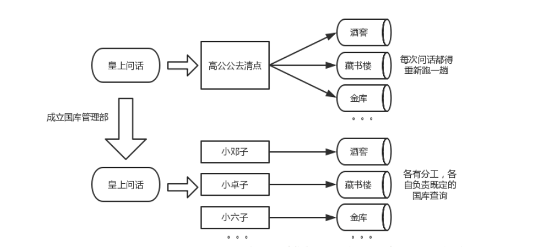

### 9.2 视图的特点

- 视图的列可以来自不同的表，是表的抽象和在逻辑意义上建立的新关系；
- 视图是由基本表(实表)产生的表(虚表)；
- 视图的建立和删除不影响基本表；
- 当视图来自多个基本表，不允许添加和删除数据；
- 对视图内容的更新(添加，删除和修改)直接影响基本表；

### 9.3 视图的使用场景有哪些？

视图根本用途：简化sql查询，提高开发效率。

视图的常见使用场景：

- 重用SQL语句；
- 简化复杂的SQL操作，在编写查询后，可以方便的重用它而不必知道它的基本查询细节；
- 使用表的组成部分而不是整个表；
- 保护数据。可以给用户授予表的特定部分的访问权限而不是整个表的访问权限。

### 9.4 什么是游标？

游标是系统为用户开设的一个数据缓冲区，存放SQL语句的执行结果，每个游标区都有一个名字。用户可以通过游标逐一获取记录并赋给主变量，交由主语言进一步处理。

## 十、存储过程、函数与触发器

### 10.1 什么是存储过程？有哪些优缺点？

存储过程是一个**预编译的SQL语句**，优点是允许模块化的设计，就是说只需要创建一次，以后在该程序中就可以调用多次。如果某次操作需要执行多次SQL，使用存储过程比单纯SQL语句执行要快。

**优点：**

- 存储过程是预编译过的，执行效率高；
- 存储过程的代码直接存放在数据库中，通过存储过程名直接调用，减少网路通讯；
- 安全性高，执行存储过程需要有一定权限的用户；
- 存储过程可以重复使用，减少数据库开发人员的工作量；

**缺点：**

- 调试麻烦；
- 移植问题；
- 重新编译问题；
- 如果在一个程序系统中大量的使用存储过程，到程序交付使用的时候随着用户需求的增加会导致数据结构的变化，接着就是系统的相关问题了，最后如果用户想维护该系统可以说是很难很难、而且代价是空前的，维护起来更麻烦。

### 10.2 什么是触发器？触发器的使用场景有哪些？

触发器是用户定义在关系表上的一类由事件驱动的特殊的存储过。**触发器是指一段代码，当触发某个事件时，自动执行这些代码。**

**使用场景：**

- 可以通过数据库中的相关表实现级联更改；
- 实时监控某张表中的某个字段的更改而需要做出相应的处理。例如生成某些业务的编号。

### 10.3 Mysql中都有哪些触发器？

**在Mysql数据库中有如下六种触发器：**

- **Before Insert；**
- **After Insert；**
- **Before Update；**
- **After Update；**
- **Before Delete；**
- **After Delete；**


## 十一、数据库优化

### 11.1 为什么要做数据库优化

- **系统的吞吐量瓶颈往往出现在数据库的访问速度上；**
- 随着应用程序的运行，数据库中的数据会越来越多，处理时间也会相应变慢；
- **数据是存放在磁盘上的，读写速度无法和内存相比, IO流读写方面的限制。**

### 11.2 Mysql数据库CPU飙升到500%该如何处理?

当 cpu 飙升到 500%时，先用操作系统命令 top 命令观察是不是 mysqld 占用导致的，如果不是，找出占用高的进程，并进行相关处理。

如果是 **mysqld** 造成的， **show processlist**，看看里面跑的 session 情况，是不是有消耗资源的 sql 在运行。找出消耗高的 sql，看看执行计划是否准确， index 是否缺失，或者实在是数据量太大造成。

一般来说，肯定要 kill 掉这些线程(同时观察 cpu 使用率是否下降)，等进行相应的调整(比如说加索引、改 sql、改内存参数)之后，再重新跑这些 SQL。

也有可能是每个 sql 消耗资源并不多，但是突然之间，有大量的 session 连进来导致 cpu 飙升，这种情况就需要跟应用一起来分析为何连接数会激增，再做出相应的调整，比如说限制连接数等

### 11.3 大表优化

当Mysql表单记录数过大时，数据库的CRUD性能会明显下降，一些常见的优化措施如下：

- **限定数据的范围：**务必禁止不带任何限制数据范围条件的查询语句。比如：当用户在查询订单历史的时候，我们可以控制在一个月的范围内；

- **读/写分离：**经典的数据库拆分方案，主库负责写，从库负责读；

- **缓存：**使用Mysql的缓存，另外对重量级、更新少的数据可以考虑使用应用级别的缓存；

- **分库分表**： 

  - 垂直分区：根据数据库里面数据表的相关性进行拆分。垂直拆分是指数据表列的拆分，把一张列比较多的表拆分为多张表。
  - 水平分区：保持数据表结构不变，通过某种策略存储数据分片。这样每一片数据分散到不同的表或库中，达到了分布式的目的。


> 缓存；
>
> 读写分离；
>
> 表的垂直拆分和水平拆分

### 11.4 Mysql的复制原理以及流程

主从复制：将主数据库中的**DDL和DML操作**通过**二进制日志(BINLOG)传输到从数据库中**，然后将这些日志重新执行(重做)；从而使得**从数据库的数据与主数据库保持一致**

**主从复制的作用：**

- **主数据库出现问题，可以切换到从数据库；**
- **数据库层面的读写分离；**
- **在数据库上进行日常备份；**

**Mysql主从复制解决的问题：**

- **数据分布：**随意开始或停止复制，并在不同地理位置分布数据备份；
- **负载均衡**：降低单个服务器的压力；
- 高可用和故障切换：帮助应用程序避免单点失败；
- 升级测试：可以用更高版本的Mysql作为从库

**MySQL主从复制工作原理**

- **在主库上把数据更高记录到二进制日志**
- **从库将主库的日志复制到自己的中继日志**
- **从库读取中继日志的事件，将其重放到从库数据中**

### 11.5 读写分离的解决方案？

写分离是依赖于主从复制，而主从复制又是为读写分离服务的。

因为主从复制要求`slave`不能写只能读（如果对`slave`执行写操作，那么`show slave status`将会呈现`Slave_SQL_Running=NO`，此时你需要按照前面提到的手动同步一下`slave`）。

**方案一**

使用mysql-proxy代理

优点：直接实现读写分离和负载均衡，不用修改代码，master和slave用一样的帐号，mysql官方不建议实际生产中使用

缺点：降低性能， 不支持事务

**方案二**

使用AbstractRoutingDataSource+aop+annotation在dao层决定数据源。
如果采用了mybatis， 可以将读写分离放在ORM层，比如mybatis可以通过mybatis plugin拦截sql语句，所有的insert/update/delete都访问master库，所有的select 都访问salve库，这样对于dao层都是透明。 plugin实现时可以通过注解或者分析语句是读写方法来选定主从库。不过这样依然有一个问题， 也就是不支持事务， 所以我们还需要重写一下DataSourceTransactionManager， 将read-only的事务扔进读库， 其余的有读有写的扔进写库。

**方案三**

使用AbstractRoutingDataSource+aop+annotation在service层决定数据源，可以支持事务.

缺点：类内部方法通过this.xx()方式相互调用时，aop不会进行拦截，需进行特殊处理。

### 11.6 数据表损坏的修复方式有哪些？

使用 myisamchk 来修复，具体步骤：

- 1）修复前将mysql服务停止。
- 2）打开命令行方式，然后进入到mysql的/bin目录。
- 3）执行myisamchk –recover 数据库所在路径/*.MYI

使用repair table 或者 OPTIMIZE table命令来修复，REPAIR TABLE table_name 修复表 OPTIMIZE TABLE table_name 优化表 REPAIR TABLE 用于修复被破坏的表。 OPTIMIZE TABLE 用于回收闲置的数据库空间，当表上的数据行被删除时，所占据的磁盘空间并没有立即被回收，使用了OPTIMIZE TABLE命令后这些空间将被回收，并且对磁盘上的数据行进行重排（注意：是磁盘上，而非数据库）

## 十二、数据库常见面试题目

### 12.1 事务的四大特性

ACID特性。

- **原子性(Atomic)：**要么执行，要么不执行；
- **一致性(Consistency)：**事务前后，数据总额一致；
- **隔离性(Isolation)：**所有操作全部执行以前其它会话不能看到过程；
- **持久性(Durability)：**一旦事务提交，对数据的改变就是永久的。

### 12.2 数据库隔离级别

多个事务读取可能会遇到以下问题：

- **脏读：**事务B读取事务A还没有提交的数据；
- **不可重复读：**一行被检索两次，并且该行中的值在不同的读取之间不同时
- **幻读：**当在事务处理过程中执行两个相同的查询，但第二个查询返回的行集合与第一个查询不同时。

**SQL标准定义了四个隔离级别：**

- **READ-UNCOMMITED(读取未提交)：**最低的隔离级别，允许读取尚未提交的数据变更，可能会导致脏读、幻读、或不可重复读；（不加共享锁）
- **READ-COMMITED(读取已提交)：**允许读取并发事务已经提交的数据，可以阻止脏读，但是幻读或不可重复读仍有可能发生。（读取的加共享锁，执行完该语句则释放）
- **REPEATABLE-READ(可重复读)：**对同一字段的多次读取结果都是一致的，除非数据是被事务本身自己所修改，可以阻止脏读和不可重复读的发生，但幻读仍有可能发生。（读取加共享锁，事务结束释放锁）
- **SERIABLIZABLE(可串行化)：**最高的隔离级别，完全服务ACID的隔离级别。所有的事务依次逐个执行，这样事务之间就完全不可能产生干扰，也就是说，该级别可以阻止脏读、不可重复读以及幻读。（从事务的开始到结束，都加锁，完成则释放）

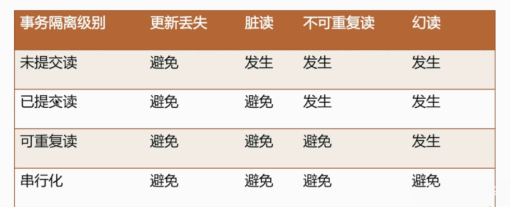

**InnoDB在可重复读隔离级别下是如何避免幻读的？**

- 表象：**快照读(非阻塞读) --伪MVCC；**
- 内在：**next-key锁(行锁+gap锁)；**

> innodb的默认事务隔离级别是rr（可重复读）。它的实现技术是mvcc。基于版本的控制协议。该技术不仅可以保证innodb的可重复读，而且可以防止幻读。但是它防止的是快照读，也就是读取的数据虽然是一致的，但是数据是历史数据。如何做到保证数据是一致的（也就是一个事务，其内部读取对应某一个数据的时候，数据都是一样的），同时读取的数据是最新的数据。innodb提供了一个间隙锁的技术。也就是结合grap锁与行锁，达到最终目的。**当使用索引进行插入的时候，innodb会将当前的节点和上一个节点加锁。这样当进行select的时候，就不允许加x锁。那么在进行该事务的时候，读取的就是最新的数据**
>
> **间隙锁(Gap Lock )**
>
> **Gap Lock的唯一目的就是阻止其他事务插入到间隙中。**Gap Lock可以同时存在，不同的事务可以同时获取相同的Gap Lock，并不会互相冲突。
>
> **next-key Lock**
>
> Record Lock+Gap Lock，如果一个事务在记录R上的某个索引有共享/互斥锁,也会对其前面一个范围加锁
>
> 根据索引会形成一个个左开右闭的一个区间，根据查询的条件其所在的区间，并且包括其后的区间。
>
> **间隙锁的目的是为了防止幻读，其主要通过两个方面实现这个目的：**
> （1）**防止间隙内有新数据被插入**
> （2）**防止已存在的数据，更新成间隙内的数据**


**为什么说InnoDB的可重复读避免了“幻读”是不准确的？**

首先看看什么是幻读
幻读。解决了不重复读，保证了同一个事务里，查询的结果都是事务开始时的状态（一致性）。但是，如果另一个事务同时提交了新数据，本事务再更新时，就会“惊奇的”发现了这些新数据，貌似之前读到的数据是“鬼影”一样的幻觉。

在mysql中，提供了两种事务隔离技术，**第一个是mvcc，第二个是next-key技术。**这个在使用不同的语句的时候可以动态选择。**不加lock inshare mode之类的快照读就使用mvcc。**否则 当前读使用next-key。**mvcc的优势是不加锁，并发性高**。缺点是不是实时数据。next-key的**优势是获取实时数据，但是需要加锁。**

因为默认的查询语句是**快照读**，而要避免幻读需要使用**当前读**。可以通过使用当前读来规避幻读问题。


> **当前读和快照读**
>
> - **快照读:**最简单的select操作,属于快照读,不加锁
>   select * from table where id = 1;
> - **当前读:**特殊的读与增删改操作,属于当前读,会读取数据库原本的数据,加锁
>   select * from table where xxx lock in share mode; (共享锁)
>   select * from table where xxx for update;
>   insert into table values()
>   update table set xxx where xxx
>   delete form table where xxx
>
> 以上语句，都属于**当前读，读取记录的最新版本。并且，读取之后，还需要保证其他并发事务不能修改当前记录，对读取记录加锁**。其中，除了第一条语句，对读取记录加S锁 (共享锁)外，其他的操作，都加的是X锁 (排它锁)。
>
> **实例：**
>
> 在数据库中存在user表并且有4条数据
>
> **1.select快照读(照片):**
>
> 当你执行select *之后，在A与B事务中都会返回4条一样的数据，这是不用想的，当执行select的时候，innodb默认会执行快照读，相当于就是给你目前的状态找了一张照片，以后执行select 的时候就会返回当前照片里面的数据，当其他事务提交了也对你不造成影响，和你没关系，这就实现了可重复读了，那这个照片是什么时候生成的呢？不是开启事务的时候，是当你第一次执行select的时候，也就是说，当A开启了事务，然后没有执行任何操作，这时候B insert了一条数据然后commit,这时候A执行 select，那么返回的数据中就会有B添加的那条数据……之后无论再有其他事务commit都没有关系，因为照片已经生成了，而且不会再生成了，以后都会参考这张照片。
>
> **update、insert、delete 当前读**
>
>   当你执行这几个操作的时候默认会执行当前读，也就是会读取最新的记录，也就是别的事务提交的数据你也可以看到，这样很好理解啊，假设你要update一个记录，另一个事务已经delete这条数据并且commit了，这样不是会产生冲突吗，所以你update的时候肯定要知道最新的信息啊。在这里介绍一下update的过程吧，首先会执行当前读，然后把返回的数据加锁，之后执行update。加锁是防止别的事务在这个时候对这条记录做什么，默认加的是排他锁，也就是你读都不可以，这样就可以保证数据不会出错了。但注意一点，就算你这里加了写锁，别的事务也还是能访问的，是不是很奇怪？数据库采取了一致性非锁定读，别的事务会去读取一个快照数据。
>   innodb默认隔离级别是RR， 是通过MVVC来实现了，读方式有两种，执行select的时候是快照读，其余是当前读，所以，mvvc不能根本上解决幻读的情况
>
> **MVCC**
>
> MySQL InnoDB存储引擎 ，实现的是基于多版本的并发控制协议——MVCC (Multi-Version Concurrency Control) (注：与MVCC相对的，是基于锁的并发控制，Lock-Based Concurrency Control)。MVCC最大的好处：读不加锁，读写不冲突。 在MVCC并发控制中，读操作可以分成两类：快照读 (snapshot read)与当前读 (current read)。快照读，读取的是记录的可见版本 (有可能是历史版本)，不用加锁。当前读，读取的是记录的最新版本，并且，当前读返回的记录，都会加上锁，保证其他事务不会再并发修改这条记录。


在mysql中，提供了两种事务隔离技术，第一个是mvcc，第二个是next-key技术。这个在使用不同的语句的时候可以动态选择。不加lock inshare mode之类的就使用mvcc。否则使用next-key。mvcc的优势是不加锁，并发性高。缺点是不是实时数据。next-key的优势是获取实时数据，但是需要加锁。同时需要注意几点：1.事务的快照时间点是以第一个select来确认的。所以即便事务先开始。但是select在后面的事务的update之类的语句后进行，那么它是可以获取后面的事务的对应的数据。2.mysql中数据的存放还是会通过版本记录一系列的历史数据，这样，可以根据版本查找数据。

### 12.2 数据库事务隔离模式 MVCC next-key (InnoDB可重复读隔离级别下如何避免幻读)

**四种隔离级别(由低到高)**

Read Uncommitted读未提交：**可以看到其它事务未提交的内容；**

Read Commited读已提交：**可以看到其它事务已提交的内容；**

Repeatable Read可重复读：**事务开始时和事务结束时读到的数据完全相同；**

Serializable串行：**事务必须逐步执行，后来的会排队。**

**隔离级别下的问题**

前提条件：同时开启A和B两个事务；

**脏读：**

事务查询id为1的数据，num字段为1
B事务将id为1的数据num更新为2，但未commit
事务查询id为1的数据，num字段变为2
B回滚，则A读到的数据为脏数据

**不可重复读：**

事务查询id为1的数据，num字段为1
B事务将id为1的数据num更新为2，commit
事务查询id为1的数据，num字段变为2
A事务前后两次读到的同一条记录num字段不同，不可重复读

**幻读：**

A事务查询id >=1 and id <=3的数据，得到id=1和id=3两条数据（注意：没有id=2的数据）
B事务插入id=2的数据
A事务再查询id >=1 and id <=3的数据，发现多了一条id=2的数据，即两次查询数据的行数不同

**各种隔离模式下会出现的问题**

读未提交：脏读、不可重复读、幻读；

读已提交：不可重复读、幻读；

可重复读：幻读；


**间隙锁(gap-key)**

**在一个事务中select for update查询某条记录，会锁定该条记录的前后空行**，什么叫空行呢，看个例子就知道了

id num
1 2
2 4
3 6
4 7
执行select * from table where num = 4 for update

insert into table ('', 3)和insert into table ('', 5)都会被阻塞，即4前后的空行都无法插入


**next-key**

**由于gay-key只能锁定记录之间的间隙，但是我们上面查询num=4的行也不能被更改，索引该行也会被加行锁，此时这种既能加行锁，又能加间隙锁的，称之为next-key**。


**MVCC**

事务A：查询num>=2 and num<=4的记录，但是不加for update！不加for update！不加for update！
事务B：insert into table ('', 3)，不会被阻塞，不会被阻塞，不会被阻塞！然后commit
事务A：查询num>=2 and num<=4的记录，和之前查询相同
事务A：提交
事务A：查询num>=2 and num<=4的记录，可以查询到num=3的记录，此时返回3条结果
原理：假如事务A在开启的时候版本号为2，当更改或者插入数据后，该条记录的版本号+1，也就是说事务B插入num=3的记录的版本号为3，**事务A在提交前的所有select都只能查询到版本号<=2的记录，也就是说不会产生上面说的幻读。**

**MVCC和next-key**

**其实，innodb采用next-key + MVCC去解决幻读问题的：**

**在查询加for update时，会用next-key解决幻读问题，新的insert和update会阻塞**
**在查询不加for update时，会用MVCC解决幻读问题，新的insert和update不会阻塞**


> 事务
>
> ACID；
>
> 隔离级别；
>
> 不同隔离级别下的问题；
>
> InnoDB如何避免幻读？
>
> 快照读：不加锁   mvcc的机制
>
> 当前读：加锁      next-key的机制


### 12.3 MYSQL的两种存储引擎区别(事务、锁级别等等)，各自的适用场景

**MyISAM与InnoDB关于锁方面的区别是什么？**

- **MyISAM默认用的是表级锁**，不支持行级锁；
- **InnoDB默认用的是行级锁**，也支持表级锁。

**MyISAM和InnoDB适合的场景有哪些？**

- MyISAM适合的场景
  - 频繁执行全表count语句；
  - **对数据进行增删改的频率不高，查询非常频繁**；
  - 没有事务；
- InnoDB适合的场景
  - **数据增删改查都相当频繁**；
  - **可靠性要求比较高，要求支持事务；**

**MyIsam和InnoDB引擎的区别：**

- **InooDB支持事务**，**MyISAM不支持事务；**
- **InnoDB支持外键**，**MyISAM不支持；**
- **InnoDB是聚集索引**，**MyISAM是非聚集索引；**
- InnoDB不保存表的具体行数，执行select count(*) from table时需要全表扫描，而MyISAM用一个变量保存了整个表的行数，执行上述语句只需读出该变量即可，速度很快。
- **InooDB最小的锁粒度是行锁**，**MyISAM最小的锁粒度是表锁**。一个更新语句会锁住整张表，导致其他查询和更新都会被阻塞，因此并发访问受限。

(事务、锁、索引三方面来)

**MyISAM索引和InnoDB索引实现：**

**(1) MyISAM索引实现：**

非聚集性索引

**a.主键索引**

MyISAM引擎使用B+树作为索引结果，叶子结点的data域存放的是数据记录的地址。下图为MyISAM表的主索引，Col1为主键。


**b.辅助索引**

在MyISAM中，主索引和辅助索引在结构上没有任何区别，只是主索引要求key是唯一的，而辅助索引的key可以重复。下图在Col2上建议一个辅助索引。


同样是一棵B+树，data域保存数据记录的地址。因此，**MYISAM中索引检索的算法为首先按照B+ Tree搜索算法搜索索引，如果指定的key存在，则取出其data域的值，然后 以data域的值为地址，读取相应数据记录。**

**(2) InnoDB**

聚集性索引

**a.主键索引**

同样是B+树，实现方式却完全不同。InnoDB表数据文件本身就是一个索引结构，树的叶节点data域保存了完整的数据记录，这种索引叫做**聚集索引**。


 因为InnoDB的数据文件本身要按主键聚集，所以InnoDB要求表必须有主键(MyISAM可以没有)，如果没有显式指定，则mysql会自动选择一个可以唯一标识数据记录的列作为主键。如果不存在这种列，则mysql自动为InnoDB表生成一个隐含字段作为主键，这个字段长度为6个字节，类型为长整型。

**b.辅助索引**

nnoDB的所有辅助索引都引用主键作为data域。下图为定义在Col3上的一个辅助索引


因此InnoDB 的索引能提供一种非常快速的主键查找性能。不过，它的辅助索引也会包含主键列，所以如果主键定义的比较大，其他索引也将很大。InnoDB 不会压缩索引。

**聚集索引这种实现方式使得按主键的搜索十分高效，但是辅助索引搜索需要检索两遍索引：首先检索辅助索引获得主键，然后用主键到主索引中检索获得记录。**


不同存储引擎的索引实现方式对于正确使用和优化索引都非常有帮助，例如知道了InnoDB的索引实现后，就很容易明白为什么不建议使用过长的字段作为主键，因为所有辅助索引都引用主索引，过长的主索引会令辅助索引变得过大。再例如，用非单调的字段作为主键在InnoDB中不是个好主意，因为InnoDB数据文件本身是一颗B+Tree，非单调的主键会造成在插入新记录时数据文件为了维持B+Tree的特性而频繁的分裂调整，十分低效，而使用自增字段作为主键则是一个很好的选择。


**MyIsam和InooDB应用场景**

MyISAM：以读写插为主的应用程序，比如博客系统、新闻门户网站；

Innodb：更新(删除)操作频率也高，或者要保证数据的完整性；并发量高、支持事务和外键。比如OA自动化办公系统。

**如何选择MyISam和InnoDB引擎？**

- 是否要支持事务，如果要选择InnoDB；如果不需要考虑MyISAM
- 如果表中绝大数都只是读查询，可以考虑MyISAM；如果既考虑读也有写，请使用InnoDB。
- 系统崩溃后，MyISAM恢复起来更困难，能否接受；
- MySQL5.5 版本开始Innodb开始成为Mysql的默认引擎。

**InnoDB为什么推荐使用自增ID作为主键？**

自增ID可以保证每次插入时B+索引是从右边扩展的，可以避免B+树和频繁合并和分裂(对比使用UUID)。**如果使用字符串主键和随机主键，会使得数据随机插入，效率比较差。**

- 如果主键为自增ID的话，MySQL在写满一个数据页的时候，直接申请另一个新数据页接着写就可以了；
- 如果主键是非自增ID，为了确保索引有序，MySQL就需要将每次插入的数据都放到合适的位置上。

**INNODB引擎的4大特性**

**插入缓冲**  **二次写** **自适应哈希索引** 预读


### 12.4 索引有B+索引和hash索引区别？

索引的灵感来自字典。主键、唯一键、普通键等只要有能够区分信息的都可以成为索引。

| 索引 | 区别                                                        |
| ---- | ----------------------------------------------------------- |
| Hash | hash索引，等值查询效率高，不能**排序**,不能进行**范围查询** |
| B+   | 数据有序,范围查询                                           |

B+树索引和哈希索引的明显区别是：

- 如果是**等值查**询，那么哈希索引明显有绝对优势，因为只需要经过一次算法即可找到相应的键值。如果键值不是唯一的，那么就需要先找到该键所在位置，然后再根据链表往后扫描，直到找到相应的数据；
- 如果是**范围查询检索**，哈希索引就毫无用武之地。因为原先是有序的键值，经过哈希算法后，就有可能变成不连续的，就没办法再利用索引完成范围查询检索；
- 并且索引也没办法利用索引完成排序，以及like'xxx%'这样的部分模糊查询
- 哈希索引也不支持多列联合索引的最左匹配规则；
- B+树索引的关键字检索效率比较平均，不像B树那样波动幅度大，在有大量重复键值情况下， 哈希索引的效率也是极低的，因为存在所谓的哈希碰撞问题。

> Hash索引对比B树的索引最大问题就是：只能等值查询效率高；而对于数据的范围查询不可以，而且没法利用索引完成排序；

### 12.5 聚集索引和非聚集索引区别？密集索引和稀疏索引的区别是什么？

**聚集索引和非聚集索引的区别：**

| 索引       | 区别                                                   |
| ---------- | ------------------------------------------------------ |
| 聚集索引   | **数据按索引顺序存储，叶子结点中存储了真实的物理数据** |
| 非聚集索引 | **叶子结点中存储指向真实数据行的指针**                 |


**密集索引和稀疏索引的区别:**

- **密集索引文件中的每个搜索码值都对应一个索引值**；
- **稀疏索引文件只为索引码的某些值建立索引项；**

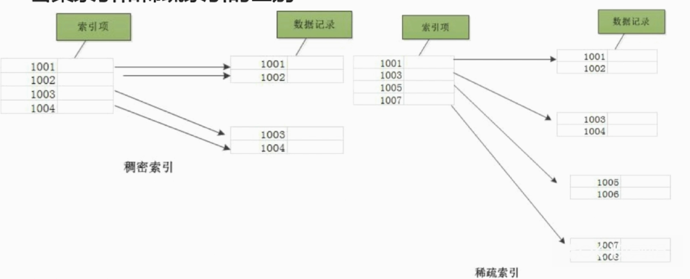

InnoDB:

- 若一个主键被定义，则该主键作为密集索引；
- 若没有主键被定义，该表的第一个唯一非空索引作为密集索引；
- 若不满足以上条件，innodb内部会生成一个隐藏主键(密集索引)。
- 非主键索引存储相关键位和其对应的主键值，包含两次查找。

### 12.6 索引的优缺点？什么时候使用索引？什么时候不能使用索引？

索引的好处：**提高查询速度**；

索引的坏处：**更新数据时效率低，因为要同时更新索引；**

对数据进行频繁查询时建立索引，如果要频繁更改数据不建议使用索引。

### 12.7 InnoDB索引和MyISAM索引的区别？

- **主索引的区别**：InnoDB索引是聚集性索引，叶节点的数据域保存了完整的数据记录；MyISAM索引是非聚集性索引，叶节点的数据域存放的是数据记录的地址；即InnoDB的数据文件本身就是主索引文件，而MyISAM的主索引和数据是分开的。
- **辅助索引的区别**：InnoDB的辅助索引的书记居于存储相应记录主键的值而不是地址。**首先检索辅助索引获得主键，然后用主键到主索引中检索获得记录。**而MyISAM的辅助索引和主索引没有多大区别。

### 12.8 为什么MySQL索引要使用B+树，而不是B树，红黑树？

在Mysql中，无论是Innodb还是MyISAM引擎，都使用了B+树做索引结构(这里先不考虑Hash索引)。那么我们从最普通的二叉树开始，从而说明Mysql为什么选择B+树作为索引结构。

**(1) 二叉查找树**

二叉查找树(BST,binary search Tree)也叫二叉排序树，在二叉树的基础上满足：**任意结点的左子树上的所有结点值不大于根节点的值，任意结点的右子树上所有结点值不小于根节点的值。**

但如果采用二叉查找树作为索引，并且把id作为索引且id自增，那么二叉查找树就变成了一个单支树，相当于链表查询。即**BST可能长歪而变得不平衡了**

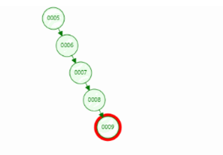

**(2) 平衡二叉树**

为了解决上述二叉搜索树的问题，引入了平衡得到二叉树。

AVL树是严格的平衡二叉树，所有节点的左右子树高度差不能超过1；AVL树查找、插入和删除在平均和最坏的情况下都是O(logn).

AVL实现平衡的关键在于旋转操作：插入和删除可能破坏二叉树的平衡，此时需要通过一次或多次树旋转来重新平衡这棵树。当插入数据时，最多只需要1次旋转(单旋转或双旋转)；但是当删除数据时，会导致树失衡，AVL需要维护从被删除节点到根节点这条路径上所有节点的平衡，旋转的量级为O(lgn)。


**由于旋转的耗时，AVL树在删除数据时效率很低。**在删除操作较多时，维护平衡所需的代码可能高于其带来的好处，因此AVL实际应用并不广泛。

**(3)红黑树**

与AVL树相比，红黑树并不追求严格的平衡，而是大致的平衡：**只是确保从根到叶子的最长的可能路径不多于 最短的可能路径的两倍长。**实现上遵守以下规则：

- **节点是红色或黑色；**
- **根节点是黑色；**
- **所有叶子是黑色的；**
- 每个红色节点必须有两个黑色的子节点(**从每个叶子到根的所有路径上不能有两个连续的红色节点**)；
- **从任一节点到每个结点的所有简单路径都包含相同数目的黑色结点**

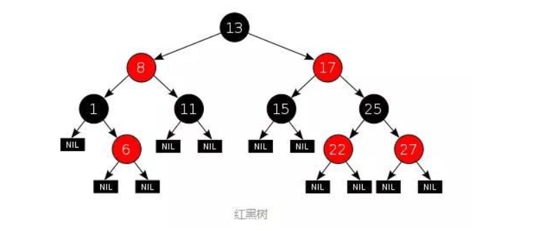

与AVL树相比**，红黑树丶查询效率会有所下降**，这是因为树的平衡性变差，高度更高了。但是红黑树的删除效率大大提高了。此外因为红黑树同时引入了颜色，**当插入或删除数据时，只需要进行O(1)次数的旋转以及变色就能保证基本的平衡，不需要像AVL树进行O(logn)次数的旋转**。


当然对于数据在内存中的情况如(TreeMap和HashMap)，红黑树的表现是非常优异的。但是**对于数据在磁盘等辅助存储设备中的情况(如Mysql等数据库)，红黑树还是并不擅长，因为红黑树还是有点高。**因为当数据在磁盘中，磁盘IO会成为最大的性能瓶颈，设计的目标应该是**尽量减少IO次数；而树的高度越高，增删改查所需要的IO次数也越多，会严重影响性能。**

**(4)B树**

**B树也被成为B-树，是为磁盘等辅存设备设计的多路平衡查找树，与二叉树相比，B树的每个非叶节点可以有多个子树**。因此，**当总节点数量相同时，B树的高度远远小于AVL树和红黑树，磁盘IO次数大大减少**。

对于一棵m阶B树，需要满足以下条件：


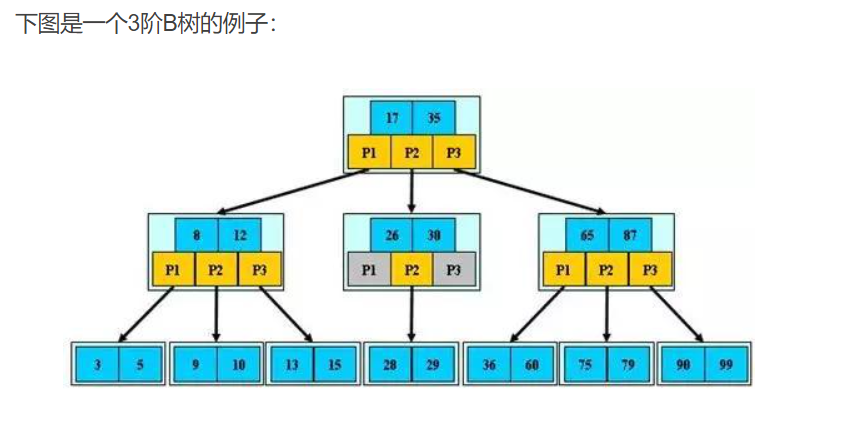

　　B树的优势除了树高小，还有对**访问局部性原理**的利用。所谓局部性原理，是指当一个数据被使用时，其附近的数据有较大概率在短时间内被使用。B树将键相近的数据存储在同一个节点，当访问其中某个数据时，数据库会将该整个节点读到缓存中；当它临近的数据紧接着被访问时，可以直接在缓存中读取，无需进行磁盘IO；换句话说，B树的缓存命中率更高。

**(5)B+树**

B+树为B树的一种变形，m阶B+树有如下性质：

- 每个结点的关键字个数与孩子个数相等
- 除根节点之外，每个内部结点有m/2到m个孩子


B+树也是多路平衡查找树，其与B树的区别在于：

- **B树中每个节点（包括叶节点和非叶节点）都存储真实的数据，B+树中只有叶子节点存储真实的数据，非叶节点只存储键**。在MySQL中，这里所说的真实数据，可能是行的全部数据（如Innodb的聚簇索引），也可能只是行的主键（如Innodb的辅助索引），或者是行所在的地址（如MyIsam的非聚簇索引）。
- **B+树的叶节点之间通过双向链表链接。**
- B树中的非叶节点，记录数比子节点个数少1；而B+树中记录数与子节点个数相同。
- B树中一条记录只会出现一次，不会重复出现，而B+树的键则可能重复重现，一定会在叶节点出现，也可能在非叶节点重复出现。

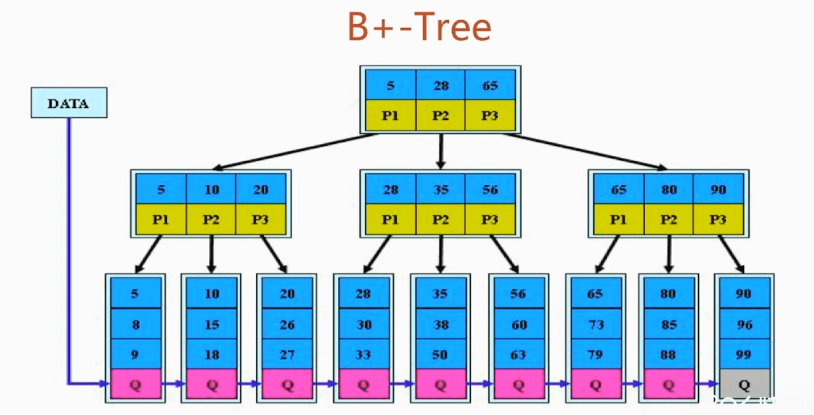

**优势：**

- **更少的IO次数：**B+树的非叶节点只包含键，而不包含真实数据，因此每个节点存储的记录个数比B数多很多（即阶m更大），因此B+树的高度更低，**访问时所需要的IO次数更少**。此外，由于每个节点存储的记录数更多，所以对访问局部性原理的利用更好，缓存命中率更高。
- **更适于范围查询：**在B树中进行范围查询时，首先找到要查找的下限，然后对B树进行中序遍历，直到找到查找的上限；而B+树的范围查询，只需要对链表进行遍历即可。
- **更稳定的查询效率：**B树的查询时间复杂度在1到树高之间(分别对应记录在根节点和叶节点)，而B+树的查询复杂度则稳定为树高，因为所有数据都在叶节点。


**总结：**

- 二叉查找树(BST)：**解决了排序的基本问题，但是由于无法保证平衡，可能退化为链表；**
- 平衡二叉树(AVL)：**通过旋转解决了平衡的问题，但是旋转操作效率太低；**
- 红黑树：**通过舍弃严格的平衡和引入红黑节点，解决了AVL旋转效率过低的问题，但是在磁盘等场景下，树仍然太高，IO次数太多**；
- B树：**通过将二叉树改为多路平衡查找树，解决了树过高的问题**；
- B+树：在**B树的基础上，将非叶节点改造为不存储数据的纯索引节点，进一步降低了树的高度；此外将叶节点使用指针连接成链表，范围查询更加高效。**

> - 更少的IO次数；
> - 更适用于范围查询；
> - 更稳定的查询效果；


**面试题目：**

**问题一、Mysql中存储索引用到的数据结构是B+树，B+树的查询时间跟树的高度有关，是log(n)，如果是用hash存储，那么查询时间是O(1).既然hash比B+树更快，为什么mysql用B+树来存储索引？**

答案：

- 从内存角度上来说，数据库中的索引一般都在磁盘上**，数据量大的情况可能无法一次性装入内存中**，**B+树的设计可以允许数据分批加载**；
- 从业务场景来说，如果是等值查询，只选择一个数据那确实是hash 更快，但是数据库中经常会选中多条数据，那么这时候由于B+树索引有序，并且有链表相连，其查询效率比hash快很多。并且B+树索引可以进行范围查询检索。

Hash索引的缺点：

- j仅仅能满足“=”，“IN”,不能使用范围查询；
- 无法被用来避免数据的排序操作；
- 不能利用部分索引键查询；
- 不能避免表扫描；
- 遇到大量Hash值相等的情况后性能并不一定比B+Tree高

> 是否还有别的结构呢？BitMap索引。

**问题二、为什么不用红黑树或者二叉排序树？**

答案：**树的查询时间跟树的高度有关，B+树是一棵多路搜索树可以降低树的高度，提高查询后啊效率。**


**问题3：既然增加树的路数可以降低树的高度，那么无限增加树的路数是不是可以有最优的查找效率？**

答：**这样会形成一个有序数组，文件系统和数据库的索引都是存在硬盘上的，并且如果数据量大的话，不一定能一次性加载到内存中。有序数组没法一次性加载进内存**，这时候B+树的多路存储威力就出来了，可以每次加载B+树的一个结点，然后一步步往下找，

**问题4：在内存中，红黑树比B树更优，但是涉及到磁盘操作B树就更优了，那么你能讲讲B+树吗？**

B+树是在B树的基础上进行改造，它的数据都在叶子结点，同时叶子结点之间还加了指针形成链表。

**问题5：为什么B+树要这样设计？**

答：**这个跟它的使用场景有关**，B+树在数据库的索引中用得比较多，数据库中select数据，不一定只选一条，很多时候会选中多条，比**如按照id进行排序后选100条**。如果是多条的话，**B-树需要做局部的中序遍历，可能要跨层访问。**而B+树由于所有数据都在叶子结点不用跨层，同时**由于有链表结构，只需要找到首尾，通过链表就能把所有数据取出来了。**

**问题6：数据库索引为什么要用b+树而不用红黑树？**

AVL 树和红黑树这些二叉树结构的数据结构可以达到最高的查询效率这是毋庸置疑的。

那么，数据库索引为什么不用AVL树或者红黑树呢？

AVL 数和红黑树基本都是存储在内存中才会使用的数据结构，那磁盘中会有什么不同呢？

这就要牵扯到磁盘的存储原理了

操作系统读写磁盘的基本单位是扇区，而文件系统的基本单位是簇(Cluster)。

也就是说，磁盘读写有一个最少内容的限制，即使我们只需要这个簇上的一个字节的内容，我们也要含着泪把一整个簇上的内容读完。

那么，现在问题就来了

一个父节点只有 2 个子节点，并不能填满一个簇上的所有内容啊？那多余的内容岂不是要浪费了？我们怎么才能把浪费的这部分内容利用起来呢？哈哈，答案就是 B+ 树。

由于 B+ 树分支比二叉树更多，所以**相同数量的内容，B+ 树的深度更浅，深度代表什么？代表磁盘 io 次数啊！数据库设计的时候 B+ 树有多少个分支都是按照磁盘一个簇上最多能放多少节点设计的啊！**

### 12.9 B+树的实现

B树的特点：

- 根节点至少有两个孩子；
- 每个结点中的关键字至少在m/2-1<=<=m-1
- 除根节点外，每个结点的孩子数目在m/2-m之间
- 叶子结点都在同一层

B+树的特点：

- 每个结点中的关键字跟结点的孩子数目一样，都是在m/2-m之间
- 叶子结点有一条链路相连
- 内部结点都只是存了key，不存value值

### 12.10 为什么要使用B+树？

**索引查找过程中就要产生磁盘I/O消耗,主要看IO次数，和磁盘存取原理有关。**
根据B-Tree的定义，可知检索一次最多需要访问h个节点。数据库系统的设计者巧妙利用了磁盘预读原理，
将一个节点的大小设为等于一个页，**这样每个节点只需要一次I/O就可以完全载入**
局部性原理与磁盘预读

### 12.11 如何定位并优化慢查询SQL

**具体场景具体分析，只提出大致思路**

- 根据慢日志定位慢查询sql；
  - `show variables like '%quer%'`；打开show_query_log为ON；即`set global slow_query_log=on`和`set global long_query_time=1`
- 使用explain等工具分析sql；
  - `explain`对sql语句分析。其中有两列最重要，一个是`type`; 一个是`extra`.
  - 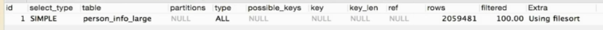
  - 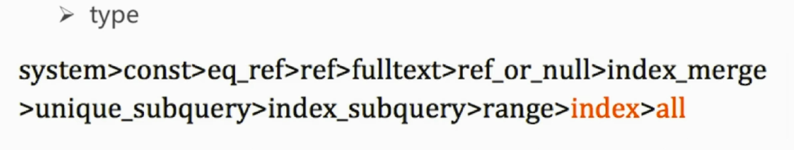
  - 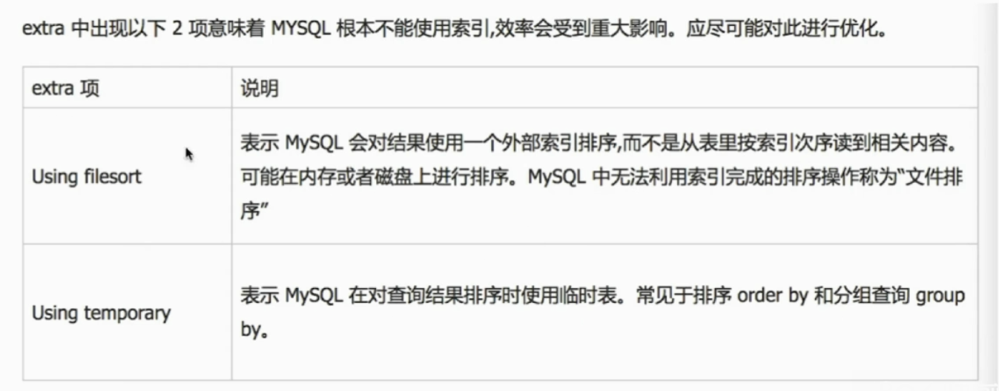

- 修改sql或者尽量让sql走索引；
  - `select account from person_info_large order by account desc`;
  - `alter table person_info_large add index idx_name(name);`

### 12.12 索引最左前缀问题

最左优先，在检索数据时从联合索引的最左边开始匹配。以最左边的为起点任何连续的索引都能匹配上。同时遇到范围查询(>、<、between、like)就会停止匹配。

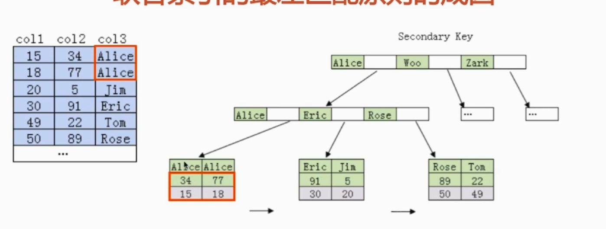

> **最左前缀匹配原则：**
>
> 在Mysql建立联合索引时会遵守最左前缀匹配原则，即最左优先，在检索数据时从联合索引的最左边开始匹配。以最左边的为起点任何连续的索引都能匹配上。同时遇到范围查询(>、<、between、like)就会停止匹配。
>
> **例子解释：**
>
> 索引的底层是一颗B+树，那么联合索引当然还是一颗B+树，只不过联合索引的健值数量不是一个，而是多个。构建一颗B+树只能根据一个值来构建，因此数据库依据联合索引最左的字段来构建B+树。
> 例子：假如创建一个（a,b)的联合索引，那么它的索引树是这样的
>
> 
>
> 可以看到a的值是有顺序的，1，1，2，2，3，3，而b的值是没有顺序的1，2，1，4，1，2。所以b = 2这种查询条件没有办法利用索引，因为联合索引首先是按a排序的，b是无序的。
>
> 同时我们还可以发现在a值相等的情况下，b值又是按顺序排列的，但是这种顺序是相对的。所以最左匹配原则遇上范围查询就会停止，剩下的字段都无法使用索引。例如a = 1 and b = 2 a,b字段都可以使用索引，因为在a值确定的情况下b是相对有序的，而a>1and b=2，a字段可以匹配上索引，但b值不可以，因为a的值是一个范围，在这个范围中b是无序的。


### 12.13 索引分类

| 索引类型 | 概念                                                         |
| -------- | ------------------------------------------------------------ |
| 普通索引 | 最基本的索引，没有任何限制                                   |
| 唯一索引 | 与"普通索引"类似，不同的就是：索引列的值必须唯一，但允许有空值。 |
| 主键索引 | 它是一种特殊的唯一索引，不允许有空值。                       |
| 全文索引 | 针对较大的数据，生成全文索引很耗时好空间。                   |
| 组合索引 | 为了更多的提高mysql效率可建立组合索引，遵循”最左前缀“原则    |

### 12.14 数据库的主从复制

| 复制方式   | 操作                                                         |
| ---------- | ------------------------------------------------------------ |
| 异步复制   | 默认异步复制，容易造成主库数据和从库不一致,一**个数据库为Master**, **一个数据库为slave**,通过Binlog日志,**slave两个线程，一个线程去读master binlog日志**，写到自己的中继日志；**一个线程解析日志，执行sql,**  **master启动一个线程,给slave传递binlog日志** |
| 半同步复制 | 只有把master发送的binlog日志写到slave的中继日志，这时主库,才返回操作完成的反馈，性能有一定降低 |
| 并行操作   | **slave 多个线程去请求binlog日志**                           |

### 12.15 long_query怎么解决？

设置参数，开启慢日志功能，得到耗时超过一定时间的sql语句。

### 12.16 varchar和char的使用场景

| 类型    | 使用场景         |
| ------- | ---------------- |
| varchar | 字符长度经常变的 |
| char    | 用字符长度固定的 |

### 12.17 数据库连接池的作用

- 维护一定数量的连接，减少创建连接的时间 
- 更快的响应时间 
- 统一的管理

### 12.18 分库分表 主从复制 读写分离

读写分离，读从库，写主库
spring配置两个数据库，通过AOP（面向切面编程），在写或读方法前面进行判断得到动态切换数据源。

### 12.19 数据库三范式

| 级别 | 概念                               |
| ---- | ---------------------------------- |
| 1NF  | **属性不可分**                     |
| 2NF  | **非主键属性，完全依赖于主键属性** |
| 3NF  | **非主键属性无传递依赖**           |

### 12.20 关系型数据库和非关系型数据库的区别

**关系型数据库**

**优点**

- 容易理解：二维表结构是非常贴近逻辑世界一个概念，关系模型相对网状、层次等其他模型来说更容易理解；
- 使用方便：通用的SQL语言使得操作关系型数据库非常方便；
- 易于维护：丰富的完整性(实体完整性、参照完整性和用户定义的完整性)大大减低了数据冗余和数据不一致的概率；
- 支持SQL，可用于复杂的查询。
- 支持事务

**缺点**

- 为了维护一致性所付出的巨大代价就是其读写性能比较差；
- 固定的表结构；
- 不支持高并发读写需求；
- 不支持海量数据的高效率读写


**非关系型数据库**

**优点**

- 使用键值对存储数据； 
- 分布式；
- 无需经过sql层的解析，读写性能很高 
- 基于键值对，数据没有耦合性，容易扩展 存储数据的格式：
- nosql的存储格式是key,value形式

 **缺点** 

- 不提供sql支持

### 12.21 数据库中的join的left join, right join, inner join, cross join

- 以A，B两张表为例
  A left join B
  选出A的所有记录，B表中没有的以null 代替
  right join 同理

- inner join
  A,B有交集的记录

- cross join (笛卡尔积)
  A中的每一条记录和B中的每一条记录生成一条记录
  例如A中有4条，B中有4条，cross join 就有16条记录

### 12.22 mysql中的锁

当多个用户同时对数据库并发操作时，会带来数据不一致的问题。所以，锁主要用于多用户环境下保证数据库完整性和一致性。

**数据库锁出现的目的：处理并发问题。**

**数据库锁的分类：**

- 按锁的粒度划分，可分为表级锁、行级锁、页级锁；
- 按锁级别划分，可分为共享锁、排它锁；
- 按加锁方式划分，可分为自动锁、显式锁；
- 按操作划分，可分为DML锁、DDL锁；
- 按使用方式划分，可分为乐观锁、悲观锁。


#### 1.悲观锁

> 悲观锁（Pessimistic Lock）：正如其名，具有强烈的独占和排他特性。它指的是对数据被外界（包括本系统当前的其他事务，以及来自外部系统的事务处理）修改持保守态度，因此，在整个数据处理过程中，将数据处于锁定状态。悲观锁的实现，往往依靠数据库提供的锁机制（也只有数据库层提供的锁机制才能真正保证数据访问的排他性，否则，即使在本系统中实现了加锁机制，也无法保证外部系统不会修改数据）。

悲观锁按照使用性质可划分为：共享锁、排他锁和更新锁。

##### (1) 共享锁(Share Lock)

S锁，也叫读锁，用于所有的只读数据操作。共享锁是非独占的，允许多个并发事务读取器锁定的资源。

**性质**

- 1.多个事务可封锁同一个共享页；
- 2.任何事务都不能修改该页；
- 3.通常是该页被读取完毕，S锁立即被释放。

> 在SQL Server中，默认情况下，数据被读取后，立即释放共享锁。
> 例如，执行查询语句“SELECT * FROM my_table”时，首先锁定第一页，读取之后，释放对第一页的锁定，然后锁定第二页。这样，就允许在读操作过程中，修改未被锁定的第一页。
> 例如，语句“SELECT * FROM my_table HOLDLOCK”就要求在整个查询过程中，保持对表的锁定，直到查询完成才释放锁定。

##### (2) 排他锁(Exclusive Lock)

X锁，也叫写锁，表示对数据进行写操作。如果一个事务对对象加了排他锁，其他事务就不能再给它加任何锁了。（某个顾客把试衣间从里面反锁了，其他顾客想要使用这个试衣间，就只有等待锁从里面打开了。）

**性质**

- 1.仅允许一个事务封锁此页；
- 2.其他任何事务必须等到X锁被释放才能对该页进行访问；
- 3.X锁一直到事务结束才能被释放。

> 产生排他锁的SQL语句如下：select * from ad_plan for update;

##### (3)更新锁

U锁，在修改操作的初始化阶段用来锁定可能要被修改的资源，这样可以避免使用共享锁造成的死锁现象。

> 因为当使用共享锁时，修改数据的操作分为两步：
> 1.首先获得一个共享锁，读取数据，
> 2.然后将共享锁升级为排他锁，再执行修改操作。
> 这样如果有两个或多个事务同时对一个事务申请了共享锁，在修改数据时，这些事务都要将共享锁升级为排他锁。这时，这些事务都不会释放共享锁，而是一直等待对方释放，这样就造成了死锁。
> 如果一个数据在修改前直接申请更新锁，在数据修改时再升级为排他锁，就可以避免死锁。

**性质**

- 1.用来预定要对此页施加X锁，它允许其他事务读，但不允许再施加U锁或X锁
- 2.当被读取的页要被更新时，则升级为X锁；
- 3.U锁一直到事务结束时才能被释放。 


悲观锁按作用范围划分为：行锁和表锁。

##### (4)行锁

锁的作用范围是行级别。

##### (5)表锁

锁的作用范围是整张表。

数据库能够确定那些行需要锁的情况下使用行锁，如果不知道会影响哪些行的时候就会使用表锁。

> 举个例子，一个用户表user，有主键id和用户生日birthday。
> 当你使用update … where id=?这样的语句时，数据库明确知道会影响哪一行，它就会使用行锁；
> 当你使用update … where birthday=?这样的的语句时，因为事先不知道会影响哪些行就可能会使用表锁。

#### 2.乐观锁

顾名思义，就是很乐观，每次去拿数据的时候都认为别人不会修改，所以，不会上锁。但是在更新的时候会判断一下在此期间别人有没有更新这个数据，可以使用版本号等机制。

> 乐观锁（ Optimistic Locking ）： 相对悲观锁而言，乐观锁机制采取了更加宽松的加锁机制。
> **悲观锁**大多数情况下依靠数据库的锁机制实现，以保证操作最大程度的独占性。但随之而来的就是数据库性能的大量开销，特别是对长事务而言，这样的开销往往无法承受。而乐观锁机制在一定程度上解决了这个问题。
> **乐观锁**，大多是基于数据版本（ Version ）记录机制实现。
> **数据版本**：为数据增加一个版本标识，在基于数据库表的版本解决方案中，一般是通过为数据库表增加一个 “version” 字段来实现。读取出数据时，将此版本号一同读出，之后更新时，对此版本号加一。此时，将提交数据的版本数据与数据库表对应记录的当前版本信息进行比对，如果提交的数据版本号大于数据库表当前版本号，则予以更新，否则认为是过期数据。

乐观锁适用于多读的应用类型，这样可以提高吞吐量，像数据库如果提供类似于write_condition机制的其实都是提供的乐观锁。

##### 乐观锁的实现方式

- 版本号（version）

> **版本号（记为version）**：就是给数据增加一个版本标识，在数据库上就是表中增加一个version字段，每次更新把这个字段加1，读取数据的时候把version读出来，更新的时候比较version，如果还是开始读取的version就可以更新了，如果现在的version比老的version大，说明有其他事务更新了该数据，并增加了版本号，这时候得到一个无法更新的通知，用户自行根据这个通知来决定怎么处理，比如重新开始一遍。这里的关键是判断version和更新两个动作需要作为一个原子单元执行，否则在你判断可以更新以后正式更新之前有别的事务修改了version，这个时候你再去更新就可能会覆盖前一个事务做的更新，造成第二类丢失更新，所以你可以使用update … where … and version=”old version”这样的语句，根据返回结果是0还是非0来得到通知，如果是0说明更新没有成功，因为version被改了，如果返回非0说明更新成功。

- 时间戳（使用数据库服务器的时间戳）

  > **时间戳（timestamp）**：和版本号基本一样，只是通过时间戳来判断而已，注意时间戳要使用数据库服务器的时间戳不能是业务系统的时间。

- 待更新字段

  > **待更新字段**：和版本号方式相似，只是不增加额外字段，直接使用有效数据字段做版本控制信息，因为有时候我们可能无法改变旧系统的数据库表结构。假设有个待更新字段叫count,先去读取这个count,更新的时候去比较数据库中count的值是不是我期望的值（即开始读的值），如果是就把我修改的count的值更新到该字段，否则更新失败。java的基本类型的原子类型对象如AtomicInteger就是这种思想。

- 所有字段

  > **所有字段**：和待更新字段类似，只是使用所有字段做版本控制信息，只有所有字段都没变化才会执行更新。


### 12.23 死锁是什么？死锁怎么解决

死锁是指两个或多个事务在同一资源上相互占用，并请求锁定对方的资源，从而导致恶性循环的现象。

常见的解决死锁的方法

- 如果不同程序会并发存取多个表，尽量约定以相同的顺序访问表，可以大大降低死锁机会。 
- 在同一个事务中，尽可能做到一次锁定所需要的所有资源，减少死锁产生概率；
- 对于非常容易产生死锁的业务部分，可以尝试使用升级锁定颗粒度，通过表级锁定来减少死锁产生的概率；

如果业务处理不好可以用分布式事务锁或者使用乐观锁

### 12.24 最左匹配原则

最左匹配原则是针对索引的
举例来说：两个字段（name,age）建立联合索引，如果where age=12这样的话，是没有利用到索引的，
这里我们可以简单的理解为先是对name字段的值排序，然后对age的数据排序，如果直接查age的话，这时就没有利用到索引了，
查询条件where name=‘xxx’ and age=xx 这时的话，就利用到索引了，再来思考下where age=xx and name=’xxx‘ 这个sql会利用索引吗，
按照正常的原则来讲是不会利用到的，但是优化器会进行优化，把位置交换下。这个sql也能利用到索引了

### 12.25 语法部分

- GROUP BY
- HAVING
- 统计相关：COUNT, SUM, MAX, MIN, AVG

#### 1.GROUP BY

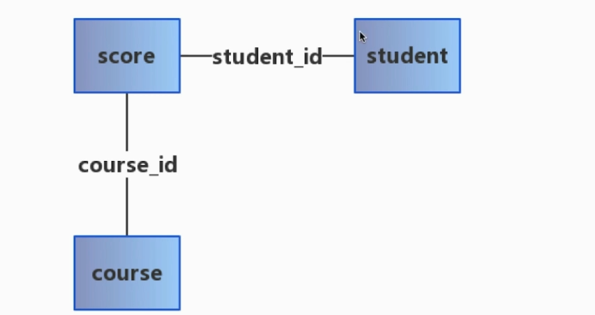

```sql
# 查询所有同学的学号、选课数、总成绩
select student_id, count(course_id), sum(score) from score group by student_id
```

```sql
# 查询所有同学的学号、姓名、选课数、总成绩
select s.student_id, stud.name, count(s.course_id),sum(s.score) 
from score s, student stu
where s.student_id = stu.student_id
group by s.student_id;
```

#### 2.HAVING

- 通常与GROUP BY子句一起使用；
- WHERE过滤行，HAVING过滤组；
- 出现在同一sql的顺序：WHERE>GROUP BY>HAVING

```sql
# 查询平均成绩大于60分的同学的学号和平均成绩
select student_id,avg(score)
from score
group by student_id
having avg(score) > 60
```

```sql
# 查询没有学全所有课的同学的学号、姓名
select stu.student_id, stu.name
from student stu,score s
where stu.student_id = s.student_id
group by s.student_id
having count(*) < (select count(*) from course)
```


