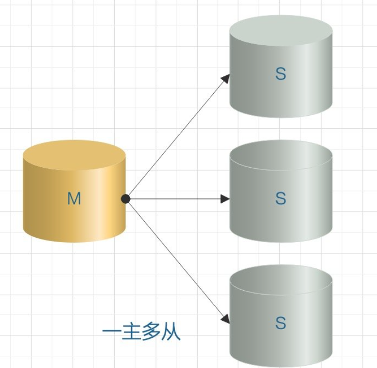

# Mysql主从复制相关的面试知识点

> Binlog日志主要作用是数据恢复和主从复制。本身就是二进制格式的日志文件，网络传输无需进行协议转换。

**MySQL集群的高可用，负载均衡，读写分离等功能都是基于BinLog来实现的。**

## 一、MySQL主从复制主流架构模型

我们可以基于Binlog可以复制出一台MySQL服务器，也可以复制出多台，取决于我们想实现什么功能。主流的系统架构由如下几种方式：

### 1.一主一从/一主多从

一主一从和一主多从是最常见的主从架构方式，一般实现主从配置或者读写分离都可以采用这种架构。

如果是一主多从的模式，当Slave增加到一定数量时，Slave对Master的负载以及网络带宽都将成为一个严重的问题。

### 2.多主一从

MySQL 5.7 开始支持多主一从的模式，将多个库的数据备份到一个库中存储。

### 3.双主复制

理论上跟主从一样，但是两个MySQL服务器互做对方的从，任何一方有变更，都会复制对方的数据到自己的数据库。双主适用于写压力比较大的业务场景，或者 DBA 做维护需要主从切换的场景，通过双主架构避免了重复搭建从库的麻烦。（主从相互授权连接，读取对方binlog日志并更新到本地数据库的过程；只要对方数据改变，自己就跟着改变）

### 4.级联复制

级联模式下因为涉及到的slave节点很多，所以如果都连在master上对主服务器上的压力肯定是不小的。所以部分slave连接到它上一级的从节点上，这样就缓解了主服务器的压力。

级联复制解决了一主多从场景下多个从库复制对主库的压力，带来的弊端就是数据同步延迟比较大。

## 二、MySQL主从复制原理

MySQL主从复制涉及到三个线程：

一个在主节点的线程：`log dump thread`

从库会生成两个线程：一个I/O线程，一个SQL线程。

如下图所示：

**流程：**

- 主库会生成一个`log dump`线程，用来给从库I/O线程传`Binlog`数据；
- 从库的I/O线程会去请求主库的`Binlog`,并将得到的`Binlog`写到本地的`relay log`(中继日志)文件中；
- SQL线程，会读取`relay log`文件中的 日志，并解析成SQL语句逐一执行；

### 1.主节点log dump线程

当从节点连接主节点时，主节点为其创建一个`log dump`线程，用于发送和读取Binlog的内容；

在读取Binlog中的操作时，`log dump`线程会对主节点上的Binlog加锁；

当读取完成发送给从节点之前，锁会被释放。**主节点会为自己的每一个从节点创建一个log dump线程。**

### 2.从节点I/O线程

当从节点上执行`start slave`命令之后，从节点会创建一个I/O线程用来连接主节点，请求主库中更新的Binlog。

I/O线程接收到主节点的`log dump`进程发来的更新之后，保存在本地`relay-log（中继日志）`中。

#### a.relay log

MySQL进行主主复制或主从复制的时候会在要复制的服务器下面产生相应的relay log。

**那么relay log是怎么产生的呢？**

从服务器I/O线程将主服务器的Binlog日志读取出来，解析到各类Events之后记录到服务器本地文件，这个文件就被称为relay log。

然后SQL线程就会读取relay log日志的内容并应用到从服务器，从而使从服务器和主服务器的数据保持一致。中继日志充当缓冲区，这样master就不必等待slave执行完成才发送下一个事件。

#### b.从节点SQL线程

SQL线程负责读取relay log中的内容，解析成具体的操作并执行，最终保证主从数据的一致性。

对于每一个主从连接，都需要这三个线程来完成。当主节点有多个从节点时，主节点会为每一个当前连接的从节点创建一个log dump进程，而每个从节点都有自己的I/O进程，SQL进程。

从节点用两个线程将从主库拉去更新和执行分成独立的任务，这样在执行同步数据任务的时候，不会降低读操作的性能。**比如**，如果从节点没有运行，此时I/O进程可以很快地从主节点获取更新，尽管SQL进程还没有执行。如果SQL进程执行之前从节点服务停止，至少I/O进程已经从主节点拉去了最新的变更并且保存到了本地relay log中，当服务再次起来之后就可以完成数据的同步。

**因为整个复制过程实际上就是 Slave 从 Master 端获取该日志然后再在自己身上完全顺序的执行日志中所记录的各种操作。如下图所示：**

### 3.复制的整个基本过程

- a. 在从结点上执行`start slave`命令开启主从复制开关，开始进行主从复制。从节点上的I/O进程连接主节点，并请求从指定日志文件的指定位置(或者从最开始的日志)之后的日志内容；
- b.主节点接收到来自从节点的I/O请求后，通过负责复制的I/O进程根据请求读取指定日志指定位置之后的日志信息，返回给从结点。返回信息中除了日志所包含的信息之外，还包括本次返回的信息的 Binlog file 以及 Binlog position（Binlog 下一个数据读取位置）。
- c. 从结点的I/O进程接收到主节点发送过来的日志内容、日志文件以及位置点后，将接收到的日志内容更新到本机的relay log文件(Mysql-relay-bin.xxx)的最末端，并将读取到的 Binlog文件名和位置保存到`master-info` 文件中，以便在下一次读取的时候能够清楚的告诉 Master ：“ 我需要从哪个 Binlog 的哪个位置开始往后的日志内容，请发给我”。
- Slave 的 SQL 线程检测到relay log 中新增加了内容后，会将 relay log 的内容解析成在能够执行 SQL 语句，然后在本数据库中按照解析出来的顺序执行，并在 `relay log.info` 中记录当前应用中继日志的文件名和位置点。

## 三、Mysql基于Binlog主从复制的模式介绍

MySQL主从复制默认是`异步的模式`。MySQL增删改操作会全部记录在Binlog，当slave节点连接到master时，会主动从master获取最新的Binlog文件。并把Binlog存储到本地的relay log中，然后取执行relay log的更新内容。

### 1.异步模式(async-mode)

这种模式下，主节点不会主动推送数据到从节点，主库在执行完客户端提交的事务后会立即将结果返回给客户端，并不关心从库是否已经接收并处理。**这样就会有一个问题了**，主节点如果崩溃掉了，此时主节点上已经提交的事务可能并没有传到从节点上，如果此时，强行将从提升为主，可能导致新主节点上的数据不完整。

### 2.半同步模式(semi-sync)

介于异步复制和全同步复制之间，主库在执行完客户端提交的事务后不是立刻返回给客户端，而是等待至少一个从库接收到并写到relay log中才返回成功信息给客户端（只能保证主库的Binlog至少传输到了一个从节点上），否则需要等待直到超时时间然后切换成异步模式再提交。

相对于异步复制，半同步复制提高了数据的安全性，一定程度的保证了数据能成功备份到从库，同时它也造成了一定程度的延迟，但是比全同步模式延迟要低，这样延迟至少是一个TCP/IP往返的时间。所以，半同步复制最好在低延时的网络中使用。

### 3.全同步模式

指当主库执行完一个是我，然后所有的从库都复制了该事物并成功执行完才返回成功信息给客户端。因为需要等待所有从库执行完该事物才能返回成功信息，所以全同步复制的性能必然会受到严重的影响。

## 四、主从复制可能会出现的问题

### 1.Slave同步延迟的问题

因为Slave端是通过I/O thread单线程来实现数据解析入库的；而**Master端写Binlog由于是顺序写效率很高**。 

当主库的系统并发量很高的时候，必然Master端的写效率要高过Slave端的读效率，这时候就有同步延迟的维内托。

I/O Thread 的同步是基于库的，即同步几个库就会开启几个 I/O Thread。

可以通过 `show slave status` 命令查看 `Seconds_Behind_Master` 的值来看是否出现同步延迟，这个值代表主从同步延迟的时间，值越大说明延迟越严重。值为 0 为正常情况，正值表示已经出现延迟，数字越大从库落后主库越多。

基于 Binlog 的复制方式肯定有这种问题，MySQL 官方也意识到，单线程不如多线程强，所以在 **MySQL 5.7 版本引入了基于组提交的并行复制（官方称为Enhanced Multi-threaded Slaves，即MTS）**，设置参数：

`slave_parallel_workers>0` 即可，并且 `global.slave_parallel_type＝‘LOGICAL_CLOCK’`，

即可支持一个 schema(库) 下，`slave_parallel_workers`个 worker 线程并发执行 relay log 中主库提交的事务。

## 五、新一代主从复制模式-GTID复制模式

在传统的复制里面，当发生故障，需要**主从切换**，需要找到 Binlog 和 位点信息，恢复完成数据之后将主节点指向新的主节点。在 MySQL 5.6 里面，提供了新的数据恢复思路，只需要知道主节点的 IP、端口以及账号密码就行，因为复制是自动的，MySQL 会通过内部机制 **GTID** 自动找点同步。

**GTID (global transaction identifier)** 即全局事务 ID，**一个事务对应一个 GTID，保证了在每个在主库上提交的事务在集群中有一个唯一的 ID。**

### 1.GTID复制原理

在原来基于日志的复制中，**从库需要告知主库要从哪个偏移量进行增量同步**， 如果指定错误会造成数据的遗漏，从而造成数据的不一致。

而基于 GTID 的复制中，从库会告知主库已经执行的事务的 GTID 的值，然后主库会将所有未执行的事务的 GTID 的列表返回给从库，并且可以保证同一个事务只在指定的从库执行一次，**通过全局的事务 ID 确定从库要执行的事务的方式代替了以前需要用 Binlog 和 位点确定从库要执行的事务的方式**。

基于 GTID 的复制过程如下：

- master 更新数据时，会在事务前产生 GTID，一同记录到 Binlog 日志中。
- slave 端的 I/O 线程将变更的 Binlog，写入到本地的 relay log 中,读取值是根据`gitd_next变量`，告诉我们 slave 下一个执行哪个 GTID。
- SQL 线程从 relay log 中获取 GTID，然后对比 slave 端的 Binlog 是否有记录。如果有记录，说明该 GTID 的事务已经执行，slave 会忽略。
- 如果没有记录，slave 就会从 relay log 中执行该 GTID 的事务，并记录到 Binlog。
- 在解析过程中会判断是否有主键，如果没有就用二级索引，如果没有二级索引就用全部扫描。

**GTID 的好处**

1. GTID 使用 `master_auto_position=1` 代替了 Binlog 的主从复制方案，相比 Binlog 方式更容易搭建主从复制。
2. GTID 方便实现主从之间的 failover（主从切换），不用一步一步的去定位 Binlog日志文件和查找 Binlog 的位点信息。

