# Java复习框架-数据库Redis

## 一、Redis简介

> Redis是一个使用C语言编写的，开源的(BSD许可)高性能非关系型(NoSQL)的键值对数据库。
>
> Redis开源存储键和五种不同类型的值之间的映射。键的类型只能为字符串，值支持五种数据类型：字符串、列表、散列表、集合、有序集合。
>
> 与传统数据库不同的是Redis的数据是存储在内存中的，读写速度非常快，因此Redis被广泛应用于缓存方向，每秒可以处理超过10万次读写操作。


**主流的应用架构**

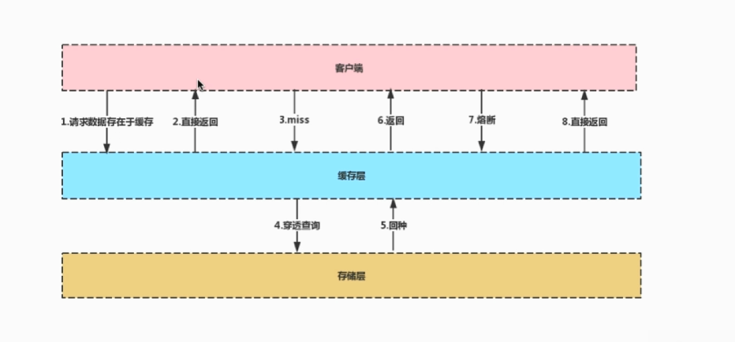

### 1.1 缓存中间件-Memcache和Redis的区别

**Memcache：代码层次类似Hash**

- 支持简单数据类型；
- 不支持数据持久化存储；
- 不支持主从；
- 不支持分片；

**Redis:**

- 数据类型丰富；
- 支持数据磁盘持久化存储；
- 支持主从；
- 支持分片；

### 1.2 为什么Redis能这么快

100000+QPS(QPS即query per second，每秒内查询次数)

- **完全基于内存**，绝大部分请求是纯粹的内存操作，执行效率高；
- 数据结构简单，对数据操作也简单；
- 采**用单线程，单线程也能处理高并发请求**，想要多核也可以启动多实例；
- **使用多路I/O复用模型，非阻塞I/O**；

### 1.3 为什么使用Redis做缓存

主要从“高性能”和“高并发”这两个点来看待这个问题。

**高性能：**

假如用户第一次访问数据库中的某些数据。这个过程会比较慢，因为是从硬盘上读取的。将该用户访问的数据存在数据缓存中，这样下一次在访问这些数据的时候就可以直接从缓存中获取了。操作缓存数据就是直接操作内存，速度非常快。


**高并发**

直接操作缓存能够承受的请求是远远大于直接访问数据库的，所以考虑把数据库中的部分数据转移到缓存中去，这样用户的一部分请求会直接到缓存这里而不用经过数据库。

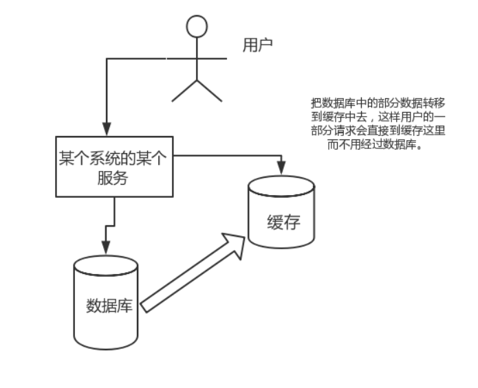

### 1.4 为什么要用Redis而不用map/guava做缓存？

缓存分为**本地缓存**和**分布式缓存**。

以Java为例，使用**自带的map或者guava实现的是本地缓存**，最主要的特点是轻量以及快速，生命周期随着JVM的销毁而结束，并且**在多实例的情况下，每个实例都需要各自保存一份缓存，缓存不具有一致性；**

使用redis或memcached之类的称为分布式缓存，**在多实例的情况下，各实例共用一份缓存数据，缓存具有一致性**。缺点是需要保持redis或memcached服务的高可用。

### 1.5 Redis的应用场景

**计数器**

可以对String进行自增自减运算，从而实现计数器功能。Redis这种内存型数据库的读写性能非常高，很适合存储频繁读写的计算量。

**缓存**

将热点数据放到内存中，设置内存的最大使用量以及淘汰策略来保证缓存的命中率。

**消息队列**

List是一个双向链表，可以通过lpush和rpop写入和读取信息。不过最好使用**kafka**和**rabbitmq**等消息中间件。

**分布式锁**

在分布式场景下，无法使用单机环境下的锁来对多个节点上的进行进程同步。可以使用redis自带的**setnx命令来实现分布式锁**。

**其它**

**set可以实现交集、并集等操作，从而实现共同好友**等功能。

**zset可以实现有序性操作，从而实现排行榜**等功能。

**总结：**

String-适合最简单的k-v存储，类似于memcached的存储结构，短信验证码，配置信息、计数器等功能，就用这种类型来存储；

hash-一般key为id或者唯一标识，value对应的就是详情，如商品详情，个人信息详情，新闻详情等

list-因为list是有序的，比较适合存储一些有序且数据固定的数据。如省市区表、字典表

set-可以简单理解为id-list的模式，如微博中一个人有哪些好友，set最牛的地方在于，可以对两个set提供交集、并集、差集等操作。例如：查找两个人共同的好友等。

sorted set-是set的增强版本，增加了一个score参数，自动会根据score的值进行排序。比如适合类似于top10等不根据插入的时间来排序的数据。


## 二、Redis常见题目

### 2.1 说说你用过的Redis的数据类型

Redis主要有5种数据类型，包括**String，List，Hash，Set，Zset**，满足大部分的使用要求

| 数据类型 | 可以存储的值           | 操作                                                         | 应用场景                                                     |
| -------- | ---------------------- | ------------------------------------------------------------ | ------------------------------------------------------------ |
| STRING   | 字符串、整数或者浮点数 | 对整个字符串或者字符串的其中一部分执行操作 对整数和浮点数执行自增或者自减操作 | 做简单的键值对缓存                                           |
| LIST     | 列表                   | 从两端压入或者弹出元素 对单个或者多个元素进行修剪， 只保留一个范围内的元素 | 存储一些列表型的数据结构，类似粉丝列表、文章的评论列表之类的数据 |
| SET      | 无序集合               | 添加、获取、移除单个元素 检查一个元素是否存在于集合中 计算交集、并集、差集 从集合里面随机获取元素 | 交集、并集、差集的操作，比如交集，可以把两个人的粉丝列表整一个交集 |
| HASH     | 包含键值对的无序散列表 | 添加、获取、移除单个键值对 获取所有键值对 检查某个键是否存在 | 结构化的数据，比如一个对象                                   |
| ZSET     | 有序集合               | 添加、获取、删除元素 根据分值范围或者成员来获取元素 计算一个键的排名 | 去重但可以排序，如获取排名前几名的用户                       |

**供用户使用的数据类型**

- String：最基本的数据类型，二进制安全；

```redis
set name "redis"
get name

set count 1
get count

incr count
get count
```

- Hash：String元素组成的字典，适合用于存储对象；

```redis
hmset lcz name "lvchaozhang" age 25 title "Senior"
hget lcz name
hget lcz age
```

- List：列表，按照String元素插入顺序排序；

```redis
lpush mylist aaa
lpush mylist bbb
lpush mylist ccc
lrange mylist 0 10
```

- Set：String元素组成的无序集合，通过哈希表实现，不允许重复；

```redis
sadd myset 111
sadd myset 222
sadd myset abc
sadd myset bbb

smembers myset
```

- Sorted Set：通过分数来为集合中的成员进行从小到大的排序

```redis
zadd myzset 3 abc
zadd myzset 1 abd
zadd myzset 2 abb

zrangebyscore myzet 0 10
```

- 用于技术的HyperLogLog，用于支持存储地理位置信息的Geo

### 2.2 从海量key里查询出某一固定前缀的key

**留意细节：**

- 摸清数据规模，即问清楚边界


**使用keys对线上的业务的影响**

**(1) KEYS pattern：查找所有符合给定模式pattern的key。**

- KEYS指令一次性返回所有匹配的key；
- 键的数量过大会使服务卡顿；

```redis
# 查看数据规模
dbsize
# keys pattern：查看以k1打头的（卡住会）
keys k1*
```

**(2) SCAN cursor [MATCH pattern] [COUNT count]**

- 基于游标的迭代器，需要基于上一次的游标延续之前的迭代过程；
- 以O作为游标开始一次新的迭代，直到命令返回游标0完成一次遍历；
- 不保证每次执行都返回某个给定数量的元素，支持模糊查询；
- 一次返回的数量不可控，只能是大概率符合count参数；

```redis
scan 0 match k1* count 10
# 结果会返回一个游标，可接游标替换0，继续查找
```

### 2.3 如何通过Redis实现分布式锁

# 【大话Java面试】-如何通俗易懂的理解分布式锁？

## 一、前言

首先我们先考虑以下这个问题：

在多线程并发的情况下，我们如何保证一个代码块在同一时间只能由一个线程访问呢？

答案：通常来说，我们可以用[锁](https://codingchaozhang.blog.csdn.net/article/details/111340117)来保证。比如java的[synchronized](https://codingchaozhang.blog.csdn.net/article/details/110563657)用法以及[ReentrantLock](https://codingchaozhang.blog.csdn.net/article/details/111338689)等等。这样就可以保证同一个JVM进程内的多个线程同步执行。

**那么如果在分布式的集群环境中，如何保证不同结点的线程同步执行呢？**

对于分布式场景，我们可以尝试用分布式锁。

## 二、分布式锁的实现有哪些呢？

**a.Memcached分布式锁**

利用Memcached的**add命令**。此命令是原子性操作，只有在key不存在的情况下，才能add成功，也就意味着线程得到了锁。

**b.Redis分布式锁**

和Memcached的方式类似，利用Redis的**setnx命令**。此命令同样是原子性操作，只有在key不存在的情况下，才能set成功。（setnx命令并不完善，后续会介绍替代方案）

**c.Zookeeper分布式锁**

利用Zookeeper的**顺序临时节点**，来实现分布式锁和等待队列。Zookeeper设计的初衷，就是为了实现分布式锁服务的。

## 三、如何用Redis来实现分布式锁呢？

### 分布式锁的三个核心要素

#### 加锁

使用setnx来加锁。key是锁的唯一标识，按业务来决定命名，value这里设置为test。

`setx key test`

当一个线程执行setnx返回1，说明key原本不存在，该线程成功得到了锁；当一个线程执行setnx返回0，说明key已经存在，该线程抢锁失败；

#### 解锁

有加锁就得有解锁。当得到的锁的线程执行完任务，需要释放锁，以便其他线程可以进入。释放锁的最简单方式就是执行del指令。

`del key`

释放锁之后，其他线程就可以继续执行setnx命令来获得锁。

#### 锁超时

锁超时知道的是：如果一个得到锁的线程在执行任务的过程中挂掉，来不及显式地释放锁，这块资源将会永远被锁住，别的线程北向进来。

所以，setnx的key必须设置一个超时时间，以保证即使没有被显式释放，这把锁也要在一段时间后自动释放。setnx不支持超时参数，所以需要额外指令，

`expire key 30`


### 上述分布式锁存在的问题

通过上述`setnx` 、`del`和`expire`实现的分布式锁还是存在着一些问题。下面将具体举例说明该问题：

#### setnx和expire的非原子性问题

假设一个场景中，某一个线程刚执行setnx，成功得到了锁。此时setnx刚执行成功，还未来得及执行expire命令，节点就挂掉了。此时这把锁就没有设置过期时间，别的线程就再也无法获得该锁。

**解决措施:**

由于`setnx`指令本身是不支持传入超时时间的，而在Redis2.6.12版本上为`set`指令增加了可选参数, 用法如下：

`SET key value [EX seconds][PX milliseconds] [NX|XX]`

- EX second: 设置键的过期时间为second秒；
- PX millisecond：设置键的过期时间为millisecond毫秒；
- NX：只在键不存在时，才对键进行设置操作；
- XX：只在键已经存在时，才对键进行设置操作；
- SET操作完成时，返回OK，否则返回nil。

#### del导致误删

假设在这样一个场景当中，假如某线程成功获得了锁，并且设置的超时时间是30秒。

但是如果由于某些原因导致线程A执行的速度很慢，过了30s都还没执行完成，这时候锁过期自动释放，线程B得到了锁。

随后，线程A执行完了任务，线程A接着执行del指令来释放锁，但这时候线程B还没执行，线程A实际上删除的是线程B加的锁，

**解决办法：**

在del释放锁之前加一个判断，验证当前的锁是不是自己加的锁。

具体在加锁的时候把当前线程的id当做value，在删除之前验证key对应的value是不是自己线程的id；

#### 出现并发的可能性

第三个问题其实还是刚才第二点所描述的场景。虽然避免了线程A误删掉key的情况，但是同一时间有A和B两个线程在访问代码块，还是不完美的。

**解决办法：**

可以让获得锁的线程开启一个**守护线程**，用来给快要过期的锁”续航“。

当过去了29秒，线程A还没执行完，这时候**守护线程**会执行expire指令，为这把锁“续命”20秒。守护线程从第29秒开始执行，每20秒执行一次。当线程A执行完任务，会显式关掉守护线程。

另一种情况，如果节点1 忽然断电，由于线程A和守护线程在同一个进程，守护线程也会停下。这把锁到了超时的时候，没人给它续命，也就自动释放了。


**分布式锁需要解决的问题**

- 互斥性；
- 安全性；
- 死锁；
- 容错


**SETNX key value：如果key不存在，则创建并赋值；即只有在key不存在的情况下，才能set成功**

- 时间复杂度：O(1)
- 返回值：设置成功，返回1；设置失败，返回0.

```redis
> get locknx
(nil)
> setnx locknx test
1
> setnx locknx task
0
>get locknx
"test"
```

 

**如何解决SETNX长期有效的问题？**

`EXPIRE key seconds`

- 设置key的生存时间，当key过期时(生存时间为0)，会被自动删除；
- 下面这段程序，缺点：原子性得不到满足。

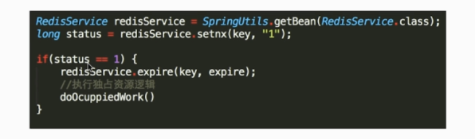


**如何通过Redis实现分布式锁**

因为上述setnx单独设置的话，可能会突然挂掉，而导致未设置过期时间，锁一直被占用。


将setnx和expire结合在一起的语句。

`SET key value [EX seconds][PX milliseconds] [NX|XX]`

- EX second: 设置键的过期时间为second秒；
- PX millisecond：设置键的过期时间为millisecond毫秒；
- NX：只在键不存在时，才对键进行设置操作；
- XX：只在键已经存在时，才对键进行设置操作；
- SET操作完成时，返回OK，否则返回nil。

```
> set locktarget 12345 ex 10 nx
OK
```


**大量的key同时过期应该注意的事项**

集中过期，由于清除大量的key很耗时，会出现短暂的卡顿现象。

- 解决方案：在设置key的过期时间的时候，给每个key加个随机值。


Redis是key-value数据库，我们可以设置Redis中缓存的key的过期时间。Redis的过期策略就是指当Redis中缓存的key过期了，Redis如何处理。

过期策略通常有以下三种：

- 定时过期：每个设置过期时间的key都需要创建一个定时器，到过期时间就会立即清除。该策略可以立即清除过期的数据，对内存很友好；但是会占用大量的CPU资源去处理过期的数据，从而影响缓存的响应时间和吞吐量。
- 惰性过期：只有当访问一个key时，才会判断该key是否已过期，过期则清除。该策略可以最大化地节省CPU资源，却对内存非常不友好。极端情况可能出现大量的过期key没有再次被访问，从而不会被清除，占用大量内存。
- 定期过期：每隔一定的时间，会扫描一定数量的数据库的expires字典中一定数量的key，并清除其中已过期的key。该策略是前两者的一个折中方案。通过调整定时扫描的时间间隔和每次扫描的限定耗时，可以在不同情况下使得CPU和内存资源达到最优的平衡效果。
  (expires字典会保存所有设置了过期时间的key的过期时间数据，其中，key是指向键空间中的某个键的指针，value是该键的毫秒精度的UNIX时间戳表示的过期时间。键空间是指该Redis集群中保存的所有键。)

Redis中同时使用了惰性过期和定期过期两种过期策略。


**Redis key的过期时间和永久有效分别如何设置？**

EXPIRE和PERSIST命令。

**我们知道通过expire来设置key的过期时间，那么对过期的数据怎么处理呢？**

常见的策略有两种：

- 定时去清理过期的缓存；
- 当有用户请求过来时，再判断这个请求所用到的缓存是否过期，过期的话就去底层系统得到新数据并更新缓存。


### 2.4 如何使用Redis做异步队列

**(1)使用List作为队列，RPUSH生产消息，LPOP消费消息。**

- 缺点：没有等待队列里有值就直接消费；
- 弥补：可以通过在应用层引入Sleep机制去调用LPOP去重试


**(2)BLPOP key [key ...] timeout：阻塞直到队列有消息或者超时**

- 缺点：只能供一个消费者消费


**(3)pub/sub：主题订阅者模式**

- 发送者(pub)发送消息，订阅者(sub)接收消息；
- 订阅者可以订阅任意数量的频道;
- 缺点：消息的发布是无状态的，无法保证可达。需要用专门的消息队列kafka

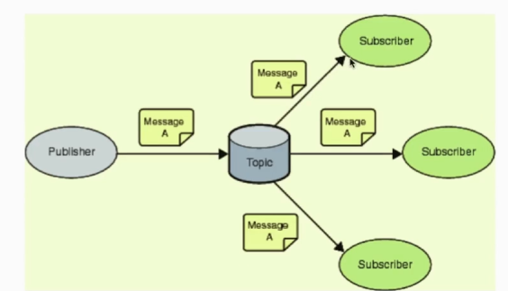

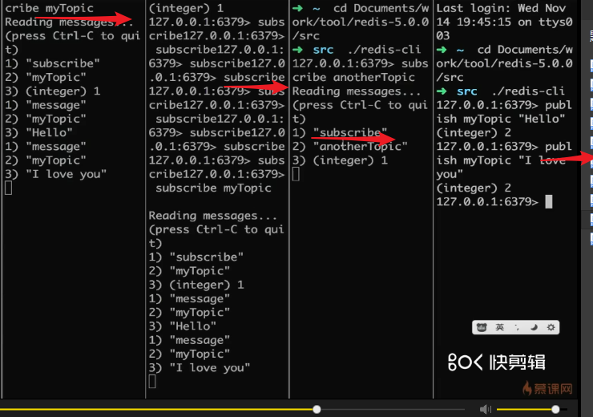

### 2.5 如何使用Redis做持久化

#### 2.5.1 持久化方式之RDB(Redis DataBase)

**RDB(快照)持久化：保存某个时间点的全量数据快照**

- SAVE：阻塞Redis的服务器进程，直到RDB文件被创建完毕；
- BGSAVE：Fork出一个子进程来创建RDB文件，不阻塞服务器进程；

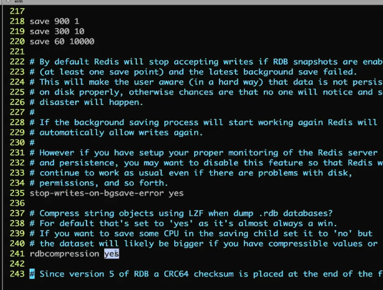


**自动化触发RDB持久化的方式**

- 根据redis.conf配置里面的SAVE m n定时出发(用的是BGSAVE)
- 主从复制时，主节点自动触发；
- 指定Debug Reload；
- 执行Shutdown且没有开启AOF持久化


**BGSAVE原理**

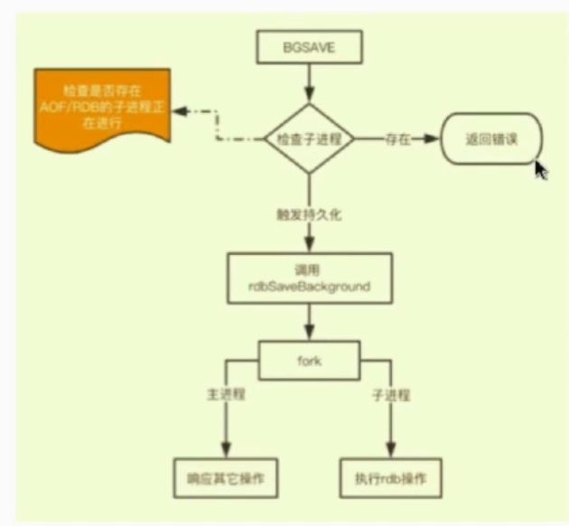

- 系统调用fork()：创建进程，实现了Copy-on-Write

  > **Copy-on-Write**
  >
  > 如果有多个调用者同时要求相同资源（如内存或磁盘上的数据存储），他们会共同获取相同的指针指向相同的资源，直到某个调用者试图修改资源的内容时，系统才会真正复制一份专用副本给调用者，而其它调用者所见到的最初的资源仍然保持不变。


**RDB持久化的缺点：**

- 内存数据的全量同步，数据量大会由于I/O而严重影响性能；
- 可能会因为Redis挂掉而丢失从当前至最近一次快照期间的数据；


#### 2.5.2 持久化方式之AOF以及混合模式（Append only File）

**AOP(Append-Only-File)持久化：保存写状态**

- 记录下除了查询以外的所有变更数据库状态的指令；
- 以append的形式追加保存到AOF文件中(增量)；

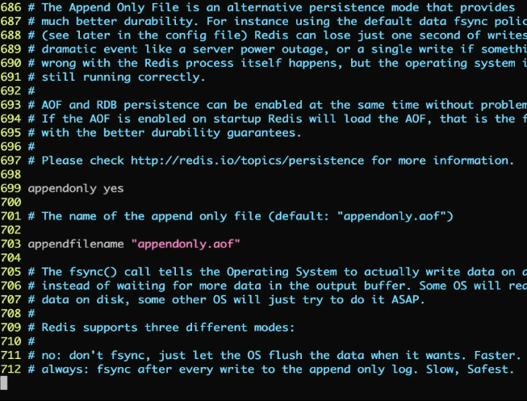


**AOP持久化文件不断增大之后如何通过日志重写来解决？**

**日志重写解决AOF文件大小不断增大的问题，原理如下：**

- 调用fork()，创建一个子进程；
- 子进程把新的AOF写到一个临时文件里，不依赖原来的AOF文件；
- 主进程持续将新的变动同时写到内存和原来的AOF里；
- 主进程获取子进程重写AOF的完成信号，往新AOF同步增量变动；
- 使用新的AOF文件替换掉旧的AOF文件；


**RDB和AOF文件共存情况下的恢复流程**

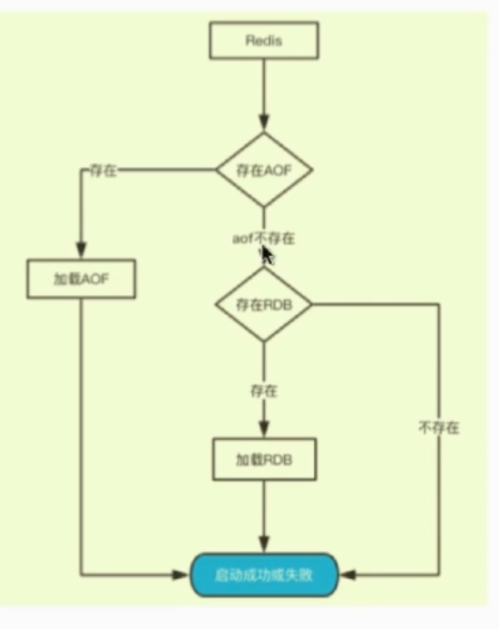


**RDB和AOF的优缺点和应用场景：**

`RDB是Redis默认的持久化方案。在指定的时间间隔内，执行指定次数的写操作，则会将内存中的数据写入到磁盘中。即在指定目录下生成一个dump.rdb文件。Redis重启会通过加载dump.rdb文件恢复数据。`

**触发RDB快照：**

- **在指定的时间间隔内，执行指定次数的写操作；**
- **执行save(阻塞，只管保存快照，其他的等待)或者是bgsave(异步)命令；**
- **执行flushall命令，清空数据库所有数据，意义不大；**
- **执行shutdown命令，保证服务器正常关闭且不丢失任何数据，意义也不大；**

**通过RDB文件恢复数据：**

将dump.rdb文件拷贝到redis的安装目录的bin目录下，重启redis服务即可。

**RDB的优缺点：**

优点：

- **适合大规模的数据恢复；**
- **如果业务对数据完整性和一致性要求不高，RDB是很好的选择；**

缺点：

- **数据的完整性和一致性不高，因为RDB可能在最后一次备份时宕机了；**
- **备份时占用内存，因为Redis在备份时会独立创建一个子进程，将数据写入到一个临时文件（此时内存中的数据是原来的2倍），最后再将临时文件替换之前的备份文件。**


> AOF在Redis中默认不开启，它的出现是为了弥补RDB的不足(数据的不一致)，所以其采用日志的形式来记录每个写操作，并追加到文件中。

**触发AOF快照：**

根据配置文件触发，可以是每次执行触发，也可以是每秒触发，可以不同步。

**根据AOF文件恢复数据**

正常情况下，可以将appendonly.conf文件拷贝到redis的安装目录的bin目录下即可。

**AOF的重写机制**

**AOF的工作原理是将写操作追加到文件中，文件中的冗余内容会越来越多，所以Redis新增了重写机制。当AOF文件的大小超过所设定的阈值时，Redis就会对AOF文件的内容压缩。**

重写的原理：**Redis会fork出一条新进程，读取内存中的数据，并重写写到一个临时文件，并没有读取旧文件。最后替换旧的AOF文件。**

触发机制：当AOF文件大小是上次rewrite后大小的一倍且文件大于64M时触发。

**AOF的优缺点：**

优点：数据的完整性和一致性更高；

缺点：因为AOF记录的内容多，文件也会越来越大，数据恢复也越来越慢。


#### 2.5.3 总结

- **Redis默认开启RDB持久化方式**，在指定的时间间隔内，执行指定次数的写操作，将内存中的数据写入到磁盘中；
- **RDB持久化适合大规模的数据恢复但它的数据一致性和完整性较差；**
- **Redis需要手动开启AOF持久化方式，默认是每秒将写操作日志追加到AOF文件中**
- **AOF的数据完整性比RDB高，但记录内容也多，会影响数据恢复效率；**
- **Redis针对AOF文件大的问题，提供重写的瘦身机制；**
- **若只打算用Redis做缓存，可以关闭持久化。**
- 若 打算使用Redis的持久化。**建议RDB和AOF否开启。其实RDB更适合做数据的备份，留一后手.AOF出问题，还有RDB。**


- AOP文件比RDB更新频率高，优先使用AOP还原数据；
- AOP比RDB更安全也更大；
- RDB性能比AOP好；
- 如果两个都配了优先加载AOF;


### 2.6 使用Pipleline以及主从同步

**使用Pipeline的好处**

- Pipeline和linux的管道类似；
- Redis基于请求/响应模型，单个请求处理需要一一应答；
- Pipeline批量执行指令，节省多次IO往返的时间；
- 有顺序依赖的指令建议分批发送；


**Redis的同步机制**

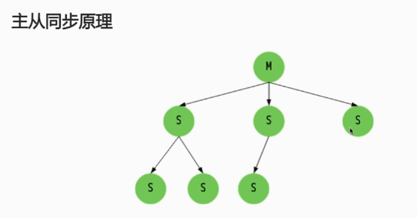

- Salve发送sync命令到Master；
- Master启动一个后台进程，将Redis中的数据快照保存到文件中；
- Master将保存数据快照期间接受到的写命令缓存起来；
- Master完成写文件操作后，将该文件发送给Salve；
- 使用新的AOF文件替换掉旧的AOF文件；
- Master将这期间收集到的增量写命令发送给Salve端；


**增量同步过程：**

- Master接收到用户的操作指令，判断是否需要传播到Slave；
- 将操作记录追加到AOF文件；
- 将操作传播到其它Slave：
  - 对齐主从库；
  - 往响应缓存写入指令；
- 将缓存中的数据发送给Slave；


**Redis Sentinel**

**解决主从同步Master宕机后的主从切换问题：**

- 监控：检查主从服务器是否运行正常；
- 提醒：通过API向管理员或其它应用程序发送故障通知；
- 自动故障迁移：主从切换


**流言协议Gossip**

> 在杂乱无章中寻求一致

- 每个节点都随机地与对方通信，最终所有节点的状态达成一致；

- 种子结点定期随机向其他结点发送结点列表以及需要传播的消息；

- 不保证信息一定会传递给所有节点，但是最终会趋于一致

  

### 2.7 Redis集群 （一致性哈希算法）

#### 2.7.1 如何从海量数据里快速找到所需？

- **分片：**按照某种规则去划分数据，分散存储在多个节点上；
- 常规的按照哈希划分无法实现节点的动态增减；


**Redis的集群原理**

一致性哈希算法：对2^32取模，将哈希值空间组织成虚拟的圆环。

**将数据key使用相同的函数hash计算出哈希值。**

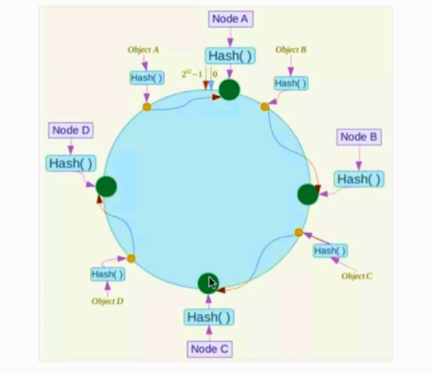


### 2.8 Redis缓存和持久化数据怎么做扩容?

- 如果Redis被当做**缓存**使用，则使用**一致性哈希实现动态扩容缩容**；
- 如果Redis被当做一个**持久化存储**使用，必须使用固定的keys-to-nodes映射关系，节点的数量一旦确定不能变化。否则的话，必须使用在运行时进行数据再平衡的一套系统，而目前只有**Redis集群**可以做到这样。


### 2.9 Mysql里有2000w数据，redis中只存20w的数据，如何保证redis中的数据都是热点数据？

redis内存数据集大小上升到一定大小的时候，就会实行数据淘汰策略。

**Redis的内存淘汰策略**是指在Redis的用于缓存的内存不足时，怎么处理需要新写入且需要申请额外空间的数据。

**Redis的内存淘汰策略**的选取并不会影响过期的key的处理。**内存淘汰策略**用于处理内存不足时的需要申请额外空间的数据；**过期策略**用于处理过期的缓存数据。

### 2.10 Redis的内存用完了会发生什么？

如果达到设置的上限，Redis的写命令会返回错误信息（但是读命令还可以正常返回）。或者可以设置内存淘汰机制，当Redis达到内存上限时会冲刷掉旧的内容。

### 2.11 Redis如何做内存优化？

尽可能使用散列表，散列表(指的是散列表里面存储的数据少的情况)使用内存非常小，应该尽可能的将你的数据模型抽象到一个散列表中。比如你的web系统中有一个用户对象，不要为这个用户的名称，姓氏，邮箱，密码设置单独的key，而是应该把这个用户的所有信息存储到一张散列表里面

### 2.12 Redis-事务

#### 2.12.1 什么是事务

事务是一个单独的隔离操作：事务中的所有命令都会序列化、按顺序执行。事务在执行过程中，不会被其他客户端发送来的命令请求所打断。

**事务是原子操作：事务中的命令要么全部被执行，要么全部都不执行。**

> Redis事务就是**一次性、顺序性、排他性**的执行一个队列中的一系列命令；

#### 2.12.2 Redis事务相关

Redis事务的三个阶段：

- **事务开始MULTI;**
- **命令入队；**
- **事务执行EXEC；**

事务执行过程中，如果服务端收到有EXEC、DISCARD、WATCH、MULTI之外的请求，将会把请求放入队列中排队


Redis会将一个事务中的所有命令序列化，之后按顺序执行。

- **Redis不支持回滚。**“Redis在事务事务失败时不进行回滚，而是继续执行余下的命令”，所以Redis的内部可以保持简单且快速。
- **如果在一个事务中的命令出现错误，那么所有的命令都不会执行；**
- **如果在一个事务中出现运行错误，那么正确的命令会被执行**

#### 2.12.3 Redis事务保证原子性吗？支持回滚吗？

Redis中，单条命令是原子性执行的，但**事务不保证原子性，且没有回滚。**事务中任意命令执行失败。其余的命令仍会被执行。

### 2.13 Redis集群方案

#### 2.13.1 哨兵模式


**哨兵介绍**

sentinel，中文名是哨兵。哨兵是redis集群机构中非常重要的一个组件，主要有以下功能：

- **集群监控：**负责监控redis master和slave进程是否正常工作；
- **消息通知：**如果某个redis实例有故障，那么哨兵负责发送消息作为报警通知给管理员；
- **故障转移：**如果master node挂掉了，会自动转移到slave node上；
- **配置中心：**如果故障转移发生了，通知client客户端新的master地址。

**哨兵用于实现redis集群的高可用**

其本身也是分布式的，作为一个哨兵集群去运行，互相协同工作。

- 故障转移时，判断一个master node是否宕机了，需要大部分的哨兵都同意才行，涉及到了分布式选举的问题；
- 即使部分哨兵节点挂掉了，哨兵集群还是能正常工作的。

**哨兵的核心知识**

- 哨兵至少需要3个实例，来保证自己的健壮性；
- **哨兵+redis主从**的部署架构，是**不保证数据零丢失的**，其**只能保证redis集群的高可用性；**
- 对于哨兵+redis主从这种复杂的部署架构，尽量在测试环境和生产环境，都进行充足的测试和演练。

#### 2.13.2 Redis Cluster的分布式寻址算法hash slot

> 分布式寻址算法：
>
> - **hash算法(大量缓存重建)**；
> - **一致性hash算法(自动缓存迁移)** + **虚拟节点(自动负载均衡)**；
> - **redis cluster的hash slot算法**

##### 1.hash算法

来了个请求，首先**对key计算hash值，然后对节点数取模，之后将请求打在不同的master节点**上。

**存在的问题**

一旦某一个master节点宕机，所有新请求都会基于最新的剩余master节点数去取模，而取不到有效缓存，导致大量的流量涌入数据库。


##### 2.一致性哈希算法

将整个hash值空间组织成一个虚拟的圆环，整个空间按顺时针方向组织，下一步将各个master结点（使用服务器的ip或主机名）进行hash。这样就能确定每个结点在其哈希环上的位置。

首先计算数据的hahs值，从而确定此数据在环上的位置，从此位置沿顺时针“行走”，遇到的第一个master结点就是key所在的位置。


**优势**

在一致性哈希算法中，如果一个结点挂了，受影响的数据仅仅是此节点到环空间前一个结点（沿着逆时针方向行走遇到的第一个结点）之间的数据，其它不受影响。增加一个节点也同理。

**存在的问题**

一致性哈希算法在节点太少时，容易因为节点分布不均匀而造成缓存热点的问题。

**应对方案**

为了解决这种热点问题，**一致性hash算法引入了虚拟节点机制**，即对每一个结点计算多个hash。每个计算结果位置的都放置一个虚拟结点。这样就实现了数据的均匀分布了，负载均衡了。

##### 3.redis cluster的hash slot算法(虚拟桶)

redis cluster有固定的16384个hash slot，对每个key计算CRC16(循环冗余检验码)，然后对16384取模，可以获取key对应的hash slot。

redis cluster中每个master都会持有部分slot，比如有3个master的话，那么可能每个master持有5000多个hash slot，而有了hash slot之后让node的增加和移出很简单：

- 增加一个master，就让其他master的hash slot移动部分过去；
- 减少一个master，就将它的hash slot移动到其他master上去；

**优势**

移动hash slot的成本是非常低的。任何一台机器宕机，其余结点不受影响的。因为key找的是hash slot，而不是机器。


#### 2.13.3 Redis的主从架构

单机的redis，能够承载的QPS大概在上万到几万之间不等。对于缓存来说，一般都是用来支撑读高并发的。因此架构做成主从(master-slave)架构，一主多从。主负责写，并且将数据复制到其它slave节点上；从节点负责读，所有的读请求全部走从节点。这样可以很轻松实现水平扩容，支撑高并发。


**redis replication：一主多从，slave node之间也可以互相连接**


- redis采用异步方式复制数据到slave节点，不过redis2.8开始，slave node会周期性确认自己每次复制的数据量；
- 一个master node是可以配置多个slave node的；
- slave node也可以连接其他的slave node；
- slave node 做复制的时候，不会阻塞master node的正常工作；
- slave node做复制的时候，也不会阻塞对自己的查询操作，它会用旧的数据集提供服务；但是复制完成之后，需要删除旧数据集，加载新的数据集，这个时候就会暂停对外服务；


> **1.Redis replication如何实现高可用？**
>
> 如果master挂掉了，那么可以**提升一个slave作为新的master**，进而实现故障转移。
>
> **2.Redis的master node必须做持久化？**
>
> 使用主从架构，**必须开启master node的持久化**！不建议用slave node作为master node的数据热备份。
>
> 因为如果master的持久化关闭，可能在master宕机重启的时候数据是空的，此时就会将空数据复制到slave中，导致slave数据也消失。
>
> **3.master node必须做好备份方案？**
>
> **使用主从架构，master要做好各种备份方案，如果本地的所有文件丢失了;**，可以从备份中挑选一份rdb去恢复master， 这样才能确保master启动的时候，能从rdb、aof文件中加载数据，保证master有数据，从而也保证了各个slave node有数据。
>
> 即使采用了**哨兵sentinel高可用机制**，slave node可以自动接管master node，但是也可能sentinel还没有检测到master failure，master node就自动重启了，还是可能导致上面的所有slave node数据清空故障


**Redis主从复制原理以及过程**


过程原理：

- 当从库和主库建立关系后，slave node会发送一个`PSYNC`命令给master node。此时slave node仅保存master node的信息，包括master node的host和ip。
- 主库接受到`PSYNC`命令后会开始保存快照(RDB持久化过程)，并将期间接收到的写命令缓存起来；
- 当快照完成后，主Redis会将快照文件和所有缓存的写命令发送给从Redis
- 当从Redis接收到后，会载入快照文件并且执行收到的缓存的命令；
- 之后，主Redis每当接收到写命令时就会将命令发送给从Redis，从而保证数据的一致；
- 如果slave node跟master node遇到网络故障，断开了连接，会自动重连，连接之后master nod仅会复制给slave缺少的部分数据；

> **数据同步相关的核心机制**
>
> （1）**master和slave都会维护一个offset：维护数据不一致的情况**
>
> - master会在自身不断累加offset，slave也会在自身不断累加offset；
> - slave每秒都会上报自己的offset给master，同时master也会保存每个slave的offset；
>
> （2）**backlog：记录复制点，方便后期的增量复制**
>
> - master node有一个backlog，默认 是1MB大小；
> - master node给slave node复制数据时，也会将数据在backlog中同步写一份；
> - backlog主要是用来做全量复制中断网后的增量复制；
>
> （3）master run id：用于slave node定位master node；
>
> **增量复制**
>
> - 如果全量复制过程中，master-slave网络连接断掉，那么slave重新连接master时，会触发增量复制；
> - master直接从字节的backlog中获取部分丢失的数据，发送给slave node，默认backlog就是1MB；
> - master就是根据slave发送的psync中的offset来从backlog中获取数据的；
>
> **异步复制**
>
> master每次接收到写命令之后，先在内部写入数据，然后异步发送给slave node。
>
> **主从复制的断点续传**
>
> 从redis 2.8开始，redis 就支持主从复制的断点续传，如果主从复制过程中，网络连接断掉了，那么可以接着上次复制的地方，继续复制下去，而不是从头开始复制一份。 

### 2.14 Redis分区

#### 2.14.1 Redis是单线程的，如何提高多核CPU的利用率？

可以**在同一个服务器部署多个Redis的实例，并把他们当做不同的服务器来使用**，在某些时候，无论如何一个服务器是不够的。所以，如何你想使用多个CPU，你可以考虑一下**分片(shard)**。

#### 2.14.2 为什么要做Redis分区

**分区可以让Redis管理更大的内存**，Redis将可以使用所有机器的内存。如果没有分区，你最多只能使用一台机器的内存。分区使Redis的计算能力通过简单地增加计算机得到成倍提升，Redis的网络带宽也会随着计算机和网卡的增加而成倍增长。分区是分割数据到多个Redis实例的处理过程，因此每个实例只保存key的一个子集。

**分区的优势**

- 通过利用多台计算机内存的和值，允许我们构造更大的数据库。
- 通过多核和多台计算机，允许我们扩展计算能力；通过多台计算机和网络适配器，允许我们扩展网络带宽。

### 2.15 Redis缓存

#### 2.15.1 缓存雪崩

缓存雪崩是指**缓存同一时间大面积的失效，导致后面的请求都会落到数据库上，造成数据库短时间内承受大量请求而崩掉。**

**解决方案：**

- **缓存数据的过期时间设置随机，防止同一时间大量数据过期现象发生；**
- 一般并发量不是特别多的时候，使用最多的解决方案是加锁排队；
- 给一个缓存数据增加相应的缓存标记，记录缓存的是否失效，如果缓存标记失效，则更新数据缓存。

#### 2.15.2 缓存穿透

**缓存穿透**是指缓存和数据库中都没有的数据，导致所有的请求都落到数据库上，造成数据库短时间内承受大量请求而崩掉。

**解决方案：**

- 接口层增加校验，如用户鉴权校验，id做基础校验，id<=0的直接拦截；
- 缓存层缓存控制，将数据库中的空值也缓存到缓存层中，这样查询该控制就不会再访问数据库，而是直接在缓存层访问就行。但是有弊端就是缓存太多空值占用了更多的空间，这里可以通过给缓存层空值设立一个较短的过期时间来解决，例如60s。
- 采用**布隆过滤器**，**将所有可能存在的数据哈希到一个足够大的 bitmap 中，一个一定不存在的数据会被这个 bitmap 拦截掉，从而避免了对底层存储系统的查询压力**

> **有关布隆过滤器的原理**
>
> 对一个key进行k个hash算法获取k个值，在比特数组中将这k个值散列后设定为1，然后查的时候如果这几个特定几个位置都为1，那么布隆过滤器会判断该key存在。
>
> 当然布隆过滤器可能会误判，如果它说不存在那肯定不存在，如果它说存在，其实数据有可能实际不存在；
>
> Redis的bitmap支持2^32大小，对应到内存也就是512MB，误判率万分之一，可以放下2亿左右的数据，性能高，空间占用率极小，省去了大量无效的数据库连接。
>
> **布隆过滤器-推荐去重**
>
> 例如新闻客户端的推送去重功能，当推荐系统推荐新闻时会从每个用户的历史记录里进行筛选，过滤掉那些已经存在的记录。
>
> 用户游览记录存入数据库时，会在Filter上通过key的hash算法判断其是否存在，避免了每次判断数据是否存在都要去数据库exist一遍；这样推送新闻时通过布隆过滤器判断，推送内存是否已经存在，如果存在则不推送，如果不存在则推送；

#### 2.15.3 缓存击穿

**缓存击穿**是指缓存中没有但数据库中有的数据（一般是指缓存时间到期），这是由于并发用户特别多，同时读缓存没读到的数据，又同时去数据库去取数据，引起的数据库压力瞬间增大，造成过大压力。**和缓存雪崩不同的是，缓存击穿指并发查同一条数据，缓存雪崩是不同数据都过期了，很多数据都差不多从而查询数据库。**

**解决方案：**

- 设置热点数据永远不过期；
- 加互斥锁；

#### 2.15.4 缓存预热

**缓存预热**就是系统上线后，将相关的缓存数据直接加载到缓存系统。这样就可以避免在用户请求的时候，先查询数据库，然后再将数据缓存的问题！用户直接查询事先被预热的缓存数据！

**解决方案：**

- 直接写个缓存刷新页面，上线时手工操作一下；
- 数据量不大，可以在项目启动的时候自动进行加载；
- 定时刷新缓存；

#### 2.15.5 热点数据和冷数据

热点数据，缓存才有价值；

对于冷数据而言，大部分数据可能还没有再次访问到就已经被挤出内存，不仅占用内存，而且价值不大。

对于热点数据，比如某IM产品，生日祝福模块，当天的寿星列表，缓存以后可能读取数十万次。

比如某助手产品的，点赞数、收藏数、分享数等都是非常典型的热点数据，但是又不断变化，此时就需要将数据同步保存到Redis缓存，减少数据库压力。

#### 2.15.6 缓存热点key

**缓存中的一个key（比如一个促销商品），在某个时间点过期的时候，恰好在这个时间点对这个key有大量的并发请求打过来**，这些请求发现发现缓存过期一般都会从后端DB加载数据并回设到缓存，这个时候大把并发的请求可能会瞬间把后端的数据库压垮。

**解决方案：**

对缓存查询加锁，如果key不存在，就加锁，然后查数据库如缓存，然后解锁；其他进程如果发现有锁就等待，然后等解锁后返回数据或者进入DB查询。

## 2.16 其它问题

#### 2.16.1 如何保证缓存与数据库双写时的数据一致性？

| 问题场景                                       | 描述                                                         | 解决                                                         |
| ---------------------------------------------- | ------------------------------------------------------------ | ------------------------------------------------------------ |
| 先写缓存，再写数据库，缓存写成功，数据库写失败 | 缓存写成功，但写数据库失败或者响应延迟，则下次读取（并发读）缓存时，就出现脏读 | 这个写缓存的方式，本身就是错误的，需要改为先写数据库，把旧缓存置为失效；读取数据的时候，如果缓存不存在，则读取数据库再写缓存 |
| 先写数据库，再写缓存，数据库写成功，缓存写失败 | 写数据库成功，但写缓存失败，则下次读取（并发读）缓存时，则读不到数据 | 缓存使用时，假如读缓存失败，先读数据库，再回写缓存的方式实现 |
| 需要缓存异步刷新                               | 指数据库操作和写缓存不在一个操作步骤中，比如在分布式场景下，无法做到同时写缓存或需要异步刷新（补救措施）时候 | 确定哪些数据适合此类场景，根据经验值确定合理的数据不一致时间，用户数据刷新的时间间隔 |

#### 2.16.2 假如Redis里面有1亿个key，其中有10w个key是以某个固定的已知的前缀开头的，如何将它们全部找出来？

**使用keys指令可以扫出指定模式的key列表；**

但如果这个redis正在给线上的业务提供服务，那使用keys会有什么问题？

**redis是单线程的。keys指令会导致线程阻塞一段时间，线上服务会停顿，直到指令执行完毕，服务才能恢复。**

**可以使用scan指令**，scan指令可以无阻塞的提取出指定模式的key列表，但是会有一定的重复概率，在客户端做一次去重就可以了，当然整体所花费的时间会比直接用keys指令长。

#### 2.16.3 使用Redis做过异步队列吗？是如何实现的？

**使用list类型保存数据信息，rpush生产消息，lpop消费消息，当lpop没有消息时，可以sleep一段时间，然后再检查有没有信息，如果不想sleep的话，可以使用blpop, 在没有信息的时候，会一直阻塞，直到信息的到来。redis可以通过pub/sub主题订阅模式实现一个生产者，多个消费者，当然也存在一定的缺点，当消费者下线时，生产的消息会丢失。**

#### 2.16.4 Redis如何实现延时队列

使用**sortedset**，使用时间戳做**score**, 消息内容作为**key**,调用zadd来生产消息，消费者使用zrangbyscore获取n秒之前的数据做轮询处理。

#### 2.16.5 Redis回收使用的是什么算法？

**LRU算法。**

实现 LRUCache 类：

- LRUCache(int capacity) 以正整数作为容量 capacity 初始化 LRU 缓存；
- int get(int key) 如果关键字 key 存在于缓存中，则返回关键字的值，否则返回 -1 。
- void put(int key, int value) 如果关键字已经存在，则变更其数据值；如果关键字不存在，则插入该组「关键字-值」。当缓存容量达到上限时，它应该在写入新数据之前删除最久未使用的数据值，从而为新的数据值留出空间。

**直接继承LinkedHashMap来实现**

```java
public class Code_LRU {
	class LRUCache extends LinkedHashMap<Integer,Integer>{
		private int capacity;
		public LRUCache(int capacity) {
			super(capacity,0.75F,true);
			this.capacity = capacity;
		}
		
		public int get(int key) {
			return super.getOrDefault(key,-1);
		}
		public void put(int key,int value) {
			super.put(key, value);
		}
		
		// 重写淘汰策略
		protected boolean removeEldestEntry(Map.Entry<Integer, Integer> edlest) {
			return size()>capacity;
		}
	}
}

```

**用双向链表+hashMap来实现**

```java
// 解题思路：双向链表+hashmap来实现
	class LRUCache_2{
		// 双向链表
		class DLinkedNode{
			int key;
			int value;
			DLinkedNode prev;
			DLinkedNode next;
			public DLinkedNode() {
				
			}
			public DLinkedNode(int key,int value) {
				this.key = key;
				this.value = value;
			}
		}
		
		// hashmap
		private HashMap<Integer,DLinkedNode> cache = new HashMap<>();
		// 定义私有变量
		private int size;
		private int capacity;
		private DLinkedNode head,tail;
		
		public LRUCache_2(int capacity) {
			this.size = 0;
			this.capacity = capacity;
			// 生成伪头部和伪尾部结点
			head = new DLinkedNode();
			tail = new DLinkedNode();
			head.next = tail;
			tail.prev = head;
		}
		
		//获得值
		public int get(int key) {
			DLinkedNode node = cache.get(key);
			if(node==null) {
				return -1;
			}else {
				// 如果key存在，哈希表定位 结点移动到头部
				moveToHead(node);
				return node.value;
			}
		}
		
		// 放入值的操作
		public void put(int key,int value) {
			DLinkedNode node = cache.get(key);
			// 如果key不存在
			if(node==null) {
				// 新创建一个结点
				DLinkedNode newNode = new DLinkedNode(key,value);
				// 添加
				cache.put(key,newNode);
				// 添加到头部
				addToHead(newNode);
				++size;
				// 判断容量
				if(size>capacity) {
					// 称号出容量
					DLinkedNode tail = removeTail();
					// 删除hash表中对应的项
					cache.remove(tail.key);
					--size;
				}
				
			}else {
				node.value = value;
				// 移动
				moveToHead(node);
			}
		}
		
		// 添加结点的操作
		private void addToHead(DLinkedNode node) {
			node.prev = head;
			node.next = head.next;
			head.next.prev = node;
			head.next = node;
		}
		
		// 删除结点
		private void removeNode(DLinkedNode node) {
			node.prev.next = node.next;
			node.next.prev = node.prev;
		}
		
		// 移动到头结点 删结点 填充结点
		private void moveToHead(DLinkedNode node) {
			removeNode(node);
			addToHead(node);
		}
		// 删除尾部结点
		private DLinkedNode removeTail() {
			DLinkedNode res = tail.prev;
			removeNode(res);
			return res;
		}
	}

```

