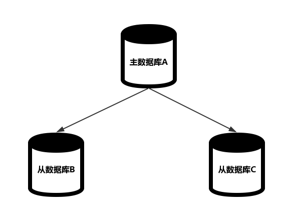
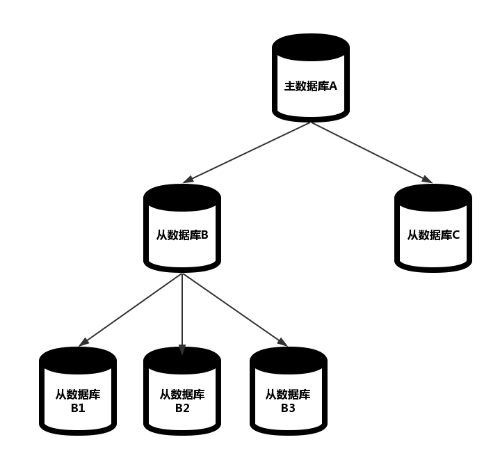
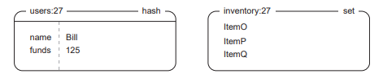
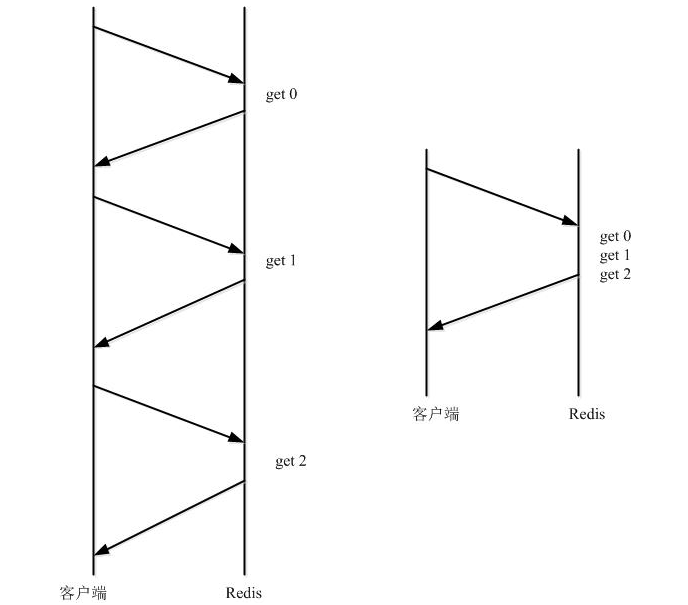

# Redis安全与性能


# 一、Redis持久化（RDB,AOF）

Redis 提供了两种不同的持久化方法将数据存储到硬盘中：

- 快照`snapshot`
  - 将某一时刻的所有数据都写入硬盘中
- 只追加文件`append-only file`
  - 将某一时间段执行的写命令都写入硬盘中

## 1.1 RDB持久化

`Redis `通过创建快照来保存在某个时间点上的数据集，根据配置，快照会被写入 `dbfilename` 选项指定的文件中，并存储在 `dir` 选项执行的路径。

可以通过以下几种方式创建快照：

- 通过客户端发送 `BESAVE` 命令
  - Redis 会创建一个子进程负责创建快照，父进程则继续处理命令请求
- 通过客户端发送 `SAVE` 命令
  - 父进程负责创建快照，在快照创建完毕之前都不再响应命令请求
- 通过配置文件中的 `save` 选项
  - 例如：`save 60 10000` 指自上一次创建快照后`60` 秒内有 `10000` 次写入
- 正常终止 `Redis `服务器时，将会在执行完 `SAVE` 命令后关闭服务器
- 执行复制时

虽然 `BESAVE` 命令可以创建子进程来创建快照，不影响父进程继续响应命令请求，但在数据量极大时（例如：占用内存大于`10GB`），`Redis `可能会因为创建子进程而出现停顿。这时你可以考虑手动执行 `SAVE` 命令来进行持久化，`SAVE` 命令不需要创建子进程，且没有资源争夺，所以创建快照的速度会比 `BESAVE` 快。

由于快照只在一定时间点才会被创建，所以如果系统崩溃，用户将会丢失**自最近一次生成快照后更新的**所有数据。如果你的应用丢失一些数据也不会引起问题，那么你可以使用 `RDB` 持久化；如果你的应用需要尽量避免在服务器故障时丢失数据，那么你可以使用 `AOF` 进行持久化。

 

## 1.2 AOF持久化

`AOF` 持久化会将所有被执行的写命令都写入到 `AOF` 文件的末尾，从而记录数据的变化。在需要恢复时，`Redis `只需从头至尾的执行一遍 `AOF` 文件的所有命令，都可以得到故障前的数据集。要使用 `AOF` 持久化，需要在配置文件 `redis.conf` 中设置 `appendonly yes` 选项。使用 `AOF` 持久化会让 `Redis `变得非常耐久。

`Redis `提供了三种同步选项（`appendfsync`）：

| 选项       | 同步频率                   |
| ---------- | -------------------------- |
| `always`   | 每个写命令后同步           |
| `everysec` | 每秒执行一次同步           |
| `no`       | 由操作系统决定何时执行同步 |

默认的同步策略为 `everysec`，在这种配置下，`Redis `仍然可以保持良好的性能，并且就算发生故障停机，也最多只会丢失一秒钟的数据，与 `RDB` 一样，`AOF` 同步也会在后台线程执行，所以主线程可以继续处理命令请求。兼顾数据安全与写入性能，我们推荐使用 `everysec` 选项。

需要提醒的是，虽然使用 `always` 同步策略会使得每个 `Redis `写命令都会同步写入硬盘，从而在系统故障时数据丢失的也就会最少。但这种同步策略需要对硬盘进行大量的写入，所以 `Redis `处理命令请求的速度就会受到硬盘性能的限制。

如果你使用的 `no` 选项，那么 `Redis `将不会对 `AOF` 文件执行显式地同步操作，同步何时进行将会由操作系统决定。该选项可能会导致系统故障时丢失较多的数据，所以一般不推荐使用该选项。

`AOF` 持久化灵活的提供了多种同步策略以满足不同应用程序的需求，但`AOF` 也有缺陷，那就是 `AOF` 文件的体积大小。


随着 `Redis `的不断运行，`Redis `会不断将被执行的写命令记录到 `AOF` 文件的末尾，`AOF` 文件的体积将会不断增长，极端情况下甚至会用完硬盘的所有可用空间。同时，随着 `AOF` 文件的不断增大，在恢复数据时，所需的还原操作执行时间也就不断增长。

所以 `Redis `提供了 `BGREWRITEAOF` 命令，在后台对 `AOF` 进行重写。该命令会移除 `AOF` 文件中的冗余命令，使得重写后的新 `AOF` 文件仅包含恢复当前数据集所需的最小命令集合。重写的工作过程和 `BESAVE` 创建快照的过程类似：

- 创建子进程
- 子进程将新 `AOF` 文件的内容写入到临时文件
- 对所有新执行的写入命令，父进程将它们：
  - 累积到一个内存缓存中
  - 追加到现有 `AOF `文件的末尾
- 子进程完成重写工作时，父进程将内存缓存中的所有命令追加到新 `AOF` 文件的末尾
- 暂停响应命令请求，使用新文件替换旧文件
- 恢复响应命令请求


整个重写操作是绝对安全的，因为 `Redis `在创建新 `AOF` 文件的过程中，会继续将命令追加到现有的 `AOF` 文件里面，即使重写过程中发生停机，现有的 `AOF` 文件也不会丢失。 而一旦新 `AOF` 文件创建完毕，`Redis `就会从旧 `AOF` 文件切换到新 `AOF` 文件，并开始对新 `AOF` 文件进行追加操作。

## 1.3 RDB与AOF的比较

| 持久化方法 | 优点                                                         | 缺点                                                         |
| ---------- | ------------------------------------------------------------ | ------------------------------------------------------------ |
| `RDB`      | 快照文件十分紧凑，适合用于备份，进而可用作容灾 最大化 `Redis `性能，子进程负责创建快照，不影响父进程 使用 `RDB` 恢复大数据集时比 `AOF` 快 | 系统故障时会丢失上一次创建快照后写入的所有数据               |
| `AOF`      | 使 `Redis `十分耐久 `AOF` 文件易于分析，导出和人工处理       | `AOF` 文件体积大 `AOF`速度较慢 个别命令可能引发无法恢复数据集（例如：`BRPOPLPUSH` 命令） |

# 二、复制

通过持久化，`Redis` 保证了在服务器重启的情况下也不会损失（或少量损失）数据。但现在数据仍然是存储在一台服务器上的，如果这台服务器的硬盘出现故障，数据就会丢失。

为了避免上述的单点故障，复制是不可或缺的，我们可以将数据库的多个副本部署在不同的服务器上，这样即使一台服务器出现故障，其他服务器仍然可以继续提供服务。为此，`Redis` 提供了复制特性

数据库分为两类，一类是主数据库（`master`），一类是从数据库（`slave`）。一般，主数据库可以进行读写操作，从数据库只可进行读操作。当主数据库因为写操作导致数据变化时，会向从数据库发送更新，及时更新从数据库。主数据库和从数据库之间的关系如下：



## 1.1 复制的配置

在 `Redis `中使用复制很简单，只需要在从数据库的配置文件中加入 `slaveof host port`，其中：

- `host` 是主数据库地址。
- `port` 是主数据库端口。

这样 `Redis `服务器会根据该选项连接给定的主数据库。

对于运行中的 `Redis `服务器，我们可以通过客户端发送 `SLAVEOF no one` 命令停止与主数据库的同步，不再接受主数据库的数据更新；也可以通过 `SLAVEOF host port` 命令让该服务器开始复制制定的数据库。

## 1.2 复制的执行过程

从数据库连接主数据库时，主从数据库执行的所有操作（复制初始化）如下：

| 步骤 | 主数据库操作                                                 | 从数据库操作                                       |
| ---- | ------------------------------------------------------------ | -------------------------------------------------- |
| `1`  | （等待命令）                                                 | 连接主数据库，发送 `SYNC` 命令                     |
| `2`  | 执行 `BESAVE` 命令，使用内存缓冲区记录 `BESAVE` 命令后执行的所有写命令 | 根据配置选项响应客户端命令请求                     |
| `3`  | 向从数据库发送快照文件，继续使用内存缓冲区记录期间执行的所有写命令 | 清空旧数据，载入主数据库发来的快照文件             |
| `4`  | 向从数据库发送存储在内存缓冲区的写命令                       | 从数据库恢复完毕，接收客户端命令请求               |
| `5`  | 执行的所有写命令同步发送给从数据库                           | 执行内存缓冲区的写命令，并接收主数据库发来的写命令 |

> **乐观复制**

> Redis 采用了乐观复制的复制策略，其容忍一定时间内的主从数据库不同步，但两者的数据最后将是同步的。

> 这是由于主从数据库之间的复制过程是异步过程导致的，但这也保证了复制过程不会对主数据库性能造成影响。

## 1.3 主从链

从数据库不仅可以接收主数据库的同步数据，还可以同时作为主数据库存在，拥有自己的从数据库，从而构成主从链（`master-slave chaining`）。



数据库 `A` 的数据会同步到 `B` 和 `C` 中，而数据库 `B` 中的数据会同步到数据库 `B1`，`B2`，`B3` 中。

这种树形结构对于 `Redis `复制来说是合理且可行的，中间一层的主从节点（`master/slave node`）会帮助主数据库分担复制工作，加快主数据库的同步到多个从数据库的速度。

基于这种结构，我们还可以实现读写分离，以提高服务器的负载能力。大多数的应用场景中，读的频率大于写，当单个 `Redis `实例无法应对大量的读请求时，我们可以通过建立上面的主从链结果，其中主数据库只负责写操作，从数据库只负责读操作。

## 1.4 从数据持久化

主数据库可以通过主从关系同步数据给从数据库，为了增强 `Redis `对于系统崩溃的抵抗能力，我们在从数据库上配合使用 `AOF` 持久化，在每个从数据库上设置 `appendonly yes` 和 `apendfsync everysec` 选项让多个从数据库以每秒一次的频率将数据持久化到硬盘上。同时我们禁用主数据库持久化（包括`RDB`和`AOF`持久化）。

这样当从数据库发生故障重启时，主数据库会自动将数据同步到从数据上；而主数据库发生故障时，则需要我们手工处理：

- 选择一个从数据库使用 `SLAVE no one` 命令终止主从关系，将该从数据库提升为主数据库继续提供服务。
- 重启故障的主数据库，并使用 `SLAVEOF` 命令将其设置成新的主数据库的从数据库，之后会自动同步数据。

> **注意：**一定不能自动重启主数据库，以免主数据库重启后（无持久化）数据清空，将空白数据同步给从数据库，从而导致所有数据库均被清空

# 三、Redis事务与流水线

手机、互联网普遍的当下，系统会同时处理多客户端的请求，而在多客户端同时处理相同的数据时，数据一致性就变得十分重要，稍不谨慎的操作就会导致数据出错。本关卡以用户购买商品这一实际应用场景为背景，实现使用 `Redis `事务保证数据一致性。


用户购买商品依托一个商品交易平台进行，该平台中定义了一些数据结构：

- 用户信息存储在哈希键 `users:*` 中（其中`*`是用户`ID`），记录了两个属性：
  - 用户姓名（`name`）
  - 用户姓名（`name`）
- 用户仓库用集合键 `inventory:*` 保存（其中`*`是用户`ID`），其中元素为：
  - 商品的唯一标识。




同时我们使用一个有序集合 `market` 存储商品买卖信息：

- 成员为：
  - 由商品 `ID` 和卖家 `ID` 通过英文字符 `.` 拼接而成。
  - 例如：`ItemO.27`
- 分值为：商品售价。

## 3.1 Redis事务的特性

`Redis `中的事务是一组命令的集合，事务和命令一样，是 `Redis `的最小执行单位。事务保证这组命令要么都执行，要么都不执行（`All or Nothing`）。

`Redis事务错误处理`

`Redis `事务执行遇到错误时，会根据错误原因做不同处理：

- 语法错误（命令不存在/命令参数错误）
  - 事务的所有命令**均不执行**
  - 返回错误。
- 运行中错误（使用不合适的命令操作键等）
  - **除了**出现错误的命令不执行，其他**均执行**
  - 返回每个命令的执行结果。

从 `Redis `事务的错误处理机制可以看出，`Redis `不提供关系型数据库的回滚（`ROLLBACK`）功能，在运行出错时，需要自己将数据库复原到事务执行前的状态。保证事务要么都执行，要么都不执行的特性。

`Redis数据一致性保证`

要保证数据一致性，就是要防止多个进程同时操作同一个数据时产生资源争抢。加锁是确保数据一致性的方法之一，一般分为乐观锁和悲观锁。

> **乐观锁与悲观锁**

> **悲观锁（`pessimistic locking`）**，关系型数据库会对被访问的数据行进行加悲观锁，直到事务被提交（`Commit`）或回滚（`ROLLBACK`）时解除，此时如果其他客户端试图对被加锁数据进行访问，则会被阻塞到第一个事务执行完毕。

> 悲观锁会导致其他客户端的长时间等待，所以 `Redis `采用了**乐观锁（`optimisitic locking`）**的方式，只在数据被其他客户端修改的情况下，通知所有加锁的客户端，这样客户端不需要等待取得锁的客户端执行完毕，只需要在得到通知时进行重试即可。

所以在 `Redis `中，我们通过乐观锁来确保数据一致性。

## 3.2 商品将入平台

将商品放到平台上销售遵循以下规则：

- 卖家拥有该商品。
  - 扣除卖家商品成功
    - 将商品加入平台。
  - 扣除卖家商品失败
    - 不允许将商品加入平台。
- 卖家不拥有该商品。
  - 不允许将商品加入平台。

如果按照传统的 `Redis `事务，简单地将扣除卖家商品与将商品加入商品买卖信息有序集合放到一个事务中。当用户通过多终端同时执行操作，或者用户在短时间内多次执行操作时，就会引发数据一致性问题。多个进程同时验证到卖家拥有该商品，并开始扣除卖家商品，由于操作的原子性，第二次及之后的扣除操作会失败，但事务中的其他命令会继续执行，导致卖家将一个商品多次加入平台，从而引发数据出错。

这时我们需要使用 `WATCH` 命令（乐观锁）来解决数据一致性问题。`WATCH` 命令可以监控一或多个键，一旦其中有一个键被修改/删除时，之后的事务都不会被执行。`WATCH` 命令的语法如下：

```
WATCH key [key ...]
```

当监视的 `key` 被其他命令改动时，事务将被打断并返回一个错误 `WatchError`，用户可以根据自身需求选择重试或者取消事务。在这里我们就需要对商品所在的用户仓库进行监视，并在捕获到错误时进行重试，重试时间为 `5` 秒，如果重试失败，则应该取消事务。

此时，将商品加入平台的步骤变为如下：

- 对用户仓库加乐观锁，监视其变化。
  - 无变化。
    - 用户拥有该商品。
      - 从用户仓库中扣除该商品。
      - 将商品加入到商品买卖信息有序集合中。
    - 用户不拥有该商品。
      - 取消对用户仓库的乐观锁，取消监控。
  - 有变化
    - 进行重试。
    - 限定时间为 `5` 秒。

## 3.3 购买商品的实现方式

成功购买商品需要满足三个条件：

- 买家用户余额足够购买该商品。
- 买家用户没有同时在购买其他商品（也就是说：买家余额不变化）
- 该商品没有被其他用户买走。

通过分析上述条件，可以发现购买商品过程中存在两个**独占资源**：

- 商品买卖信息中的某商品条目（对应的键：商品买卖信息有序集合）
- 买家余额（对应的键：买家用户信息）

所以我们需要对这两个独占资源所属的键加乐观锁（进行监视）：

## 3.4 非事务流水线

使用事务的好处除了在执行时不会被其他命令中断外，还可以通过使用流水线加快事务执行的速度。实际上，在不使用事务的情况下，我们也可以通过使用流水线提高命令的执行效率。

流水线通过一次发送所有命令来减少通信次数，降低通信延迟带来的时间开销，创建流水线的方式在之前就已经使用过：

```
pipe = conn.pipeline()
```

按上述方式调用 `pipeline` 方法时会默认传入 `True` 参数指定使用事务的方式提交命令，客户端将会使用 `MULTI` 和 `EXEC` 命令将所有命令包裹起来，延迟命令的执行。更为重要的是，`MULTI` 和 `EXEC` 命令会消耗一定的资源。

**所以**当我们**只需要使用流水线**的情况下，我们可以传入 `False` 参数：

```
pipe_without_transaction = conn.pipeline(False)
```

通过使用流水线一次性发送多条命令，可以提高 `Redis `的整体性能。

通过下图，我们可以对比**不使用流水线（左侧）**和**使用流水线（右侧）**的通信过程：



可以明显地看出，通过使用流水线，通信往返次数降低到了原来的三分之一，大大降低了通信时间开销，如果 `Redis `和应用服务器通过局域网相连，这样的修改则可以减少`2`到`4`毫秒的时间开销。