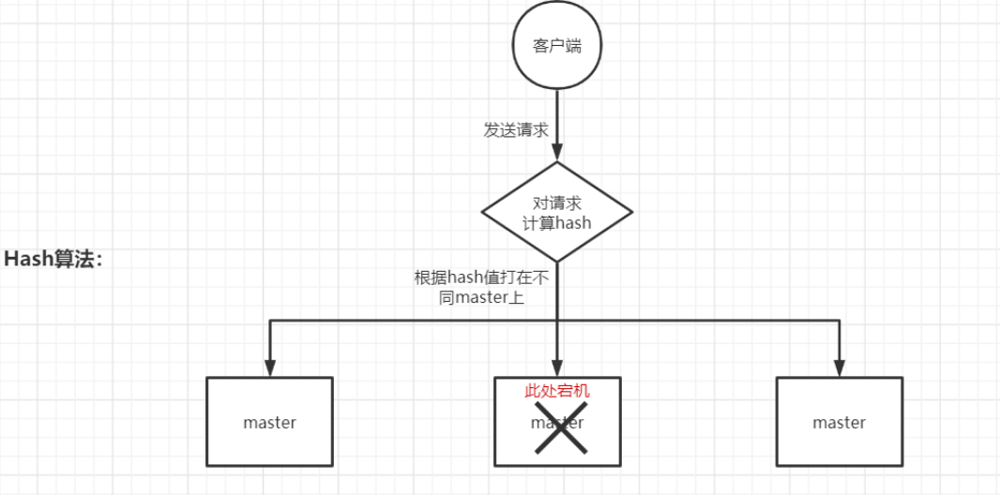
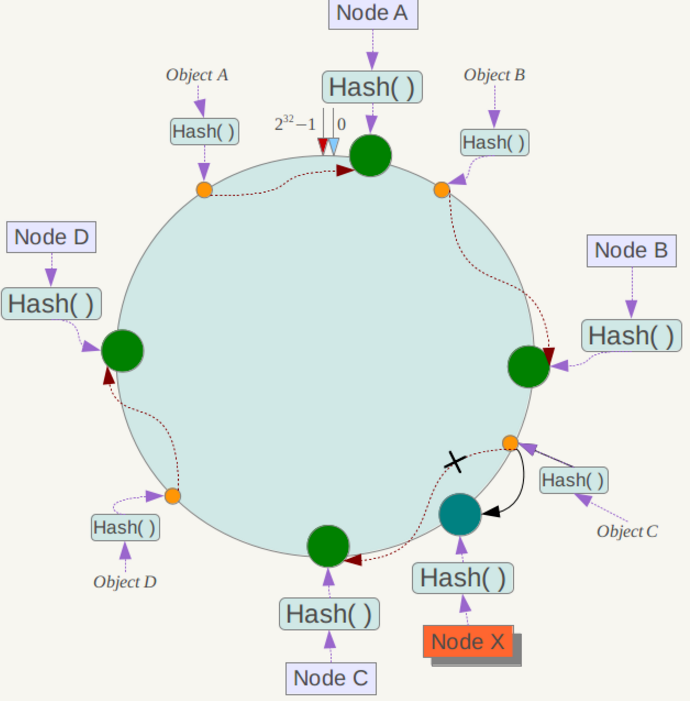
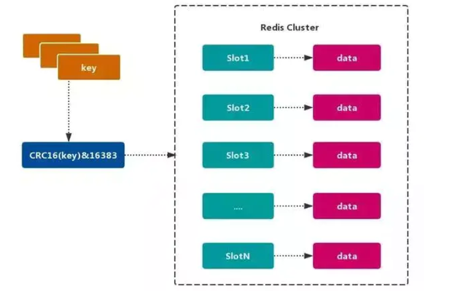

# 【大话Java面试】-如何通俗易懂的理解Redis的分布式寻址算法hash slot？

**分布式寻址算法：**

- [hash算法(大量缓存重建)](https://codingchaozhang.blog.csdn.net/article/details/109616834)；
- [一致性hash算法(自动缓存迁移) + 虚拟节点(自动负载均衡)](https://codingchaozhang.blog.csdn.net/article/details/109737335)；
- redis cluster的hash slot算法

## 1.hash算法

来了个请求，首先对key计算hash值，然后对节点数取模，之后将请求打在不同的master节点上。

**存在的问题**

一旦某一个master节点宕机，所有新请求都会基于最新的剩余master节点数去取模，而取不到有效缓存，导致大量的流量涌入数据库。

## 2.一致性哈希算法

将整个hash值空间组织成一个虚拟的圆环，整个空间按顺时针方向组织，下一步将各个master结点（使用服务器的ip或主机名）进行hash。这样就能确定每个结点在其哈希环上的位置。

首先计算数据的hahs值，从而确定此数据在环上的位置，从此位置沿顺时针“行走”，遇到的第一个master结点就是key所在的位置。

**优势**

在一致性哈希算法中，如果一个结点挂了，受影响的数据仅仅是此节点到环空间前一个结点（沿着逆时针方向行走遇到的第一个结点）之间的数据，其它不受影响。增加一个节点也同理。

**存在的问题**

一致性哈希算法在节点太少时，容易因为节点分布不均匀而造成缓存热点的问题。

**应对方案**

为了解决这种热点问题，一致性hash算法引入了虚拟节点机制，即对每一个结点计算多个hash。每个计算结果位置的都放置一个虚拟结点。这样就实现了数据的均匀分布了，负载均衡了。

## 3.redis cluster的hash slot算法(虚拟桶)

redis cluster有固定的16384个hash slot，对每个key计算CRC16(循环冗余检验码)，然后对16384取模，可以获取key对应的hash slot。

redis cluster中每个master都会持有部分slot，比如有3个master的话，那么可能每个master持有5000多个hash slot，而有了hash slot之后让node的增加和移出很简单：

- 增加一个master，就让其他master的hash slot移动部分过去；
- 减少一个master，就将它的hash slot移动到其他master上去；

**优势**

移动hash slot的成本是非常低的。任何一台机器宕机，其余结点不受影响的。因为key找的是hash slot，而不是机器。

