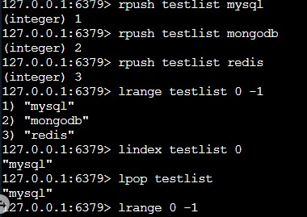
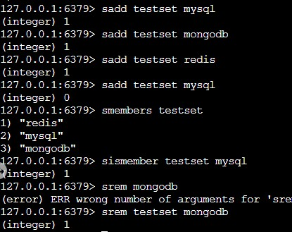
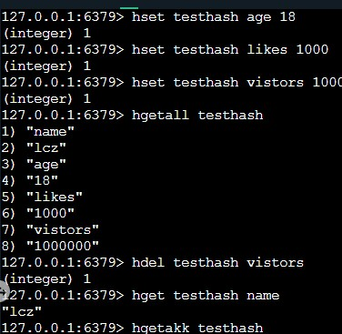
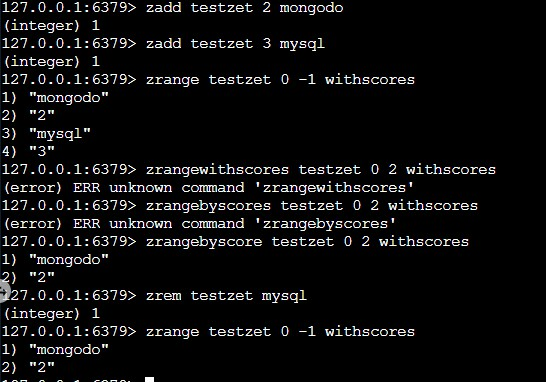

# 初识Redis（Python）


Redis是一个高性能内存型数据库，由`Salvatore Sanfilippo`创建，拥有着丰富的特性和数据结构。

# 一、Redis的简介

## 1.1 Redis的自我介绍

`Redis`是一个速度非常快的非关系型数据库(`non-relational database`), 它可以存储键(`key`)和五种不同类型的值(`value`)之间的映射(`mapping`), 可基于内存存储亦可持久化到硬盘的日志型，`key-value`数据库。

## 1.2 Redis与其它数据库对比

`Redis`属于`NoSql`,不同于关系型数据库`MySql`,它不使用表。其中`NoSQL（Not Only SQL）`其是泛指非关系型数据库，主要分为四类：`键值(key-value)存储数据库、列存储数据库、文档型数据库、图形数据库`。

下面给出常用的数据库与缓存服务对比

| 名称        | 类型                             | 数据存储选型                                       | 查询类型                                               |
| ----------- | -------------------------------- | -------------------------------------------------- | ------------------------------------------------------ |
| `Redis`     | 基于内存的非关系型数据库         | 字符串、列表、集合、哈希、有序集合                 | 针对数据类型有专属命令，另有批量操作和不完全的事务支持 |
| `MySQL`     | 关系型数据库                     | 查询、插入、更新、删除、内置函数、自定义存储过程等 | 支持 `ACID` 性质、复制等                               |
| `MongoDB`   | 基于硬盘的非关系型文档存储数据库 | 创建、读取、更新、删除、条件查询等                 | 复制、分片、空间索引等                                 |
| `memcached` | 基于内存的键值缓存               | 创建、读取、更新、删除等                           | 多线程支持                                             |

## 1.3 Redis特性

`Redis`是内存型数据库，需要考虑当服务器被关闭时，服务器存储的数据是否能保留。Redis拥有两种不同形式的持久化方法，即将数据写入硬盘：

- `RDB持久化`
  - 在指定的时间间隔内生成数据集的时间点快照
- `AOF持久化`
  - 记录服务器执行的所有写操作命令
  - 新命令会被追加到文件的末尾
  - 在服务器启动时，通过重新执行这些命令还原数据集

此外，`Redis`提供主从复制特性：

- 执行复制的从服务器连接主服务器
  - 接收主服务器发送的初始副本
  - 接收主服务器执行的所有写命令
- 在从服务器执行所有写命令，实时更新数据库
- 读命令可以向任意一个从服务器发送

# 二、安装Redis

- 获取并安装`make`等一系列构建工具

```shell
sudo apt-get update
sudo apt-get install make gcc python-dev
```

- 安装Redis服务端

```shell
# 从 https://redis.io/download 下载最新的稳定版本 Redis 源码
wget -q http://download.redis.io/releases/redis-5.0.0.tar.gz
#  解压源码，编译、安装并启动 Redis
tar -xzf redis-5.0.0.tar.gz
cd redis-5.0.0
# 注意观察编译消息，最后不应该产生任何错误（`Error`）
~/redis-5.0.0:$ make
# 注意观察安装消息，最后不应该产生任何错误（`Error`）
~/redis-5.0.0:$ sudo make install
# 启动 Redis 服务器，注意通过日志确认 Redis 顺利启动
~/redis-5.0.0:$ redis-server redis.conf
```

- 安装Redis客户端

```shell
sudo python -m easy_install redis hiredis
```

# 三、Redis五种数据结构

`Redis`的五种数据结构分别是：

- 字符串(String)
- 列表(List)
- 集合(Set)
- 哈希(Hash)
- 有序集合(ZSET)

| 结构类型 | 存储的值                                             |
| -------- | ---------------------------------------------------- |
| `String` | 字符串、整数或浮点数                                 |
| `List`   | 一个链表，上面的每个节点都是一个字符串               |
| `Set`    | 包含若干个字符串的无序集合，且集合中的元素都是唯一的 |
| `Hash`   | 包含键值对的无序散列表                               |
| `ZSet`   | 成员中的字符串与分值的有序映射，其排序由分值决定     |

## 3.1 Redis的字符串

- `set` : 设置值
- `get`：获取值
- `del`：删除值


`Redis`的字符串可以存储三种类型的值：

- 整数
- 浮点数
- 字节串

数值操作：

| 命令          | 用法                        | 说明                              |
| ------------- | --------------------------- | --------------------------------- |
| `incr`        | `INCR key`                  | 将`key`的值加上  `1`              |
| `decr`        | `DECR key`                  | 将`key`的值减去`1`                |
| `incrby`      | `INCRBY key increment`      | 将`key`的值加上  `increment`      |
| `decrby`      | `DECRBY key decrement`      | 将`key`的值减去  `decrement`      |
| `incrbyfloat` | `INCRBYFLOAT key increment` | 将`key`的值加上浮点数 `increment` |

字符串操作

| 命令       | 用法                     | 说明                                                        |
| ---------- | ------------------------ | ----------------------------------------------------------- |
| `append`   | `append key value`       | 将`value`追加到`key`键存储的值的末尾                        |
| `getrange` | `getrange key start end` | 获取`start`到`end`的子串                                    |
| `setrange` | `setrange key start end` | 从`start`偏移量开始，将于`value`长度一致的子串设置为`value` |

## 3.2 Redis的列表

- `lpush`可将元素推入列表左侧
- `rpush`可将元素推入列表右侧
- `lpop`可将元素从列表左侧弹出
- `rpop`可将元素从列表右侧弹出
- `lindex`可获取指定位置上的元素
- `lrange`可获取指定范围的全部元素
- `rpoplpush source destination`在一个`原子时间`内，执行以下两个动作：
  - 将列表`source`中的`最右侧`元素弹出，并返回给客户端；
  - 将`source`弹出的元素推入到列表`destination`的最左侧




## 3.3 Redis的集合

集合和列表的区别在于：列表可以存储多个相同的字符串，而集合通过散列表来保证存储的字符串都是不相同的（这些散列表只有键，而没有对应的值）

- `sadd`将元素添加到集合中
- `srem`将元素从集合中移除
- `smembers`获取到元素中所有元素
- `sismember`判断一个元素是否已存在在集合中



常用集合命令 

| 命令          | 用法                              | 说明                                            |
| ------------- | --------------------------------- | ----------------------------------------------- |
| `scard`       | `scard key`                       | 返回集合`key`中元素的值                         |
| `srandmember` | `srandmember key [count]`         | 返回集合中`1`或`count`个随机元素                |
| `spop`        | `spop key`                        | 移除并返回集合中的一个随机元素                  |
| `smove`       | `smove source destination member` | 将`member`元素从`source`集合移动到`destination` |

**例子：字符串、列表、集合**

使用 `Redis `字符串、列表和集合的常用命令完成任务分配的后端处理逻辑。

```Python
#!/usr/bin/env python
#-*- coding:utf-8 -*-
import redis
conn = redis.Redis()
def task_empty():
    # 请在下面完成判断任务列表是否为空
    #********* Begin *********#
    return int(conn.llen("task_list")) == 0
    #********* End *********#
def get_task():
    # 请在下面完成获取一个任务
    #********* Begin *********#
    task = conn.rpop("task_list")
    conn.set("current_task", task)
    #********* End *********#
def get_unallocated_staff():
    # 请在下面完成获取一个未分配的员工
    #********* Begin *********#
    staff = conn.srandmember("unallocated_staff")
    conn.smove("unallocated_staff", "allocated_staff", staff)
    return staff
    #********* End *********#
def allocate_task(staff):
    # 请在下面完成分配任务
    #********* Begin *********#
    conn.append("current_task", ':' + str(staff))
    conn.lpush("task_queue", conn.get("current_task"))
    conn.set("current_task", "None")
    #********* End *********#
```


## 3.5 Redis的哈希

哈希可以存储多个键值对之间的映射。

- `hset` 插入元素
  - 第一个参数为该哈希的键名，如果该哈希不存在，则创建一个
  - 第二个参数为哈希的域名
    - 如果不存在，则创建该域，并与第三个参数的值进行映射
    - 如果存在，则使用第三个参数更新该域的值
  - 第三个参数为哈希中的值
- `hgetall` 获取到该哈希的所有域-值对
- `hget`用于获取哈希中的某一个域
- `hdel`用于删除哈希中的某一个域



常用hash命令

| 命令    | 用法                                     | 说明                                                    |
| ------- | ---------------------------------------- | ------------------------------------------------------- |
| `hmset` | `hmset key file value [field value ...]` | 同时将多个 `field-value` (域-值)对设置到哈希表 `key` 中 |
| `hmget` | `hmget key field [field ...]`            | 返回哈希表 `key` 中，一或多个给定域的值                 |
| `hdel`  | `hdel key field [field ...]`             | 删除哈希表 `key` 中的一或多个指定域                     |
| `hlen`  | `hlen key`                               | 返回哈希表 `key` 中域的数量                             |

| 命令      | 用法                          | 说明                                                   |
| --------- | ----------------------------- | ------------------------------------------------------ |
| `hexists` | `hexists key field`           | 查看哈希表 `key` 中，给定域 `field` 是否存在           |
| `hkeys`   | `hkeys key`                   | 返回哈希表 `key` 中所有域                              |
| `hvals`   | `hvals key`                   | 返回哈希表 `key` 中所有域的值                          |
| `hincrby` | `hincrby key field increment` | 为哈希表 `key` 中的域 `field` **的值**加上 `increment` |

## 3.6 Redis的有序集合

有序集合和哈希一样，也是存储键值对。

只是有序集合的键被称为成员(`member`),每个成员都是唯一的，有序集合的值被称为分值(`score`)，这个分值必须为浮点数，所以有序集合既可以通过成员访问元素，也可以通过分值来排序元素。 

- `zadd`命令将带有指定分值的成员添加到有序集合中
- `zrange`命令根据分值有序排列后的集合获取到指定范围的元素
- `zrangebyscore`命令获取指定分值范围内的元素
- `zrem`命令从有序集合中删除指定成员



常用有序集合命令

| 命令     | 用法                 | 说明                                                         |
| -------- | -------------------- | ------------------------------------------------------------ |
| `zcard`  | `zcard key`          | 返回有序集合 `key` 的成员总数                                |
| `zcount` | `zcount key min max` | 返回有序集合 `key` 中， `score` 值在 `min` 和 `max` 之间的成员数量 |
| `zrank`  | `zrank key member`   | 返回有序集合 `key` 中成员 `member` 的排名                    |
| `zscore` | `zscore key member`  | 返回有序集合 `key` 中，成员 `member` 的分值                  |

**例子：带优先级的队列系统**

用哈希和有序集合来实现带优先级的队列系统

```python
#!/usr/bin/env python
#-*- coding:utf-8 -*-

import redis

conn = redis.Redis()

# 初始化任务信息到 Redis 中
#首先我们使用哈希存储任务状态，方便我们后续查询任务状态。任务与任务状态构成域-值对，存放在 task_status 键中
def set_task_info(task_id):
    # 请在下面完成要求的功能
    #********* Begin *********#
    conn.hset("task_status",task_id,'init')
    #********* End *********#

# 将任务添加至任务队列
# 接下来我们要开始构建任务队列了，由于任务具有优先级，所以可以使用有序集合来存储队列信息，其成员是任务 ID，分值是优先级。例如：任务 1 的优先级为 2 时：
def add_task_to_queue(task_id, priority):
    # 请在下面完成要求的功能
    #********* Begin *********#
    conn.zadd('task_queue',task_id,int(priority))
    set_task_info(task_id)


    #********* End *********#

# 从任务队列中取出优先级最高的任务
def get_task():
    # 请在下面完成要求的功能
    #********* Begin *********#
    task_list_by_priority = conn.zrevrange('task_queue',0,-1)
    current_task = task_list_by_priority[0]
    conn.zrem('task_queue',current_task)
    conn.hset('task_status',current_task,'processing')

    return current_task


    #********* End *********#

```


# 四、Python与redis交互

`方法1:`

```python
# 导入 redis 模块
import redis
# 创建 redis 客户端
conn = redis.Redis()
...
# 使用完资源之后删除客户端 conn
del conn
```

`方法2:`

```python
# 导入 redis 模块
import redis
# 创建连接池
pool = redis.ConnectionPool(host='127.0.0.1', port=6379, decode_responses=True)
# 创建客户端并连接到 Redis
r = redis.Redis(connection_pool=pool)
```


`总的来说`:更倾向于第二种方法。 第一种方法需要在使用该客户端后手动删除客户端，以避免创建多个连接。而第二种方法，使用了连接池总揽多个客户端与服务端的连接，不需要手动的删除客户端，同时有效减少多个客户端连接的损耗。


# 五、案例-（微信文章投票的存储逻辑）

本次使用`Redis`构建文章投票及排序功能。

功能：

- 创建文章数据
- 实现投票
- 对文章进行排序


**1.创建文章数据**

其中

- `article`字符串存储文章的ID
- `voted:*` 集合存储文章id的投票人id
- `article:*`哈希表存储文章信息
- `time`有序集合 存储了文章id和创建时间
- `score`有序集合，存储了文章id和已投票人


将文章数据存储到`Redis`中，创建文章的步骤如下:

- 创建新的文章`id`
- 将文章作者加入到这篇文章的已投票用户名单中
- 存储文章详细信息到`Redis`中
- 将文章的发布时间和初始投票数加入到`time`和`score`两个有序集合中

```python
def post_article(r, user, title, link):

    # 创建新的文章ID，使用一个整数计数器对 article 键执行自增
    # 如果该键不存在，article 的值会先被初始化为 0
	# 然后再执行自增命令
    article_id = str(r.incr('article'))
    
    # 存储投票人
    voted = 'voted:' + article_id
    r.sadd(voted, user)
    
    # 设置过期时间
    r.expire(voted, ONE_WEEK_IN_SECONDS)
    
    now = time.time()
    article = 'article:' + article_id
    
    # 存储文章信息
    r.hmset(article, {
        'title': title,
        'link': link,
        'poster': user,
    })
    
    # 存储score和time
    r.zadd('score', article_id, 1)
    r.zadd('time', article_id, now)
    return article_id
```
**实现投票功能**

投票功能，注重文章的时效性和投票的公平性，加上一些约束条件:

- 文章发布满一个星期后，不再允许用户对该文章投票
- 一个用户对一篇文章只能投一次票

其中:

- `time`有序集合，存储文章的ID和发布时间
- `voted:*` 集合，存储已投票用户名单
- `score`有序集合，存储文章的ID和已得票数

```python
ONE_WEEK_IN_SECONDS = 7 * 24 * 60 * 60
def article_vote(r, user_id, article_id):
    # 使用 time.time() 获取当前时间
    # 减去一周的秒数，从而获取一周前的Unix时间
    cutoff = time.time() - ONE_WEEK_IN_SECONDS
    if r.zscore('time', article_id) < cutoff:
        return
    if r.sadd('voted:' + article_id, user_id):
        r.zincrby('score', article_id, 1)
```
**对文章进行排序**

需要对`评分最高的文章`和`最新发布的文章`去除数据：

- 首先根据排序方式的不同

  - 按评分排序，则从`score`有序集合中取出一定量的文章ID
  - 按时间排序，则从`time`有序集合中去除一定量的文章ID

- 构成一个有序文章信息列表，每个元素都

  - 使用`hgetall`命令，取出每篇文章的全部信息

  ```python
  def get_articles(r, start, end, order='score'):
      
      ids = r.zrevrange(order, start, end)
      articles = []
      for id in ids:
          article_data = r.hgetall(id)
          article_data['id'] = id
          articles.append(article_data)
      return articles
  ```

  

# 六、Redis中的事务

## 6.1 Redis的基本事务

`Redis`中的事务是一组命令的集合。事务和命令一样，都是`Redis`的最小执行单位。一个事务中的命令

要么都执行，要么都不执行。


`Redis `的基本事务要用到 `MULTI` 命令和 `EXEC` 命令，我们需要先执行 `MULTI` 命令，再输入我们要放在事务中的命令，最后再执行 `EXEC` 命令。在事务执行完毕之后，`Redis `才会开始处理其他客户端提交的命令。所以我们要是希望一组命令不被打断的依次执行时，也可以使用事务。

当 `Redis `接收到 `MULTI` 命令时，会将之后接收到的所有命令都放入一个队列中，直到接收到 `EXEC` 命令。然后 `Redis `再在不被打断的情况下，连续的执行队列中的命令。


### 1.排序`SORT`命令

`SORT`命令可以根据字符串、列表、集合、有序集合、哈希这`5`种键中存储的数据，**对列表、集合和有序集合进行排序**。

```shell
SORT key [BY pattern] [LIMIT offset count] [GET pattern [GET pattern ...]] [ASC | DESC] [ALPHA] [STORE destination]
```

根据`SORT`命令提供的选项，可以实现：

- 根据升序（默认）/降序进行排序
- 将元素解释为数值（默认）/二进制字符串进行排序
- 使用元素之外的其他值/指定的外部键值进行排序

### 2.Redis的键过期时间

在使用 `Redis `存储数据时，可能某些数据在一段时间后就不再有用了。这时我们可以通过 `DEL` 命令显式地删除这些无用数据，也可以通过 **Redis 的过期时间**让一个键在指定的时间后自动被删除。


在 `Redis `中可以使用 `EXPIRE` 命令设置一个键的生存时间，到时间后 `Redis `则会自动删除该键，该命令的语法为：

```shell
EXPIRE key seconds
```

如果你想知道一个键还有多久过期，则可以使用 `TTL` 命令查看键的剩余时间（单位：秒）：


## 6.2 事务例子（网络约车的后端处理逻辑）

```python
#!/usr/bin/env python
#-*- coding:utf-8 -*-
import time
import redis
conn = redis.Redis()
# 用户端发起派车请求
def request_cab(user_id, priority):
    # 请在下面完成要求的功能
    #********* Begin *********#
    if conn.hexists('request:info:' + str(user_id), 'time'):
        return
    pipe = conn.pipeline()
    pipe.lpush('cab:queue', user_id)
    pipe.hmset('request:info:' + str(user_id), {'time': time.time(), 'priority': priority})
    pipe.expire('request:info:' + str(user_id), 10 * 60)
    pipe.execute()
    #********* End *********#

    
# 平台选择优先级最高的派车请求并派车
def allocate():
    # 请在下面完成要求的功能
    #********* Begin *********#
    cab_queue = conn.sort('cab:queue', by='request:info:*->priority', desc=True)
    current_respond = cab_queue[0]
    conn.lrem('cab:queue', current_respond, 1)
    return current_respond
    #********* End *********#
# 用户端取消派车请求
def cancel_cab(user_id):
    conn.expire('request:info:' + str(user_id), 0)
    conn.lrem('cab:queue', user_id)
```

